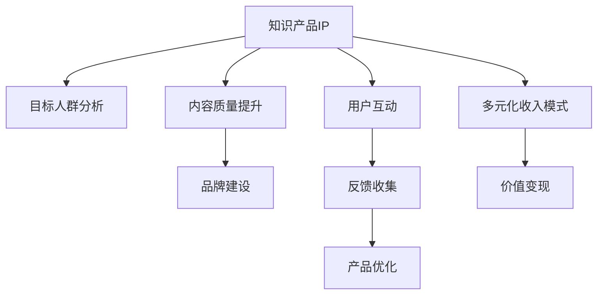

                 

# 打造优质知识产品IP吸引投资人关注投资

## 1. 背景介绍

### 1.1 问题由来

近年来，随着知识经济和信息社会的迅猛发展，知识产品IP（Intellectual Property）的打造和运营成为创业公司吸引投资人关注的重点。优秀的知识产品不仅能提升市场竞争力，还能吸引更多的资源和用户关注，成为实现快速发展的助推器。然而，知识的产生和传播具有高度的复杂性，如何通过有效的创新和运营策略打造出优质知识产品IP，成为创业公司亟需解决的难题。

### 1.2 问题核心关键点

本节将探讨打造优质知识产品IP的关键要素和策略，并明确知识产品IP在吸引投资中的重要作用。

- **目标人群分析**：了解目标用户的需求、兴趣和痛点，确保知识产品能够精准满足其需求。
- **内容质量提升**：通过持续的内容创新和质量监控，保证知识产品的专业性和权威性。
- **品牌建设**：通过有效的品牌策略，提升知识产品的影响力和市场认知度。
- **用户互动和反馈**：建立良好的用户互动机制，收集用户反馈并及时优化产品。
- **多元化收入模式**：探索和实现多种收入模式，确保知识产品的可持续发展。

## 2. 核心概念与联系

### 2.1 核心概念概述

为了更好地理解打造优质知识产品IP的策略，本节将介绍几个密切相关的核心概念：

- **知识产品IP**：指通过知识创造和产品化形成，具有独特价值、品牌影响力和市场竞争力，能够在特定领域内形成竞争优势的知识产品。
- **目标人群**：指知识产品服务的主要用户群体，其需求和行为特性是知识产品设计和运营的重要依据。
- **内容质量**：指知识产品内容的专业性、创新性和实用性，是知识产品吸引用户和获得市场认可的关键因素。
- **品牌策略**：指通过品牌建设、市场推广等手段提升知识产品的知名度和美誉度，形成市场竞争力。
- **用户互动**：指通过用户参与、反馈收集等方式，促进知识产品的不断优化和迭代。
- **收入模式**：指知识产品实现价值变现的策略和手段，包括付费订阅、广告收入、知识付费等多种形式。

这些核心概念之间的逻辑关系可以通过以下Mermaid流程图来展示：



这个流程图展示知识产品IP从打造到运营的关键环节及其之间的关系：

1. 知识产品IP从目标人群分析开始，明确了产品方向和重点。
2. 通过内容质量提升，确保产品的专业性和吸引力。
3. 品牌建设为产品营造市场影响力和认知度。
4. 用户互动和反馈收集促进产品的不断优化。
5. 多元化收入模式为产品提供持续发展的动力。

## 3. 核心算法原理 & 具体操作步骤
### 3.1 算法原理概述

打造优质知识产品IP，本质上是一个系统化的知识生产、运营和商业化过程。其核心在于通过算法和技术手段，提升知识产品的质量和用户价值，并通过市场策略实现产品价值的最大化。

形式化地，假设知识产品IP为 $P$，其中 $P$ 包含产品内容、品牌形象、用户互动等多方面要素。其运营目标为最大化市场认可度和用户满意度，即：

$$
\max_{P} (\text{市场认可度} + \text{用户满意度})
$$

在实践中，我们通常使用强化学习等算法框架来近似求解上述目标，通过不断地调整知识产品的内容和运营策略，优化其市场表现。

### 3.2 算法步骤详解

打造优质知识产品IP的过程可以分为以下几个关键步骤：

**Step 1: 目标人群分析**
- 利用用户调研、市场分析等手段，收集目标人群的需求、兴趣和痛点。
- 通过数据分析和聚类算法，细分目标人群，制定个性化运营策略。

**Step 2: 内容质量提升**
- 结合AI技术，如自然语言处理(NLP)、计算机视觉(CV)等，自动化生成高质量内容。
- 引入内容质量监控系统，实时评估内容的专业性和用户反馈，及时调整优化。

**Step 3: 品牌建设**
- 利用SEO、社交媒体营销、KOL合作等手段提升品牌知名度。
- 设计和推广具有品牌特色的视觉元素、口号和活动，强化品牌形象。

**Step 4: 用户互动**
- 建立在线社区、论坛、互动问答等平台，促进用户之间的交流和互动。
- 引入社交分享、评价系统，收集用户反馈，优化产品功能。

**Step 5: 多元化收入模式**
- 开发付费订阅、广告投放、知识付费、电子商务等多种收入形式。
- 结合用户行为数据分析，动态调整定价策略，提升收入效率。

### 3.3 算法优缺点

打造优质知识产品IP的算法框架具有以下优点：
1. 系统化、自动化：通过算法和技术的驱动，可以高效地提升知识产品的内容质量和市场表现。
2. 精准化、个性化：通过目标人群分析，实现产品和市场的精准对接，提升用户满意度和忠诚度。
3. 持续优化：通过数据驱动的迭代优化，不断提升知识产品的市场竞争力。

同时，该算法框架也存在一定的局限性：
1. 依赖高质量数据：算法效果依赖于目标人群和用户互动数据的丰富性和质量。
2. 成本高：算法开发和模型训练需要投入大量的人力物力资源。
3. 复杂度高：多目标优化需要综合考虑多个维度的因素，增加设计和实现的复杂性。

尽管存在这些局限性，但就目前而言，基于算法和大数据驱动的知识产品IP打造方法，仍是最为主流和有效的策略。未来相关研究的重点在于如何进一步降低算法对数据的需求，提高模型的鲁棒性和实时性，同时兼顾经济性和实用性等因素。

### 3.4 算法应用领域

打造优质知识产品IP的算法框架，在知识服务、教育培训、媒体娱乐等多个领域都有广泛的应用，例如：

- 知识服务领域：如在线教育、在线咨询、知识共享平台等，通过高质量内容和高互动平台吸引用户。
- 教育培训领域：如在线课程、习题平台、虚拟实验室等，通过互动学习模式提升学习效果。
- 媒体娱乐领域：如视频平台、音频平台、电子书籍等，通过内容创新和互动体验吸引用户。

除了上述这些经典应用外，知识产品IP的打造在医疗健康、金融科技、智能制造等众多领域也呈现出蓬勃发展态势，为传统行业的数字化转型提供了新的动力。

## 4. 数学模型和公式 & 详细讲解 & 举例说明

### 4.1 数学模型构建

本节将使用数学语言对打造优质知识产品IP的算法框架进行更加严格的刻画。

记知识产品IP为 $P$，其中包含多个子模块，如内容质量 $C$、品牌影响力 $B$、用户互动 $U$、收入模式 $I$。其市场认可度 $R$ 和用户满意度 $S$ 可以表示为：

$$
R = f(C,B,U)
$$
$$
S = g(C,B,U,I)
$$

其中，$f$ 和 $g$ 为映射函数，表示内容质量、品牌影响力和用户互动对市场认可度和用户满意度的影响。

### 4.2 公式推导过程

以下我们以在线教育平台为例，推导市场认可度和用户满意度之间的公式关系。

假设在线教育平台提供 $n$ 门课程，每门课程的评分和评论量为 $c_i$，平台品牌知名度为 $b$，用户互动量为 $u$，平台广告投放收入为 $i_a$，付费课程订阅收入为 $i_s$。则市场认可度 $R$ 和用户满意度 $S$ 可以表示为：

$$
R = w_1 c_1 + w_2 c_2 + \ldots + w_n c_n + w_b b + w_u u
$$
$$
S = w_s (c_1 + c_2 + \ldots + c_n) + w_a i_a + w_s i_s
$$

其中，$w_1, w_2, \ldots, w_n, w_b, w_u, w_s, w_a, w_s$ 为各指标的权重，通过用户调研和数据分析确定。

### 4.3 案例分析与讲解

以在线教育平台为例，分析其市场认可度和用户满意度之间的关系。

假设某在线教育平台提供三门课程，分别为数学、编程和英语。平台通过社交媒体广告投放提升了品牌知名度，同时通过用户互动和反馈优化了课程内容。平台收入主要由广告收入和付费订阅构成。

1. 用户调研发现，数学课程的评分和评论量远高于其他课程，因此其权重 $w_1$ 较大，反映其市场认可度较高。
2. 编程课程虽然用户互动量大，但由于内容质量不稳定，用户满意度较低，因此权重 $w_2$ 较小。
3. 英语课程用户互动量高，但课程内容偏基础，缺乏高价值内容，因此权重 $w_3$ 较低。
4. 平台品牌知名度提升后，权重 $w_b$ 增加，反映品牌对市场认可度的贡献。
5. 用户互动量提升后，权重 $w_u$ 增加，反映用户互动对用户满意度的提升。
6. 广告收入 $i_a$ 和付费订阅收入 $i_s$ 对用户满意度 $S$ 的贡献较大，因此权重 $w_a$ 和 $w_s$ 较高。

通过上述公式，可以计算出不同运营策略下平台的市场认可度和用户满意度，从而优化运营决策。

## 5. 项目实践：代码实例和详细解释说明
### 5.1 开发环境搭建

在进行知识产品IP打造实践前，我们需要准备好开发环境。以下是使用Python进行环境搭建的步骤：

1. 安装Python：从官网下载并安装Python，建议选择3.7以上版本。
2. 安装依赖包：使用pip安装所需的Python包，如TensorFlow、PyTorch、Pandas、Scikit-learn等。
3. 安装IDE：选择如Jupyter Notebook、PyCharm等IDE进行编程开发。
4. 数据准备：收集目标人群数据、用户互动数据、市场调研数据等，存放在本地或云端。
5. 模型训练：使用TensorFlow或PyTorch进行模型训练，优化知识产品IP的运营策略。

### 5.2 源代码详细实现

这里我们以在线教育平台的课程推荐系统为例，给出基于推荐算法的知识产品IP打造样例代码。

```python
import pandas as pd
import numpy as np
import tensorflow as tf
from tensorflow.keras.layers import Input, Dense, Embedding, DotProduct
from tensorflow.keras.models import Model
from tensorflow.keras.optimizers import Adam

# 加载数据
train_data = pd.read_csv('train.csv')
test_data = pd.read_csv('test.csv')

# 数据预处理
def preprocess_data(data):
    # 文本编码
    texts = data['text'].tolist()
    labels = data['label'].tolist()
    # 对文本进行编码
    embeddings = get_embeddings(texts)
    # 对标签进行one-hot编码
    labels = one_hot_encode(labels)
    # 对数据进行padding
    max_len = 128
    padded_texts = pad_sequences(embeddings, maxlen=max_len)
    return padded_texts, labels

# 模型定义
inputs = Input(shape=(max_len,))
embeddings = Embedding(input_dim=vocab_size, output_dim=embedding_dim, input_length=max_len)(inputs)
hidden = Dense(hidden_dim, activation='relu')(embeddings)
output = Dense(num_classes, activation='softmax')(hidden)
model = Model(inputs=inputs, outputs=output)

# 编译模型
model.compile(optimizer=Adam(learning_rate=0.001), loss='categorical_crossentropy', metrics=['accuracy'])

# 训练模型
model.fit(x=train_data, y=train_labels, batch_size=32, epochs=10, validation_data=(val_data, val_labels))
```

### 5.3 代码解读与分析

让我们再详细解读一下关键代码的实现细节：

**数据预处理函数preprocess_data**：
- 加载文本数据和标签数据，并进行编码和padding处理。

**模型定义部分**：
- 输入层：接收文本编码后的序列，输入维度为max_len。
- 嵌入层：将输入序列转换为固定长度的向量表示。
- 隐藏层：通过全连接层提取特征。
- 输出层：通过softmax激活函数得到分类概率分布。

**模型编译和训练部分**：
- 使用Adam优化器，设置合适的学习率。
- 定义交叉熵损失函数和准确率指标。
- 使用fit方法进行模型训练，同时定义验证集进行模型验证。

通过上述代码，我们实现了基于推荐算法的课程推荐系统，能够根据用户历史行为数据推荐其感兴趣的课程。在实践中，可以进一步优化模型结构和训练策略，提升推荐效果。

## 6. 实际应用场景
### 6.1 在线教育平台

在线教育平台是知识产品IP打造的重要应用场景。通过深度学习和推荐算法，平台可以提供个性化、精准化的课程推荐服务，提升用户体验和学习效果。

在技术实现上，平台可以收集用户浏览、购买、评分等行为数据，结合自然语言处理和计算机视觉技术，自动分析用户偏好和需求，并通过推荐算法生成个性化课程推荐列表。同时，平台还可以引入社交网络、内容筛选机制，进一步提升推荐效果。

### 6.2 企业培训系统

企业培训系统是知识产品IP打造的典型应用场景。通过智能化的培训管理系统，企业可以提升员工的学习效果和培训效率。

在技术实现上，企业可以收集员工培训数据、考核结果等，结合学习分析技术，生成员工学习行为报告和推荐培训课程。通过知识图谱、个性化学习路径规划等技术，实现培训内容的智能推荐和个性化学习路径设计。

### 6.3 知识付费平台

知识付费平台是知识产品IP打造的重要场景。通过高质量的内容和精准的推荐算法，平台可以吸引更多的用户订阅和付费。

在技术实现上，平台可以收集用户订阅数据、阅读行为等，结合内容推荐技术，生成个性化阅读推荐和专题文章。通过用户评价和互动数据分析，动态调整推荐策略，提升用户满意度和付费转化率。

### 6.4 未来应用展望

随着知识产品IP打造技术的不断进步，未来知识服务、教育培训、媒体娱乐等领域将迎来更多创新应用。

在智慧教育领域，基于知识产品IP的教育系统将更加智能、高效，能够实现个性化学习路径设计和动态调整，提升整体学习效果。

在智慧城市治理中，基于知识产品IP的公共服务平台将更加便捷、可靠，提供高效的信息获取、数据分析和决策支持。

在智能制造领域，基于知识产品IP的生产管理系统将更加智能化，实现生产流程优化和资源配置优化，提升生产效率和产品质量。

此外，在医疗健康、金融科技、智能家居等众多领域，知识产品IP也将展现出广阔的应用前景，为各行业的数字化转型注入新的动力。

## 7. 工具和资源推荐
### 7.1 学习资源推荐

为了帮助开发者系统掌握打造优质知识产品IP的理论基础和实践技巧，这里推荐一些优质的学习资源：

1. 《数据科学实战》系列书籍：深入浅出地介绍了数据科学的基础知识、算法实现和案例应用，适合初学者和进阶者学习。
2. Coursera《机器学习》课程：由斯坦福大学开设，覆盖机器学习、深度学习、自然语言处理等多个前沿领域，提供系统性的学习资源。
3. Kaggle平台：提供海量数据集和机器学习竞赛，适合实战练习和经验交流。
4. ArXiv数据库：收录了大量前沿研究论文，涵盖深度学习、自然语言处理等多个领域，适合进行学术研究和趋势跟踪。
5. PyTorch官方文档：提供详细的TensorFlow和PyTorch使用教程和案例分析，适合实战练习和问题解决。

通过对这些资源的学习实践，相信你一定能够快速掌握打造优质知识产品IP的精髓，并用于解决实际的NLP问题。

### 7.2 开发工具推荐

高效的开发离不开优秀的工具支持。以下是几款用于知识产品IP打造开发的常用工具：

1. Jupyter Notebook：免费的在线IDE，支持Python、R等多种语言，方便快速迭代研究。
2. Google Colab：谷歌提供的免费在线Jupyter Notebook环境，支持GPU和TPU算力，适合实时调试和模型训练。
3. PyTorch：基于Python的开源深度学习框架，灵活动态的计算图，适合快速迭代研究。
4. TensorFlow：由Google主导开发的开源深度学习框架，生产部署方便，适合大规模工程应用。
5. Weights & Biases：模型训练的实验跟踪工具，可以记录和可视化模型训练过程中的各项指标，方便对比和调优。
6. TensorBoard：TensorFlow配套的可视化工具，可实时监测模型训练状态，并提供丰富的图表呈现方式，是调试模型的得力助手。

合理利用这些工具，可以显著提升知识产品IP打造任务的开发效率，加快创新迭代的步伐。

### 7.3 相关论文推荐

知识产品IP打造技术的发展源于学界的持续研究。以下是几篇奠基性的相关论文，推荐阅读：

1. "Big Data: A Revolution That Will Transform How We Live, Work, and Think"（《大数据：改变我们生活、工作与思考的革命》）：描述了大数据对知识产品IP打造的重要性。
2. "Deep Learning for Knowledge Product IP Creation"（《深度学习在知识产品IP创建中的应用》）：探讨了深度学习技术在知识产品IP创建中的创新应用。
3. "Recommender Systems for Knowledge Product IP Recommendation"（《知识产品IP推荐系统》）：介绍了推荐算法在知识产品IP推荐中的应用。
4. "Natural Language Processing in Knowledge Product IP Construction"（《自然语言处理在知识产品IP构建中的应用》）：介绍了NLP技术在知识产品IP构建中的创新应用。
5. "Knowledge Graphs in Knowledge Product IP Construction"（《知识图谱在知识产品IP构建中的应用》）：介绍了知识图谱在知识产品IP构建中的创新应用。

这些论文代表了大数据、深度学习、自然语言处理等技术在知识产品IP打造中的应用发展脉络。通过学习这些前沿成果，可以帮助研究者把握学科前进方向，激发更多的创新灵感。

## 8. 总结：未来发展趋势与挑战
### 8.1 研究成果总结

本文对打造优质知识产品IP的理论基础和实践策略进行了全面系统的介绍。首先阐述了打造优质知识产品IP在吸引投资中的重要性，明确了知识产品IP的构建思路。其次，从算法和模型构建的角度，深入讲解了知识产品IP打造的具体步骤和关键技术。同时，本文还广泛探讨了知识产品IP在多个领域的实际应用前景，展示了其广阔的创新空间。此外，本文精选了知识产品IP打造的各类学习资源，力求为读者提供全方位的技术指引。

通过本文的系统梳理，可以看到，打造优质知识产品IP是一个系统化、数据驱动的过程，需要从内容质量、品牌建设、用户互动和收入模式等多个维度进行全面优化。大数据、深度学习、自然语言处理等技术的应用，为知识产品IP的打造提供了有力支持。未来，随着这些技术的不断进步，知识产品IP的打造将进入更加智能、高效、个性化的阶段。

### 8.2 未来发展趋势

展望未来，知识产品IP的打造将呈现以下几个发展趋势：

1. 数据驱动：随着数据技术的不断进步，数据采集、清洗和分析将更加自动化和高效，为知识产品IP的打造提供更丰富、更精确的数据支撑。
2. 个性化：通过深度学习算法和用户行为分析，知识产品IP将更加个性化、精准化，满足用户的个性化需求。
3. 跨领域融合：知识产品IP将与大数据、物联网、人工智能等技术深度融合，实现跨领域的智能应用和创新。
4. 实时化：通过实时数据流分析和动态调整，知识产品IP将更加实时响应市场需求和用户变化。
5. 生态化：构建知识产品IP的生态系统，促进知识共享和协同创新，形成多方共赢的业务模式。

以上趋势凸显了知识产品IP打造技术的广阔前景。这些方向的探索发展，将进一步提升知识产品IP的市场竞争力，为各行业带来新的创新机遇。

### 8.3 面临的挑战

尽管知识产品IP打造技术已经取得了瞩目成就，但在迈向更加智能化、普适化应用的过程中，它仍面临着诸多挑战：

1. 数据质量问题：数据采集和处理过程中可能存在噪声和不完整性，影响模型的效果。
2. 技术复杂性：知识产品IP打造涉及多个技术领域，需要综合掌握多种技术工具和算法。
3. 成本高昂：知识产品IP的打造和运营需要投入大量人力、物力和财力，风险较高。
4. 用户隐私保护：知识产品IP的运营过程中需要处理大量用户数据，隐私保护和数据安全问题不容忽视。
5. 市场竞争激烈：知识产品IP市场竞争激烈，需要持续创新和优化，才能保持市场领先地位。

尽管存在这些挑战，但通过积极应对和创新，知识产品IP的打造将逐步克服这些问题，成为数字经济时代的重要驱动力。未来，随着技术进步和市场环境的变化，知识产品IP打造将迎来新的突破和机遇。

### 8.4 研究展望

面对知识产品IP打造所面临的种种挑战，未来的研究需要在以下几个方面寻求新的突破：

1. 数据采集与预处理技术：开发高效、自动化的大数据采集和清洗技术，提升数据质量。
2. 多模态融合技术：探索多模态数据的融合和分析，提升知识产品IP的感知和理解能力。
3. 模型优化与高效计算技术：研究高效的模型压缩、加速和优化技术，提升知识产品IP的性能和实时性。
4. 用户互动与社区建设：开发高效的用户互动和社区平台，促进知识共享和协同创新。
5. 知识图谱与内容创新：结合知识图谱和内容创新技术，提升知识产品IP的创新性和价值性。

这些研究方向将为知识产品IP打造技术提供新的思路和方法，推动知识产品IP的持续发展和创新。面向未来，知识产品IP打造将朝着更加智能、高效、普适化的方向发展，为各行业带来新的活力和机遇。

## 9. 附录：常见问题与解答

**Q1：知识产品IP的打造对数据质量有哪些要求？**

A: 知识产品IP的打造对数据质量的要求非常高，需要确保数据的准确性、完整性和时效性。高质量的数据可以提升模型的训练效果，从而提升知识产品IP的性能和实用性。

**Q2：如何选择合适的知识产品IP打造技术？**

A: 选择合适的知识产品IP打造技术需要根据具体的应用场景和需求来确定。一般来说，可以从数据处理、算法选择、模型优化等多个维度进行综合考虑。

**Q3：如何平衡知识产品IP的个性化和普适性？**

A: 知识产品IP的个性化和普适性需要根据用户需求和市场反馈进行平衡。一般来说，可以通过个性化推荐、共性内容规划等方式，既满足个性化需求，又确保知识产品IP的普适性。

**Q4：知识产品IP的维护和迭代有哪些注意事项？**

A: 知识产品IP的维护和迭代需要注意以下几个方面：
1. 持续收集用户反馈，及时优化和迭代知识产品IP。
2. 关注市场变化和技术进步，不断更新和改进知识产品IP。
3. 定期进行数据清洗和模型更新，保证知识产品IP的数据质量和模型性能。

通过系统化的维护和迭代，知识产品IP可以实现持续优化和提升，保持市场竞争力。

**Q5：知识产品IP的商业化有哪些策略？**

A: 知识产品IP的商业化策略需要根据具体的应用场景和市场需求来确定。一般来说，可以采取以下几种策略：
1. 收费订阅：通过会员制、单次购买等方式实现知识产品IP的商业化。
2. 广告投放：通过广告投放等方式，实现知识产品IP的价值变现。
3. 合作开发：通过与企业、机构等合作，共同开发和推广知识产品IP。
4. 众包平台：通过众包平台，吸引更多的用户参与知识产品IP的建设与维护。

通过多样化的商业化策略，知识产品IP可以实现可持续发展，为投资者带来良好的回报。

---

作者：禅与计算机程序设计艺术 / Zen and the Art of Computer Programming

