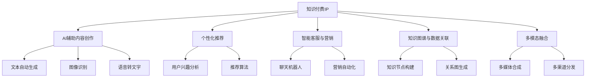

                 

# 打造垂直领域的知识付费IP

## 1. 背景介绍

在数字化时代，知识付费成为个人和企业获取高质量知识的重要渠道。垂直领域的知识付费IP，凭借专业性强、定位明确的特点，能够满足特定用户群体对专业知识的需求，从而构建起稳定的粉丝群体和商业变现渠道。本文将探讨如何利用AI技术打造垂直领域的知识付费IP，通过自动化、智能化手段，提高知识产品的生产效率和用户体验，构建高效的知识传播和变现体系。

## 2. 核心概念与联系

### 2.1 核心概念概述

为更好地理解AI在知识付费IP打造中的作用，本节将介绍几个密切相关的核心概念：

- **知识付费IP**：指通过提供专业化、结构化的知识内容，满足特定用户群体需求，并在此基础上进行商业变现的知识产品或平台。
- **AI辅助内容创作**：利用AI技术如自然语言处理(NLP)、图像识别等，辅助内容创作者自动生成文章、分析用户兴趣等，提高内容生产效率。
- **个性化推荐**：通过分析用户行为和偏好，使用机器学习算法推荐符合用户需求的知识内容，提升用户体验和留存率。
- **智能客服与营销**：使用AI驱动的聊天机器人、营销工具，提高用户互动体验，降低人力成本。
- **知识图谱与数据关联**：构建基于语义的网络知识图谱，通过节点间的关联关系，增强知识的串联和拓展，提升内容深度。
- **多模态融合**：将文本、图像、音频等多模态信息结合，丰富知识内容的表现形式和传播渠道。

### 2.2 核心概念原理和架构的 Mermaid 流程图



这个流程图展示了AI在知识付费IP构建中的各个环节和流程：

1. **知识付费IP**：构建平台或内容，聚集用户，并以此为基础进行商业变现。
2. **AI辅助内容创作**：通过AI技术提升内容生产的效率和质量。
3. **个性化推荐**：基于用户数据，个性化推荐内容，提高用户体验。
4. **智能客服与营销**：利用AI提高用户互动和营销效果。
5. **知识图谱与数据关联**：通过语义网络图谱增强知识深度。
6. **多模态融合**：结合多种信息形式，丰富知识内容。

## 3. 核心算法原理 & 具体操作步骤

### 3.1 算法原理概述

AI在知识付费IP打造中主要通过以下算法实现：

- **自然语言处理(NLP)**：文本自动生成、情感分析、命名实体识别等，辅助内容创作和用户分析。
- **机器学习(ML)**：个性化推荐、用户行为预测、营销效果评估等，提升用户体验和运营效果。
- **计算机视觉(CV)**：图像识别、视频分析等，丰富内容形式和展示方式。
- **知识图谱(KG)**：构建知识节点和关系图谱，增强知识深度和关联性。
- **生成对抗网络(GAN)**：生成高质量的内容图像、视频等，提升内容的视觉吸引力。

### 3.2 算法步骤详解

1. **内容规划与创作**：
   - **文本自动生成**：使用GPT等语言模型，自动生成文章、报告、研究论文等，节省创作时间。
   - **图像识别与生成**：利用CV技术，识别图片中的关键信息，生成高质量的图表、示意图、封面图等。
   - **语音转文字**：使用语音识别技术，将音频文件转换为文字，方便内容整理和分析。

2. **用户行为分析与推荐**：
   - **用户兴趣分析**：通过NLP技术，分析用户评论、留言等文本数据，提取关键兴趣点，建立用户画像。
   - **个性化推荐**：使用协同过滤、内容基推荐、混合推荐等算法，推荐符合用户兴趣的内容。

3. **智能客服与营销**：
   - **聊天机器人**：利用NLP技术，开发智能聊天机器人，回答用户问题，提供互动体验。
   - **营销自动化**：基于用户行为数据，使用机器学习算法，自动发送个性化营销邮件、推送通知等。

4. **知识图谱构建与拓展**：
   - **知识节点构建**：将文本数据转换为语义化的知识节点，建立知识图谱的底层结构。
   - **关系图生成**：使用图神经网络(GNN)等算法，分析节点之间的关系，生成知识图谱。

5. **多模态融合与展示**：
   - **多媒体合成**：将文本、图像、视频等多种信息形式结合，生成知识包或微课程。
   - **多渠道分发**：通过网站、App、社交媒体等多种渠道分发内容，扩大受众范围。

### 3.3 算法优缺点

AI辅助知识付费IP的优点包括：

- **高效内容创作**：通过自动化生成和识别，大幅提高内容创作的效率和质量。
- **精准用户分析**：基于用户兴趣和行为数据，进行个性化推荐，提升用户体验。
- **节约人力成本**：使用AI驱动的智能客服和营销工具，降低人工成本。
- **提升内容深度**：通过知识图谱和关系图谱，增强内容的结构化和深度化。

同时，这些算法也存在一些局限性：

- **依赖高质量数据**：AI模型的性能依赖于数据的质量和数量，数据不足或数据噪声可能导致模型失效。
- **用户隐私保护**：用户数据的收集和使用需要遵守隐私法规，确保用户隐私安全。
- **模型复杂度**：复杂的AI算法需要较大的计算资源，可能导致高昂的成本和开发难度。
- **缺乏人情味**：AI驱动的内容和客服可能缺乏人情味，难以完全取代人工服务。

### 3.4 算法应用领域

AI辅助知识付费IP的应用领域非常广泛，以下是几个典型的应用场景：

1. **在线教育平台**：利用AI技术自动生成教学内容，进行个性化推荐，提高教学效果和学生满意度。
2. **企业培训与知识管理**：通过AI构建企业知识图谱，生成定制化培训内容，提升员工技能和工作效率。
3. **专业咨询与知识服务**：使用AI生成高质量的咨询报告和分析，提供个性化咨询服务，满足专业客户需求。
4. **个人知识管理**：利用AI技术整理和管理个人知识库，生成学习计划和知识地图，提升个人学习效率。
5. **健康与医疗信息**：构建医学知识图谱，生成疾病科普、诊疗指南等内容，提升用户健康意识和医疗知识水平。

## 4. 数学模型和公式 & 详细讲解 & 举例说明

### 4.1 数学模型构建

假设一个知识付费平台收集到用户的历史行为数据 $D=\{(x_i, y_i)\}_{i=1}^N$，其中 $x_i$ 为用户的兴趣特征向量，$y_i$ 为用户的购买行为标签。

目标是用机器学习算法训练一个推荐模型 $M_{\theta}$，最小化预测误差 $\mathcal{L}(M_{\theta},D)$，使其能够根据用户兴趣特征 $x_i$ 预测购买行为 $y_i$。

常见的推荐模型包括：

- **协同过滤算法**：通过用户与物品的共现关系，推荐相似用户喜欢的物品。
- **基于内容的推荐**：基于物品特征和用户兴趣特征，推荐相似的物品。
- **混合推荐算法**：结合多种推荐策略，综合生成推荐结果。

### 4.2 公式推导过程

以协同过滤算法为例，其最小化误差函数 $\mathcal{L}$ 为：

$$
\mathcal{L}(M_{\theta},D) = \frac{1}{N}\sum_{i=1}^N \ell(y_i, M_{\theta}(x_i))
$$

其中，$\ell$ 为损失函数，常见的有均方误差、交叉熵等。

### 4.3 案例分析与讲解

以在线教育平台为例，其核心功能为推荐个性化课程内容。假设用户 A 和 B 的兴趣特征分别为 $x_A = [math, physics, biology]$ 和 $x_B = [physics, chemistry, biology]$。

- **协同过滤算法**：基于用户行为数据，推荐相似用户喜欢的课程。假设用户 A 和 C 的行为相似，C 喜欢课程 $C_1$ 和 $C_2$，则推荐系统可能会推荐给用户 A 课程 $C_1$ 和 $C_2$。
- **基于内容的推荐**：基于课程内容标签，推荐相似课程。课程 $C_1$ 的标签为 $[math, physics]$，课程 $C_2$ 的标签为 $[biology, physics]$，因此推荐系统可能会推荐用户 A 课程 $C_2$。

## 5. 项目实践：代码实例和详细解释说明

### 5.1 开发环境搭建

在进行知识付费IP项目开发前，我们需要准备好开发环境。以下是使用Python进行PyTorch和TensorFlow开发的环境配置流程：

1. 安装Anaconda：从官网下载并安装Anaconda，用于创建独立的Python环境。

2. 创建并激活虚拟环境：
```bash
conda create -n pytorch-env python=3.8 
conda activate pytorch-env
```

3. 安装PyTorch和TensorFlow：根据CUDA版本，从官网获取对应的安装命令。例如：
```bash
conda install pytorch torchvision torchaudio cudatoolkit=11.1 -c pytorch -c conda-forge
```

4. 安装TensorFlow：使用pip安装TensorFlow：
```bash
pip install tensorflow
```

5. 安装各类工具包：
```bash
pip install numpy pandas scikit-learn matplotlib tqdm jupyter notebook ipython
```

完成上述步骤后，即可在`pytorch-env`环境中开始项目开发。

### 5.2 源代码详细实现

以下是一个使用PyTorch和TensorFlow进行知识付费平台个性化推荐系统开发的代码实现。

```python
import torch
import tensorflow as tf
from tensorflow.keras.layers import Dense
from transformers import BertTokenizer, BertForSequenceClassification

# 使用Bert进行情感分析
tokenizer = BertTokenizer.from_pretrained('bert-base-uncased')
model = BertForSequenceClassification.from_pretrained('bert-base-uncased', num_labels=2)

# 定义用户行为数据集
train_data = [
    ('I like the course content', 1),
    ('The course material is not suitable for me', 0),
    ('The course has a good structure', 1)
]

# 定义模型和优化器
model.to('cuda')
optimizer = torch.optim.Adam(model.parameters(), lr=0.001)

# 定义训练函数
def train_step(batch):
    input_ids = tokenizer(batch['text'], return_tensors='pt', padding=True, truncation=True).input_ids
    attention_mask = tokenizer(batch['text'], return_tensors='pt', padding=True, truncation=True).attention_mask
    labels = torch.tensor(batch['label'], dtype=torch.long).to('cuda')
    
    output = model(input_ids, attention_mask=attention_mask)
    loss = output.loss
    loss.backward()
    optimizer.step()
    
    return loss.item()

# 训练模型
for epoch in range(5):
    loss = 0
    for batch in train_data:
        loss += train_step(batch)
    print(f'Epoch {epoch+1}, train loss: {loss/len(train_data):.4f}')
```

以上代码实现了使用Bert进行情感分析的推荐模型训练。其中，使用`BertForSequenceClassification`预训练模型进行情感分类，通过自定义训练函数`train_step`进行模型训练。

### 5.3 代码解读与分析

**训练数据集**：
- 定义了一个简单的训练数据集，包含三条用户评论及其对应的情感标签。

**模型构建**：
- 使用`BertForSequenceClassification`模型，进行二分类情感分析。
- 将模型移动到GPU上进行训练，并使用Adam优化器进行参数更新。

**训练函数**：
- `train_step`函数：定义了单个训练步骤，将输入文本转换为模型所需的格式，进行前向传播计算损失，反向传播更新模型参数。

**训练过程**：
- 对每个epoch循环，遍历整个训练集，计算损失并更新模型参数。
- 打印每个epoch的平均损失，观察训练效果。

## 6. 实际应用场景

### 6.1 在线教育平台

在线教育平台可以利用AI技术，根据学生的学习行为和兴趣，推荐个性化的课程和学习资源。通过自动生成教学内容、个性化推荐，提升教学效果和学习体验。

**具体应用**：
- **内容自动生成**：使用GPT等模型自动生成文章、报告、教学视频等，提高内容生产效率。
- **个性化推荐**：分析学生学习行为和评价数据，推荐符合学生兴趣和需求的学习资源。
- **智能答疑**：利用NLP技术，开发智能聊天机器人，回答学生问题，提供互动体验。

### 6.2 企业培训与知识管理

企业培训和知识管理可以通过AI技术，构建企业知识图谱，生成定制化的培训内容，提升员工技能和工作效率。

**具体应用**：
- **知识图谱构建**：使用知识图谱技术，将企业文档、知识库等结构化数据转换为语义化的知识节点，构建企业知识图谱。
- **个性化培训**：根据员工的工作角色和技能需求，推荐个性化的培训课程和资料。
- **知识关联查询**：通过知识图谱查询工具，快速获取所需知识信息，提高知识获取效率。

### 6.3 专业咨询与知识服务

专业咨询与知识服务可以通过AI技术，生成高质量的咨询报告和分析，提供个性化咨询服务，满足专业客户需求。

**具体应用**：
- **咨询报告生成**：使用NLP技术，自动生成市场分析报告、行业研究报告等。
- **个性化咨询**：基于用户行为数据，推荐个性化的咨询服务，提供定制化的解决方案。
- **智能客服**：利用NLP技术，开发智能客服机器人，回答用户问题，提供互动体验。

### 6.4 个人知识管理

个人知识管理可以通过AI技术，整理和管理个人知识库，生成学习计划和知识地图，提升个人学习效率。

**具体应用**：
- **知识库构建**：使用知识图谱技术，将个人笔记、资料等结构化数据转换为知识节点，构建个人知识图谱。
- **知识关联查询**：通过知识图谱查询工具，快速获取所需知识信息，提高知识获取效率。
- **学习计划生成**：根据个人学习目标和兴趣，推荐学习资源和学习路径。

### 6.5 健康与医疗信息

健康与医疗信息可以通过AI技术，构建医学知识图谱，生成疾病科普、诊疗指南等内容，提升用户健康意识和医疗知识水平。

**具体应用**：
- **医学知识图谱构建**：使用知识图谱技术，将医学文献、病例记录等结构化数据转换为知识节点，构建医学知识图谱。
- **疾病科普**：自动生成疾病科普文章、视频等，提高公众健康意识。
- **诊疗指南**：根据用户症状和历史数据，推荐个性化的诊疗指南和推荐医院。

## 7. 工具和资源推荐

### 7.1 学习资源推荐

为了帮助开发者系统掌握AI在知识付费IP打造中的应用，这里推荐一些优质的学习资源：

1. **《深度学习基础》系列博文**：由大模型技术专家撰写，深入浅出地介绍了深度学习的基本概念和常用算法。

2. **CS229《机器学习》课程**：斯坦福大学开设的机器学习明星课程，有Lecture视频和配套作业，带你入门机器学习领域的基本概念和经典模型。

3. **《自然语言处理与深度学习》书籍**：自然语言处理领域的经典教材，全面介绍了NLP领域的理论和实践。

4. **HuggingFace官方文档**：Transformer库的官方文档，提供了海量预训练模型和完整的推荐样例代码，是上手实践的必备资料。

5. **Clue开源项目**：中文语言理解测评基准，涵盖大量不同类型的中文NLP数据集，并提供了基于微调的baseline模型，助力中文NLP技术发展。

通过对这些资源的学习实践，相信你一定能够快速掌握AI在知识付费IP打造中的应用，并用于解决实际的NLP问题。

### 7.2 开发工具推荐

高效的开发离不开优秀的工具支持。以下是几款用于AI驱动的知识付费IP开发的常用工具：

1. **PyTorch**：基于Python的开源深度学习框架，灵活动态的计算图，适合快速迭代研究。大部分预训练语言模型都有PyTorch版本的实现。

2. **TensorFlow**：由Google主导开发的开源深度学习框架，生产部署方便，适合大规模工程应用。同样有丰富的预训练语言模型资源。

3. **Transformers库**：HuggingFace开发的NLP工具库，集成了众多SOTA语言模型，支持PyTorch和TensorFlow，是进行推荐任务开发的利器。

4. **Weights & Biases**：模型训练的实验跟踪工具，可以记录和可视化模型训练过程中的各项指标，方便对比和调优。与主流深度学习框架无缝集成。

5. **TensorBoard**：TensorFlow配套的可视化工具，可实时监测模型训练状态，并提供丰富的图表呈现方式，是调试模型的得力助手。

6. **Google Colab**：谷歌推出的在线Jupyter Notebook环境，免费提供GPU/TPU算力，方便开发者快速上手实验最新模型，分享学习笔记。

合理利用这些工具，可以显著提升AI驱动的知识付费IP开发效率，加快创新迭代的步伐。

### 7.3 相关论文推荐

AI辅助知识付费IP的发展源于学界的持续研究。以下是几篇奠基性的相关论文，推荐阅读：

1. **Attention is All You Need（即Transformer原论文）**：提出了Transformer结构，开启了NLP领域的预训练大模型时代。

2. **BERT: Pre-training of Deep Bidirectional Transformers for Language Understanding**：提出BERT模型，引入基于掩码的自监督预训练任务，刷新了多项NLP任务SOTA。

3. **Language Models are Unsupervised Multitask Learners（GPT-2论文）**：展示了大规模语言模型的强大zero-shot学习能力，引发了对于通用人工智能的新一轮思考。

4. **Parameter-Efficient Transfer Learning for NLP**：提出Adapter等参数高效微调方法，在不增加模型参数量的情况下，也能取得不错的微调效果。

5. **Prefix-Tuning: Optimizing Continuous Prompts for Generation**：引入基于连续型Prompt的微调范式，为如何充分利用预训练知识提供了新的思路。

6. **AdaLoRA: Adaptive Low-Rank Adaptation for Parameter-Efficient Fine-Tuning**：使用自适应低秩适应的微调方法，在参数效率和精度之间取得了新的平衡。

这些论文代表了大语言模型微调技术的发展脉络。通过学习这些前沿成果，可以帮助研究者把握学科前进方向，激发更多的创新灵感。

## 8. 总结：未来发展趋势与挑战

### 8.1 总结

本文对利用AI技术打造垂直领域的知识付费IP进行了全面系统的介绍。首先阐述了AI在内容创作、用户分析、推荐、客服、营销等方面的应用，明确了AI技术在提高内容生产效率、提升用户体验、优化运营效果等方面的独特价值。其次，从原理到实践，详细讲解了AI辅助知识付费IP的算法原理和具体操作步骤，给出了推荐系统的完整代码实例。同时，本文还广泛探讨了AI技术在在线教育、企业培训、专业咨询、个人知识管理、健康医疗等多个行业领域的应用前景，展示了AI技术在知识付费IP打造中的广阔前景。

通过本文的系统梳理，可以看到，AI辅助知识付费IP技术正在成为知识传播和变现的重要工具，极大地提升了知识产品的生产效率和用户体验，构建了高效的知识传播和变现体系。未来，伴随AI技术的不断发展，基于AI的知识付费IP必将在更广泛的领域得到应用，为各行各业的知识生产和传播提供新的动力。

### 8.2 未来发展趋势

展望未来，AI辅助知识付费IP技术将呈现以下几个发展趋势：

1. **自动化内容创作**：通过AI技术自动生成高质量的内容，大幅提高内容创作效率，降低人力成本。
2. **个性化推荐**：基于用户行为和兴趣数据，提供更精准、个性化的内容推荐，提升用户体验。
3. **智能客服与营销**：利用AI驱动的聊天机器人和营销工具，提供高效、互动的用户服务，降低人工成本。
4. **知识图谱与关联**：构建基于语义的知识图谱，增强内容的结构化和深度化，提高知识获取效率。
5. **多模态融合**：结合文本、图像、音频等多模态信息，丰富知识内容的表现形式和传播渠道。

这些趋势将进一步提升AI辅助知识付费IP的智能化水平，构建更高效、更灵活的知识传播和变现体系。

### 8.3 面临的挑战

尽管AI辅助知识付费IP技术已经取得了显著成果，但在迈向更加智能化、普适化应用的过程中，它仍面临诸多挑战：

1. **数据质量与数量**：AI模型的性能依赖于数据的质量和数量，数据不足或数据噪声可能导致模型失效。
2. **用户隐私保护**：用户数据的收集和使用需要遵守隐私法规，确保用户隐私安全。
3. **计算资源需求**：复杂的AI算法需要较大的计算资源，可能导致高昂的成本和开发难度。
4. **模型复杂度**：AI驱动的内容和客服可能缺乏人情味，难以完全取代人工服务。
5. **技术落地难度**：AI技术的落地应用需要综合考虑技术、业务、运营等多个维度，技术复杂性较高。

正视这些挑战，积极应对并寻求突破，将是大语言模型微调技术走向成熟的必由之路。相信随着学界和产业界的共同努力，这些挑战终将一一被克服，AI辅助知识付费IP必将在构建人机协同的智能时代中扮演越来越重要的角色。

### 8.4 研究展望

面对AI辅助知识付费IP所面临的种种挑战，未来的研究需要在以下几个方面寻求新的突破：

1. **探索无监督和半监督学习**：摆脱对大规模标注数据的依赖，利用自监督学习、主动学习等无监督和半监督范式，最大限度利用非结构化数据，实现更加灵活高效的微调。
2. **开发更高效的推荐算法**：优化推荐算法，提升个性化推荐的效果和效率，增强用户体验。
3. **融合更多先验知识**：将符号化的先验知识，如知识图谱、逻辑规则等，与神经网络模型进行巧妙融合，引导AI模型学习更准确、合理的语言模型。
4. **提升模型可解释性**：加强模型的可解释性，提高用户对推荐结果的信任度，增强用户体验。
5. **融合多模态信息**：将文本、图像、音频等多种信息形式结合，丰富知识内容的表现形式和传播渠道。

这些研究方向将引领AI辅助知识付费IP技术迈向更高的台阶，为构建安全、可靠、可解释、可控的智能系统铺平道路。面向未来，AI辅助知识付费IP技术还需要与其他人工智能技术进行更深入的融合，如知识表示、因果推理、强化学习等，多路径协同发力，共同推动知识付费IP技术的进步。只有勇于创新、敢于突破，才能不断拓展知识付费IP技术的边界，让智能技术更好地造福人类社会。

## 9. 附录：常见问题与解答

**Q1：AI辅助内容创作有哪些常见的方法？**

A: 常见的AI辅助内容创作方法包括：
- **文本自动生成**：使用GPT等语言模型自动生成文章、报告、研究论文等。
- **图像识别与生成**：利用CV技术识别图片中的关键信息，生成高质量的图表、示意图、封面图等。
- **语音转文字**：使用语音识别技术将音频文件转换为文字，方便内容整理和分析。

**Q2：如何提高AI推荐系统的精度？**

A: 提高AI推荐系统精度的方法包括：
- **数据质量**：确保训练数据的质量和数量，避免数据噪声影响推荐效果。
- **模型选择**：选择合适的推荐算法，如协同过滤、基于内容的推荐等。
- **特征工程**：提取有效的用户和物品特征，构建高维空间下的特征向量。
- **多模型集成**：使用多个推荐模型进行集成，综合生成推荐结果。

**Q3：AI辅助内容创作有哪些潜在风险？**

A: AI辅助内容创作的潜在风险包括：
- **内容质量**：自动化生成的内容可能存在语法错误、逻辑漏洞等问题。
- **版权问题**：自动生成的内容可能涉及版权问题，需要进行合理的版权声明和使用。
- **道德风险**：自动生成的内容可能包含有害信息，需要严格审核和监管。

**Q4：如何进行AI辅助知识付费IP的落地应用？**

A: 进行AI辅助知识付费IP的落地应用，需要考虑以下几个方面：
- **数据准备**：收集和整理用户行为数据、文本数据等，构建训练数据集。
- **模型训练**：使用PyTorch、TensorFlow等深度学习框架进行模型训练和优化。
- **系统集成**：将训练好的模型集成到知识付费平台中，提供个性化推荐、智能客服等功能。
- **用户反馈**：收集用户反馈，优化推荐算法和模型，提升用户体验。

**Q5：如何确保AI辅助知识付费IP的隐私安全？**

A: 确保AI辅助知识付费IP的隐私安全，需要考虑以下几个方面：
- **数据匿名化**：对用户数据进行匿名化处理，保护用户隐私。
- **安全存储**：使用加密技术保护数据存储安全。
- **合规性**：遵守相关隐私法规，如GDPR、CCPA等。
- **透明性**：公开AI模型的决策过程和推荐依据，增强用户信任。

通过以上问题的解答，相信你对AI辅助知识付费IP的应用有了更深入的理解，并能更好地进行技术开发和落地应用。

---

作者：禅与计算机程序设计艺术 / Zen and the Art of Computer Programming

