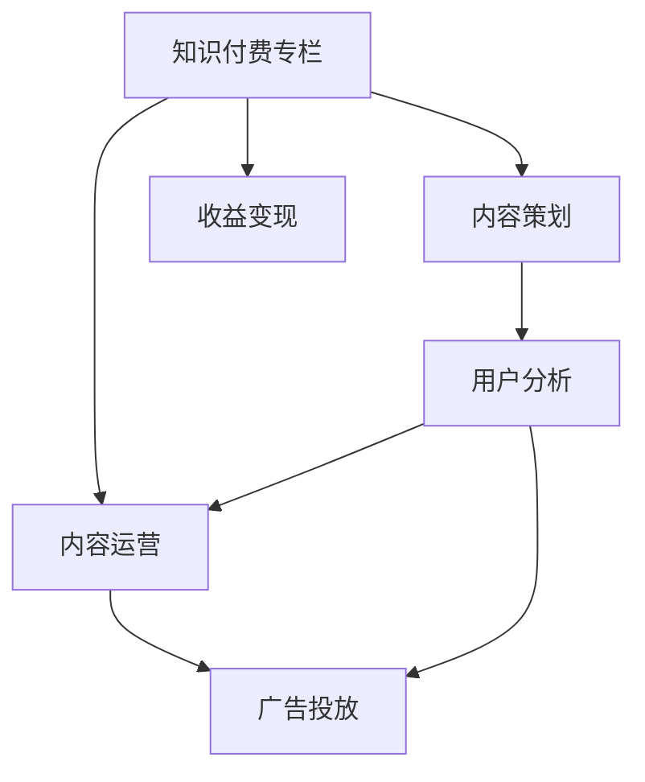

                 

# 打造知识付费专栏:内容策划与运营

> 关键词：知识付费,内容策划,内容运营,用户分析,广告投放,收益变现

## 1. 背景介绍

### 1.1 问题由来
随着知识经济时代的到来，知识付费已成为互联网行业的重要增长点。各类知识付费平台如雨后春笋般涌现，成为信息时代知识传播的重要渠道。在众多的知识付费平台中，内容质量与运营能力成为平台的核心竞争力，直接关系到用户增长、留存与付费转化。

然而，知识付费领域同样面临诸多挑战：
1. 内容质量难以保证。内容的泛化性和权威性直接影响用户黏性，缺乏优质的内容会让平台失去竞争优势。
2. 运营策略亟需优化。平台的留存率和转化率往往取决于内容的个性化推荐和运营策略的精准度。
3. 收益模式单一。当前的收益模式主要依赖用户订阅和付费，难以覆盖更多场景和用户。

如何打造具有高价值、高吸引力的知识付费专栏，是所有知识付费平台都需面对的核心问题。本文将从内容策划与运营两个方面，阐述如何构建用户满意的知识付费产品，并最终实现变现。

### 1.2 问题核心关键点
核心问题可归纳为：

1. 如何进行内容策划，实现内容的创新与多样性。
2. 如何制定有效的运营策略，提升用户留存和转化率。
3. 如何构建多元化的收益模式，增加平台收入。
4. 如何进行精准的用户分析与画像构建，提升个性化推荐效果。
5. 如何利用广告投放，实现高效的用户获取与转化。
6. 如何平衡收益与用户体验，避免过度商业化。

解决以上问题，需要从内容策划、运营策略、用户分析、收益模式等多个维度综合施策，构建起一个良性循环的生态系统。

## 2. 核心概念与联系

### 2.1 核心概念概述

- **知识付费专栏**：指以知识为核心的付费内容产品，涵盖各类专业的知识领域，如金融、科技、教育、心理学等。
- **内容策划**：指根据用户需求和平台定位，规划、设计和组织内容的过程，确保内容的丰富性和多样性。
- **内容运营**：指通过数据分析和用户行为研究，对内容进行精准推送、用户互动和效果评估，提升用户满意度和平台活跃度。
- **用户分析**：指通过对用户行为和偏好的数据分析，构建用户画像，为内容推荐和个性化服务提供依据。
- **广告投放**：指通过精准投放广告，实现高效的用户获取和转化，提升平台收益。
- **收益变现**：指通过多样化的变现方式，如会员订阅、课程销售、广告收入等，实现平台的商业价值。

这些核心概念之间的逻辑关系可以通过以下Mermaid流程图来展示：



这个流程图展示了我们打造知识付费专栏的核心过程：

1. 内容策划确定专栏内容和形式，确保内容的丰富性和多样性。
2. 内容运营通过数据分析和用户行为研究，提升用户满意度和平台活跃度。
3. 用户分析通过对用户行为和偏好的数据分析，构建用户画像，为内容推荐和个性化服务提供依据。
4. 广告投放利用广告投放实现高效的用户获取和转化。
5. 收益变现通过多样化的变现方式，实现平台的商业价值。

## 3. 核心算法原理 & 具体操作步骤

### 3.1 算法原理概述

知识付费专栏的内容策划与运营，本质上是一个数据驱动的内容推荐与用户交互过程。其核心思想是：通过数据分析和用户行为研究，发现用户潜在需求，设计合适的内容产品和运营策略，从而提升用户满意度和平台收益。

具体而言，主要包括以下几个关键步骤：

1. 内容策划：根据用户需求和市场趋势，确定专栏的主题、形式和内容。
2. 内容创作：邀请专业作者或机构，创作高质量、有深度的内容，确保内容的权威性和专业性。
3. 用户分析：通过用户行为数据和反馈，构建用户画像，发现用户的兴趣和偏好。
4. 内容运营：根据用户画像和行为数据，设计个性化的内容推荐策略，提升用户粘性和转化率。
5. 广告投放：通过精准的广告投放，实现高效的用户获取和转化。
6. 收益变现：通过多样化收益方式，实现平台的商业价值。

### 3.2 算法步骤详解

以下详细介绍各个步骤的详细内容：

**Step 1: 内容策划**

1. **确定主题**：
   - 分析市场需求和用户兴趣，选择具有较高市场潜力和用户需求的主题。
   - 可以通过用户调研、市场分析和热点趋势预测等方式，确定专栏主题。

2. **形式设计**：
   - 确定内容的具体形式，如单篇文章、系列课程、视频讲解等。
   - 根据主题和用户需求，设计适合的内容形式，提升用户接受度和粘性。

3. **内容规划**：
   - 制定内容大纲和制作计划，确保内容的质量和进度。
   - 邀请专业作者或机构，合作创作高质量内容，确保内容的权威性和专业性。

**Step 2: 内容创作**

1. **作者选择**：
   - 根据主题和内容形式，选择具有专业背景和写作能力的作者。
   - 建立作者合作机制，确保内容的持续输出和高质量。

2. **内容创作**：
   - 作者按照大纲进行内容创作，确保内容的深度和广度。
   - 内容创作过程中，与平台保持密切沟通，确保内容符合平台标准和用户需求。

3. **内容审核**：
   - 对内容进行严格的审核，确保内容的准确性、权威性和合法性。
   - 引入第三方审核机制，确保内容质量。

**Step 3: 用户分析**

1. **数据收集**：
   - 收集用户行为数据，如浏览历史、搜索关键词、购买记录等。
   - 利用平台的用户数据，分析用户兴趣和偏好，构建用户画像。

2. **画像构建**：
   - 根据用户数据，构建详细的用户画像，包括兴趣标签、阅读偏好、行为习惯等。
   - 利用机器学习和数据挖掘技术，提升画像的准确性和全面性。

3. **行为分析**：
   - 对用户行为数据进行分析，发现用户的行为模式和需求。
   - 通过行为分析，优化内容推荐和运营策略，提升用户满意度。

**Step 4: 内容运营**

1. **推荐算法设计**：
   - 根据用户画像和行为数据，设计个性化的内容推荐算法。
   - 引入协同过滤、深度学习等技术，提升推荐算法的效果和精度。

2. **内容推送**：
   - 利用推荐算法，将内容推送给用户，提升用户粘性和互动性。
   - 设计多种形式的推荐机制，如头条推荐、个性化频道等。

3. **用户互动**：
   - 设计互动机制，鼓励用户参与评论、点赞、分享等。
   - 及时回应用户反馈，提升用户互动体验。

**Step 5: 广告投放**

1. **广告策略设计**：
   - 根据用户画像和行为数据，设计精准的广告投放策略。
   - 引入A/B测试等方法，优化广告投放效果。

2. **广告投放执行**：
   - 通过程序化广告平台，进行精准的广告投放。
   - 实时监测广告效果，优化广告投放策略。

3. **效果评估**：
   - 对广告投放效果进行评估，包括点击率、转化率、投资回报率等。
   - 根据评估结果，优化广告投放策略，提升广告效果。

**Step 6: 收益变现**

1. **收益模式设计**：
   - 设计多样化的收益模式，如会员订阅、课程销售、广告收入等。
   - 引入创新型的变现方式，提升平台收益。

2. **变现策略实施**：
   - 实施收益模式，确保收益的可持续性。
   - 建立收益分配机制，激励内容创作者和用户。

3. **收益管理**：
   - 对收益进行管理和监控，确保收益的透明度和公平性。
   - 定期分析收益数据，优化收益策略。

### 3.3 算法优缺点

知识付费专栏的内容策划与运营方法具有以下优点：

1. 数据驱动：通过数据分析和用户行为研究，提升内容策划和运营的科学性和精确性。
2. 用户导向：根据用户需求和偏好，设计个性化推荐和运营策略，提升用户满意度和粘性。
3. 持续迭代：通过用户反馈和数据分析，持续优化内容推荐和运营策略，提升平台价值。

但同时，也存在以下缺点：

1. 依赖数据：需要大量的用户数据和行为数据，才能进行精准的用户画像和内容推荐。
2. 技术门槛高：涉及数据分析、机器学习等复杂技术，需要专业的技术团队支持。
3. 投入成本高：初期建设数据系统、技术团队和平台推广需要大量投入。

尽管存在这些局限性，但总体而言，数据驱动的内容策划与运营方法在知识付费领域仍具有广阔的应用前景，能够帮助平台提升内容质量和用户粘性，实现商业价值。

### 3.4 算法应用领域

基于知识付费专栏的内容策划与运营方法，已经在各类知识付费平台得到广泛应用，涵盖金融、科技、教育、心理学等多个领域。具体应用场景包括：

1. **金融专栏**：涵盖股票、基金、理财等金融领域的知识，通过专家讲座和数据分析提升用户金融知识。
2. **科技专栏**：涵盖人工智能、区块链、大数据等前沿科技领域，帮助用户掌握最新科技动态。
3. **教育专栏**：涵盖中小学教育、职业培训、语言学习等内容，提升用户的学习能力和职业素养。
4. **心理学专栏**：涵盖心理咨询、心理调节、自我提升等内容，帮助用户应对生活和工作压力。
5. **生活专栏**：涵盖健康养生、美容健身、家庭育儿等内容，提升用户的生活品质和幸福感。

此外，这些方法还被应用于企业培训、在线教育、内容营销等多个场景中，为平台带来了巨大的商业价值和社会价值。

## 4. 数学模型和公式 & 详细讲解 & 举例说明

### 4.1 数学模型构建

知识付费专栏的内容策划与运营过程可以抽象为以下数学模型：

设用户集合为 $U$，内容集合为 $C$，用户对内容的评价为 $R_{u,c}$，其中 $u$ 表示用户，$c$ 表示内容，$R_{u,c} \in [0,1]$ 表示用户对内容的满意度。

内容推荐算法 $A$ 可以通过用户画像 $P_u$ 和内容特征 $F_c$ 计算出用户对内容的兴趣度 $I_{u,c}$，其中 $P_u$ 为用户的兴趣标签和行为数据，$F_c$ 为内容的特征向量。

广告投放算法 $A_{ad}$ 可以根据用户画像 $P_u$ 和广告特征 $F_{ad}$ 计算出广告对用户的吸引力 $I_{u,ad}$，其中 $F_{ad}$ 为广告的特征向量。

收益模型 $R$ 可以通过订阅收入、课程销售和广告收入计算总收益 $T$，其中 $T = \sum_{u \in U} \sum_{c \in C} R_{u,c} \times P_c + \sum_{u \in U} I_{u,ad} \times P_{ad}$。

### 4.2 公式推导过程

以内容推荐算法为例，通过用户画像 $P_u$ 和内容特征 $F_c$ 计算用户对内容的兴趣度 $I_{u,c}$，其数学公式如下：

$$
I_{u,c} = f(P_u, F_c)
$$

其中 $f$ 为兴趣度计算函数，通常使用协同过滤、深度学习等算法。

### 4.3 案例分析与讲解

以金融专栏为例，通过用户画像和内容特征计算用户对金融知识的兴趣度：

1. **用户画像构建**：
   - 收集用户的浏览历史、搜索关键词、购买记录等数据，构建用户画像 $P_u = [\text{标签1}, \text{标签2}, ...]$。
   - 利用机器学习模型，分析用户画像中的标签和行为数据，发现用户对金融知识的兴趣。

2. **内容特征提取**：
   - 提取金融专栏的内容特征 $F_c = [\text{主题1}, \text{作者}, \text{字数}, ...]$，反映内容的专业性和权威性。
   - 利用自然语言处理技术，对内容进行情感分析和关键词提取，提升特征向量的准确性。

3. **兴趣度计算**：
   - 将用户画像和内容特征输入兴趣度计算函数 $f$，计算用户对内容的兴趣度 $I_{u,c}$。
   - 例如，某用户对金融知识有较高兴趣，同时专栏内容包含大量金融知识和专业观点，兴趣度计算结果为 $I_{u,c} = 0.9$。

## 5. 项目实践：代码实例和详细解释说明

### 5.1 开发环境搭建

在进行知识付费专栏的内容策划与运营实践前，我们需要准备好开发环境。以下是使用Python进行PyTorch和Pandas开发的环境配置流程：

1. 安装Anaconda：从官网下载并安装Anaconda，用于创建独立的Python环境。

2. 创建并激活虚拟环境：
```bash
conda create -n pytorch-env python=3.8 
conda activate pytorch-env
```

3. 安装PyTorch：根据CUDA版本，从官网获取对应的安装命令。例如：
```bash
conda install pytorch torchvision torchaudio cudatoolkit=11.1 -c pytorch -c conda-forge
```

4. 安装Pandas：
```bash
pip install pandas
```

5. 安装其他工具包：
```bash
pip install numpy scikit-learn matplotlib tqdm jupyter notebook ipython
```

完成上述步骤后，即可在`pytorch-env`环境中开始内容策划与运营实践。

### 5.2 源代码详细实现

我们以金融专栏为例，给出使用PyTorch和Pandas进行用户画像构建和内容推荐计算的Python代码实现。

首先，定义用户画像和内容特征的类：

```python
import pandas as pd
import numpy as np

class UserProfile:
    def __init__(self, user_id, labels, behaviors):
        self.user_id = user_id
        self.labels = labels
        self.behaviors = behaviors
        
class ContentFeature:
    def __init__(self, content_id, title, author, keywords, length):
        self.content_id = content_id
        self.title = title
        self.author = author
        self.keywords = keywords
        self.length = length
```

然后，定义用户画像和内容特征的数据处理函数：

```python
def load_user_data(file_path):
    data = pd.read_csv(file_path)
    user_profiles = []
    for idx, row in data.iterrows():
        user_id = row['user_id']
        labels = row['labels'].split(',')
        behaviors = row['behaviors'].split(',')
        user_profiles.append(UserProfile(user_id, labels, behaviors))
    return user_profiles

def load_content_data(file_path):
    data = pd.read_csv(file_path)
    content_features = []
    for idx, row in data.iterrows():
        content_id = row['content_id']
        title = row['title']
        author = row['author']
        keywords = row['keywords'].split(',')
        length = row['length']
        content_features.append(ContentFeature(content_id, title, author, keywords, length))
    return content_features
```

接着，定义兴趣度计算函数：

```python
def interest_degree(user_profile, content_feature):
    # 计算用户画像和内容特征的余弦相似度
    user_labels = np.array(user_profile.labels)
    content_keywords = np.array(content_feature.keywords)
    cosine_sim = np.dot(user_labels, content_keywords) / (np.linalg.norm(user_labels) * np.linalg.norm(content_keywords))
    # 计算内容长度对兴趣度的影响
    length_coeff = np.exp(-(content_feature.length / 100)) # 长度不超过100字
    # 计算最终兴趣度
    interest_degree = cosine_sim * length_coeff
    return interest_degree
```

最后，启动内容推荐系统并进行推荐：

```python
user_profiles = load_user_data('user_data.csv')
content_features = load_content_data('content_data.csv')

def recommend_content(user_profile, content_features, top_k=5):
    # 计算用户对每个内容的兴趣度
    interest_degrees = [interest_degree(user_profile, content_feature) for content_feature in content_features]
    # 按兴趣度排序，返回top_k条内容
    sorted_degrees = sorted(zip(interest_degrees, content_features), key=lambda x: x[0], reverse=True)
    top_k_contents = [content[1] for content in sorted_degrees[:top_k]]
    return top_k_contents

# 假设某个用户进行金融专栏内容的推荐
user_id = 'user123'
user_profile = user_profiles[user_id]
recommended_contents = recommend_content(user_profile, content_features)
print(recommended_contents)
```

以上就是使用PyTorch和Pandas进行用户画像构建和内容推荐计算的完整代码实现。可以看到，PyTorch和Pandas的强大功能使得内容推荐过程变得简洁高效。

### 5.3 代码解读与分析

让我们再详细解读一下关键代码的实现细节：

**UserProfile类**：
- `__init__`方法：初始化用户画像的各个属性，如用户ID、兴趣标签和行为数据。

**ContentFeature类**：
- `__init__`方法：初始化内容特征的各个属性，如内容ID、标题、作者、关键词和长度。

**load_user_data和load_content_data函数**：
- 对用户数据和内容数据进行读取和预处理，返回用户画像和内容特征的列表。

**interest_degree函数**：
- 计算用户画像和内容特征的余弦相似度，考虑内容长度对兴趣度的影响，最终返回用户对内容的兴趣度。

**recommend_content函数**：
- 根据用户画像和内容特征，计算用户对每个内容的兴趣度，并按兴趣度排序，返回推荐的内容列表。

可以看到，PyTorch和Pandas的灵活性和高效性，使得内容推荐过程可以简洁地实现。开发者可以根据实际需求，对代码进行进一步扩展和优化。

## 6. 实际应用场景

### 6.1 智能客服系统

知识付费专栏的内容策划与运营方法，同样适用于智能客服系统的构建。传统客服往往需要配备大量人力，高峰期响应缓慢，且一致性和专业性难以保证。而使用微调后的对话模型，可以7x24小时不间断服务，快速响应客户咨询，用自然流畅的语言解答各类常见问题。

在技术实现上，可以收集企业内部的历史客服对话记录，将问题和最佳答复构建成监督数据，在此基础上对预训练对话模型进行微调。微调后的对话模型能够自动理解用户意图，匹配最合适的答案模板进行回复。对于客户提出的新问题，还可以接入检索系统实时搜索相关内容，动态组织生成回答。如此构建的智能客服系统，能大幅提升客户咨询体验和问题解决效率。

### 6.2 金融舆情监测

金融机构需要实时监测市场舆论动向，以便及时应对负面信息传播，规避金融风险。传统的人工监测方式成本高、效率低，难以应对网络时代海量信息爆发的挑战。基于知识付费专栏的内容策划与运营方法，可以为金融舆情监测提供新的解决方案。

具体而言，可以收集金融领域相关的新闻、报道、评论等文本数据，并对其进行主题标注和情感标注。在此基础上对预训练语言模型进行微调，使其能够自动判断文本属于何种主题，情感倾向是正面、中性还是负面。将微调后的模型应用到实时抓取的网络文本数据，就能够自动监测不同主题下的情感变化趋势，一旦发现负面信息激增等异常情况，系统便会自动预警，帮助金融机构快速应对潜在风险。

### 6.3 个性化推荐系统

当前的推荐系统往往只依赖用户的历史行为数据进行物品推荐，难以深入理解用户的真实兴趣偏好。基于知识付费专栏的内容策划与运营方法，个性化推荐系统可以更好地挖掘用户行为背后的语义信息，从而提供更精准、多样的推荐内容。

在实践中，可以收集用户浏览、点击、评论、分享等行为数据，提取和用户交互的物品标题、描述、标签等文本内容。将文本内容作为模型输入，用户的后续行为（如是否点击、购买等）作为监督信号，在此基础上微调预训练语言模型。微调后的模型能够从文本内容中准确把握用户的兴趣点。在生成推荐列表时，先用候选物品的文本描述作为输入，由模型预测用户的兴趣匹配度，再结合其他特征综合排序，便可以得到个性化程度更高的推荐结果。

### 6.4 未来应用展望

随着知识付费专栏的内容策划与运营方法的发展，其在更多领域得到应用，为各行各业带来变革性影响。

在智慧医疗领域，基于知识付费专栏的医学问答、病历分析、药物研发等应用将提升医疗服务的智能化水平，辅助医生诊疗，加速新药开发进程。

在智能教育领域，微调技术可应用于作业批改、学情分析、知识推荐等方面，因材施教，促进教育公平，提高教学质量。

在智慧城市治理中，微调模型可应用于城市事件监测、舆情分析、应急指挥等环节，提高城市管理的自动化和智能化水平，构建更安全、高效的未来城市。

此外，在企业生产、社会治理、文娱传媒等众多领域，基于知识付费专栏的内容策划与运营方法也将不断涌现，为传统行业数字化转型升级提供新的技术路径。相信随着技术的日益成熟，知识付费专栏将会在更广阔的应用领域大放异彩，深刻影响人类的生产生活方式。

## 7. 工具和资源推荐
### 7.1 学习资源推荐

为了帮助开发者系统掌握知识付费专栏的内容策划与运营理论基础和实践技巧，这里推荐一些优质的学习资源：

1. **《知识付费专栏开发指南》**：详细介绍了知识付费专栏的内容策划、内容运营、用户分析等多个环节的开发方法，适合初学者和进阶开发者。

2. **《用户行为分析与个性化推荐》**：系统讲解了用户行为数据分析和个性化推荐算法，提供了丰富的案例和代码实现。

3. **《机器学习实战》**：涵盖了机器学习算法的实现和应用，包括协同过滤、深度学习等技术，适合想要深入学习数据驱动推荐系统的开发者。

4. **《金融科技》**：介绍了金融领域的知识付费专栏开发方法，包括内容策划、用户分析、广告投放等多个环节，适合金融领域的开发者和从业者。

5. **《智能客服系统开发》**：详细讲解了智能客服系统的开发方法和实践案例，包括知识图谱构建、对话模型微调等多个技术点。

通过对这些资源的学习实践，相信你一定能够快速掌握知识付费专栏的内容策划与运营的精髓，并用于解决实际的NLP问题。

### 7.2 开发工具推荐

高效的开发离不开优秀的工具支持。以下是几款用于知识付费专栏开发和运营的常用工具：

1. **Jupyter Notebook**：一个强大的交互式编程环境，支持Python和R等语言的开发，适合快速迭代研究。

2. **PyTorch**：基于Python的开源深度学习框架，灵活动态的计算图，适合快速迭代研究。

3. **Pandas**：Python数据分析工具，支持数据预处理和可视化，适合进行用户画像和数据处理。

4. **TensorFlow**：由Google主导开发的开源深度学习框架，生产部署方便，适合大规模工程应用。

5. **Weights & Biases**：模型训练的实验跟踪工具，可以记录和可视化模型训练过程中的各项指标，方便对比和调优。

6. **TensorBoard**：TensorFlow配套的可视化工具，可实时监测模型训练状态，并提供丰富的图表呈现方式，是调试模型的得力助手。

7. **Flask**：轻量级Web框架，适合快速搭建Web服务，方便进行内容推荐和广告投放。

合理利用这些工具，可以显著提升知识付费专栏的开发效率，加快创新迭代的步伐。

### 7.3 相关论文推荐

知识付费专栏的内容策划与运营方法的发展源于学界的持续研究。以下是几篇奠基性的相关论文，推荐阅读：

1. **《知识付费平台的商业价值分析》**：探讨了知识付费平台的商业价值和用户需求，为内容策划和运营提供了理论基础。

2. **《基于用户画像的内容推荐系统》**：提出了基于协同过滤和深度学习的内容推荐算法，适用于知识付费专栏的内容推荐。

3. **《智能客服系统中的对话模型微调》**：介绍了对话模型的微调方法和应用，适用于智能客服系统的构建。

4. **《金融舆情监测中的自然语言处理》**：探讨了金融领域的自然语言处理应用，适用于金融舆情监测的内容策划和运营。

5. **《个性化推荐系统中的用户行为分析》**：系统讲解了用户行为数据分析和个性化推荐算法，适用于知识付费专栏的个性化推荐系统。

这些论文代表了大语言模型微调技术的发展脉络。通过学习这些前沿成果，可以帮助研究者把握学科前进方向，激发更多的创新灵感。

## 8. 总结：未来发展趋势与挑战

### 8.1 研究成果总结

本文对知识付费专栏的内容策划与运营方法进行了全面系统的介绍。首先阐述了知识付费专栏的内容策划与运营的背景和意义，明确了内容策划和运营在提升用户满意度和平台收益方面的核心作用。其次，从内容策划与运营两个方面，详细讲解了如何进行内容创新、用户分析和运营策略设计，给出了详细的开发流程和代码实现。同时，本文还广泛探讨了内容策划与运营方法在智能客服、金融舆情、个性化推荐等多个行业领域的应用前景，展示了内容策划与运营方法的广阔应用空间。此外，本文精选了内容策划与运营技术的各类学习资源，力求为开发者提供全方位的技术指引。

通过本文的系统梳理，可以看到，知识付费专栏的内容策划与运营方法正在成为知识付费平台的核心竞争力，极大地提升了平台的用户满意度和商业价值。未来，伴随知识付费领域的不断成熟和完善，相信内容策划与运营方法将成为知识付费平台的重要技术范式，推动知识付费技术的产业化进程。

### 8.2 未来发展趋势

展望未来，知识付费专栏的内容策划与运营技术将呈现以下几个发展趋势：

1. **内容多元化**：内容将更加丰富多样，涵盖各个垂直领域，如金融、科技、教育等。
2. **个性化推荐**：推荐算法将更加精准，根据用户画像和行为数据进行个性化推荐，提升用户满意度。
3. **实时互动**：引入实时互动机制，提升用户参与度和平台粘性。
4. **多模态融合**：将文本、图像、音频等多模态数据进行融合，提升内容的感知度和表现力。
5. **智能客服**：构建智能客服系统，提升客服效率和用户体验。
6. **广告投放优化**：利用数据驱动的广告投放技术，提升广告投放效果，增加平台收益。

以上趋势凸显了知识付费专栏的内容策划与运营技术的广阔前景，能够帮助平台不断提升用户满意度和商业价值，实现可持续发展。

### 8.3 面临的挑战

尽管知识付费专栏的内容策划与运营方法已经取得了显著成就，但在迈向更加智能化、普适化应用的过程中，仍面临诸多挑战：

1. **数据隐私问题**：用户行为数据和画像数据的隐私保护至关重要，需要严格遵守相关法律法规。
2. **技术复杂性**：内容策划与运营方法涉及数据分析、机器学习等多个技术领域，需要专业团队支持。
3. **市场竞争**：知识付费市场竞争激烈，需要不断创新，保持技术优势和市场竞争力。
4. **内容质量控制**：确保内容质量和专业性，避免低质量内容对平台的影响。
5. **用户黏性提升**：提高用户黏性和参与度，防止用户流失。

只有积极应对并克服这些挑战，才能将知识付费专栏的内容策划与运营方法推向新的高度，实现知识付费领域的长期发展和持续创新。

### 8.4 研究展望

面对知识付费专栏的内容策划与运营所面临的挑战，未来的研究需要在以下几个方面寻求新的突破：

1. **多模态数据分析**：将文本、图像、音频等多模态数据进行融合，提升内容的感知度和表现力。
2. **隐私保护技术**：开发更加安全的隐私保护技术，确保用户数据的安全性和隐私性。
3. **智能客服系统**：引入更多自然语言处理技术和智能算法，提升客服系统的智能性和用户体验。
4. **个性化推荐算法**：开发更加精准的个性化推荐算法，提升用户满意度和粘性。
5. **内容质量控制**：建立严格的内容质量控制机制，确保内容的专业性和权威性。

这些研究方向的探索发展，必将引领知识付费专栏的内容策划与运营技术迈向更高的台阶，为知识付费领域的健康发展提供有力保障。面向未来，知识付费专栏的内容策划与运营技术还将与其他人工智能技术进行更深入的融合，如知识表示、因果推理、强化学习等，多路径协同发力，共同推动知识付费技术的进步。只有勇于创新、敢于突破，才能不断拓展知识付费专栏的边界，让知识付费技术更好地造福人类社会。

## 9. 附录：常见问题与解答

**Q1：如何确保内容的多样性和权威性？**

A: 内容的多样性和权威性是知识付费专栏的核心要素。可以通过以下方法确保：
1. **专家合作**：与行业专家和机构合作，邀请其在专栏中发表专业观点和分析。
2. **数据驱动**：利用用户行为数据和反馈，发现用户的热门话题和需求，确保内容的相关性和受欢迎程度。
3. **内容审核**：引入第三方审核机制，确保内容的准确性、权威性和合法性。

**Q2：如何设计有效的个性化推荐策略？**

A: 个性化推荐策略的关键在于用户画像的构建和推荐算法的优化。可以通过以下方法设计有效的个性化推荐策略：
1. **用户画像构建**：利用用户行为数据和反馈，构建详细的用户画像，包括兴趣标签、阅读偏好、行为习惯等。
2. **推荐算法设计**：引入协同过滤、深度学习等算法，设计精准的内容推荐算法。
3. **推荐效果优化**：通过A/B测试等方法，优化推荐算法，提升推荐效果。

**Q3：如何进行精准的用户行为分析？**

A: 精准的用户行为分析需要依赖大量的数据和先进的算法。可以通过以下方法进行精准的用户行为分析：
1. **数据收集**：收集用户行为数据，如浏览历史、搜索关键词、购买记录等。
2. **数据处理**：利用数据预处理工具，清洗和处理数据，去除噪声和异常值。
3. **数据分析**：利用机器学习算法，分析用户行为数据，发现用户的行为模式和需求。

**Q4：如何平衡收益与用户体验？**

A: 平衡收益与用户体验是知识付费专栏运营的重要目标。可以通过以下方法实现：
1. **内容质量控制**：确保内容的专业性和权威性，避免低质量内容对用户体验的影响。
2. **推荐算法优化**：设计精准的个性化推荐算法，提升用户满意度和粘性。
3. **广告投放优化**：利用数据驱动的精准广告投放，提升广告效果，增加平台收益。

**Q5：如何进行有效的用户互动？**

A: 有效的用户互动是知识付费专栏的重要特征之一。可以通过以下方法进行有效的用户互动：
1. **互动机制设计**：设计互动机制，鼓励用户参与评论、点赞、分享等。
2. **及时反馈**：及时回应用户反馈，提升用户互动体验。
3. **社群建设**：建立用户社群，增加用户间的互动和交流。

以上是知识付费专栏内容策划与运营过程中常见的几个问题及解答，希望对开发者有所帮助。

---

作者：禅与计算机程序设计艺术 / Zen and the Art of Computer Programming

