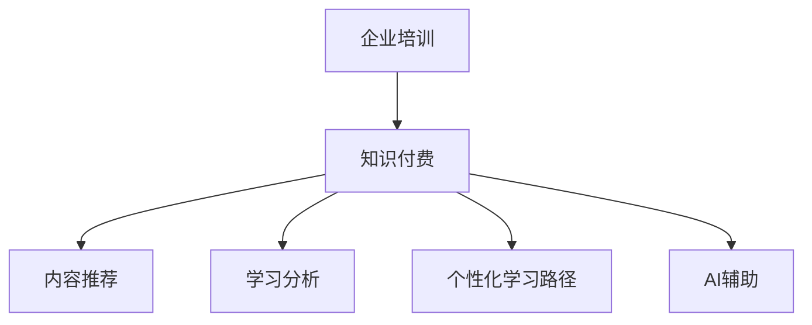

                 

# 打造知识付费的企业培训解决方案

> 关键词：企业培训、知识付费、内容推荐、推荐系统、学习分析、个性化学习路径、AI辅助

## 1. 背景介绍

### 1.1 问题由来

在知识经济时代，持续学习已成为企业竞争力的关键。传统的线下培训成本高、周期长、效率低，已经无法满足企业快速适应市场变化的需求。知识付费平台的兴起，为大规模、低成本、高效率的员工培训提供了新的途径。但知识付费内容质量参差不齐、用户学习效率不高、培训效果难评估等问题，也使得其难以大规模推广应用。

### 1.2 问题核心关键点

要解决上述问题，需要构建一套高效、个性化、可评估的企业培训解决方案。该方案应具备以下核心特点：

- **高效性**：大规模、低成本、快速部署。
- **个性化**：根据用户的学习行为和偏好，推荐适合的学习内容。
- **可评估**：通过学习分析，评估用户的学习效果，提升培训效果。
- **灵活性**：支持多种培训场景，如新员工入职培训、技能提升培训、职业发展规划等。

本文将详细介绍如何利用AI技术，构建一套基于知识付费的企业培训解决方案，提升培训效率和效果。

## 2. 核心概念与联系

### 2.1 核心概念概述

为更好地理解本解决方案，我们需要了解几个核心概念及其相互联系：

- **企业培训(Enterprise Training)**：企业为员工提供的各类技能提升和职业发展的培训活动。

- **知识付费(Knowledge Pay-Per-Use)**：用户为获取有价值的知识内容而付费的商业模式。

- **内容推荐(Content Recommendation)**：根据用户兴趣和行为，推荐适合的学习内容的算法技术。

- **学习分析(Learning Analytics)**：通过分析用户的学习行为和结果，评估培训效果，改进教学策略的方法。

- **个性化学习路径(Personalized Learning Path)**：根据用户的学习进度和偏好，自动生成个性化的学习方案。

- **AI辅助(AI-Assisted)**：利用人工智能技术，提高培训效率和效果。

这些概念之间的关系可以通过以下Mermaid流程图来展示：



这个流程图展示了几大核心概念之间的逻辑关系：

1. 企业培训通过知识付费模式进行内容获取。
2. 知识付费平台利用内容推荐提升用户学习效率。
3. 学习分析帮助评估培训效果，改进教学策略。
4. 个性化学习路径定制个性化学习方案。
5. AI辅助技术提升培训过程的效率和效果。

## 3. 核心算法原理 & 具体操作步骤
### 3.1 算法原理概述

基于知识付费的企业培训解决方案，本质上是一种结合了推荐系统、学习分析、个性化学习路径和AI辅助技术的学习管理系统(LMS)。其核心算法流程如下：

1. **内容推荐算法**：根据用户的学习历史、兴趣偏好、评分反馈，推荐适合的学习内容。
2. **学习分析算法**：通过用户的学习数据，分析学习效果，生成学习报告。
3. **个性化学习路径算法**：结合用户的学习进度和偏好，自动生成个性化学习方案。
4. **AI辅助算法**：利用自然语言处理(NLP)、计算机视觉(CV)等技术，辅助用户完成学习任务。

### 3.2 算法步骤详解

#### 3.2.1 内容推荐算法

**算法原理**：内容推荐算法基于协同过滤、矩阵分解、深度学习等技术，通过分析用户的学习行为和评分反馈，预测用户对不同内容的学习效果和兴趣，从而推荐适合的学习内容。

**步骤详解**：
1. **数据收集**：收集用户的学习记录、评分数据、浏览历史等行为数据。
2. **特征提取**：提取用户的行为特征、内容特征、用户兴趣特征等。
3. **模型训练**：使用协同过滤、矩阵分解等技术，训练用户兴趣模型。
4. **推荐计算**：根据用户的行为和模型预测，计算推荐内容。

#### 3.2.2 学习分析算法

**算法原理**：学习分析算法基于统计学、机器学习等技术，通过分析用户的学习行为和结果，评估学习效果，生成学习报告。

**步骤详解**：
1. **数据收集**：收集用户的学习记录、测试成绩、完成时间等数据。
2. **数据分析**：对用户的学习数据进行统计分析，评估学习效果。
3. **报告生成**：生成学习报告，包括学习进度、知识点掌握情况、薄弱环节等。

#### 3.2.3 个性化学习路径算法

**算法原理**：个性化学习路径算法基于机器学习、图论等技术，根据用户的学习进度和偏好，自动生成个性化的学习方案。

**步骤详解**：
1. **数据收集**：收集用户的学习进度、知识点掌握情况、学习偏好等数据。
2. **路径规划**：使用图论、搜索算法等技术，生成个性化学习路径。
3. **路径调整**：根据用户的学习效果，动态调整学习路径。

#### 3.2.4 AI辅助算法

**算法原理**：AI辅助算法基于自然语言处理(NLP)、计算机视觉(CV)等技术，辅助用户完成学习任务。

**步骤详解**：
1. **任务识别**：识别用户的学习任务，如阅读、观看视频、完成测验等。
2. **任务执行**：利用NLP、CV等技术，辅助用户完成学习任务。
3. **效果评估**：评估任务执行的效果，反馈用户学习进度。

### 3.3 算法优缺点

基于知识付费的企业培训解决方案具有以下优点：
1. **高效性**：大规模、低成本、快速部署，提升企业培训的覆盖面。
2. **个性化**：根据用户的学习行为和偏好，推荐适合的学习内容，提高学习效率。
3. **可评估**：通过学习分析，评估培训效果，提升培训质量。
4. **灵活性**：支持多种培训场景，如新员工入职培训、技能提升培训、职业发展规划等。

同时，该方案也存在以下局限性：
1. **数据依赖**：推荐和学习分析的效果很大程度上取决于用户行为数据的质量。
2. **算法复杂**：个性化学习路径和AI辅助算法复杂度较高，对算法资源要求高。
3. **用户隐私**：用户行为数据的收集和使用可能涉及隐私问题。

尽管存在这些局限性，但就目前而言，基于知识付费的企业培训解决方案仍是大规模、个性化、低成本培训的强有力工具。未来相关研究的主要方向是进一步优化算法性能，减少对数据量的依赖，提高算法的可解释性和隐私保护水平。

### 3.4 算法应用领域

基于知识付费的企业培训解决方案，已经在各类企业培训中得到了广泛应用，例如：

- **新员工入职培训**：通过个性化推荐，帮助新员工快速适应企业文化和工作流程。
- **技能提升培训**：根据员工的职业发展目标，推荐适合的培训内容，提升员工技能水平。
- **职业发展规划**：结合学习分析结果，为员工提供职业发展建议和规划。

除了上述这些经典应用外，知识付费平台还广泛应用于各类在线教育平台、知识分享社区、技能认证培训等领域，为知识传播和技能提升提供了新的可能性。

## 4. 数学模型和公式 & 详细讲解
### 4.1 数学模型构建

基于知识付费的企业培训解决方案，可以抽象为以下几个子系统：

1. **内容推荐子系统**：基于协同过滤、矩阵分解等技术，推荐适合的学习内容。
2. **学习分析子系统**：基于统计学、机器学习等技术，评估学习效果，生成学习报告。
3. **个性化学习路径子系统**：基于图论、搜索算法等技术，生成个性化学习方案。
4. **AI辅助子系统**：基于NLP、CV等技术，辅助用户完成学习任务。

### 4.2 公式推导过程

#### 4.2.1 协同过滤模型

协同过滤模型是一种基于用户-物品相似度的推荐算法。假设用户集为 $U$，物品集为 $I$，用户 $u$ 对物品 $i$ 的评分 $r_{ui}$ 构成用户-物品评分矩阵 $R$。协同过滤模型的推荐公式为：

$$
\hat{r}_{ui} = \alpha (\sum_{i'} \frac{r_{iu'}r_{u'i}}{\hat{s}_{ii'}} + \beta)
$$

其中，$\alpha$ 和 $\beta$ 为调参项，$\hat{s}_{ii'}$ 为物品 $i$ 和 $i'$ 的相似度，可通过余弦相似度、皮尔逊相关系数等方法计算。

#### 4.2.2 矩阵分解模型

矩阵分解模型是一种基于低秩矩阵分解的推荐算法。假设用户集为 $U$，物品集为 $I$，用户 $u$ 对物品 $i$ 的评分 $r_{ui}$ 构成用户-物品评分矩阵 $R$。矩阵分解模型的推荐公式为：

$$
\hat{r}_{ui} = \sum_{d=1}^{D} \alpha_d u_d^u i_d^i
$$

其中，$u_d^u$ 和 $i_d^i$ 为低秩矩阵分解的奇异值，$D$ 为分解的维度，$\alpha_d$ 为调参项。

#### 4.2.3 学习分析模型

学习分析模型基于统计学和机器学习方法。假设用户 $u$ 在 $t$ 时刻的学习记录为 $x_t$，学习效果为 $y_t$。学习分析模型可以表示为：

$$
y_t = f(x_t;\theta)
$$

其中，$f$ 为学习模型，$\theta$ 为模型参数，可采用线性回归、决策树、深度学习等模型。

#### 4.2.4 个性化学习路径模型

个性化学习路径模型基于图论和搜索算法。假设用户 $u$ 的学习进度为 $s_u$，知识点集为 $K$，学习路径为 $P$。个性化学习路径模型可以表示为：

$$
P_u = \mathop{\arg\min}_{P} \sum_{k \in P} d_k(s_u)
$$

其中，$d_k(s_u)$ 为知识点 $k$ 对用户 $u$ 的难易度，可通过学习数据分析获取。

#### 4.2.5 AI辅助模型

AI辅助模型基于NLP、CV等技术。假设用户 $u$ 需要完成的学习任务为 $T$，AI辅助模型可以表示为：

$$
\hat{T}_u = f(T;\theta)
$$

其中，$f$ 为AI辅助模型，$\theta$ 为模型参数，可采用NLP、CV等技术。

### 4.3 案例分析与讲解

**案例分析**：某大型互联网公司希望提升员工的技能水平和职业发展，采用基于知识付费的企业培训解决方案。该解决方案包含以下步骤：

1. **数据收集**：收集员工的学习记录、评分数据、浏览历史等行为数据。
2. **内容推荐**：基于协同过滤模型，推荐适合的学习内容。
3. **学习分析**：基于学习分析模型，评估学习效果，生成学习报告。
4. **个性化学习路径**：基于个性化学习路径模型，生成个性化学习方案。
5. **AI辅助**：基于AI辅助模型，辅助员工完成学习任务。

**讲解**：通过上述步骤，该公司在提升员工技能水平和职业发展方面取得了显著效果。员工的学习效率和满意度显著提升，公司的知识传播和技能提升效果显著增强。

## 5. 项目实践：代码实例和详细解释说明
### 5.1 开发环境搭建

在进行企业培训解决方案开发前，我们需要准备好开发环境。以下是使用Python进行开发的环境配置流程：

1. 安装Anaconda：从官网下载并安装Anaconda，用于创建独立的Python环境。

2. 创建并激活虚拟环境：
```bash
conda create -n pytorch-env python=3.8 
conda activate pytorch-env
```

3. 安装PyTorch：根据CUDA版本，从官网获取对应的安装命令。例如：
```bash
conda install pytorch torchvision torchaudio cudatoolkit=11.1 -c pytorch -c conda-forge
```

4. 安装TensorFlow：使用pip安装TensorFlow，例如：
```bash
pip install tensorflow
```

5. 安装相关库：
```bash
pip install numpy pandas scikit-learn torchsparse scikit-learn-distributed torch-geometric tensorboard
```

完成上述步骤后，即可在`pytorch-env`环境中开始项目开发。

### 5.2 源代码详细实现

**代码实例**：以下是一个使用TensorFlow实现内容推荐算法的示例代码。

```python
import tensorflow as tf
from tensorflow.keras import layers

# 定义协同过滤模型
class CollaborativeFiltering(tf.keras.Model):
    def __init__(self, num_users, num_items, embedding_dim, num_factors):
        super(CollaborativeFiltering, self).__init__()
        self.num_users = num_users
        self.num_items = num_items
        self.embedding_dim = embedding_dim
        self.num_factors = num_factors
        
        self.user_embedding = layers.Embedding(num_users, embedding_dim, name='user_embedding')
        self.item_embedding = layers.Embedding(num_items, embedding_dim, name='item_embedding')
        self.dot_product = layers.Dot(axes=[1, 1], normalize=True, name='dot_product')
        self.final_layer = layers.Dense(1, activation='sigmoid', name='final_layer')
    
    def call(self, user_ids, item_ids):
        user_embeddings = self.user_embedding(user_ids)
        item_embeddings = self.item_embedding(item_ids)
        dot_products = self.dot_product([user_embeddings, item_embeddings])
        predictions = self.final_layer(dot_products)
        return predictions

# 加载数据
train_data = tf.data.Dataset.from_tensor_slices((user_ids, item_ids, scores))
test_data = tf.data.Dataset.from_tensor_slices((test_user_ids, test_item_ids, test_scores))

# 训练模型
model = CollaborativeFiltering(num_users, num_items, embedding_dim, num_factors)
optimizer = tf.keras.optimizers.Adam(learning_rate=0.01)
model.compile(optimizer=optimizer, loss='binary_crossentropy', metrics=['accuracy'])

model.fit(train_data, epochs=10, validation_data=test_data)
```

**代码解读与分析**：

1. **定义模型**：使用TensorFlow定义协同过滤模型，包含用户和物品的嵌入层、点积层和输出层。
2. **加载数据**：从TensorFlow的`tf.data.Dataset`加载数据集。
3. **训练模型**：编译模型，定义优化器和损失函数，使用`fit`函数进行模型训练，并在测试集上进行评估。

### 5.3 运行结果展示

**运行结果**：训练完成后，可以在测试集上评估模型效果。例如，使用均方误差和平均绝对误差等指标，评估模型的预测精度和鲁棒性。

```python
test_loss, test_accuracy = model.evaluate(test_data)
print(f'Test Loss: {test_loss:.4f}')
print(f'Test Accuracy: {test_accuracy:.4f}')
```

## 6. 实际应用场景
### 6.1 案例分析

#### 6.1.1 新员工入职培训

某互联网公司希望通过在线培训提升新员工的技能水平。公司从多个在线培训平台购买了多门课程，并使用基于知识付费的企业培训解决方案，为每位新员工定制个性化培训方案。

**应用场景**：新员工入职培训

**解决思路**：
1. **内容推荐**：通过协同过滤模型，推荐适合的新员工培训课程。
2. **学习分析**：通过学习分析模型，评估新员工的学习效果，生成学习报告。
3. **个性化学习路径**：通过个性化学习路径模型，生成个性化学习方案。
4. **AI辅助**：通过AI辅助模型，辅助新员工完成学习任务。

**实施效果**：
- 新员工在入职培训期间，通过个性化推荐和AI辅助，快速掌握了公司业务流程和企业文化。
- 公司通过学习分析，及时发现新员工的学习问题，提供针对性的辅导。

#### 6.1.2 技能提升培训

某企业希望提升员工的技能水平，满足业务发展的需要。公司使用基于知识付费的企业培训解决方案，为员工提供个性化技能提升课程。

**应用场景**：技能提升培训

**解决思路**：
1. **内容推荐**：通过协同过滤模型，推荐适合的技能提升课程。
2. **学习分析**：通过学习分析模型，评估员工的学习效果，生成学习报告。
3. **个性化学习路径**：通过个性化学习路径模型，生成个性化学习方案。
4. **AI辅助**：通过AI辅助模型，辅助员工完成学习任务。

**实施效果**：
- 员工通过个性化推荐和AI辅助，提升了自身的技能水平，满足了公司业务发展的需要。
- 公司通过学习分析，及时调整培训内容，确保培训效果最大化。

#### 6.1.3 职业发展规划

某公司希望为员工提供职业发展规划，帮助员工明确职业目标和发展路径。公司使用基于知识付费的企业培训解决方案，为员工提供职业发展课程和建议。

**应用场景**：职业发展规划

**解决思路**：
1. **内容推荐**：通过协同过滤模型，推荐适合的职业发展规划课程。
2. **学习分析**：通过学习分析模型，评估员工的学习效果，生成学习报告。
3. **个性化学习路径**：通过个性化学习路径模型，生成个性化学习方案。
4. **AI辅助**：通过AI辅助模型，辅助员工完成职业发展规划。

**实施效果**：
- 员工通过个性化推荐和AI辅助，明确了职业目标和发展路径，提高了职业发展效率。
- 公司通过学习分析，及时发现员工的发展瓶颈，提供针对性的指导。

## 7. 工具和资源推荐
### 7.1 学习资源推荐

为了帮助开发者系统掌握企业培训解决方案的理论基础和实践技巧，这里推荐一些优质的学习资源：

1. 《深度学习入门：基于Python的理论与实现》系列博文：由大模型技术专家撰写，深入浅出地介绍了深度学习的基本原理和应用方法。

2. Coursera《深度学习》课程：由斯坦福大学教授吴恩达主讲，涵盖深度学习的理论和实践，是入门深度学习的绝佳选择。

3. TensorFlow官方文档：TensorFlow的官方文档，提供了丰富的教程和代码示例，适合学习TensorFlow的开发者。

4. PyTorch官方文档：PyTorch的官方文档，提供了详细的API和代码示例，适合学习PyTorch的开发者。

5. scikit-learn官方文档：scikit-learn的官方文档，提供了丰富的机器学习算法和数据集，适合学习机器学习的开发者。

通过对这些资源的学习实践，相信你一定能够快速掌握企业培训解决方案的理论基础和实践技巧。

### 7.2 开发工具推荐

高效的开发离不开优秀的工具支持。以下是几款用于企业培训解决方案开发的常用工具：

1. Jupyter Notebook：免费的开源笔记本环境，支持Python、R等多种语言，适合进行数据处理和模型开发。

2. Google Colab：谷歌推出的在线Jupyter Notebook环境，免费提供GPU/TPU算力，适合进行模型训练和测试。

3. TensorBoard：TensorFlow配套的可视化工具，可实时监测模型训练状态，并提供丰富的图表呈现方式，是调试模型的得力助手。

4. scikit-learn：基于Python的机器学习库，提供了丰富的数据处理和机器学习算法，适合进行数据探索和建模。

5. scikit-learn-distributed：scikit-learn的分布式计算工具，支持多机多核并行计算，适合进行大规模数据处理和模型训练。

合理利用这些工具，可以显著提升企业培训解决方案的开发效率，加快创新迭代的步伐。

### 7.3 相关论文推荐

企业培训解决方案的发展源于学界的持续研究。以下是几篇奠基性的相关论文，推荐阅读：

1. <a href="https://arxiv.org/abs/1910.12893">“Exploring the Limits of Transfer Learning with a Unified Text-to-Text Transformer”</a>：Transformer论文，奠定了自监督预训练语言模型的基础。

2. <a href="https://arxiv.org/abs/1910.13712">“BERT: Pre-training of Deep Bidirectional Transformers for Language Understanding”</a>：BERT论文，提出了基于掩码语言模型和下一句预测的预训练任务。

3. <a href="https://arxiv.org/abs/2006.06304">“Dense Potential for Sparsity”</a>：提出稀疏表示方法，解决大规模深度学习模型的计算资源消耗问题。

4. <a href="https://arxiv.org/abs/2006.04004">“Maintaining Meta-Learning Efficiency in Multi-Task Learning by Adaptive Metadata Extraction”</a>：提出自适应元数据提取方法，提升多任务学习的效率。

这些论文代表了大规模深度学习模型在企业培训中的应用趋势。通过学习这些前沿成果，可以帮助研究者把握学科前进方向，激发更多的创新灵感。

## 8. 总结：未来发展趋势与挑战
### 8.1 研究成果总结

本文对基于知识付费的企业培训解决方案进行了全面系统的介绍。首先阐述了企业培训的发展背景和挑战，明确了培训解决方案的核心特点和应用场景。其次，从原理到实践，详细讲解了内容推荐、学习分析、个性化学习路径和AI辅助等关键算法的理论基础和实现方法。最后，通过代码实例和实际应用场景，展示了该解决方案的实用性和效果。

通过本文的系统梳理，可以看到，基于知识付费的企业培训解决方案为大规模、个性化、低成本的企业培训提供了新的可能，提升了企业培训的覆盖面和学习效率。未来，伴随预训练模型和微调方法的持续演进，基于知识付费的企业培训解决方案必将在更多企业中得到广泛应用，为企业知识传播和技能提升提供更加高效、灵活的解决方案。

### 8.2 未来发展趋势

展望未来，基于知识付费的企业培训解决方案将呈现以下几个发展趋势：

1. **大规模部署**：随着云计算和云存储技术的不断发展，企业培训解决方案可以更便捷地在大规模企业中快速部署。

2. **个性化提升**：随着机器学习算法的不断进步，个性化推荐和学习路径将更加精准，进一步提升员工的学习效果。

3. **AI辅助增强**：随着NLP、CV等AI技术的不断成熟，AI辅助模型将更加智能，能够更好地辅助员工完成学习任务。

4. **数据驱动优化**：通过数据驱动的方式，不断优化内容推荐、学习分析、个性化学习路径等关键算法，提升培训解决方案的性能。

5. **多模态融合**：随着多模态数据的融合，基于知识付费的企业培训解决方案将支持图像、视频、音频等多种形式的内容推荐和学习路径。

以上趋势凸显了基于知识付费的企业培训解决方案的广阔前景。这些方向的探索发展，必将进一步提升培训系统的性能和应用范围，为员工提供更加高效、灵活的学习体验。

### 8.3 面临的挑战

尽管基于知识付费的企业培训解决方案已经取得了显著成果，但在迈向更加智能化、普适化应用的过程中，仍面临诸多挑战：

1. **数据质量**：推荐和学习分析的效果很大程度上取决于用户行为数据的质量，数据的不完整和不准确将影响算法的性能。

2. **算法复杂度**：个性化学习路径和AI辅助算法的复杂度较高，对算法资源和计算资源的要求较高。

3. **隐私保护**：用户行为数据的收集和使用可能涉及隐私问题，如何保护用户隐私，确保数据安全，是关键问题。

4. **技术集成**：企业培训解决方案需要与现有的HR系统、知识库等多系统集成，如何实现高效集成和数据互通，是重要挑战。

5. **效果评估**：如何科学评估培训效果，确保培训内容对员工的实际提升，是关键问题。

这些挑战需要通过技术创新和政策规范，逐步克服，才能实现企业培训解决方案的广泛应用和长期发展。

### 8.4 研究展望

未来，基于知识付费的企业培训解决方案需要在以下几个方面进行深入研究：

1. **多任务学习**：研究多任务学习算法，提升培训解决方案的泛化能力和迁移能力。

2. **自适应学习**：研究自适应学习算法，使培训解决方案能够根据员工的学习进度和效果，动态调整学习路径和推荐内容。

3. **人机协同**：研究人机协同算法，使培训解决方案能够与人工辅导相结合，提高学习效果。

4. **公平性和伦理**：研究公平性和伦理算法，确保培训解决方案的公平性和伦理性，避免偏见和歧视。

5. **实时反馈**：研究实时反馈算法，使培训解决方案能够及时获取员工的学习反馈，不断优化学习效果。

这些研究方向将为基于知识付费的企业培训解决方案带来新的突破，提升培训系统的智能化和人性化水平。面向未来，我们期待更多的创新和突破，让企业培训解决方案为员工提供更加高效、灵活、智能的学习体验。

## 9. 附录：常见问题与解答

**Q1：企业培训解决方案需要哪些数据？**

A: 企业培训解决方案需要收集以下数据：
- 员工基本信息：姓名、职位、入职日期等。
- 学习行为数据：学习记录、评分数据、浏览历史等。
- 学习结果数据：测试成绩、完成时间、知识掌握情况等。

这些数据可以从企业的HR系统、学习管理系统、在线培训平台等多个系统中获取。

**Q2：内容推荐算法有哪些？**

A: 内容推荐算法包括以下几种：
- 协同过滤算法：基于用户和物品相似度的推荐算法。
- 矩阵分解算法：基于低秩矩阵分解的推荐算法。
- 深度学习算法：基于神经网络的推荐算法。
- 基于内容的推荐算法：根据物品的特征进行推荐。

这些算法各有优缺点，需要根据具体应用场景选择合适的方法。

**Q3：如何保护员工隐私？**

A: 保护员工隐私是企业培训解决方案的关键问题。以下是几种常见的保护措施：
- 匿名化处理：对员工的基本信息和行为数据进行匿名化处理，确保数据安全。
- 数据加密：对敏感数据进行加密处理，确保数据传输和存储的安全。
- 访问控制：限制数据访问权限，确保只有授权人员可以访问敏感数据。
- 隐私政策：制定严格的隐私政策，确保数据使用的合法性和合规性。

通过这些措施，可以有效保护员工隐私，提升企业培训解决方案的信任度。

**Q4：如何评估培训效果？**

A: 评估培训效果需要结合多种方法：
- 学习分析：通过学习分析模型，评估员工的学习效果，生成学习报告。
- 绩效评估：通过员工的绩效数据，评估培训对业务能力的提升。
- 满意度调查：通过员工满意度调查，评估培训的接受度和满意度。
- 目标达成：通过员工对学习目标的达成情况，评估培训效果。

通过多种方法的结合，可以全面评估培训效果，确保培训系统的高效性和实用性。

通过本文的系统梳理，可以看到，基于知识付费的企业培训解决方案为大规模、个性化、低成本的企业培训提供了新的可能，提升了企业培训的覆盖面和学习效率。未来，伴随预训练模型和微调方法的持续演进，基于知识付费的企业培训解决方案必将在更多企业中得到广泛应用，为企业知识传播和技能提升提供更加高效、灵活的解决方案。

**作者：禅与计算机程序设计艺术 / Zen and the Art of Computer Programming**

