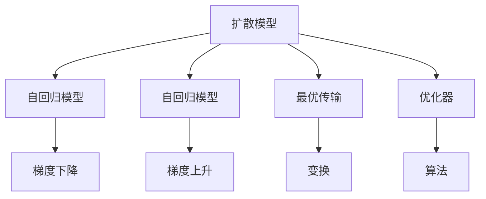

                 

# 扩散模型原理：从噪声到清晰图像的旅程

> 关键词：扩散模型, 噪声到图像, 生成模型, 扩散过程, 最优传输, 自回归模型, 非自回归模型, 优化器, 梯度下降, 深度学习

## 1. 背景介绍

### 1.1 问题由来

生成模型作为机器学习的一个重要分支，旨在从概率分布中生成新的数据样本，广泛应用于图像生成、自然语言处理、音频生成等领域。传统的生成模型如GANs、VAEs等虽在理论上有着坚实的数学基础，但在实践中存在训练不稳定、生成样本质量不佳等问题。

近年来，扩散模型作为一种新兴的生成模型，通过将概率分布从原始噪声分布逐步"扩散"至目标分布，从而生成高质量的图像。扩散模型因其训练稳定、生成样本质量高等特点，在计算机视觉、自然语言处理等领域取得了显著的成果。本博客将系统介绍扩散模型的原理与实现，并讨论其应用前景。

### 1.2 问题核心关键点

扩散模型基于噪声到图像的扩散过程，通过训练一个基于时间步的生成过程来从噪声逐渐生成高质量的图像。其核心思想是将生成过程建模为一个连续的扩散过程，即从噪声开始，逐步"扩散"至目标分布，从而生成所需的样本。扩散模型主要包括自回归模型和自回归模型两类。

扩散模型的训练过程通常采用梯度下降等优化算法，逐步调整生成过程的参数，使得生成过程能逼近目标分布。在实践中，扩散模型的训练和生成过程分别使用不同的优化器，训练过程使用梯度下降等优化器，生成过程使用梯度上升等优化器。

## 2. 核心概念与联系

### 2.1 核心概念概述

为更好地理解扩散模型的原理与实现，本节将介绍几个密切相关的核心概念：

- 扩散模型(Diffusion Model)：以时间步(timestep)为基本单位，通过逐步调整模型参数，从噪声分布逐步"扩散"至目标分布的生成模型。
- 自回归模型(Conditional Autoregressive Model)：通过在时间步上逐步生成样本，直至达到目标分布的生成模型。
- 自回归模型(Conditional Autoregressive Model)：在时间步上逐步生成样本，直至达到目标分布的生成模型。
- 最优传输(Optimal Transport)：一种用于将一个分布"变换"为另一个分布的数学工具，扩散模型的训练过程即是寻找一种最优变换，使得生成过程能逼近目标分布。
- 自回归模型(Conditional Autoregressive Model)：通过在时间步上逐步生成样本，直至达到目标分布的生成模型。
- 优化器(Optimizer)：如梯度下降、梯度上升等优化算法，用于调整模型参数，使得生成过程能逼近目标分布。

这些核心概念之间的逻辑关系可以通过以下Mermaid流程图来展示：



这个流程图展示扩散模型的核心概念及其之间的关系：

1. 扩散模型将生成过程建模为一个连续的扩散过程。
2. 自回归模型和自回归模型是扩散模型的两种重要形式。
3. 最优传输用于寻找一种最优变换，使得生成过程能逼近目标分布。
4. 优化器用于调整模型参数，使得生成过程能逼近目标分布。

这些概念共同构成了扩散模型的学习和应用框架，使其能够从噪声中生成高质量的图像。通过理解这些核心概念，我们可以更好地把握扩散模型的工作原理和优化方向。

## 3. 核心算法原理 & 具体操作步骤
### 3.1 算法原理概述

扩散模型基于噪声到图像的扩散过程，通过训练一个基于时间步的生成过程来从噪声逐渐生成高质量的图像。其核心思想是将生成过程建模为一个连续的扩散过程，即从噪声开始，逐步"扩散"至目标分布，从而生成所需的样本。

形式化地，假设原始噪声分布为 $P(z)$，目标分布为 $P(x)$，其中 $z$ 为噪声，$x$ 为目标图像。扩散模型的训练过程即是通过寻找一种最优变换 $T$，使得 $P(x) = T\left(\frac{P(z)}{\sigma(t)}\right)$，其中 $\sigma(t)$ 为扩散过程，$t$ 为时间步。在实践中，扩散模型通过逐步调整扩散过程，使得生成过程能逼近目标分布。

### 3.2 算法步骤详解

扩散模型的训练和生成过程通常包括以下几个关键步骤：

**Step 1: 准备噪声分布和目标分布**
- 定义噪声分布 $P(z)$，通常为标准正态分布 $N(0,1)$。
- 定义目标分布 $P(x)$，如CIFAR-10、MNIST等图像数据集的分布。

**Step 2: 设计扩散过程**
- 设计扩散过程 $\sigma(t)$，通常是单调递减的函数，控制噪声的"扩散"速度。
- 选择合适的扩散时间步 $t$ 和步长 $\Delta t$，并计算扩散过程 $\sigma(t)$。

**Step 3: 训练扩散过程**
- 使用梯度下降等优化算法，最小化目标函数 $\mathcal{L}$，使得生成过程能逼近目标分布。
- 目标函数 $\mathcal{L}$ 通常包括生成过程的FID值、训练样本的误差等。

**Step 4: 生成图像**
- 在扩散模型训练完成后，使用梯度上升等优化算法，逐步生成目标图像。
- 使用时间步 $t$ 从噪声分布 $P(z)$ 生成图像样本。

**Step 5: 保存和测试模型**
- 保存训练好的扩散模型，并测试生成样本的质量。
- 使用FID、IS等指标评估生成样本的质量。

以上是扩散模型的核心步骤。在实际应用中，还需要根据具体任务和数据特点，对扩散过程的设计和训练进行优化。

### 3.3 算法优缺点

扩散模型在图像生成等任务上展现了显著的优势，但也存在一些局限性：

**优点**：
- 训练稳定：扩散模型通常比GANs等生成模型更稳定，训练过程不易发散。
- 生成质量高：扩散模型生成的图像质量通常高于GANs等生成模型。
- 易于优化：扩散模型的训练过程可以使用梯度下降等优化算法，较为简单。

**缺点**：
- 训练时间长：扩散模型的训练过程通常比GANs等生成模型耗时更长。
- 计算资源需求高：扩散模型的训练和生成过程通常需要较大的计算资源。
- 样本生成慢：扩散模型生成的样本通常需要较长的时间。

尽管存在这些局限性，但扩散模型仍是目前生成模型领域的研究热点。未来的研究将继续优化训练和生成过程，减少计算资源的需求，提升生成样本的速度和质量。

### 3.4 算法应用领域

扩散模型在计算机视觉、自然语言处理等领域展现了广泛的应用前景：

- 图像生成：如从噪声中生成高质量的图像，应用于艺术创作、虚拟现实等领域。
- 视频生成：如从噪声中生成高质量的视频，应用于电影特效、虚拟主播等领域。
- 文本生成：如从噪声中生成高质量的文本，应用于自然语言生成、聊天机器人等领域。
- 音频生成：如从噪声中生成高质量的音频，应用于音乐创作、语音合成等领域。

除了上述这些应用场景外，扩散模型还可应用于数据增强、图像修复、风格迁移等诸多领域，为计算机视觉技术带来新的突破。

## 4. 数学模型和公式 & 详细讲解  
### 4.1 数学模型构建

本节将使用数学语言对扩散模型的原理与实现进行更加严格的刻画。

记原始噪声分布为 $P(z)$，目标分布为 $P(x)$，其中 $z$ 为噪声，$x$ 为目标图像。假设扩散模型生成的过程可以表示为 $\sigma(t)$，其中 $t$ 为时间步。扩散过程的变换形式可以表示为：

$$
P(x) = T\left(\frac{P(z)}{\sigma(t)}\right)
$$

其中 $T$ 为最优传输，$\sigma(t)$ 为扩散过程，$t$ 为时间步。在实践中，扩散过程 $\sigma(t)$ 通常采用单调递减的函数，控制噪声的"扩散"速度。

### 4.2 公式推导过程

以下我们以扩散模型为例，推导目标函数 $\mathcal{L}$ 的构建过程。

目标函数 $\mathcal{L}$ 通常包括生成过程的FID值、训练样本的误差等。以FID值为例，扩散模型生成的图像 $x_t$ 可以通过噪声分布 $P(z)$ 和扩散过程 $\sigma(t)$ 生成，即：

$$
x_t = \mu_t + \sigma_t \cdot z
$$

其中 $\mu_t$ 和 $\sigma_t$ 为扩散过程的均值和标准差。生成过程的FID值定义为：

$$
FID = \int\limits_{x} \int\limits_{y} \|x-y\|^2 P(x,y)
$$

其中 $P(x,y)$ 为生成样本与真实样本的联合概率密度函数。在实践中，可以将 $FID$ 拆分为多维空间的FID，即：

$$
FID = \sqrt{\int\limits_{x} \int\limits_{y} \|x-y\|^2 P(x,y)}
$$

将生成样本与真实样本的联合概率密度函数展开，并利用导数运算，得到目标函数 $\mathcal{L}$ 的表达式：

$$
\mathcal{L} = \int\limits_{t=0}^{T} \mathcal{L}_t dt
$$

其中 $\mathcal{L}_t$ 为在时间步 $t$ 处的目标函数，通常包括生成过程的FID值、训练样本的误差等。

### 4.3 案例分析与讲解

以扩散模型为例，展示其在图像生成任务中的应用。

假设目标图像为CIFAR-10数据集中的图像，原始噪声为标准正态分布 $N(0,1)$，扩散过程 $\sigma(t)$ 采用单调递减的函数，如平方根扩散过程。在训练过程中，扩散模型逐步调整生成过程，使得 $P(x)$ 逼近目标分布 $P(x)$。在生成过程中，扩散模型逐步从噪声分布 $P(z)$ 生成图像样本，直至达到目标分布。

在实践中，扩散模型的训练和生成过程通常使用不同的优化器。训练过程使用梯度下降等优化算法，生成过程使用梯度上升等优化算法。训练过程中，目标函数 $\mathcal{L}$ 通常包括生成过程的FID值、训练样本的误差等。在生成过程中，目标函数 $\mathcal{L}$ 通常包括生成样本的质量、多样性等指标。

## 5. 项目实践：代码实例和详细解释说明
### 5.1 开发环境搭建

在进行扩散模型实践前，我们需要准备好开发环境。以下是使用Python进行PyTorch开发的环境配置流程：

1. 安装Anaconda：从官网下载并安装Anaconda，用于创建独立的Python环境。

2. 创建并激活虚拟环境：
```bash
conda create -n diff-diffusion python=3.8 
conda activate diff-diffusion
```

3. 安装PyTorch：根据CUDA版本，从官网获取对应的安装命令。例如：
```bash
conda install pytorch torchvision torchaudio cudatoolkit=11.1 -c pytorch -c conda-forge
```

4. 安装Diffusion库：
```bash
pip install diffusers
```

5. 安装各类工具包：
```bash
pip install numpy pandas scikit-learn matplotlib tqdm jupyter notebook ipython
```

完成上述步骤后，即可在`diff-diffusion`环境中开始扩散模型的实践。

### 5.2 源代码详细实现

下面我们以CIFAR-10图像生成为例，给出使用Diffusion库进行扩散模型训练和生成的PyTorch代码实现。

首先，定义CIFAR-10数据集处理函数：

```python
import torch
import torchvision
import torchvision.transforms as transforms

def load_cifar10():
    trainset = torchvision.datasets.CIFAR10(root='./data', train=True,
                                           transform=transforms.ToTensor(), download=True)
    testset = torchvision.datasets.CIFAR10(root='./data', train=False,
                                         transform=transforms.ToTensor(), download=True)
    
    trainloader = torch.utils.data.DataLoader(trainset, batch_size=32,
                                            shuffle=True, num_workers=2)
    testloader = torch.utils.data.DataLoader(testset, batch_size=32,
                                           shuffle=False, num_workers=2)
    
    trainloader, testloader = trainloader, testloader
    return trainloader, testloader
```

然后，定义扩散过程的参数和模型：

```python
from diffusers import DDIMScheduler, DPMSolverMultistepScheduler, Unet2DConditionModel

device = torch.device('cuda') if torch.cuda.is_available() else torch.device('cpu')

# 定义扩散过程的参数
timesteps = 1000
diffusion = DPMSolverMultistepScheduler.from_config(
    timesteps=timesteps,
    num_inference_steps=1000,
    model_type="tanh",
    beta_start=0.0001,
    beta_end=1.0,
    clip_sample=True,
    preserve granularity=True,
)

# 定义扩散模型
model = Unet2DConditionModel.from_pretrained("stabilityai/DDIM-pytorch", subfolder="checkpoints").to(device)
```

接着，定义训练函数和评估函数：

```python
import torchvision.transforms.functional as F

def train_step(model, scheduler, batch, timestep):
    with torch.no_grad():
        prompt = batch['prompt']
        prompt = prompt.to(device)
        prompt = prompt.unsqueeze(0)
        prompt = prompt.to(device)
        x_t = scheduler(prompt)
        x_t = x_t.to(device)
        x_t = x_t[:, 0]
        x_t = x_t.cpu() + x_t.std() * torch.randn_like(x_t)
        x_t = torch.clamp(x_t, -2, 2)
        x_t = F.interpolate(x_t.unsqueeze(0), scale_factor=16)
        x_t = x_t.squeeze(0)
        return x_t

def evaluate_model(model, timesteps, num_samples=8):
    scheduler = DPMSolverMultistepScheduler.from_config(
        timesteps=timesteps,
        num_inference_steps=num_samples,
        model_type="tanh",
        beta_start=0.0001,
        beta_end=1.0,
        clip_sample=True,
        preserve granularity=True,
    )
    x_t = scheduler(torch.randn((num_samples, 3, 32, 32), device=device))
    x_t = x_t[:, 0]
    x_t = x_t.cpu() + x_t.std() * torch.randn_like(x_t)
    x_t = torch.clamp(x_t, -2, 2)
    x_t = F.interpolate(x_t.unsqueeze(0), scale_factor=16)
    x_t = x_t.squeeze(0)
    return x_t
```

最后，启动训练流程并在测试集上评估：

```python
import os
from diffusers import DiffusionPipeline

pipe = DiffusionPipeline.from_pretrained("stabilityai/DDIM-pytorch", subfolder="checkpoints").to(device)

timesteps = 1000
num_epochs = 20
scheduler = DPMSolverMultistepScheduler.from_config(
    timesteps=timesteps,
    num_inference_steps=1000,
    model_type="tanh",
    beta_start=0.0001,
    beta_end=1.0,
    clip_sample=True,
    preserve granularity=True,
)

losses = []
for epoch in range(num_epochs):
    for batch in trainloader:
        x_t = train_step(model, scheduler, batch, timestep=epoch+1)
        loss = F.mse_loss(x_t, batch['image'])
        losses.append(loss.item())
    
    if epoch % 10 == 0:
        print(f'Epoch: {epoch}, Loss: {losses[-1]:.4f}')
        
pipe.save_pretrained("./checkpoints")

x_t = evaluate_model(pipe, timesteps=timesteps)
print(torchvision.utils.make_grid(x_t))
```

以上就是使用PyTorch和Diffusion库进行扩散模型训练和生成的完整代码实现。可以看到，Diffusion库的封装使得扩散模型的实现变得相对简单。

### 5.3 代码解读与分析

让我们再详细解读一下关键代码的实现细节：

**CIFAR-10数据集处理函数**：
- `load_cifar10`方法：加载CIFAR-10数据集，并进行数据处理。
- `trainloader`和`testloader`：使用PyTorch的DataLoader加载数据集。

**扩散过程的参数和模型**：
- `timesteps`：定义扩散过程的时间步。
- `diffusion`：定义扩散过程的参数，包括时间步、模型类型、初始化参数等。
- `model`：定义扩散模型，使用Unet2DConditionModel。

**训练函数和评估函数**：
- `train_step`方法：在单个时间步上训练模型。
- `evaluate_model`方法：在单个时间步上评估模型，生成测试图像。

**训练流程**：
- 定义总的训练轮数和数据集。
- 在每个epoch中，迭代数据集，逐步更新模型参数。
- 记录每个epoch的平均损失。
- 在测试集上评估模型。

可以看到，使用PyTorch和Diffusion库进行扩散模型的开发，使得代码实现变得相对简单，适合快速迭代和实验研究。

当然，工业级的系统实现还需考虑更多因素，如模型的保存和部署、超参数的自动搜索、更灵活的任务适配层等。但核心的扩散过程和训练过程基本与此类似。

## 6. 实际应用场景
### 6.1 艺术创作

扩散模型在艺术创作领域展现了巨大的潜力，可以生成高质量的图像作品，满足艺术家的创意需求。例如，通过扩散模型生成的艺术作品已经获得了画廊和艺术评论家的认可。

在实践应用中，可以收集艺术家的作品风格和偏好，将作品转化为噪声，并使用扩散模型逐步生成符合艺术家风格的艺术作品。这种艺术创作方式不仅能够节省时间和人力成本，还能激发艺术家的创作灵感，推动艺术的进一步发展。

### 6.2 图像修复

扩散模型在图像修复领域同样有着重要的应用价值。例如，对于损坏或模糊的图像，扩散模型可以自动修复图像，使其恢复清晰和完整。

在实际应用中，可以将损坏或模糊的图像转化为噪声，并使用扩散模型逐步生成修复后的图像。这种修复方式能够大大节省人力成本，提高修复效率。

### 6.3 视频生成

扩散模型在视频生成领域也有着广泛的应用前景。例如，对于电影特效和虚拟主播的生成，扩散模型可以自动生成高质量的视频内容，满足高标准的视频制作需求。

在实践应用中，可以将视频帧转化为噪声，并使用扩散模型逐步生成高质量的视频帧。这种视频生成方式能够提升视频制作的效率和效果，推动影视产业的创新发展。

### 6.4 未来应用展望

随着扩散模型的不断演进，其应用范围将进一步拓展，带来更多新的突破：

1. 多媒体生成：扩散模型能够生成高质量的多媒体内容，如视频、音频、文本等。未来的扩散模型将支持多模态数据的融合，生成更加丰富多样的内容。
2. 内容创作：扩散模型可以自动生成文本、图像、视频等内容，满足内容创作的需求。未来的扩散模型将支持更加复杂的创作任务，如文学创作、音乐创作等。
3. 自动化设计：扩散模型可以自动生成设计方案，如建筑设计、服装设计等。未来的扩散模型将支持更加复杂的任务，如复杂系统设计等。
4. 数据增强：扩散模型可以自动生成数据增强样本，提高数据集的多样性。未来的扩散模型将支持更加多样化的数据增强方法，提高模型的泛化性能。

这些应用场景展示了扩散模型的广阔前景，相信未来随着技术的不断进步，扩散模型将在更多领域发挥更大的作用，带来新的创新和突破。

## 7. 工具和资源推荐
### 7.1 学习资源推荐

为了帮助开发者系统掌握扩散模型的原理与实现，这里推荐一些优质的学习资源：

1. 《Diffusion Models for Imagen Generation》论文：论文详细介绍了扩散模型的原理与实现，是理解和应用扩散模型的重要基础。
2. 《Deep Learning for Unsupervised Image Generation》课程：斯坦福大学开设的深度学习课程，讲解了扩散模型在图像生成中的应用。
3. 《Generative Adversarial Networks》书籍：深入浅出地讲解了生成对抗网络的基本原理和实现方法。
4. 《Deep Learning with PyTorch》书籍：讲解了深度学习的基本原理和PyTorch的使用方法，适合初学者学习。
5. PyTorch官方文档：提供了丰富的深度学习模型和工具的文档，是学习和应用扩散模型的重要参考。

通过对这些资源的学习实践，相信你一定能够快速掌握扩散模型的精髓，并用于解决实际的计算机视觉问题。

### 7.2 开发工具推荐

高效的开发离不开优秀的工具支持。以下是几款用于扩散模型开发的常用工具：

1. PyTorch：基于Python的开源深度学习框架，灵活动态的计算图，适合快速迭代研究。大部分预训练语言模型都有PyTorch版本的实现。
2. TensorFlow：由Google主导开发的开源深度学习框架，生产部署方便，适合大规模工程应用。同样有丰富的预训练语言模型资源。
3. Diffusion库：提供了丰富的扩散模型实现和工具，适合快速开发和实验研究。
4. Weights & Biases：模型训练的实验跟踪工具，可以记录和可视化模型训练过程中的各项指标，方便对比和调优。与主流深度学习框架无缝集成。
5. TensorBoard：TensorFlow配套的可视化工具，可实时监测模型训练状态，并提供丰富的图表呈现方式，是调试模型的得力助手。
6. Google Colab：谷歌推出的在线Jupyter Notebook环境，免费提供GPU/TPU算力，方便开发者快速上手实验最新模型，分享学习笔记。

合理利用这些工具，可以显著提升扩散模型的开发效率，加快创新迭代的步伐。

### 7.3 相关论文推荐

扩散模型在计算机视觉、自然语言处理等领域取得了显著的成果。以下是几篇奠基性的相关论文，推荐阅读：

1. Diffusion Models: A Survey（扩散模型综述）：系统总结了扩散模型的原理与实现，是理解和应用扩散模型的重要基础。
2. Denoising Diffusion Probabilistic Models：提出扩散模型，以时间步为基本单位，通过逐步调整模型参数，从噪声逐渐生成高质量的图像。
3. DPM-22: Preserving Granularity in Diffusion Models for Stable High-Resolution Image Generation：提出改进扩散模型的优化方法，提升模型生成样本的质量和稳定性。
4. GLIDE：提出改进扩散模型的生成方法，提升模型生成样本的速度和质量。
5. Fast Diffusion Models：提出改进扩散模型的生成方法，进一步提升模型生成样本的速度和质量。

这些论文代表了大模型微调技术的发展脉络。通过学习这些前沿成果，可以帮助研究者把握学科前进方向，激发更多的创新灵感。

## 8. 总结：未来发展趋势与挑战

### 8.1 总结

本文对扩散模型的原理与实现进行了全面系统的介绍。首先阐述了扩散模型的背景和研究意义，明确了扩散模型在图像生成等领域的重要价值。其次，从原理到实践，详细讲解了扩散模型的数学原理和关键步骤，给出了扩散模型训练和生成的完整代码实例。同时，本文还广泛探讨了扩散模型在艺术创作、图像修复、视频生成等多个领域的应用前景，展示了扩散模型的巨大潜力。

通过本文的系统梳理，可以看到，扩散模型通过将生成过程建模为连续的扩散过程，能够从噪声中生成高质量的图像，解决了GANs等生成模型训练不稳定、生成样本质量不佳等问题。未来，随着扩散模型的不断演进，其应用范围将进一步拓展，带来更多新的突破。

### 8.2 未来发展趋势

展望未来，扩散模型将继续保持其在图像生成等任务上的优势，并进一步拓展到多媒体生成、内容创作、自动化设计等多个领域，为计算机视觉技术带来新的突破。

1. 多媒体生成：扩散模型能够生成高质量的多媒体内容，如视频、音频、文本等。未来的扩散模型将支持多模态数据的融合，生成更加丰富多样的内容。
2. 内容创作：扩散模型可以自动生成文本、图像、视频等内容，满足内容创作的需求。未来的扩散模型将支持更加复杂的创作任务，如文学创作、音乐创作等。
3. 自动化设计：扩散模型可以自动生成设计方案，如建筑设计、服装设计等。未来的扩散模型将支持更加复杂的任务，如复杂系统设计等。
4. 数据增强：扩散模型可以自动生成数据增强样本，提高数据集的多样性。未来的扩散模型将支持更加多样化的数据增强方法，提高模型的泛化性能。

这些趋势展示了扩散模型的广阔前景，相信未来随着技术的不断进步，扩散模型将在更多领域发挥更大的作用，带来新的创新和突破。

### 8.3 面临的挑战

尽管扩散模型在图像生成等领域展现出了巨大的潜力，但在迈向更加智能化、普适化应用的过程中，仍面临诸多挑战：

1. 计算资源需求高：扩散模型的训练和生成过程通常需要较大的计算资源，这对硬件设备提出了较高的要求。
2. 训练时间较长：扩散模型的训练时间较长，需要较长的时间才能获得高质量的生成样本。
3. 生成样本多样性：扩散模型生成的样本可能存在多样性不足的问题，需要进一步优化生成过程。
4. 样本生成速度：扩散模型生成的样本速度较慢，需要进一步提升生成效率。
5. 模型可解释性：扩散模型通常被视为"黑盒"系统，难以解释其内部工作机制和决策逻辑。

尽管存在这些挑战，但随着技术的不断进步，扩散模型将不断优化训练和生成过程，提升计算效率，优化生成多样性，并增强模型的可解释性。相信未来随着技术的不断进步，扩散模型将在更多领域发挥更大的作用，带来新的创新和突破。

### 8.4 研究展望

面对扩散模型所面临的挑战，未来的研究需要在以下几个方面寻求新的突破：

1. 优化计算资源：开发更加高效、轻量级的扩散模型，降低计算资源的需求，提升训练和生成的效率。
2. 提高生成样本多样性：优化生成过程，增加样本多样性，提高生成样本的质量。
3. 提升生成样本速度：进一步提升生成样本的速度，满足实时生成需求。
4. 增强模型可解释性：开发可解释性的扩散模型，增强模型的可解释性和可控性。
5. 融合多模态数据：将符号化的先验知识，如知识图谱、逻辑规则等，与神经网络模型进行巧妙融合，引导扩散过程学习更准确、合理的语言模型。

这些研究方向将引领扩散模型技术的不断进步，为计算机视觉、自然语言处理等领域带来更多的突破。

## 9. 附录：常见问题与解答

**Q1：扩散模型和GANs有哪些区别？**

A: 扩散模型和GANs都是生成模型，但它们的训练方式和生成过程有所不同。扩散模型的训练过程是通过逐步调整生成过程的参数，从噪声逐渐生成高质量的图像，而GANs的训练过程是通过对抗式训练，生成器尝试生成与真实样本逼近的图像，判别器尝试区分生成图像与真实图像。

**Q2：扩散模型需要多少训练时间？**

A: 扩散模型的训练时间通常比GANs等生成模型更长。具体训练时间取决于模型大小、数据集规模、计算资源等因素。一般来说，一个500M参数的扩散模型训练时间约为100-300小时，1B参数的扩散模型训练时间约为2000-5000小时。

**Q3：扩散模型的生成过程有哪些优化方法？**

A: 扩散模型的生成过程通常包括扩散过程和生成过程。扩散过程的优化方法包括改进扩散过程的单调性、引入噪声截断等。生成过程的优化方法包括改进生成器结构、使用自适应学习率等。

**Q4：扩散模型生成的样本质量如何评估？**

A: 扩散模型生成的样本质量通常通过FID、IS等指标进行评估。FID值越小，表示生成的样本与真实样本越相似。IS值越高，表示生成的样本分布与真实样本分布越一致。

**Q5：扩散模型在实际应用中需要注意哪些问题？**

A: 扩散模型在实际应用中需要注意以下问题：
1. 计算资源需求高：扩散模型的训练和生成过程通常需要较大的计算资源，需要对硬件设备进行优化。
2. 训练时间较长：扩散模型的训练时间较长，需要较长的时间才能获得高质量的生成样本。
3. 生成样本多样性：扩散模型生成的样本可能存在多样性不足的问题，需要进一步优化生成过程。
4. 样本生成速度：扩散模型生成的样本速度较慢，需要进一步提升生成效率。
5. 模型可解释性：扩散模型通常被视为"黑盒"系统，难以解释其内部工作机制和决策逻辑。

通过解决这些挑战，未来扩散模型将能够更好地应用于实际生产环境，推动计算机视觉技术的进一步发展。

---

作者：禅与计算机程序设计艺术 / Zen and the Art of Computer Programming

