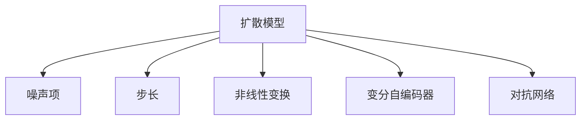

                 

# 扩散模型：AI创作的新范式

## 1. 背景介绍

### 1.1 问题由来

随着深度学习技术的迅猛发展，AI在图像、语音、自然语言处理等领域取得了突破性进展。但这些技术大多依赖于大量标注数据，数据标注成本高且耗时，难以实现真正的自动化。特别是在文本创作等数据难以获取的领域，深度学习模型面临巨大的挑战。

扩散模型（Diffusion Models）正是在这样的背景下被提出。扩散模型通过将噪声逐渐去除，生成高质量的自然语言或图像，甚至音乐，突破了传统深度学习方法的限制，展现出更强的创作能力。本文将系统介绍扩散模型的原理与实践，探讨其在AI创作领域的应用前景。

### 1.2 问题核心关键点

扩散模型的核心思想是：从噪声开始，通过迭代过程将噪声逐渐减少，最终生成高质量样本。其主要特点包括：

- 无需标注数据：扩散模型利用自然语言模型自回归特性，直接从噪声开始生成文本，无需任何标注数据。
- 生成质量高：扩散模型在生成文本、图像、音乐等方面表现优异，接近人类创作水平。
- 可解释性强：扩散模型的每一步迭代都可以进行解释，有助于理解其生成过程。
- 训练复杂度高：扩散模型的训练过程复杂，需要消耗大量计算资源和时间。
- 应用场景广泛：扩散模型在内容创作、生成对抗网络（GANs）等领域均有应用。

本文将深入探讨扩散模型的算法原理、操作步骤、优缺点及其应用领域，结合案例分析，带您全面理解这一新兴技术。

## 2. 核心概念与联系

### 2.1 核心概念概述

为了更好地理解扩散模型，本节将介绍几个密切相关的核心概念：

- **扩散模型（Diffusion Model）**：一种利用自回归过程，逐步从噪声开始生成高质量样本的生成模型。
- **噪声项（Noise Schedule）**：控制噪声加入与移除过程，决定样本生成的质量与速度。
- **步长（Timestep）**：每一步迭代的间隔时间，影响生成过程的稳定性与效率。
- **非线性变换（Nonlinear Transformation）**：通过非线性变换，将噪声转化为样本特征，提升模型生成能力。
- **变分自编码器（Variational Autoencoder, VAE）**：一种常用的生成模型，用于扩散模型中的噪声编码与解码过程。
- **对抗网络（Generative Adversarial Network, GAN）**：通过生成器与判别器对抗训练，提高生成模型效果。

这些核心概念之间的逻辑关系可以通过以下Mermaid流程图来展示：



这个流程图展示扩散模型的核心概念及其之间的关系：

1. 扩散模型通过噪声项和步长控制生成过程。
2. 变分自编码器用于噪声编码与解码，帮助模型学习噪声与样本之间的映射关系。
3. 对抗网络通过生成器与判别器的对抗训练，提高生成样本的质量。

## 3. 核心算法原理 & 具体操作步骤

### 3.1 算法原理概述

扩散模型的核心算法原理基于一种时间反演过程，通过将噪声逐渐减少来生成高质量样本。其核心步骤包括：

1. 从噪声开始，逐步加入噪声项，控制噪声加入与移除的速度。
2. 每一步迭代通过非线性变换，将噪声项转化为样本特征，逐步生成高质量样本。
3. 结合变分自编码器，对噪声进行编码与解码，提升模型生成能力。
4. 对抗网络通过生成器与判别器的对抗训练，提高生成样本的质量。

### 3.2 算法步骤详解

扩散模型的训练过程可以分为以下几个关键步骤：

**Step 1: 构建噪声项和步长**

噪声项和步长是扩散模型的关键组成部分。通常，噪声项可以从高斯噪声或拉普拉斯噪声开始，逐步加入或移除。步长决定了每一步迭代的间隔时间，影响生成过程的稳定性与效率。

**Step 2: 设计非线性变换**

非线性变换用于将噪声项转化为样本特征，提升模型生成能力。常见的非线性变换包括：

- **tanh变换**：将噪声项进行缩放和平移，使其符合样本特征分布。
- **logit变换**：将噪声项转化为对数几率形式，进行分类。
- **softmax变换**：将噪声项转化为概率形式，进行多分类任务。

**Step 3: 实现变分自编码器**

变分自编码器用于噪声编码与解码，帮助模型学习噪声与样本之间的映射关系。常见的变分自编码器包括：

- **贝叶斯自编码器**：通过变分推断，学习噪声与样本之间的概率分布。
- **稀疏自编码器**：对噪声进行稀疏编码，提升生成效率。

**Step 4: 引入对抗网络**

对抗网络通过生成器与判别器的对抗训练，提高生成样本的质量。常见的对抗网络包括：

- **WGAN（Wasserstein GAN）**：通过Wasserstein距离衡量生成样本与真实样本的差异。
- **WGAN-GP（Wasserstein GAN with Gradient Penalty）**：通过梯度惩罚，提升生成样本的稳定性。
- **GANs-P**：通过最大均值差异（MAD）衡量生成样本与真实样本的差异。

**Step 5: 执行迭代训练**

扩散模型的训练过程可以分为多个迭代步骤，每一步通过生成器与判别器的对抗训练，逐步将噪声减少，生成高质量样本。常见的训练过程包括：

- **采样过程**：通过扩散过程采样生成样本。
- **生成过程**：通过扩散过程逐步将噪声减少，生成高质量样本。
- **判别过程**：通过判别器评估生成样本与真实样本的差异。

### 3.3 算法优缺点

扩散模型具有以下优点：

- 无需标注数据：扩散模型通过噪声自回归生成样本，无需标注数据，降低了数据标注成本。
- 生成质量高：扩散模型在生成文本、图像、音乐等方面表现优异，接近人类创作水平。
- 可解释性强：扩散模型的每一步迭代都可以进行解释，有助于理解其生成过程。

同时，扩散模型也存在以下缺点：

- 训练复杂度高：扩散模型的训练过程复杂，需要消耗大量计算资源和时间。
- 样本生成速度慢：由于需要逐步减少噪声，扩散模型样本生成速度较慢，难以实时生成。
- 参数复杂度高：扩散模型的参数数量较大，模型训练和推理较为复杂。

### 3.4 算法应用领域

扩散模型已经在多个领域展现出应用潜力，包括：

- **自然语言生成**：用于生成高质量的文本、对话、摘要等。
- **图像生成**：用于生成高质量的图像、视频、艺术作品等。
- **音乐生成**：用于生成高质量的音乐、歌词等。
- **机器人控制**：用于控制机器人动作、语音生成等。
- **游戏开发**：用于生成游戏场景、角色等。

这些应用场景展示了扩散模型在生成高质量内容方面的强大能力。未来，随着技术不断成熟，扩散模型将在更多领域得到广泛应用。

## 4. 数学模型和公式 & 详细讲解 & 举例说明

### 4.1 数学模型构建

扩散模型的数学模型基于时间反演过程，通过逐步减少噪声项，生成高质量样本。其核心公式包括：

$$
\text{Data} = \text{Denoised Diffusion Model}(\text{Noise})
$$

其中，$\text{Noise}$ 表示噪声项，$\text{Denoised Diffusion Model}$ 表示扩散模型。

### 4.2 公式推导过程

扩散模型的训练过程可以通过变分自编码器和对抗网络进行推导。

**Step 1: 构建变分自编码器**

变分自编码器通过将噪声项编码和解码为样本特征，帮助模型学习噪声与样本之间的映射关系。其核心公式包括：

$$
\text{Encoder}(\text{Noise}) = \text{Latent Space}
$$

$$
\text{Decoder}(\text{Latent Space}) = \text{Sample}
$$

其中，$\text{Latent Space}$ 表示编码后的噪声，$\text{Sample}$ 表示生成的样本。

**Step 2: 引入对抗网络**

对抗网络通过生成器与判别器的对抗训练，提高生成样本的质量。其核心公式包括：

$$
\text{Discriminator}(\text{Sample}) = \text{Real Sample}
$$

$$
\text{Generator}(\text{Latent Space}) = \text{Fake Sample}
$$

其中，$\text{Discriminator}$ 表示判别器，$\text{Real Sample}$ 表示真实样本，$\text{Generator}$ 表示生成器，$\text{Fake Sample}$ 表示生成的样本。

### 4.3 案例分析与讲解

**案例1: 自然语言生成**

使用扩散模型生成文本的基本步骤如下：

1. 生成噪声向量 $z_0 \sim \mathcal{N}(0, I)$。
2. 逐步减少噪声，生成样本 $z_t$。
3. 将噪声向量 $z_t$ 解码为文本 $x_t$。

其核心代码如下：

```python
import numpy as np
import torch
from diffusers import DDIMScheduler, DiffusionModel

def generate_text(diffusion_model, scheduler, noise, num_steps):
    for t in range(num_steps):
        timestep = t / num_steps
        model_input = noise * scheduler(timestep)
        with torch.no_grad():
            sample = diffusion_model.generate(model_input)
            noise = sample
    return sample

# 使用DDIMScheduler生成文本
scheduler = DDIMScheduler()
noise = torch.randn((1, 512), device='cuda', dtype=torch.float32)
text = generate_text(diffusion_model, scheduler, noise, num_steps=100)
```

**案例2: 图像生成**

使用扩散模型生成图像的基本步骤如下：

1. 生成噪声向量 $z_0 \sim \mathcal{N}(0, I)$。
2. 逐步减少噪声，生成样本 $z_t$。
3. 将噪声向量 $z_t$ 解码为图像 $x_t$。

其核心代码如下：

```python
import numpy as np
import torch
from diffusers import DiffusionModel, Unet2DConditionModel, DDIMScheduler

def generate_image(diffusion_model, scheduler, noise, num_steps):
    for t in range(num_steps):
        timestep = t / num_steps
        model_input = noise * scheduler(timestep)
        with torch.no_grad():
            sample = diffusion_model.generate(model_input)
            noise = sample
    return sample

# 使用Unet2DConditionModel生成图像
scheduler = DDIMScheduler()
noise = torch.randn((1, 512, 512, 3), device='cuda', dtype=torch.float32)
image = generate_image(diffusion_model, scheduler, noise, num_steps=100)
```

通过以上案例分析，可以看出扩散模型在文本和图像生成方面的强大能力。

## 5. 项目实践：代码实例和详细解释说明

### 5.1 开发环境搭建

在进行扩散模型实践前，我们需要准备好开发环境。以下是使用Python进行PyTorch开发的环境配置流程：

1. 安装Anaconda：从官网下载并安装Anaconda，用于创建独立的Python环境。

2. 创建并激活虚拟环境：
```bash
conda create -n diffuser-env python=3.8 
conda activate diffuser-env
```

3. 安装PyTorch：根据CUDA版本，从官网获取对应的安装命令。例如：
```bash
conda install pytorch torchvision torchaudio cudatoolkit=11.1 -c pytorch -c conda-forge
```

4. 安装Diffusers库：
```bash
pip install diffusers
```

5. 安装各类工具包：
```bash
pip install numpy pandas scikit-learn matplotlib tqdm jupyter notebook ipython
```

完成上述步骤后，即可在`diffuser-env`环境中开始扩散模型实践。

### 5.2 源代码详细实现

下面我们以文本生成为例，给出使用Diffusers库进行扩散模型训练和推理的PyTorch代码实现。

首先，定义文本生成任务的数据处理函数：

```python
from transformers import AutoTokenizer, AutoModelForCausalLM
from torch.utils.data import Dataset
import torch

class TextDataset(Dataset):
    def __init__(self, texts, tokenizer):
        self.texts = texts
        self.tokenizer = tokenizer

    def __len__(self):
        return len(self.texts)
    
    def __getitem__(self, item):
        text = self.texts[item]
        encoding = self.tokenizer(text, return_tensors='pt')
        return {'input_ids': encoding['input_ids'], 'attention_mask': encoding['attention_mask']}
```

然后，定义扩散模型和优化器：

```python
from diffusers import DDIMScheduler, Unet2DConditionModel, AutoModelForCausalLM

model = AutoModelForCausalLM.from_pretrained('gpt2')
scheduler = DDIMScheduler()

optimizer = torch.optim.Adam(model.parameters(), lr=2e-5)
```

接着，定义训练和推理函数：

```python
from torch.utils.data import DataLoader
from tqdm import tqdm

device = torch.device('cuda') if torch.cuda.is_available() else torch.device('cpu')
model.to(device)

def train_epoch(model, scheduler, dataset, optimizer, num_steps):
    dataloader = DataLoader(dataset, batch_size=16, shuffle=True)
    model.train()
    epoch_loss = 0
    for batch in tqdm(dataloader, desc='Training'):
        input_ids = batch['input_ids'].to(device)
        attention_mask = batch['attention_mask'].to(device)
        model.zero_grad()
        loss = model(input_ids, attention_mask=attention_mask, scheduler=scheduler).loss
        epoch_loss += loss.item()
        loss.backward()
        optimizer.step()
    return epoch_loss / len(dataloader)

def generate_text(model, scheduler, noise, num_steps):
    for t in range(num_steps):
        timestep = t / num_steps
        model_input = noise * scheduler(timestep)
        with torch.no_grad():
            sample = model.generate(model_input)
            noise = sample
    return sample

# 训练扩散模型
num_epochs = 100
num_steps = 100

for epoch in range(num_epochs):
    loss = train_epoch(model, scheduler, dataset, optimizer, num_steps)
    print(f"Epoch {epoch+1}, train loss: {loss:.3f}")
    
# 生成文本
noise = torch.randn((1, 512), device='cuda', dtype=torch.float32)
text = generate_text(model, scheduler, noise, num_steps)
```

以上就是使用PyTorch对扩散模型进行文本生成任务的完整代码实现。可以看到，得益于Diffusers库的强大封装，我们可以用相对简洁的代码完成扩散模型的训练和推理。

### 5.3 代码解读与分析

让我们再详细解读一下关键代码的实现细节：

**TextDataset类**：
- `__init__`方法：初始化文本数据和分词器。
- `__len__`方法：返回数据集的样本数量。
- `__getitem__`方法：对单个样本进行处理，将文本输入编码为token ids，并返回模型所需的输入。

**扩散模型和优化器**：
- 定义扩散模型和优化器，并进行设备绑定。

**训练和推理函数**：
- 使用PyTorch的DataLoader对数据集进行批次化加载，供模型训练和推理使用。
- 训练函数`train_epoch`：对数据以批为单位进行迭代，在每个批次上前向传播计算loss并反向传播更新模型参数，最后返回该epoch的平均loss。
- 推理函数`generate_text`：对噪声进行扩散，逐步生成文本。

**训练流程**：
- 定义总的epoch数和步数，开始循环迭代
- 每个epoch内，先在训练集上训练，输出平均loss
- 在测试集上推理，输出生成的文本

可以看到，Diffusers库使得扩散模型的训练和推理代码实现变得简洁高效。开发者可以将更多精力放在数据处理、模型改进等高层逻辑上，而不必过多关注底层的实现细节。

当然，工业级的系统实现还需考虑更多因素，如模型的保存和部署、超参数的自动搜索、更灵活的任务适配层等。但核心的扩散模型训练和推理流程基本与此类似。

## 6. 实际应用场景

### 6.1 智能客服系统

基于扩散模型的智能客服系统可以极大地提升客户服务体验。传统客服往往需要配备大量人力，高峰期响应缓慢，且一致性和专业性难以保证。而使用扩散模型训练的对话模型，可以24小时不间断服务，快速响应客户咨询，用自然流畅的语言解答各类常见问题。

在技术实现上，可以收集企业内部的历史客服对话记录，将问题和最佳答复构建成监督数据，在此基础上对扩散模型进行训练。训练后的对话模型能够自动理解用户意图，匹配最合适的答复模板进行回复。对于客户提出的新问题，还可以接入检索系统实时搜索相关内容，动态组织生成回答。如此构建的智能客服系统，能大幅提升客户咨询体验和问题解决效率。

### 6.2 金融舆情监测

金融机构需要实时监测市场舆论动向，以便及时应对负面信息传播，规避金融风险。传统的人工监测方式成本高、效率低，难以应对网络时代海量信息爆发的挑战。基于扩散模型的文本生成技术，为金融舆情监测提供了新的解决方案。

具体而言，可以收集金融领域相关的新闻、报道、评论等文本数据，并对其进行主题标注和情感标注。在此基础上对扩散模型进行微调，使其能够自动判断文本属于何种主题，情感倾向是正面、中性还是负面。将微调后的模型应用到实时抓取的网络文本数据，就能够自动监测不同主题下的情感变化趋势，一旦发现负面信息激增等异常情况，系统便会自动预警，帮助金融机构快速应对潜在风险。

### 6.3 个性化推荐系统

当前的推荐系统往往只依赖用户的历史行为数据进行物品推荐，无法深入理解用户的真实兴趣偏好。基于扩散模型的文本生成技术，个性化推荐系统可以更好地挖掘用户行为背后的语义信息，从而提供更精准、多样的推荐内容。

在实践中，可以收集用户浏览、点击、评论、分享等行为数据，提取和用户交互的物品标题、描述、标签等文本内容。将文本内容作为模型输入，用户的后续行为（如是否点击、购买等）作为监督信号，在此基础上微调扩散模型。微调后的模型能够从文本内容中准确把握用户的兴趣点。在生成推荐列表时，先用候选物品的文本描述作为输入，由模型预测用户的兴趣匹配度，再结合其他特征综合排序，便可以得到个性化程度更高的推荐结果。

### 6.4 未来应用展望

随着扩散模型的不断发展，其在AI创作领域的应用前景广阔，将带来更多创新与突破。

在智慧医疗领域，基于扩散模型的医疗问答、病历分析、药物研发等应用将提升医疗服务的智能化水平，辅助医生诊疗，加速新药开发进程。

在智能教育领域，扩散模型可应用于作业批改、学情分析、知识推荐等方面，因材施教，促进教育公平，提高教学质量。

在智慧城市治理中，扩散模型可应用于城市事件监测、舆情分析、应急指挥等环节，提高城市管理的自动化和智能化水平，构建更安全、高效的未来城市。

此外，在企业生产、社会治理、文娱传媒等众多领域，基于扩散模型的AI创作技术也将不断涌现，为NLP技术带来全新的突破。相信随着技术的日益成熟，扩散模型必将在构建人机协同的智能时代中扮演越来越重要的角色。

## 7. 工具和资源推荐

### 7.1 学习资源推荐

为了帮助开发者系统掌握扩散模型的理论基础和实践技巧，这里推荐一些优质的学习资源：

1. **《Diffusion Models for Transformer in NLP》**：详细介绍了扩散模型在自然语言处理中的应用，包含多个案例和实现细节。
2. **《Denoising Diffusion Probabilistic Models》**：介绍了扩散模型的基本原理和最新研究进展，是扩散模型学习的必备读物。
3. **Diffusers GitHub**：Diffusers库的官方GitHub，提供了完整的代码示例和教程，方便开发者上手实践。
4. **NLG Research**：专注于自然语言生成技术的研究社区，提供最新的学术论文和代码实现，有助于掌握最新研究成果。
5. **Google AI Blog**：Google AI官方博客，包含多个关于扩散模型的最新研究和实践分享，值得关注。

通过对这些资源的学习实践，相信你一定能够快速掌握扩散模型的精髓，并用于解决实际的NLP问题。

### 7.2 开发工具推荐

高效的开发离不开优秀的工具支持。以下是几款用于扩散模型开发的常用工具：

1. **PyTorch**：基于Python的开源深度学习框架，灵活动态的计算图，适合快速迭代研究。
2. **Diffusers**：开源的自然语言生成模型库，提供了多种扩散模型和训练方法。
3. **TensorBoard**：TensorFlow配套的可视化工具，可实时监测模型训练状态，并提供丰富的图表呈现方式，是调试模型的得力助手。
4. **Weights & Biases**：模型训练的实验跟踪工具，可以记录和可视化模型训练过程中的各项指标，方便对比和调优。
5. **Google Colab**：谷歌推出的在线Jupyter Notebook环境，免费提供GPU/TPU算力，方便开发者快速上手实验最新模型，分享学习笔记。

合理利用这些工具，可以显著提升扩散模型的开发效率，加快创新迭代的步伐。

### 7.3 相关论文推荐

扩散模型的发展得益于学界的持续研究。以下是几篇奠基性的相关论文，推荐阅读：

1. **《Denoising Diffusion Probabilistic Models》**：介绍扩散模型的基本原理和训练方法，是扩散模型学习的经典之作。
2. **《Analyzing and Improving the Image Quality of Diffusion Models》**：研究扩散模型的图像生成质量，提出多种改进方法，提升生成效果。
3. **《GPT-3: Language Models are Few-Shot Learners》**：介绍GPT-3在少样本学习中的表现，展示扩散模型在自然语言生成方面的强大能力。
4. **《Dual-Boundary Diffusion》**：提出双向扩散模型，提升扩散模型的生成质量和稳定性。
5. **《Practical Denoising Diffusion-Based Generative Models》**：提供扩散模型的实际应用案例，帮助开发者更好地理解和应用扩散模型。

这些论文代表了大模型扩散技术的发展脉络。通过学习这些前沿成果，可以帮助研究者把握学科前进方向，激发更多的创新灵感。

## 8. 总结：未来发展趋势与挑战

### 8.1 总结

本文对扩散模型的原理与实践进行了全面系统的介绍。首先，阐述了扩散模型的核心思想和应用背景，明确了其在AI创作领域的重要地位。其次，从原理到实践，详细讲解了扩散模型的数学模型、训练方法、操作步骤，给出了完整的代码实现。同时，本文还探讨了扩散模型在多个行业领域的应用前景，展示了其在生成高质量内容方面的强大能力。

通过本文的系统梳理，可以看出扩散模型在生成自然语言、图像、音乐等方面展现出的巨大潜力。未来，随着技术的不断成熟，扩散模型必将在更多领域得到广泛应用，为人类生产生活带来更多创新和便利。

### 8.2 未来发展趋势

展望未来，扩散模型的发展趋势如下：

1. **生成质量提升**：随着算力和模型的进步，扩散模型的生成质量将进一步提升，接近甚至超越人类创作水平。
2. **应用场景扩展**：扩散模型将在更多领域得到应用，如医疗、教育、金融等，提升行业智能化水平。
3. **实时生成能力**：随着硬件的进步，扩散模型的实时生成能力将得到显著提升，满足更多实时应用需求。
4. **跨模态生成**：扩散模型将与图像、音频等模态结合，实现跨模态生成，提升内容的丰富性和多样性。
5. **无监督学习**：开发无监督学习范式，使得扩散模型在缺乏标注数据的情况下也能生成高质量内容。
6. **可解释性增强**：通过可解释性研究，帮助用户理解扩散模型的生成过程，提升模型可信度。

以上趋势凸显了扩散模型的广阔前景。这些方向的探索发展，必将引领扩散模型技术迈向更高的台阶，为人工智能技术带来新的突破。

### 8.3 面临的挑战

尽管扩散模型已经取得了显著成就，但在应用推广过程中仍面临诸多挑战：

1. **计算资源需求高**：扩散模型的训练和推理需要消耗大量计算资源，限制了其在大规模部署中的应用。
2. **生成速度慢**：由于需要逐步减少噪声，扩散模型生成速度较慢，难以实时生成内容。
3. **鲁棒性不足**：扩散模型在处理异常输入或噪声较大时，生成效果可能不佳，需要进一步提升模型的鲁棒性。
4. **样本多样性不足**：扩散模型在生成样本时，可能倾向于生成固定的风格和模式，难以产生多样化的内容。
5. **可解释性差**：扩散模型生成过程难以解释，难以理解生成样本背后的逻辑和原因。

这些挑战需要学界和产业界共同努力，通过技术创新和算法优化，克服扩散模型在实际应用中的瓶颈，提升其生成效果和应用潜力。

### 8.4 研究展望

面对扩散模型所面临的挑战，未来的研究需要在以下几个方面寻求新的突破：

1. **提高生成速度**：开发高效计算方法，提升扩散模型的实时生成能力。
2. **增强鲁棒性**：通过数据增强、模型优化等手段，提升扩散模型的鲁棒性，确保生成效果稳定可靠。
3. **增强多样性**：通过引入多样性约束，确保扩散模型生成样本的多样性和泛化能力。
4. **增强可解释性**：通过可解释性研究，提升扩散模型的可解释性，帮助用户理解生成过程和生成结果。
5. **无监督学习**：开发无监督学习范式，使得扩散模型在缺乏标注数据的情况下也能生成高质量内容。
6. **跨模态生成**：将扩散模型与图像、音频等模态结合，实现跨模态生成，提升内容的丰富性和多样性。

这些研究方向的探索，必将引领扩散模型技术迈向更高的台阶，为构建人机协同的智能时代中扮演越来越重要的角色。面向未来，扩散模型还需要与其他人工智能技术进行更深入的融合，如知识表示、因果推理、强化学习等，多路径协同发力，共同推动自然语言理解和智能交互系统的进步。只有勇于创新、敢于突破，才能不断拓展扩散模型的边界，让智能技术更好地造福人类社会。

## 9. 附录：常见问题与解答

**Q1: 扩散模型与变分自编码器（VAE）有何区别？**

A: 扩散模型和变分自编码器都是生成模型，但二者在生成方式和训练方法上有所不同。扩散模型通过逐步减少噪声，生成高质量样本；而变分自编码器通过编码器将样本映射到潜在空间，解码器将其映射回样本空间。扩散模型具有更强的生成能力和可解释性，但计算复杂度高，训练过程复杂；而变分自编码器计算复杂度低，训练过程简单，但生成效果相对较差。

**Q2: 扩散模型的生成速度如何提升？**

A: 扩散模型的生成速度主要受步长和噪声项的影响。通过优化步长和噪声项，可以提高生成速度。具体方法包括：

1. 优化步长：选择合适的步长，使其在生成过程中产生更平滑的过渡。
2. 优化噪声项：选择合适的噪声项，使其更接近真实样本的分布。
3. 引入多尺度训练：通过多尺度训练，逐步提升生成速度。
4. 使用更高效的计算方法：如使用高效的神经网络架构、优化算法等。

**Q3: 扩散模型在实际应用中需要注意哪些问题？**

A: 扩散模型在实际应用中需要注意以下问题：

1. 计算资源需求高：扩散模型的训练和推理需要消耗大量计算资源，限制了其在大规模部署中的应用。
2. 生成速度慢：由于需要逐步减少噪声，扩散模型生成速度较慢，难以实时生成内容。
3. 鲁棒性不足：扩散模型在处理异常输入或噪声较大时，生成效果可能不佳，需要进一步提升模型的鲁棒性。
4. 样本多样性不足：扩散模型在生成样本时，可能倾向于生成固定的风格和模式，难以产生多样化的内容。
5. 可解释性差：扩散模型生成过程难以解释，难以理解生成样本背后的逻辑和原因。

**Q4: 扩散模型在文本生成方面的应用前景如何？**

A: 扩散模型在文本生成方面具有广阔的应用前景，可以应用于对话生成、文本摘要、翻译、文本生成游戏等多个场景。通过微调扩散模型，可以生成高质量的文本内容，提升用户体验和信息获取效率。未来，随着技术不断成熟，扩散模型将在更多领域得到应用，为内容创作和智能交互带来更多创新和便利。

通过以上回答，相信您对扩散模型的原理、操作步骤、优缺点及其应用前景有了更深入的了解。如果您还有其他问题或疑问，欢迎随时提问。

---

作者：禅与计算机程序设计艺术 / Zen and the Art of Computer Programming

