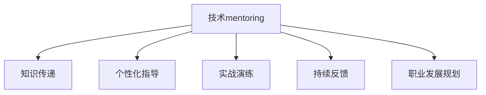

                 

# 技术mentoring：建立百万美元的辅导业务

> 关键词：技术mentoring, 辅导业务, 创业, 盈利模式, 人才发展, 商业策略, 技术教练

## 1. 背景介绍

### 1.1 问题由来
在数字化时代，技术日新月异，竞争激烈。个人和企业对技术的掌握和应用能力不断提升，但是技术知识的学习和转化是一个漫长且充满挑战的过程。如何帮助他人高效地学习、掌握、应用技术，成为一项重要的需求。技术mentoring（技术辅导）因此应运而生，通过一对一的辅导，提供针对性的指导，帮助人们跨越技术学习中的障碍。

### 1.2 问题核心关键点
技术mentoring的核心在于通过有经验的技术专家指导，将复杂的知识分解、简化、并结合实际应用场景，帮助受辅导者理解、掌握并应用新技术。关键点包括：
1. **知识传递的有效性**：将抽象的理论知识转换为具体的实践技能。
2. **个性化指导**：根据受辅导者的背景、兴趣和职业目标，提供量身定制的辅导方案。
3. **实战演练**：通过实战项目和案例分析，加深对技术的理解和应用能力。
4. **持续反馈和改进**：及时提供反馈，帮助受辅导者持续改进和提升。
5. **职业发展规划**：帮助受辅导者制定职业发展路径，提升其技术竞争力。

### 1.3 问题研究意义
技术mentoring对个人和组织都有显著的益处：
1. **个人发展**：帮助技术从业者突破技术瓶颈，提升技能水平，加速职业成长。
2. **组织效率**：提升团队的技术水平，减少技术学习和培训成本，加速产品开发和创新。
3. **市场竞争力**：通过技术辅导，培养出更多具备竞争力的技术人才，增强企业的市场竞争力。

## 2. 核心概念与联系

### 2.1 核心概念概述

为更好地理解技术mentoring的核心概念，本节将介绍几个关键概念：

- **技术mentoring**：通过一对一的辅导，将复杂的知识传授给受辅导者，帮助其理解和应用新技术的过程。
- **知识传递**：将复杂的技术知识分解、简化，并通过实际案例和项目加以应用。
- **个性化指导**：根据受辅导者的背景和职业目标，提供定制化的辅导方案。
- **实战演练**：通过实际项目和案例分析，帮助受辅导者将理论知识转化为实战技能。
- **持续反馈**：通过及时的反馈和指导，帮助受辅导者不断改进和提升。
- **职业发展规划**：帮助受辅导者制定和实现职业发展目标，提升其技术竞争力。

这些概念之间的逻辑关系可以通过以下Mermaid流程图来展示：



这个流程图展示了大语言模型的核心概念及其之间的关系：

1. 技术mentoring通过知识传递将复杂的知识分解简化。
2. 个性化指导根据受辅导者的背景和目标定制化辅导方案。
3. 实战演练通过实际案例和项目深化理解和应用。
4. 持续反馈帮助受辅导者不断改进和提升。
5. 职业发展规划帮助受辅导者制定职业发展路径。

## 3. 核心算法原理 & 具体操作步骤
### 3.1 算法原理概述

技术mentoring的原理基于知识传递和实践应用。通过将复杂的技术知识分解、简化，并通过实际案例和项目加以应用，帮助受辅导者理解和掌握新技术。

### 3.2 算法步骤详解

技术mentoring的一般步骤包括：

**Step 1: 需求评估**
- 与受辅导者进行初步沟通，了解其技术水平、职业目标和需要解决的问题。

**Step 2: 定制辅导方案**
- 根据需求评估结果，制定个性化的辅导方案，包括知识传递的内容、实战演练的项目、持续反馈的频率等。

**Step 3: 实施辅导**
- 按照辅导方案，进行知识传递、实战演练和持续反馈。

**Step 4: 评估与改进**
- 定期评估受辅导者的学习效果，根据评估结果调整辅导方案。

**Step 5: 职业发展规划**
- 帮助受辅导者制定和实现职业发展路径，提升其技术竞争力。

### 3.3 算法优缺点

技术mentoring具有以下优点：
1. **高效**：通过一对一的辅导，能够快速传递知识，解决实际问题。
2. **个性化**：根据受辅导者的背景和目标，提供定制化的辅导方案。
3. **实战演练**：通过实际案例和项目，加深理解和应用能力。
4. **持续改进**：通过持续反馈和评估，帮助受辅导者不断改进和提升。
5. **职业发展**：帮助受辅导者制定和实现职业发展路径，提升其技术竞争力。

同时，该方法也存在一定的局限性：
1. **成本高**：高质量的辅导需要经验丰富的专家，成本较高。
2. **时间投入**：辅导过程需要大量的时间和精力，尤其对于大规模组织。
3. **依赖专家**：辅导效果很大程度上取决于专家的水平和经验。

尽管存在这些局限性，但技术mentoring作为知识传递和技能提升的有效手段，依然广受欢迎。未来相关研究的重点在于如何降低辅导成本，提高辅导效率，以及如何构建更加灵活、可持续的技术辅导体系。

### 3.4 算法应用领域

技术mentoring在多个领域都有广泛的应用：

- **技术培训**：帮助企业员工掌握新技术，提升技术水平，加速产品开发和创新。
- **职业转型**：帮助技术从业者跨越技术学习中的障碍，实现职业转型和升级。
- **技术提升**：帮助技术爱好者提升技能，实现技术梦想。
- **技术创业**：通过技术辅导，帮助创业者快速掌握新技术，实现创新项目。
- **技术咨询**：为组织提供技术咨询服务，解决复杂的技术问题。

## 4. 数学模型和公式 & 详细讲解 & 举例说明

### 4.1 数学模型构建

假设技术mentoring的辅导时间为 $T$，每次辅导的知识传递量为 $K$，实战演练的项目数量为 $P$，持续反馈的次数为 $F$，受辅导者的初始技能水平为 $L_0$，最终技能水平为 $L_T$。

则辅导效果可以表示为：

$$
L_T = L_0 + T \times K + P \times A + F \times R
$$

其中 $A$ 为实战演练的提升效果，$R$ 为持续反馈的改进效果。

### 4.2 公式推导过程

- **知识传递**：每次辅导的知识传递量为 $K$，总传递量为 $T \times K$。
- **实战演练**：每个实战演练项目提升效果为 $A$，总提升效果为 $P \times A$。
- **持续反馈**：每次反馈提升效果为 $R$，总提升效果为 $F \times R$。

通过设定不同参数的值，可以模拟不同辅导方案的效果，并进行优化。

### 4.3 案例分析与讲解

以软件开发为例，假设受辅导者的初始技能水平为 $L_0$，辅导时间为 $T=6$ 个月，每次知识传递量为 $K=5$ 个知识点，实战演练项目数量为 $P=5$ 个，持续反馈次数为 $F=3$ 次。

通过设定 $A=0.8$（实战演练提升效果）和 $R=0.5$（持续反馈改进效果），可以计算出最终技能水平：

$$
L_T = L_0 + 6 \times 5 + 5 \times 0.8 + 3 \times 0.5 = L_0 + 40.5
$$

## 5. 项目实践：代码实例和详细解释说明
### 5.1 开发环境搭建

在进行技术mentoring的实践前，我们需要准备好开发环境。以下是使用Python进行开发的环境配置流程：

1. 安装Anaconda：从官网下载并安装Anaconda，用于创建独立的Python环境。

2. 创建并激活虚拟环境：
```bash
conda create -n mentoring-env python=3.8 
conda activate mentoring-env
```

3. 安装必要的工具包：
```bash
pip install numpy pandas scikit-learn matplotlib
```

完成上述步骤后，即可在`mentoring-env`环境中开始辅导实践。

### 5.2 源代码详细实现

以下是一个基于Python的技术mentoring辅导系统的示例代码：

```python
import numpy as np

class Mentor:
    def __init__(self, knowledge_per_session, practice_project, feedback_frequency, initial_skill, improvement_per_practice, improvement_per_feedback):
        self.knowledge_per_session = knowledge_per_session
        self.practice_project = practice_project
        self.feedback_frequency = feedback_frequency
        self.initial_skill = initial_skill
        self.improvement_per_practice = improvement_per_practice
        self.improvement_per_feedback = improvement_per_feedback

    def calculate_skill_level(self, total_hours):
        total_knowledge = total_hours * self.knowledge_per_session
        total_practice = total_hours * self.practice_project * self.improvement_per_practice
        total_feedback = total_hours * self.feedback_frequency * self.improvement_per_feedback
        final_skill = self.initial_skill + total_knowledge + total_practice + total_feedback
        return final_skill

# 示例
mentor = Mentor(knowledge_per_session=5, practice_project=5, feedback_frequency=3, initial_skill=0, improvement_per_practice=0.8, improvement_per_feedback=0.5)
total_hours = 6
final_skill = mentor.calculate_skill_level(total_hours)
print("Final skill level:", final_skill)
```

### 5.3 代码解读与分析

让我们再详细解读一下关键代码的实现细节：

**Mentor类**：
- `__init__`方法：初始化辅导方案的各项参数。
- `calculate_skill_level`方法：根据总辅导时间，计算最终技能水平。

**示例**：
- 创建一个辅导方案，设定每次知识传递量为5个知识点，实战演练项目数量为5个，持续反馈次数为3次，初始技能水平为0。
- 设定每次实战演练提升效果为0.8，每次反馈改进效果为0.5。
- 计算在总辅导时间为6个月时的最终技能水平。

可以看到，通过简单的Python代码，我们能够模拟技术mentoring的效果，并根据不同参数进行调整优化。

## 6. 实际应用场景
### 6.1 企业技术培训

技术mentoring在企业技术培训中的应用，可以显著提升员工的技术水平，加速产品开发和创新。企业可以通过技术mentoring，帮助员工掌握新技术，实现技术升级和转型。

例如，一个大型软件企业可以将技术mentoring作为新员工入职培训的一部分，帮助新员工快速适应企业技术栈，提升其开发效率和质量。

### 6.2 个人职业转型

技术mentoring在个人职业转型中的应用，可以帮助技术从业者跨越技术学习中的障碍，实现职业转型和升级。

例如，一名数据分析师希望转型为机器学习工程师，可以通过技术mentoring学习相关的机器学习知识，掌握新的技能，实现职业转变。

### 6.3 技术创业

技术mentoring在技术创业中的应用，可以帮助创业者快速掌握新技术，实现创新项目。

例如，一名创业者希望开发一款新的移动应用，可以通过技术mentoring学习相关的移动开发技术，加速产品开发和市场推广。

### 6.4 技术咨询

技术mentoring在技术咨询中的应用，可以为组织提供技术咨询服务，解决复杂的技术问题。

例如，一家企业面临技术难题，可以通过技术咨询找到合适的解决方案，并帮助其快速实现技术突破。

## 7. 工具和资源推荐
### 7.1 学习资源推荐

为了帮助开发者系统掌握技术mentoring的理论基础和实践技巧，这里推荐一些优质的学习资源：

1. **在线课程**：Coursera、Udacity等平台上的计算机科学课程，涵盖技术 mentoring 的基本原理和实践方法。
2. **技术博客**：Medium、Towards Data Science等平台上的技术博客，提供大量关于技术 mentoring 的案例分析和实践经验。
3. **书籍**：《The Art of Coaching》等书籍，提供系统的技术 mentoring 理论和实践指导。
4. **开源项目**：GitHub上的技术 mentoring 开源项目，提供丰富的辅导方案和实战演练项目。
5. **网络研讨会**：Meetup、LinkedIn等平台上的网络研讨会，提供专家分享和互动交流的机会。

通过对这些资源的学习实践，相信你一定能够快速掌握技术 mentoring 的精髓，并用于解决实际的职业和技术问题。

### 7.2 开发工具推荐

高效的开发离不开优秀的工具支持。以下是几款用于技术 mentoring 开发的常用工具：

1. **协作工具**：Slack、Microsoft Teams等，提供团队协作和沟通的功能。
2. **项目管理工具**：Trello、Asana等，帮助管理辅导计划和任务。
3. **文档管理工具**：Google Docs、Confluence等，提供辅导方案和项目文档的管理。
4. **学习平台**：Udemy、Coursera等，提供高质量的学习资源和课程。
5. **实时反馈工具**：Zoom、Google Meet等，提供实时视频会议和反馈功能。

合理利用这些工具，可以显著提升技术 mentoring 的开发效率，加快创新迭代的步伐。

### 7.3 相关论文推荐

技术 mentoring 的研究方向涵盖了多个领域，以下是几篇奠基性的相关论文，推荐阅读：

1. **《The Art of Coaching》**：该书系统介绍了技术 mentoring 的理论基础和实践技巧，提供了大量实用的案例和示例。
2. **《Effective Learning Through Mentoring》**：该文章探讨了技术 mentoring 在个人学习和发展中的作用，提供了有效的学习策略和技巧。
3. **《Mentoring in Software Engineering》**：该文章研究了技术 mentoring 在软件开发中的具体应用，提供了有效的指导和方法。
4. **《Advancing Knowledge Through Mentoring》**：该文章探讨了技术 mentoring 在知识传播和技能提升中的作用，提供了系统的方法和策略。

这些论文代表了大语言模型 mentoring 技术的发展脉络。通过学习这些前沿成果，可以帮助研究者把握学科前进方向，激发更多的创新灵感。

## 8. 总结：未来发展趋势与挑战
### 8.1 总结

本文对技术 mentoring 的原理和应用进行了全面系统的介绍。首先阐述了技术 mentoring 的研究背景和意义，明确了其通过一对一的辅导，将复杂的知识传递给受辅导者，帮助其理解和应用新技术的核心价值。其次，从原理到实践，详细讲解了技术 mentoring 的数学模型和具体操作步骤，给出了实践任务开发的完整代码实例。同时，本文还探讨了技术 mentoring 在企业培训、个人转型、技术创业、技术咨询等多个行业领域的应用前景，展示了其广阔的潜在价值。此外，本文精选了技术 mentoring 的学习资源和开发工具，力求为读者提供全方位的技术指引。

通过本文的系统梳理，可以看到，技术 mentoring 作为知识传递和技能提升的有效手段，正在成为个人和企业技能发展的重要工具。其通过个性化的辅导方案、实战演练、持续反馈和职业发展规划，帮助受辅导者跨越技术学习中的障碍，实现职业成长和技能提升。未来，伴随技术 mentoring 技术的持续演进，相信其将在更多领域发挥更大的作用，为经济社会发展注入新的动力。

### 8.2 未来发展趋势

展望未来，技术 mentoring 技术将呈现以下几个发展趋势：

1. **定制化发展**：根据受辅导者的个性化需求，提供更加定制化的辅导方案。
2. **智能化应用**：利用人工智能技术，实现智能推荐和自适应辅导，提升辅导效果。
3. **跨领域应用**：扩展到更多领域，如教育、医疗、金融等，帮助更多人实现技能提升和职业发展。
4. **云平台化**：通过云平台提供技术 mentoring 服务，降低入门门槛，提升服务可及性。
5. **虚拟辅导**：利用虚拟现实技术，提供沉浸式的辅导体验，提升学习效果。
6. **社区化运营**：构建技术 mentoring 社区，提供互动交流和资源共享的平台。

以上趋势凸显了技术 mentoring 技术的广阔前景。这些方向的探索发展，必将进一步提升技术 mentoring 的效果和应用范围，为更多组织和个人提供支持。

### 8.3 面临的挑战

尽管技术 mentoring 技术已经取得了显著的成果，但在迈向更加智能化、普适化应用的过程中，其仍面临着诸多挑战：

1. **成本问题**：高质量的技术 mentoring 需要经验丰富的专家，成本较高。如何降低成本，提高服务的可及性，是一个重要的课题。
2. **效果一致性**：技术 mentoring 的效果很大程度上取决于专家的水平和经验。如何提高辅导效果的一致性和稳定性，是一个重要的研究方向。
3. **大规模应用**：当前技术 mentoring 的应用规模较小，如何扩展到更多组织和个人，提供大规模的辅导服务，是一个重要的挑战。
4. **数据隐私**：技术 mentoring 需要收集受辅导者的数据，如何保护数据隐私和安全，是一个重要的课题。
5. **技术迭代**：技术不断更新迭代，如何及时更新辅导方案，保持辅导内容的先进性，是一个重要的挑战。

### 8.4 未来突破

面对技术 mentoring 所面临的挑战，未来的研究需要在以下几个方面寻求新的突破：

1. **自动化辅导**：利用人工智能技术，实现智能推荐和自适应辅导，提升辅导效果。
2. **社区化运营**：构建技术 mentoring 社区，提供互动交流和资源共享的平台。
3. **数据驱动**：利用大数据分析技术，优化辅导方案，提高辅导效果的一致性和稳定性。
4. **多模态辅导**：结合视频、语音等多模态技术，提升辅导体验和效果。
5. **云平台化**：通过云平台提供技术 mentoring 服务，降低入门门槛，提升服务可及性。
6. **持续改进**：定期收集反馈和数据，不断优化辅导方案，提升辅导效果。

这些研究方向的探索，必将引领技术 mentoring 技术迈向更高的台阶，为构建安全、可靠、可解释、可控的智能系统铺平道路。面向未来，技术 mentoring 技术还需要与其他人工智能技术进行更深入的融合，如知识表示、因果推理、强化学习等，多路径协同发力，共同推动技术 mentoring 的发展和应用。

## 9. 附录：常见问题与解答

**Q1：技术 mentoring 是否适用于所有行业？**

A: 技术 mentoring 在许多行业中都有广泛的应用，如软件开发、数据分析、人工智能等。但其适用范围也受限于行业的特点和需求。例如，技术 mentoring 在金融、医疗等行业的应用需要更专业的知识和技能。

**Q2：如何选择合适的技术 mentoring 专家？**

A: 选择技术 mentoring 专家时，应该考虑其专业背景、工作经验、辅导风格等因素。可以通过简历、案例、推荐信等途径进行筛选和评估。

**Q3：技术 mentoring 需要多久才能见效？**

A: 技术 mentoring 的效果因人而异，一般建议在1-3个月内初见成效。但需要注意的是，技术 mentoring 是一个长期的过程，需要持续的努力和反馈。

**Q4：技术 mentoring 是否可以线上进行？**

A: 技术 mentoring 可以线上进行，利用视频会议、在线协作工具等技术，实现远程辅导。线上辅导的优势在于时间和地点灵活，但需要注意网络环境和互动效果。

**Q5：如何评估技术 mentoring 的效果？**

A: 评估技术 mentoring 的效果可以从以下几个方面入手：受辅导者的技能提升、项目完成情况、职业发展情况等。可以通过定期评估和反馈，不断优化辅导方案，提升效果。

总之，技术 mentoring 作为知识传递和技能提升的重要手段，正在成为越来越多企业和个人的选择。未来，伴随技术 mentoring 技术的持续演进，相信其将在更多领域发挥更大的作用，为人类认知智能的进化带来深远影响。

---

作者：禅与计算机程序设计艺术 / Zen and the Art of Computer Programming

