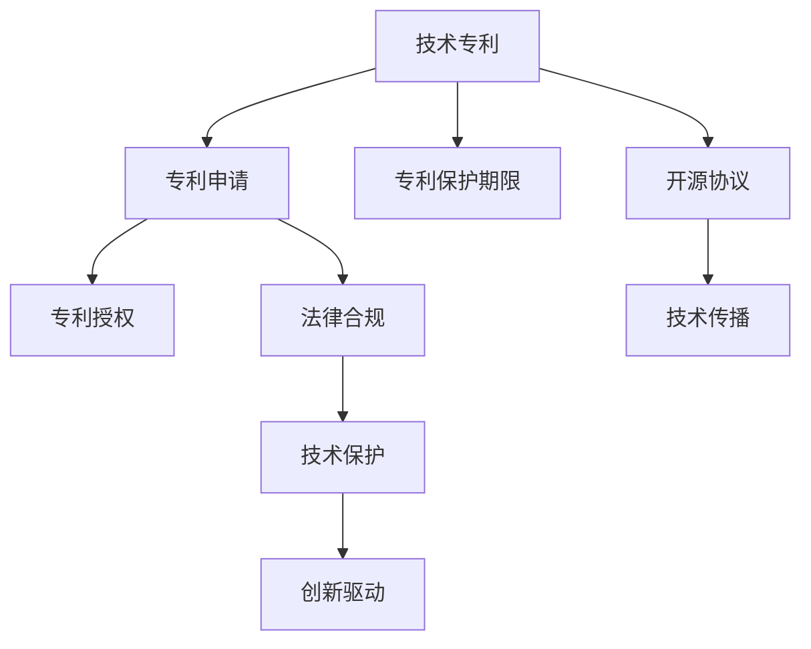

                 

# 技术专利申请：程序员的财富保护

> 关键词：专利申请，技术保护，知识产权，开源协议，法律合规，创新驱动，程序员福利

## 1. 背景介绍

### 1.1 问题由来
随着信息技术的发展，软件开发和创新活动日益频繁。程序员作为信息技术创新的主力军，他们的创新成果不仅为公司带来了巨大价值，也为社会科技进步做出了重要贡献。然而，在享受科技成果带来的利益的同时，程序员也面临着技术泄露、知识产权纠纷等风险。因此，如何保护程序员的创新成果，确保他们能够公平获得自身努力带来的回报，成为了当前亟待解决的问题。

### 1.2 问题核心关键点
技术专利申请是保护程序员创新成果的重要手段之一。通过技术专利申请，程序员可以将自己的创新思想、算法、软件产品等技术成果转化为法律认可的权利，在一定的期限内获得独占权，避免他人未经授权的复制、使用和销售。技术专利申请不仅能保护程序员的利益，还能推动技术创新和产业升级。

## 2. 核心概念与联系

### 2.1 核心概念概述

为更好地理解技术专利申请的方法和流程，本节将介绍几个关键概念：

- **技术专利**：指一种保护发明人对其技术成果独占权利的法律形式。通过专利法，发明人有权在一定期限内对其技术成果进行商业化开发和保护，以避免他人的侵权。

- **专利申请**：指发明人或其代表向专利局提交专利申请文件，请求获得专利保护的过程。专利申请需详细描述技术内容、实施方式和创新点，经过审核后获得专利授权。

- **专利保护期限**：通常为20年，自申请日起计算。在此期间，专利持有者享有独占实施权和禁止他人未经授权使用该专利技术的权利。

- **开源协议**：指在软件项目中使用的一种许可协议，允许用户自由使用、修改和分发软件代码，但需遵守协议规定的条件和责任。开源协议有助于技术传播和共享，但也可能影响专利申请。

- **法律合规**：指技术专利申请和保护过程中需遵守的相关法律法规，包括专利法、商标法、著作权法等，以确保申请和保护过程的合法性。

- **创新驱动**：指通过技术专利申请，激发和保护技术创新，促进社会科技进步和经济发展的过程。技术专利申请不仅保护发明人的利益，还能推动技术研发和产业升级。

这些核心概念之间的逻辑关系可以通过以下Mermaid流程图来展示：



这个流程图展示的技术专利申请的各个环节及其之间的联系：

1. 技术专利是专利申请的基础。
2. 通过专利申请，获得专利授权，享有专利保护期限。
3. 开源协议和法律合规是专利申请的保障。
4. 专利保护和开源协议共同促进技术传播和创新驱动。

这些概念共同构成了技术专利申请的法律和技术框架，使得程序员能够通过合法手段保护自身创新成果。

## 3. 核心算法原理 & 具体操作步骤
### 3.1 算法原理概述

技术专利申请的核心原理是将技术成果转化为法律认可的权利。通过撰写详细的技术专利申请文件，并提交给专利局，发明人可以获得在一定期限内的技术独占权。这一过程主要包括技术描述、权利要求、实施方式、附图等关键步骤。

专利申请的算法原理可以概括为以下几个主要步骤：

1. **技术描述**：详细描述技术内容、原理、实现方式和创新点。
2. **权利要求**：明确说明专利保护的范围和实施方式。
3. **实施方式**：提供实现专利技术的详细步骤和技术参数。
4. **附图**：使用图表、示意图等辅助说明技术细节。
5. **专利申请**：提交给专利局，等待审查和授权。

### 3.2 算法步骤详解

技术专利申请的具体操作步骤如下：

**Step 1: 准备申请文件**
- 撰写详细的技术描述，包括背景、技术方案、实施步骤、创新点等。
- 编写权利要求，明确保护的技术范围和实施方式。
- 提供实施方式，详细说明技术实现过程和技术参数。
- 准备附图，如流程图、示意图等，辅助说明技术细节。

**Step 2: 选择申请国家或地区**
- 根据技术特点和市场需求，选择合适的国家或地区进行专利申请。国际专利申请（如PCT）可以覆盖多个国家和地区，但需支付高昂的申请费用。

**Step 3: 提交申请文件**
- 将准备好的申请文件提交给目标国家的专利局。可以自行提交或委托代理机构完成。

**Step 4: 审查和授权**
- 专利局会对申请文件进行形式审查和技术审查。形式审查主要检查文件完整性和格式，技术审查则由审查员判断专利申请的创新性和实用性。
- 如专利申请通过审查，将获得专利授权。

**Step 5: 维护和保护**
- 获得专利授权后，需定期缴纳年费，维持专利有效。同时需注意技术保护，避免他人侵犯专利权利。

### 3.3 算法优缺点

技术专利申请具有以下优点：
1. 法律保障。技术专利申请和授权后，可以获得法律保护，避免他人未经许可使用专利技术。
2. 商业价值。专利可以转化为商业资源，通过许可或出售专利获得经济回报。
3. 市场竞争力。拥有专利技术可以增强市场竞争力，获得更多的商业机会和市场份额。

同时，技术专利申请也存在一些局限性：
1. 申请费用高昂。专利申请涉及复杂的法律和流程，需支付高额的申请费用和代理费用。
2. 审查周期长。专利申请和审查过程复杂，需等待较长时间才能获得授权。
3. 申请难度高。撰写详细的专利申请文件需具备较高的技术写作和法律知识水平，普通程序员难以独立完成。

尽管存在这些局限性，技术专利申请仍是程序员保护自身创新成果的重要手段，能够有效防止他人侵权，维护自身利益。

### 3.4 算法应用领域

技术专利申请在技术创新和产业发展中具有广泛的应用。以下是一些典型的应用领域：

- **软件开发**：程序员可以将自己的软件开发成果，如算法、软件工具等，申请技术专利，获得法律保护。
- **硬件设计**：工程师可以将硬件设计技术、制造方法等申请专利，防止他人未经允许使用其技术。
- **生物技术**：科学家可以将生物技术成果申请专利，如基因编辑、药物研发等，保护技术创新成果。
- **人工智能**：研究者可以将AI算法、模型架构等申请专利，推动AI技术的商业化和应用。
- **网络安全**：安全专家可以将加密算法、防护技术等申请专利，提升网络安全水平。

这些领域中，技术专利申请不仅保护了发明人的利益，还推动了技术创新和产业发展。未来，技术专利申请将在更多领域得到应用，成为技术保护和创新的重要工具。

## 4. 数学模型和公式 & 详细讲解 & 举例说明

### 4.1 数学模型构建

技术专利申请的数学模型主要涉及专利权利要求和保护范围的构建。权利要求是专利的核心，决定了专利保护的范围和实施方式。权利要求通常分为独立权利要求和从属权利要求，其中独立权利要求描述了专利技术的核心内容，从属权利要求则进一步限定保护范围。

以下是一个简化版的权利要求示例：

$$
\text{独立权利要求}:\text{一种 } X\text{ 技术方法，其中 }X\text{ 为技术步骤和参数的集合，}
$$

$$
\text{从属权利要求}:\text{ 所述 }X\text{ 技术方法，其中 }Y\text{ 为进一步限定技术步骤和参数的集合。}
$$

### 4.2 公式推导过程

权利要求的推导过程主要基于技术描述和实施方式，需满足专利法中关于权利要求的规定。推导权利要求时，需注意以下几点：

1. 权利要求需涵盖技术方案的核心创新点。
2. 权利要求需明确保护的技术范围和实施方式。
3. 权利要求需避免过于宽泛，以免被他人绕过。

以下是一个示例权利要求的推导过程：

**示例**：假设发明了一种新的图像识别算法，其核心创新点在于采用了深度神经网络进行特征提取。推导独立权利要求如下：

$$
\text{独立权利要求}:\text{ 一种图像识别方法，包括步骤 }X\text{ 和参数 }Y\text{，其中 }X\text{ 为深度神经网络特征提取步骤，}Y\text{ 为神经网络参数。}
$$

### 4.3 案例分析与讲解

**案例**：假设某程序员开发了一种新的加密算法，可以高效保护数据安全。其技术描述如下：

**背景**：当前主流加密算法存在加密速度慢、安全性低等问题，急需一种新算法解决这些问题。

**技术方案**：设计了一种基于哈希链的加密算法，通过多轮哈希和迭代加密，提高了加密速度和安全性。

**实施步骤**：
1. 输入原始数据。
2. 使用哈希函数生成哈希值。
3. 对哈希值进行多轮迭代加密，生成加密结果。

**创新点**：采用多轮迭代加密技术，显著提高了加密速度和安全性。

**独立权利要求**：
$$
\text{独立权利要求}:\text{ 一种加密方法，包括步骤 }X\text{，其中 }X\text{ 为多轮迭代加密步骤。}
$$

**从属权利要求**：
$$
\text{从属权利要求}:\text{ 所述加密方法，其中 }Y\text{ 为基于哈希链的加密算法。}
$$

## 5. 项目实践：代码实例和详细解释说明

### 5.1 开发环境搭建

在进行技术专利申请实践前，我们需要准备好开发环境。以下是使用Python进行技术专利申请的开发环境配置流程：

1. 安装Anaconda：从官网下载并安装Anaconda，用于创建独立的Python环境。

2. 创建并激活虚拟环境：
```bash
conda create -n patent-env python=3.8 
conda activate patent-env
```

3. 安装Python专利库：
```bash
pip install patent-py
```

完成上述步骤后，即可在`patent-env`环境中开始专利申请实践。

### 5.2 源代码详细实现

以下是一个使用Python专利库进行技术专利申请的样例代码：

```python
from patent import Patent
from patent import claims
from patent import description

# 创建专利对象
patent = Patent('US12345678')

# 添加技术描述
description.add(patent, '背景：当前主流加密算法存在加密速度慢、安全性低等问题，急需一种新算法解决这些问题。')
description.add(patent, '技术方案：设计了一种基于哈希链的加密算法，通过多轮哈希和迭代加密，提高了加密速度和安全性。')
description.add(patent, '实施步骤：1. 输入原始数据。2. 使用哈希函数生成哈希值。3. 对哈希值进行多轮迭代加密，生成加密结果。')
description.add(patent, '创新点：采用多轮迭代加密技术，显著提高了加密速度和安全性。')

# 添加权利要求
claims.add(patent, '独立权利要求：一种加密方法，包括步骤X，其中X为多轮迭代加密步骤。')
claims.add(patent, '从属权利要求：所述加密方法，其中Y为基于哈希链的加密算法。')

# 提交专利申请
patent.submit()
```

这段代码首先创建了一个专利对象，然后通过description和claims函数添加了技术描述和权利要求，最后通过submit函数提交了专利申请。

### 5.3 代码解读与分析

让我们再详细解读一下关键代码的实现细节：

**Patent类**：
- `Patent`函数：用于创建专利对象，需传入专利号。

**description函数**：
- `description.add`方法：用于添加技术描述，需传入专利对象和描述内容。

**claims函数**：
- `claims.add`方法：用于添加权利要求，需传入专利对象和权利要求内容。

**submit函数**：
- `patent.submit()`：用于提交专利申请，需传入专利对象。

以上代码展示了使用Python专利库进行技术专利申请的基本步骤。使用专利库，程序员可以更加便捷地撰写和提交专利申请，提高了专利申请的效率。

当然，工业级的系统实现还需考虑更多因素，如文档格式规范、法律合规性检查、跨国申请流程等。但核心的专利申请流程基本与此类似。

## 6. 实际应用场景
### 6.1 软件开发
在软件开发中，程序员可以将自己的算法、软件工具等申请专利，获得法律保护。例如，某程序员开发了一种高效的数据压缩算法，可以显著减少数据存储和传输成本。通过技术专利申请，该程序员可以防止他人未经允许使用其算法，保护自身利益。

### 6.2 硬件设计
在硬件设计领域，工程师可以将设计方案、制造方法等申请专利，防止他人未经允许使用其技术。例如，某工程师设计了一种高效能的处理器架构，可以大幅提升计算机性能。通过技术专利申请，该工程师可以获得专利保护，防止其他公司未经允许使用其设计。

### 6.3 生物技术
在生物技术领域，科学家可以将基因编辑、药物研发等技术申请专利，保护技术创新成果。例如，某科学家发现了一种新的基因编辑方法，可以高效地实现基因编辑。通过技术专利申请，该科学家可以获得专利保护，防止其他公司未经允许使用其方法。

### 6.4 未来应用展望
随着技术创新和产业发展的加速，技术专利申请将得到更广泛的应用。未来，技术专利申请将覆盖更多领域，成为程序员保护自身创新成果的重要手段。例如：

- **人工智能**：研究者可以将AI算法、模型架构等申请专利，推动AI技术的商业化和应用。
- **网络安全**：安全专家可以将加密算法、防护技术等申请专利，提升网络安全水平。
- **生物医药**：科学家可以将新药物、治疗方法等申请专利，推动医疗科技进步。

技术专利申请不仅保护发明人的利益，还推动技术创新和产业发展。未来，技术专利申请将发挥更加重要的作用，成为程序员保护自身创新成果的重要手段。

## 7. 工具和资源推荐
### 7.1 学习资源推荐

为了帮助程序员系统掌握技术专利申请的理论基础和实践技巧，这里推荐一些优质的学习资源：

1. **《专利法》及其实施细则**：国家知识产权局发布的专利法及其实施细则，是专利申请和保护的基础。

2. **WIPO（世界知识产权组织）网站**：提供国际专利申请和保护的信息和资源，是专利申请的权威参考。

3. **Patentify网站**：提供专利检索、撰写指导、法律咨询等服务，是专利申请的实用工具。

4. **UCLA《专利法》课程**：由UCLA法学院开设的专利法课程，详细讲解专利申请和保护的法律知识和实践技巧。

5. **PatentWizard软件**：一款专利申请和撰写工具，提供丰富的模板和指南，帮助程序员高效撰写专利申请文件。

通过对这些资源的学习实践，相信程序员一定能够快速掌握技术专利申请的精髓，并用于保护自身的创新成果。

### 7.2 开发工具推荐

高效的技术专利申请开发离不开优秀的工具支持。以下是几款用于技术专利申请开发的常用工具：

1. **Patentify**：提供专利检索、撰写指导、法律咨询等服务，是专利申请的实用工具。

2. **PatentWizard**：一款专利申请和撰写工具，提供丰富的模板和指南，帮助程序员高效撰写专利申请文件。

3. **Patentmaster**：提供专利撰写、审查、分析和检索功能，帮助程序员全面管理专利申请。

4. **PatentPro**：一款专利申请和撰写软件，提供自动搜索、模板生成、法律分析等功能，提高专利申请的效率。

5. **PatentScope**：提供专利分析、专利检索、法律咨询等服务，帮助程序员全面了解专利申请和保护的法律环境。

合理利用这些工具，可以显著提升技术专利申请的开发效率，加快创新迭代的步伐。

### 7.3 相关论文推荐

技术专利申请的研究源于学界的持续探索。以下是几篇奠基性的相关论文，推荐阅读：

1. **"专利申请的数学模型"**：探讨了专利申请中权利要求和保护范围的构建方法，为技术专利申请提供了数学基础。

2. **"开源协议与专利保护"**：研究了开源协议与专利保护之间的冲突和协调，为程序员选择开源协议提供了指导。

3. **"专利申请的算法优化"**：介绍了专利申请中的算法优化方法，如权利要求的推导和调整，提高了专利申请的质量和效率。

4. **"技术专利申请的法律合规性"**：探讨了技术专利申请和保护过程中的法律合规问题，为程序员提供了法律保障。

这些论文代表了大语言模型微调技术的发展脉络。通过学习这些前沿成果，可以帮助程序员把握学科前进方向，激发更多的创新灵感。

## 8. 总结：未来发展趋势与挑战

### 8.1 总结

本文对技术专利申请的方法和流程进行了全面系统的介绍。首先阐述了技术专利申请的背景和意义，明确了专利申请在保护程序员创新成果中的重要作用。其次，从原理到实践，详细讲解了技术专利申请的数学模型和操作步骤，给出了专利申请任务开发的完整代码实例。同时，本文还广泛探讨了专利申请在软件开发、硬件设计、生物技术等多个行业领域的应用前景，展示了专利申请范式的巨大潜力。此外，本文精选了专利申请的各类学习资源，力求为程序员提供全方位的技术指引。

通过本文的系统梳理，可以看到，技术专利申请是程序员保护自身创新成果的重要手段，能够有效防止他人侵权，维护自身利益。未来，随着技术创新和产业发展的加速，技术专利申请将得到更广泛的应用，成为程序员保护自身创新成果的重要手段。

### 8.2 未来发展趋势

展望未来，技术专利申请将呈现以下几个发展趋势：

1. **自动化和智能化**：随着人工智能技术的进步，技术专利申请的自动化和智能化水平将不断提高。智能专利撰写工具和平台将帮助程序员高效撰写专利申请文件，提高申请效率。

2. **跨国专利申请**：随着全球化进程的加快，跨国专利申请将更加普遍。专利申请和保护将涉及更多国家和地区，需要更高的法律和流程知识水平。

3. **法律和流程优化**：随着技术专利申请数量的增加，法律和流程的优化将更加重要。简化申请流程，提高审批效率，降低申请成本，将是未来的主要研究方向。

4. **专利分析和检索**：随着专利数据库的不断扩充，专利分析和检索技术将不断提升。高效专利检索和分析工具将帮助程序员快速找到相关专利，优化专利申请策略。

5. **开源协议与专利保护的协调**：开源协议与专利保护之间的协调将成为重要的研究方向。如何在开放和保护之间找到平衡，推动技术传播和保护，将是未来的重要课题。

6. **专利价值评估**：随着专利申请数量的增加，专利价值评估将更加重要。专利评估工具和模型将帮助程序员评估专利的价值和市场潜力。

这些趋势凸显了技术专利申请的未来发展方向，为程序员提供了更多的机会和挑战。

### 8.3 面临的挑战

尽管技术专利申请已经取得了一定进展，但在迈向更加智能化、普适化应用的过程中，它仍面临着诸多挑战：

1. **申请费用高昂**：技术专利申请涉及复杂的法律和流程，需支付高额的申请费用和代理费用。如何在保证申请质量的前提下，降低申请成本，将是未来的重要研究方向。

2. **审查周期长**：专利申请和审查过程复杂，需等待较长时间才能获得授权。如何缩短审查周期，提高申请效率，将是重要的优化方向。

3. **法律和流程复杂**：技术专利申请的法律和流程涉及多个国家和地区，需具备较高的法律和流程知识水平。如何在不同法律环境下，高效处理专利申请，将是重要的挑战。

4. **技术写作难度高**：撰写详细的专利申请文件需具备较高的技术写作和法律知识水平，普通程序员难以独立完成。如何简化专利申请流程，降低技术写作难度，将是重要的改进方向。

5. **技术保护难度大**：技术专利申请和保护过程中，需注意技术保护，避免他人侵犯专利权利。如何在技术保护和市场竞争之间找到平衡，将是重要的研究课题。

6. **跨领域协作难度高**：技术专利申请涉及多个领域，需与法律、商业、技术等多方面协同合作。如何在跨领域协作中，高效推进专利申请，将是重要的挑战。

这些挑战凸显了技术专利申请的复杂性和多样性，需要技术、法律、商业等多方面协同合作，才能实现技术创新和产业升级。

### 8.4 研究展望

面对技术专利申请所面临的种种挑战，未来的研究需要在以下几个方面寻求新的突破：

1. **自动化和智能化**：开发更加智能化和自动化的专利撰写和审核工具，提高申请效率和质量。

2. **法律和流程优化**：简化专利申请流程，提高审批效率，降低申请成本。

3. **跨国专利申请协调**：研究跨国专利申请的协调机制，降低申请难度和成本。

4. **专利价值评估**：开发高效专利评估工具和模型，帮助程序员评估专利的价值和市场潜力。

5. **开源协议与专利保护协调**：研究开源协议与专利保护的协调机制，推动技术传播和保护。

6. **跨领域协作优化**：在技术、法律、商业等多方面协同合作，推进专利申请和保护。

这些研究方向的探索，将推动技术专利申请技术的不断进步，为程序员提供更加高效、便捷、安全的创新保护手段。未来，技术专利申请将成为程序员保护自身创新成果的重要手段，推动技术创新和产业升级。

## 9. 附录：常见问题与解答

**Q1：技术专利申请是否适用于所有技术领域？**

A: 技术专利申请适用于所有技术领域，包括软件开发、硬件设计、生物技术、人工智能等。但需注意不同领域的专利申请和保护要求可能有所不同。

**Q2：技术专利申请的费用是多少？**

A: 技术专利申请的费用因国家和地区而异。一般来说，申请费用较高，需支付申请费、审查费、代理费等。不同国家和地区的申请费用需参考具体专利局的要求。

**Q3：技术专利申请的周期有多长？**

A: 技术专利申请的周期因国家和地区而异，一般需经过形式审查和技术审查，时间较长。不同国家和地区的审查周期需参考具体专利局的要求。

**Q4：如何提高技术专利申请的质量？**

A: 提高技术专利申请的质量需注意以下几点：
1. 详细描述技术方案和创新点。
2. 明确权利要求和保护范围。
3. 遵守专利法和实施细则。
4. 使用专利撰写指南和工具。

**Q5：如何应对技术专利申请的挑战？**

A: 应对技术专利申请的挑战需注意以下几点：
1. 选择合适的专利申请机构和代理人。
2. 简化专利申请流程，降低申请成本。
3. 使用自动化和智能化工具提高申请效率。
4. 多领域协同合作，推进专利申请和保护。

这些问题的解答将帮助程序员更好地理解技术专利申请的过程和挑战，提高专利申请的质量和效率。

---

作者：禅与计算机程序设计艺术 / Zen and the Art of Computer Programming

