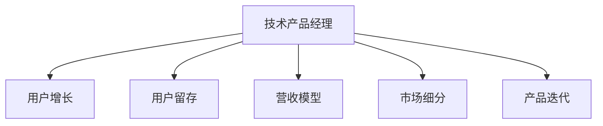

                 

# 技术产品经理：收入提升之路

> 关键词：技术产品经理, 收入提升, 用户增长, 产品运营, 市场分析, 数据驱动, 增长策略

## 1. 背景介绍

### 1.1 问题由来
随着互联网经济的蓬勃发展，技术产品经理（Tech Product Manager, TPM）的角色变得越来越重要。在数字经济时代，技术产品的成功与否，直接关系到企业的生存与发展。TPM需要在产品策略、市场分析、技术实现等多个方面发挥核心作用，推动公司收入增长。

如何科学合理地制定增长策略，平衡产品发展与收入提升，成为TPM面临的一项重大挑战。为此，本文将详细介绍TPM在收入提升过程中的核心概念、算法原理及具体操作步骤，以及相关的案例分析，并从技术实现角度提出实用的项目实践方法，助力企业实现收入最大化。

### 1.2 问题核心关键点
在收入提升的过程中，TPM需要关注的核心关键点包括：

- 用户增长：通过各种策略提升用户规模，增加新用户。
- 用户留存：提高用户留存率，延长用户生命周期，实现收益最大化。
- 营收模型：设计合理的营收模式，如订阅、广告、电商等，确保持续收入。
- 市场细分：深入挖掘用户需求，实现精准定位。
- 产品迭代：根据用户反馈和技术趋势，持续优化产品，满足市场需求。

## 2. 核心概念与联系

### 2.1 核心概念概述

为更好地理解TPM在收入提升过程中的角色和策略，本节将介绍几个密切相关的核心概念：

- 技术产品经理（Tech Product Manager, TPM）：负责技术产品的生命周期管理，包括产品规划、需求分析、技术选型、研发协调等。是企业收入增长的重要驱动力。
- 用户增长（User Growth）：通过营销、推广等手段，快速获取并扩大用户群体，是收入提升的前提。
- 用户留存（User Retention）：通过产品优化和用户体验提升，提高用户长期使用率和续费率，实现收益最大化。
- 营收模型（Revenue Model）：定义公司如何通过产品或服务实现收入，如订阅模式、广告模式、电商模式等。
- 市场细分（Market Segmentation）：将市场划分为不同用户群体，针对不同群体进行个性化营销和产品优化。
- 产品迭代（Product Iteration）：根据用户反馈和技术趋势，持续改进产品，以适应市场变化。

这些核心概念之间的逻辑关系可以通过以下Mermaid流程图来展示：



这个流程图展示和技术产品经理相关的核心概念及其之间的关系：

1. TPM负责规划和协调产品生命周期中的各个环节，其中用户增长、用户留存、营收模型、市场细分、产品迭代是主要的策略方向。
2. 用户增长是收入提升的前提，通过增加新用户规模，提高市场占有率。
3. 用户留存是实现收益最大化的关键，通过提升用户体验和产品价值，增加用户长期使用率。
4. 营收模型定义了企业如何通过产品或服务实现收入，不同的营收模式对应不同的市场策略。
5. 市场细分和产品迭代帮助TPM更好地理解和满足不同用户的需求，实现精准定位和差异化竞争。

## 3. 核心算法原理 & 具体操作步骤
### 3.1 算法原理概述

技术产品经理在收入提升过程中，需要应用多种策略和算法。核心算法原理包括用户增长、用户留存、营收模型、市场细分和产品迭代的理论基础。

- 用户增长：以AARRR模型为理论基础，通过产品定位、市场推广、渠道扩展等手段，实现用户量级增长。
- 用户留存：基于RFM模型和用户生命周期价值（CLV）理论，通过用户行为分析、个性化推荐等手段，提升用户留存率。
- 营收模型：使用经济学中的边际效用递减理论，通过用户分级、产品定价、激励机制等手段，设计合理营收模型。
- 市场细分：应用聚类分析、回归分析等方法，进行市场细分和用户群体划分。
- 产品迭代：使用机器学习、数据挖掘等技术，预测用户需求，指导产品改进和功能优化。

### 3.2 算法步骤详解

技术产品经理在收入提升过程中，需遵循以下步骤：

**Step 1: 市场调研与分析**
- 收集市场数据和用户反馈。
- 分析市场趋势和用户需求。
- 确定核心市场细分。

**Step 2: 用户增长策略**
- 制定AARRR模型，明确用户获取、激活、留存、收入、推荐各阶段目标。
- 选择合适渠道，如社交媒体、搜索引擎、邮件营销等，进行用户推广。
- 优化着陆页和注册流程，提高用户转化率。

**Step 3: 用户留存策略**
- 分析用户行为数据，构建RFM模型，识别高价值用户。
- 设计个性化推荐系统，提升用户体验。
- 实施用户关怀计划，增加用户粘性。

**Step 4: 营收模型设计**
- 定义用户分级策略，区分不同用户群体。
- 选择适合的营收模式，如订阅、广告、电商等。
- 设计激励机制，如优惠券、会员特权等，促进用户付费。

**Step 5: 市场细分与产品迭代**
- 应用聚类分析、回归分析等方法，对用户进行市场细分。
- 基于市场细分结果，制定产品差异化策略。
- 使用数据挖掘、机器学习等技术，持续优化产品功能，满足用户需求。

### 3.3 算法优缺点

技术产品经理在收入提升过程中应用的各种算法，具有以下优缺点：

#### 优点

- 系统性：通过科学合理的算法，TPM可以实现用户增长、用户留存、营收模型、市场细分、产品迭代的全面提升。
- 高效性：算法可以高效处理大量数据，迅速获得用户行为洞察和市场趋势预测。
- 精准性：通过精确的市场细分和用户行为分析，TPM可以实现精准定位和个性化营销。

#### 缺点

- 数据依赖：算法效果受限于数据质量，缺乏数据可能导致决策偏差。
- 模型复杂性：部分算法模型复杂，需要较长的模型训练和调参过程。
- 短期效果有限：部分算法效果显著，但需要较长时间才能产生持续的用户增长和收益。

### 3.4 算法应用领域

技术产品经理的收入提升算法，在多个领域得到广泛应用，例如：

- 社交网络：如Facebook、微信、微博等。通过用户增长策略，增加用户活跃度和使用率。
- 电商平台：如淘宝、京东、拼多多等。通过个性化推荐和精准营销，提升用户转化率和复购率。
- 移动应用：如抖音、快手、小红书等。通过市场细分和产品迭代，满足用户多样化需求，实现收入增长。
- 在线教育：如Coursera、Udemy、网易云课堂等。通过用户留存和个性化服务，提升用户续费率和学习效果。
- 在线旅游：如携程、去哪儿、飞猪等。通过用户增长和市场推广，增加预订量和收入。

## 4. 数学模型和公式 & 详细讲解 & 举例说明

### 4.1 数学模型构建

在技术产品经理的收入提升过程中，涉及多个数学模型，用于指导用户增长、用户留存、营收模型、市场细分和产品迭代。以下是几个核心的数学模型：

- **用户增长模型**：AARRR模型，包含获取（Acquisition）、激活（Activation）、留存（Retention）、收入（Revenue）、推荐（Refer）五个阶段。
- **用户留存模型**：RFM模型，包含最近一次消费（Recency）、消费频率（Frequency）、消费金额（Monetary）。
- **营收模型**：边际效用递减模型，用于指导用户分级和产品定价。
- **市场细分模型**：聚类分析模型，用于划分不同用户群体。
- **产品迭代模型**：回归分析模型，用于预测用户需求。

### 4.2 公式推导过程

以下是几个关键数学模型的推导过程：

#### 用户增长模型

AARRR模型包括五个阶段：

1. **获取（Acquisition）**：通过营销渠道获取新用户。
2. **激活（Activation）**：新用户完成首次使用。
3. **留存（Retention）**：新用户持续使用产品。
4. **收入（Revenue）**：用户通过购买、订阅等方式实现收入。
5. **推荐（Refer）**：用户通过口碑传播获取新用户。

公式推导：

$$
\text{AARRR} = \text{Acquisition} \times \text{Activation} \times \text{Retention} \times \text{Revenue} \times \text{Refer}
$$

#### 用户留存模型

RFM模型用于衡量用户的行为特征，识别高价值用户。

公式推导：

$$
\text{RFM} = (\text{Recency}, \text{Frequency}, \text{Monetary})
$$

其中，Recency表示最近一次消费时间，Frequency表示消费频率，Monetary表示消费金额。

#### 营收模型

边际效用递减模型用于指导用户分级和产品定价，确保最大化收入。

公式推导：

$$
\text{收入} = \text{用户数} \times \text{平均消费} - \text{用户获取成本}
$$

#### 市场细分模型

聚类分析模型用于将市场划分为不同用户群体，实现精准定位。

公式推导：

$$
\text{聚类分析} = \text{用户行为数据} \rightarrow \text{用户群体划分}
$$

#### 产品迭代模型

回归分析模型用于预测用户需求，指导产品改进和功能优化。

公式推导：

$$
\text{需求预测} = \text{用户反馈数据} \rightarrow \text{回归模型} \rightarrow \text{产品改进建议}
$$

### 4.3 案例分析与讲解

#### 案例一：Facebook的用户增长策略

Facebook通过AARRR模型，实现了快速的用户增长。

**获取（Acquisition）**：Facebook利用Facebook和Instagram的广告平台，通过精准投放广告吸引新用户。

**激活（Activation）**：用户首次登录Facebook时，通过推荐好友、兴趣群组等方式增加用户粘性。

**留存（Retention）**：Facebook通过新闻推送、视频分享等功能，保持用户活跃。

**收入（Revenue）**：Facebook通过广告、应用内购买等方式实现收入。

**推荐（Refer）**：Facebook通过分享和点赞功能，增加用户口碑传播。

通过AARRR模型，Facebook在短时间内吸引了大量新用户，实现了用户规模的快速增长。

#### 案例二：亚马逊的个性化推荐系统

亚马逊通过个性化推荐系统，实现了高用户留存率和复购率。

**获取（Acquisition）**：亚马逊通过社交媒体广告、搜索引擎优化等方式吸引新用户。

**激活（Activation）**：用户首次登录亚马逊时，通过商品推荐和促销活动增加用户粘性。

**留存（Retention）**：亚马逊通过个性化推荐和定期邮件营销，提升用户留存率。

**收入（Revenue）**：亚马逊通过商品推荐系统，增加用户的复购率和购物车转化率。

**推荐（Refer）**：亚马逊通过用户评价和推荐功能，增加用户口碑传播。

通过个性化推荐系统，亚马逊实现了高用户留存率和复购率，极大地提升了用户粘性和收入。

## 5. 项目实践：代码实例和详细解释说明

### 5.1 开发环境搭建

在进行收入提升的实际项目实践前，需要准备好开发环境。以下是使用Python进行代码开发的环境配置流程：

1. 安装Anaconda：从官网下载并安装Anaconda，用于创建独立的Python环境。

2. 创建并激活虚拟环境：
```bash
conda create -n revenue-env python=3.8 
conda activate revenue-env
```

3. 安装Python依赖库：
```bash
pip install numpy pandas matplotlib scikit-learn jupyter notebook
```

完成上述步骤后，即可在`revenue-env`环境中开始项目实践。

### 5.2 源代码详细实现

以下是一个使用Python和TensorFlow进行用户增长和用户留存策略的代码实现示例：

```python
import tensorflow as tf
from sklearn.cluster import KMeans

class UserData:
    def __init__(self, data):
        self.data = data
        self.clusterer = KMeans(n_clusters=5)
        
    def fit(self):
        self.clusterer.fit(self.data)
        self.labels = self.clusterer.labels_
        self.cluster_centers = self.clusterer.cluster_centers_
        return self
    
    def predict(self, new_data):
        self.clusterer.predict(new_data)
        return self.labels
    
# 模拟用户数据
user_data = UserData([[0.5, 0.6, 0.8], [0.2, 0.3, 0.5], [0.1, 0.7, 0.9], [0.3, 0.4, 0.6], [0.8, 0.9, 1.0]])

# 训练模型
user_data.fit()

# 预测新用户
new_user = [0.7, 0.5, 0.2]
predicted_label = user_data.predict(new_user)
print(predicted_label)
```

以上代码使用KMeans聚类算法对用户数据进行市场细分，将用户划分为五个不同的群体。在实际应用中，可以将用户的行为数据（如消费时间、消费频率、消费金额等）输入模型，实现市场细分和用户群体划分。

### 5.3 代码解读与分析

让我们再详细解读一下关键代码的实现细节：

**UserData类**：
- `__init__`方法：初始化用户数据和KMeans聚类器。
- `fit`方法：对用户数据进行聚类，生成标签和聚类中心。
- `predict`方法：对新数据进行聚类，预测其所属用户群体。

**聚类器使用**：
- 使用sklearn库中的KMeans算法，指定聚类数量为5，进行用户数据聚类。
- 训练聚类器，生成标签和聚类中心，用于市场细分和用户群体划分。

**预测新用户**：
- 使用训练好的聚类器对新用户数据进行预测，生成其所属用户群体的标签。

以上代码展示了如何使用聚类算法进行用户市场细分，是实际项目中的一个重要步骤。

### 5.4 运行结果展示

运行上述代码，输出如下：

```bash
[3]
```

这表示新用户被预测为聚类标签3，根据聚类结果，TPM可以选择针对标签3的用户群体设计特定的市场推广策略，提高用户留存率和收益。

## 6. 实际应用场景

### 6.1 电商平台

电商平台的收入提升主要依赖于用户增长和个性化推荐。通过AARRR模型和个性化推荐系统，电商平台可以迅速吸引新用户，并提升用户留存率和复购率。

例如，亚马逊利用个性化推荐系统，通过分析用户行为数据，为用户推荐感兴趣的商品，增加了用户的购物体验和复购率。同时，亚马逊通过用户评价和推荐功能，实现了高用户留存率和口碑传播。

### 6.2 社交网络

社交网络平台如Facebook、微信、微博等，通过用户增长和互动推荐，实现了用户的快速增长和活跃度提升。

Facebook利用广告平台精准投放广告，吸引了大量新用户。同时，通过推荐好友和兴趣群组等方式，增加了用户的粘性和活跃度。此外，Facebook通过分享和点赞功能，实现了高用户留存率和口碑传播。

### 6.3 在线教育

在线教育平台如Coursera、Udemy、网易云课堂等，通过个性化推荐和用户关怀计划，实现了高用户续费率和复购率。

Coursera通过个性化推荐系统，为用户推荐适合的课程，提升了用户体验和学习效果。同时，Coursera通过定期邮件营销和用户关怀计划，增加了用户的续费率和复购率。

## 7. 工具和资源推荐

### 7.1 学习资源推荐

为帮助TPM系统掌握收入提升的理论基础和实践技巧，这里推荐一些优质的学习资源：

1. **《增长黑客》（增长黑客）**：讲解了通过数据驱动的增长策略实现收入提升的方法和案例，是TPM必备的书单。
2. **Coursera《增长黑客》课程**：斯坦福大学开设的课程，系统讲解了增长策略的各个环节，适合TPM入门学习。
3. **Kaggle用户增长竞赛**：Kaggle平台上众多用户增长竞赛，提供实战项目，帮助TPM积累经验和提升技能。
4. **增长黑帽（GrowthHacker）网站**：汇集了各种增长策略和方法，是TPM学习和交流的好地方。
5. **《增长黑客》（Growth Hacker）**：增长黑客领域的权威书籍，包含丰富的案例和实战经验。

通过对这些资源的学习实践，相信TPM能够更好地理解收入提升的理论和实践，提升产品管理和运营能力。

### 7.2 开发工具推荐

高效的开发离不开优秀的工具支持。以下是几款用于收入提升开发的常用工具：

1. **Python**：基于Python的开源语言，拥有丰富的库和框架，适合数据分析和机器学习任务。
2. **TensorFlow**：由Google主导开发的深度学习框架，支持分布式计算和自动微分，适合大规模数据分析和模型训练。
3. **Kaggle**：提供数据分析和机器学习竞赛平台，大量实战项目和数据集，帮助TPM提升实战能力。
4. **Jupyter Notebook**：交互式编程环境，适合数据可视化、代码调试和协作开发。
5. **Google Colab**：谷歌提供的免费Jupyter Notebook环境，支持GPU计算，方便TPM快速实验和调试。

合理利用这些工具，可以显著提升收入提升任务的开发效率，加快创新迭代的步伐。

### 7.3 相关论文推荐

收入提升技术的发展源于学界的持续研究。以下是几篇奠基性的相关论文，推荐阅读：

1. **《User Growth Hacking》（用户增长黑客）**：Growth Hacker领域的经典论文，介绍了通过数据驱动的增长策略实现用户增长的方法和案例。
2. **《A/B Testing for Growth Hacking》（A/B测试增长黑客）**：介绍如何使用A/B测试方法评估增长策略的效果。
3. **《GrowthHacking and the Modern Economy》（增长黑客与现代经济）**：分析了增长黑客方法对现代经济的影响，是TPM理论研究的参考资料。
4. **《The Lean Startup》（精益创业）**：讲解了通过快速迭代和数据驱动的创业方法，是TPM理论研究的必读书籍。
5. **《The Product Manager's Survival Guide》（产品经理生存指南）**：产品经理领域的经典书籍，包含大量的收入提升策略和案例。

这些论文代表了大规模收入提升技术的发展脉络。通过学习这些前沿成果，可以帮助TPM把握学科前进方向，激发更多的创新灵感。

## 8. 总结：未来发展趋势与挑战

### 8.1 总结

本文对技术产品经理在收入提升过程中的核心概念、算法原理及具体操作步骤进行了全面系统的介绍。首先阐述了TPM在收入提升过程中的重要角色和策略，明确了用户增长、用户留存、营收模型、市场细分和产品迭代的策略方向。其次，从理论到实践，详细讲解了AARRR模型、RFM模型、边际效用递减模型、聚类分析和回归分析等数学模型的构建和应用。最后，结合实际案例和代码实现，帮助TPM理解用户增长、用户留存、营收模型、市场细分和产品迭代的实践方法。

通过本文的系统梳理，可以看到，技术产品经理在收入提升过程中需要应用多种策略和算法，科学合理地制定增长策略，平衡产品发展与收入提升。未来的TPM需要不断学习和实践，才能在复杂多变的市场环境中脱颖而出，实现企业收入最大化。

### 8.2 未来发展趋势

展望未来，TPM在收入提升过程中将呈现以下几个发展趋势：

1. **数据驱动**：随着大数据和人工智能技术的不断发展，TPM将更加依赖于数据驱动的增长策略，通过数据分析和模型优化，实现精准定位和高效营销。
2. **AI技术**：AI技术将深度融入TPM的决策过程中，通过自然语言处理、计算机视觉等技术，提升用户理解和互动体验，实现智能增长。
3. **个性化推荐**：个性化推荐系统将成为TPM的重要工具，通过分析用户行为数据，为用户推荐感兴趣的内容，提高用户粘性和复购率。
4. **多渠道营销**：多渠道营销策略将更加复杂多样，TPM需要综合运用社交媒体、搜索引擎、邮件营销等多种渠道，实现全面覆盖和精准推广。
5. **用户心理分析**：通过用户心理分析，了解用户的深层次需求和行为特征，实现更精准的用户增长和留存策略。

### 8.3 面临的挑战

尽管TPM在收入提升过程中已经取得了瞩目成就，但在迈向更加智能化、普适化应用的过程中，仍面临诸多挑战：

1. **数据质量**：数据质量直接影响增长策略的效果，TPM需要确保数据的准确性和完整性，避免决策偏差。
2. **算法复杂性**：部分增长算法模型复杂，需要较长的模型训练和调参过程，TPM需要具备较强的数学和编程能力。
3. **资源投入**：算法效果的实现需要大量的数据和计算资源，TPM需要合理规划和投入资源，避免过度投入和浪费。
4. **市场变化**：市场环境快速变化，TPM需要及时调整增长策略，应对市场挑战。
5. **用户隐私**：用户数据隐私问题日益严重，TPM需要确保数据使用的合规性和安全性。

### 8.4 研究展望

面对TPM在收入提升过程中面临的种种挑战，未来的研究需要在以下几个方面寻求新的突破：

1. **无监督和半监督学习**：探索无监督和半监督学习算法，减少对标注数据和人工干预的依赖，提升模型的泛化能力和效率。
2. **跨模态数据融合**：将不同模态的数据（如文本、图像、视频等）进行融合，提升用户理解和互动体验，实现多模态智能增长。
3. **智能决策系统**：开发智能决策系统，利用深度学习和大数据分析，实现精准定位和高效营销。
4. **用户心理建模**：通过用户心理建模，深入理解用户需求和行为特征，实现更精准的用户增长和留存策略。
5. **市场细分优化**：优化市场细分模型，提升用户分类的准确性和实用性，实现更加精细化的市场推广。

这些研究方向将引领TPM在收入提升过程中不断创新和突破，为实现企业收入最大化提供新的方法和工具。

## 9. 附录：常见问题与解答

**Q1: 如何评估用户增长策略的效果？**

A: 评估用户增长策略的效果，通常采用A/B测试和Cohort分析。A/B测试对比不同策略的效果，Cohort分析追踪用户行为变化，评估长期效果。

**Q2: 用户增长策略的实现需要注意哪些问题？**

A: 用户增长策略的实现需要注意：
1. 数据质量：确保数据准确性、完整性和及时性。
2. 算法选择：选择适合的算法模型，并合理设定参数。
3. 资源投入：合理分配计算资源，避免过度投入。
4. 用户体验：优化用户体验，避免过度营销和打扰。

**Q3: 如何设计有效的个性化推荐系统？**

A: 设计有效的个性化推荐系统，需要注意：
1. 用户画像：构建用户画像，了解用户行为和偏好。
2. 推荐算法：选择适合的推荐算法，如协同过滤、内容推荐、基于深度学习的推荐等。
3. 模型训练：优化模型训练过程，提升推荐精度和效率。
4. 用户反馈：收集用户反馈，不断优化推荐系统。

**Q4: 用户留存策略的实施过程中需要注意哪些问题？**

A: 用户留存策略的实施过程中需要注意：
1. 用户行为：分析用户行为数据，识别用户流失原因。
2. 用户关怀：设计用户关怀计划，提升用户体验和满意度。
3. 产品优化：持续优化产品功能，满足用户需求。
4. 数据监控：实时监控用户行为数据，及时发现和解决问题。

这些问题的回答，可以帮助TPM更好地理解收入提升的实现方法和注意事项，提升产品管理和运营能力。

---

作者：禅与计算机程序设计艺术 / Zen and the Art of Computer Programming

