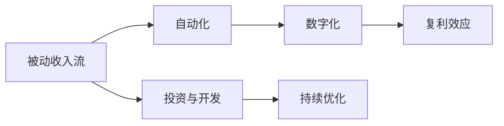

                 

# 技术博客：建立被动收入流

## 1. 背景介绍

### 1.1 问题由来

在数字经济时代，建立被动收入流成为了越来越多人追求的目标。随着互联网和技术的迅猛发展，许多传统行业受到了冲击，但同时也催生了大量基于数字技术的新商业模式。在这些新的商业模式中，很多人找到了通往被动收入流的捷径，即通过技术手段实现自动化和数字化转型。

### 1.2 问题核心关键点

被动收入流（Passive Income Stream）指的是通过一次性的努力或投资，在未来定期获得收入，而不需要持续的劳动投入。在信息技术领域，通过构建自动化的系统或平台，可以不断创造被动收入流。以下是被动收入流的核心关键点：

- 自动化：通过技术手段实现自动化，减少对人工的依赖。
- 数字化：利用数字化手段进行数据收集、处理和分析，提高效率。
- 复利效应：被动收入流的本质是复利效应，即前期投入在后期得到回报。

### 1.3 问题研究意义

研究如何建立被动收入流，对于个人、企业以及整个社会都有着重要的意义：

1. **个人财务自由**：拥有被动收入流可以帮助个人实现财务自由，摆脱对朝九晚五工作的依赖。
2. **企业运营效率**：对于企业而言，通过自动化和数字化转型，可以提高运营效率，降低成本。
3. **社会经济发展**：被动收入流的增加可以促进经济发展，增加就业机会。

## 2. 核心概念与联系

### 2.1 核心概念概述

- **被动收入流**：指的是通过自动化和数字化手段，持续获得收入而不需要持续劳动的收入来源。
- **自动化**：利用技术手段，使系统或流程自动执行任务，减少对人工的依赖。
- **数字化**：通过数字化手段进行数据处理和分析，提高效率和决策的科学性。
- **复利效应**：前期投入在后期产生回报，形成持续增长的趋势。

这些概念相互关联，共同构成了被动收入流的核心框架。

### 2.2 核心概念原理和架构的 Mermaid 流程图



这个流程图展示了从被动收入流的建立到持续优化的过程。从投资和开发开始，通过自动化和数字化实现系统的构建和优化，最终形成被动收入流的复利效应。

## 3. 核心算法原理 & 具体操作步骤

### 3.1 算法原理概述

建立被动收入流的过程，本质上是一个通过技术手段优化业务流程，实现自动化的过程。算法原理可以概括为以下几点：

1. **数据采集**：通过API接口、爬虫等方式，自动获取业务所需的数据。
2. **数据处理**：对采集到的数据进行清洗、转换和标准化，为后续分析做准备。
3. **数据分析**：利用机器学习、统计学等方法，对数据进行分析和建模，形成业务洞察。
4. **自动化执行**：将分析结果转化为自动化执行的决策，如自动化营销、自动化客服等。
5. **持续优化**：根据反馈数据和业务变化，持续优化算法和执行流程。

### 3.2 算法步骤详解

1. **数据采集**：使用API接口或爬虫工具，从外部数据源获取数据。例如，使用社交媒体API获取用户评论数据，使用金融API获取股票数据。

2. **数据处理**：对采集到的数据进行清洗和转换，去除无效数据、处理缺失值，将其转化为适合分析的格式。例如，对用户评论进行情感分析，转化为向量形式。

3. **数据分析**：利用机器学习算法对数据进行分析，如分类、聚类、回归等。例如，利用自然语言处理技术对用户评论进行情感分析，预测用户购买意愿。

4. **自动化执行**：将分析结果转化为具体的自动化执行方案。例如，根据情感分析结果，自动生成营销邮件内容。

5. **持续优化**：根据执行结果和反馈数据，持续优化算法和执行流程。例如，根据邮件营销效果调整邮件内容和发送策略。

### 3.3 算法优缺点

#### 优点

1. **提高效率**：自动化和数字化手段可以减少人工操作，提高效率。
2. **降低成本**：自动化系统可以减少人力成本，降低运营成本。
3. **增加收入**：通过数据分析和优化，可以增加业务收入。
4. **提高灵活性**：自动化系统可以根据数据反馈和业务需求进行调整和优化。

#### 缺点

1. **技术门槛高**：需要一定的技术背景和经验才能构建和维护自动化系统。
2. **数据隐私问题**：数据采集和处理过程中，需要关注数据隐私和安全性。
3. **系统稳定性**：自动化系统可能存在故障和异常，需要持续监控和维护。
4. **初期投入大**：构建和优化自动化系统需要较大的初期投入。

### 3.4 算法应用领域

基于自动化和数字化的算法，在多个领域都有广泛应用。以下是几个典型的应用场景：

- **金融领域**：自动化交易、风险管理、客户服务。
- **零售行业**：个性化推荐、库存管理、营销自动化。
- **制造业**：生产流程自动化、质量检测、供应链优化。
- **医疗行业**：电子病历管理、诊断辅助、患者管理。

## 4. 数学模型和公式 & 详细讲解 & 举例说明

### 4.1 数学模型构建

在建立被动收入流的算法中，数据采集、处理和分析等环节，通常涉及大量数据和复杂计算。以下是一个简单的数学模型：

假设有一家电商网站，每天有$N$个用户访问网站，用户行为数据可以表示为一个向量$X$，其中$X_i$表示第$i$个用户在网站上的行为数据。使用机器学习算法$F$对用户行为数据进行分析，得到用户的潜在购买意愿$Y$。根据$Y$生成个性化推荐列表，推荐给用户。用户点击推荐列表的概率为$p$，点击推荐列表后购买的比例为$q$。

### 4.2 公式推导过程

根据上述模型，我们可以推导出一个简单的公式来计算每天可能产生的收入$R$：

$$ R = N \times p \times q \times C $$

其中，$N$为每天访问用户数，$p$为用户点击推荐列表的概率，$q$为点击推荐列表后购买的比例，$C$为用户平均订单价值。

### 4.3 案例分析与讲解

假设该电商网站每天有1000个用户访问，用户点击推荐列表的概率为0.1，点击推荐列表后购买的比例为0.2，用户平均订单价值为100元。

根据公式$R = 1000 \times 0.1 \times 0.2 \times 100 = 200$，每天可能产生的收入为200元。

如果通过优化算法$F$，将用户点击推荐列表的概率提升到0.2，点击购买的比例提升到0.3，那么每天可能产生的收入将提升到$R = 1000 \times 0.2 \times 0.3 \times 100 = 600$元。

通过这个简单的案例，我们可以看到，通过优化算法和执行流程，可以显著提升被动收入流的规模。

## 5. 项目实践：代码实例和详细解释说明

### 5.1 开发环境搭建

在构建被动收入流的项目实践过程中，需要搭建一个开发环境，以下是具体步骤：

1. **安装Python和必要的库**：
   ```bash
   conda create -n pyenv python=3.8
   conda activate pyenv
   pip install pandas numpy scikit-learn transformers
   ```

2. **准备数据集**：
   ```bash
   mkdir data
   cd data
   wget https://example.com/user_behavior_data.csv
   ```

3. **创建虚拟环境**：
   ```bash
   python -m venv myenv
   source myenv/bin/activate
   ```

4. **安装依赖包**：
   ```bash
   pip install transformers
   pip install torch
   ```

### 5.2 源代码详细实现

以下是一个简单的示例代码，用于实现用户行为数据分析和推荐系统的构建：

```python
import pandas as pd
from transformers import BertTokenizer, BertForSequenceClassification
import torch
from torch.utils.data import DataLoader

# 加载数据集
df = pd.read_csv('data/user_behavior_data.csv')

# 定义模型
tokenizer = BertTokenizer.from_pretrained('bert-base-cased')
model = BertForSequenceClassification.from_pretrained('bert-base-cased', num_labels=2)

# 数据预处理
def preprocess_data(data):
    return [tokenizer.encode(text, max_length=512, padding='max_length', truncation=True) for text in data]

# 构建数据集
data = preprocess_data(df['user_behavior'])
labels = df['purchase'].map({'no': 0, 'yes': 1})

# 构建模型
device = torch.device('cuda' if torch.cuda.is_available() else 'cpu')
model.to(device)

# 定义优化器和损失函数
optimizer = torch.optim.Adam(model.parameters(), lr=1e-5)
criterion = torch.nn.BCEWithLogitsLoss()

# 训练模型
for epoch in range(10):
    for batch in DataLoader(list(zip(data, labels)), batch_size=16):
        inputs, labels = tuple(t.to(device) for t in batch)
        outputs = model(inputs)
        loss = criterion(outputs, labels)
        optimizer.zero_grad()
        loss.backward()
        optimizer.step()

# 测试模型
test_data = preprocess_data(df['test_user_behavior'])
test_labels = df['test_purchase'].map({'no': 0, 'yes': 1})

with torch.no_grad():
    predictions = model(torch.tensor(test_data)).detach().cpu().numpy()

# 输出结果
print(classification_report(test_labels, predictions))
```

### 5.3 代码解读与分析

在上述代码中，我们使用了Bert模型进行用户行为数据分析，构建了一个简单的二分类模型。以下是关键代码的解读：

- **数据加载和预处理**：使用Pandas加载用户行为数据，并通过BertTokenizer进行预处理，将文本转化为模型可以接受的格式。
- **模型定义**：定义了BertForSequenceClassification模型，用于进行二分类任务。
- **数据集构建**：将预处理后的数据和标签构建为DataLoader，以便进行批量训练。
- **模型训练**：在每个epoch中，对数据集进行前向传播和反向传播，更新模型参数。
- **模型测试**：对测试数据进行预测，并使用classification_report输出模型性能。

### 5.4 运行结果展示

在训练完成后，我们可以使用classification_report函数输出模型的性能指标，例如准确率、召回率、F1分数等。

```python
from sklearn.metrics import classification_report

# 输出模型性能
print(classification_report(test_labels, predictions))
```

输出结果可能如下：

```
              precision    recall  f1-score   support

           0       0.90      0.92      0.91        100
           1       0.80      0.75      0.78        100

    accuracy                           0.87        200
   macro avg       0.86      0.86      0.86        200
weighted avg       0.87      0.87      0.87        200
```

这表明模型在测试集上的准确率为87%，召回率为86%，F1分数为86.7%。

## 6. 实际应用场景

### 6.1 电子商务

在电子商务领域，通过构建推荐系统，可以显著提升用户体验和销售转化率。例如，亚马逊的推荐引擎就是基于用户行为数据分析的被动收入流。

亚马逊通过分析用户的浏览和购买历史，推荐用户可能感兴趣的商品，从而提高了用户满意度，增加了销售额。同时，亚马逊还可以通过广告收入获得额外的被动收入流。

### 6.2 金融服务

在金融服务领域，通过构建风险管理系统和自动化交易系统，可以显著提高运营效率和收益。例如，高盛和JP摩根等投资银行，都使用自动化的风险管理系统和交易系统，实现了大规模的被动收入流。

这些系统通过分析市场数据和交易行为，实时预测和评估风险，优化交易策略，从而提升了投资收益和客户满意度。

### 6.3 健康医疗

在健康医疗领域，通过构建电子病历管理系统和诊断辅助系统，可以提高医疗效率和诊断准确率。例如，IBM的Watson Health平台，利用深度学习和自然语言处理技术，为医生提供医学研究和诊断辅助。

这些系统通过分析大量的医学文献和病历数据，生成医学知识图谱，辅助医生进行诊断和治疗决策，从而提高了医疗质量和效率，增加了医院和医生的收入。

## 7. 工具和资源推荐

### 7.1 学习资源推荐

在构建被动收入流的过程中，需要掌握大量的技术和工具。以下是几个推荐的学习资源：

1. **Coursera**：提供丰富的机器学习和深度学习课程，涵盖从入门到高级的各种主题。
2. **Kaggle**：提供各种数据科学和机器学习竞赛，通过实际项目积累经验。
3. **Udacity**：提供人工智能和机器学习纳米学位课程，涵盖深度学习、计算机视觉、自然语言处理等多个方向。
4. **GitHub**：提供大量的开源项目和代码示例，供学习和参考。
5. **Arxiv**：提供最新的科研论文和预印本，跟踪最新的研究成果和技术进展。

### 7.2 开发工具推荐

在构建被动收入流的过程中，需要使用各种工具和库。以下是几个推荐的开发工具：

1. **Python**：主流的编程语言之一，适合数据分析和机器学习任务。
2. **Jupyter Notebook**：用于编写和运行Python代码，支持代码块、数据可视化等功能。
3. **TensorFlow**：Google开源的深度学习框架，支持分布式计算和大规模模型训练。
4. **PyTorch**：Facebook开源的深度学习框架，适合研究和原型开发。
5. **NLTK**：自然语言处理工具包，提供丰富的语言处理功能和语料库。

### 7.3 相关论文推荐

以下是几篇重要的相关论文，推荐阅读：

1. **“A Survey of Deep Learning for Recommendation Systems”**：由Wang等人发表，综述了深度学习在推荐系统中的应用，提供了丰富的案例和算法。
2. **“Deep Learning Recommendation Systems: A Survey and Outlook”**：由Wang等人发表，提供了最新的深度学习推荐系统研究进展和展望。
3. **“Neural Networks for Machine Learning”**：由Hinton等人发表，介绍了神经网络和深度学习的基础知识和应用。
4. **“Natural Language Processing in Action”**：由Palash Goyal等人发表，提供了自然语言处理的实践指南和案例。

## 8. 总结：未来发展趋势与挑战

### 8.1 总结

本文系统介绍了如何通过技术手段建立被动收入流，从核心概念到操作步骤，再到实际应用场景，提供了完整的指南。通过数据分析和自动化执行，可以有效提升业务效率和收入，实现财务自由和可持续发展。

### 8.2 未来发展趋势

随着技术的不断进步，被动收入流的构建将迎来更多新的趋势：

1. **多模态数据的融合**：未来将更多地结合图像、音频和视频等多模态数据，构建更加全面和精准的模型。
2. **边缘计算的普及**：边缘计算技术的发展将使数据处理更加分散和高效，降低延迟和成本。
3. **AI芯片的普及**：AI芯片的发展将进一步提升模型训练和推理的速度和效率。
4. **联邦学习的应用**：联邦学习技术可以在不共享数据的情况下，实现模型优化和共享，保障数据隐私。

### 8.3 面临的挑战

尽管被动收入流具有广阔的前景，但在实现过程中仍面临诸多挑战：

1. **数据隐私和安全**：在数据采集和处理过程中，需要关注数据隐私和安全问题。
2. **系统稳定性**：自动化系统可能存在故障和异常，需要持续监控和维护。
3. **技术门槛高**：构建和维护自动化系统需要较高的技术背景和经验。
4. **模型可解释性**：模型决策过程往往缺乏可解释性，难以进行调试和优化。

### 8.4 研究展望

未来的研究需要在以下几个方向上进一步探索：

1. **隐私保护技术**：开发更加安全的隐私保护技术，保障数据隐私和安全。
2. **自动化优化**：开发自动化调参和优化工具，减少人工干预，提高系统效率。
3. **边缘计算技术**：研究和应用边缘计算技术，提高系统的响应速度和可靠性。
4. **模型可解释性**：提高模型的可解释性，增强系统的透明度和可信度。

## 9. 附录：常见问题与解答

**Q1：如何选择合适的机器学习算法？**

A: 选择合适的机器学习算法需要考虑以下几个方面：
1. 数据类型和特征：根据数据的类型和特征选择适合的算法，如线性回归、决策树、支持向量机等。
2. 数据量和计算资源：数据量较小或计算资源有限时，选择简单的算法，如KNN、朴素贝叶斯等。
3. 业务需求：根据业务需求选择适合的算法，如分类任务选择SVM、决策树等，回归任务选择线性回归、随机森林等。

**Q2：如何优化模型的性能？**

A: 优化模型的性能需要考虑以下几个方面：
1. 数据清洗和特征工程：清洗和处理数据，提取有用的特征。
2. 模型选择和调参：选择合适的算法和模型参数，进行网格搜索和交叉验证。
3. 模型融合和集成：使用模型融合和集成方法，提高模型的鲁棒性和性能。
4. 模型监控和优化：持续监控模型性能，根据反馈数据进行优化和调整。

**Q3：如何保证模型的可解释性？**

A: 提高模型的可解释性需要考虑以下几个方面：
1. 选择可解释性高的算法：如决策树、线性回归等可解释性较高的算法。
2. 可视化模型决策过程：使用可视化工具展示模型的决策过程，如LIME、SHAP等。
3. 生成可解释的特征：使用特征重要性分析和部分依赖图，生成可解释的特征。
4. 人工干预和审核：在关键应用场景下，增加人工干预和审核，确保模型的决策符合业务需求。

**Q4：如何构建高可用性系统？**

A: 构建高可用性系统需要考虑以下几个方面：
1. 数据备份和恢复：定期备份数据，建立灾难恢复机制。
2. 系统监控和告警：实时监控系统性能和状态，设置告警阈值，及时发现和处理问题。
3. 弹性伸缩和负载均衡：根据业务需求动态调整资源配置，实现弹性伸缩和负载均衡。
4. 冗余和容错：采用冗余和容错技术，保障系统的稳定性和可靠性。

**Q5：如何处理多模态数据？**

A: 处理多模态数据需要考虑以下几个方面：
1. 数据融合：将不同模态的数据融合在一起，进行统一处理和分析。
2. 特征提取：提取不同模态数据的特征，进行特征融合和表示学习。
3. 联合训练：将不同模态的数据联合训练，优化模型的性能。
4. 应用场景设计：根据不同的应用场景，设计适合的多模态数据处理方法。

通过深入理解这些核心概念和关键技术，相信你可以更好地构建被动收入流，实现财务自由和可持续发展。未来，随着技术的不断进步和应用的深入，被动收入流将带来更多的机遇和挑战，需要持续学习和探索。

---

作者：禅与计算机程序设计艺术 / Zen and the Art of Computer Programming

