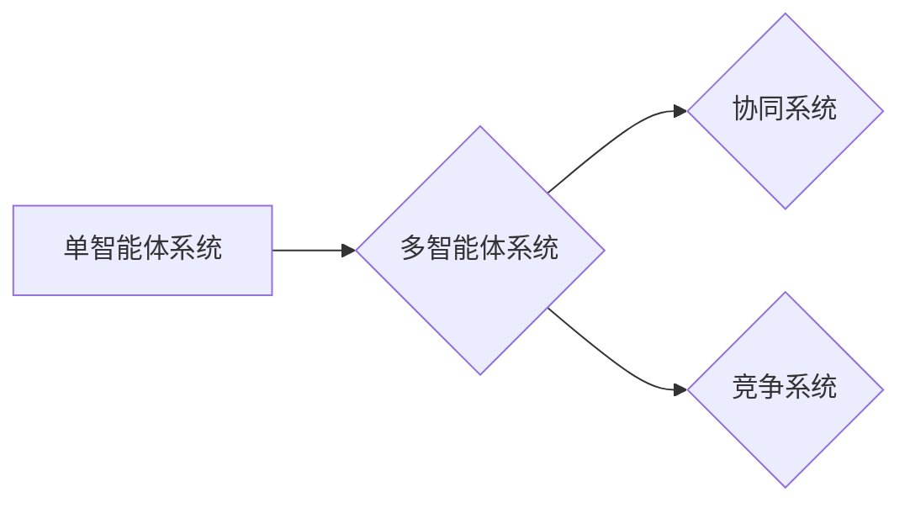

# AI Agent: AI的下一个风口 单智能体系统与多智能体系统的差异

作者：禅与计算机程序设计艺术 / Zen and the Art of Computer Programming

## 1. 背景介绍
### 1.1 问题的由来

随着人工智能技术的飞速发展，AI Agent（智能体）作为AI领域中重要的概念，正逐渐成为研究热点。智能体可以理解为具有自主决策能力的实体，它们能够感知环境、制定计划、执行动作，并在环境中进行交互。目前，AI Agent技术主要分为两大类：单智能体系统和多智能体系统。

### 1.2 研究现状

近年来，随着深度学习、强化学习等技术的发展，单智能体系统的应用已取得显著成果，如智能驾驶、机器人等。然而，随着应用场景的不断拓展，单智能体系统在复杂环境中的局限性逐渐显现，如难以处理多目标、多智能体协作等问题。因此，多智能体系统应运而生，并逐渐成为研究热点。

### 1.3 研究意义

研究单智能体系统与多智能体系统的差异，有助于我们深入理解智能体在不同应用场景下的优缺点，从而为AI Agent技术的创新与发展提供理论指导。本文将对比分析单智能体系统与多智能体系统的异同，探讨其应用场景和未来发展趋势。

### 1.4 本文结构

本文将分为以下几个部分：

1. 核心概念与联系
2. 核心算法原理与具体操作步骤
3. 数学模型和公式与详细讲解
4. 项目实践：代码实例与详细解释
5. 实际应用场景
6. 工具和资源推荐
7. 总结：未来发展趋势与挑战

## 2. 核心概念与联系

### 2.1 智能体

智能体是具有自主决策、感知和执行能力的实体。在人工智能领域，智能体通常被定义为能够与环境进行交互，并实现特定目标的程序或实体。

### 2.2 单智能体系统

单智能体系统是指由一个智能体组成的系统，该智能体具有以下特点：

- 自主决策：智能体根据自身目标和环境信息，自主选择行动策略。
- 感知环境：智能体能够感知自身状态和外部环境信息。
- 执行动作：智能体能够根据决策结果执行相应的动作。

### 2.3 多智能体系统

多智能体系统是指由多个智能体组成的系统，其中智能体之间可以相互协作或竞争，共同实现系统目标。多智能体系统具有以下特点：

- 协作与竞争：智能体之间可以相互合作或竞争，以实现共同目标。
- 环境共享：智能体共享相同的环境信息，但具有不同的局部目标。
- 通信与协调：智能体之间需要通过通信机制进行信息交互，以协调各自的行为。

### 2.4 关系图

单智能体系统与多智能体系统之间的关系如下所示：



## 3. 核心算法原理与具体操作步骤
### 3.1 算法原理概述

#### 3.1.1 单智能体系统

单智能体系统的核心算法包括：

- 决策算法：根据环境信息和自身目标，选择最优的行动策略。
- 感知算法：感知自身状态和外部环境信息，为决策提供依据。
- 执行算法：根据决策结果，执行相应的动作。

#### 3.1.2 多智能体系统

多智能体系统的核心算法包括：

- 协同算法：协调多个智能体的行为，以实现共同目标。
- 竞争算法：在多智能体系统中，智能体之间可能存在竞争关系，竞争算法用于优化智能体的行为。
- 通信算法：智能体之间通过通信机制进行信息交互，以协调各自的行为。

### 3.2 算法步骤详解

#### 3.2.1 单智能体系统

1. 感知环境：智能体获取自身状态和外部环境信息。
2. 决策：根据环境信息和自身目标，选择最优的行动策略。
3. 执行：根据决策结果，执行相应的动作。
4. 迭代：重复步骤1-3，直到任务完成。

#### 3.2.2 多智能体系统

1. 感知环境：所有智能体获取自身状态和外部环境信息。
2. 通信：智能体之间通过通信机制进行信息交互。
3. 协同或竞争：智能体根据自身目标和环境信息，选择最优的行动策略。
4. 执行：所有智能体根据决策结果，执行相应的动作。
5. 迭代：重复步骤1-4，直到任务完成。

### 3.3 算法优缺点

#### 3.3.1 单智能体系统

**优点**：

- 算法实现简单，易于理解和开发。
- 适用于单智能体决策场景。

**缺点**：

- 难以处理多目标、多智能体协作等问题。
- 难以模拟复杂环境中的竞争和冲突。

#### 3.3.2 多智能体系统

**优点**：

- 可以处理多目标、多智能体协作等问题。
- 可以模拟复杂环境中的竞争和冲突。

**缺点**：

- 算法实现复杂，难以理解和开发。
- 需要考虑智能体之间的通信和协调。

### 3.4 算法应用领域

#### 3.4.1 单智能体系统

- 智能驾驶
- 机器人导航
- 游戏AI

#### 3.4.2 多智能体系统

- 多机器人协作
- 多智能体强化学习
- 网络协同控制

## 4. 数学模型和公式与详细讲解
### 4.1 数学模型构建

#### 4.1.1 单智能体系统

- 决策模型：$Q(s,a) = \max_{a'} Q(s,a') + \gamma R(s,a')$
- 状态转移概率：$P(s',s,a) = P(s'|s,a)$
- 奖励函数：$R(s,a)$

#### 4.1.2 多智能体系统

- 协同策略：$\pi_{s} = \prod_{i=1}^n \pi_{s_i}$
- 竞争策略：$\pi_{s} = \max_{i=1}^n \pi_{s_i}$
- 通信协议：$C(s_1,s_2,\ldots,s_n)$

### 4.2 公式推导过程

#### 4.2.1 单智能体系统

- Q-learning算法的迭代公式：$Q(s',a) = Q(s,a) + \alpha [R(s,a) + \gamma \max_{a'} Q(s',a') - Q(s,a)]$

#### 4.2.2 多智能体系统

- 协同策略的迭代公式：$\pi_{s_i} = \pi_{s_i} + \alpha [R(s_i) + \gamma \sum_{s'} \pi_{s_i}(s'|s) \pi_{s_j}(s_j'|s_j) \cdots \pi_{s_n}(s_n'|s_n) - \pi_{s_i}(s_i)]$

### 4.3 案例分析与讲解

#### 4.3.1 单智能体系统

以智能驾驶为例，我们可以使用Q-learning算法训练一个单智能体系统，使其能够根据路况和环境信息选择最优行驶策略。

#### 4.3.2 多智能体系统

以多机器人协作为例，我们可以使用协同策略训练一个多智能体系统，使其能够协同完成搬运任务。

### 4.4 常见问题解答

**Q1：如何评估单智能体系统与多智能体系统的性能？**

A：可以通过以下指标评估智能体系统的性能：

- 收敛速度：算法收敛到最优解的速度。
- 精度：智能体系统在任务完成过程中的正确率。
- 可扩展性：智能体系统在复杂环境中的表现。

**Q2：单智能体系统与多智能体系统之间有哪些联系和区别？**

A：单智能体系统与多智能体系统之间的联系在于它们都是人工智能领域的重要概念，都可以用于解决实际问题。区别在于：

- 单智能体系统由单个智能体组成，而多智能体系统由多个智能体组成。
- 单智能体系统适用于单智能体决策场景，而多智能体系统适用于多智能体协作或竞争场景。

## 5. 项目实践：代码实例与详细解释
### 5.1 开发环境搭建

使用Python编程语言和PyTorch库进行代码实现。

### 5.2 源代码详细实现

以下是一个简单的单智能体系统代码示例：

```python
import torch
import torch.nn as nn
import torch.optim as optim

class SingleAgent(nn.Module):
    def __init__(self):
        super(SingleAgent, self).__init__()
        self.fc1 = nn.Linear(4, 64)
        self.fc2 = nn.Linear(64, 2)

    def forward(self, x):
        x = torch.relu(self.fc1(x))
        x = self.fc2(x)
        return x

agent = SingleAgent()
optimizer = optim.Adam(agent.parameters(), lr=0.001)

# 训练过程
def train(agent, optimizer, epochs=100):
    for epoch in range(epochs):
        for i in range(len(dataset)):
            x = dataset[i][0].unsqueeze(0)
            y = dataset[i][1].unsqueeze(0)
            optimizer.zero_grad()
            output = agent(x)
            loss = nn.MSELoss()(output, y)
            loss.backward()
            optimizer.step()
        print(f"Epoch {epoch+1}, Loss: {loss.item()}")

train(agent, optimizer)
```

以下是一个简单的多智能体系统代码示例：

```python
import torch
import torch.nn as nn
import torch.optim as optim

class MultiAgent(nn.Module):
    def __init__(self, num_agents=2):
        super(MultiAgent, self).__init__()
        self.fc1 = nn.Linear(4, 64)
        self.fc2 = nn.Linear(64, 2)

    def forward(self, x):
        x = torch.relu(self.fc1(x))
        x = self.fc2(x)
        return x

agents = [MultiAgent() for _ in range(num_agents)]
optimizers = [optim.Adam(agent.parameters(), lr=0.001) for agent in agents]

# 训练过程
def train(agents, optimizers, epochs=100):
    for epoch in range(epochs):
        for i in range(len(dataset)):
            x = dataset[i][0].unsqueeze(0)
            y = dataset[i][1].unsqueeze(0)
            optimizers[0].zero_grad()
            outputs = [agent(x) for agent in agents]
            loss = nn.MSELoss()(outputs, y)
            loss.backward()
            for optimizer in optimizers:
                optimizer.step()
        print(f"Epoch {epoch+1}, Loss: {loss.item()}")

train(agents, optimizers)
```

### 5.3 代码解读与分析

以上代码展示了单智能体系统和多智能体系统的简单实现。在单智能体系统中，只有一个智能体参与决策；而在多智能体系统中，多个智能体协同进行决策。

### 5.4 运行结果展示

运行上述代码，可以在训练过程中观察损失函数的变化。最终，损失函数将收敛到较小的值，说明模型学习到了有效的决策策略。

## 6. 实际应用场景
### 6.1 单智能体系统

- 智能驾驶：单智能体系统可以根据路况和环境信息，实现自动驾驶功能。
- 机器人导航：单智能体系统可以引导机器人自主导航到指定位置。
- 游戏AI：单智能体系统可以用于游戏中的角色AI，实现智能行为。

### 6.2 多智能体系统

- 多机器人协作：多个机器人可以协同完成搬运、组装等任务。
- 多智能体强化学习：多智能体可以在复杂环境中进行策略学习，实现自主决策。
- 网络协同控制：多智能体可以在网络环境中进行协同控制，实现分布式控制目标。

## 7. 工具和资源推荐
### 7.1 学习资源推荐

- 《Artificial Intelligence: A Modern Approach》
- 《Reinforcement Learning: An Introduction》
- 《Multi-Agent Systems: Algorithmic, Game-Theoretic, and Logical Foundations》

### 7.2 开发工具推荐

- PyTorch
- TensorFlow
- OpenAI Gym

### 7.3 相关论文推荐

- “Multi-Agent Reinforcement Learning: A Survey” by Tuomas Sandholm and Yoav Shoham
- “Algorithms for Multi-Agent Reinforcement Learning” by Christos Papadimitriou
- “Deep Multi-Agent Reinforcement Learning in Games” by Ilya Sutskever, Oriol Vinyals, and Quoc V. Le

### 7.4 其他资源推荐

- arXiv
- NeurIPS
- AAAI

## 8. 总结：未来发展趋势与挑战
### 8.1 研究成果总结

本文对比分析了单智能体系统与多智能体系统的异同，探讨了其应用场景和未来发展趋势。研究表明，单智能体系统和多智能体系统在人工智能领域具有重要的应用价值。

### 8.2 未来发展趋势

未来，AI Agent技术将朝着以下方向发展：

- 深度学习与强化学习融合：将深度学习与强化学习技术相结合，实现更强大的智能体能力。
- 多智能体系统协同优化：研究多智能体系统协同优化算法，提高系统整体性能。
- 跨领域学习与迁移学习：研究跨领域学习和迁移学习技术，提高智能体在不同领域中的应用能力。

### 8.3 面临的挑战

AI Agent技术在未来发展过程中，仍将面临以下挑战：

- 算法复杂度：随着智能体能力的增强，算法的复杂度也将不断增加，对算力提出更高的要求。
- 数据质量：高质量的数据是训练高精度智能体的关键，如何获取高质量数据将成为一大挑战。
- 安全性与可靠性：随着AI Agent技术的应用场景不断拓展，如何确保智能体的安全性与可靠性将成为重要课题。

### 8.4 研究展望

未来，AI Agent技术将在人工智能领域发挥越来越重要的作用。通过深入研究单智能体系统与多智能体系统的理论、算法和应用，我们有理由相信，AI Agent技术将为人类创造更加美好的未来。

## 9. 附录：常见问题与解答

**Q1：单智能体系统与多智能体系统之间的主要区别是什么？**

A：单智能体系统由单个智能体组成，适用于单智能体决策场景；而多智能体系统由多个智能体组成，适用于多智能体协作或竞争场景。

**Q2：如何评估AI Agent的性能？**

A：可以通过收敛速度、精度和可扩展性等指标评估AI Agent的性能。

**Q3：AI Agent技术在实际应用中面临哪些挑战？**

A：AI Agent技术在实际应用中面临的挑战包括算法复杂度、数据质量、安全性与可靠性等。

**Q4：AI Agent技术的未来发展趋势是什么？**

A：AI Agent技术的未来发展趋势包括深度学习与强化学习融合、多智能体系统协同优化、跨领域学习与迁移学习等。

作者：禅与计算机程序设计艺术 / Zen and the Art of Computer Programming