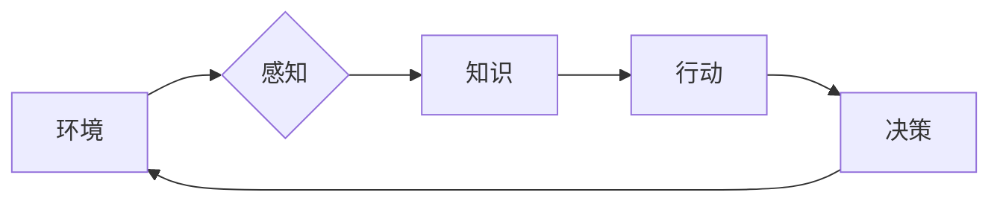

# AI Agent: AI的下一个风口 自主式智能体的典型案例

## 1. 背景介绍
### 1.1 问题的由来

随着人工智能技术的不断发展，从早期的专家系统到深度学习，再到如今的各种AI应用，AI已经渗透到了各行各业。然而，大多数AI应用仍然处于被动响应阶段，只能针对特定输入做出预定义的输出。这种模式虽然已经取得了显著的成果，但无法满足日益增长的对智能化、自动化、自适应的需求。

为了实现更加智能化、自主化的AI系统，AI Agent应运而生。AI Agent是一种能够自主感知环境、决策并采取行动的智能体，是人工智能领域的一个重要研究方向。本文将介绍AI Agent的核心概念、关键技术、典型案例，并探讨其未来发展趋势与挑战。

### 1.2 研究现状

近年来，AI Agent的研究取得了显著进展，主要包括以下几个方面：

1. **环境感知**：通过传感器融合、多模态信息融合等技术，实现对环境的全面感知。
2. **决策规划**：基于强化学习、规划算法等技术，实现对复杂环境的决策和规划。
3. **行动控制**：通过运动控制、机器人控制等技术，实现对执行机构的精准控制。
4. **人机交互**：通过自然语言处理、语音识别等技术，实现人机自然交互。

### 1.3 研究意义

AI Agent具有以下重要意义：

1. **推动人工智能技术发展**：AI Agent研究有助于推动人工智能技术在感知、决策、控制、交互等方面的技术进步。
2. **拓展人工智能应用领域**：AI Agent可以应用于各种场景，如智能制造、智能家居、自动驾驶、智慧城市等，推动人工智能技术落地应用。
3. **提升自动化水平**：AI Agent可以实现更加智能化、自动化的任务执行，提高生产效率，降低人力成本。
4. **促进人机协同**：AI Agent可以帮助人类完成复杂任务，实现人机协同，提高工作效率。

### 1.4 本文结构

本文将按照以下结构展开：

- 第2部分，介绍AI Agent的核心概念与联系。
- 第3部分，讲解AI Agent的关键技术及其具体操作步骤。
- 第4部分，分析AI Agent的数学模型和公式，并结合实例进行讲解。
- 第5部分，给出AI Agent的代码实例和详细解释说明。
- 第6部分，探讨AI Agent的实际应用场景和未来应用展望。
- 第7部分，推荐AI Agent相关的学习资源、开发工具和参考文献。
- 第8部分，总结AI Agent的研究成果、未来发展趋势和面临的挑战。
- 第9部分，提供AI Agent的常见问题与解答。

## 2. 核心概念与联系

AI Agent是一种能够自主感知环境、决策并采取行动的智能体，其核心概念包括：

- **环境**：AI Agent所在的物理或虚拟世界，包含各种状态和事件。
- **感知**：AI Agent获取环境信息的能力，通常通过传感器实现。
- **知识**：AI Agent拥有的关于环境的先验知识，包括规则、模式、经验等。
- **行动**：AI Agent对环境的操作，通常通过执行机构实现。
- **决策**：AI Agent根据感知到的环境和自身知识，选择合适的行动。
- **学习**：AI Agent通过与环境交互，不断学习新的知识和技能。

这些概念之间的关系如下：



可以看出，AI Agent通过感知环境，获取知识，进行决策和行动，形成一个闭环的智能体。学习则是AI Agent不断进化，提高自身能力的重要途径。

## 3. 核心算法原理 & 具体操作步骤
### 3.1 算法原理概述

AI Agent的核心算法主要包括以下几个部分：

- **环境感知算法**：通过传感器获取环境信息，如图像、声音、温度等。
- **知识表示算法**：将感知到的信息表示为知识，如规则、模式、语义等。
- **决策规划算法**：根据知识和目标，选择合适的行动。
- **行动控制算法**：控制执行机构执行行动。

### 3.2 算法步骤详解

AI Agent的算法步骤如下：

1. **初始化**：设置初始状态，包括环境状态、知识库、目标等。
2. **感知**：通过传感器获取环境信息。
3. **知识表示**：将感知到的信息表示为知识。
4. **决策规划**：根据知识和目标，选择合适的行动。
5. **行动控制**：控制执行机构执行行动。
6. **反馈**：获取行动结果，更新环境状态和知识库。
7. **学习**：根据反馈，调整知识库和决策策略。

### 3.3 算法优缺点

AI Agent算法的优点：

- **自适应性**：AI Agent可以根据环境变化，不断调整自身行为。
- **自主性**：AI Agent可以自主执行任务，无需人工干预。
- **可扩展性**：AI Agent可以轻松扩展到新的任务和环境。

AI Agent算法的缺点：

- **复杂性**：AI Agent的算法比较复杂，需要大量的计算资源。
- **可解释性**：AI Agent的行为难以解释，容易产生不可预测的结果。

### 3.4 算法应用领域

AI Agent算法可以应用于以下领域：

- **机器人控制**：如无人机、机器人足球、家政机器人等。
- **自动驾驶**：如自动驾驶汽车、无人驾驶卡车等。
- **智能推荐系统**：如商品推荐、电影推荐、音乐推荐等。
- **游戏AI**：如围棋AI、国际象棋AI等。

## 4. 数学模型和公式 & 详细讲解 & 举例说明
### 4.1 数学模型构建

AI Agent的数学模型主要包括以下几个方面：

- **状态空间**：表示AI Agent所处的环境状态，通常使用向量表示。
- **动作空间**：表示AI Agent可以采取的行动，通常使用向量表示。
- **奖励函数**：用于评估AI Agent的行为，通常使用实数值表示。

### 4.2 公式推导过程

以下是一个简单的AI Agent数学模型示例：

状态空间：$S = \{s_1, s_2, \ldots, s_n\}$

动作空间：$A = \{a_1, a_2, \ldots, a_m\}$

奖励函数：$R(s,a) = r_{ij}$，其中 $r_{ij}$ 表示在状态 $s_i$ 下执行行动 $a_j$ 所获得的奖励。

### 4.3 案例分析与讲解

以下是一个简单的AI Agent应用案例：

**任务**：机器人需要在迷宫中找到出口。

**状态空间**：迷宫的各个位置。

**动作空间**：上下左右移动。

**奖励函数**：到达出口获得奖励，否则获得负奖励。

在这个案例中，AI Agent的目标是学习一个策略，以最大化长期奖励。

### 4.4 常见问题解答

**Q1：如何选择合适的奖励函数？**

A：奖励函数的设计需要根据具体任务和环境进行，通常需要考虑以下因素：

- 任务目标：奖励函数应该与任务目标一致，如最大化收益、最小化损失等。
- 环境特性：奖励函数应该考虑环境的特性和约束，如迷宫游戏中的墙壁、障碍物等。
- 期望行为：奖励函数应该能够引导AI Agent学习到期望的行为。

**Q2：如何评估AI Agent的性能？**

A：评估AI Agent的性能可以从以下几个方面进行：

- 奖励累积值：在给定时间内，AI Agent获得的总奖励。
- 达成目标概率：AI Agent达成目标的概率。
- 稳定性：AI Agent在不同环境和条件下，性能的稳定性。

## 5. 项目实践：代码实例和详细解释说明
### 5.1 开发环境搭建

以下是一个使用Python和PyTorch实现的简单AI Agent项目：

```bash
pip install torch gym
```

### 5.2 源代码详细实现

```python
import torch
import gym

# 创建环境
env = gym.make('CartPole-v0')

# 初始化策略网络
class PolicyNetwork(torch.nn.Module):
    def __init__(self):
        super(PolicyNetwork, self).__init__()
        self.fc1 = torch.nn.Linear(4, 128)
        self.fc2 = torch.nn.Linear(128, 2)

    def forward(self, x):
        x = torch.relu(self.fc1(x))
        x = self.fc2(x)
        return x

# 训练AI Agent
def train_agent():
    model = PolicyNetwork()
    optimizer = torch.optim.Adam(model.parameters(), lr=0.001)
    criterion = torch.nn.CrossEntropyLoss()

    for episode in range(1000):
        state = env.reset()
        done = False
        total_reward = 0

        while not done:
            state = torch.tensor([state], dtype=torch.float32).to('cuda')
            action = model(state).argmax().item()
            next_state, reward, done, _ = env.step(action)
            total_reward += reward

            optimizer.zero_grad()
            output = model(state)
            loss = criterion(output, action)
            loss.backward()
            optimizer.step()

            state = next_state

        print(f"Episode {episode}, Total Reward: {total_reward}")

# 运行训练
train_agent()
```

### 5.3 代码解读与分析

以上代码使用PyTorch和Gym库实现了简单的CartPole环境中的AI Agent训练。主要步骤如下：

1. **创建环境**：使用Gym库创建CartPole环境。
2. **初始化策略网络**：定义一个简单的全连接神经网络作为策略网络，用于预测动作。
3. **训练AI Agent**：使用梯度下降算法训练策略网络，使其能够最大化长期奖励。
4. **运行训练**：执行训练过程，观察AI Agent的表现。

### 5.4 运行结果展示

运行以上代码，AI Agent会逐渐学会在CartPole环境中保持平衡，完成更多步数的任务。

## 6. 实际应用场景
### 6.1 自动驾驶

自动驾驶是AI Agent应用的重要场景之一。AI Agent可以用于感知环境、规划路径、控制车辆等。

### 6.2 智能机器人

智能机器人可以应用于家庭、工业、医疗等领域，如家政机器人、工业机器人、康复机器人等。

### 6.3 智能推荐系统

智能推荐系统可以根据用户行为和兴趣，推荐个性化的商品、电影、音乐等。

### 6.4 游戏AI

游戏AI可以用于开发更加智能的游戏对手，提升游戏体验。

### 6.4 未来应用展望

AI Agent具有广泛的应用前景，未来将在以下领域得到更广泛的应用：

- 智慧城市
- 智能医疗
- 智能制造
- 智能金融
- 智能教育

## 7. 工具和资源推荐
### 7.1 学习资源推荐

- 《人工智能：一种现代的方法》
- 《深度学习》
- 《强化学习》
- Gym开源库
- OpenAI Gym教程

### 7.2 开发工具推荐

- PyTorch
- TensorFlow
- OpenAI Gym
- Unity ML-Agents

### 7.3 相关论文推荐

- “Monte Carlo Tree Search” by Tesauro
- “Deep Reinforcement Learning” by Silver et al.
- “Deep Deterministic Policy Gradient” by Silver et al.

### 7.4 其他资源推荐

- OpenAI
- DeepMind
- Stanford University CS234
- MIT 6.034

## 8. 总结：未来发展趋势与挑战
### 8.1 研究成果总结

本文介绍了AI Agent的核心概念、关键技术、典型案例，并探讨了其未来发展趋势与挑战。AI Agent作为一种能够自主感知环境、决策并采取行动的智能体，具有广泛的应用前景。通过不断的技术创新和应用探索，AI Agent有望成为人工智能领域的下一个风口。

### 8.2 未来发展趋势

AI Agent未来的发展趋势主要包括：

- **多模态感知**：融合图像、声音、文本等多种模态信息，实现对环境的更全面感知。
- **强化学习**：进一步发展强化学习算法，提高AI Agent的决策和规划能力。
- **迁移学习**：利用迁移学习技术，将预训练的AI Agent迁移到新的领域和应用。
- **可解释性**：提高AI Agent的可解释性，增强人们对AI Agent的信任。

### 8.3 面临的挑战

AI Agent面临的挑战主要包括：

- **数据标注**：需要大量标注数据来训练AI Agent，成本较高。
- **算法复杂度**：AI Agent的算法比较复杂，计算资源需求较高。
- **可解释性**：AI Agent的行为难以解释，容易产生不可预测的结果。
- **伦理和道德**：AI Agent的行为可能对社会产生负面影响，需要加强伦理和道德约束。

### 8.4 研究展望

AI Agent的研究是一个长期的过程，需要不断探索和突破。未来需要在以下几个方面进行深入研究：

- **数据标注自动化**：研究自动化的数据标注技术，降低数据标注成本。
- **算法优化**：进一步优化AI Agent的算法，提高其效率和性能。
- **可解释性**：提高AI Agent的可解释性，增强人们对AI Agent的信任。
- **伦理和道德**：加强AI Agent的伦理和道德约束，确保其对社会产生积极影响。

相信通过持续的努力，AI Agent技术将会不断进步，为人类社会带来更多的福祉。

## 9. 附录：常见问题与解答

**Q1：什么是AI Agent？**

A：AI Agent是一种能够自主感知环境、决策并采取行动的智能体，是人工智能领域的一个重要研究方向。

**Q2：AI Agent有哪些应用场景？**

A：AI Agent可以应用于各种场景，如自动驾驶、智能机器人、智能推荐系统、游戏AI等。

**Q3：如何训练AI Agent？**

A：训练AI Agent通常需要使用强化学习、规划算法等技术。

**Q4：AI Agent有哪些挑战？**

A：AI Agent面临的挑战主要包括数据标注、算法复杂度、可解释性、伦理和道德等方面。

**Q5：AI Agent的未来发展趋势是什么？**

A：AI Agent未来的发展趋势主要包括多模态感知、强化学习、迁移学习、可解释性等方面。

作者：禅与计算机程序设计艺术 / Zen and the Art of Computer Programming