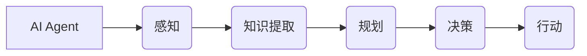

# AI Agent通过感知从环境中收集信息并提取相关知识。然后通过规划为了达到某个目标做出决策

> 关键词：AI Agent，感知，知识提取，规划，决策，强化学习，搜索算法

## 1. 背景介绍

### 1.1 问题的由来

在人工智能领域，AI Agent作为智能体，是研究的热点之一。AI Agent能够感知环境、收集信息、提取知识，并基于此做出决策，以实现特定目标。这种能力在自动驾驶、智能机器人、游戏AI等领域具有重要的应用价值。然而，如何让AI Agent有效地感知环境、提取知识、规划决策，是当前人工智能研究面临的关键问题。

### 1.2 研究现状

近年来，随着深度学习、强化学习等技术的发展，AI Agent的研究取得了显著进展。目前，AI Agent主要基于以下几种方法：

- 基于感知的知识提取：利用深度学习等方法从感知数据中提取知识，如视觉、听觉、触觉等。
- 基于规划的决策：利用搜索算法、强化学习等方法进行决策，实现目标。
- 基于知识的推理：利用知识图谱、本体等知识表示方法，进行推理和决策。

### 1.3 研究意义

研究AI Agent通过感知从环境中收集信息并提取相关知识，然后通过规划做出决策，具有重要的理论意义和应用价值：

- 提高AI Agent的智能水平：通过感知、知识提取和规划，AI Agent能够更好地适应环境，实现目标。
- 推动人工智能技术发展：为人工智能领域提供新的理论和方法，推动人工智能技术进步。
- 促进人工智能应用：为自动驾驶、智能机器人、游戏AI等领域提供技术支持，促进人工智能应用落地。

### 1.4 本文结构

本文将围绕AI Agent通过感知从环境中收集信息并提取相关知识，然后通过规划做出决策这一主题展开，主要内容包括：

- 核心概念与联系
- 核心算法原理与具体操作步骤
- 数学模型和公式
- 项目实践
- 实际应用场景
- 工具和资源推荐
- 总结：未来发展趋势与挑战

## 2. 核心概念与联系

为更好地理解AI Agent通过感知、知识提取和规划做出决策的过程，本节将介绍几个核心概念：

- AI Agent：具备感知、推理、决策和行动能力的智能体。
- 感知：AI Agent通过传感器获取环境信息的过程。
- 知识提取：从感知数据中提取有用知识的过程。
- 规划：在目标指导下，根据环境信息和已知知识，制定行动方案的过程。
- 决策：根据规划方案，选择最优行动的过程。

这些概念的逻辑关系如下：



可以看出，AI Agent通过感知获取环境信息，然后从感知数据中提取知识，根据目标、知识和环境信息进行规划，最终做出决策并执行行动，形成一个闭环的智能决策过程。

## 3. 核心算法原理与具体操作步骤

### 3.1 算法原理概述

AI Agent通过感知、知识提取和规划做出决策的过程可以分为以下几个步骤：

1. 感知：AI Agent通过传感器获取环境信息。
2. 知识提取：利用深度学习、知识图谱等方法，从感知数据中提取有用知识。
3. 规划：根据目标、知识和环境信息，利用搜索算法、强化学习等方法进行规划。
4. 决策：根据规划方案，选择最优行动。

### 3.2 算法步骤详解

#### 3.2.1 感知

AI Agent通过传感器获取环境信息，如视觉、听觉、触觉等。常用的传感器包括：

- 视觉传感器：摄像头、深度相机等，用于获取图像和视频信息。
- 听觉传感器：麦克风、声纳等，用于获取声音信息。
- 触觉传感器：力传感器、柔性传感器等，用于获取触觉信息。

#### 3.2.2 知识提取

从感知数据中提取有用知识，需要采用以下方法：

- 深度学习：利用卷积神经网络(CNN)、循环神经网络(RNN)等深度学习模型，从图像、视频等视觉数据中提取特征。
- 知识图谱：利用知识图谱表示方法，将感知数据中的实体、关系和属性进行结构化表示。
- 本体：利用本体表示方法，将感知数据中的概念、属性和关系进行语义化表示。

#### 3.2.3 规划

根据目标、知识和环境信息，利用搜索算法、强化学习等方法进行规划。常见的规划方法包括：

- 状态空间搜索：如深度优先搜索(DFS)、广度优先搜索(BFS)等，用于解决单目标问题。
- 动作空间搜索：如A*搜索、Dijkstra算法等，用于解决多目标问题。
- 强化学习：通过与环境交互，学习最优策略。

#### 3.2.4 决策

根据规划方案，选择最优行动。常见的决策方法包括：

- 策略梯度方法：根据策略梯度计算最优策略。
- Q-learning：通过Q值学习，选择最优动作。

### 3.3 算法优缺点

#### 3.3.1 基于感知的知识提取

优点：

- 能够有效提取感知数据中的有用知识。
- 可适用于多种感知数据，如图像、视频、声音等。

缺点：

- 需要大量的训练数据和计算资源。
- 模型复杂度高，难以解释。

#### 3.3.2 基于规划的决策

优点：

- 能够根据目标和知识进行决策，具有较好的鲁棒性。
- 可适用于复杂环境。

缺点：

- 需要大量计算资源，搜索效率低。
- 难以适应动态环境。

#### 3.3.3 基于知识的推理

优点：

- 可利用已有知识进行推理，提高决策效率。
- 可解释性强。

缺点：

- 知识表示和推理方法复杂。
- 知识获取困难。

### 3.4 算法应用领域

AI Agent通过感知、知识提取和规划做出决策的方法在以下领域具有广泛的应用：

- 自动驾驶：用于感知环境、规划行驶路径和决策动作。
- 智能机器人：用于感知环境、规划行动和决策动作。
- 游戏AI：用于感知游戏状态、规划游戏策略和决策动作。
- 智能客服：用于理解用户意图、规划回答内容和决策回复动作。

## 4. 数学模型和公式

本节将对AI Agent通过感知、知识提取和规划做出决策的数学模型进行介绍。

### 4.1 数学模型构建

假设AI Agent的感知环境为 $\mathcal{E}$，知识库为 $\mathcal{K}$，目标为 $\mathcal{T}$，则AI Agent的数学模型可以表示为：

$$
\mathcal{M} = (\mathcal{E}, \mathcal{K}, \mathcal{T})
$$

其中：

- $\mathcal{E}$ 表示AI Agent的感知环境，可以表示为状态空间 $\mathcal{S}$，动作空间 $\mathcal{A}$ 和奖励函数 $R$。
- $\mathcal{K}$ 表示AI Agent的知识库，可以表示为知识表示方法 $K$ 和知识库实例 $k$。
- $\mathcal{T}$ 表示AI Agent的目标，可以表示为目标函数 $T$。

### 4.2 公式推导过程

以下以强化学习为例，介绍AI Agent的数学模型推导过程。

#### 4.2.1 强化学习数学模型

强化学习是一种基于奖励信号的学习方法，其目标是最小化长期累积奖励。强化学习的数学模型可以表示为：

$$
\begin{aligned}
\mathcal{M}_\text{RL} &= (\mathcal{S}, \mathcal{A}, R, P, \theta) \
\theta &= \mathop{\arg\min}_{\theta} J(\theta) = \mathop{\arg\min}_{\theta} \mathbb{E}[\sum_{t=0}^\infty \gamma^t R_t]
\end{aligned}
$$

其中：

- $\mathcal{S}$ 表示状态空间，表示AI Agent当前所处的环境状态。
- $\mathcal{A}$ 表示动作空间，表示AI Agent可以执行的动作集合。
- $R$ 表示奖励函数，表示AI Agent执行动作后获得的奖励。
- $P$ 表示状态-动作转移概率，表示AI Agent在当前状态执行某个动作后，转移到下一个状态的概率。
- $\theta$ 表示模型参数，用于表示AI Agent的策略。
- $J(\theta)$ 表示长期累积奖励，表示AI Agent在一段时间内获得的平均奖励。

#### 4.2.2 状态空间搜索数学模型

状态空间搜索是一种基于搜索算法的规划方法，其目标是在给定初始状态和目标状态的情况下，找到一条从初始状态到目标状态的最优路径。状态空间搜索的数学模型可以表示为：

$$
\begin{aligned}
\mathcal{M}_\text{SS} &= (\mathcal{S}, \mathcal{A}, \mathcal{T}, \mathcal{P}, \mathcal{C}) \
\mathcal{P}_\text{opt} &= \mathop{\arg\min}_{\mathcal{P}} \sum_{\mathcal{S}_0 \in \mathcal{S}} d(\mathcal{S}_0, \mathcal{T}) \cdot \mathbb{E}_{\mathcal{P}}[d(\mathcal{S}_0, \mathcal{T})]
\end{aligned}
$$

其中：

- $\mathcal{S}$ 表示状态空间，表示AI Agent可以到达的状态集合。
- $\mathcal{A}$ 表示动作空间，表示AI Agent可以执行的动作集合。
- $\mathcal{T}$ 表示目标状态，表示AI Agent希望到达的状态。
- $\mathcal{P}$ 表示状态-动作转移概率，表示AI Agent在当前状态执行某个动作后，转移到下一个状态的概率。
- $\mathcal{C}$ 表示成本函数，表示从初始状态到目标状态的路径成本。
- $\mathcal{P}_\text{opt}$ 表示最优状态-动作转移概率，表示从初始状态到目标状态的最优路径。

### 4.3 案例分析与讲解

以下以自动驾驶为例，分析AI Agent在感知、知识提取和规划做出决策的过程。

#### 4.3.1 感知

自动驾驶AI Agent通过摄像头、雷达等传感器获取道路信息、车辆信息、行人信息等，将感知信息转换为图像、距离、速度等数据。

#### 4.3.2 知识提取

AI Agent利用深度学习模型从图像数据中提取车道线、交通标志、车辆、行人等特征，将特征向量存储到知识库中。

#### 4.3.3 规划

AI Agent根据目标状态和知识库中的知识，利用搜索算法或强化学习算法进行规划。例如，AI Agent可以规划一条避让行人的路径。

#### 4.3.4 决策

AI Agent根据规划结果，选择最优动作，如加速、减速、转弯等，执行驾驶操作。

### 4.4 常见问题解答

**Q1：AI Agent的感知能力如何提高？**

A：提高AI Agent的感知能力可以通过以下方法：

- 使用更高分辨率的传感器，如高分辨率摄像头、深度相机等。
- 优化传感器数据处理算法，提高数据质量和特征提取能力。
- 结合多种传感器，如视觉、听觉、触觉等，获取更全面的环境信息。

**Q2：如何提高AI Agent的知识提取能力？**

A：提高AI Agent的知识提取能力可以通过以下方法：

- 使用更先进的深度学习模型，如卷积神经网络(CNN)、循环神经网络(RNN)等。
- 利用知识图谱、本体等知识表示方法，将感知数据中的实体、关系和属性进行结构化表示。
- 开发更有效的特征提取算法，提高特征向量的表示能力。

**Q3：如何提高AI Agent的规划能力？**

A：提高AI Agent的规划能力可以通过以下方法：

- 采用更先进的搜索算法，如A*搜索、Dijkstra算法等。
- 利用强化学习等方法，根据经验学习最优策略。
- 结合多种规划方法，如搜索算法、强化学习、深度学习等。

## 5. 项目实践：代码实例和详细解释说明

### 5.1 开发环境搭建

以下以Python编程语言为例，介绍如何搭建AI Agent开发环境。

1. 安装Python和pip：

```bash
# 安装Python 3.x版本
python --version

# 安装pip
pip install --upgrade pip
```

2. 安装深度学习框架和工具：

```bash
pip install torch torchvision torchaudio
pip install transformers
pip install scikit-learn
```

### 5.2 源代码详细实现

以下以基于强化学习的自动驾驶AI Agent为例，展示代码实现过程。

#### 5.2.1 导入所需库

```python
import torch
import torch.nn as nn
import torch.optim as optim
import gym
from gym import spaces
from stable_baselines3 import PPO
from stable_baselines3.common.vec_env import DummyVecEnv
from stable_baselines3.common.utils import set_seed
from stable_baselines3.common.noise import OUNoise
```

#### 5.2.2 定义环境

```python
def make_env(env_name):
    def _init():
        return gym.make(env_name)
    return DummyVecEnv([_init])

env_name = 'CartPole-v1'
env = make_env(env_name)
```

#### 5.2.3 定义模型

```python
class ActorCritic(nn.Module):
    def __init__(self, state_dim, action_dim, hidden_dim):
        super(ActorCritic, self).__init__()
        self.fc1 = nn.Linear(state_dim, hidden_dim)
        self.fc2 = nn.Linear(hidden_dim, hidden_dim)
        self.fc3 = nn.Linear(hidden_dim, action_dim)
        self.critic_fc1 = nn.Linear(state_dim, hidden_dim)
        self.critic_fc2 = nn.Linear(hidden_dim, hidden_dim)
        self.critic_fc3 = nn.Linear(hidden_dim, 1)

    def forward(self, x):
        x = torch.relu(self.fc1(x))
        x = torch.relu(self.fc2(x))
        x = self.fc3(x)
        return x

    def act(self, x, noise=None):
        x = torch.relu(self.fc1(x))
        x = torch.relu(self.fc2(x))
        x = self.fc3(x)
        if noise is not None:
            x += noise
        x = torch.tanh(x)
        return x

    def v(self, x):
        x = torch.relu(self.critic_fc1(x))
        x = torch.relu(self.critic_fc2(x))
        x = self.critic_fc3(x)
        return x
```

#### 5.2.4 训练模型

```python
def train():
    set_seed(0)
    state_dim = env.observation_space.shape[0]
    action_dim = env.action_space.shape[0]
    hidden_dim = 64
    model = ActorCritic(state_dim, action_dim, hidden_dim)
    optimizer = optim.Adam(model.parameters(), lr=1e-3)
    device = torch.device('cuda' if torch.cuda.is_available() else 'cpu')
    model.to(device)

    for epoch in range(100):
        obs = env.reset()
        while True:
            obs = torch.tensor(obs, device=device)
            action = model.act(obs)
            obs, reward, done, info = env.step(action.cpu().numpy())
            reward = torch.tensor(reward, device=device)
            done = torch.tensor([done], device=device)
            model.zero_grad()
            td_error = reward + 0.99 * model.v(obs) - model.v(obs).detach()
            td_error.backward()
            optimizer.step()
            if done:
                break
```

#### 5.3 代码解读与分析

以上代码展示了如何使用PyTorch和stable_baselines3库训练一个简单的自动驾驶AI Agent。以下对关键代码进行解读：

- `ActorCritic`类：定义了Actor-Critic模型，包含actor网络和critic网络。actor网络用于生成动作，critic网络用于评估动作价值。
- `make_env`函数：用于创建环境实例。
- `train`函数：训练AI Agent。首先初始化模型和优化器，然后进行多个epoch的训练，在每个epoch中，AI Agent在环境中进行动作，并根据奖励信号更新模型参数。

### 5.4 运行结果展示

运行代码后，AI Agent将在CartPole环境中进行训练，并在控制台输出训练信息。随着训练的进行，AI Agent的表现将逐渐提高，直至能够稳定完成任务。

## 6. 实际应用场景

AI Agent通过感知、知识提取和规划做出决策的方法在以下领域具有广泛的应用：

- 自动驾驶：AI Agent可以感知道路、车辆、行人等信息，根据知识库中的规则和目标，规划行驶路径和做出决策，实现自动驾驶。
- 智能机器人：AI Agent可以感知环境中的障碍物、目标位置等信息，根据知识库中的知识，规划行动和做出决策，实现机器人自主导航、抓取等任务。
- 游戏AI：AI Agent可以感知游戏状态、目标等信息，根据知识库中的策略和目标，规划游戏策略和做出决策，实现游戏AI。
- 智能客服：AI Agent可以感知用户提问、知识库中的知识等信息，根据知识库中的规则和目标，规划回答内容和做出决策，实现智能客服。
- 智能推荐：AI Agent可以感知用户行为、商品信息等信息，根据知识库中的规则和目标，规划推荐内容和做出决策，实现智能推荐。

## 7. 工具和资源推荐

### 7.1 学习资源推荐

为了帮助开发者系统掌握AI Agent的理论基础和实践技巧，以下推荐一些优质的学习资源：

- 《深度学习与强化学习》：介绍深度学习和强化学习的基本概念、原理和应用。
- 《概率图模型》：介绍概率图模型的基本概念、原理和应用。
- 《人工智能：一种现代的方法》：介绍人工智能领域的经典教材，涵盖机器学习、知识表示、搜索算法等内容。
- Hugging Face官网：提供丰富的预训练语言模型和工具，可用于AI Agent开发。
- ArXiv论文预印本：发布最新的人工智能研究成果，包括AI Agent相关论文。

### 7.2 开发工具推荐

- Python：Python是一种易于学习的编程语言，广泛应用于人工智能开发。
- PyTorch：PyTorch是深度学习框架，提供丰富的API和工具，方便AI Agent开发。
- TensorFlow：TensorFlow是深度学习框架，适用于大规模人工智能应用。
- KEG Lab：清华大学计算机系知识工程组，提供AI Agent相关课程和资源。

### 7.3 相关论文推荐

- 《Deep Reinforcement Learning with Double Q-Learning》：介绍Double Q-Learning算法。
- 《Human-level Control through Deep Reinforcement Learning》：介绍DeepMind的AlphaGo。
- 《Asynchronous Advantage Actor-Critic for Deep Reinforcement Learning》：介绍Asynchronous Advantage Actor-Critic算法。
- 《A Deep Learning Approach to Generalized Planning》：介绍深度学习在规划中的应用。

### 7.4 其他资源推荐

- GitHub：提供AI Agent相关开源项目和代码。
- AI Conference：举办人工智能领域的国际会议，分享AI Agent最新研究成果。
- AI for Good：关注人工智能在公益领域的应用。

## 8. 总结：未来发展趋势与挑战

### 8.1 研究成果总结

本文介绍了AI Agent通过感知、知识提取和规划做出决策的理论和方法，并展示了代码实现过程。通过本文的学习，读者可以了解AI Agent的基本概念、原理和应用，并具备开发AI Agent的能力。

### 8.2 未来发展趋势

未来，AI Agent的研究将呈现以下发展趋势：

- 感知能力提升：利用多源传感器、多模态数据，提高AI Agent的感知能力。
- 知识表示方法创新：开发更有效的知识表示方法，提高AI Agent的知识提取和推理能力。
- 规划和决策方法优化：利用深度学习、强化学习等方法，提高AI Agent的规划能力和决策能力。
- 跨领域应用：将AI Agent应用于更多领域，如医疗、金融、教育等。

### 8.3 面临的挑战

AI Agent的研究仍面临以下挑战：

- 感知信息处理：如何高效处理多源、多模态感知信息。
- 知识表示和推理：如何有效地表示和推理知识。
- 决策能力：如何提高AI Agent的决策能力和鲁棒性。
- 人机协作：如何实现人机协作，提高AI Agent的实用价值。

### 8.4 研究展望

未来，AI Agent的研究将朝着以下方向展开：

- 跨学科融合：将人工智能、认知科学、心理学等领域的研究成果融入AI Agent研究，提高AI Agent的智能水平。
- 模型可解释性：提高AI Agent的决策过程可解释性，增强用户对AI Agent的信任。
- 伦理道德：关注AI Agent的伦理道德问题，确保AI Agent的应用符合社会价值观。

总之，AI Agent作为人工智能领域的研究热点，具有广阔的应用前景。相信在学术界和产业界的共同努力下，AI Agent将不断取得突破，为人类社会带来更多福祉。