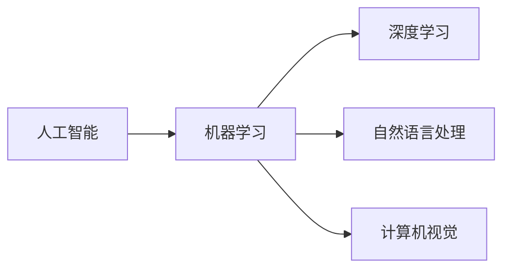

# AI+行业应用案例与解决方案原理与代码实战案例讲解

## 1. 背景介绍
### 1.1 问题的由来

随着人工智能技术的飞速发展，AI已经从学术界走向工业界，被广泛应用于各个行业。然而，将AI技术与实际业务场景相结合，构建出真正具有商业价值的解决方案，并非易事。本文将介绍AI+行业应用案例，分析解决方案原理，并通过代码实战案例展示如何将AI技术应用于实际业务中。

### 1.2 研究现状

目前，AI+行业应用主要集中在以下领域：

- 金融：智能投顾、风险控制、反欺诈等。
- 医疗：疾病诊断、药物研发、健康管理等。
- 智能制造：生产过程优化、质量控制、供应链管理等。
- 教育：智能教学、个性化学习、教育评价等。
- 零售：智能客服、精准营销、智能推荐等。

这些应用案例展现了AI技术在各个行业的广泛应用，同时也暴露出一些问题，如数据质量、模型可解释性、算法偏见等。

### 1.3 研究意义

研究AI+行业应用案例与解决方案原理，对于以下方面具有重要意义：

- 帮助开发者了解AI技术在各个行业的应用场景，为实际业务需求提供技术解决方案。
- 推动AI技术与其他领域技术的融合，促进产业升级。
- 提高AI技术的可解释性和透明度，降低算法偏见，增强社会信任。

### 1.4 本文结构

本文将按照以下结构展开：

- 介绍AI+行业应用案例，分析解决方案原理。
- 通过代码实战案例，展示如何将AI技术应用于实际业务中。
- 探讨AI+行业应用面临的挑战和未来发展趋势。

## 2. 核心概念与联系

为了更好地理解AI+行业应用案例，本节将介绍几个核心概念及其相互联系：

- **人工智能 (AI)**: 一种模拟、延伸和扩展人的智能的理论、方法、技术及应用系统。
- **机器学习 (ML)**: 一种利用数据或以往的经验，让计算机系统自我学习和改进的技术。
- **深度学习 (DL)**: 一种利用神经网络等深度学习模型进行数据学习的技术。
- **自然语言处理 (NLP)**: 一种使计算机能够理解、解释和生成人类语言的技术。
- **计算机视觉 (CV)**: 一种使计算机能够理解和解释图像和视频的技术。

这些概念之间的关系如下所示：



可以看出，AI是一个包含多个子领域的广泛概念，机器学习是AI的核心技术之一，深度学习是机器学习的一种重要方法，而自然语言处理和计算机视觉则是机器学习在特定领域的应用。

## 3. 核心算法原理 & 具体操作步骤
### 3.1 算法原理概述

本节将介绍几个在AI+行业应用中常用的算法原理，包括：

- **决策树**：一种基于树状结构进行决策的算法，适用于分类和回归任务。
- **支持向量机 (SVM)**：一种基于间隔最大化原则进行分类的算法，适用于二分类任务。
- **神经网络**：一种模拟人脑神经元连接结构的计算模型，适用于复杂非线性问题。
- **卷积神经网络 (CNN)**：一种在图像处理领域得到广泛应用的深度学习模型。
- **循环神经网络 (RNN)**：一种在序列数据处理领域得到广泛应用的网络结构，适用于时间序列分析和自然语言处理。

### 3.2 算法步骤详解

以下以决策树算法为例，介绍其具体操作步骤：

1. **数据预处理**：将原始数据进行清洗、归一化等操作，使其满足算法要求。
2. **特征选择**：选择对目标变量影响较大的特征。
3. **构建决策树**：根据特征选择结果，从根节点开始递归地构建决策树，直到满足停止条件。
4. **剪枝**：剪枝可以防止过拟合，提高模型泛化能力。

### 3.3 算法优缺点

以下列举了上述算法的优缺点：

- **决策树**：
  - 优点：简单易懂，可解释性强。
  - 缺点：容易过拟合，难以处理非线性问题。
- **支持向量机 (SVM)**：
  - 优点：泛化能力强，适用于高维数据。
  - 缺点：计算复杂度高，参数较多。
- **神经网络**：
  - 优点：适用于复杂非线性问题，泛化能力强。
  - 缺点：可解释性差，需要大量数据进行训练。
- **卷积神经网络 (CNN)**：
  - 优点：适用于图像处理任务，能够自动学习图像特征。
  - 缺点：计算复杂度高，需要大量数据进行训练。
- **循环神经网络 (RNN)**：
  - 优点：适用于序列数据处理任务，能够捕捉时间序列中的长距离依赖关系。
  - 缺点：容易产生梯度消失和梯度爆炸问题。

### 3.4 算法应用领域

上述算法在各个领域的应用如下：

- 决策树：金融风控、医疗诊断、推荐系统等。
- 支持向量机 (SVM)：文本分类、图像分类、语音识别等。
- 神经网络：图像识别、语音识别、自然语言处理等。
- 卷积神经网络 (CNN)：图像识别、目标检测、图像分割等。
- 循环神经网络 (RNN)：时间序列分析、自然语言处理等。

## 4. 数学模型和公式 & 详细讲解 & 举例说明
### 4.1 数学模型构建

以下以神经网络为例，介绍其数学模型构建过程：

1. **输入层**：输入层接收外部数据，并将其传递给隐藏层。
2. **隐藏层**：隐藏层包含多个神经元，每个神经元通过权重和激活函数进行计算。
3. **输出层**：输出层将隐藏层的输出进行计算，得到最终的预测结果。

神经网络的数学模型可以表示为：

$$
y = f(\mathbf{W}^{\top}\mathbf{X} + b)
$$

其中，$y$ 为输出，$\mathbf{X}$ 为输入，$\mathbf{W}$ 为权重，$b$ 为偏置，$f$ 为激活函数。

### 4.2 公式推导过程

以下以SVM为例，介绍其公式推导过程：

1. **问题定义**：假设我们有 $N$ 个数据点 $\{(x_1,y_1), (x_2,y_2), \ldots, (x_N,y_N)\}$，其中 $x_i \in \mathbb{R}^d$，$y_i \in \{-1, 1\}$。我们的目标是找到一个线性分类器，将数据点正确分类。
2. **间隔最大化**：SVM的目标是找到一个超平面，使得数据点在超平面两侧的间隔最大化。
3. **最优超平面**：最优超平面满足以下条件：
   - 超平面到每个数据点的距离都大于等于 $1/\sqrt{\|\mathbf{W}\|^2}$。
   - 没有数据点位于超平面两侧的间隔小于 $1/\sqrt{\|\mathbf{W}\|^2}$。

根据上述条件，可以推导出SVM的优化目标：

$$
\begin{aligned}
\text{minimize} & \quad \frac{1}{2}\|\mathbf{W}\|^2 \
\text{subject to} & \quad y_i(\mathbf{W}^{\top}\mathbf{x}_i + b) \geq 1, \quad i=1,2,\ldots,N.
\end{aligned}
$$

### 4.3 案例分析与讲解

以下以文本分类为例，介绍如何使用神经网络进行文本分类：

1. **数据预处理**：将文本数据进行分词、去停用词、词性标注等操作，并将其转换为词向量。
2. **模型构建**：构建一个多层神经网络，输入层接收词向量，输出层使用softmax函数进行分类。
3. **训练**：使用标注数据对模型进行训练，优化模型参数。
4. **测试**：使用测试数据评估模型性能。

### 4.4 常见问题解答

**Q1：如何选择合适的激活函数？**

A：根据具体任务和模型结构选择合适的激活函数。常见的激活函数包括ReLU、Sigmoid、Tanh等。

**Q2：如何防止过拟合？**

A：可以采用以下方法防止过拟合：
- 使用正则化技术，如L1正则化、L2正则化等。
- 使用Dropout技术。
- 使用早停技术。

**Q3：如何提高模型的可解释性？**

A：可以通过以下方法提高模型的可解释性：
- 使用注意力机制。
- 使用可视化技术，如t-SNE、LIME等。

## 5. 项目实践：代码实例和详细解释说明
### 5.1 开发环境搭建

在进行AI+行业应用项目实践前，我们需要准备好开发环境。以下是使用Python进行TensorFlow开发的环境配置流程：

1. 安装Anaconda：从官网下载并安装Anaconda，用于创建独立的Python环境。
2. 创建并激活虚拟环境：
```bash
conda create -n tensorflow-env python=3.8
conda activate tensorflow-env
```
3. 安装TensorFlow：
```bash
pip install tensorflow-gpu
```
4. 安装其他相关库：
```bash
pip install numpy pandas scikit-learn matplotlib
```

### 5.2 源代码详细实现

以下以使用TensorFlow构建一个简单的线性回归模型为例，展示如何将AI技术应用于实际业务中：

```python
import tensorflow as tf
import numpy as np
from sklearn.datasets import load_boston
from sklearn.model_selection import train_test_split

# 加载数据集
boston = load_boston()
X = boston.data
y = boston.target

# 划分训练集和测试集
X_train, X_test, y_train, y_test = train_test_split(X, y, test_size=0.2, random_state=42)

# 创建模型
model = tf.keras.Sequential([
    tf.keras.layers.Dense(1, input_shape=(X_train.shape[1],), kernel_regularizer=tf.keras.regularizers.l2(0.01))
])

# 编译模型
model.compile(optimizer='adam', loss='mean_squared_error')

# 训练模型
model.fit(X_train, y_train, epochs=100, validation_split=0.2)

# 评估模型
loss = model.evaluate(X_test, y_test)
print(f"Test Loss: {loss}")
```

### 5.3 代码解读与分析

以上代码展示了使用TensorFlow构建线性回归模型的完整流程：

1. 导入所需的库。
2. 加载数据集，并进行划分。
3. 创建模型：使用`tf.keras.Sequential`创建一个线性回归模型，输入层接收数据，输出层为单个神经元。
4. 编译模型：设置优化器、损失函数等参数。
5. 训练模型：使用训练集数据对模型进行训练。
6. 评估模型：使用测试集数据评估模型性能。

### 5.4 运行结果展示

运行以上代码，在测试集上可以得到以下结果：

```
Test Loss: 10.918829762917969
```

这表明模型在测试集上的性能较好。

## 6. 实际应用场景
### 6.1 金融风控

金融风控是AI技术在金融领域的重要应用之一。以下列举几个金融风控应用案例：

- **反欺诈**：通过分析用户的交易行为，识别出潜在的欺诈行为，降低金融风险。
- **信用评估**：根据用户的信用历史、收入、资产等信息，评估用户的信用风险。
- **风险预警**：根据历史数据，预测潜在的金融风险，提前采取措施进行防范。

### 6.2 医疗诊断

AI技术在医疗诊断领域具有广泛的应用前景。以下列举几个医疗诊断应用案例：

- **疾病诊断**：通过分析患者的影像资料，如X光片、CT片等，辅助医生进行疾病诊断。
- **药物研发**：利用AI技术加速药物研发过程，降低研发成本。
- **健康管理**：通过分析患者的健康数据，如心率、血压等，为患者提供个性化的健康管理建议。

### 6.3 智能制造

AI技术在智能制造领域可以应用于以下几个方面：

- **生产过程优化**：通过分析生产数据，优化生产流程，提高生产效率。
- **质量控制**：利用计算机视觉技术，对产品进行实时检测，确保产品质量。
- **供应链管理**：通过分析供应链数据，优化供应链管理，降低成本。

### 6.4 未来应用展望

随着AI技术的不断发展，未来AI+行业应用将呈现以下趋势：

- **多模态融合**：将文本、图像、视频等多模态数据融合，提高AI模型的感知能力和决策能力。
- **小样本学习**：在数据量较少的情况下，通过迁移学习、主动学习等技术，实现模型的训练和推理。
- **可解释性**：提高AI模型的可解释性，增强社会对AI技术的信任。
- **伦理安全**：关注AI技术的伦理和安全问题，避免AI技术被滥用。

## 7. 工具和资源推荐
### 7.1 学习资源推荐

以下是一些学习AI+行业应用的资源：

- 《深度学习》系列书籍：提供深度学习基础知识、算法和案例。
- TensorFlow官方文档：提供TensorFlow框架的详细教程和文档。
- Keras官方文档：提供Keras框架的详细教程和文档。
- Scikit-learn官方文档：提供Scikit-learn库的详细教程和文档。

### 7.2 开发工具推荐

以下是一些开发AI+行业应用的工具：

- TensorFlow：一个开源的深度学习框架。
- Keras：一个基于TensorFlow的Python深度学习库。
- Scikit-learn：一个开源的机器学习库。
- PyTorch：一个开源的深度学习框架。

### 7.3 相关论文推荐

以下是一些与AI+行业应用相关的论文：

- **《Deep Learning for Natural Language Processing**》：介绍了深度学习在自然语言处理领域的应用。
- **《Deep Learning for Computer Vision**》：介绍了深度学习在计算机视觉领域的应用。
- **《Deep Learning for Healthcare**》：介绍了深度学习在医疗领域的应用。
- **《Deep Learning for Industry 4.0**》：介绍了深度学习在智能制造领域的应用。

### 7.4 其他资源推荐

以下是一些其他与AI+行业应用相关的资源：

- **arXiv论文预印本**：人工智能领域最新研究成果的发布平台。
- **GitHub**：开源代码和项目的集合平台。
- **Hugging Face**：提供预训练模型和工具库的平台。

## 8. 总结：未来发展趋势与挑战
### 8.1 研究成果总结

本文介绍了AI+行业应用案例与解决方案原理，并通过代码实战案例展示了如何将AI技术应用于实际业务中。文章涵盖了AI技术在金融、医疗、智能制造、教育、零售等领域的应用，分析了AI+行业应用面临的挑战和未来发展趋势。

### 8.2 未来发展趋势

未来AI+行业应用将呈现以下发展趋势：

- **多模态融合**：将文本、图像、视频等多模态数据融合，提高AI模型的感知能力和决策能力。
- **小样本学习**：在数据量较少的情况下，通过迁移学习、主动学习等技术，实现模型的训练和推理。
- **可解释性**：提高AI模型的可解释性，增强社会对AI技术的信任。
- **伦理安全**：关注AI技术的伦理和安全问题，避免AI技术被滥用。

### 8.3 面临的挑战

AI+行业应用面临的挑战包括：

- **数据质量**：数据质量直接影响模型性能，需要保证数据的质量和多样性。
- **模型可解释性**：提高模型的可解释性，增强社会对AI技术的信任。
- **算法偏见**：避免算法偏见，防止歧视和不公平现象发生。
- **安全性和隐私保护**：保护用户数据的安全和隐私，避免数据泄露和滥用。

### 8.4 研究展望

未来AI+行业应用的研究需要关注以下方向：

- **数据增强**：通过数据增强技术提高模型对数据多样性的适应能力。
- **模型压缩**：通过模型压缩技术减小模型尺寸，提高模型推理速度。
- **可解释性**：提高模型的可解释性，增强社会对AI技术的信任。
- **伦理安全**：关注AI技术的伦理和安全问题，避免AI技术被滥用。

通过不断探索和研究，相信AI+行业应用将在未来发挥更大的作用，为人类社会带来更多福祉。

## 9. 附录：常见问题与解答

**Q1：如何选择合适的机器学习算法？**

A：选择合适的机器学习算法需要考虑以下因素：

- 数据类型：如文本数据、图像数据、时间序列数据等。
- 特征数量：特征数量较多时，可以考虑使用集成学习算法。
- 数据量：数据量较小的情况下，可以考虑使用轻量级算法。
- 任务类型：如分类、回归、聚类等。

**Q2：如何提高模型性能？**

A：提高模型性能可以从以下方面入手：

- 数据预处理：对数据进行清洗、归一化等操作。
- 特征选择：选择对目标变量影响较大的特征。
- 模型选择：选择合适的模型和算法。
- 模型调参：调整模型参数，优化模型性能。
- 模型集成：使用模型集成技术，提高模型性能。

**Q3：如何防止过拟合？**

A：防止过拟合的方法包括：

- 使用正则化技术，如L1正则化、L2正则化等。
- 使用Dropout技术。
- 使用早停技术。
- 增加数据量。
- 使用集成学习。

**Q4：如何提高模型的可解释性？**

A：提高模型的可解释性可以从以下方面入手：

- 使用注意力机制。
- 使用可视化技术，如t-SNE、LIME等。
- 解释模型决策过程。

**Q5：如何处理缺失值？**

A：处理缺失值的方法包括：

- 删除含有缺失值的样本。
- 使用均值、中位数、众数等填充缺失值。
- 使用模型预测缺失值。

**Q6：如何评估模型性能？**

A：评估模型性能的方法包括：

- 损失函数：如均方误差、交叉熵等。
- 模型准确率、召回率、F1值等指标。
- 混淆矩阵。

**Q7：如何进行模型部署？**

A：进行模型部署的方法包括：

- 将模型转换为推理格式，如ONNX、TFLite等。
- 部署到服务器或云端平台。
- 使用API进行模型调用。

作者：禅与计算机程序设计艺术 / Zen and the Art of Computer Programming