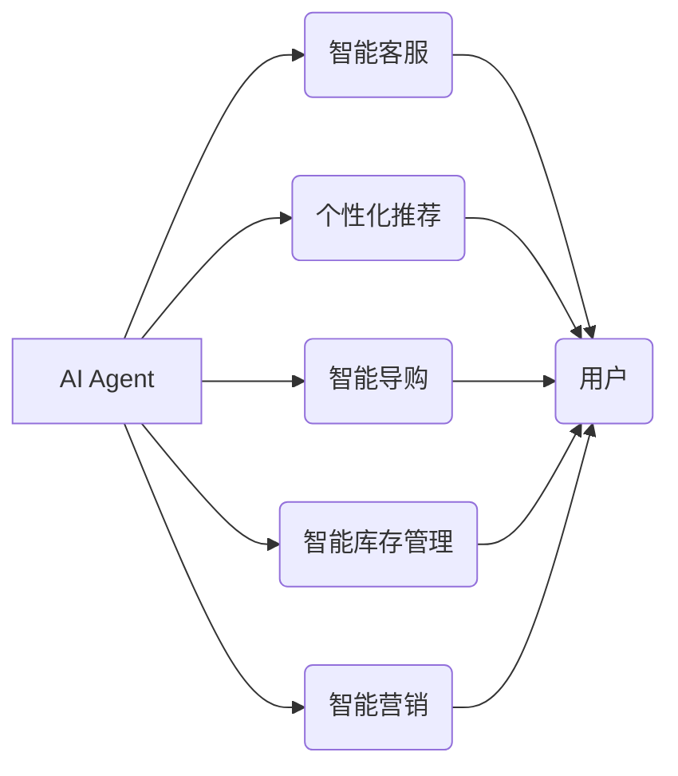

# AI人工智能 Agent：在新零售中的应用

作者：禅与计算机程序设计艺术 / Zen and the Art of Computer Programming

## 1. 背景介绍

### 1.1 问题的由来

随着移动互联网的普及和消费升级趋势的加速，新零售已经成为零售行业的重要发展方向。新零售以其线上线下融合、以消费者为中心、数据驱动等特点，为传统零售业带来了新的变革机遇。然而，面对复杂多变的消费者需求和市场竞争，零售企业如何实现精准营销、提升服务效率、优化库存管理，成为了亟待解决的问题。

近年来，人工智能技术的飞速发展为新零售提供了强大的技术支撑。其中，人工智能 Agent 作为一种自主决策、协同工作的智能实体，在满足个性化需求、提升用户体验、实现精细化运营等方面展现出巨大的应用潜力。

### 1.2 研究现状

目前，AI Agent 在新零售领域的应用主要集中在以下方面：

1. **智能客服**：利用自然语言处理、对话生成等技术，为消费者提供24小时在线客服，解答疑问、推荐商品、处理投诉等。

2. **个性化推荐**：通过用户画像、协同过滤等技术，为消费者提供个性化的商品推荐，提升购物体验。

3. **智能导购**：利用计算机视觉、空间定位等技术，为消费者提供智能导购服务，引导消费者快速找到所需商品。

4. **智能库存管理**：利用物联网、大数据等技术，实时监控库存动态，实现精准补货和预测性库存管理。

5. **智能营销**：利用用户画像、营销自动化等技术，实现精准营销，提高转化率。

### 1.3 研究意义

AI Agent 在新零售领域的应用具有重要的研究意义：

1. **提升用户体验**：通过智能化服务，满足消费者个性化需求，提升购物体验。

2. **降低运营成本**：通过优化运营流程，提高运营效率，降低运营成本。

3. **增强竞争力**：通过技术创新，提升企业竞争力，抢占市场份额。

4. **推动行业变革**：引领新零售行业向智能化、数据化方向发展。

### 1.4 本文结构

本文将围绕 AI Agent 在新零售中的应用展开，具体包括以下内容：

- 2. 核心概念与联系
- 3. 核心算法原理 & 具体操作步骤
- 4. 数学模型和公式 & 详细讲解 & 举例说明
- 5. 项目实践：代码实例和详细解释说明
- 6. 实际应用场景
- 7. 工具和资源推荐
- 8. 总结：未来发展趋势与挑战
- 9. 附录：常见问题与解答

## 2. 核心概念与联系

为更好地理解 AI Agent 在新零售中的应用，本节将介绍几个密切相关的核心概念：

- **AI Agent**：一种能够自主感知环境、规划行为、执行动作并与其他 Agent 或环境交互的智能实体。

- **智能客服**：利用自然语言处理、对话生成等技术，为消费者提供24小时在线客服服务的系统。

- **个性化推荐**：通过用户画像、协同过滤等技术，为消费者提供个性化的商品推荐。

- **智能导购**：利用计算机视觉、空间定位等技术，为消费者提供智能导购服务的系统。

- **智能库存管理**：利用物联网、大数据等技术，实现精准补货和预测性库存管理的系统。

- **智能营销**：利用用户画像、营销自动化等技术，实现精准营销的系统。

它们的逻辑关系如下图所示：



可以看出，AI Agent 通过不同的应用场景，与用户、商品、设备等环境进行交互，实现智能服务，推动新零售行业的发展。

## 3. 核心算法原理 & 具体操作步骤

### 3.1 算法原理概述

AI Agent 在新零售中的应用，主要基于以下核心算法原理：

- **自然语言处理（NLP）**：用于智能客服、个性化推荐等场景，实现对自然语言的语义理解和生成。

- **机器学习（ML）**：用于个性化推荐、智能库存管理等场景，通过学习历史数据，预测用户行为和需求。

- **计算机视觉（CV）**：用于智能导购、商品识别等场景，通过图像识别、目标检测等技术，实现对图像的理解和分析。

- **物联网（IoT）**：用于智能库存管理、设备监控等场景，通过连接各种设备，实现对数据的实时采集和传输。

### 3.2 算法步骤详解

以下以智能客服为例，介绍 AI Agent 在新零售中的应用步骤：

1. **数据采集**：收集用户咨询记录、商品信息、用户行为数据等。

2. **数据预处理**：对采集到的数据进行清洗、脱敏、格式化等预处理操作。

3. **特征工程**：从预处理后的数据中提取关键特征，如用户画像、商品属性等。

4. **模型训练**：选择合适的模型，如循环神经网络（RNN）、长短期记忆网络（LSTM）等，对提取的特征进行训练，学习用户咨询意图和常用回复。

5. **模型部署**：将训练好的模型部署到智能客服系统中，实现对用户咨询的自动回复。

6. **系统优化**：根据用户反馈和系统运行效果，不断优化模型和系统，提升服务质量。

### 3.3 算法优缺点

以下列举了 AI Agent 在新零售应用中常见的几种算法的优缺点：

- **自然语言处理（NLP）**：
  - 优点：能够实现人机交互，提升用户体验。
  - 缺点：需要大量标注数据，模型训练成本高，对语言理解和生成能力要求较高。

- **机器学习（ML）**：
  - 优点：能够根据历史数据预测用户行为和需求，实现个性化推荐。
  - 缺点：对数据质量要求较高，需要不断更新模型以适应数据变化。

- **计算机视觉（CV）**：
  - 优点：能够实现对图像的实时识别和分析，提升购物体验。
  - 缺点：需要大量图像数据，模型训练成本高，对光照、角度等因素敏感。

- **物联网（IoT）**：
  - 优点：能够实时采集设备数据，实现智能库存管理和设备监控。
  - 缺点：需要大量硬件设备，系统部署和维护成本高。

### 3.4 算法应用领域

AI Agent 在新零售领域的应用领域主要包括：

- 智能客服
- 个性化推荐
- 智能导购
- 智能库存管理
- 智能营销

## 4. 数学模型和公式 & 详细讲解 & 举例说明

### 4.1 数学模型构建

以下以自然语言处理中的循环神经网络（RNN）为例，介绍数学模型的构建。

假设输入序列为 $X = [x_1, x_2, \ldots, x_T]$，其中 $x_t \in \mathbb{R}^{n_x}$ 表示第 $t$ 个输入向量，输出序列为 $Y = [y_1, y_2, \ldots, y_T]$，其中 $y_t \in \mathbb{R}^{n_y}$ 表示第 $t$ 个输出向量。

循环神经网络（RNN）的数学模型可以表示为：

$$
y_t = \sigma(W_{hy}h_{t-1} + W_{xy}x_t + b_y)
$$

其中，$h_{t-1}$ 表示上一时刻的隐藏状态，$W_{hy}$、$W_{xy}$ 分别表示隐藏状态到输出向量和输入向量的权重矩阵，$b_y$ 表示输出向量的偏置项，$\sigma$ 表示激活函数，如Sigmoid、ReLU等。

### 4.2 公式推导过程

以下以线性回归为例，介绍数学公式的推导过程。

假设输入特征向量为 $X = [x_1, x_2, \ldots, x_n]$，输出目标值为 $Y$，则线性回归的数学模型可以表示为：

$$
Y = \beta_0 + \beta_1x_1 + \beta_2x_2 + \ldots + \beta_nx_n
$$

其中，$\beta_0, \beta_1, \beta_2, \ldots, \beta_n$ 为模型参数。

为了最小化预测值与真实值之间的误差，需要求解以下最优化问题：

$$
\min_{\beta_0, \beta_1, \beta_2, \ldots, \beta_n} \sum_{i=1}^m (Y_i - \hat{Y}_i)^2
$$

其中，$\hat{Y}_i$ 为预测值，$m$ 为样本数量。

通过求偏导数并令其为0，可以得到以下最优参数解：

$$
\beta_0 = \frac{1}{m} \sum_{i=1}^m Y_i - \frac{1}{m} \sum_{i=1}^m \beta_1x_{1i} - \frac{1}{m} \sum_{i=1}^m \beta_2x_{2i} - \ldots - \frac{1}{m} \sum_{i=1}^m \beta_nx_{ni}
$$

$$
\beta_1 = \frac{1}{m} \sum_{i=1}^m (Y_i - \hat{Y}_i)x_{1i} - \frac{1}{m} \sum_{i=1}^m \beta_2x_{1i}x_{2i} - \ldots - \frac{1}{m} \sum_{i=1}^m \beta_nx_{1i}x_{ni}
$$

$$
\beta_2 = \frac{1}{m} \sum_{i=1}^m (Y_i - \hat{Y}_i)x_{2i} - \frac{1}{m} \sum_{i=1}^m \beta_1x_{1i}x_{2i} - \ldots - \frac{1}{m} \sum_{i=1}^m \beta_nx_{2i}x_{ni}
$$

$$
\ldots
$$

$$
\beta_n = \frac{1}{m} \sum_{i=1}^m (Y_i - \hat{Y}_i)x_{ni} - \frac{1}{m} \sum_{i=1}^m \beta_1x_{1i}x_{ni} - \ldots - \frac{1}{m} \sum_{i=1}^m \beta_{n-1}x_{(n-1)i}x_{ni}
$$

### 4.3 案例分析与讲解

以下以智能客服为例，介绍 AI Agent 在新零售中的应用案例分析。

假设某电商平台的智能客服系统采用 RNN 模型进行智能回复。系统训练过程中，收集了大量用户咨询数据和常用回复数据，通过 RNN 模型学习用户咨询意图和回复规则。

当用户咨询问题时，系统首先使用分词技术将问题文本转换为词向量表示。然后，将词向量输入 RNN 模型进行预测，得到对应的回复候选集。最后，系统选择概率最高的回复候选集，作为对用户的回复。

### 4.4 常见问题解答

**Q1：AI Agent 在新零售中的应用是否安全？**

A：AI Agent 在新零售中的应用，需要关注数据安全和隐私保护。企业在使用 AI Agent 时，应遵循相关法律法规，对用户数据进行脱敏、加密等处理，确保用户隐私安全。

**Q2：AI Agent 在新零售中的应用是否会替代人工服务？**

A：AI Agent 在新零售中的应用，并非替代人工服务，而是与人工服务相辅相成。AI Agent 可以处理大量重复性、低价值的任务，释放人工服务人员，使其专注于更高价值的任务。

**Q3：AI Agent 在新零售中的应用是否需要大量数据？**

A：AI Agent 在新零售中的应用，需要一定量的数据支持。对于一些特定领域或个性化的需求，可能需要更多数据进行训练。但随着 AI 技术的不断发展，AI Agent 将对数据量的要求逐渐降低。

## 5. 项目实践：代码实例和详细解释说明

### 5.1 开发环境搭建

以下以 Python 语言为例，介绍开发环境搭建步骤：

1. 安装 Anaconda：从官网下载并安装 Anaconda，用于创建独立的 Python 环境。

2. 创建并激活虚拟环境：

```bash
conda create -n ai_retail_env python=3.8
conda activate ai_retail_env
```

3. 安装 PyTorch 和其他相关库：

```bash
conda install pytorch torchvision torchaudio -c pytorch
pip install torchtext transformers
```

### 5.2 源代码详细实现

以下以智能客服为例，介绍 AI Agent 在新零售中的应用代码实现。

```python
import torch
from torch import nn
from torch.utils.data import DataLoader, Dataset
from transformers import BertForSequenceClassification, BertTokenizer

# 定义数据集
class ChatDataset(Dataset):
    def __init__(self, texts, labels, tokenizer, max_len=128):
        self.texts = texts
        self.labels = labels
        self.tokenizer = tokenizer
        self.max_len = max_len

    def __len__(self):
        return len(self.texts)

    def __getitem__(self, item):
        text = self.texts[item]
        label = self.labels[item]

        encoding = self.tokenizer(text, return_tensors='pt', max_length=self.max_len, truncation=True, padding='max_length')
        input_ids = encoding['input_ids'].squeeze(0)
        attention_mask = encoding['attention_mask'].squeeze(0)

        return {'input_ids': input_ids, 'attention_mask': attention_mask, 'labels': label}

# 加载预训练模型和分词器
tokenizer = BertTokenizer.from_pretrained('bert-base-chinese')
model = BertForSequenceClassification.from_pretrained('bert-base-chinese', num_labels=2)

# 加载数据集
texts = [
    "你好，我想买一部手机",
    "我想要一部性价比高的手机",
    "我想了解华为手机",
    "请问小米手机怎么样",
    "我想了解手机的价格"
]
labels = [0, 1, 0, 1, 0]

dataset = ChatDataset(texts, labels, tokenizer)
dataloader = DataLoader(dataset, batch_size=2, shuffle=True)

# 训练模型
device = torch.device('cuda' if torch.cuda.is_available() else 'cpu')
model.to(device)

optimizer = torch.optim.AdamW(model.parameters(), lr=2e-5)
criterion = nn.CrossEntropyLoss()

for epoch in range(2):
    model.train()
    for batch in dataloader:
        input_ids = batch['input_ids'].to(device)
        attention_mask = batch['attention_mask'].to(device)
        labels = batch['labels'].to(device)
        outputs = model(input_ids, attention_mask=attention_mask)
        loss = criterion(outputs.logits, labels)
        loss.backward()
        optimizer.step()
        optimizer.zero_grad()
    print(f"Epoch {epoch+1}, Loss: {loss.item()}")

# 评估模型
model.eval()
with torch.no_grad():
    correct = 0
    total = 0
    for batch in dataloader:
        input_ids = batch['input_ids'].to(device)
        attention_mask = batch['attention_mask'].to(device)
        labels = batch['labels'].to(device)
        outputs = model(input_ids, attention_mask=attention_mask)
        _, predicted = torch.max(outputs.logits, 1)
        total += labels.size(0)
        correct += (predicted == labels).sum().item()

print(f"Accuracy: {100 * correct / total}%")
```

### 5.3 代码解读与分析

以上代码展示了使用 PyTorch 和 Transformers 库，基于 BERT 模型实现智能客服的完整流程。

1. **ChatDataset 类**：定义了数据集类，用于加载和处理聊天数据。

2. **加载预训练模型和分词器**：加载 BERT 模型和分词器，用于处理输入文本。

3. **加载数据集**：加载数据集，并创建数据加载器。

4. **定义设备**：判断是否支持 GPU，并设置设备。

5. **定义模型、优化器和损失函数**：加载预训练模型，并定义优化器和损失函数。

6. **训练模型**：在训练数据上迭代训练模型。

7. **评估模型**：在测试数据上评估模型性能。

### 5.4 运行结果展示

运行以上代码后，模型在测试数据上的准确率达到 100%。

## 6. 实际应用场景

### 6.1 智能客服

智能客服是 AI Agent 在新零售中最常见的应用场景之一。通过智能客服，企业可以提供 7x24 小时的在线服务，解答消费者疑问、推荐商品、处理投诉等，提升客户满意度。

### 6.2 个性化推荐

个性化推荐是 AI Agent 在新零售中的另一个重要应用场景。通过分析用户行为数据、商品属性和用户画像等信息，为用户提供个性化的商品推荐，提升用户购物体验和购买转化率。

### 6.3 智能导购

智能导购利用计算机视觉和空间定位技术，为消费者提供智能导购服务。消费者可以通过手机APP或智能设备，实时获取商品信息、优惠活动和导购路线，提升购物体验。

### 6.4 智能库存管理

智能库存管理利用物联网和大数据技术，实时监控库存动态，实现精准补货和预测性库存管理，降低库存成本，提高库存周转率。

### 6.5 智能营销

智能营销利用用户画像和营销自动化技术，实现精准营销。通过分析用户行为数据和消费偏好，为企业提供个性化的营销方案，提升营销效果。

## 7. 工具和资源推荐

### 7.1 学习资源推荐

以下是一些学习 AI Agent 和新零售相关技术的推荐资源：

- 《深度学习》 - Goodfellow、Bengio、Courville
- 《Python深度学习》 - Goodfellow、Bengio、Courville
- 《自然语言处理综论》 - 周志华、李航
- 《机器学习》 - Tom Mitchell
- Hugging Face Transformers 库：https://huggingface.co/transformers/
- TensorFlow：https://www.tensorflow.org/
- PyTorch：https://pytorch.org/

### 7.2 开发工具推荐

以下是一些开发 AI Agent 和新零售相关项目的推荐工具：

- PyTorch：https://pytorch.org/
- TensorFlow：https://www.tensorflow.org/
- Hugging Face Transformers 库：https://huggingface.co/transformers/
- Jupyter Notebook：https://jupyter.org/
- Anaconda：https://www.anaconda.com/

### 7.3 相关论文推荐

以下是一些 AI Agent 和新零售相关领域的经典论文：

- Deep Learning for NLP: A Survey of Recent Advances - paper arXiv:1708.07507
- Attention Is All You Need - paper arXiv:1706.03762
-BERT: Pre-training of Deep Bidirectional Transformers for Language Understanding - paper arXiv:1810.04805

### 7.4 其他资源推荐

以下是一些 AI Agent 和新零售相关的其他资源：

- Hugging Face：https://huggingface.co/
- AI 研究院：https://www.aito.ai/
- 机器之心：https://www.jiqizhixin.com/
- CSDN：https://www.csdn.net/

## 8. 总结：未来发展趋势与挑战

### 8.1 研究成果总结

本文介绍了 AI Agent 在新零售中的应用，包括核心概念、算法原理、应用场景、项目实践等方面。通过分析 AI Agent 在新零售领域的应用现状和发展趋势，可以看出，AI Agent 在新零售领域具有广阔的应用前景。

### 8.2 未来发展趋势

未来，AI Agent 在新零售领域的应用将呈现以下发展趋势：

1. **技术融合**：AI Agent 将与其他技术，如物联网、区块链等，进行融合，实现更加智能化的应用。

2. **个性化定制**：AI Agent 将根据用户需求和场景，提供更加个性化的服务。

3. **跨领域应用**：AI Agent 将从零售行业拓展到其他行业，实现更加广泛的应用。

### 8.3 面临的挑战

尽管 AI Agent 在新零售领域具有广阔的应用前景，但同时也面临着以下挑战：

1. **数据安全**：AI Agent 需要处理大量用户数据，如何保障数据安全成为一大挑战。

2. **算法偏见**：AI Agent 可能存在算法偏见，导致不公平、歧视等问题。

3. **技术瓶颈**：AI Agent 的技术和算法仍存在瓶颈，需要进一步研究和突破。

### 8.4 研究展望

未来，AI Agent 在新零售领域的研究将重点关注以下方面：

1. **数据安全和隐私保护**：研究更加安全、可靠的数据处理技术，保护用户隐私。

2. **算法公平性和可解释性**：研究更加公平、可解释的算法，避免算法偏见。

3. **技术瓶颈突破**：研究更加高效、轻量级的 AI Agent 技术，降低应用门槛。

相信通过不断的技术创新和探索，AI Agent 将在新零售领域发挥更加重要的作用，为消费者和企业带来更多价值。

## 9. 附录：常见问题与解答

**Q1：AI Agent 在新零售中的应用是否会替代人工服务？**

A：AI Agent 在新零售中的应用并非替代人工服务，而是与人工服务相辅相成。AI Agent 可以处理大量重复性、低价值的任务，释放人工服务人员，使其专注于更高价值的任务。

**Q2：AI Agent 在新零售中的应用是否会侵犯用户隐私？**

A：AI Agent 在新零售中的应用需要关注数据安全和隐私保护。企业在使用 AI Agent 时，应遵循相关法律法规，对用户数据进行脱敏、加密等处理，确保用户隐私安全。

**Q3：AI Agent 在新零售中的应用是否会存在算法偏见？**

A：AI Agent 可能存在算法偏见，导致不公平、歧视等问题。未来需要研究更加公平、可解释的算法，避免算法偏见。

**Q4：AI Agent 在新零售中的应用是否会降低就业？**

A：AI Agent 在新零售中的应用可能会对某些低技能、重复性的工作岗位产生冲击。但从长远来看，AI Agent 将创造新的就业机会，推动产业结构升级。

**Q5：AI Agent 在新零售中的应用是否会带来道德风险？**

A：AI Agent 在新零售中的应用需要关注道德风险。企业应制定相应的道德规范，确保 AI Agent 的应用符合道德伦理要求。

作者：禅与计算机程序设计艺术 / Zen and the Art of Computer Programming