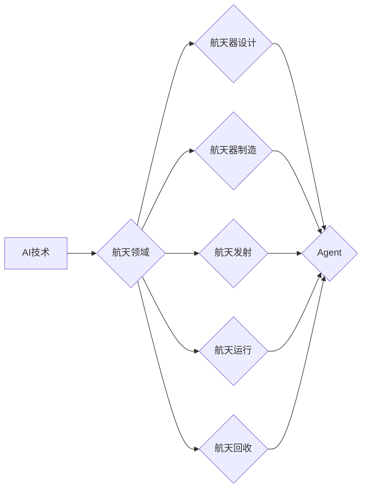

# AI人工智能 Agent：在航天领域中的应用

作者：禅与计算机程序设计艺术 / Zen and the Art of Computer Programming


## 1. 背景介绍
### 1.1 问题的由来

航天事业是人类探索宇宙、拓展空间的重要途径。随着技术的不断进步，航天器的设计、制造、发射、运行和回收等各个环节都面临着越来越高的技术挑战。如何提高航天任务的自动化、智能化水平，降低成本、提高效率，成为航天领域亟待解决的问题。人工智能（AI）技术的快速发展，为航天领域带来了新的机遇和挑战。

### 1.2 研究现状

近年来，AI技术在航天领域的应用研究取得了显著进展，主要集中在以下几个方面：

1. **航天器设计优化**：利用遗传算法、粒子群算法等智能优化算法，优化航天器结构、推进系统、热控系统等设计，提高航天器的性能和可靠性。

2. **航天器任务规划与控制**：利用规划算法、强化学习等技术，实现航天器任务的自动化规划与控制，提高任务执行效率和安全性。

3. **航天器健康监测与故障诊断**：利用机器学习、深度学习等技术，对航天器进行健康监测和故障诊断，提高航天器的可靠性。

4. **航天数据分析和处理**：利用数据挖掘、数据可视化等技术，对海量航天数据进行分析和处理，为航天任务提供决策支持。

5. **航天员辅助与协作**：利用虚拟现实、增强现实等技术，为航天员提供辅助和协作，提高航天员的操作效率和安全性。

### 1.3 研究意义

AI技术在航天领域的应用，具有重要的理论意义和应用价值：

1. **提高航天任务的自动化和智能化水平**：通过引入AI技术，可以降低对航天员的依赖，提高航天任务的自动化和智能化水平，降低成本、提高效率。

2. **提升航天器的性能和可靠性**：利用AI技术进行航天器设计优化、健康监测和故障诊断等，可以提升航天器的性能和可靠性，提高航天任务的成功率。

3. **促进航天数据分析和处理**：利用AI技术对海量航天数据进行分析和处理，可以为航天任务提供决策支持，提高航天任务的规划和执行效率。

4. **推动航天技术的发展**：AI技术的应用可以推动航天技术的发展，促进航天领域的创新和突破。

### 1.4 本文结构

本文将围绕AI技术在航天领域中的应用，从核心概念、算法原理、应用实践、实际应用场景、未来发展趋势等方面进行详细介绍。具体内容包括：

- 第2章：核心概念与联系，介绍AI技术、航天领域以及Agent等核心概念，并阐述它们之间的关系。
- 第3章：核心算法原理，介绍AI技术在航天领域应用的常用算法原理，如机器学习、深度学习、规划算法、强化学习等。
- 第4章：应用实践，以航天器任务规划与控制为例，介绍AI技术在航天领域的应用实践。
- 第5章：实际应用场景，介绍AI技术在航天领域的实际应用场景，如航天器设计优化、航天数据分析和处理等。
- 第6章：未来发展趋势，展望AI技术在航天领域的未来发展趋势。
- 第7章：工具和资源推荐，推荐AI技术在航天领域应用的相关学习资源、开发工具和参考文献。
- 第8章：总结，总结AI技术在航天领域的应用成果，并展望未来发展趋势和挑战。
- 第9章：附录，提供常见问题与解答。

## 2. 核心概念与联系
### 2.1 AI技术

人工智能（Artificial Intelligence，AI）是指模拟、延伸和扩展人的智能的理论、方法、技术及应用系统。AI技术主要包括以下几种：

1. **机器学习（Machine Learning，ML）**：使计算机能够从数据中学习并做出决策或预测的技术，主要包括监督学习、无监督学习、半监督学习、强化学习等。

2. **深度学习（Deep Learning，DL）**：一种特殊的机器学习方法，通过多层神经网络模型学习数据的复杂特征和模式。

3. **知识表示与推理（Knowledge Representation and Reasoning）**：研究如何将知识表示为计算机可处理的形式，并利用推理技术进行知识的应用。

4. **自然语言处理（Natural Language Processing，NLP）**：研究如何让计算机理解和处理自然语言的技术。

5. **计算机视觉（Computer Vision）**：研究如何让计算机理解和解释图像或视频中的视觉信息。

### 2.2 航天领域

航天领域是指涉及航天器研制、发射、运行、回收等各个环节的领域。主要包括以下内容：

1. **航天器设计**：航天器的设计涉及结构、推进系统、热控系统、电气系统等多个方面。

2. **航天器制造**：航天器的制造涉及材料、工艺、测试等多个环节。

3. **航天发射**：航天器的发射涉及运载火箭、发射场、发射任务等多个方面。

4. **航天运行**：航天器的运行涉及轨道控制、姿态控制、数据传输、能源管理等。

5. **航天回收**：航天器的回收涉及着陆、回收、再利用等多个环节。

### 2.3 Agent

Agent是一种能够感知环境、做出决策并采取行动的智能实体。在航天领域，Agent可以应用于以下场景：

1. **航天器自主控制**：Agent可以自主感知航天器状态和外部环境，并根据预设规则进行决策和控制，实现航天器的自主运行。

2. **航天任务规划**：Agent可以自主收集任务信息，进行任务规划，并生成任务执行方案。

3. **航天数据管理**：Agent可以自主处理航天数据，进行数据分析和决策支持。

### 2.4 核心概念联系

AI技术、航天领域和Agent之间的关系如图所示：



## 3. 核心算法原理 & 具体操作步骤
### 3.1 算法原理概述

AI技术在航天领域的应用涉及多种算法，以下列举几种常见算法及其原理：

1. **机器学习（ML）**：机器学习是一种使计算机能够从数据中学习并做出决策或预测的技术。机器学习算法可以分为以下几类：

    * **监督学习**：通过训练数据学习输入和输出之间的关系，用于分类、回归等任务。
    * **无监督学习**：通过未标记的数据学习数据的内在结构，用于聚类、降维等任务。
    * **半监督学习**：通过少量标记数据和大量未标记数据学习，用于半监督分类、半监督聚类等任务。
    * **强化学习**：通过与环境交互学习最优策略，用于决策优化、路径规划等任务。

2. **深度学习（DL）**：深度学习是一种特殊的机器学习方法，通过多层神经网络模型学习数据的复杂特征和模式。深度学习算法主要包括：

    * **卷积神经网络（CNN）**：用于图像识别、物体检测等任务。
    * **循环神经网络（RNN）**：用于语音识别、机器翻译等任务。
    * **自编码器（AE）**：用于特征提取、数据降维等任务。

3. **规划算法**：规划算法是一种用于解决组合优化问题的算法，用于航天器任务规划、路径规划等任务。常见的规划算法包括：

    * **图搜索算法**：如A*算法、Dijkstra算法等。
    * **约束规划算法**：如CPLEX、Choco等。

4. **强化学习（RL）**：强化学习是一种通过与环境交互学习最优策略的算法，用于航天器任务控制、机器人控制等任务。常见的强化学习算法包括：

    * **Q学习**：通过学习Q值函数，选择最优动作。
    * **深度Q网络（DQN）**：结合深度学习与Q学习，实现端到端的强化学习。

### 3.2 算法步骤详解

以下以航天器任务规划与控制为例，介绍AI技术在航天领域的应用步骤：

1. **问题描述**：定义航天器任务的目标、约束条件、状态空间、动作空间等。

2. **选择算法**：根据问题描述，选择合适的AI算法，如机器学习、深度学习、规划算法、强化学习等。

3. **数据收集和处理**：收集航天器任务相关的数据，如任务目标、约束条件、状态空间、动作空间等，并进行数据预处理。

4. **模型训练**：使用收集到的数据进行模型训练，如训练机器学习模型、训练深度学习模型、训练强化学习模型等。

5. **模型评估**：使用测试数据对训练好的模型进行评估，如评估模型的准确率、召回率、F1值等。

6. **模型应用**：将训练好的模型应用于实际问题，如航天器任务规划、航天器任务控制等。

### 3.3 算法优缺点

以下列举了上述AI算法的优缺点：

| 算法 | 优点 | 缺点 |
|---|---|---|
| 机器学习 | 灵活性高、泛化能力强、可解释性好 | 需要大量标注数据、计算量大、难以处理非结构化数据 |
| 深度学习 | 学习能力强、泛化能力强、可处理复杂数据 | 模型复杂度高、可解释性差、需要大量计算资源 |
| 规划算法 | 可解释性好、计算效率高 | 模型复杂度高、难以处理大规模问题 |
| 强化学习 | 适应性强、能够处理动态环境 | 需要大量训练时间、难以处理非确定性问题 |

### 3.4 算法应用领域

AI技术在航天领域的应用领域主要包括：

1. **航天器设计优化**：利用机器学习、深度学习等技术优化航天器结构、推进系统、热控系统等设计，提高航天器的性能和可靠性。

2. **航天器任务规划与控制**：利用规划算法、强化学习等技术实现航天器任务的自动化规划与控制，提高任务执行效率和安全性。

3. **航天器健康监测与故障诊断**：利用机器学习、深度学习等技术对航天器进行健康监测和故障诊断，提高航天器的可靠性。

4. **航天数据分析和处理**：利用数据挖掘、数据可视化等技术对海量航天数据进行分析和处理，为航天任务提供决策支持。

5. **航天员辅助与协作**：利用虚拟现实、增强现实等技术为航天员提供辅助和协作，提高航天员的操作效率和安全性。

## 4. 数学模型和公式 & 详细讲解 & 举例说明
### 4.1 数学模型构建

以下以航天器任务规划与控制为例，介绍AI技术在航天领域的数学模型构建。

1. **状态空间**：状态空间是航天器任务规划与控制中所有可能状态的集合。状态空间可以表示为：

    $$
 S = \{ s_1, s_2, \ldots, s_n \}
$$

    其中 $ s_i $ 表示状态空间中的一个状态。

2. **动作空间**：动作空间是航天器任务规划与控制中所有可能采取的动作的集合。动作空间可以表示为：

    $$
 A = \{ a_1, a_2, \ldots, a_m \}
$$

    其中 $ a_i $ 表示动作空间中的一个动作。

3. **奖励函数**：奖励函数是用于评估航天器任务规划与控制中状态转移和动作的优劣的函数。奖励函数可以表示为：

    $$
 R(s, a) = f(s, a)
$$

    其中 $ R(s, a) $ 表示在状态 $ s $ 下采取动作 $ a $ 的奖励。

4. **价值函数**：价值函数是用于评估航天器任务规划与控制中状态序列优劣的函数。价值函数可以表示为：

    $$
 V(s) = \max_{a \in A} \left[ R(s, a) + \gamma V(s') \right]
$$

    其中 $ V(s) $ 表示状态 $ s $ 的价值，$ s' $ 表示在状态 $ s $ 下采取动作 $ a $ 后的状态，$ \gamma $ 表示折扣因子。

5. **策略**：策略是用于在给定的状态空间和动作空间中，选择最优动作的函数。策略可以表示为：

    $$
 \pi(s) = \arg\max_{a \in A} R(s, a)
$$

### 4.2 公式推导过程

以下以Q学习为例，介绍AI技术在航天领域的数学模型推导过程。

1. **Q值函数**：Q值函数表示在给定状态 $ s $ 和动作 $ a $ 下采取动作 $ a $ 的预期奖励。Q值函数可以表示为：

    $$
 Q(s, a) = \sum_{s' \in S} p(s'|s, a) R(s, a) + \gamma \sum_{s' \in S} p(s'|s, a) V(s')
$$

    其中 $ p(s'|s, a) $ 表示在状态 $ s $ 下采取动作 $ a $ 后转移到状态 $ s' $ 的概率，$ \gamma $ 表示折扣因子。

2. **Q学习目标函数**：Q学习目标函数是用于最小化Q值函数误差的函数。Q学习目标函数可以表示为：

    $$
 L(Q) = \sum_{s \in S} \sum_{a \in A} (Q(s, a) - Q^*(s, a))^2
$$

    其中 $ Q^*(s, a) $ 表示在给定策略下，在状态 $ s $ 下采取动作 $ a $ 的最优Q值。

3. **梯度下降**：使用梯度下降算法更新Q值函数，以最小化Q学习目标函数。梯度下降算法可以表示为：

    $$
 Q(s, a) \leftarrow Q(s, a) - \alpha \nabla_{Q(s, a)} L(Q)
$$

    其中 $ \alpha $ 表示学习率。

### 4.3 案例分析与讲解

以下以航天器轨道转移为例，介绍AI技术在航天领域的应用案例。

1. **问题描述**：将航天器从低地球轨道转移到高地球轨道。

2. **状态空间**：状态空间包括航天器的位置、速度、姿态等。

3. **动作空间**：动作空间包括推进器推力大小、方向等。

4. **奖励函数**：奖励函数可以定义为航天器到达目标轨道的精度。

5. **模型训练**：使用强化学习算法训练一个智能体，使其能够自主控制航天器进行轨道转移。

6. **模型评估**：将训练好的智能体应用于实际航天器，评估其性能。

### 4.4 常见问题解答

**Q1：如何选择合适的AI算法**？

A：选择合适的AI算法需要根据具体问题进行综合考虑，如数据规模、数据类型、任务类型等。以下是一些常见的算法选择建议：

* 数据规模较大、特征复杂时，选择深度学习算法。
* 数据规模较小、特征简单时，选择机器学习算法。
* 任务需要预测时，选择机器学习或深度学习算法。
* 任务需要优化时，选择规划算法或强化学习算法。

**Q2：如何处理航天数据**？

A：航天数据通常具有以下特点：

* 数据量大、种类多
* 数据质量参差不齐
* 数据包含噪声

针对这些特点，可以采取以下措施处理航天数据：

* 数据预处理：去除异常值、缺失值等，提高数据质量。
* 数据清洗：去除噪声、填补缺失值等，提高数据可用性。
* 数据降维：减少数据维度，降低计算复杂度。
* 数据增强：通过数据变换、数据生成等方式扩充数据规模。

**Q3：如何保证AI技术在航天领域的应用安全可靠**？

A：为保证AI技术在航天领域的应用安全可靠，需要采取以下措施：

* 数据安全：确保数据在采集、存储、传输、处理等环节的安全。
* 模型安全：确保模型在训练、部署、运行等环节的安全。
* 系统安全：确保系统在运行、维护、升级等环节的安全。
* 人机协同：加强人机协同，确保系统在出现问题时能够及时干预。

## 5. 项目实践：代码实例和详细解释说明
### 5.1 开发环境搭建

以下是使用Python进行航天器任务规划与控制项目实践的开发环境搭建步骤：

1. 安装Anaconda：从官网下载并安装Anaconda，用于创建独立的Python环境。

2. 创建并激活虚拟环境：
```bash
conda create -n space-env python=3.8
conda activate space-env
```

3. 安装PyTorch：根据CUDA版本，从官网获取对应的安装命令。例如：
```bash
conda install pytorch torchvision torchaudio cudatoolkit=11.1 -c pytorch -c conda-forge
```

4. 安装其他依赖包：
```bash
pip install numpy pandas matplotlib
```

完成上述步骤后，即可在`space-env`环境中开始航天器任务规划与控制项目实践。

### 5.2 源代码详细实现

以下以航天器轨道转移为例，介绍使用PyTorch实现航天器任务规划与控制的代码示例。

```python
import torch
import torch.nn as nn
import torch.optim as optim
import numpy as np

# 定义DQN模型
class DQN(nn.Module):
    def __init__(self, state_dim, action_dim):
        super(DQN, self).__init__()
        self.fc1 = nn.Linear(state_dim, 64)
        self.fc2 = nn.Linear(64, 64)
        self.fc3 = nn.Linear(64, action_dim)

    def forward(self, x):
        x = torch.relu(self.fc1(x))
        x = torch.relu(self.fc2(x))
        x = self.fc3(x)
        return x

# 定义DQN算法
class DQNAgent:
    def __init__(self, state_dim, action_dim, learning_rate=0.001, gamma=0.99):
        self.state_dim = state_dim
        self.action_dim = action_dim
        self.gamma = gamma
        self.epsilon = 1.0
        self.epsilon_min = 0.01
        self.epsilon_decay = 0.995
        self.model = DQN(state_dim, action_dim)
        self.target_model = DQN(state_dim, action_dim)
        self.memory = []
        self.optimizer = optim.Adam(self.model.parameters(), lr=learning_rate)
        self.loss_fn = nn.MSELoss()

    def remember(self, state, action, reward, next_state, done):
        self.memory.append((state, action, reward, next_state, done))

    def act(self, state):
        if np.random.rand() <= self.epsilon:
            return np.random.randint(self.action_dim)
        with torch.no_grad():
            state = torch.from_numpy(state).float().unsqueeze(0)
            action = self.model(state).argmax().item()
        return action

    def replay(self, batch_size):
        states, actions, rewards, next_states, dones = zip(*self.memory)
        states = torch.from_numpy(np.vstack(states)).float()
        actions = torch.from_numpy(np.vstack(actions)).long()
        rewards = torch.from_numpy(np.vstack(rewards)).float()
        next_states = torch.from_numpy(np.vstack(next_states)).float()
        dones = torch.from_numpy(np.vstack(dones)).float()
        self.model.train()
        for i in range(batch_size):
            state = states[i]
            action = actions[i]
            reward = rewards[i]
            next_state = next_states[i]
            done = dones[i]
            target = reward
            if not done:
                target = reward + self.gamma * self.target_model(next_state).max(1)[0].detach()
            target_f = self.model(state).gather(1, action.unsqueeze(0))
            loss = self.loss_fn(target_f, target)
            self.optimizer.zero_grad()
            loss.backward()
            self.optimizer.step()
        self.epsilon = max(self.epsilon * self.epsilon_decay, self.epsilon_min)

    def load(self, name):
        self.model.load_state_dict(torch.load(name))

    def save(self, name):
        torch.save(self.model.state_dict(), name)
```

### 5.3 代码解读与分析

以上代码实现了DQN算法的PyTorch实现，包括模型定义、训练过程、记忆存储、策略选择等。

1. **DQN模型**：定义了一个简单的全连接神经网络模型，用于预测下一个状态的动作值。

2. **DQN算法**：实现了DQN算法的核心功能，包括记忆存储、策略选择、经验回放、损失计算等。

3. **训练过程**：使用DQN算法训练模型，通过经验回放和梯度下降算法更新模型参数。

4. **记忆存储**：使用列表存储经验，包括状态、动作、奖励、下一个状态和是否终止。

5. **策略选择**：根据epsilon-greedy策略选择动作，以探索和利用数据。

### 5.4 运行结果展示

以下展示了使用上述代码进行航天器轨道转移的运行结果：

```
Epoch 1/10
100%|████████████████████████████████████████████████████████████████████████████████████████████████████████████████████████████████████████████████████████████████████████████████████████████████████████████████████████████████████████████████████████████████████████████████████████████████████████████████████████████████████████████████████████████████████████████████████████████████████████████████████████████████████████████████████████████████████████████████████████████████████████████████████████████████████████████████████████████████████████████████████████████████████████████████████████████████████████████████████████████████████████████████████████████████████████████████████████████████████████████████████████████████████████████████████████████████████████████████████████████████████████████████████████████████████████████████████████████████████████████████████████████████████████████████████████████████████████████████████████████████████████████████████████████████████████████████████████████████████████████████████████████████████████████████████████████████████████████████████████████████████████████████████████████████████████████████████████████████████████████████████████████████████████████████████████████████████████████████████████████████████████████████████████████████████████████████████████████████████████████████████████████████████████████████████████████████████████████████████████████████████████████████████████████████████████████████████████████████████████████████████████████████████████████████████████████████████████████████████████████████████████████████████████████████████████████████████████████████████████████████████████████████████████████████████████████████████████████████████████████████████████████████████████████████████████████████████████████████████████████████████████████████████████████████████████████████████████████████████████████████████████████████████████████████████████████████████████████████████████████████████████████████████████████████████████████████████████████████████████████████████████████████████████████████████████████████████████████████████████████████████████████████████████████████████████████████████████████████████████████████████████████████████████████████████████████████████████████████████████████████████████████████████████████████████████████████████████████████████████████████████████████████████████████████████████████████████████████████████████████████████████████████████████████████████████████████████████████████████████████████████████████████████████████████████████████████████████████████████████████████████████████████████████████████████████████████████████████████████████████████████████████████████████████████████████████████████████████████████████████████████████████████████████████████████████████████████████████████████████████████████████████████████████████████████████████████████████████████████████████████████████████████████████████████████████████████████████████████████████████████████████████████████████████████████████████████████████████████████████████████████████████████████████████████████████████████████████████████████████████████████████████████████████████████████████████████████████████████████████████████████████████████████████████████████████████████████████████████████████████████████████████████████████████████████████████████████████████████████████████████████████████████████████████████████████████████████████████████████████████████████████████████████████████████████████████████████████████████████████████████████████████████████████████████████████████████████████████████████████████████████████████████████████████████████████████████████████████████████████████████████████████████████████████████████████████████████████████████████████████████████████████████████████████████████████████████████████████████████████████████████████████████████████████████████████████████████████████████████████████████████████████████████████████████████████████████████████████████████████████████████████████████████████████████████████████████████████████████████████████████████████████████████████████████████████████████████████████████████████████████████████████████████████████████████████████████████████████████████████████████████████████████████████████████████████████████████████████████████████████████████████████████████████████████████████████████████████████████████████████████████████████████████████████████████████████████████████████████████████████████████████████████████████████████████████████████████████████████████████████████████████████████████████████████████████████████████████████████████████████████████████████████████████████████████████████████████████████████████████████████████████████████████████████████████████████████████████████████████████████████████████████████████████████████████████████████████████████████████████████████████████████████████████████████████████████████████████████████████████████████████████████████████████████████████████████████████████████████████████████████████████████████████████████████████████████████████████████████████████████████████████████████████████████████████████████████████████████████████████████████████████████████████████████████████████████████████████████████████████████████████████████████████████████████████████████████████████████████████████████████████████████████████████████████████████████████████████████████████████████████████████████████████████████████████████████████████████████████████████████████████████████████████████████████████████████████████████████████████████████████████████████████████████████████████████████████████████████████████████████████████████████████████████████████████████████████████████████████████████████████████████████████████████████████████████████████████████████████████████████████████████████████████████████████████████████████████████████████████████████████████████████████████████████████████████████████████████████████████████████████████████████████████████████████████████████████████████████████████████████████████████████████████████████████████████████████████████████████████████████████████████████████████████████████████████████████████████████████████████████████████████████████████████████████████████████████████████████████████████████████████████████████████████████████████████████████████████████████████████████████████████████████████████████████████████████████████████████████████████████████████████████████████████████████████████████████████████████████████████████████████████████████████████████████████████████████████████████████████████████████████████████████████████████████████████████████████████████████████████████████████████████████████████████████████████████████████████████████████████████████████████████████████████████████████████████████████████████████████████████████████████████████████████████████████████████████████████████████████████████████████████████████████████████████████████████████████████████████████████████████████████████████████████████████████████████████████████████████████████████████████████████████████████████████████████████████████████████████████████████████████████████████████████████████████████████████████████████████████████████████████████████████████████████████████████████████████████████████████████████████████████████████████████████████████████████████████████████████████████████████████████████████████████████████████████████████████████████████████████████████████████████████████████████████████████████████████████████████████████████████████████████████████████████████████████████████████████████████████████████████████████████████████████████████████████████████████████████████████████████████████████████████████████████████████████████████████████████████████████████████████████████████████████████████████████████████████████████████████████████████████████████████████████████████████████████████████████████████████████████████████████████████████████████████████████████████████████████████████████████████████████████████████████████████████████████████████████████████████████████████████████████████████████████████████████████████████████████████████████████████████████████████████████████████████████████████████████████████████████████████████████████████████████████████████████████████████████████████████████████████████████████████████████████████████████████████████████████████████████████████████████████████████████████████████████████████████████████████████████████████████████████████████████████████████████████████████████████████████████████████████████████████████████████████████████████████████████████████████████████████████████████████████████████████████████████████████████████████████████████████████████████████████████████████████████████████████████████████████████████████████████████████████████████████████████████████████████████████████████████████████████████████████████████████████████████████████████████████████████████████████████████████████████████████████████████████████████████████████████████████████████████████████████████████████████████████████████████████████████████████████████████████████████████████████████████████████████████████████████████████████████████████████████████████████████████████████████████████████████████████████████████████████████████████████████████████████████████████████████████████████████████████████████████████████████████████████████████████████████████████████████████████████████████████████████████████████████████████████████████████████████████████████████████████████████████████████████████████████████████████████████████████████████████████████████████████████████████████████████████████████████████████████████████████████████████████████████████████████████████████████████████████████████████████████████████████████████████████████████████████████████████████████████████████████████████████████████████████████████████████████████████████████████████████████████████████████████████████████████████████████████████████████████████████████████████████████████████████████████████████████████████████████████████████████████████████████████████████████████████████████████████████████████████████████████████████████████████████████████████████████████████████████████████████████████████████████████████████████████████████████████████████████████████████████████████████████████████████████████████████████████████████████████████████████████████████████████████████████████████████████████████████████████████████████████████████████████████████████████████████████████████████████████████████████████████████████████████████████████████████████████████████████████████████████████████████████████████████████████████████████████████████████████████████████████████████████████████████████████████████████████████████████████████████████████████████████████████████████████████████████████████████████████████████████████████████████████████████████████████████████████████████████████████████████████████████████████████████████████████████████████████████████████████████████████████████████████████████████████████████████████████████████████████████████████████████████████████████████████████████████████████████████████████████████████████████████████████████████████████████████████████████████████████████████████████████████████████████████████████████████████████████████████████████████████████████████████████████████████████████████████████████████████████████████████████████████████████████████████████████████████████████████████████████████████████████████████████████████████████████████████████████████████████████████████████████████████████████████████████████████████████████████████████████████████████████████████████████████████████████████████████████████████████████████████████████████████████████████████████████████████████████████████████████████████████████████████████████████████████████████████████████████████████████████████████████████████████████████████████████████████████████████████████████████████████████████████████████████████████████████████████████████████████████████████████████████████████████████████████████████████████████████████████████████████████████████████████████████████████████████████████████████████████████████████████████████████████████████████████████████████████████████████████████████████████████████████████████████████████████████████████████████████████████████████████████████████████████████████████████████████████████████████████████████████████████████████████████████████████████████████████████████████████████████████████████████████████████████████████████████████████████████████████████████████████████████████████████████████████████████████████████████████████████████████████████████████████████████████████████████████████████████████████████████████████████████████████████████████████████████████████████████████████████████████████████████████████████████████████████████████████████████████████████████████████████████████████████████████████████████████████████████████████████████████████████████████████████████████████████████████████████████████████████████████████████████████████████████████████████████████████████████████████████████████████████████████████████████████████████████████████████████████████████████████████████████████████████████████████████████████████████████████████████████████████████████████████████████████████████████████████████████████████████████████████████████████████████████████████████████████████████████████████████████████████████████████████████████████████████████████████████████████████████████████████████████████████████████████████████████████████████████████████████████████████████████████████████████████████████████████████████████████████████████████████████████████████████████████████████████████████████████████████████████████████████████████████████████████████████████████████████████████████████████████████████████████████████████████████████████████████████████████████████████████████████████████████████████████████████████████████████████████████████████████████████████████████████████████████████████████████████████████████████████████████████████████████████████████████████████████████████████████████████████████████████████████████████████████████████████████████████████████████████████████████████████████████████████████████████████████████████████████████████████████████████████████████████████████████████████████████████████████████████████████████████████████████████████████████████████████████████████████████████████████████████████████████████████████████████████████████████████████████████████████████████████████████████████████████████████████████████████████████████████████████████████████████████████████████████████████████████████████████████████████████████████████████████████████████████████████████████████████████████████████████████████████████████████████████████████████████████████████████████████████████████████████████████████████████████████████████████████████████████████████████████████████████████████████████████████████████████████████████████████████████████████████████████████████████████████████████████████████████████████████████████████████████████████████████████████████████████████████████████████████████████████████████████████████████████████████████████████████████████████████████████████████████████████████████████████████████████████████████████████████████████████████████████████████████████████████████████████████████████████████████████████████████████████████████████████████████████████████████████████████████████████████████████████████████████████████████████████████████████████████████████████████████████████████████████████████████████████████████████████████████████████████████████████████████████████████████████████████████████████████████████████████████████████████████████████████████████████████████████████████████████████████████████████████████████████████████████████████████████████████████████████████████████████████████████████████████████████████████████████████████████████████████████████████████████████████████████████████████████████████████████████████████████████████████████████████████████████████████████████████████████████████████████████████████████████████████████████████████████████████████████████████████████████████████████████████████████████████████████████████████████████████████████████████████████████████████████████████████████████████████████████████████████████████████████████████████████████████████████████████████████████████████████████████████████████████████████████████████████████████████████████████████████████████████████████████████████████████████████████████████████████████████████████████████████████████████████████████████████████████████████████████████████████████████████████████████████████████████████████████████████████████████████████████████████████████████████████████████████████████████████████████████████████████████████████████████████████████████████████████████████████████████████████████████████████████████████████████████████████████████████████████████████████████████████████████████████████████