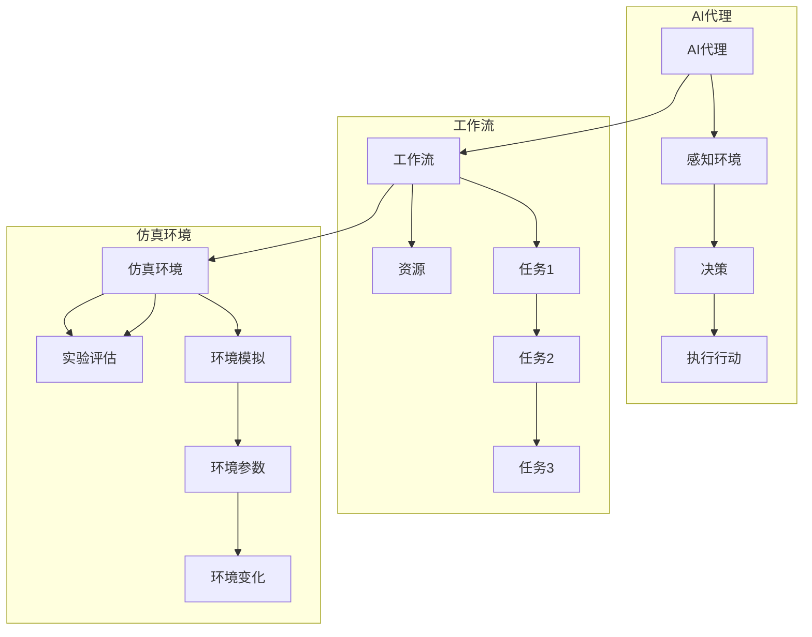

# AI人工智能代理工作流AI Agent WorkFlow：仿真环境中AI代理的实验与评估

作者：禅与计算机程序设计艺术 / Zen and the Art of Computer Programming

## 关键词：

AI代理、工作流、仿真环境、实验评估、决策树、强化学习、深度学习

---

## 1. 背景介绍

### 1.1 问题的由来

随着人工智能技术的飞速发展，AI代理（Artificial Intelligence Agent）在各个领域的应用越来越广泛。AI代理是一种能够感知环境、自主决策并采取行动的智能体，它们能够模拟人类的行为，完成各种复杂的任务。然而，在实际应用中，如何设计有效的AI代理工作流，使其能够高效、稳定地完成任务，是一个亟待解决的问题。

### 1.2 研究现状

目前，AI代理工作流的研究主要集中在以下几个方面：

- **工作流定义与设计**：研究如何定义和设计高效、可扩展的AI代理工作流，包括工作流的组成、执行顺序、资源分配等。

- **AI代理协作**：研究AI代理之间的协作机制，包括任务分配、信息共享、冲突解决等。

- **仿真环境构建**：研究如何构建逼真的仿真环境，以测试和评估AI代理工作流。

- **实验与评估**：研究如何对AI代理工作流进行实验和评估，以验证其性能和可靠性。

### 1.3 研究意义

研究AI人工智能代理工作流，对于以下方面具有重要意义：

- **提高AI代理的实用性**：通过设计高效、可靠的工作流，使AI代理能够更好地适应复杂环境，完成更多实际任务。

- **推动人工智能技术的发展**：AI代理工作流的研究将推动人工智能技术在各个领域的应用，促进人工智能产业的快速发展。

- **促进跨学科研究**：AI代理工作流的研究涉及计算机科学、人工智能、认知科学等多个学科，将促进跨学科研究。

### 1.4 本文结构

本文将首先介绍AI人工智能代理工作流的核心概念和联系，然后详细阐述工作流的设计原理和具体操作步骤，接着介绍相关的数学模型和公式，并通过案例分析讲解其应用。最后，本文将探讨实际应用场景和未来应用展望。

## 2. 核心概念与联系

### 2.1 AI代理

AI代理是一种能够感知环境、自主决策并采取行动的智能体。它具备以下特点：

- **自主性**：AI代理能够自主地做出决策，不受外界干预。

- **适应性**：AI代理能够根据环境变化调整自己的行为。

- **反应性**：AI代理能够对外界刺激做出快速反应。

- **社会性**：AI代理能够与其他AI代理进行交互和协作。

### 2.2 工作流

工作流是一系列任务的有序执行序列，它定义了任务之间的关系和执行顺序。工作流可以由以下元素组成：

- **任务**：工作流中的单个操作，例如数据预处理、模型训练、模型评估等。

- **活动**：任务的具体执行过程，例如数据处理、模型训练等。

- **决策**：根据条件判断执行哪个活动。

- **资源**：工作流执行所需的各种资源，例如计算资源、存储资源等。

### 2.3 仿真环境

仿真环境是一种虚拟环境，用于模拟真实世界，以测试和评估AI代理工作流。仿真环境需要具备以下特点：

- **逼真性**：仿真环境应尽可能模拟真实世界的复杂性和不确定性。

- **可控性**：仿真环境应能够控制环境参数，以便进行实验和评估。

- **可扩展性**：仿真环境应能够扩展到不同的规模和场景。

### 2.4 联系

AI代理、工作流和仿真环境之间的关系可以用以下图表示：



可以看出，AI代理是工作流的基础，工作流定义了任务的执行顺序和资源分配，而仿真环境用于测试和评估工作流。

## 3. 核心算法原理 & 具体操作步骤

### 3.1 算法原理概述

AI人工智能代理工作流的核心算法主要涉及以下两个方面：

- **AI代理的决策算法**：用于指导AI代理如何根据环境信息做出决策。

- **工作流的调度算法**：用于控制任务的执行顺序和资源分配。

### 3.2 算法步骤详解

以下是AI人工智能代理工作流的算法步骤：

1. **定义工作流**：根据任务需求，定义工作流的组成、执行顺序和资源分配。

2. **初始化AI代理**：初始化AI代理的状态和参数。

3. **环境模拟**：模拟真实世界的环境，为AI代理提供感知信息。

4. **AI代理决策**：AI代理根据感知到的环境信息，使用决策算法做出决策。

5. **任务执行**：根据AI代理的决策结果，执行相应的任务。

6. **工作流调度**：根据工作流定义和任务执行情况，调度后续任务的执行。

7. **实验评估**：根据任务执行结果和环境变化，对AI代理工作流进行评估。

### 3.3 算法优缺点

**优点**：

- **提高效率**：通过合理的工作流设计，可以显著提高任务执行效率。

- **增强可靠性**：通过决策算法和调度算法的优化，可以提高AI代理工作流的可靠性。

- **易于扩展**：通过模块化的工作流设计，可以方便地扩展工作流的功能。

**缺点**：

- **复杂性**：AI代理工作流的设计和实现相对复杂，需要一定的技术积累。

- **依赖性**：AI代理工作流的性能依赖于AI代理的决策算法和工作流的调度算法。

### 3.4 算法应用领域

AI人工智能代理工作流可以应用于以下领域：

- **智能制造**：用于生产线自动化、设备维护、产品质量检测等。

- **智慧城市**：用于交通管理、环境保护、能源管理等。

- **金融服务**：用于风险管理、欺诈检测、智能投顾等。

## 4. 数学模型和公式 & 详细讲解 & 举例说明

### 4.1 数学模型构建

AI人工智能代理工作流的数学模型主要包括以下两个方面：

- **AI代理的决策模型**：用于描述AI代理如何根据环境信息做出决策。

- **工作流的调度模型**：用于描述工作流的执行顺序和资源分配。

### 4.2 公式推导过程

**AI代理的决策模型**：

假设AI代理在时刻 $t$ 感知到的环境信息为 $S_t$，其决策为 $A_t$，则决策模型可以表示为：

$$
A_t = f(S_t, \theta)
$$

其中 $f$ 为决策函数，$\theta$ 为决策参数。

**工作流的调度模型**：

假设工作流由 $n$ 个任务组成，其执行顺序为 $O = \{T_1, T_2, \ldots, T_n\}$，则工作流的调度模型可以表示为：

$$
O = g(T_1, T_2, \ldots, T_n)
$$

其中 $g$ 为调度函数。

### 4.3 案例分析与讲解

以下以智能制造领域的设备维护工作流为例，进行案例分析。

**问题描述**：

某工厂拥有多条生产线，每条生产线包含多个设备。为了保证生产线的稳定运行，需要定期对设备进行维护。设备维护工作流包括以下任务：

- **设备状态监测**：实时监测设备运行状态，获取设备故障信息。

- **故障诊断**：根据设备故障信息，判断设备故障类型。

- **维护计划生成**：根据故障类型，生成维护计划。

- **维护执行**：根据维护计划，执行设备维护操作。

- **效果评估**：评估设备维护效果。

**AI代理决策模型**：

设备维护工作流的AI代理需要根据设备状态和故障信息做出以下决策：

- **是否执行维护**：根据设备故障类型和设备运行状态，判断是否需要执行维护。

- **维护优先级**：根据设备故障严重程度，确定维护优先级。

**工作流调度模型**：

设备维护工作流的调度模型如下：

- **设备状态监测**：实时监测设备运行状态。

- **故障诊断**：当设备发生故障时，触发故障诊断。

- **维护计划生成**：根据故障类型，生成维护计划。

- **维护执行**：根据维护计划，执行设备维护操作。

- **效果评估**：评估设备维护效果。

### 4.4 常见问题解答

**Q1：如何设计高效的AI代理决策模型？**

A1：设计高效的AI代理决策模型需要考虑以下因素：

- **决策目标**：明确决策目标，例如最小化设备故障率、最大化设备运行时间等。

- **决策信息**：收集充分的决策信息，例如设备状态、故障历史等。

- **决策算法**：选择合适的决策算法，例如决策树、强化学习等。

**Q2：如何设计高效的工作流调度模型？**

A2：设计高效的工作流调度模型需要考虑以下因素：

- **任务优先级**：根据任务的重要性和紧急性，确定任务优先级。

- **资源限制**：根据资源限制，例如计算资源、存储资源等，进行任务调度。

- **调度算法**：选择合适的调度算法，例如最短作业优先（SJF）、轮转调度等。

## 5. 项目实践：代码实例和详细解释说明

### 5.1 开发环境搭建

以下是在Python环境中使用PyTorch框架实现AI人工智能代理工作流的基本步骤：

1. 安装PyTorch：

```bash
pip install torch torchvision
```

2. 安装其他依赖包：

```bash
pip install numpy pandas scikit-learn matplotlib
```

### 5.2 源代码详细实现

以下是一个简单的设备维护工作流示例：

```python
import torch
import torch.nn as nn
import torch.optim as optim
from torch.utils.data import DataLoader, Dataset

# 定义设备状态数据集
class DeviceDataset(Dataset):
    def __init__(self, data):
        self.data = data

    def __len__(self):
        return len(self.data)

    def __getitem__(self, idx):
        return self.data[idx]

# 定义设备维护工作流模型
class MaintenanceWorkflow(nn.Module):
    def __init__(self):
        super(MaintenanceWorkflow, self).__init__()
        self.device_status = nn.Linear(10, 5)  # 假设设备状态特征维度为10，维护决策维度为5
        self.loss_fn = nn.CrossEntropyLoss()

    def forward(self, x):
        x = self.device_status(x)
        return x

# 加载数据
data = [[...], [...], ..., [...]]  # 假设数据格式为[[设备状态1], [设备状态2], ..., [设备状态n]]
dataset = DeviceDataset(data)
dataloader = DataLoader(dataset, batch_size=1, shuffle=True)

# 初始化模型和优化器
model = MaintenanceWorkflow()
optimizer = optim.Adam(model.parameters(), lr=0.001)

# 训练模型
for epoch in range(10):
    for x, y in dataloader:
        optimizer.zero_grad()
        output = model(x)
        loss = model.loss_fn(output, y)
        loss.backward()
        optimizer.step()
```

### 5.3 代码解读与分析

以上代码首先定义了一个设备状态数据集，然后定义了一个设备维护工作流模型，该模型包含一个线性层，用于将设备状态特征映射到维护决策维度。接着，加载数据，初始化模型和优化器，并进行训练。

在训练过程中，模型会根据设备状态特征学习维护决策。通过反向传播算法，模型不断更新参数，使得输出结果与真实标签之间的误差最小化。

### 5.4 运行结果展示

运行以上代码，可以得到训练后的模型参数。根据模型参数，可以预测新的设备状态对应的维护决策。

## 6. 实际应用场景

AI人工智能代理工作流可以应用于以下实际应用场景：

- **智能制造**：用于生产线自动化、设备维护、产品质量检测等。

- **智慧城市**：用于交通管理、环境保护、能源管理等。

- **金融服务**：用于风险管理、欺诈检测、智能投顾等。

- **医疗健康**：用于疾病诊断、治疗方案推荐、健康管理等。

## 7. 工具和资源推荐

### 7.1 学习资源推荐

- **《深度学习》**：Goodfellow et al. 的经典著作，全面介绍了深度学习的基本原理和应用。

- **《强化学习》**：Sutton et al. 的经典著作，详细介绍了强化学习的基本原理和应用。

- **《人工智能：一种现代的方法》**：Russell and Norvig 的经典著作，全面介绍了人工智能的基本原理和应用。

### 7.2 开发工具推荐

- **PyTorch**：一个开源的深度学习框架，易于使用，功能强大。

- **TensorFlow**：一个开源的深度学习框架，拥有丰富的工具和库。

- **Keras**：一个开源的深度学习库，易于使用，适合初学者。

### 7.3 相关论文推荐

- **《Reinforcement Learning: An Introduction》**：Sutton and Barto 的经典著作，详细介绍了强化学习的基本原理和应用。

- **《Deep Learning》**：Goodfellow et al. 的经典著作，介绍了深度学习的基本原理和应用。

- **《Artificial Intelligence: A Modern Approach》**：Russell and Norvig 的经典著作，全面介绍了人工智能的基本原理和应用。

### 7.4 其他资源推荐

- **arXiv**：一个开源的学术论文预印本数据库。

- **GitHub**：一个开源代码托管平台。

- **Stack Overflow**：一个问答社区，可以解决编程问题。

## 8. 总结：未来发展趋势与挑战

### 8.1 研究成果总结

本文对AI人工智能代理工作流进行了系统性的介绍，包括其核心概念、原理、实现方法和应用场景。通过理论分析和实践案例，展示了AI人工智能代理工作流在各个领域的应用潜力。

### 8.2 未来发展趋势

未来，AI人工智能代理工作流将朝着以下方向发展：

- **智能化**：通过引入更先进的算法和技术，提高AI代理的智能水平。

- **泛化能力**：提高AI人工智能代理工作流的泛化能力，使其能够适应更广泛的应用场景。

- **可解释性**：提高AI人工智能代理工作流的可解释性，使其更容易被用户理解和接受。

### 8.3 面临的挑战

AI人工智能代理工作流在实际应用中仍然面临以下挑战：

- **数据收集**：获取高质量的数据是构建有效的AI人工智能代理工作流的前提。

- **算法选择**：选择合适的算法和技术是构建有效的AI人工智能代理工作流的关键。

- **模型评估**：对AI人工智能代理工作流进行有效的评估是一个挑战。

### 8.4 研究展望

未来，AI人工智能代理工作流的研究将朝着以下方向展开：

- **跨学科研究**：结合认知科学、心理学等学科，研究人类工作流的特性，为AI人工智能代理工作流的设计提供灵感。

- **领域特定研究**：针对不同领域的工作流特性，开发特定领域的工作流框架和算法。

- **开放平台构建**：构建开放的平台，促进AI人工智能代理工作流的共享和复用。

通过不断的研究和探索，AI人工智能代理工作流将在各个领域发挥更大的作用，为人类创造更多的价值。

## 9. 附录：常见问题与解答

**Q1：什么是AI代理？**

A1：AI代理是一种能够感知环境、自主决策并采取行动的智能体。

**Q2：什么是工作流？**

A2：工作流是一系列任务的有序执行序列。

**Q3：什么是仿真环境？**

A3：仿真环境是一种虚拟环境，用于模拟真实世界。

**Q4：如何设计高效的AI代理决策模型？**

A4：设计高效的AI代理决策模型需要考虑决策目标、决策信息和决策算法。

**Q5：如何设计高效的工作流调度模型？**

A5：设计高效的工作流调度模型需要考虑任务优先级、资源限制和调度算法。

**Q6：AI人工智能代理工作流有哪些应用场景？**

A6：AI人工智能代理工作流可以应用于智能制造、智慧城市、金融服务、医疗健康等领域。

**Q7：如何获取更多的学习资源？**

A7：可以通过arXiv、GitHub、Stack Overflow等平台获取更多的学习资源。

**Q8：如何获取更多的相关论文？**

A8：可以通过arXiv、GitHub等平台获取更多的相关论文。

**Q9：如何获取更多的开发工具？**

A9：可以通过PyTorch、TensorFlow、Keras等平台获取更多的开发工具。

**Q10：如何构建一个AI人工智能代理工作流？**

A10：构建AI人工智能代理工作流需要考虑以下步骤：

1. 定义工作流。
2. 初始化AI代理。
3. 模拟环境。
4. AI代理决策。
5. 任务执行。
6. 工作流调度。
7. 实验评估。

通过以上步骤，可以构建一个简单的AI人工智能代理工作流。