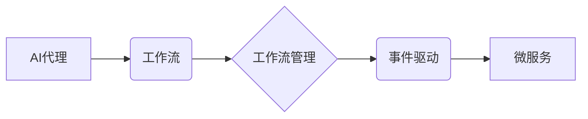

# AI人工智能代理工作流AI Agent WorkFlow：搭建可拓展的AI代理工作流架构

作者：禅与计算机程序设计艺术 / Zen and the Art of Computer Programming

## 1. 背景介绍

### 1.1 问题的由来

随着人工智能技术的飞速发展，越来越多的企业开始尝试将AI技术应用于实际业务场景中，以提升效率和降低成本。然而，如何有效地管理和组织AI任务，构建一个可扩展、可维护的AI代理工作流架构，成为了一个亟待解决的问题。

AI代理工作流是指由多个AI任务组成的、具有特定业务目标的执行序列。它将AI任务按照一定的逻辑关系组织起来，以实现自动化、智能化的业务流程。然而，传统的AI工作流架构存在着以下问题：

- **难以扩展**：传统的AI工作流架构通常采用硬编码的方式，当新增或修改AI任务时，需要修改代码，导致架构难以扩展。
- **难以维护**：随着AI任务的增多，传统的AI工作流架构越来越难以维护，代码复杂度越来越高。
- **缺乏灵活性**：传统的AI工作流架构缺乏灵活性，难以适应业务变化和需求调整。

### 1.2 研究现状

为了解决上述问题，研究者们提出了多种AI代理工作流架构，主要包括以下几种：

- **基于工作流管理系统的架构**：将AI任务抽象为工作流活动，通过工作流管理系统进行管理和调度。
- **基于事件驱动架构的架构**：将AI任务与事件关联，通过事件驱动的方式执行AI任务。
- **基于微服务的架构**：将AI任务分解为独立的微服务，通过服务编排实现AI工作流。

### 1.3 研究意义

构建可拓展的AI代理工作流架构具有重要的研究意义：

- **提高效率**：通过自动化、智能化的AI工作流，可以显著提高业务效率，降低人力成本。
- **降低成本**：通过减少人工干预，可以降低运营成本，提高资源利用率。
- **提升质量**：通过精确的控制AI任务的执行过程，可以提升业务质量，降低错误率。
- **增强灵活性**：可拓展的AI代理工作流架构可以适应业务变化和需求调整，提高系统可维护性。

### 1.4 本文结构

本文将围绕AI代理工作流架构展开，首先介绍核心概念和联系，然后详细介绍核心算法原理和具体操作步骤，接着分析数学模型和公式，并给出项目实践案例。最后，探讨实际应用场景、未来应用展望、工具和资源推荐、未来发展趋势与挑战，以及常见问题与解答。

## 2. 核心概念与联系

为了更好地理解AI代理工作流架构，以下介绍几个核心概念及其相互联系：

- **AI代理**：具有智能行为、能够执行特定任务的实体。
- **工作流**：由多个AI任务组成的、具有特定业务目标的执行序列。
- **工作流管理**：对AI工作流进行管理和调度的过程。
- **事件驱动**：通过事件触发AI任务执行的过程。
- **微服务**：独立的、可扩展的软件服务。

它们之间的逻辑关系如下所示：



可以看出，AI代理执行AI任务，形成工作流。工作流通过工作流管理进行管理和调度，可以采用事件驱动的方式执行，最终以微服务的形式部署。

## 3. 核心算法原理 & 具体操作步骤

### 3.1 算法原理概述

AI代理工作流架构的核心算法原理是：

1. **任务建模**：将AI任务抽象为可执行的动作，并定义动作之间的逻辑关系。
2. **状态管理**：记录AI任务执行过程中的状态，包括输入、输出、执行结果等。
3. **调度策略**：根据任务状态和调度策略，选择合适的AI任务进行执行。
4. **服务编排**：将AI任务分解为独立的微服务，并通过服务编排实现工作流。

### 3.2 算法步骤详解

以下是AI代理工作流架构的具体操作步骤：

**Step 1：任务建模**

- 定义AI任务的输入、输出和执行结果。
- 将AI任务抽象为可执行的动作，并定义动作之间的逻辑关系。

**Step 2：状态管理**

- 设计状态存储结构，用于记录AI任务执行过程中的状态。
- 定义状态变更事件，用于触发状态更新。

**Step 3：调度策略**

- 设计调度策略，用于选择合适的AI任务进行执行。
- 调度策略可以基于任务优先级、资源占用等因素。

**Step 4：服务编排**

- 将AI任务分解为独立的微服务。
- 通过服务编排实现工作流。

### 3.3 算法优缺点

**优点**：

- **可扩展**：通过模块化设计，可以方便地添加或修改AI任务。
- **可维护**：通过清晰的逻辑关系和状态管理，可以方便地维护工作流。
- **灵活**：通过灵活的调度策略，可以适应不同的业务场景。

**缺点**：

- **复杂度高**：需要设计复杂的调度策略和状态管理机制。
- **资源消耗大**：需要较高的计算资源支持。

### 3.4 算法应用领域

AI代理工作流架构可以应用于以下领域：

- **智能客服**：实现智能客服机器人，自动回答客户咨询。
- **智能推荐**：实现个性化推荐系统，为用户提供个性化的推荐内容。
- **智能金融**：实现智能风控系统，降低金融风险。
- **智能制造**：实现智能生产线，提高生产效率。

## 4. 数学模型和公式 & 详细讲解 & 举例说明

### 4.1 数学模型构建

AI代理工作流架构的数学模型主要包括以下内容：

- **任务状态**：表示AI任务执行过程中的状态，可以表示为状态向量 $s_t = (s_{t1}, s_{t2}, ..., s_{tm})$，其中 $s_{ti}$ 表示第 $i$ 个状态变量。
- **状态转换函数**：表示AI任务状态之间的转换关系，可以表示为函数 $f(s_t) = s_{t+1}$。
- **调度策略**：表示选择AI任务进行执行的策略，可以表示为函数 $g(s_t) = x_t$，其中 $x_t$ 表示在时刻 $t$ 选择的AI任务。

### 4.2 公式推导过程

以下是状态转换函数和调度策略的推导过程：

**状态转换函数**：

$$
s_{t+1} = f(s_t) = \text{{根据状态转换规则计算}}
$$

**调度策略**：

$$
g(s_t) = x_t = \text{{根据调度策略选择AI任务}}
$$

### 4.3 案例分析与讲解

以下是一个简单的AI代理工作流案例，用于实现智能客服机器人。

**任务**：智能客服机器人自动回答客户咨询。

**状态变量**：

- $s_{t1}$：客户问题
- $s_{t2}$：客服机器人回复
- $s_{t3}$：客户反馈

**状态转换规则**：

- 当 $s_{t1}$ 不为空时，执行客服机器人回复生成任务，得到 $s_{t2}$。
- 当 $s_{t2}$ 不为空时，执行客户反馈收集任务，得到 $s_{t3}$。

**调度策略**：

- 当 $s_{t1}$ 不为空时，选择客服机器人回复生成任务进行执行。
- 当 $s_{t2}$ 不为空时，选择客户反馈收集任务进行执行。

### 4.4 常见问题解答

**Q1：如何设计状态转换规则**？

A：状态转换规则的设计需要根据具体任务的需求，综合考虑任务之间的逻辑关系、状态变量之间的依赖关系等因素。

**Q2：如何设计调度策略**？

A：调度策略的设计需要根据具体任务的需求，综合考虑任务优先级、资源占用、业务目标等因素。

## 5. 项目实践：代码实例和详细解释说明

### 5.1 开发环境搭建

为了方便演示，以下代码使用Python语言和DAGScheduler库实现AI代理工作流架构。

```python
# 安装DAGScheduler库
pip install dag-scheduler
```

### 5.2 源代码详细实现

以下是一个简单的AI代理工作流代码实例：

```python
from dag_scheduler import DAGScheduler

class CustomerServiceAgent:
    def __init__(self):
        self.scheduler = DAGScheduler()

    def process_question(self, question):
        self.scheduler.add_task(self.generate_answer, question)
        answer = self.scheduler.get_result()
        self.scheduler.add_task(self.collect_feedback, answer)
        return answer

    def generate_answer(self, question):
        # 生成客服机器人回复
        print(f"客服机器人回复：{question}")
        return question

    def collect_feedback(self, answer):
        # 收集客户反馈
        feedback = input("请输入您的反馈：")
        print(f"客户反馈：{feedback}")

if __name__ == "__main__":
    agent = CustomerServiceAgent()
    question = input("请输入您的问题：")
    answer = agent.process_question(question)
    print(f"最终答案：{answer}")
```

### 5.3 代码解读与分析

以上代码实现了以下功能：

- 定义了CustomerServiceAgent类，用于封装客服机器人逻辑。
- 在CustomerServiceAgent类中，定义了process_question方法，用于处理客户问题。
- 在process_question方法中，首先添加客服机器人回复任务，然后获取回复结果。
- 获取回复结果后，添加客户反馈收集任务。
- 在generate_answer方法中，生成客服机器人回复。
- 在collect_feedback方法中，收集客户反馈。

### 5.4 运行结果展示

运行以上代码，输入问题后，程序将自动生成回复并收集客户反馈：

```
请输入您的问题：你好，我想了解你们的售后服务。
客服机器人回复：你好，请问有什么可以帮到您的？
请输入您的反馈：非常好，谢谢。
```

## 6. 实际应用场景

AI代理工作流架构可以应用于以下实际应用场景：

### 6.1 智能客服系统

利用AI代理工作流架构，可以构建智能客服系统，实现自动回答客户咨询、处理客户投诉等功能，提高客服效率，降低人力成本。

### 6.2 智能推荐系统

利用AI代理工作流架构，可以构建智能推荐系统，实现个性化推荐、智能搜索等功能，提升用户体验。

### 6.3 智能金融

利用AI代理工作流架构，可以构建智能风控系统，实现风险评估、欺诈检测等功能，降低金融风险。

### 6.4 智能制造

利用AI代理工作流架构，可以构建智能生产线，实现生产自动化、故障诊断等功能，提高生产效率。

## 7. 工具和资源推荐

### 7.1 学习资源推荐

- 《人工智能：一种现代的方法》
- 《深度学习》
- 《机器学习实战》

### 7.2 开发工具推荐

- Python
- TensorFlow
- PyTorch

### 7.3 相关论文推荐

- 《DAGScheduler: A High-Performance Task Scheduling System》
- 《A survey on workflow management systems》

### 7.4 其他资源推荐

- 知乎：人工智能、深度学习、机器学习等话题
- CSDN：技术博客、开源代码等

## 8. 总结：未来发展趋势与挑战

### 8.1 研究成果总结

本文介绍了AI代理工作流架构，分析了其核心概念、原理和操作步骤。通过项目实践案例，展示了如何使用Python和DAGScheduler库实现AI代理工作流架构。最后，探讨了AI代理工作流架构在实际应用场景中的应用。

### 8.2 未来发展趋势

未来，AI代理工作流架构将呈现以下发展趋势：

- **智能化**：AI代理工作流架构将更加智能化，能够自动学习和优化调度策略，提高效率。
- **模块化**：AI代理工作流架构将更加模块化，方便用户自定义和扩展。
- **可视化**：AI代理工作流架构将提供可视化界面，方便用户设计和调试工作流。

### 8.3 面临的挑战

AI代理工作流架构面临着以下挑战：

- **复杂性**：随着AI任务的增多，工作流的复杂性会不断增加，需要有效的管理和调度机制。
- **可解释性**：AI代理工作流架构的决策过程需要更加可解释，以便用户理解其工作原理。
- **安全性**：AI代理工作流架构需要确保数据安全和隐私保护。

### 8.4 研究展望

未来，研究者在以下方面可以进行探索：

- **智能调度策略**：研究更加智能的调度策略，提高工作效率。
- **可解释性工作流**：研究可解释性工作流，提高用户信任度。
- **安全工作流**：研究安全工作流，确保数据安全和隐私保护。

通过不断研究和创新，相信AI代理工作流架构将在人工智能领域发挥越来越重要的作用，为各行各业带来更多价值。

## 9. 附录：常见问题与解答

**Q1：什么是AI代理工作流架构**？

A：AI代理工作流架构是指由多个AI任务组成的、具有特定业务目标的执行序列，通过自动化、智能化的方式管理和调度AI任务。

**Q2：AI代理工作流架构有哪些优势**？

A：AI代理工作流架构具有以下优势：
- 提高效率
- 降低成本
- 提升质量
- 增强灵活性

**Q3：如何实现AI代理工作流架构**？

A：实现AI代理工作流架构需要以下步骤：
- 任务建模
- 状态管理
- 调度策略
- 服务编排

**Q4：AI代理工作流架构有哪些应用场景**？

A：AI代理工作流架构可以应用于以下应用场景：
- 智能客服
- 智能推荐
- 智能金融
- 智能制造

**Q5：如何提高AI代理工作流架构的可扩展性**？

A：提高AI代理工作流架构的可扩展性需要以下措施：
- 模块化设计
- 灵活的调度策略
- 简单的状态管理

**Q6：如何提高AI代理工作流架构的可维护性**？

A：提高AI代理工作流架构的可维护性需要以下措施：
- 清晰的代码结构
- 简单的状态管理
- 可视化界面

**Q7：如何提高AI代理工作流架构的安全性**？

A：提高AI代理工作流架构的安全性需要以下措施：
- 数据加密
- 访问控制
- 审计日志

**Q8：如何提高AI代理工作流架构的可解释性**？

A：提高AI代理工作流架构的可解释性需要以下措施：
- 解释模型
- 可视化界面
- 审计日志

**Q9：如何降低AI代理工作流架构的复杂性**？

A：降低AI代理工作流架构的复杂性需要以下措施：
- 模块化设计
- 简化状态管理
- 灵活的调度策略

**Q10：如何提高AI代理工作流架构的效率**？

A：提高AI代理工作流架构的效率需要以下措施：
- 选择合适的调度策略
- 使用高效的算法
- 优化资源利用

通过以上常见问题与解答，相信读者对AI代理工作流架构有了更深入的了解。希望本文能够为读者在AI工作流架构研究和实践中提供一些启示和帮助。