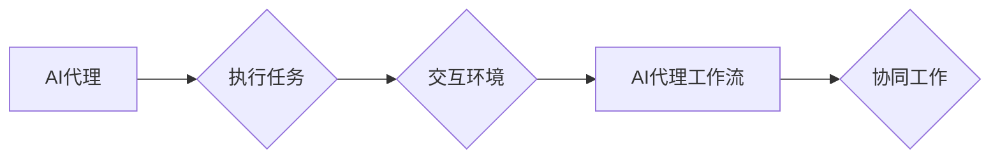

# AI人工智能代理工作流AI Agent WorkFlow：面向未来的AI代理与工作流研究方向

作者：禅与计算机程序设计艺术 / Zen and the Art of Computer Programming

## 1. 背景介绍
### 1.1 问题的由来

随着人工智能技术的飞速发展，AI代理（AI Agents）作为人工智能的一种重要应用形式，正逐渐走进人们的日常生活和工作。AI代理能够模拟人类智能，自动执行任务，提高工作效率，降低人力成本。然而，随着AI代理数量的增加和复杂性的提升，如何高效地管理和调度AI代理，实现协同工作，成为了一个亟待解决的问题。AI代理工作流（AI Agent WorkFlow）应运而生。

### 1.2 研究现状

近年来，国内外学者对AI代理工作流的研究取得了显著进展，主要集中在以下几个方面：

1. **AI代理模型研究**：针对不同的应用场景，研究人员提出了多种AI代理模型，如基于规则、基于案例、基于行为、基于决策树等。
2. **工作流管理研究**：研究如何设计、调度、监控和优化AI代理工作流，包括工作流建模、工作流执行引擎、工作流优化算法等。
3. **AI代理协同研究**：研究如何使AI代理之间能够有效地协同工作，包括通信机制、协调策略、冲突解决等。
4. **AI代理伦理与安全研究**：研究AI代理的伦理问题，如隐私保护、数据安全、责任归属等，以及如何确保AI代理的安全可靠。

### 1.3 研究意义

AI代理工作流的研究具有重要的理论意义和实际应用价值：

1. **理论意义**：推动人工智能理论的发展，丰富人工智能应用领域。
2. **实际应用价值**：提高工作效率，降低人力成本，促进产业升级，创造新的经济增长点。

### 1.4 本文结构

本文将围绕AI代理工作流展开，首先介绍AI代理工作流的核心概念和联系，然后分析其核心算法原理和具体操作步骤，接着介绍数学模型和公式，并通过项目实践进行详细解释说明。最后，探讨AI代理工作流在实际应用场景中的案例，展望未来发展趋势和挑战。

## 2. 核心概念与联系

### 2.1 AI代理

AI代理是指能够模拟人类智能，自动执行任务，并与外部环境交互的实体。AI代理通常具有以下特点：

1. **自主性**：能够根据自身目标和环境信息，自主地做出决策。
2. **适应性**：能够根据环境变化，调整自身行为策略。
3. **协作性**：能够与其他AI代理协同工作，完成复杂任务。

### 2.2 工作流

工作流是指一组按照特定顺序执行的任务序列。工作流可以用于描述业务流程、生产流程、办公流程等。

### 2.3 AI代理工作流

AI代理工作流是指由AI代理组成的工作流，其中AI代理按照一定的规则和策略协同工作，共同完成一个复杂任务。

它们之间的逻辑关系如下图所示：



## 3. 核心算法原理 & 具体操作步骤
### 3.1 算法原理概述

AI代理工作流的核心算法包括以下几部分：

1. **AI代理模型选择**：根据任务需求，选择合适的AI代理模型。
2. **工作流设计**：设计符合任务需求的工作流，包括任务分解、任务分配、任务调度等。
3. **AI代理协同策略**：设计AI代理之间的协同策略，包括通信机制、协调策略、冲突解决等。
4. **工作流监控与优化**：监控工作流执行过程，并根据执行结果进行优化。

### 3.2 算法步骤详解

AI代理工作流的算法步骤如下：

**Step 1: AI代理模型选择**

根据任务需求，选择合适的AI代理模型。常见的AI代理模型包括：

1. **基于规则的AI代理**：使用规则库来描述任务规则，并根据规则进行决策。
2. **基于案例的AI代理**：根据历史案例进行推理和决策。
3. **基于行为的AI代理**：根据自身行为和环境反馈进行决策。
4. **基于决策树的AI代理**：使用决策树进行决策。

**Step 2: 工作流设计**

设计符合任务需求的工作流，包括以下步骤：

1. **任务分解**：将复杂任务分解为若干个子任务。
2. **任务分配**：根据AI代理的能力和资源，将子任务分配给相应的AI代理。
3. **任务调度**：根据任务依赖关系和时间约束，调度AI代理执行任务。

**Step 3: AI代理协同策略**

设计AI代理之间的协同策略，包括以下方面：

1. **通信机制**：设计AI代理之间的通信机制，包括消息传递格式、协议等。
2. **协调策略**：设计AI代理之间的协调策略，如协商、竞争、合作等。
3. **冲突解决**：设计冲突解决策略，如优先级调度、回退策略等。

**Step 4: 工作流监控与优化**

监控工作流执行过程，并根据执行结果进行优化，包括以下方面：

1. **性能监控**：监控工作流执行时间、资源消耗等指标。
2. **错误处理**：处理工作流执行过程中出现的错误。
3. **优化策略**：根据监控结果，调整工作流设计、AI代理协同策略等。

### 3.3 算法优缺点

AI代理工作流的优点：

1. **高效性**：通过AI代理协同工作，提高工作效率。
2. **灵活性**：可以根据任务需求动态调整工作流设计。
3. **鲁棒性**：能够应对环境变化和故障。

AI代理工作流的缺点：

1. **复杂性**：工作流设计、AI代理协同策略等较为复杂。
2. **可扩展性**：随着AI代理数量的增加，系统可扩展性成为挑战。
3. **安全性**：需要确保AI代理之间的通信和协作安全可靠。

### 3.4 算法应用领域

AI代理工作流可以应用于以下领域：

1. **智能制造**：自动化生产线管理、设备维护等。
2. **智慧交通**：交通流量控制、智能驾驶等。
3. **智慧城市**：城市管理、公共安全等。
4. **金融行业**：风险管理、欺诈检测等。
5. **医疗健康**：医疗诊断、健康管理等。

## 4. 数学模型和公式 & 详细讲解 & 举例说明
### 4.1 数学模型构建

AI代理工作流的数学模型主要包括以下部分：

1. **AI代理模型**：使用数学模型描述AI代理的行为和决策。
2. **工作流模型**：使用数学模型描述工作流的设计和执行过程。
3. **协同模型**：使用数学模型描述AI代理之间的协同策略。

### 4.2 公式推导过程

以下以基于规则的AI代理模型为例，介绍其数学模型的推导过程。

假设AI代理的规则库包含以下规则：

1. 如果A且B，则C。
2. 如果D或E，则F。

可以使用以下公式表示：

$$
\begin{align*}
R_1: & \quad A \land B \rightarrow C \
R_2: & \quad D \lor E \rightarrow F \
\end{align*}
$$

其中，$\land$ 表示逻辑与，$\lor$ 表示逻辑或，$\rightarrow$ 表示逻辑蕴含。

### 4.3 案例分析与讲解

以下以智能制造场景为例，分析AI代理工作流的案例。

**场景**：自动化生产线管理

**任务**：监控生产线设备状态，自动修复故障设备。

**AI代理**：

* **设备监控代理**：负责收集设备状态数据，并将其发送给调度中心。
* **故障检测代理**：负责分析设备状态数据，判断设备是否发生故障。
* **维修代理**：负责修复故障设备。

**工作流**：

1. 设备监控代理收集设备状态数据。
2. 故障检测代理分析设备状态数据，判断设备是否发生故障。
3. 如果设备发生故障，则通知维修代理进行维修。
4. 维修代理根据故障类型和维修策略，修复故障设备。

### 4.4 常见问题解答

**Q1：AI代理工作流如何保证任务的正确执行？**

A：通过以下措施保证任务的正确执行：

1. **任务分解**：将复杂任务分解为若干个子任务，降低任务执行难度。
2. **任务调度**：根据任务依赖关系和时间约束，合理调度任务执行。
3. **异常处理**：设置异常处理机制，处理任务执行过程中出现的错误。

**Q2：如何保证AI代理之间的协同效果？**

A：通过以下措施保证AI代理之间的协同效果：

1. **通信机制**：设计高效的通信机制，确保AI代理之间能够及时、准确地交换信息。
2. **协调策略**：设计合理的协调策略，解决AI代理之间的冲突和竞争。
3. **激励机制**：设置激励机制，鼓励AI代理高效协作。

## 5. 项目实践：代码实例和详细解释说明
### 5.1 开发环境搭建

以下是使用Python进行AI代理工作流开发的环境配置流程：

1. 安装Anaconda：从官网下载并安装Anaconda，用于创建独立的Python环境。
2. 创建并激活虚拟环境：
```bash
conda create -n ai-agent-env python=3.8
conda activate ai-agent-env
```
3. 安装Python库：
```bash
conda install numpy pandas scikit-learn matplotlib seaborn
pip install flask
```

### 5.2 源代码详细实现

以下是一个简单的AI代理工作流示例代码：

```python
from flask import Flask, request, jsonify

app = Flask(__name__)

# 设备监控代理
@app.route('/monitor', methods=['GET'])
def monitor():
    # 获取设备状态数据
    device_status = get_device_status()
    # 将设备状态数据发送给调度中心
    send_to_scheduler(device_status)
    return jsonify({'status': 'success'})

# 故障检测代理
@app.route('/detect', methods=['POST'])
def detect():
    # 获取设备状态数据
    device_status = request.json
    # 分析设备状态数据，判断是否发生故障
    if is_faulty(device_status):
        # 发送故障信息给维修代理
        send_to_repair(device_status)
    return jsonify({'status': 'success'})

# 维修代理
@app.route('/repair', methods=['POST'])
def repair():
    # 获取故障信息
    fault_info = request.json
    # 根据故障类型和维修策略，修复故障设备
    repair_fault(fault_info)
    return jsonify({'status': 'success'})

if __name__ == '__main__':
    app.run(debug=True)
```

### 5.3 代码解读与分析

以上代码展示了如何使用Flask框架构建一个简单的AI代理工作流系统。

1. **设备监控代理**：通过`/monitor`接口收集设备状态数据，并将其发送给调度中心。
2. **故障检测代理**：通过`/detect`接口接收设备状态数据，分析数据并判断是否发生故障。如果发生故障，则通过`/repair`接口通知维修代理进行维修。
3. **维修代理**：通过`/repair`接口接收故障信息，并根据故障类型和维修策略，修复故障设备。

### 5.4 运行结果展示

启动Flask应用后，可以通过以下命令访问各个接口：

```bash
curl -X GET http://127.0.0.1:5000/monitor
curl -X POST -H "Content-Type: application/json" -d '{"device_id": "001", "status": "normal"}' http://127.0.0.1:5000/detect
curl -X POST -H "Content-Type: application/json" -d '{"device_id": "001", "fault_type": "overheating"}' http://127.0.0.1:5000/repair
```

以上代码展示了如何使用Flask框架构建一个简单的AI代理工作流系统。在实际应用中，可以根据具体需求进行扩展和优化。

## 6. 实际应用场景
### 6.1 智能制造

在智能制造领域，AI代理工作流可以应用于以下几个方面：

1. **自动化生产线管理**：监控生产线设备状态，自动修复故障设备，提高生产效率和产品质量。
2. **设备预测性维护**：根据设备运行数据，预测设备故障，提前进行维护，避免意外停机。
3. **生产计划优化**：根据生产订单和设备状态，自动生成生产计划，提高生产效率。

### 6.2 智慧交通

在智慧交通领域，AI代理工作流可以应用于以下几个方面：

1. **交通流量控制**：根据实时交通数据，自动调整交通信号灯，提高道路通行效率。
2. **智能驾驶**：辅助驾驶员进行驾驶决策，提高驾驶安全性和舒适性。
3. **交通事故处理**：自动检测交通事故，并派遣救援车辆。

### 6.3 智慧城市

在智慧城市领域，AI代理工作流可以应用于以下几个方面：

1. **城市管理**：自动收集城市运行数据，监测城市运行状态，及时发现和解决问题。
2. **公共安全**：自动识别异常事件，及时预警，提高公共安全水平。
3. **环境监测**：自动监测环境质量，及时处理环境污染问题。

### 6.4 未来应用展望

随着人工智能技术的不断发展，AI代理工作流将在更多领域得到应用，为人类社会创造更多价值：

1. **智慧农业**：智能灌溉、病虫害防治、产量预测等。
2. **智慧医疗**：智能诊断、药物研发、健康管理等。
3. **智慧金融**：风险评估、欺诈检测、智能投顾等。

## 7. 工具和资源推荐
### 7.1 学习资源推荐

以下是一些关于AI代理工作流的学习资源：

1. 《人工智能：一种现代的方法》（Artificial Intelligence: A Modern Approach）- Stuart Russell & Peter Norvig
2. 《深度学习》（Deep Learning）- Ian Goodfellow、Yoshua Bengio & Aaron Courville
3. 《Python编程：从入门到实践》（Python Crash Course）- Eric Matthes
4. 《Flask Web开发：轻量级Python Web应用框架》（Flask Web Development: A Python Web Application Framework）- Miguel Grinberg
5. 《人工智能代理：理论、方法与应用》（Artificial Intelligence Agents: Theory, Methods, and Applications）- Yoav Shoham & Kevin Leyton-Brown

### 7.2 开发工具推荐

以下是一些关于AI代理工作流开发的工具：

1. **编程语言**：Python、Java、C++等
2. **框架**：Flask、Django、Spring Boot等
3. **库**：NumPy、Pandas、Scikit-learn、TensorFlow、PyTorch等

### 7.3 相关论文推荐

以下是一些关于AI代理工作流的相关论文：

1. **"The Art of Multiprocessor Programming" by Maurice Herlihy and Nir Shavit**
2. **"Distributed Algorithms" by Nancy A. Lynch**
3. **"Introduction to Algorithms" by Thomas H. Cormen, Charles E. Leiserson, Ronald L. Rivest, and Clifford Stein**
4. **"Artificial Intelligence: A Modern Approach" by Stuart Russell and Peter Norvig**
5. **"Artificial Intelligence: Engineering the Future" by Sami Benbouchta and Fethi Rabhi**

### 7.4 其他资源推荐

以下是一些关于AI代理工作流的在线资源：

1. **AI Agent WorkFlow GitHub项目**：https://github.com/agentflow/agentflow
2. **AI Agent Workshop**：https://www.aiauthoring.org/workshops/agent-workshop/
3. **AAAI Agent Based and Multi-Agent Systems Track**：https://www.aaai.org/Conferences/AAAI/aaai21/track-ABMAS

## 8. 总结：未来发展趋势与挑战
### 8.1 研究成果总结

本文对AI代理工作流进行了全面系统的介绍，包括核心概念、算法原理、实际应用场景等。通过分析AI代理工作流的优势和挑战，展望了其未来发展趋势。

### 8.2 未来发展趋势

未来，AI代理工作流将呈现出以下发展趋势：

1. **多智能体协同**：AI代理将更加注重协同工作，共同完成复杂任务。
2. **自主学习和适应**：AI代理将具备更强的自主学习和适应能力，能够根据环境变化进行调整。
3. **泛化能力提升**：AI代理将具备更强的泛化能力，能够应用于更多领域和场景。
4. **人机协同**：AI代理将更加注重与人类用户的协同，为用户提供更好的服务体验。

### 8.3 面临的挑战

AI代理工作流在发展过程中也面临着以下挑战：

1. **算法复杂性**：随着AI代理数量的增加和任务的复杂性提升，算法设计将更加复杂。
2. **数据安全**：AI代理在处理敏感数据时，需要确保数据安全。
3. **伦理和道德**：AI代理的决策和行为需要符合伦理和道德规范。
4. **可解释性**：AI代理的决策过程需要具备可解释性，以便用户理解和信任。

### 8.4 研究展望

未来，AI代理工作流的研究需要关注以下方面：

1. **多智能体协同算法**：研究如何设计高效、稳定的协同算法，使AI代理能够更好地协同工作。
2. **自主学习和适应机制**：研究如何使AI代理具备更强的自主学习和适应能力，能够适应复杂多变的环境。
3. **泛化能力提升**：研究如何提高AI代理的泛化能力，使其能够应用于更多领域和场景。
4. **人机协同**：研究如何设计人机协同机制，使AI代理能够更好地为人类用户服务。
5. **伦理和道德规范**：研究如何制定AI代理的伦理和道德规范，确保其决策和行为符合人类价值观。

通过不断探索和创新，AI代理工作流将在未来发挥越来越重要的作用，为人类社会创造更多价值。

## 9. 附录：常见问题与解答

**Q1：AI代理工作流与传统工作流有什么区别？**

A：AI代理工作流与传统工作流的主要区别在于：

1. **智能化程度**：AI代理工作流具备更强的智能化程度，能够自动执行任务，而传统工作流则需要人工干预。
2. **灵活性**：AI代理工作流可以根据任务需求动态调整工作流设计，而传统工作流则相对固定。
3. **效率**：AI代理工作流能够提高工作效率，降低人力成本，而传统工作流则效率较低。

**Q2：如何设计高效的AI代理工作流？**

A：设计高效的AI代理工作流需要考虑以下因素：

1. **任务需求**：根据任务需求，选择合适的AI代理模型和工作流设计方法。
2. **数据**：收集和整理高质量的数据，为AI代理提供有效的训练数据。
3. **算法**：选择合适的算法，提高AI代理的决策能力和执行效率。
4. **系统架构**：设计合理的系统架构，提高系统的可扩展性和可维护性。

**Q3：如何保证AI代理工作流的安全性？**

A：为了保证AI代理工作流的安全性，需要采取以下措施：

1. **数据安全**：确保数据在采集、存储、传输和处理过程中安全可靠。
2. **访问控制**：设置访问控制机制，防止未授权访问。
3. **审计日志**：记录AI代理工作流的执行过程，方便问题追踪和审计。
4. **安全检测**：定期进行安全检测，及时发现和修复安全漏洞。

**Q4：如何评估AI代理工作流的效果？**

A：评估AI代理工作流的效果可以从以下方面进行：

1. **效率**：评估AI代理工作流的执行效率，包括执行时间、资源消耗等。
2. **准确性**：评估AI代理工作流的决策准确率。
3. **稳定性**：评估AI代理工作流的稳定性和可靠性。
4. **用户体验**：评估AI代理工作流为用户提供的服务质量。

作者：禅与计算机程序设计艺术 / Zen and the Art of Computer Programming