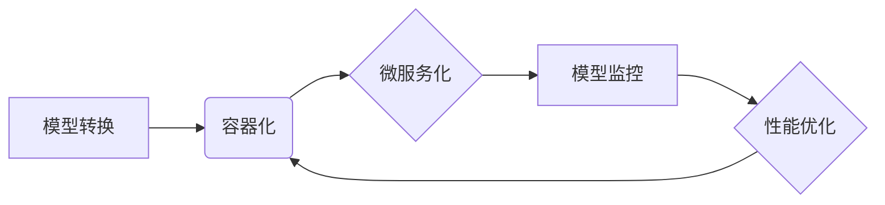

# AI人工智能核心算法原理与代码实例讲解：模型部署

> 关键词：AI模型部署，深度学习，模型转换，容器化，微服务，模型监控，性能优化

## 1. 背景介绍

随着深度学习技术的快速发展，越来越多的AI模型被开发出来并应用于实际场景。然而，将模型从开发环境迁移到生产环境，进行有效的部署和运行，却是一个复杂且充满挑战的过程。本文将深入探讨AI模型部署的核心算法原理，并结合实际案例进行讲解，帮助读者理解并掌握模型部署的各个环节。

### 1.1 问题的由来

AI模型部署面临着诸多挑战，主要包括：

- **模型转换**：将深度学习框架训练得到的模型转换为可部署的格式。
- **容器化**：将模型和依赖库打包成容器，方便在不同环境中运行。
- **微服务化**：将模型服务化，实现分布式部署和弹性扩展。
- **模型监控**：实时监控模型运行状态，保证模型稳定可靠。
- **性能优化**：提升模型推理速度和效率，降低资源消耗。

### 1.2 研究现状

目前，AI模型部署技术已经取得了显著的进展。业界出现了许多成熟的工具和平台，如TensorFlow Serving、ONNX Runtime、Kubeflow等，可以方便地实现模型的部署和运行。

### 1.3 研究意义

掌握AI模型部署技术对于AI工程师来说至关重要。它可以帮助工程师：

- 将AI模型应用到实际场景，实现业务价值。
- 提升模型性能，降低资源消耗。
- 保证模型稳定可靠，提高系统可用性。

### 1.4 本文结构

本文将按照以下结构进行讲解：

- **第2章**：介绍AI模型部署的核心概念和流程。
- **第3章**：深入探讨模型转换、容器化、微服务化等核心技术。
- **第4章**：讲解模型监控和性能优化方法。
- **第5章**：通过实际案例展示模型部署的过程。
- **第6章**：展望AI模型部署的未来发展趋势和挑战。
- **第7章**：推荐相关学习资源、开发工具和参考文献。
- **第8章**：总结全文，并展望未来发展趋势与挑战。

## 2. 核心概念与联系

在深入探讨模型部署技术之前，我们先来了解一些核心概念。

- **模型转换**：将训练好的模型从一种格式转换为另一种格式的过程。常见的模型格式包括ONNX、TensorFlow SavedModel、PyTorch Model等。
- **容器化**：将应用程序及其依赖库打包成一个容器，以便在隔离的环境中运行。
- **微服务化**：将应用程序分解为多个独立的微服务，每个微服务负责特定的功能。
- **模型监控**：实时监控模型运行状态，包括推理速度、准确率、资源消耗等指标。
- **性能优化**：通过调整模型结构、优化代码、提高硬件性能等手段，提升模型推理速度和效率。

这些概念之间的关系可以用以下Mermaid流程图表示：



## 3. 核心算法原理 & 具体操作步骤

### 3.1 算法原理概述

AI模型部署的核心算法主要包括以下几步：

1. **模型转换**：将训练好的模型转换为可部署的格式。
2. **容器化**：将模型和依赖库打包成容器。
3. **微服务化**：将容器部署到服务器上，实现分布式部署。
4. **模型监控**：实时监控模型运行状态。
5. **性能优化**：根据监控结果，对模型和系统进行优化。

### 3.2 算法步骤详解

#### 3.2.1 模型转换

模型转换的主要步骤如下：

1. **选择模型格式**：根据实际需求选择合适的模型格式。
2. **转换工具**：使用转换工具将模型从一种格式转换为另一种格式。
3. **测试模型**：确保转换后的模型能够正常运行。

#### 3.2.2 容器化

容器化的主要步骤如下：

1. **编写Dockerfile**：定义容器镜像的构建过程。
2. **构建容器镜像**：使用Dockerfile构建容器镜像。
3. **部署容器**：将容器部署到服务器上。

#### 3.2.3 微服务化

微服务化的主要步骤如下：

1. **定义微服务**：将应用程序分解为多个独立的微服务。
2. **编写微服务接口**：定义微服务之间的接口。
3. **部署微服务**：将微服务部署到服务器上。

#### 3.2.4 模型监控

模型监控的主要步骤如下：

1. **选择监控工具**：选择合适的监控工具。
2. **监控指标**：定义需要监控的指标，如推理速度、准确率、资源消耗等。
3. **数据收集**：收集监控数据。
4. **数据分析**：分析监控数据，发现潜在问题。

#### 3.2.5 性能优化

性能优化的主要步骤如下：

1. **分析瓶颈**：分析模型推理过程中的瓶颈。
2. **优化模型**：通过调整模型结构、优化代码等手段，提升模型性能。
3. **优化硬件**：升级硬件设备，提升系统性能。

### 3.3 算法优缺点

- **模型转换**：
  - 优点：方便模型在不同的深度学习框架之间迁移。
  - 缺点：转换过程可能需要较长的计算时间。
- **容器化**：
  - 优点：方便模型在不同环境中运行。
  - 缺点：需要学习容器技术。
- **微服务化**：
  - 优点：提高系统可扩展性和可维护性。
  - 缺点：系统复杂度增加。
- **模型监控**：
  - 优点：实时监控模型运行状态。
  - 缺点：需要部署监控系统。
- **性能优化**：
  - 优点：提升模型性能。
  - 缺点：需要花费时间进行性能分析和优化。

### 3.4 算法应用领域

AI模型部署技术可以应用于以下领域：

- **金融**：例如，用于风险评估、欺诈检测、信用评分等。
- **医疗**：例如，用于疾病诊断、药物发现、健康管理等。
- **零售**：例如，用于商品推荐、价格优化、库存管理等。
- **交通**：例如，用于自动驾驶、交通流量预测、路线规划等。

## 4. 数学模型和公式 & 详细讲解 & 举例说明

### 4.1 数学模型构建

AI模型部署过程中涉及到一些数学模型，例如：

- **交叉熵损失函数**：用于分类任务，衡量模型预测结果与真实标签之间的差异。
- **均方误差损失函数**：用于回归任务，衡量模型预测结果与真实值之间的差异。
- **梯度下降**：一种优化算法，用于求解最优化问题。

### 4.2 公式推导过程

以下以交叉熵损失函数为例，介绍其公式推导过程。

假设有一个分类问题，共有 $C$ 个类别，模型预测的概率分布为 $\hat{y} = (y_1, y_2, ..., y_C)$，其中 $y_i$ 表示模型预测样本属于第 $i$ 个类别的概率。真实标签为 $y = (y_1, y_2, ..., y_C)$，其中 $y_i$ 为1表示样本属于第 $i$ 个类别，为0表示不属于。

交叉熵损失函数定义为：

$$
L(\hat{y}, y) = -\sum_{i=1}^C y_i \log y_i
$$

### 4.3 案例分析与讲解

以下以一个简单的分类问题为例，演示如何使用PyTorch实现模型训练和推理。

```python
import torch
import torch.nn as nn
import torch.optim as optim

# 定义模型
class SimpleModel(nn.Module):
    def __init__(self):
        super(SimpleModel, self).__init__()
        self.fc = nn.Linear(10, 2)

    def forward(self, x):
        return self.fc(x)

# 创建模型、损失函数和优化器
model = SimpleModel()
criterion = nn.CrossEntropyLoss()
optimizer = optim.SGD(model.parameters(), lr=0.01)

# 模拟训练数据
x_train = torch.randn(100, 10)
y_train = torch.randint(0, 2, (100,))
x_val = torch.randn(10, 10)
y_val = torch.randint(0, 2, (10,))

# 训练模型
for epoch in range(10):
    optimizer.zero_grad()
    output = model(x_train)
    loss = criterion(output, y_train)
    loss.backward()
    optimizer.step()

    # 评估模型
    output = model(x_val)
    val_loss = criterion(output, y_val)
    print(f"Epoch {epoch+1}, train_loss: {loss.item()}, val_loss: {val_loss.item()}")

# 推理
x_test = torch.randn(10, 10)
output = model(x_test)
print(f"Predicted class: {output.argmax(dim=1)}")
```

### 4.4 常见问题解答

**Q1：什么是交叉熵损失函数？**

A：交叉熵损失函数是一种衡量概率分布之间差异的指标，常用于分类任务。其公式为：

$$
L(\hat{y}, y) = -\sum_{i=1}^C y_i \log y_i
$$

其中 $\hat{y}$ 表示模型预测的概率分布，$y$ 表示真实标签。

**Q2：什么是梯度下降？**

A：梯度下降是一种优化算法，用于求解最优化问题。其核心思想是沿着目标函数的梯度方向进行迭代，逐步逼近最优解。

**Q3：什么是容器化？**

A：容器化是一种将应用程序及其依赖库打包成一个容器，以便在隔离的环境中运行的技术。常见的容器技术包括Docker和Kubernetes。

## 5. 项目实践：代码实例和详细解释说明

### 5.1 开发环境搭建

为了进行AI模型部署实践，我们需要搭建以下开发环境：

- Python 3.8及以上版本
- PyTorch 1.8及以上版本
- Docker 19.03及以上版本
- Kubernetes 1.18及以上版本

### 5.2 源代码详细实现

以下是一个简单的AI模型部署项目示例，使用Docker和Kubernetes进行模型部署。

```Dockerfile
# Dockerfile
FROM pytorch/pytorch:1.8-cpu
RUN pip install torch torchvision torchaudio
COPY ./app /app
CMD ["python", "/app/app.py"]
```

```yaml
# k8s-deployment.yaml
apiVersion: apps/v1
kind: Deployment
metadata:
  name: my-model
spec:
  replicas: 2
  selector:
    matchLabels:
      app: my-model
  template:
    metadata:
      labels:
        app: my-model
    spec:
      containers:
      - name: my-model
        image: my-model:latest
        ports:
        - containerPort: 8080
```

### 5.3 代码解读与分析

**Dockerfile**：

- `FROM pytorch/pytorch:1.8-cpu`：指定基础镜像为PyTorch官方的CPU版本。
- `RUN pip install ...`：安装PyTorch依赖库。
- `COPY ./app /app`：将应用程序代码复制到容器中。
- `CMD ["python", "/app/app.py"]`：指定容器启动命令。

**k8s-deployment.yaml**：

- `apiVersion: apps/v1`：指定API版本。
- `kind: Deployment`：指定资源类型为Deployment。
- `metadata`：定义资源的元数据，如名称、标签等。
- `spec`：定义资源规格，包括副本数量、选择器、模板等。
- `template`：定义Pod模板，包括标签、容器定义等。
- `containers`：定义容器配置，包括名称、镜像、端口等。

### 5.4 运行结果展示

1. 构建Docker镜像：

```bash
docker build -t my-model:latest .
```

2. 部署Kubernetes Deployment：

```bash
kubectl apply -f k8s-deployment.yaml
```

3. 访问模型服务：

```bash
curl http://<model-service-name>:8080
```

## 6. 实际应用场景

AI模型部署技术可以应用于以下实际应用场景：

- **智能问答系统**：将模型部署到服务器，实现7x24小时不间断的智能问答服务。
- **图像识别系统**：将模型部署到边缘设备，实现实时图像识别功能。
- **自动驾驶系统**：将模型部署到车辆，实现自动驾驶功能。
- **语音识别系统**：将模型部署到手机或电脑，实现语音识别功能。

## 7. 工具和资源推荐

### 7.1 学习资源推荐

- **书籍**：
  - 《深度学习》
  - 《动手学深度学习》
  - 《PyTorch深度学习实战》
- **在线课程**：
  - fast.ai课程
  - Udacity深度学习纳米学位
  - Coursera深度学习课程
- **技术博客**：
  - PyTorch官方博客
  - TensorFlow官方博客
  - Hugging Face博客

### 7.2 开发工具推荐

- **深度学习框架**：
  - PyTorch
  - TensorFlow
  - Keras
- **模型转换工具**：
  - ONNX Runtime
  - TensorRT
  - Core ML
- **容器技术**：
  - Docker
  - Kubernetes

### 7.3 相关论文推荐

- **模型转换**：
  - ONNX: Open Neural Network Exchange
  - ONNX Runtime: ONNX Runtime: An Open Source Framework for High-Performance Neural Network Execution
- **容器化**：
  - Docker: Docker: Build and Ship Any Application, Anywhere
  - Kubernetes: Kubernetes: Production-Grade Container Orchestration
- **微服务化**：
  - Microservices: A Lightweight Approach to Building Modular Software

### 7.4 其他资源推荐

- **开源社区**：
  - GitHub
  - Stack Overflow
  - Reddit
- **技术论坛**：
  - CSDN
  - 知乎
  - 简书

## 8. 总结：未来发展趋势与挑战

### 8.1 研究成果总结

本文深入探讨了AI模型部署的核心算法原理和具体操作步骤，并结合实际案例进行了讲解。通过对模型转换、容器化、微服务化、模型监控和性能优化等关键环节的分析，读者可以全面了解AI模型部署的流程和技术细节。

### 8.2 未来发展趋势

未来，AI模型部署技术将呈现以下发展趋势：

- **自动化**：自动化工具将简化模型部署流程，降低部署门槛。
- **容器化**：容器化技术将得到更广泛的应用，实现模型的跨平台部署。
- **微服务化**：微服务化技术将推动AI模型服务的快速迭代和扩展。
- **模型监控**：模型监控技术将更加成熟，实现模型的实时监控和故障诊断。
- **性能优化**：性能优化技术将不断提升模型推理速度和效率。

### 8.3 面临的挑战

尽管AI模型部署技术取得了显著进展，但仍面临着以下挑战：

- **模型可解释性**：如何提高模型的可解释性，让用户理解模型的决策过程。
- **模型安全**：如何保证模型安全，防止模型被恶意攻击或滥用。
- **数据隐私**：如何保护用户数据隐私，防止数据泄露。

### 8.4 研究展望

未来，AI模型部署技术的研究将重点关注以下方向：

- **模型压缩**：通过模型压缩技术，减小模型尺寸，降低资源消耗。
- **模型推理加速**：通过模型推理加速技术，提升模型推理速度和效率。
- **模型安全**：通过模型安全技术，提高模型的安全性和可靠性。
- **数据隐私**：通过数据隐私技术，保护用户数据隐私。

相信在学术界和工业界的共同努力下，AI模型部署技术将不断进步，为人工智能技术的应用和发展提供强有力的支撑。

## 9. 附录：常见问题与解答

**Q1：什么是模型转换**？

A：模型转换是将训练好的模型从一种格式转换为另一种格式的过程。常见的模型格式包括ONNX、TensorFlow SavedModel、PyTorch Model等。

**Q2：什么是容器化**？

A：容器化是一种将应用程序及其依赖库打包成一个容器，以便在隔离的环境中运行的技术。常见的容器技术包括Docker和Kubernetes。

**Q3：什么是微服务化**？

A：微服务化是将应用程序分解为多个独立的微服务，每个微服务负责特定的功能。

**Q4：什么是模型监控**？

A：模型监控是实时监控模型运行状态，包括推理速度、准确率、资源消耗等指标。

**Q5：什么是性能优化**？

A：性能优化是通过调整模型结构、优化代码等手段，提升模型推理速度和效率。

**Q6：如何选择合适的模型格式**？

A：选择合适的模型格式需要考虑以下因素：

- **兼容性**：选择与深度学习框架兼容的模型格式。
- **性能**：选择性能较好的模型格式。
- **易用性**：选择易用的模型格式。

**Q7：如何选择合适的容器技术**？

A：选择合适的容器技术需要考虑以下因素：

- **可扩展性**：选择可扩展性较好的容器技术。
- **易用性**：选择易用的容器技术。
- **社区生态**：选择社区生态较好的容器技术。

**Q8：如何选择合适的模型监控工具**？

A：选择合适的模型监控工具需要考虑以下因素：

- **功能**：选择功能齐全的模型监控工具。
- **可扩展性**：选择可扩展性较好的模型监控工具。
- **易用性**：选择易用的模型监控工具。

**Q9：如何选择合适的性能优化方法**？

A：选择合适的性能优化方法需要考虑以下因素：

- **模型类型**：针对不同类型的模型，选择合适的性能优化方法。
- **硬件环境**：针对不同的硬件环境，选择合适的性能优化方法。
- **应用场景**：针对不同的应用场景，选择合适的性能优化方法。

**Q10：如何保证模型安全**？

A：保证模型安全需要考虑以下因素：

- **数据安全**：保护用户数据安全，防止数据泄露。
- **模型安全**：防止模型被恶意攻击或滥用。
- **隐私保护**：保护用户隐私，防止用户隐私泄露。

作者：禅与计算机程序设计艺术 / Zen and the Art of Computer Programming