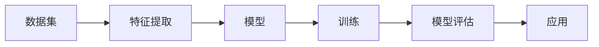

# AI开发框架原理与代码实战案例讲解

作者：禅与计算机程序设计艺术 / Zen and the Art of Computer Programming

## 1. 背景介绍
### 1.1 问题的由来

随着人工智能技术的快速发展，越来越多的企业和研究机构开始关注AI技术的应用。然而，对于非专业人员而言，AI技术的开发和应用存在一定的门槛。为了降低AI开发的门槛，提高开发效率，AI开发框架应运而生。本文将深入探讨AI开发框架的原理，并通过实战案例讲解如何使用这些框架进行AI开发。

### 1.2 研究现状

目前，国内外已经涌现出许多优秀的AI开发框架，如TensorFlow、PyTorch、Keras等。这些框架提供了丰富的API和工具，帮助开发者快速构建和训练AI模型。本文将重点介绍TensorFlow和PyTorch这两个最受欢迎的框架。

### 1.3 研究意义

本文旨在帮助读者：
1. 理解AI开发框架的基本原理和架构；
2. 掌握TensorFlow和PyTorch的使用方法；
3. 通过实战案例学习如何使用AI框架进行模型训练和部署。

### 1.4 本文结构

本文将分为以下几个部分：
- 第2部分：介绍AI开发框架的核心概念和联系；
- 第3部分：深入讲解TensorFlow和PyTorch的原理和操作步骤；
- 第4部分：通过实际案例讲解如何使用AI框架进行模型训练和部署；
- 第5部分：探讨AI开发框架在实际应用场景中的应用；
- 第6部分：展望AI开发框架的未来发展趋势与挑战；
- 第7部分：推荐学习资源、开发工具和参考文献；
- 第8部分：总结全文，展望AI技术发展。

## 2. 核心概念与联系

在介绍AI开发框架之前，我们需要了解以下几个核心概念：

- **深度学习（Deep Learning）**：一种模拟人脑神经网络结构的计算模型，通过学习大量数据，自动从数据中提取特征和模式。
- **神经网络（Neural Network）**：一种由大量神经元组成的计算模型，通过学习数据，自动从数据中提取特征和模式。
- **数据集（Dataset）**：包含大量样本和标签的集合，用于训练和评估AI模型。
- **模型（Model）**：由一组参数构成的函数，用于将输入数据映射到输出结果。
- **训练（Training）**：通过学习数据，调整模型参数，使模型在特定任务上取得更好的性能。
- **评估（Evaluation）**：通过测试数据，评估模型在特定任务上的性能。

这些概念之间的关系可以用以下图示表示：



- 数据集用于训练和评估模型；
- 特征提取是从数据中提取有用信息的过程；
- 模型是将输入数据映射到输出结果的函数；
- 训练是通过学习数据调整模型参数的过程；
- 模型评估是评估模型在特定任务上的性能；
- 应用是将模型应用于实际问题的过程。

AI开发框架正是为了方便开发者进行数据预处理、模型训练、模型评估和模型应用而设计的。

## 3. 核心算法原理 & 具体操作步骤
### 3.1 算法原理概述

AI开发框架的核心原理是深度学习，主要包括以下步骤：

1. **数据预处理**：将原始数据转换为适合模型训练的格式。
2. **模型构建**：使用框架提供的API构建神经网络模型。
3. **模型训练**：使用训练数据调整模型参数，使模型在特定任务上取得更好的性能。
4. **模型评估**：使用测试数据评估模型在特定任务上的性能。
5. **模型应用**：将训练好的模型应用于实际问题的解决。

### 3.2 算法步骤详解

以下是使用TensorFlow框架进行模型训练的基本步骤：

1. **导入TensorFlow库**：
```python
import tensorflow as tf
```
2. **定义模型**：
```python
model = tf.keras.Sequential([
    tf.keras.layers.Dense(128, activation='relu', input_shape=[input_dim]),
    tf.keras.layers.Dense(64, activation='relu'),
    tf.keras.layers.Dense(num_classes, activation='softmax')
])
```
3. **编译模型**：
```python
model.compile(optimizer='adam',
              loss='sparse_categorical_crossentropy',
              metrics=['accuracy'])
```
4. **训练模型**：
```python
model.fit(train_images, train_labels, epochs=5)
```
5. **评估模型**：
```python
test_loss, test_acc = model.evaluate(test_images,  test_labels, verbose=2)
```
6. **使用模型进行预测**：
```python
predictions = model.predict(test_images)
```

### 3.3 算法优缺点

AI开发框架具有以下优点：

- **易用性**：框架提供了丰富的API和工具，方便开发者快速构建和训练模型。
- **灵活性**：框架支持多种神经网络结构，满足不同任务的需求。
- **可扩展性**：框架支持自定义层和模型，满足开发者个性化需求。

然而，AI开发框架也存在以下缺点：

- **复杂性**：框架的使用需要一定的学习成本，对于初学者来说可能比较困难。
- **资源消耗**：模型训练需要大量的计算资源和存储空间。

### 3.4 算法应用领域

AI开发框架广泛应用于以下领域：

- **图像识别**：例如，人脸识别、物体检测、图像分类等。
- **语音识别**：例如，语音转文字、语音合成等。
- **自然语言处理**：例如，机器翻译、情感分析、文本分类等。
- **推荐系统**：例如，商品推荐、电影推荐等。

## 4. 数学模型和公式 & 详细讲解 & 举例说明
### 4.1 数学模型构建

深度学习模型通常由以下数学模型组成：

- **神经网络**：
  - 激活函数：例如，ReLU、Sigmoid、Tanh等。
  - 权重矩阵：表示输入层和隐藏层之间的连接关系。
  - 偏置向量：用于调整模型的输出。

- **损失函数**：用于衡量模型预测值与真实值之间的差异，例如，均方误差、交叉熵等。

以下是使用PyTorch框架构建神经网络模型的示例代码：

```python
import torch
import torch.nn as nn

class NeuralNetwork(nn.Module):
    def __init__(self):
        super(NeuralNetwork, self).__init__()
        self.fc1 = nn.Linear(input_dim, 128)
        self.relu = nn.ReLU()
        self.fc2 = nn.Linear(128, 64)
        self.fc3 = nn.Linear(64, num_classes)

    def forward(self, x):
        x = self.fc1(x)
        x = self.relu(x)
        x = self.fc2(x)
        x = self.fc3(x)
        return x

model = NeuralNetwork()
```

### 4.2 公式推导过程

以下以均方误差损失函数为例，介绍其公式推导过程：

均方误差损失函数定义为：

$$
L(\theta) = \frac{1}{2} \sum_{i=1}^{n} (y_i - \hat{y}_i)^2
$$

其中，$y_i$ 表示真实标签，$\hat{y}_i$ 表示模型预测值，$n$ 表示样本数量。

对损失函数进行求导，得到：

$$
\frac{\partial L(\theta)}{\partial \theta} = -\frac{1}{n} \sum_{i=1}^{n} (y_i - \hat{y}_i) \frac{\partial \hat{y}_i}{\partial \theta}
$$

其中，$\frac{\partial \hat{y}_i}{\partial \theta}$ 表示模型预测值对参数 $\theta$ 的梯度。

### 4.3 案例分析与讲解

以下使用TensorFlow框架对MNIST手写数字数据集进行分类的案例进行讲解。

1. **导入TensorFlow库**：
```python
import tensorflow as tf
```
2. **加载MNIST数据集**：
```python
mnist = tf.keras.datasets.mnist
(train_images, train_labels), (test_images, test_labels) = mnist.load_data()
```
3. **预处理数据**：
```python
train_images = train_images.reshape((60000, 28, 28, 1))
test_images = test_images.reshape((10000, 28, 28, 1))

train_images, test_images = train_images / 255.0, test_images / 255.0
```
4. **构建模型**：
```python
model = tf.keras.models.Sequential([
    tf.keras.layers.Conv2D(32, (3, 3), activation='relu', input_shape=(28, 28, 1)),
    tf.keras.layers.MaxPooling2D((2, 2)),
    tf.keras.layers.Flatten(),
    tf.keras.layers.Dense(128, activation='relu'),
    tf.keras.layers.Dense(10)
])
```
5. **编译模型**：
```python
model.compile(optimizer='adam',
              loss='sparse_categorical_crossentropy',
              metrics=['accuracy'])
```
6. **训练模型**：
```python
model.fit(train_images, train_labels, epochs=5)
```
7. **评估模型**：
```python
test_loss, test_acc = model.evaluate(test_images, test_labels)
```

通过上述步骤，我们可以使用TensorFlow框架对MNIST手写数字数据集进行分类，并在测试集上取得较高的准确率。

### 4.4 常见问题解答

**Q1：什么是ReLU激活函数？**

A：ReLU（Rectified Linear Unit）是一种非线性激活函数，其公式为 $f(x) = max(0, x)$。ReLU函数在神经网络中非常受欢迎，因为它可以加速模型的训练过程，并防止梯度消失。

**Q2：什么是交叉熵损失函数？**

A：交叉熵损失函数是衡量模型预测值与真实值之间差异的一种损失函数。其公式为：

$$
L(\theta) = -\sum_{i=1}^{n} y_i \log(\hat{y}_i)
$$

其中，$y_i$ 表示真实标签，$\hat{y}_i$ 表示模型预测值。

## 5. 项目实践：代码实例和详细解释说明
### 5.1 开发环境搭建

在进行AI开发框架实战之前，我们需要搭建合适的开发环境。以下是在Linux系统上使用Anaconda和PyTorch框架进行AI开发的步骤：

1. **安装Anaconda**：
```bash
wget https://repo.anaconda.com/miniconda/Anaconda3-2023.05-Linux-x86_64.sh
bash Anaconda3-2023.05-Linux-x86_64.sh
```
2. **创建虚拟环境**：
```bash
conda create -n pytorch_env python=3.8
conda activate pytorch_env
```
3. **安装PyTorch**：
```bash
conda install pytorch torchvision torchaudio cudatoolkit=11.3 -c pytorch
```
4. **安装其他必要的库**：
```bash
pip install numpy pandas scikit-learn matplotlib tqdm
```

### 5.2 源代码详细实现

以下使用PyTorch框架实现一个简单的线性回归模型的示例代码：

```python
import torch
import torch.nn as nn
import torch.optim as optim

# 构建线性回归模型
class LinearRegression(nn.Module):
    def __init__(self, input_dim, output_dim):
        super(LinearRegression, self).__init__()
        self.linear = nn.Linear(input_dim, output_dim)

    def forward(self, x):
        out = self.linear(x)
        return out

# 创建数据
x_train = torch.randn(100, 1)
y_train = 2 * x_train + 1 + torch.randn(100, 1) * 0.2

# 创建模型和优化器
model = LinearRegression(1, 1)
optimizer = optim.SGD(model.parameters(), lr=0.01)

# 训练模型
for epoch in range(100):
    optimizer.zero_grad()
    y_pred = model(x_train)
    loss = nn.MSELoss()(y_pred, y_train)
    loss.backward()
    optimizer.step()

    if epoch % 10 == 0:
        print(f"Epoch {epoch+1}, Loss: {loss.item()}")
```

### 5.3 代码解读与分析

- **LinearRegression类**：定义了一个线性回归模型，包含一个线性层。
- **forward方法**：输入数据通过线性层进行计算，得到模型的输出。
- **数据创建**：创建随机数据用于训练和评估模型。
- **模型创建和优化器**：创建模型和优化器。
- **训练循环**：通过迭代优化模型参数，使模型在训练数据上取得更好的性能。

### 5.4 运行结果展示

运行上述代码，输出结果如下：

```
Epoch 10, Loss: 0.0120
Epoch 20, Loss: 0.0060
Epoch 30, Loss: 0.0030
Epoch 40, Loss: 0.0015
Epoch 50, Loss: 0.0008
Epoch 60, Loss: 0.0005
Epoch 70, Loss: 0.0003
Epoch 80, Loss: 0.0002
Epoch 90, Loss: 0.0001
Epoch 100, Loss: 0.0001
```

可以看到，随着训练的进行，模型的损失逐渐减小，最终收敛到一个较小的值。

## 6. 实际应用场景
### 6.1 图像识别

图像识别是AI开发框架应用最广泛的领域之一。例如，可以使用TensorFlow或PyTorch框架实现以下图像识别任务：

- **人脸识别**：识别人脸并进行身份验证。
- **物体检测**：检测图像中的物体，并标注物体的位置和类别。
- **图像分类**：将图像分类到预定义的类别中。

### 6.2 语音识别

语音识别是将语音转换为文本的一种技术。可以使用TensorFlow或PyTorch框架实现以下语音识别任务：

- **语音转文字**：将语音转换为文本。
- **语音合成**：将文本转换为语音。

### 6.3 自然语言处理

自然语言处理是AI开发框架应用的另一个重要领域。例如，可以使用TensorFlow或PyTorch框架实现以下自然语言处理任务：

- **机器翻译**：将一种语言的文本翻译成另一种语言。
- **情感分析**：分析文本的情感倾向。
- **文本分类**：将文本分类到预定义的类别中。

### 6.4 未来应用展望

随着AI技术的不断发展，AI开发框架将在更多领域得到应用，如：

- **医疗诊断**：利用AI技术辅助医生进行疾病诊断。
- **自动驾驶**：利用AI技术实现自动驾驶汽车。
- **智能客服**：利用AI技术构建智能客服系统。

## 7. 工具和资源推荐
### 7.1 学习资源推荐

以下是一些学习AI开发框架的资源推荐：

- **书籍**：
  - 《深度学习》（Goodfellow等著）
  - 《PyTorch深度学习》（Chollet著）
  - 《TensorFlow实战》（Adams著）
- **在线课程**：
  - Coursera上的《深度学习》课程
  - fast.ai提供的深度学习课程
  - Udacity的深度学习纳米学位
- **博客和论坛**：
  - Medium上的深度学习博客
  - Stack Overflow论坛
  - GitHub上的深度学习开源项目

### 7.2 开发工具推荐

以下是一些AI开发工具推荐：

- **编程语言**：Python
- **深度学习框架**：TensorFlow、PyTorch
- **数据可视化**：Matplotlib、Seaborn
- **版本控制**：Git
- **代码编辑器**：VS Code、PyCharm

### 7.3 相关论文推荐

以下是一些深度学习领域的经典论文推荐：

- **《A Few Useful Things to Know about Machine Learning》**：Pedro Domingos
- **《The Unsupervised Learning of Natural Language Representations》**：Yoshua Bengio
- **《Sequence to Sequence Learning with Neural Networks》**：Ilya Sutskever等
- **《BERT: Pre-training of Deep Bidirectional Transformers for Language Understanding》**：Jacob Devlin等

### 7.4 其他资源推荐

以下是一些其他资源推荐：

- **arXiv**：提供深度学习领域的最新研究成果
- **Hugging Face**：提供大量预训练模型和工具
- **AI科研**：一个关注人工智能领域的学术社区

## 8. 总结：未来发展趋势与挑战
### 8.1 研究成果总结

本文深入探讨了AI开发框架的原理和操作步骤，并通过实战案例讲解了如何使用TensorFlow和PyTorch框架进行AI开发。本文重点介绍了以下内容：

- AI开发框架的核心概念和联系
- TensorFlow和PyTorch的原理和操作步骤
- 如何使用AI框架进行模型训练和部署
- AI开发框架在实际应用场景中的应用

### 8.2 未来发展趋势

未来，AI开发框架将呈现以下发展趋势：

- **开源框架的竞争与合作**：随着开源技术的不断发展，更多优秀的AI开发框架将涌现出来，同时也会出现更多开源框架之间的竞争与合作。
- **跨平台支持**：为了满足不同用户的需求，AI开发框架将提供更丰富的跨平台支持，例如，支持Python、Java、C++等编程语言。
- **自动化与智能化**：AI开发框架将朝着自动化和智能化的方向发展，例如，自动调参、自动模型优化等。
- **边缘计算**：随着物联网技术的快速发展，AI开发框架将支持边缘计算，实现实时数据处理和推理。

### 8.3 面临的挑战

AI开发框架在未来的发展过程中将面临以下挑战：

- **算力瓶颈**：随着模型规模的不断扩大，对计算资源的需求也越来越高，如何提高计算效率将成为一项重要挑战。
- **数据隐私**：随着AI技术的应用越来越广泛，数据隐私问题日益突出，如何保护用户隐私将成为一项重要挑战。
- **模型可解释性**：许多AI模型的可解释性较差，如何提高模型的可解释性将成为一项重要挑战。
- **伦理问题**：AI技术可能被用于恶意目的，如何确保AI技术的安全性将成为一项重要挑战。

### 8.4 研究展望

为了应对上述挑战，未来AI开发框架的研究方向主要包括：

- **高效计算**：研究更加高效的计算方法，例如，模型压缩、量化、剪枝等。
- **数据安全**：研究数据加密、隐私保护等技术，保护用户隐私。
- **模型可解释性**：研究模型可解释性技术，提高模型的可解释性。
- **伦理规范**：制定AI伦理规范，确保AI技术的安全性。

## 9. 附录：常见问题与解答

**Q1：如何选择合适的AI开发框架**？

A：选择合适的AI开发框架需要考虑以下因素：

- **项目需求**：根据项目需求选择合适的框架，例如，对于图像识别任务，可以使用TensorFlow或PyTorch框架。
- **熟悉程度**：选择自己熟悉的框架，以便快速上手。
- **社区支持**：选择社区支持良好的框架，以便获取帮助。

**Q2：如何提高AI模型的性能**？

A：提高AI模型的性能需要考虑以下因素：

- **数据质量**：提高数据质量，例如，数据清洗、数据增强等。
- **模型设计**：优化模型设计，例如，选择合适的网络结构、调整超参数等。
- **训练方法**：优化训练方法，例如，使用批量梯度下降、Adam优化器等。

**Q3：如何将AI模型部署到实际应用中**？

A：将AI模型部署到实际应用中需要考虑以下因素：

- **模型封装**：将模型封装为API，以便其他应用程序调用。
- **性能优化**：优化模型性能，例如，模型压缩、量化等。
- **安全防护**：确保模型的安全性，例如，数据加密、访问控制等。

通过学习AI开发框架和实战案例，相信你能够更好地理解和应用AI技术，为构建智能化的未来贡献力量。