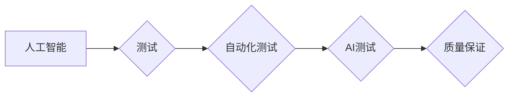

# AI测试与质量保证原理与代码实战案例讲解

作者：禅与计算机程序设计艺术 / Zen and the Art of Computer Programming


## 1. 背景介绍

### 1.1 问题的由来

随着人工智能技术的快速发展，越来越多的AI应用被应用于各个领域，如自动驾驶、智能客服、金融风控等。这些AI应用在为人们带来便利的同时，也带来了新的挑战。如何确保这些AI应用的质量和可靠性，成为了当前亟待解决的问题。

### 1.2 研究现状

AI测试与质量保证(AI Testing & Quality Assurance, ATQA)作为人工智能领域的热点话题，近年来得到了广泛关注。研究人员和工程师们纷纷提出各种方法和技术来确保AI应用的质量。目前，ATQA主要研究内容包括：

- AI测试方法：包括单元测试、集成测试、系统测试、性能测试、安全测试等。
- AI测试工具：如AI测试平台、自动化测试框架等。
- AI测试数据：如何收集、标注、清洗和利用AI测试数据。

### 1.3 研究意义

研究AI测试与质量保证具有重要的理论和实践意义：

- 确保AI应用的质量和可靠性，降低AI应用的风险。
- 促进AI技术的健康发展，推动AI应用的广泛应用。
- 提高AI应用的用户体验，增强用户对AI应用的信任。

### 1.4 本文结构

本文将系统地介绍AI测试与质量保证原理和代码实战案例。内容安排如下：

- 第2部分，介绍AI测试与质量保证的核心概念和联系。
- 第3部分，详细阐述ATQA的基本原理和具体操作步骤。
- 第4部分，介绍ATQA中常用的测试方法和工具。
- 第5部分，给出ATQA的代码实例和详细解释说明。
- 第6部分，探讨ATQA在实际应用场景中的应用案例。
- 第7部分，推荐ATQA相关的学习资源、开发工具和参考文献。
- 第8部分，总结全文，展望ATQA的未来发展趋势与挑战。

## 2. 核心概念与联系

为更好地理解AI测试与质量保证，本节将介绍几个密切相关的核心概念：

- 人工智能(AI)：一种模拟、延伸和扩展人的智能的理论、方法、技术和应用。
- 测试(Testing)：通过模拟操作或使用实际操作，以发现产品或服务的缺陷和不足的过程。
- 质量保证(Quality Assurance, QA)：通过一系列措施，确保产品或服务满足既定质量标准的过程。
- 自动化测试(Automation Testing)：利用自动化测试工具，自动执行测试用例的过程。
- AI测试(AI Testing)：针对人工智能应用进行测试的过程。

它们的逻辑关系如下图所示：



可以看出，人工智能是ATQA的研究对象，测试和自动化测试是ATQA的两种基本方法，AI测试是ATQA的具体应用，而质量保证则是ATQA的最终目标。

## 3. 核心算法原理 & 具体操作步骤

### 3.1 算法原理概述

AI测试与质量保证的核心思想是通过模拟操作或使用实际操作，对AI应用进行测试，以发现其缺陷和不足。具体操作步骤如下：

1. **需求分析**：明确AI应用的功能、性能、安全等质量要求。
2. **测试用例设计**：根据需求分析，设计测试用例，包括输入数据、预期输出、测试步骤等。
3. **测试数据准备**：准备测试数据，包括正常数据、异常数据、边界数据等。
4. **测试执行**：利用自动化测试工具执行测试用例，收集测试结果。
5. **缺陷报告**：对测试过程中发现的缺陷进行报告和分析。
6. **持续改进**：根据测试结果和缺陷报告，改进AI应用的设计和实现。

### 3.2 算法步骤详解

以下是AI测试与质量保证的具体操作步骤：

**Step 1: 需求分析**

需求分析是ATQA的第一步，其目的是明确AI应用的功能、性能、安全等质量要求。需求分析通常包括以下内容：

- 功能需求：AI应用需要实现的功能。
- 性能需求：AI应用的性能指标，如响应时间、准确率等。
- 安全需求：AI应用的安全要求，如数据安全、隐私保护等。
- 可用性需求：AI应用的易用性要求。

**Step 2: 测试用例设计**

测试用例设计是根据需求分析设计的，用于验证AI应用功能的正确性和完整性的具体步骤。测试用例通常包括以下内容：

- 测试用例编号：用于标识测试用例的唯一标识符。
- 测试用例名称：描述测试用例的简要说明。
- 测试输入：测试用例的输入数据。
- 测试操作：执行测试用例的操作步骤。
- 预期输出：执行测试用例后的预期输出结果。

**Step 3: 测试数据准备**

测试数据是测试用例执行的基础，包括正常数据、异常数据、边界数据等。测试数据的准备通常包括以下内容：

- 收集测试数据：从真实场景或模拟场景中收集测试数据。
- 数据清洗：对收集到的测试数据进行清洗，去除无效或错误的数据。
- 数据标注：对测试数据进行标注，为测试用例提供参考。

**Step 4: 测试执行**

测试执行是利用自动化测试工具执行测试用例，收集测试结果的过程。测试执行通常包括以下内容：

- 选择自动化测试工具：根据测试需求和资源选择合适的自动化测试工具。
- 编写测试脚本：根据测试用例编写测试脚本。
- 执行测试脚本：执行测试脚本，收集测试结果。

**Step 5: 缺陷报告**

缺陷报告是对测试过程中发现的缺陷进行报告和分析的过程。缺陷报告通常包括以下内容：

- 缺陷编号：用于标识缺陷的唯一标识符。
- 缺陷名称：描述缺陷的简要说明。
- 缺陷描述：详细描述缺陷的现象和原因。
- 缺陷优先级：描述缺陷的严重程度。
- 缺陷状态：描述缺陷的处理状态。

**Step 6: 持续改进**

根据测试结果和缺陷报告，改进AI应用的设计和实现。持续改进通常包括以下内容：

- 修复缺陷：修复测试过程中发现的缺陷。
- 优化设计：优化AI应用的设计，提高其性能和可靠性。
- 优化实现：优化AI应用的实现，提高其效率和质量。

### 3.3 算法优缺点

AI测试与质量保证方法具有以下优点：

- 提高测试效率：通过自动化测试工具，可以大大提高测试效率。
- 减少人为错误：自动化测试可以减少人为错误，提高测试结果的准确性。
- 提高测试覆盖率：通过设计全面的测试用例，可以提高测试覆盖率。

AI测试与质量保证方法也存在以下缺点：

- 成本较高：自动化测试工具和测试用例的设计需要投入一定的成本。
- 难以覆盖所有场景：自动化测试难以覆盖所有场景，可能存在测试盲区。
- 需要专业人才：自动化测试需要专业的测试人员。

### 3.4 算法应用领域

AI测试与质量保证方法在以下领域得到了广泛应用：

- 自动驾驶：确保自动驾驶系统的安全性和可靠性。
- 智能客服：确保智能客服系统的准确性和实用性。
- 金融风控：确保金融风控系统的准确性和有效性。
- 医疗诊断：确保医疗诊断系统的准确性和可靠性。

## 4. 数学模型和公式 & 详细讲解 & 举例说明

### 4.1 数学模型构建

AI测试与质量保证过程中，常用的数学模型包括：

- 概率论：用于描述测试结果的概率分布。
- 统计学：用于分析测试数据，发现异常值和规律。
- 机器学习：用于构建测试用例、评估测试效果等。

### 4.2 公式推导过程

以下以概率论为例，介绍数学模型在ATQA中的应用。

假设测试数据集为 $D=\{x_1, x_2, \ldots, x_N\}$，其中 $x_i$ 表示第 $i$ 个测试样本。测试结果为 $y_i$，其中 $y_i \in \{0, 1\}$，表示测试样本是否通过。

定义测试样本 $x_i$ 通过的概率为 $P(y_i=1|x_i)$，则测试数据集中所有测试样本通过的概率为：

$$
P(\text{all pass}) = \prod_{i=1}^N P(y_i=1|x_i)
$$

### 4.3 案例分析与讲解

以下以自动驾驶系统的测试案例，演示如何应用数学模型进行ATQA。

假设自动驾驶系统的测试数据集为 $D=\{x_1, x_2, \ldots, x_N\}$，其中 $x_i$ 表示第 $i$ 个测试场景。测试结果为 $y_i$，其中 $y_i \in \{0, 1\}$，表示测试场景是否通过。

定义测试场景 $x_i$ 通过的概率为 $P(y_i=1|x_i)$，则测试数据集中所有测试场景通过的概率为：

$$
P(\text{all pass}) = \prod_{i=1}^N P(y_i=1|x_i)
$$

通过计算 $P(\text{all pass})$，可以评估自动驾驶系统的整体测试效果。

### 4.4 常见问题解答

**Q1：如何提高测试覆盖率？**

A：提高测试覆盖率的方法包括：

- 设计更多的测试用例，覆盖更多的测试场景。
- 利用自动化测试工具，提高测试效率。
- 利用机器学习技术，自动生成测试用例。

**Q2：如何评估测试效果？**

A：评估测试效果的方法包括：

- 计算测试覆盖率，评估测试用例的覆盖程度。
- 计算缺陷发现率，评估测试效果。
- 利用统计分析方法，分析测试数据，发现异常值和规律。

## 5. 项目实践：代码实例和详细解释说明

### 5.1 开发环境搭建

在进行AI测试与质量保证项目实践前，我们需要准备好开发环境。以下是使用Python进行测试用例设计和自动化测试的环境配置流程：

1. 安装Python：从Python官网下载并安装Python。
2. 创建虚拟环境：使用virtualenv或conda创建独立的Python环境。
3. 安装测试框架：安装unittest、pytest等测试框架。
4. 安装自动化测试工具：安装Selenium、Robot Framework等自动化测试工具。

### 5.2 源代码详细实现

以下是一个简单的测试用例设计示例：

```python
import unittest

class TestAddition(unittest.TestCase):
    def test_add(self):
        self.assertEqual(1 + 1, 2)

    def test_sub(self):
        self.assertEqual(1 - 1, 0)

if __name__ == '__main__':
    unittest.main()
```

以上代码定义了一个名为TestAddition的测试用例类，其中包含两个测试方法：test_add和test_sub。test_add方法测试加法运算，test_sub方法测试减法运算。通过运行测试用例，可以验证加法和减法运算的正确性。

### 5.3 代码解读与分析

以上代码示例中，我们使用了unittest测试框架进行测试用例设计和自动化测试。unittest是Python内置的测试框架，提供了丰富的测试功能和测试用例设计方法。

- `unittest.TestCase`：继承自TestCase的测试用例类，用于定义测试方法。
- `test_add`：测试加法运算的正确性，使用assertEqual方法断言1+1等于2。
- `test_sub`：测试减法运算的正确性，使用assertEqual方法断言1-1等于0。
- `if __name__ == '__main__':`：判断当前脚本是否为入口点，如果是，则运行测试用例。

通过以上代码示例，我们可以看到如何使用unittest框架进行测试用例设计和自动化测试。在实际项目中，我们可以根据需要设计更复杂的测试用例，并利用自动化测试工具进行测试执行。

### 5.4 运行结果展示

在终端中运行以下命令执行测试用例：

```bash
python -m unittest TestAddition
```

运行结果如下：

```
.
----------------------------------------------------------------------
Ran 2 tests in 0.001s

OK
```

可以看到，测试用例全部通过，验证了加法和减法运算的正确性。

## 6. 实际应用场景

### 6.1 自动驾驶

自动驾驶系统需要确保其安全性和可靠性，因此需要进行严格的测试。AI测试与质量保证方法在自动驾驶领域得到了广泛应用，包括：

- 模拟环境测试：在虚拟环境中模拟各种场景，测试自动驾驶系统的感知、决策和控制能力。
- 实车测试：在真实环境中测试自动驾驶系统的性能和安全性。
- 仿真测试：利用仿真技术，模拟真实环境，测试自动驾驶系统的鲁棒性和适应性。

### 6.2 智能客服

智能客服系统需要确保其准确性和实用性，因此需要进行严格的测试。AI测试与质量保证方法在智能客服领域得到了广泛应用，包括：

- 对话测试：测试智能客服系统对用户请求的响应能力。
- 语义理解测试：测试智能客服系统对用户语义的理解能力。
- 性能测试：测试智能客服系统的响应速度和服务质量。

### 6.3 金融风控

金融风控系统需要确保其准确性和有效性，因此需要进行严格的测试。AI测试与质量保证方法在金融风控领域得到了广泛应用，包括：

- 模型测试：测试金融风控模型的准确性和鲁棒性。
- 模型评估：评估金融风控模型的性能和风险。
- 模型监控：监控金融风控模型的运行状态，及时发现异常。

### 6.4 未来应用展望

随着人工智能技术的不断发展，AI测试与质量保证方法将在更多领域得到应用，为AI应用的质量和可靠性提供有力保障。以下是AI测试与质量保证的未来应用展望：

- AI测试工具将更加智能化和自动化，提高测试效率。
- AI测试数据将更加丰富和多样，提高测试覆盖率。
- AI测试与质量保证将与其他人工智能技术相结合，推动AI应用的健康发展。

## 7. 工具和资源推荐

### 7.1 学习资源推荐

为了帮助开发者系统掌握AI测试与质量保证的理论基础和实践技巧，这里推荐一些优质的学习资源：

1. 《人工智能测试技术》书籍：全面介绍了人工智能测试的技术和方法，适合入门学习。
2. 《软件测试的艺术》书籍：介绍了软件测试的基本概念、方法和技巧，适合初学者。
3. 测试中国社区：国内领先的软件测试社区，提供丰富的测试技术、工具和资源。
4. ISTQB官网：国际软件测试资格认证委员会的官网，提供软件测试相关的认证和培训。

### 7.2 开发工具推荐

以下是一些常用的AI测试与质量保证开发工具：

- Selenium：用于自动化Web应用测试。
- Appium：用于自动化移动应用测试。
- Robot Framework：用于自动化测试框架。
- JMeter：用于性能测试。
- SonarQube：用于代码质量和安全测试。

### 7.3 相关论文推荐

以下是一些与AI测试与质量保证相关的论文：

1. "AI Testing: An Overview of the Current State of the Art and Future Directions"：概述了AI测试的现状和发展趋势。
2. "Automated Testing of AI Systems"：介绍了自动化测试AI系统的方法和技术。
3. "AI Testing in Practice"：介绍了AI测试的实际应用案例。
4. "Machine Learning for Software Testing"：介绍了机器学习在软件测试中的应用。

### 7.4 其他资源推荐

以下是一些与AI测试与质量保证相关的其他资源：

1. ISTQB官网：提供软件测试相关的认证和培训。
2. 测试中国社区：国内领先的软件测试社区。
3. QTest官网：提供软件测试工具和服务。
4. TestRail官网：提供测试管理工具。

## 8. 总结：未来发展趋势与挑战

### 8.1 研究成果总结

本文对AI测试与质量保证原理和代码实战案例进行了讲解。首先介绍了ATQA的研究背景和意义，然后阐述了ATQA的基本原理和操作步骤，接着介绍了ATQA中常用的测试方法和工具，最后探讨了ATQA在实际应用场景中的应用案例。

### 8.2 未来发展趋势

随着人工智能技术的不断发展，AI测试与质量保证技术将呈现以下发展趋势：

- AI测试将更加智能化和自动化。
- AI测试数据将更加丰富和多样。
- AI测试与质量保证将与其他人工智能技术相结合。

### 8.3 面临的挑战

AI测试与质量保证技术面临以下挑战：

- 如何提高测试覆盖率。
- 如何评估测试效果。
- 如何应对AI应用的变化和复杂性。

### 8.4 研究展望

为了应对AI测试与质量保证技术面临的挑战，未来的研究可以从以下方面展开：

- 开发更加智能化和自动化的测试工具。
- 探索新的测试方法和算法。
- 构建更加丰富和多样的测试数据集。

通过不断的研究和创新，相信AI测试与质量保证技术将为人工智能应用的健康发展提供有力保障。

## 9. 附录：常见问题与解答

**Q1：如何选择合适的测试用例设计方法？**

A：选择合适的测试用例设计方法取决于以下因素：

- 测试目的：测试目的是为了验证功能、性能、安全等方面。
- 测试资源：测试资源包括人员、时间、设备等。
- 测试周期：测试周期是测试项目的时间限制。

**Q2：如何提高测试覆盖率？**

A：提高测试覆盖率的方法包括：

- 设计更多的测试用例，覆盖更多的测试场景。
- 利用自动化测试工具，提高测试效率。
- 利用机器学习技术，自动生成测试用例。

**Q3：如何评估测试效果？**

A：评估测试效果的方法包括：

- 计算测试覆盖率，评估测试用例的覆盖程度。
- 计算缺陷发现率，评估测试效果。
- 利用统计分析方法，分析测试数据，发现异常值和规律。

**Q4：如何选择合适的自动化测试工具？**

A：选择合适的自动化测试工具取决于以下因素：

- 测试类型：测试类型包括功能测试、性能测试、安全测试等。
- 测试平台：测试平台包括Web平台、移动平台、桌面平台等。
- 开发语言：开发语言包括Python、Java、C#等。

**Q5：如何应对AI应用的变化和复杂性？**

A：应对AI应用的变化和复杂性的方法包括：

- 设计灵活的测试用例，适应AI应用的变化。
- 采用敏捷测试方法，快速响应AI应用的变化。
- 加强测试团队的技术能力，提高测试效率。

通过以上常见问题与解答，相信读者对AI测试与质量保证有了更深入的了解。