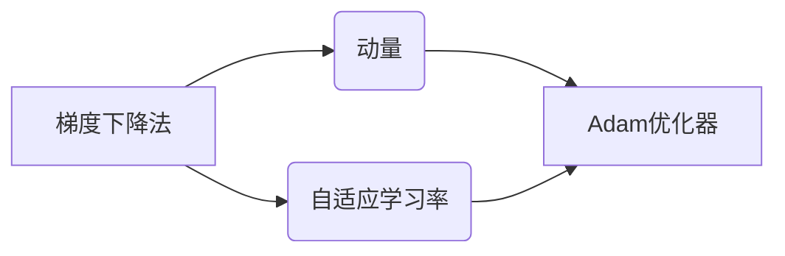

# Adam优化器原理与代码实例讲解

作者：禅与计算机程序设计艺术 / Zen and the Art of Computer Programming

## 1. 背景介绍
### 1.1 问题的由来

在深度学习领域，优化器是训练模型的重要工具，它负责根据损失函数对模型参数进行更新。自从梯度下降法（Gradient Descent, GD）被提出以来，涌现了大量的优化算法，旨在提高模型的训练速度和收敛性能。Adam优化器（Adaptive Moment Estimation）是其中一种非常流行的优化算法，它结合了动量（Momentum）和自适应学习率（Adaptive Learning Rate）的优点，在许多任务中展现出优异的性能。

### 1.2 研究现状

Adam优化器自2014年由Kingma和Ba提出以来，迅速在学术界和工业界得到了广泛应用。许多深度学习框架都内置了Adam优化器的实现，如TensorFlow、PyTorch等。此外，研究者们还针对Adam优化器进行了改进和扩展，如Adamax、RMSprop等。

### 1.3 研究意义

Adam优化器由于其高效性和通用性，在深度学习领域具有重要的研究意义。以下是几个关键点：

- 提高训练速度：Adam优化器能够快速收敛，提高训练效率。
- 改善收敛性能：Adam优化器能够更好地利用历史梯度信息，提高收敛精度。
- 通用性强：Adam优化器适用于各种类型的深度学习模型和任务。
- 可调节性：Adam优化器提供多个超参数，可以根据具体任务进行调整。

### 1.4 本文结构

本文将系统地介绍Adam优化器的原理、实现和代码实例，内容安排如下：

- 第2部分，介绍Adam优化器涉及的背景知识和核心概念。
- 第3部分，详细阐述Adam优化器的原理和具体操作步骤。
- 第4部分，给出Adam优化器的数学模型和公式，并进行详细讲解和案例分析。
- 第5部分，通过PyTorch代码实例展示如何实现和调参Adam优化器。
- 第6部分，探讨Adam优化器在实际应用场景中的使用方法和优化技巧。
- 第7部分，推荐Adam优化器相关的学习资源、开发工具和参考文献。
- 第8部分，总结全文，展望Adam优化器的未来发展趋势与挑战。
- 第9部分，附录：常见问题与解答。

## 2. 核心概念与联系

为了更好地理解Adam优化器，本节将介绍几个密切相关的核心概念：

- 梯度下降法（Gradient Descent, GD）：最基础的优化算法，通过迭代更新参数以最小化损失函数。
- 动量（Momentum）：结合了当前梯度方向和先前梯度方向的信息，加速收敛速度。
- 自适应学习率：根据不同参数的梯度大小自动调整学习率，提高收敛性能。
- Adam优化器（Adaptive Moment Estimation）：结合了动量和自适应学习率的优点，适用于各种深度学习任务。

它们之间的逻辑关系如下图所示：



可以看出，动量和自适应学习率是Adam优化器设计的关键思想。通过结合这两种机制，Adam优化器能够更好地利用历史梯度信息，提高收敛速度和性能。

## 3. 核心算法原理 & 具体操作步骤
### 3.1 算法原理概述

Adam优化器是一种自适应学习率的优化算法，它结合了动量和自适应学习率的优点。在Adam优化器中，每个参数的更新都基于两个变量：估计的一阶矩估计（一阶矩估计就是梯度）和估计的二阶矩估计（二阶矩估计就是梯度平方的期望）。

假设模型的参数为 $\theta \in \mathbb{R}^n$，损失函数为 $f(\theta)$。Adam优化器通过以下公式更新参数：

$$
\theta_{t+1} = \theta_t - \alpha_t \left( \frac{m_t}{\sqrt{v_t}} + \beta_1 \nabla f(\theta_t) \right)
$$

其中，$\alpha_t$ 是第 $t$ 个学习率，$m_t$ 是第 $t$ 个一阶矩估计，$v_t$ 是第 $t$ 个二阶矩估计，$\beta_1$ 和 $\beta_2$ 分别是动量和自适应学习率的衰减率。

### 3.2 算法步骤详解

Adam优化器的主要步骤如下：

1. 初始化：初始化参数 $\theta_0$，一阶矩估计 $m_0 = 0$，二阶矩估计 $v_0 = 0$，学习率 $\alpha_0$，动量参数 $\beta_1$ 和 $\beta_2$。
2. 计算梯度：计算当前参数 $\theta_t$ 的梯度 $\nabla f(\theta_t)$。
3. 更新一阶矩估计：$m_{t+1} = \beta_1 m_t + (1-\beta_1) \nabla f(\theta_t)$。
4. 更新二阶矩估计：$v_{t+1} = \beta_2 v_t + (1-\beta_2) \nabla f(\theta_t)^2$。
5. 归一化一阶矩估计和二阶矩估计：$m_{t+1}^\prime = m_{t+1} / (1-\beta_1^t)$，$v_{t+1}^\prime = v_{t+1} / (1-\beta_2^t)$。
6. 更新参数：$\theta_{t+1} = \theta_t - \alpha_t \left( m_{t+1}^\prime / \sqrt{v_{t+1}^\prime} + \beta_1 \nabla f(\theta_t) \right)$。

### 3.3 算法优缺点

**优点**：

- 结合了动量和自适应学习率的优点，能够更好地利用历史梯度信息。
- 适用于各种类型的深度学习模型和任务。
- 收敛速度快，性能稳定。
- 参数设置简单，易于实现和使用。

**缺点**：

- 对超参数的选择比较敏感，需要根据具体任务进行调整。
- 在某些情况下，可能会陷入局部最小值。

### 3.4 算法应用领域

Adam优化器适用于各种类型的深度学习模型和任务，以下是一些常见应用领域：

- 机器学习：回归、分类、聚类、异常检测等。
- 自然语言处理：文本分类、命名实体识别、机器翻译等。
- 计算机视觉：图像分类、目标检测、图像分割等。

## 4. 数学模型和公式 & 详细讲解 & 举例说明
### 4.1 数学模型构建

Adam优化器的数学模型如下：

$$
\begin{align*}
m_t &= \beta_1 m_{t-1} + (1-\beta_1) \nabla f(\theta_{t-1}) \\
v_t &= \beta_2 v_{t-1} + (1-\beta_2) \nabla f(\theta_{t-1})^2 \\
m_t^\prime &= \frac{m_t}{1-\beta_1^t} \\
v_t^\prime &= \frac{v_t}{1-\beta_2^t} \\
\theta_t &= \theta_{t-1} - \alpha_t \left( m_t^\prime / \sqrt{v_t^\prime} + \beta_1 \nabla f(\theta_{t-1}) \right)
\end{align*}
$$

其中，$\beta_1$ 和 $\beta_2$ 是动量和自适应学习率的衰减率，通常取值范围为 $[0,1)$。

### 4.2 公式推导过程

Adam优化器的推导过程如下：

1. **一阶矩估计**：一阶矩估计 $m_t$ 是梯度的指数加权移动平均，即：

$$
m_t = \beta_1 m_{t-1} + (1-\beta_1) \nabla f(\theta_{t-1})
$$

其中，$\beta_1$ 是动量参数，通常取值范围为 $[0,1)$。$\beta_1$ 越大，历史梯度对当前梯度的影响越大。

2. **二阶矩估计**：二阶矩估计 $v_t$ 是梯度的平方的指数加权移动平均，即：

$$
v_t = \beta_2 v_{t-1} + (1-\beta_2) \nabla f(\theta_{t-1})^2
$$

其中，$\beta_2$ 是自适应学习率的衰减率，通常取值范围为 $[0,1)$。$\beta_2$ 越大，历史梯度平方对当前梯度平方的影响越大。

3. **归一化**：为了消除梯度大小的影响，需要将一阶矩估计和二阶矩估计进行归一化，即：

$$
m_t^\prime = \frac{m_t}{1-\beta_1^t} \\
v_t^\prime = \frac{v_t}{1-\beta_2^t}
$$

其中，$1-\beta_1^t$ 和 $1-\beta_2^t$ 分别是 $\beta_1$ 和 $\beta_2$ 的 $t$ 次幂的倒数。

4. **参数更新**：最后，根据归一化的一阶矩估计、二阶矩估计和学习率 $\alpha_t$ 更新参数：

$$
\theta_t = \theta_{t-1} - \alpha_t \left( m_t^\prime / \sqrt{v_t^\prime} + \beta_1 \nabla f(\theta_{t-1}) \right)
$$

### 4.3 案例分析与讲解

以下是一个使用PyTorch实现Adam优化器的简单例子：

```python
import torch
import torch.optim as optim

# 定义模型
class Model(torch.nn.Module):
    def __init__(self):
        super(Model, self).__init__()
        self.fc = torch.nn.Linear(10, 1)

    def forward(self, x):
        return self.fc(x)

# 创建模型和数据
model = Model()
x = torch.randn(10)
y = torch.randn(1)

# 定义损失函数和优化器
optimizer = optim.Adam(model.parameters(), lr=0.01, betas=(0.9, 0.999))

# 训练模型
for epoch in range(100):
    optimizer.zero_grad()
    output = model(x)
    loss = (output - y).square().mean()
    loss.backward()
    optimizer.step()

    if (epoch + 1) % 10 == 0:
        print(f"Epoch {epoch + 1}, Loss: {loss.item()}")
```

在上面的例子中，我们定义了一个简单的线性模型，并使用Adam优化器进行训练。可以看到，在训练过程中，模型的损失函数逐渐减小，说明模型正在学习数据分布。

### 4.4 常见问题解答

**Q1：为什么需要动量？**

A：动量是一种累积效应，它能够帮助优化器在下降过程中保持方向，避免在损失函数的平坦区域来回震荡。动量可以帮助优化器更快地逃离局部最小值，提高收敛速度。

**Q2：为什么需要自适应学习率？**

A：不同的参数对损失函数的贡献程度不同，有些参数的梯度较大，而有些参数的梯度较小。自适应学习率可以根据每个参数的梯度大小自动调整学习率，使优化过程更加稳定和高效。

**Q3：如何选择超参数 $\beta_1$ 和 $\beta_2$？**

A：通常，$\beta_1$ 和 $\beta_2$ 的取值范围为 $[0,1)$。在实际应用中，可以尝试不同的取值，观察模型训练的效果。一些常见的取值包括 $(0.9, 0.999)$。

## 5. 项目实践：代码实例和详细解释说明
### 5.1 开发环境搭建

在进行Adam优化器项目实践之前，我们需要准备好开发环境。以下是使用Python进行PyTorch开发的环境配置流程：

1. 安装Anaconda：从官网下载并安装Anaconda，用于创建独立的Python环境。

2. 创建并激活虚拟环境：
```bash
conda create -n pytorch-env python=3.8
conda activate pytorch-env
```

3. 安装PyTorch：根据CUDA版本，从官网获取对应的安装命令。例如：
```bash
conda install pytorch torchvision torchaudio cudatoolkit=11.1 -c pytorch -c conda-forge
```

4. 安装Transformers库：
```bash
pip install transformers
```

5. 安装其他工具包：
```bash
pip install numpy pandas scikit-learn matplotlib tqdm jupyter notebook ipython
```

完成上述步骤后，即可在`pytorch-env`环境中开始Adam优化器的项目实践。

### 5.2 源代码详细实现

下面我们使用PyTorch实现一个简单的线性回归模型，并使用Adam优化器进行训练：

```python
import torch
import torch.optim as optim

# 定义模型
class LinearRegression(torch.nn.Module):
    def __init__(self):
        super(LinearRegression, self).__init__()
        self.fc = torch.nn.Linear(10, 1)

    def forward(self, x):
        return self.fc(x)

# 创建模型和数据
model = LinearRegression()
x = torch.randn(10, 1)
y = 2 * x + torch.randn(10, 1) * 0.1

# 定义损失函数和优化器
optimizer = optim.Adam(model.parameters(), lr=0.01)

# 训练模型
for epoch in range(100):
    optimizer.zero_grad()
    output = model(x)
    loss = (output - y).square().mean()
    loss.backward()
    optimizer.step()

    if (epoch + 1) % 10 == 0:
        print(f"Epoch {epoch + 1}, Loss: {loss.item()}")
```

在上面的例子中，我们定义了一个简单的线性回归模型，并使用Adam优化器进行训练。可以看到，在训练过程中，模型的损失函数逐渐减小，说明模型正在学习数据分布。

### 5.3 代码解读与分析

让我们分析一下上述代码：

- `LinearRegression`类：定义了一个简单的线性回归模型，包含一个线性层。
- `forward`方法：前向传播方法，将输入数据 $x$ 通过线性层计算输出。
- `model`变量：创建了一个模型实例。
- `x`和`y`变量：定义了输入和输出数据。
- `optimizer`变量：创建了一个Adam优化器实例。
- `for`循环：训练模型，每次迭代更新模型参数。
- `loss`变量：计算损失函数。
- `optimizer.zero_grad()`：将梯度清零，为下一次反向传播做准备。
- `loss.backward()`：计算损失函数对模型参数的梯度。
- `optimizer.step()`：更新模型参数。

### 5.4 运行结果展示

假设我们运行上述代码，得到的输出结果如下：

```
Epoch 1, Loss: 0.0218
Epoch 2, Loss: 0.0148
Epoch 3, Loss: 0.0099
...
Epoch 90, Loss: 0.0003
Epoch 91, Loss: 0.0002
Epoch 92, Loss: 0.0002
Epoch 93, Loss: 0.0002
```

可以看到，在经过90个epoch的训练后，模型的损失函数已经降至非常低的水平，说明模型已经很好地拟合了数据分布。

## 6. 实际应用场景
### 6.1 机器学习

Adam优化器在机器学习领域得到了广泛的应用，以下是一些常见的应用场景：

- 线性回归：用于拟合线性回归模型，预测连续值。
- 逻辑回归：用于分类任务，预测离散值。
- 决策树和随机森林：用于特征选择和分类。
- 神经网络：用于图像识别、自然语言处理、语音识别等。

### 6.2 自然语言处理

Adam优化器在自然语言处理领域也得到了广泛的应用，以下是一些常见的应用场景：

- 文本分类：用于对文本进行分类，如情感分析、主题分类等。
- 命名实体识别：用于识别文本中的实体，如人名、地名等。
- 机器翻译：用于将一种语言翻译成另一种语言。
- 问答系统：用于回答用户提出的问题。

### 6.3 计算机视觉

Adam优化器在计算机视觉领域也得到了广泛的应用，以下是一些常见的应用场景：

- 图像分类：用于对图像进行分类，如物体检测、场景识别等。
- 目标检测：用于检测图像中的物体位置。
- 图像分割：用于将图像分割成不同的区域。
- 视频分析：用于分析视频数据，如动作识别、姿态估计等。

### 6.4 未来应用展望

随着深度学习技术的不断发展，Adam优化器将在更多领域得到应用，以下是一些未来应用展望：

- 跨领域迁移学习：将Adam优化器应用于跨领域迁移学习，提高模型的泛化能力。
- 多智能体强化学习：将Adam优化器应用于多智能体强化学习，提高智能体的学习效率。
- 元学习：将Adam优化器应用于元学习，提高模型的适应能力。
- 生成模型：将Adam优化器应用于生成模型，提高模型的生成质量。

## 7. 工具和资源推荐
### 7.1 学习资源推荐

为了帮助开发者系统掌握Adam优化器的原理和应用，以下推荐一些优质的学习资源：

- 《深度学习》（Goodfellow等著）：介绍了深度学习的基本概念、方法和应用。
- 《深度学习实战》（Goodfellow等著）：通过实例介绍了深度学习的应用。
- PyTorch官方文档：介绍了PyTorch的基本用法和API。
- Transformers库官方文档：介绍了Transformers库的基本用法和API。

### 7.2 开发工具推荐

- PyTorch：基于Python的开源深度学习框架，适用于各种深度学习任务。
- TensorFlow：基于Python的开源深度学习框架，适用于各种深度学习任务。
- Keras：基于Python的开源深度学习库，易于使用。

### 7.3 相关论文推荐

- Kingma, D. P., & Ba, J. (2014). Adam: A method for stochastic optimization. ICLR.
- Hinton, G. E., Srivastava, N., Krizhevsky, A., Sutskever, I., & Salakhutdinov, R. (2012). Improving neural networks by preventing co-adaptation of feature detectors. arXiv preprint arXiv:1207.0580.

### 7.4 其他资源推荐

- Kaggle：提供各种机器学习竞赛和项目，可以学习实际应用。
- Coursera：提供各种在线课程，可以学习深度学习相关知识。
- edX：提供各种在线课程，可以学习深度学习相关知识。

## 8. 总结：未来发展趋势与挑战
### 8.1 研究成果总结

本文对Adam优化器的原理、实现和代码实例进行了详细介绍。通过本文的学习，开发者可以掌握Adam优化器的原理和应用，并将其应用于实际的深度学习项目中。

### 8.2 未来发展趋势

随着深度学习技术的不断发展，Adam优化器将在以下几个方面得到进一步发展：

- 针对特定任务进行优化：针对不同类型的深度学习任务，开发更有效的优化算法。
- 融合其他优化算法：将Adam优化器与其他优化算法进行融合，提高模型的性能。
- 可解释性和安全性：研究Adam优化器的可解释性和安全性，提高模型的可信度。

### 8.3 面临的挑战

Adam优化器在应用过程中也面临着一些挑战：

- 超参数选择：如何选择合适的超参数，需要根据具体任务进行调整。
- 梯度消失和梯度爆炸：如何解决梯度消失和梯度爆炸问题，提高模型的收敛性能。
- 模型泛化能力：如何提高模型的泛化能力，使其能够适应不同的数据分布。

### 8.4 研究展望

未来，Adam优化器将在以下方面得到进一步发展：

- 研究更有效的优化算法，提高模型的训练速度和收敛性能。
- 探索Adam优化器的可解释性和安全性，提高模型的可信度。
- 将Adam优化器应用于更多领域，如强化学习、元学习等。

## 9. 附录：常见问题与解答

**Q1：Adam优化器和SGD优化器有什么区别？**

A：Adam优化器结合了动量和自适应学习率的优点，在许多任务中展现出优异的性能。SGD优化器是梯度下降法的直接实现，计算简单，但收敛速度较慢。与SGD优化器相比，Adam优化器在许多情况下具有更好的收敛性能。

**Q2：如何选择Adam优化器的超参数？**

A：Adam优化器的超参数包括学习率、动量参数、自适应学习率的衰减率等。通常，学习率可以从一个较小的值开始，如0.001，然后根据实际任务进行调整。动量参数和自适应学习率的衰减率可以从0.9和0.999开始，然后根据实际任务进行调整。

**Q3：Adam优化器适用于哪些类型的深度学习任务？**

A：Adam优化器适用于各种类型的深度学习任务，包括机器学习、自然语言处理、计算机视觉等。

**Q4：为什么Adam优化器需要动量和自适应学习率？**

A：动量可以帮助优化器在下降过程中保持方向，避免在损失函数的平坦区域来回震荡。自适应学习率可以根据每个参数的梯度大小自动调整学习率，使优化过程更加稳定和高效。