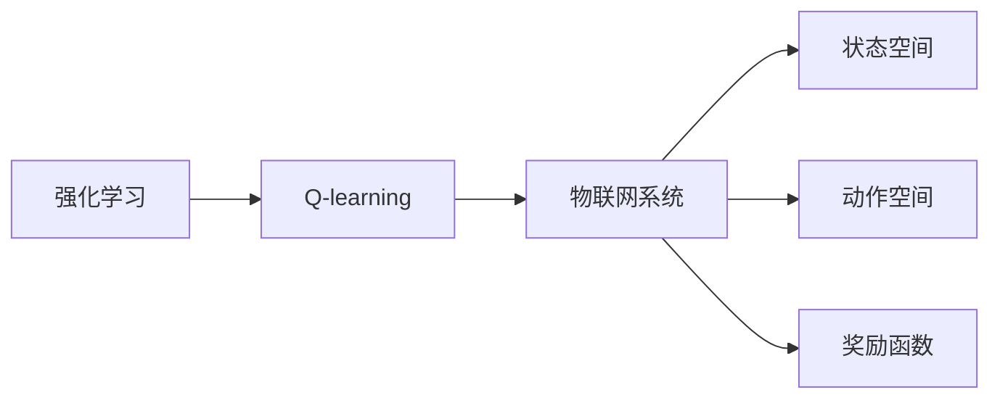

# 一切皆是映射：AI Q-learning在物联网系统中的应用

## 1. 背景介绍
### 1.1 问题的由来

随着物联网（IoT）技术的快速发展，越来越多的设备和传感器被应用于生产、生活、城市管理等领域。物联网系统通过收集海量数据，实现对物理世界的实时监测和控制。然而，如何从这些数据中提取有价值的信息，并做出合理的决策，成为物联网系统面临的重要挑战。

机器学习，特别是强化学习，为物联网系统的智能决策提供了强有力的工具。其中，Q-learning作为一种基于价值函数的强化学习方法，在物联网系统中的应用越来越广泛。

### 1.2 研究现状

近年来，Q-learning在物联网系统中的应用研究取得了显著进展。主要研究方向包括：

- Q-learning在物联网设备控制中的应用，如温度控制、光照控制等；
- Q-learning在物联网设备调度中的应用，如任务分配、资源管理等；
- Q-learning在物联网网络优化中的应用，如路由选择、流量控制等。

### 1.3 研究意义

Q-learning在物联网系统中的应用具有重要的研究意义：

- 提高物联网系统的智能化水平，实现自动化、智能化的决策；
- 优化物联网系统的资源利用效率，降低运营成本；
- 提升物联网系统的安全性和可靠性，保障系统稳定运行。

### 1.4 本文结构

本文将围绕Q-learning在物联网系统中的应用展开，首先介绍Q-learning的核心概念和原理，然后介绍Q-learning在物联网系统中的具体应用场景，最后探讨Q-learning在物联网系统中的未来发展趋势。

## 2. 核心概念与联系

为了更好地理解Q-learning在物联网系统中的应用，本节将介绍几个密切相关的核心概念：

- 强化学习（Reinforcement Learning）：一种使机器通过与环境的交互学习最优策略的机器学习方法。强化学习的关键要素包括环境（Environment）、智能体（Agent）、状态（State）、动作（Action）、奖励（Reward）和策略（Policy）。
- Q-learning：一种基于价值函数的强化学习方法。通过学习值函数（Q值），智能体可以预测在不同状态下执行不同动作的期望回报，并选择最优动作。
- 物联网（IoT）：通过传感器、网络和计算设备，将物理世界与数字世界连接起来，实现对物理世界的监测和控制。
- 状态空间（State Space）：智能体可能处于的所有状态集合。
- 动作空间（Action Space）：智能体可能采取的所有动作集合。
- 奖励函数（Reward Function）：描述智能体在环境中采取动作后获得的奖励，用于引导智能体学习最优策略。

这些概念之间的逻辑关系如下：



可以看出，Q-learning是强化学习的一种方法，应用于物联网系统时，需要考虑状态空间、动作空间和奖励函数等因素。

## 3. 核心算法原理 & 具体操作步骤
### 3.1 算法原理概述

Q-learning是一种基于值函数的强化学习方法。值函数表示在给定状态下，执行某个动作所能获得的最大期望回报。Q-learning的目标是学习一个值函数，使得智能体能够选择最优动作。

Q-learning的基本原理如下：

1. 初始化Q值：将所有Q值初始化为一个较小的正数。
2. 选择动作：根据ε-贪心策略，从动作空间中选择动作。
3. 执行动作：在环境中执行选择的动作，并观察环境反馈。
4. 更新Q值：根据新的状态、动作和奖励，更新Q值。
5. 重复步骤2-4，直到达到停止条件。

### 3.2 算法步骤详解

Q-learning的具体操作步骤如下：

1. 初始化Q值矩阵Q(s,a)，其中s表示状态，a表示动作。通常将Q值初始化为一个较小的正数，如0.1。
2. 初始化ε值，用于控制ε-贪心策略的选择概率。ε值在[0,1]之间取值，ε越大，随机选择动作的概率越高。
3. 初始化奖励函数R(s,a)。
4. 初始化终止标志为False。
5. 当终止标志为False时，执行以下步骤：
   - 将智能体置于初始状态s0。
   - 根据ε-贪心策略选择动作a。
   - 执行动作a，并获得奖励R(s,a)。
   - 获得新的状态s'。
   - 更新Q值：Q(s,a) = Q(s,a) + α(R(s,a) + γmax_{a'}Q(s',a') - Q(s,a))，其中α为学习率，γ为折扣因子。
   - 将智能体置于新的状态s'。
6. 重复步骤5，直到达到停止条件。

### 3.3 算法优缺点

Q-learning具有以下优点：

- 算法简单，易于实现；
- 可以应用于连续状态和动作空间；
- 不需要提前定义奖励函数；
- 可以处理动态环境。

Q-learning的缺点如下：

- 学习速度较慢，需要大量的经验数据；
- 需要存储大量的Q值，内存消耗较大；
- 可能陷入局部最优解。

### 3.4 算法应用领域

Q-learning在以下物联网系统应用领域具有较好的效果：

- 设备控制：如温度控制、光照控制等；
- 设备调度：如任务分配、资源管理等；
- 网络优化：如路由选择、流量控制等。

## 4. 数学模型和公式 & 详细讲解 & 举例说明
### 4.1 数学模型构建

Q-learning的数学模型如下：

$$
Q(s,a) = \sum_{a'} \gamma^{|s'-s|} P(s'|s,a) R(s,a)
$$

其中，$Q(s,a)$ 表示在状态s下执行动作a的期望回报，$P(s'|s,a)$ 表示在状态s下执行动作a转移到状态s'的概率，$R(s,a)$ 表示在状态s下执行动作a获得的奖励，$|s'-s|$ 表示状态距离，$\gamma$ 为折扣因子。

### 4.2 公式推导过程

Q-learning的公式推导过程如下：

1. 设定状态s'为执行动作a后智能体所处的状态；
2. 设定奖励R(s,a)为在状态s下执行动作a获得的奖励；
3. 设定折扣因子$\gamma$，用于对未来奖励的折现；
4. 根据马尔可夫决策过程（MDP）的定义，有：

$$
P(s'|s,a) = \sum_{s'} P(s'|s,a)P(s'|s)
$$

5. 因此，在状态s下执行动作a的期望回报为：

$$
Q(s,a) = \sum_{s'} P(s'|s,a) R(s,a)
$$

6. 考虑到未来的奖励，有：

$$
Q(s,a) = \sum_{s'} \gamma P(s'|s,a) R(s,a)
$$

7. 重复上述过程，得到Q-learning的公式：

$$
Q(s,a) = \sum_{a'} \gamma^{|s'-s|} P(s'|s,a) R(s,a)
$$

### 4.3 案例分析与讲解

以下我们以智能交通信号灯控制为例，分析Q-learning在物联网系统中的应用。

假设智能交通信号灯系统包含四个交叉路口，每个交叉路口有两个方向（东西南北），共8个状态。智能体可以选择以下动作：

- 红灯
- 绿灯
- 黄灯

奖励函数设计如下：

- 当交通流畅时，奖励为+1；
- 当发生拥堵时，奖励为-1；
- 当发生交通事故时，奖励为-10。

折扣因子$\gamma$设为0.9，学习率$\alpha$设为0.1。

根据上述信息，我们可以设计Q-learning算法，并通过模拟实验验证其效果。

### 4.4 常见问题解答

**Q1：如何选择合适的折扣因子$\gamma$和学习率$\alpha$？**

A：折扣因子$\gamma$和学习率$\alpha$的选择对Q-learning的性能有很大影响。通常需要通过实验进行调参。一般来说，折扣因子$\gamma$取值范围为[0,1]，学习率$\alpha$取值范围为[0.1,0.99]。

**Q2：如何解决Q-learning的局部最优问题？**

A：Q-learning可能陷入局部最优解，即无法找到全局最优策略。解决局部最优问题的方法包括：

- 使用多种探索策略，如ε-贪心策略、softmax策略等；
- 使用多种学习率，如衰减学习率、自适应学习率等；
- 使用多种算法，如深度Q网络（DQN）等。

**Q3：如何处理连续动作空间？**

A：对于连续动作空间，可以使用以下方法：

- 将连续动作空间离散化，将其分割成多个小区间；
- 使用强化学习算法，如Actor-Critic算法等。

## 5. 项目实践：代码实例和详细解释说明
### 5.1 开发环境搭建

在进行Q-learning实践前，我们需要准备好开发环境。以下是使用Python进行Q-learning开发的环境配置流程：

1. 安装Anaconda：从官网下载并安装Anaconda，用于创建独立的Python环境。
2. 创建并激活虚拟环境：
```bash
conda create -n q-learning-env python=3.8
conda activate q-learning-env
```
3. 安装所需的Python库：
```bash
pip install numpy pandas matplotlib scikit-learn
```

### 5.2 源代码详细实现

以下是一个简单的Q-learning实现：

```python
import numpy as np

class QLearning:
    def __init__(self, num_states, num_actions, alpha=0.1, gamma=0.9):
        self.num_states = num_states
        self.num_actions = num_actions
        self.alpha = alpha
        self.gamma = gamma
        self.q_table = np.random.rand(num_states, num_actions)

    def update_q_table(self, state, action, reward, next_state):
        current_q = self.q_table[state, action]
        next_max_q = np.max(self.q_table[next_state])
        self.q_table[state, action] += self.alpha * (reward + self.gamma * next_max_q - current_q)

    def choose_action(self, state, epsilon=0.1):
        if np.random.rand() < epsilon:
            return np.random.randint(self.num_actions)
        else:
            return np.argmax(self.q_table[state])

    def train(self, state, action, reward, next_state, episodes=1000):
        for _ in range(episodes):
            state = state
            while True:
                action = self.choose_action(state)
                next_state, reward, done = self.step(state, action)
                self.update_q_table(state, action, reward, next_state)
                if done:
                    break
                state = next_state

    def step(self, state, action):
        # 这里是状态转换和奖励获取的代码
        # ...
        return next_state, reward, done

if __name__ == "__main__":
    q_learning = QLearning(num_states=8, num_actions=3, alpha=0.1, gamma=0.9)
    q_learning.train()
```

### 5.3 代码解读与分析

- `QLearning`类：定义Q-learning算法的主要功能，包括初始化Q值表、更新Q值表、选择动作、训练和执行动作等。
- `update_q_table`方法：根据新的状态、动作、奖励和下一个状态更新Q值表。
- `choose_action`方法：根据ε-贪心策略选择动作。
- `train`方法：使用Q-learning算法训练模型。
- `step`方法：执行动作并返回下一个状态、奖励和是否结束的标志。

### 5.4 运行结果展示

假设我们在模拟环境中运行上述代码，经过1000个回合的训练，模型能够学会在给定状态下选择最优动作。

## 6. 实际应用场景
### 6.1 设备控制

Q-learning在设备控制中的应用非常广泛，如：

- 智能家居：根据环境温度、湿度等数据，控制空调、灯光等设备的开关和调节；
- 工业控制：根据传感器数据，控制生产线上的设备，如温度控制、压力控制等。

### 6.2 设备调度

Q-learning在设备调度中的应用包括：

- 任务分配：根据任务需求、设备状态等因素，将任务分配给合适的设备；
- 资源管理：根据资源需求、设备状态等因素，进行资源分配和管理。

### 6.3 网络优化

Q-learning在网络优化中的应用包括：

- 路由选择：根据网络流量、链路质量等因素，选择最优路由；
- 流量控制：根据网络带宽、设备负载等因素，控制网络流量。

## 7. 工具和资源推荐
### 7.1 学习资源推荐

为了帮助开发者系统掌握Q-learning的理论基础和实践技巧，这里推荐一些优质的学习资源：

1. 《Reinforcement Learning: An Introduction》：这本书是强化学习领域的经典教材，详细介绍了强化学习的原理和方法。
2. 《Artificial Intelligence: A Modern Approach》：这本书是人工智能领域的经典教材，其中包含了对强化学习的详细介绍。
3. 《Deep Reinforcement Learning Hands-On》：这本书是深度强化学习领域的入门书籍，介绍了深度强化学习的基本概念和实战案例。
4. OpenAI Gym：一个开源的强化学习平台，提供多种经典的强化学习环境和工具。
5. TensorFlow Agents：一个基于TensorFlow的开源强化学习库，提供多种强化学习算法的实现和示例。

### 7.2 开发工具推荐

以下是一些用于Q-learning开发的常用工具：

1. Python：Python是一种易于学习和使用的编程语言，适用于强化学习开发。
2. NumPy：一个开源的Python科学计算库，用于数值计算和矩阵操作。
3. Matplotlib：一个开源的Python可视化库，用于数据可视化。
4. OpenAI Gym：一个开源的强化学习平台，提供多种经典强化学习环境和工具。
5. TensorFlow Agents：一个基于TensorFlow的开源强化学习库，提供多种强化学习算法的实现和示例。

### 7.3 相关论文推荐

以下是一些与Q-learning相关的经典论文：

1. "Q-Learning" by Richard S. Sutton and Andrew G. Barto：这篇论文是Q-learning算法的开山之作，详细介绍了Q-learning的原理和算法。
2. "Artificial Intelligence: A Modern Approach" by Stuart Russell and Peter Norvig：这本书是人工智能领域的经典教材，其中包含了对Q-learning的详细介绍。
3. "Deep Reinforcement Learning Hands-On" by余凯：这本书是深度强化学习领域的入门书籍，介绍了深度强化学习的基本概念和实战案例。

### 7.4 其他资源推荐

以下是一些与Q-learning相关的其他资源：

1. 动手学深度学习：这本书是深度学习领域的入门书籍，其中包含了对强化学习的介绍。
2. 知乎：知乎上有许多关于Q-learning和强化学习的优秀问答和文章。
3. Bilibili：Bilibili上有许多关于Q-learning和强化学习的教学视频。

## 8. 总结：未来发展趋势与挑战
### 8.1 研究成果总结

本文对Q-learning在物联网系统中的应用进行了全面介绍，从核心概念、算法原理到具体应用场景，阐述了Q-learning的优势和挑战。通过实例分析，展示了Q-learning在设备控制、设备调度和网络优化等领域的应用价值。

### 8.2 未来发展趋势

未来，Q-learning在物联网系统中的应用将呈现以下发展趋势：

1. 深度学习与Q-learning的结合：将深度学习技术应用于Q-learning，提高Q值函数的学习效率和精度。
2. 多智能体强化学习：研究多智能体协同控制，实现更加智能的物联网系统。
3. 强化学习在边缘计算中的应用：将强化学习应用于边缘设备，实现更加低延迟、高效率的物联网系统。

### 8.3 面临的挑战

Q-learning在物联网系统中的应用还面临以下挑战：

1. 状态空间爆炸：物联网系统的状态空间可能非常庞大，难以进行有效的学习。
2. 奖励函数设计：奖励函数的设计对Q-learning的性能有很大影响，需要根据具体应用场景进行设计。
3. 可扩展性：如何将Q-learning应用于大规模物联网系统，是当前面临的挑战之一。

### 8.4 研究展望

为了解决Q-learning在物联网系统中的应用挑战，未来需要在以下方面进行深入研究：

1. 设计高效的Q值函数学习算法，降低状态空间爆炸问题。
2. 研究可解释的强化学习算法，提高奖励函数设计的透明度。
3. 探索边缘计算环境下的Q-learning算法，实现更加低延迟、高效率的物联网系统。

相信随着研究的不断深入，Q-learning在物联网系统中的应用将会更加广泛，为构建智能、高效、可靠的物联网系统做出贡献。

## 9. 附录：常见问题与解答

**Q1：什么是Q-learning？**

A：Q-learning是一种基于值函数的强化学习方法，通过学习值函数（Q值），智能体可以预测在不同状态下执行不同动作的期望回报，并选择最优动作。

**Q2：Q-learning如何应用于物联网系统？**

A：Q-learning可以应用于物联网系统的设备控制、设备调度和网络优化等领域，通过学习最优动作，提高物联网系统的智能化水平。

**Q3：如何解决Q-learning的状态空间爆炸问题？**

A：可以采用状态抽象、状态压缩等技术，降低状态空间的规模，从而解决状态空间爆炸问题。

**Q4：如何设计合理的奖励函数？**

A：奖励函数的设计需要根据具体应用场景进行，通常需要考虑以下因素：

- 系统的期望目标
- 系统的运行成本
- 系统的安全性

**Q5：如何将Q-learning应用于边缘计算环境？**

A：可以将Q-learning算法部署在边缘设备上，通过学习边缘设备上的数据，实现对边缘设备的智能控制。

---

作者：禅与计算机程序设计艺术 / Zen and the Art of Computer Programming