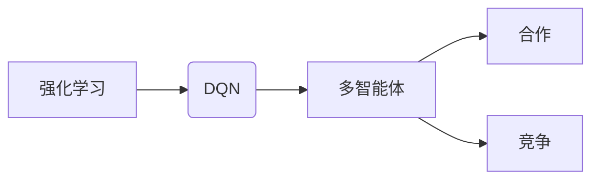

# 一切皆是映射：DQN的多智能体扩展与合作-竞争环境下的学习

作者：禅与计算机程序设计艺术 / Zen and the Art of Computer Programming

## 关键词：

强化学习，DQN，多智能体，合作，竞争，映射，智能体交互，策略学习

## 1. 背景介绍

### 1.1 问题的由来

在人工智能领域，强化学习（Reinforcement Learning，RL）因其强大的学习能力和适应性，被广泛应用于游戏、机器人、自动驾驶、自然语言处理等多个领域。其中，深度Q网络（Deep Q-Network，DQN）作为强化学习中的一种经典算法，因其优异的性能而备受关注。

然而，在实际应用中，许多问题往往涉及多个智能体之间的交互，如多人游戏、多机器人协同作业、智能体博弈等。如何让多个智能体在竞争或合作的环境中协同学习，是当前强化学习领域的一个重要研究方向。

### 1.2 研究现状

近年来，研究者们对DQN的多智能体扩展进行了大量探索，提出了多种合作、竞争环境下的多智能体学习算法。主要包括以下几种：

- 多智能体DQN（Multi-Agent DQN，MADQN）：将DQN应用于多智能体场景，每个智能体独立学习自己的策略。
- 多智能体Q学习（Multi-Agent Q-Learning，MAQ-L）：将Q学习应用于多智能体场景，每个智能体学习自己的Q函数。
- 多智能体策略梯度（Multi-Agent Policy Gradient，MAPG）：将策略梯度应用于多智能体场景，每个智能体学习自己的策略。
- 多智能体深度确定性策略梯度（Multi-Agent Deep Deterministic Policy Gradient，MADDPG）：结合深度学习和策略梯度方法，实现多智能体协同学习。

### 1.3 研究意义

研究DQN的多智能体扩展与合作，对于推动强化学习技术发展、解决复杂智能体交互问题具有重要意义：

- 提高智能体在复杂环境中的适应能力，使其能够更好地应对未知和动态变化。
- 促进智能体之间的协同合作，提高任务完成效率。
- 探索智能体在竞争环境下的决策策略，为现实世界的博弈问题提供解决方案。

### 1.4 本文结构

本文将围绕DQN的多智能体扩展与合作展开，首先介绍相关核心概念和联系，然后详细阐述多智能体DQN算法原理和具体操作步骤，接着介绍数学模型和公式，并通过实例进行分析。最后，探讨实际应用场景和未来发展趋势，并推荐相关工具和资源。

## 2. 核心概念与联系

为了更好地理解DQN的多智能体扩展与合作，本节将介绍几个核心概念及其相互关系：

- 强化学习：一种通过与环境交互来学习最优策略的学习方法。
- DQN：一种基于深度学习的强化学习算法，使用深度神经网络近似Q函数。
- 多智能体：指具有自主决策能力的多个智能体，在共同环境中进行交互。
- 合作：指多个智能体共同完成某个目标，如多人游戏中的团队合作。
- 竞争：指多个智能体为了争夺资源或达到某种目标而相互对抗。

这些概念之间的关系如下：



可以看出，DQN是多智能体强化学习的一种实现方式，多智能体可以合作或竞争来完成特定任务。本文将重点关注DQN在多智能体合作和竞争环境下的学习策略。

## 3. 核心算法原理 & 具体操作步骤

### 3.1 算法原理概述

多智能体DQN是一种将DQN应用于多智能体场景的强化学习算法。它借鉴了DQN的思想，使用深度神经网络近似每个智能体的Q函数，并通过多个智能体之间的交互来学习最优策略。

### 3.2 算法步骤详解

多智能体DQN算法主要包括以下步骤：

1. **初始化**：初始化每个智能体的状态空间、动作空间、Q网络、目标网络等。
2. **环境初始化**：初始化多智能体环境，设置智能体的初始状态、奖励函数等。
3. **循环迭代**：
    - 对于每个智能体：
        - 从当前状态随机选择一个动作，并执行动作。
        - 根据动作结果更新智能体的状态和奖励。
        - 使用DQN算法更新Q网络和目标网络。
    - 更新智能体的策略，即根据当前Q值选择动作。

### 3.3 算法优缺点

**优点**：

- 可以处理多智能体交互问题，适用于多人游戏、多机器人协同作业等场景。
- 可以使用DQN算法强大的函数逼近能力，学习到复杂的状态-动作值函数。
- 可以通过调整目标网络更新频率和学习率等参数，提高算法的稳定性和收敛速度。

**缺点**：

- 需要大量的数据样本才能收敛，计算复杂度高。
- 可能存在模型参数耦合现象，即多个智能体的Q函数参数相互影响，难以独立训练。
- 策略收敛速度较慢，需要较长的训练时间。

### 3.4 算法应用领域

多智能体DQN可以应用于以下领域：

- 多人游戏：如围棋、国际象棋、斗地主等。
- 多机器人协同作业：如无人驾驶、无人机编队等。
- 智能体博弈：如智能体对抗、智能体合作等。
- 自然语言处理：如对话系统、机器翻译等。

## 4. 数学模型和公式 & 详细讲解 & 举例说明

### 4.1 数学模型构建

多智能体DQN的数学模型主要包括以下部分：

- **状态空间**：表示智能体当前所处的环境和自身状态，如游戏棋盘、机器人位置等。
- **动作空间**：表示智能体可执行的动作集合，如移动、攻击等。
- **Q函数**：表示智能体在特定状态和动作下的期望回报值，如 $Q(s,a)$。
- **策略**：表示智能体在特定状态下的最优动作选择，如 $\pi(s)$。

### 4.2 公式推导过程

假设每个智能体的状态空间为 $S$，动作空间为 $A$，则智能体 $i$ 在状态 $s$ 下的Q函数定义为：

$$
Q_i(s,a) = \mathbb{E}_{\pi_i}\left[r_t + \gamma \max_{a' \in A} Q_i(s',a') | s,a \right]
$$

其中，$r_t$ 为智能体 $i$ 在时间步 $t$ 收到的奖励，$\gamma$ 为折扣因子，$\pi_i$ 为智能体 $i$ 的策略。

### 4.3 案例分析与讲解

以下以围棋为例，说明多智能体DQN在合作与竞争环境下的应用。

#### 合作场景

在围棋游戏中，两个智能体合作对抗人类玩家。每个智能体需要学习如何在合作中占据优势，共同击败人类玩家。

- **状态空间**：表示棋盘状态和两个智能体的手牌。
- **动作空间**：表示落子位置。
- **Q函数**：表示智能体在特定棋盘状态和落子位置下的期望回报值。
- **策略**：表示智能体在特定棋盘状态下的最优落子位置。

#### 竞争场景

在围棋游戏中，两个智能体相互竞争，争夺棋盘优势。

- **状态空间**：表示棋盘状态。
- **动作空间**：表示落子位置。
- **Q函数**：表示智能体在特定棋盘状态和落子位置下的期望回报值。
- **策略**：表示智能体在特定棋盘状态下的最优落子位置。

通过多智能体DQN算法，两个智能体可以分别学习到适应合作与竞争环境的策略，最终实现共同击败人类玩家或相互竞争。

### 4.4 常见问题解答

**Q1：如何解决多智能体Q函数参数耦合问题？**

A1：可以通过引入额外的策略网络，分别学习每个智能体的策略。策略网络可以根据Q函数的输出，为智能体提供行动建议。

**Q2：如何设计合适的奖励函数？**

A2：奖励函数的设计需要根据具体任务和环境进行调整。一般来说，奖励函数应该鼓励智能体完成目标，同时惩罚智能体进行不利于目标完成的行动。

**Q3：如何提高多智能体DQN算法的收敛速度？**

A3：可以通过以下方法提高收敛速度：
- 使用经验回放（Experience Replay）技术，减少样本方差。
- 调整学习率，使其在早期阶段较小，在后期逐渐增大。
- 使用目标网络，减少梯度消失问题。

## 5. 项目实践：代码实例和详细解释说明

### 5.1 开发环境搭建

在进行多智能体DQN项目实践前，我们需要准备好开发环境。以下是使用Python进行开发的环境配置流程：

1. 安装Anaconda：从官网下载并安装Anaconda，用于创建独立的Python环境。
2. 创建并激活虚拟环境：
```bash
conda create -n rl-env python=3.8
conda activate rl-env
```
3. 安装必要的库：
```bash
conda install numpy pandas matplotlib scikit-learn gym
pip install gym[torch] gym-wormy
```
完成以上步骤后，即可在`rl-env`环境中开始多智能体DQN项目实践。

### 5.2 源代码详细实现

以下是一个基于Gym-Wormy环境的多智能体DQN示例代码：

```python
import gym
import numpy as np
import random
import torch
import torch.nn as nn
import torch.optim as optim

# 状态空间大小
state_space = 10

# 动作空间大小
action_space = 4

# 定义网络结构
class QNetwork(nn.Module):
    def __init__(self, state_space, action_space):
        super(QNetwork, self).__init__()
        self.fc1 = nn.Linear(state_space, 64)
        self.fc2 = nn.Linear(64, action_space)

    def forward(self, x):
        x = torch.relu(self.fc1(x))
        x = self.fc2(x)
        return x

# 创建智能体
class Agent:
    def __init__(self, state_space, action_space):
        self.state_space = state_space
        self.action_space = action_space
        self.q_network = QNetwork(state_space, action_space)
        self.optimizer = optim.Adam(self.q_network.parameters(), lr=0.01)
        self.gamma = 0.99
        self.epsilon = 0.1

    def choose_action(self, state):
        if random.random() < self.epsilon:
            return random.randint(0, self.action_space - 1)
        else:
            with torch.no_grad():
                state = torch.tensor([state], dtype=torch.float32)
                q_values = self.q_network(state)
                return q_values.argmax().item()

    def learn(self, state, action, reward, next_state, done):
        with torch.no_grad():
            next_q_values = self.q_network(next_state).max(dim=1)[0]
        target_q_value = reward + (1 - done) * self.gamma * next_q_values
        current_q_value = self.q_network(state)[action]
        loss = nn.MSELoss()(target_q_value, current_q_value)
        self.optimizer.zero_grad()
        loss.backward()
        self.optimizer.step()

# 创建环境
env = gym.make('Wormy-v0')

# 创建智能体
agent1 = Agent(state_space, action_space)
agent2 = Agent(state_space, action_space)

# 训练智能体
for episode in range(1000):
    state = env.reset()
    state = np.array(state)
    agent1_state = state[:state_space]
    agent2_state = state[state_space:]
    done = False
    while not done:
        action1 = agent1.choose_action(agent1_state)
        action2 = agent2.choose_action(agent2_state)
        next_state, reward, done, _ = env.step([action1, action2])
        next_state = np.array(next_state)
        agent1_state = next_state[:state_space]
        agent2_state = next_state[state_space:]
        agent1.learn(agent1_state, action1, reward, agent2_state, done)
        agent2.learn(agent2_state, action2, reward, agent1_state, done)

# 关闭环境
env.close()
```

### 5.3 代码解读与分析

- **QNetwork类**：定义了智能体的Q网络结构，包含两个全连接层。
- **Agent类**：定义了智能体的行为，包括选择动作、学习策略等。
- **训练过程**：通过多次迭代，智能体在与另一个智能体的交互中学习策略。

### 5.4 运行结果展示

通过以上代码，我们可以训练两个智能体在Wormy环境中进行交互。训练完成后，两个智能体可以学会合作或竞争，共同完成目标或相互对抗。

## 6. 实际应用场景

多智能体DQN在以下领域具有广泛的应用前景：

- **多人游戏**：如围棋、国际象棋、斗地主等。
- **多机器人协同作业**：如无人驾驶、无人机编队、机器人足球等。
- **智能体博弈**：如智能体对抗、智能体合作等。
- **自然语言处理**：如对话系统、机器翻译等。

## 7. 工具和资源推荐

### 7.1 学习资源推荐

- 《深度学习：强化学习》
- 《深度学习自然语言处理》
- 《深度强化学习》
- Gym环境：https://gym.openai.com/
- PyTorch：https://pytorch.org/
- TensorFlow：https://www.tensorflow.org/

### 7.2 开发工具推荐

- PyTorch：https://pytorch.org/
- TensorFlow：https://www.tensorflow.org/
- Gym：https://gym.openai.com/

### 7.3 相关论文推荐

- Multi-Agent Deep Deterministic Policy Gradient
- Deep Reinforcement Learning for Cooperative Multi-Agent Games
- Distributed Deep Reinforcement Learning for Large Multi-Agent Systems
- Qmix: A Quantile-Matching Approach to Multi-Agent Reinforcement Learning

### 7.4 其他资源推荐

- Hugging Face：https://huggingface.co/
- OpenAI：https://openai.com/
- DeepMind：https://deepmind.com/

## 8. 总结：未来发展趋势与挑战

### 8.1 研究成果总结

本文对DQN的多智能体扩展与合作进行了全面介绍，从核心概念、算法原理、实际应用等方面进行了深入探讨。通过项目实践，展示了多智能体DQN在多智能体场景下的应用效果。

### 8.2 未来发展趋势

- **算法效率提升**：通过改进算法和数据结构，提高多智能体DQN的计算效率和收敛速度。
- **多样性学习**：探索更加多样性的学习策略，如多智能体合作、竞争、对抗等。
- **可解释性**：提高算法的可解释性，便于理解智能体的决策过程。
- **应用拓展**：将多智能体DQN应用于更多领域，如机器人、自动驾驶、自然语言处理等。

### 8.3 面临的挑战

- **计算复杂度高**：多智能体交互场景下，计算复杂度较高，需要强大的计算资源。
- **数据依赖性**：多智能体DQN需要大量的数据样本才能收敛，难以在数据稀缺的场景下应用。
- **算法稳定性**：多智能体交互场景下，算法的稳定性需要进一步提高。

### 8.4 研究展望

随着深度学习、强化学习等技术的不断发展，多智能体DQN在未来将具有更广阔的应用前景。通过不断优化算法、拓展应用领域，多智能体DQN将为构建更加智能、协同的智能体系统做出重要贡献。

## 9. 附录：常见问题与解答

**Q1：多智能体DQN与多智能体Q学习有何区别？**

A1：多智能体DQN使用深度神经网络近似Q函数，而多智能体Q学习使用线性函数近似Q函数。DQN具有更强的函数逼近能力，但计算复杂度更高。

**Q2：如何解决多智能体DQN的收敛问题？**

A2：可以通过以下方法解决：
- 使用经验回放技术，减少样本方差。
- 调整学习率，使其在早期阶段较小，在后期逐渐增大。
- 使用目标网络，减少梯度消失问题。

**Q3：如何评估多智能体DQN的性能？**

A3：可以通过以下指标评估：
- 平均奖励：智能体在特定环境下的平均回报值。
- 收敛速度：算法收敛到最优策略的速度。
- 稳定性：算法在不同初始状态和随机种子下的表现一致性。

**Q4：如何将多智能体DQN应用于实际项目中？**

A4：可以将多智能体DQN应用于以下步骤：
- 确定应用场景和任务目标。
- 设计智能体结构和交互方式。
- 选择合适的训练环境和奖励函数。
- 实现多智能体DQN算法。
- 进行实验和评估，优化算法参数和策略。

通过以上步骤，可以将多智能体DQN应用于实际项目中，解决复杂的多智能体交互问题。

作者：禅与计算机程序设计艺术 / Zen and the Art of Computer Programming