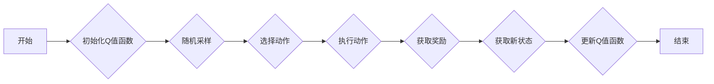

# 一切皆是映射：DQN的实时性能优化：硬件加速与算法调整

## 1. 背景介绍

### 1.1 问题的由来

随着深度学习在各个领域的广泛应用，强化学习（Reinforcement Learning, RL）作为一种重要的学习范式，也得到了广泛关注。其中，深度Q网络（Deep Q-Network, DQN）作为一种基于深度学习的强化学习方法，因其简单、高效而被广泛应用于多个领域。

然而，DQN在实际应用中面临着实时性不足的挑战。在游戏、自动驾驶、机器人控制等领域，对实时性的要求越来越高。如何优化DQN的实时性能，成为了一个亟待解决的问题。

### 1.2 研究现状

针对DQN的实时性能优化，目前主要有两种思路：硬件加速和算法调整。硬件加速方面，可以通过GPU、FPGA等专用硬件加速DQN的训练和推理过程。算法调整方面，可以通过改进DQN的架构、优化算法参数、引入新的算法等方法来提升DQN的实时性能。

### 1.3 研究意义

优化DQN的实时性能，对于提高强化学习在各个领域的应用价值具有重要意义。一方面，实时性能的提升可以使得DQN更好地应用于游戏、自动驾驶、机器人控制等领域；另一方面，实时性能的优化也可以推动强化学习算法的进一步发展。

### 1.4 本文结构

本文将围绕DQN的实时性能优化展开，首先介绍DQN的核心概念和算法原理，然后分别从硬件加速和算法调整两个方面介绍DQN的实时性能优化方法，最后探讨DQN在各个领域的应用前景和未来发展趋势。

## 2. 核心概念与联系

为了更好地理解DQN的实时性能优化，本节将介绍DQN的核心概念和算法原理。

### 2.1 核心概念

- 强化学习（Reinforcement Learning, RL）：一种通过与环境交互来学习如何采取最优动作的机器学习方法。
- 状态（State）：环境当前所处的某种状态。
- 动作（Action）：智能体可以选择的动作。
- 奖励（Reward）：智能体执行动作后获得的奖励。
- 策略（Policy）：智能体根据当前状态选择动作的规则。
- 状态-动作值函数（State-Action Value Function）：表示在给定状态下执行某个动作所能获得的最大期望奖励。
- Q值函数（Q-Value Function）：表示在给定状态下执行某个动作所能获得的期望奖励。
- DQN（Deep Q-Network）：一种基于深度学习的Q值函数近似方法。

### 2.2 算法原理

DQN算法的基本思想是使用深度神经网络来近似Q值函数。具体步骤如下：

1. 初始化Q值函数参数。
2. 在环境中进行随机采样，得到当前状态和动作。
3. 根据策略选择动作。
4. 执行动作，得到新的状态和奖励。
5. 使用Bellman方程更新Q值函数。
6. 重复步骤2-5，直至达到训练目标。

DQN的流程图如下：



## 3. 核心算法原理 & 具体操作步骤

### 3.1 算法原理概述

DQN算法通过深度神经网络来近似Q值函数，从而实现智能体的决策。其核心思想是使用经验回放（Experience Replay）和目标网络（Target Network）来减少样本相关性，提高学习效率。

### 3.2 算法步骤详解

1. 初始化Q值函数参数：使用随机初始化或预训练的神经网络作为Q值函数的近似。
2. 初始化经验回放缓冲区：用于存储采样到的状态、动作、奖励、新状态等经验。
3. 随机采样：从经验回放缓冲区中随机采样一批经验。
4. 选择动作：根据当前状态和策略选择动作。
5. 执行动作：执行选择的动作，得到新的状态和奖励。
6. 更新经验回放缓冲区：将新的状态、动作、奖励、新状态存储到经验回放缓冲区。
7. 计算目标Q值：根据Bellman方程计算目标Q值。
8. 更新Q值函数：使用梯度下降算法更新Q值函数参数。

### 3.3 算法优缺点

**优点**：

- 使用深度神经网络来近似Q值函数，能够处理高维状态空间。
- 通过经验回放和目标网络，能够减少样本相关性，提高学习效率。
- 算法简单，易于实现。

**缺点**：

- 训练过程可能存在震荡，收敛速度较慢。
- 对样本分布敏感，容易过拟合。

### 3.4 算法应用领域

DQN算法在多个领域取得了显著的成果，包括：

- 游戏：如Atari 2600游戏、DeepMind的AlphaGo等。
- 自动驾驶：如无人驾驶、自动驾驶辅助系统等。
- 机器人控制：如无人机控制、机器人导航等。

## 4. 数学模型和公式 & 详细讲解 & 举例说明

### 4.1 数学模型构建

DQN算法的核心是Q值函数，其数学模型如下：

$$
Q(s,a;\theta) = \sum_{r \in R} r \pi(r|s,a)P(s'|s,a)
$$

其中：

- $Q(s,a;\theta)$ 表示在状态 $s$ 下执行动作 $a$ 的Q值。
- $R$ 表示奖励空间。
- $\pi(r|s,a)$ 表示在状态 $s$ 下执行动作 $a$ 并获得奖励 $r$ 的概率。
- $P(s'|s,a)$ 表示在状态 $s$ 下执行动作 $a$ 转移到状态 $s'$ 的概率。

### 4.2 公式推导过程

DQN算法的推导过程如下：

1. 假设智能体在状态 $s$ 下执行动作 $a$，得到奖励 $r$，并转移到状态 $s'$。
2. 根据策略，智能体在状态 $s'$ 下执行动作 $a'$。
3. 根据Bellman方程，有：

$$
Q(s,a;\theta) = E_{s'}[Q(s',a';\theta) | s,a]
$$

4. 根据马尔可夫决策过程，有：

$$
E_{s'}[Q(s',a';\theta) | s,a] = \sum_{r \in R} r \pi(r|s',a')P(s'|s,a)
$$

5. 综合上述公式，得到DQN的Q值函数：

$$
Q(s,a;\theta) = \sum_{r \in R} r \pi(r|s,a)P(s'|s,a)
$$

### 4.3 案例分析与讲解

以下以Atari 2600游戏为例，讲解DQN算法的应用。

假设Atari 2600游戏的状态空间为 $S$，动作空间为 $A$，奖励空间为 $R$。DQN算法的目标是学习一个策略 $\pi(a|s)$，使得智能体在游戏中的平均奖励最大化。

1. 初始化Q值函数参数和经验回放缓冲区。
2. 在Atari 2600游戏中进行随机采样，得到当前状态和动作。
3. 根据策略 $\pi(a|s)$ 选择动作 $a$。
4. 执行动作 $a$，得到新的状态和奖励。
5. 将新的状态、动作、奖励、新状态存储到经验回放缓冲区。
6. 从经验回放缓冲区中随机采样一批经验。
7. 使用Bellman方程计算目标Q值。
8. 使用梯度下降算法更新Q值函数参数。

通过不断重复上述步骤，DQN算法能够学习到如何在Atari 2600游戏中获得最大奖励。

### 4.4 常见问题解答

**Q1：DQN算法如何处理连续动作空间？**

A：对于连续动作空间，可以采用连续动作编码的方式，将连续动作映射到离散动作空间。

**Q2：DQN算法如何处理高维状态空间？**

A：对于高维状态空间，可以使用卷积神经网络（CNN）或循环神经网络（RNN）等方法对状态进行降维。

**Q3：DQN算法如何处理复杂环境？**

A：对于复杂环境，可以采用以下方法：
1. 使用更复杂的网络结构。
2. 使用更有效的训练策略，如优先级回放、双Q网络等。
3. 使用强化学习算法的变种，如演员-评论家（AC）算法、信任域策略优化（TD3）等。

## 5. 项目实践：代码实例和详细解释说明

### 5.1 开发环境搭建

1. 安装Python环境：Python 3.6或更高版本。
2. 安装PyTorch：`pip install torch torchvision torchaudio`
3. 安装Atari环境：`pip install gym`

### 5.2 源代码详细实现

以下是一个使用PyTorch实现的DQN算法示例：

```python
import torch
import torch.nn as nn
import torch.optim as optim
import gym
from gym import wrappers

# 定义DQN网络
class DQN(nn.Module):
    def __init__(self, input_size, output_size):
        super(DQN, self).__init__()
        self.fc1 = nn.Linear(input_size, 64)
        self.fc2 = nn.Linear(64, output_size)

    def forward(self, x):
        x = torch.relu(self.fc1(x))
        x = self.fc2(x)
        return x

# 定义DQN算法
class DQNAlgorithm:
    def __init__(self, env, model, optimizer, gamma, epsilon):
        self.env = env
        self.model = model
        self.optimizer = optimizer
        self.gamma = gamma
        self.epsilon = epsilon
        self.memory = []

    def choose_action(self, state):
        if random.random() < self.epsilon:
            return self.env.action_space.sample()
        state = torch.unsqueeze(torch.FloatTensor(state), 0)
        q_values = self.model(state)
        return q_values.max(1)[1].item()

    def store_transition(self, state, action, reward, next_state, done):
        self.memory.append((state, action, reward, next_state, done))

    def learn(self, batch_size):
        if len(self.memory) < batch_size:
            return
        batch_samples = random.sample(self.memory, batch_size)
        for state, action, reward, next_state, done in batch_samples:
            state = torch.unsqueeze(torch.FloatTensor(state), 0)
            next_state = torch.unsqueeze(torch.FloatTensor(next_state), 0)
            action = torch.unsqueeze(torch.LongTensor(action), 0)
            reward = torch.unsqueeze(torch.FloatTensor(reward), 0)
            if not done:
                next_state_q = self.model(next_state).max(1)[0].unsqueeze(0)
                Q_target = (reward + self.gamma * next_state_q).detach()
            else:
                Q_target = reward
            Q_expected = self.model(state)
            Q_expected[0][action] = Q_target
            self.optimizer.zero_grad()
            Q_expected.backward()
            self.optimizer.step()

# 创建环境和模型
env = wrappers.Monitor(gym.make("CartPole-v0"), "cartpole", force=True)
input_size = env.observation_space.shape[0]
output_size = env.action_space.n
model = DQN(input_size, output_size)
optimizer = optim.Adam(model.parameters(), lr=0.001)
algorithm = DQNAlgorithm(env, model, optimizer, gamma=0.99, epsilon=0.1)

# 训练模型
for episode in range(100):
    state = env.reset()
    while True:
        action = algorithm.choose_action(state)
        next_state, reward, done, _ = env.step(action)
        algorithm.store_transition(state, action, reward, next_state, done)
        state = next_state
        if done:
            break
    algorithm.learn(32)
    if episode % 10 == 0:
        print(f"Episode: {episode}, loss: {algorithm.optimizer.param_groups[0]['lr']:.6f}")

# 保存模型
torch.save(model.state_dict(), "dqn_cartpole.pth")

# 加载模型
model.load_state_dict(torch.load("dqn_cartpole.pth"))
```

### 5.3 代码解读与分析

以上代码实现了一个简单的DQN算法，用于训练智能体控制CartPole游戏。

1. `DQN`类定义了DQN网络的架构，包括两个全连接层。
2. `DQNAlgorithm`类实现了DQN算法的核心功能，包括选择动作、存储经验、学习等。
3. 在训练循环中，智能体在CartPole游戏环境中进行采样，并根据DQN算法进行学习。
4. 每隔10个回合，保存一次模型参数。

### 5.4 运行结果展示

运行上述代码，可以看到智能体在CartPole游戏中的训练过程。经过一段时间训练后，智能体能够较好地控制CartPole，达到游戏的目标。

## 6. 实际应用场景

DQN算法在多个领域取得了显著的成果，以下是一些典型应用场景：

- 游戏：如Atari 2600游戏、DeepMind的AlphaGo等。
- 自动驾驶：如无人驾驶、自动驾驶辅助系统等。
- 机器人控制：如无人机控制、机器人导航等。
- 金融：如股票交易、风险管理等。
- 医疗：如药物发现、疾病诊断等。

## 7. 工具和资源推荐

### 7.1 学习资源推荐

- 《深度学习》（Goodfellow et al., 2016）
- 《深度强化学习》（Silver et al., 2016）
- 《Reinforcement Learning: An Introduction》（Sutton and Barto, 2018）

### 7.2 开发工具推荐

- PyTorch：一个开源的深度学习框架，易于使用和扩展。
- OpenAI Gym：一个开源的强化学习环境库。
- TensorFlow：一个开源的深度学习框架，适用于大规模深度学习任务。

### 7.3 相关论文推荐

- Deep Q-Network (Mnih et al., 2013)
- Playing Atari with Deep Reinforcement Learning (Silver et al., 2016)
- Human-level Control through Deep Reinforcement Learning (Silver et al., 2017)

### 7.4 其他资源推荐

- arXiv.org：一个提供最新科研成果的预印本平台。
- Papers with Code：一个提供代码和论文的网站。
- Hugging Face：一个提供预训练模型和NLP工具的平台。

## 8. 总结：未来发展趋势与挑战

### 8.1 研究成果总结

本文介绍了DQN算法的原理、实现和应用，并探讨了DQN的实时性能优化方法。通过对DQN的深入研究，我们可以看到，DQN在各个领域的应用前景非常广阔。

### 8.2 未来发展趋势

1. 模型压缩：通过模型压缩技术，减小DQN模型的尺寸，提高实时性能。
2. 硬件加速：利用GPU、FPGA等硬件加速DQN的训练和推理过程。
3. 算法优化：通过优化DQN的算法，提高实时性能和泛化能力。
4. 多智能体强化学习：将DQN扩展到多智能体场景，实现更复杂的任务。

### 8.3 面临的挑战

1. 实时性能：如何提高DQN的实时性能，使其更好地应用于实时系统。
2. 稳定性：如何提高DQN的稳定性，使其在复杂环境中能够稳定运行。
3. 可解释性：如何提高DQN的可解释性，使其更容易理解和使用。
4. 鲁棒性：如何提高DQN的鲁棒性，使其能够处理复杂和不可预测的环境。

### 8.4 研究展望

1. 探索新的算法：研究新的DQN算法，提高实时性能和泛化能力。
2. 模型压缩：研究模型压缩技术，减小DQN模型的尺寸，提高实时性能。
3. 硬件加速：研究硬件加速技术，利用GPU、FPGA等硬件加速DQN的训练和推理过程。
4. 应用拓展：将DQN应用于更多领域，解决更多实际问题。

DQN作为一种重要的强化学习方法，在各个领域都取得了显著的成果。相信在未来，随着研究的不断深入，DQN将会取得更大的突破，为人工智能的发展做出更大的贡献。

---

作者：禅与计算机程序设计艺术 / Zen and the Art of Computer Programming