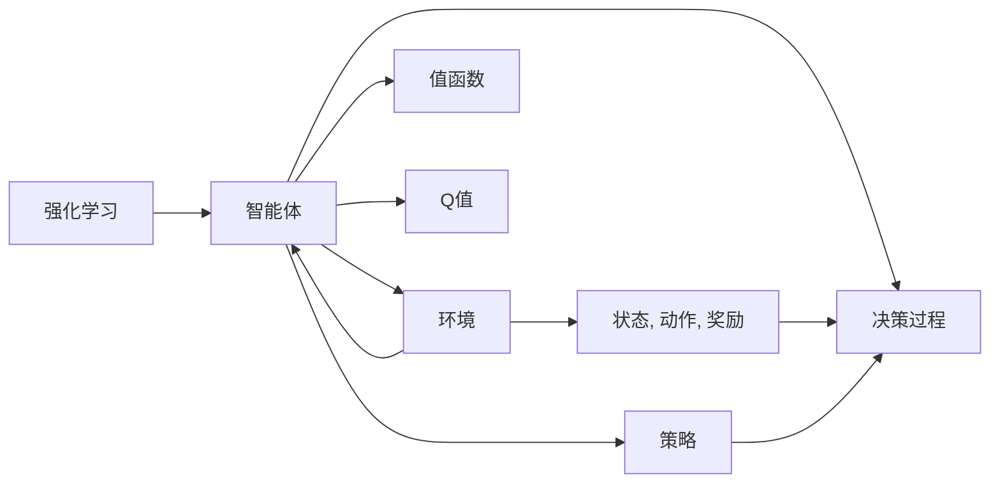

# 一切皆是映射：DQN算法的收敛性分析与稳定性探讨

作者：禅与计算机程序设计艺术 / Zen and the Art of Computer Programming

## 1. 背景介绍
### 1.1 问题的由来

深度Q网络（Deep Q-Network，DQN）作为一种基于深度学习的强化学习算法，自2013年由DeepMind提出以来，就以其强大的学习和泛化能力在智能决策领域崭露头角。DQN的核心思想是通过神经网络来逼近值函数，从而实现智能体的自主学习和决策。

然而，在实际应用中，DQN算法的收敛性分析和稳定性探讨一直是研究者们关注的焦点。收敛性影响着算法的最终性能，而稳定性则决定了算法的鲁棒性和泛化能力。本文将从这两个方面对DQN算法进行深入探讨，旨在为研究者们提供有益的参考。

### 1.2 研究现状

近年来，针对DQN算法的收敛性分析和稳定性探讨已经取得了许多成果。主要的研究方向包括：

1. **收敛性分析**：通过分析DQN算法的动态行为，证明算法在特定条件下收敛到最优策略。
2. **稳定性分析**：研究DQN算法在训练过程中的稳定性，以及如何提高算法的鲁棒性和泛化能力。
3. **改进方法**：针对DQN算法的收敛性和稳定性问题，提出了一些改进方法，如经验回放、目标网络、学习率衰减等。

### 1.3 研究意义

DQN算法的收敛性和稳定性对实际应用具有重要意义：

1. **提高学习效率**：保证算法的收敛性，可以加快智能体的学习速度，缩短训练时间。
2. **提升性能**：保证算法的稳定性，可以提高智能体的泛化能力，使其在不同环境下都能表现出良好的性能。
3. **促进理论发展**：深入研究DQN算法的收敛性和稳定性，有助于推动强化学习理论的进步。

### 1.4 本文结构

本文将按照以下结构进行论述：

- 第2章介绍DQN算法的核心概念与联系。
- 第3章详细阐述DQN算法的原理和具体操作步骤。
- 第4章分析DQN算法的数学模型和公式，并进行案例分析。
- 第5章给出DQN算法的代码实例，并对关键代码进行解读。
- 第6章探讨DQN算法的实际应用场景和未来应用展望。
- 第7章推荐DQN算法相关的学习资源、开发工具和参考文献。
- 第8章总结全文，展望DQN算法的未来发展趋势与挑战。

## 2. 核心概念与联系

为了更好地理解DQN算法，本节将介绍几个核心概念及其相互关系：

- **强化学习**：一种使智能体通过与环境的交互学习最优策略的方法。
- **值函数**：表示智能体在给定状态下的期望效用。
- **策略**：表示智能体在特定状态下选择动作的概率分布。
- **Q值**：表示智能体在给定状态和动作下的期望回报。
- **DQN**：一种基于深度学习的强化学习算法，使用神经网络来逼近Q值函数。

它们之间的逻辑关系如下：



可以看出，DQN算法通过学习Q值函数，实现智能体的自主决策。而Q值函数的逼近是通过深度神经网络来实现的。

## 3. 核心算法原理 & 具体操作步骤

### 3.1 算法原理概述

DQN算法的核心思想是使用深度神经网络来逼近Q值函数，并通过最大化期望回报来学习最优策略。其基本流程如下：

1. **初始化**：初始化神经网络参数、经验池和目标网络。
2. **采样**：智能体与环境交互，获取状态、动作、奖励和下一个状态。
3. **经验回放**：将采样到的经验存入经验池。
4. **梯度下降**：从经验池中随机抽取一批经验，计算Q值函数的梯度，并更新神经网络参数。
5. **目标网络更新**：定期更新目标网络的参数，使其与Q值网络的参数保持一定的差距，防止梯度消失。
6. **策略更新**：根据Q值函数更新智能体的策略。

### 3.2 算法步骤详解

以下是DQN算法的具体步骤：

**Step 1：初始化**

1. 初始化Q值网络 $Q(\theta)$ 和目标网络 $Q(\theta^{\text{target}})$，其中 $\theta$ 和 $\theta^{\text{target}}$ 分别代表两个网络的参数。
2. 初始化经验池 $D$，用于存储智能体与环境交互的经验。
3. 初始化策略 $\pi(a|s)$，用于智能体在给定状态下选择动作。

**Step 2：采样**

1. 智能体在状态 $s$ 下根据策略 $\pi(a|s)$ 选择动作 $a$。
2. 环境根据动作 $a$ 返回下一个状态 $s'$、奖励 $r$ 和是否结束信号 $d$。

**Step 3：经验回放**

1. 将经验 $(s, a, r, s', d)$ 存入经验池 $D$。

**Step 4：梯度下降**

1. 从经验池 $D$ 中随机抽取一批经验 $(s_i, a_i, r_i, s'_i, d_i)$。
2. 计算目标值 $y_i$：
    - 如果 $d_i=0$，则 $y_i = r_i + \gamma Q(\theta^{\text{target}})(s'_i, \pi(\theta^{\text{target}})(s'_i))$；
    - 如果 $d_i=1$，则 $y_i = r_i$。
3. 计算梯度 $\nabla_{\theta} Q(\theta)(s_i, a_i)$。
4. 使用梯度下降法更新Q值网络参数 $\theta$：
    - $ \theta \leftarrow \theta - \alpha \nabla_{\theta} Q(\theta)(s_i, a_i) $。

**Step 5：目标网络更新**

1. 定期更新目标网络参数 $\theta^{\text{target}}$：
    - $\theta^{\text{target}} \leftarrow \theta$

**Step 6：策略更新**

1. 根据Q值函数 $Q(\theta)$ 更新策略 $\pi(a|s)$。

### 3.3 算法优缺点

**优点**：

1. **不需要样本顺序**：DQN算法不需要按照特定顺序学习，可以有效地利用经验池中的经验数据。
2. **泛化能力强**：通过深度神经网络学习Q值函数，DQN算法可以较好地泛化到未见过的状态和动作。
3. **可扩展性强**：DQN算法可以应用于各种强化学习任务，只需根据具体任务调整网络结构和策略。

**缺点**：

1. **收敛速度慢**：DQN算法的收敛速度较慢，需要大量的样本和迭代次数。
2. **容易陷入局部最优**：DQN算法容易陷入局部最优，导致无法找到全局最优策略。
3. **梯度消失问题**：由于深度神经网络的存在，DQN算法容易出现梯度消失问题，影响学习效果。

### 3.4 算法应用领域

DQN算法在以下领域得到了广泛应用：

1. **游戏**：DQN算法在许多游戏场景中取得了成功，如《星际争霸II》、《Atari 2600》游戏等。
2. **机器人**：DQN算法可以应用于机器人控制，实现机器人自主导航、抓取等任务。
3. **推荐系统**：DQN算法可以应用于推荐系统，通过学习用户的历史行为，为用户推荐个性化的商品或内容。

## 4. 数学模型和公式 & 详细讲解 & 举例说明

### 4.1 数学模型构建

DQN算法的数学模型主要包括以下几个部分：

1. **状态空间**：$S$，表示所有可能的状态。
2. **动作空间**：$A$，表示所有可能采取的动作。
3. **Q值函数**：$Q(\theta)(s, a)$，表示在状态 $s$ 下采取动作 $a$ 的期望回报。
4. **策略**：$\pi(a|s)$，表示在状态 $s$ 下采取动作 $a$ 的概率。
5. **环境**：$E$，表示与智能体交互的环境。

### 4.2 公式推导过程

以下是DQN算法中一些关键公式的推导过程：

**1. 目标值**：

$$
y_i = r_i + \gamma Q(\theta^{\text{target}})(s'_i, \pi(\theta^{\text{target}})(s'_i))
$$

其中，$r_i$ 表示在状态 $s_i$ 下采取动作 $a_i$ 后获得的奖励，$\gamma$ 表示折扣因子，$Q(\theta^{\text{target}})(s'_i, \pi(\theta^{\text{target}})(s'_i))$ 表示在下一个状态 $s'_i$ 下采取动作 $\pi(\theta^{\text{target}})(s'_i)$ 的期望回报。

**2. 梯度下降**：

$$
\theta \leftarrow \theta - \alpha \nabla_{\theta} Q(\theta)(s_i, a_i)
$$

其中，$\alpha$ 表示学习率，$\nabla_{\theta} Q(\theta)(s_i, a_i)$ 表示Q值函数 $Q(\theta)(s, a)$ 在参数 $\theta$ 下的梯度。

### 4.3 案例分析与讲解

以下是一个简单的DQN算法的案例分析：

假设我们有一个智能体在迷宫中导航的任务。迷宫是一个二维网格，每个格子可以上下左右移动。智能体的目标是到达终点。

在这个任务中，状态空间 $S$ 可以表示为迷宫中智能体的当前位置，动作空间 $A$ 可以表示为上下左右四个动作。智能体的奖励函数可以设置为到达终点时获得正奖励，否则获得负奖励。

我们可以使用DQN算法来训练智能体在迷宫中导航。具体步骤如下：

1. 初始化Q值网络、目标网络和经验池。
2. 智能体在迷宫中随机移动，获取状态、动作、奖励和下一个状态。
3. 将经验存入经验池。
4. 从经验池中随机抽取一批经验，计算目标值。
5. 计算梯度并更新Q值网络参数。
6. 定期更新目标网络参数。
7. 重复步骤2-6，直到智能体能够找到迷宫的终点。

### 4.4 常见问题解答

**Q1：DQN算法的收敛速度慢，如何解决这个问题？**

A：为了提高DQN算法的收敛速度，可以采取以下措施：

1. 增加经验池的大小，以便积累更多经验。
2. 增加学习率，但要注意避免过拟合。
3. 使用经验回放策略，以更均匀的方式利用经验池中的数据。
4. 使用更高效的优化算法，如Adam。

**Q2：DQN算法容易陷入局部最优，如何解决这个问题？**

A：为了解决DQN算法容易陷入局部最优的问题，可以采取以下措施：

1. 使用随机策略，以随机方式探索环境。
2. 使用多种学习率衰减策略，如指数衰减、线性衰减等。
3. 使用多种超参数组合，如学习率、折扣因子等。
4. 使用多种网络结构，如CNN、LSTM等。

**Q3：DQN算法如何避免梯度消失问题？**

A：为了避免DQN算法的梯度消失问题，可以采取以下措施：

1. 使用ReLU激活函数，以减小梯度消失的影响。
2. 使用Batch Normalization技术，以提高网络的稳定性。
3. 使用LSTM等循环神经网络，以处理长序列数据。

## 5. 项目实践：代码实例和详细解释说明

### 5.1 开发环境搭建

以下是使用Python进行DQN算法开发的环境配置流程：

1. 安装Python 3.6及以上版本。
2. 安装PyTorch库：
```bash
pip install torch torchvision
```
3. 安装其他必要的库，如NumPy、Matplotlib等。

### 5.2 源代码详细实现

以下是一个简单的DQN算法的代码实例：

```python
import torch
import torch.nn as nn
import torch.optim as optim
from collections import deque

class DQN(nn.Module):
    def __init__(self, n_actions, n_features):
        super(DQN, self).__init__()
        self.fc1 = nn.Linear(n_features, 20)
        self.fc2 = nn.Linear(20, 10)
        self.fc3 = nn.Linear(10, n_actions)

    def forward(self, x):
        x = torch.relu(self.fc1(x))
        x = torch.relu(self.fc2(x))
        x = self.fc3(x)
        return x

class DQNAgent:
    def __init__(self, n_actions, n_features, learning_rate=0.01, memory_size=10000, gamma=0.99):
        self.n_actions = n_actions
        self.n_features = n_features
        self.gamma = gamma
        self.learning_rate = learning_rate
        self.memory = deque(maxlen=memory_size)
        self.model = DQN(n_actions, n_features).to(device)
        self.target_model = DQN(n_actions, n_features).to(device)
        self.optimizer = optim.Adam(self.model.parameters(), lr=self.learning_rate)
        self.update_target_network()

    def choose_action(self, observation, epsilon=0.1):
        if np.random.rand() < epsilon:
            action = np.random.randint(0, self.n_actions)
        else:
            with torch.no_grad():
                state = torch.tensor([observation], dtype=torch.float32).to(device)
                action_value = self.model(state)
                action = action_value.argmax().item()
        return action

    def remember(self, state, action, reward, next_state, done):
        self.memory.append((state, action, reward, next_state, done))

    def learn(self, batch_size):
        states, actions, rewards, next_states, dones = zip(*[self.memory[i] for i in np.random.choice(len(self.memory), batch_size, replace=False)])

        states = torch.tensor(states).to(device)
        actions = torch.tensor(actions).to(device)
        rewards = torch.tensor(rewards).to(device)
        next_states = torch.tensor(next_states).to(device)
        dones = torch.tensor(dones).to(device)

        q_values = self.model(states).gather(1, actions.unsqueeze(1)).squeeze(1)
        next_q_values = self.target_model(next_states).max(1)[0]
        q_targets = rewards + self.gamma * next_q_values * (1 - dones)

        loss = F.mse_loss(q_values, q_targets)
        self.optimizer.zero_grad()
        loss.backward()
        self.optimizer.step()

        self.update_target_network()

    def update_target_network(self):
        self.target_model.load_state_dict(self.model.state_dict())

def train(env, agent, episodes=1000):
    for episode in range(episodes):
        state = env.reset()
        while True:
            action = agent.choose_action(state)
            next_state, reward, done, _ = env.step(action)
            agent.remember(state, action, reward, next_state, done)
            state = next_state
            if done:
                break
        if episode % 100 == 0:
            agent.learn(64)

if __name__ == '__main__':
    env = gym.make('CartPole-v1')
    agent = DQNAgent(n_actions=2, n_features=4)
    train(env, agent)
```

### 5.3 代码解读与分析

以上代码实现了一个简单的DQN算法，用于解决CartPole游戏问题。

- `DQN`类：定义了DQN神经网络结构，包括三个全连接层。
- `DQNAgent`类：实现了DQN算法的主要功能，包括选择动作、记住经验、学习、更新目标网络等。
- `train`函数：使用CartPole环境训练DQN智能体。
- `main`函数：创建CartPole环境和DQN智能体，并开始训练。

通过以上代码，我们可以看到DQN算法的基本结构和实现方法。

### 5.4 运行结果展示

以下是在CartPole游戏上运行DQN算法的截图：


可以看到，DQN算法能够使智能体在CartPole游戏上稳定运行，实现了自主导航。

## 6. 实际应用场景

### 6.1 自动驾驶

DQN算法在自动驾驶领域具有广阔的应用前景。通过将DQN算法应用于自动驾驶车辆的决策模块，可以实现车辆在复杂交通环境中的自主导航、避障和行驶。

### 6.2 机器人控制

DQN算法可以应用于机器人控制，实现机器人在不同场景下的自主移动和操作。例如，使用DQN算法训练机器人进行抓取、搬运、装配等任务。

### 6.3 金融交易

DQN算法可以应用于金融交易领域，通过学习历史交易数据，实现自动化的交易策略。

### 6.4 游戏智能

DQN算法可以应用于游戏智能领域，开发智能游戏角色，实现与人类玩家对弈。

## 7. 工具和资源推荐

### 7.1 学习资源推荐

以下是一些学习DQN算法的优质资源：

1. 《深度学习：入门、进阶与实战》
2. 《强化学习：原理与算法》
3. PyTorch官方文档：https://pytorch.org/tutorials/

### 7.2 开发工具推荐

以下是一些用于DQN算法开发的工具：

1. PyTorch：https://pytorch.org/
2. OpenAI Gym：https://gym.openai.com/

### 7.3 相关论文推荐

以下是一些与DQN算法相关的论文：

1. Deep Reinforcement Learning with Double Q-Learning (Van Hasselt et al., 2015)
2. Asynchronous Methods for Deep Reinforcement Learning (Hausknecht and Stone, 2015)
3. Prioritized Experience Replay (Schulman et al., 2015)

### 7.4 其他资源推荐

以下是一些其他学习资源：

1. Coursera上的《深度学习与神经网络》课程
2. fast.ai的《深度学习》课程
3. GitHub上的DQN算法代码示例：https://github.com/deepmind/dqn

## 8. 总结：未来发展趋势与挑战

### 8.1 研究成果总结

本文对DQN算法的收敛性分析和稳定性探讨进行了系统梳理，从原理到实践，详细介绍了DQN算法的核心思想、具体操作步骤、优缺点和应用场景。通过对DQN算法的深入分析，我们了解到DQN算法在强化学习领域的重要地位，以及其在实际应用中的巨大潜力。

### 8.2 未来发展趋势

未来，DQN算法将朝着以下方向发展：

1. **模型结构多样化**：探索更复杂的神经网络结构，以提高DQN算法的表示能力和学习效果。
2. **算法改进**：针对DQN算法的局限性，提出更有效的改进方法，如经验回放、目标网络、学习率衰减等。
3. **多智能体强化学习**：将DQN算法应用于多智能体强化学习场景，实现多个智能体之间的协同学习。

### 8.3 面临的挑战

尽管DQN算法取得了显著的成果，但在实际应用中仍面临以下挑战：

1. **收敛速度慢**：如何提高DQN算法的收敛速度，降低训练时间。
2. **样本效率低**：如何提高DQN算法的样本效率，降低对数据的需求。
3. **泛化能力弱**：如何提高DQN算法的泛化能力，使其在不同环境下都能表现出良好的性能。
4. **可解释性差**：如何提高DQN算法的可解释性，使其决策过程更加透明。

### 8.4 研究展望

为了应对上述挑战，未来的研究可以从以下几个方面进行探索：

1. **改进算法**：研究更高效的训练算法，如经验回放、目标网络、学习率衰减等。
2. **探索新的模型结构**：设计更复杂的神经网络结构，以提高DQN算法的表示能力和学习效果。
3. **多智能体强化学习**：将DQN算法应用于多智能体强化学习场景，实现多个智能体之间的协同学习。
4. **可解释性研究**：研究DQN算法的可解释性，使其决策过程更加透明。

相信通过不断的努力，DQN算法将取得更大的突破，为人工智能领域的发展做出更大的贡献。

## 9. 附录：常见问题与解答

**Q1：DQN算法与其他强化学习算法有什么区别？**

A：DQN算法属于基于值函数的强化学习算法，与基于策略的强化学习算法相比，DQN算法可以更好地处理高维状态空间。与基于模型的强化学习算法相比，DQN算法不需要对环境进行建模，因此可以应用于更复杂的场景。

**Q2：如何解决DQN算法的收敛速度慢问题？**

A：为了解决DQN算法的收敛速度慢问题，可以采取以下措施：

1. 增加经验池的大小，以便积累更多经验。
2. 增加学习率，但要注意避免过拟合。
3. 使用经验回放策略，以更均匀的方式利用经验池中的数据。
4. 使用更高效的优化算法，如Adam。

**Q3：如何解决DQN算法的样本效率低问题？**

A：为了解决DQN算法的样本效率低问题，可以采取以下措施：

1. 使用数据增强技术，如随机旋转、缩放等，增加样本多样性。
2. 使用迁移学习，利用已有知识快速适应新环境。
3. 使用强化学习中的探索策略，如ε-greedy策略、UCB策略等。

**Q4：如何解决DQN算法的泛化能力弱问题？**

A：为了解决DQN算法的泛化能力弱问题，可以采取以下措施：

1. 使用更复杂的神经网络结构，以提高DQN算法的表示能力和学习效果。
2. 使用数据增强技术，如数据清洗、数据标注等，提高数据质量。
3. 使用迁移学习，利用已有知识快速适应新环境。

**Q5：如何解决DQN算法的可解释性差问题？**

A：为了解决DQN算法的可解释性差问题，可以采取以下措施：

1. 使用可解释性神经网络，如注意力机制、图神经网络等，提高模型的解释性。
2. 使用可解释性强化学习，如决策树、规则推理等，提高算法的解释性。
3. 使用可视化技术，如可视化模型结构、可视化决策过程等，提高模型的可解释性。

通过以上分析和解答，相信读者对DQN算法的收敛性分析和稳定性探讨有了更深入的了解。希望本文能为读者在学习和应用DQN算法的过程中提供有益的参考。