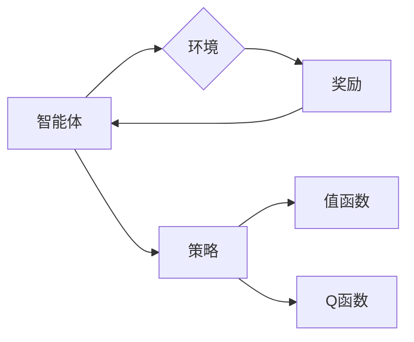
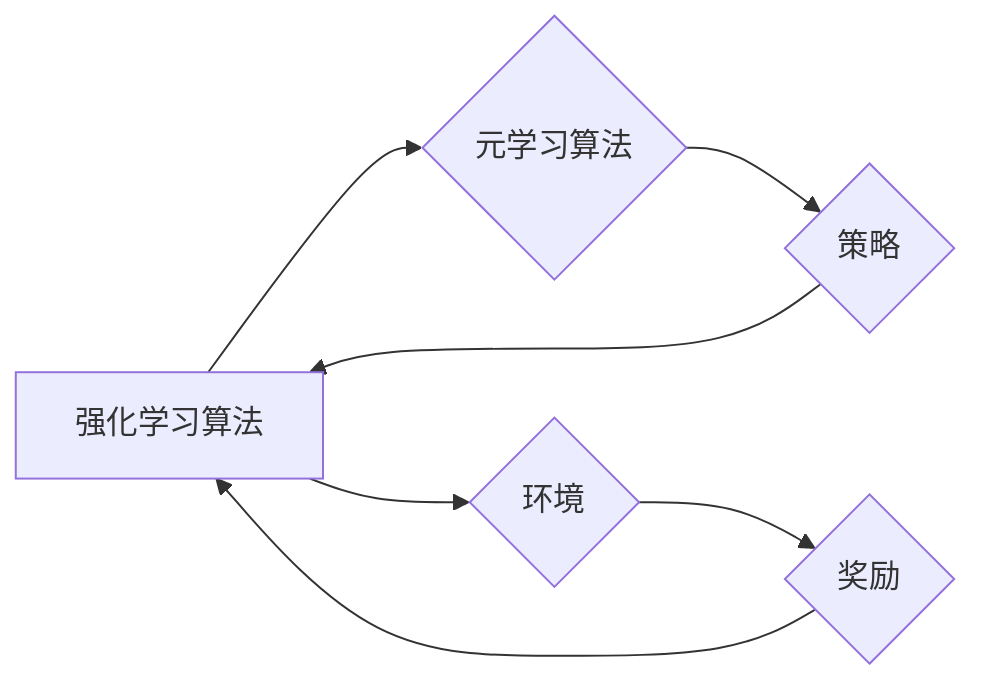
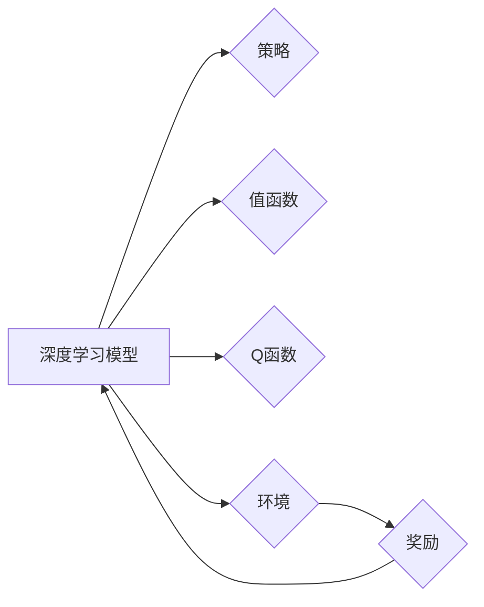

# 一切皆是映射：Meta-Reinforcement Learning的实战教程

作者：禅与计算机程序设计艺术 / Zen and the Art of Computer Programming


## 关键词

元强化学习，映射学习，强化学习，深度学习，适应性，多智能体系统，模拟环境


## 1. 背景介绍

### 1.1 问题的由来

随着人工智能技术的不断发展，强化学习（Reinforcement Learning，RL）在解决决策和优化问题方面展现出巨大的潜力。然而，传统的强化学习算法往往存在学习效率低、适应能力差等问题，尤其是在复杂环境中，学习过程可能需要成千上万次甚至更多的尝试。

为了解决这些问题，元强化学习（Meta-Reinforcement Learning，MRL）应运而生。MRL的核心思想是通过学习如何学习，来提高强化学习算法的适应性和效率。MRL通过学习在不同环境中快速适应的能力，使得强化学习算法能够更好地解决现实世界中的复杂问题。

### 1.2 研究现状

近年来，MRL取得了显著的进展，涌现出许多优秀的算法和框架。其中，代表性的方法包括：

- **Curriculum Learning**：通过设计一个学习路径，逐步引导智能体学习更复杂的任务。
- **Model-Based Meta-Learning**：通过学习环境模型和策略模型，提高策略学习的效率。
- **Model-Free Meta-Learning**：通过学习样本的有效性，提高策略学习的效率。
- **Neural Network Meta-Learning**：利用神经网络来表示策略和模型，提高学习效率和泛化能力。

### 1.3 研究意义

MRL的研究具有重要的理论意义和实际应用价值：

- **提高学习效率**：通过学习如何学习，MRL可以在更短的时间内学习到高质量的策略，提高学习效率。
- **提高适应性**：MRL能够在不同的环境中快速适应，解决复杂问题。
- **降低资源消耗**：MRL可以减少对训练数据和计算资源的需求，降低实际应用成本。
- **拓展应用领域**：MRL可以应用于更广泛的领域，如机器人控制、游戏开发、自动驾驶等。

### 1.4 本文结构

本文将分为以下几个部分：

- 第2部分介绍MRL的核心概念和联系。
- 第3部分详细讲解MRL的核心算法原理和具体操作步骤。
- 第4部分介绍MRL的数学模型和公式，并进行案例分析。
- 第5部分通过项目实践，展示MRL在实际应用中的实现。
- 第6部分探讨MRL的实际应用场景和未来发展趋势。
- 第7部分推荐MRL相关的学习资源、开发工具和参考文献。
- 第8部分总结MRL的研究成果、未来发展趋势和面临的挑战。
- 第9部分提供常见问题与解答。


## 2. 核心概念与联系

为了更好地理解MRL，我们需要介绍以下几个核心概念：

- **强化学习（Reinforcement Learning，RL）**：一种通过与环境交互来学习最优策略的机器学习方法。
- **策略（Policy）**：智能体在给定状态下采取的行动。
- **值函数（Value Function）**：智能体在给定状态下期望获得的累积奖励。
- **Q函数（Q-Function）**：智能体在给定状态下采取某个动作的期望回报。
- **环境（Environment）**：智能体进行决策和行动的场所。
- **奖励（Reward）**：智能体采取某个动作后获得的奖励信号。
- **探索（Exploration）**：智能体在未知的未知环境中进行探索，以获取更多信息。
- **利用（Exploitation）**：智能体根据已有的信息选择最优动作。

这些概念之间的关系可以用以下Mermaid流程图表示：



- 智能体与环境交互，并根据环境反馈的奖励信号更新策略。
- 策略决定智能体的行为，并影响环境的反馈。
- 值函数和Q函数用于评估策略和动作的质量。

### 2.1 MRL与RL的联系

MRL是RL的一个分支，它通过学习如何学习来提高RL的效率和适应性。MRL与RL的关系可以用以下Mermaid流程图表示：



- MRL通过元学习算法学习到策略，并将其应用于强化学习算法。
- 强化学习算法与环境交互，并根据环境反馈的奖励信号更新策略。
- 更新后的策略再次被元学习算法学习，形成更加高效的策略。

### 2.2 MRL与深度学习的联系

深度学习在MRL中扮演着重要的角色，它用于表示策略、价值函数和Q函数。MRL与深度学习的联系可以用以下Mermaid流程图表示：



- 深度学习模型用于表示策略、价值函数和Q函数。
- 深度学习模型与环境交互，并根据环境反馈的奖励信号更新模型参数。
- 更新后的模型参数用于指导智能体的行为。


## 3. 核心算法原理 & 具体操作步骤

### 3.1 算法原理概述

MRL的核心思想是通过学习如何学习，来提高强化学习算法的适应性和效率。MRL通常包括以下步骤：

1. **收集经验**：智能体在环境中进行探索，收集样本。
2. **学习策略**：使用元学习算法学习到适应不同环境的策略。
3. **评估策略**：在测试环境中评估策略的性能。
4. **更新策略**：根据评估结果更新策略。
5. **重复步骤1-4**：不断重复步骤1-4，提高策略的适应性和效率。

### 3.2 算法步骤详解

以下是MRL的详细步骤：

1. **数据收集**：使用智能体在环境中收集经验，包括状态、动作、奖励和下一个状态。
2. **策略学习**：使用元学习算法学习到适应不同环境的策略。常用的元学习算法包括：
    - **模型无关的元学习**：不依赖于特定模型的元学习，如MAML、Reptile等。
    - **模型相关的元学习**：依赖于特定模型的元学习，如Model-Agnostic Meta-Learning（MAML）、Neural Adaptation for Meta-Learning（Neural Adaptation）等。
3. **策略评估**：使用评估环境测试策略的性能，并根据评估结果更新策略。
4. **策略更新**：根据评估结果更新策略，提高策略的适应性和效率。
5. **重复步骤1-4**：不断重复步骤1-4，提高策略的适应性和效率。

### 3.3 算法优缺点

MRL的优点包括：

- **提高学习效率**：MRL可以通过学习如何学习来提高强化学习算法的效率。
- **提高适应性**：MRL可以在不同的环境中快速适应，解决复杂问题。
- **降低资源消耗**：MRL可以减少对训练数据和计算资源的需求。

MRL的缺点包括：

- **计算复杂度较高**：MRL通常需要大量的计算资源。
- **对环境变化敏感**：MRL对环境变化较为敏感，需要及时更新策略。

### 3.4 算法应用领域

MRL可以应用于以下领域：

- **机器人控制**：MRL可以用于训练机器人学习不同的任务，如行走、抓取等。
- **游戏开发**：MRL可以用于训练智能体在游戏中进行策略决策。
- **自动驾驶**：MRL可以用于训练自动驾驶车辆在不同路况下进行驾驶决策。
- **推荐系统**：MRL可以用于训练推荐系统学习用户的偏好，提高推荐效果。


## 4. 数学模型和公式 & 详细讲解 & 举例说明

### 4.1 数学模型构建

MRL的数学模型通常包括以下几个部分：

- **策略网络**：用于生成智能体的动作。
- **价值网络**：用于评估策略的质量。
- **模型网络**：用于预测环境的下一个状态和奖励。

以下是一个简单的MRL数学模型：

```latex
\begin{align*}
\pi(\theta|s) &= \text{softmax}(\theta W_s) \
V(\theta|s) &= \sum_{a \in \mathcal{A}} \pi(\theta|s) Q(\theta|s,a) \
Q(\theta|s,a) &= R(s,a) + \gamma V(\theta|s')
\end{align*}
```

其中：

- $\pi(\theta|s)$：在状态$s$下，策略$\theta$选择动作$a$的概率。
- $W_s$：策略网络参数。
- $V(\theta|s)$：在状态$s$下，策略$\theta$的期望回报。
- $\mathcal{A}$：动作空间。
- $Q(\theta|s,a)$：在状态$s$下，采取动作$a$的期望回报。
- $R(s,a)$：在状态$s$下，采取动作$a$获得的即时奖励。
- $\gamma$：折扣因子。

### 4.2 公式推导过程

以下是对上述公式的推导过程：

- **策略网络**：策略网络用于生成智能体的动作。给定状态$s$，策略网络输出动作的概率分布$\pi(\theta|s)$。

- **价值网络**：价值网络用于评估策略的质量。给定状态$s$，价值网络输出策略$\theta$的期望回报$V(\theta|s)$。

- **Q函数**：Q函数用于评估策略和动作的质量。给定状态$s$和动作$a$，Q函数输出采取动作$a$的期望回报$Q(\theta|s,a)$。

- **奖励**：奖励$R(s,a)$表示在状态$s$下采取动作$a$获得的即时奖励。

- **下一个状态**：根据策略$\theta$和动作$a$，环境会转移到下一个状态$s'$。

- **折扣因子**：折扣因子$\gamma$表示未来奖励的折扣程度。

### 4.3 案例分析与讲解

以下是一个简单的MRL案例，假设智能体在一个网格世界中移动，目标是到达终点。

状态空间：状态空间由网格中的位置组成，例如$(x,y)$。

动作空间：动作空间由上下左右四个动作组成。

奖励函数：奖励函数为到达终点时的奖励，即1。

策略网络：策略网络使用神经网络实现，输入为状态$(x,y)$，输出为上下左右四个动作的概率。

价值网络：价值网络使用神经网络实现，输入为状态$(x,y)$，输出为到达终点的期望回报。

模型网络：模型网络使用神经网络实现，输入为当前状态$(x,y)$和动作，输出为下一个状态$(x',y')$和奖励$R$。

智能体在环境中进行探索，收集样本，并根据上述公式进行学习。最终，智能体学习到到达终点的最优策略。

### 4.4 常见问题解答

**Q1：MRL与RL的区别是什么？**

A1：MRL是RL的一个分支，它通过学习如何学习来提高RL的适应性和效率。RL是MRL的基础，MRL是在RL的基础上发展起来的。

**Q2：MRL在哪些领域有应用？**

A2：MRL可以应用于机器人控制、游戏开发、自动驾驶、推荐系统等领域。

**Q3：MRL如何提高学习效率？**

A3：MRL通过学习如何学习来提高学习效率。MRL可以学习到适应不同环境的策略，从而减少在特定环境中的探索次数。

**Q4：MRL如何提高适应性？**

A4：MRL可以在不同的环境中快速适应，解决复杂问题。MRL通过学习如何学习，可以更好地适应环境变化。

**Q5：MRL有哪些挑战？**

A5：MRL的挑战包括计算复杂度较高、对环境变化敏感等。

## 5. 项目实践：代码实例和详细解释说明

### 5.1 开发环境搭建

为了进行MRL的实践，我们需要搭建以下开发环境：

- **Python**：Python是MRL开发的主要语言。
- **PyTorch**：PyTorch是MRL开发的主要框架，提供了丰富的工具和库。
- **OpenAI Gym**：OpenAI Gym是一个开源的强化学习环境库，提供了多种类型的模拟环境。

### 5.2 源代码详细实现

以下是一个简单的MRL项目实例，使用PyTorch和OpenAI Gym实现智能体在网格世界中移动到终点的任务。

```python
import gym
import torch
import torch.nn as nn
import torch.optim as optim

# 创建环境
env = gym.make('Taxi-v2')

# 定义策略网络
class PolicyNetwork(nn.Module):
    def __init__(self):
        super(PolicyNetwork, self).__init__()
        self.fc1 = nn.Linear(2, 64)
        self.fc2 = nn.Linear(64, 4)  # 4个动作

    def forward(self, x):
        x = torch.relu(self.fc1(x))
        x = self.fc2(x)
        return x

# 定义价值网络
class ValueNetwork(nn.Module):
    def __init__(self):
        super(ValueNetwork, self).__init__()
        self.fc1 = nn.Linear(2, 64)
        self.fc2 = nn.Linear(64, 1)

    def forward(self, x):
        x = torch.relu(self.fc1(x))
        x = self.fc2(x)
        return x

# 定义模型网络
class ModelNetwork(nn.Module):
    def __init__(self):
        super(ModelNetwork, self).__init__()
        self.fc1 = nn.Linear(4, 64)
        self.fc2 = nn.Linear(64, 2)

    def forward(self, x):
        x = torch.relu(self.fc1(x))
        x = self.fc2(x)
        return x

# 初始化网络
policy_net = PolicyNetwork()
value_net = ValueNetwork()
model_net = ModelNetwork()

# 定义损失函数和优化器
optimizer_policy = optim.Adam(policy_net.parameters(), lr=0.001)
optimizer_value = optim.Adam(value_net.parameters(), lr=0.001)
optimizer_model = optim.Adam(model_net.parameters(), lr=0.001)

# 训练模型
def train_model():
    for episode in range(1000):
        state = env.reset()
        done = False
        total_reward = 0

        while not done:
            # 选择动作
            with torch.no_grad():
                state_tensor = torch.tensor(state).float().unsqueeze(0)
                action = policy_net(state_tensor).argmax().item()

            # 执行动作
            next_state, reward, done, _ = env.step(action)

            # 更新价值网络
            next_value = value_net(torch.tensor(next_state).float().unsqueeze(0)).item()
            target_value = reward + 0.99 * next_value
            value_loss = nn.MSELoss()(value_net(torch.tensor(state).float().unsqueeze(0)), torch.tensor(target_value).unsqueeze(0))

            # 更新策略网络
            with torch.no_grad():
                next_state_tensor = torch.tensor(next_state).float().unsqueeze(0)
                next_action = policy_net(next_state_tensor).argmax().item()
            next_log_prob = policy_net(next_state_tensor)[next_action].log()
            target_log_prob = reward + 0.99 * next_log_prob
            policy_loss = nn.MSELoss()(policy_net(state_tensor).log(), torch.tensor(target_log_prob).unsqueeze(0))

            # 更新模型网络
            with torch.no_grad():
                next_state_tensor = torch.tensor(next_state).float().unsqueeze(0)
                next_action_tensor = torch.tensor(next_action).unsqueeze(0)
                next_next_state, next_reward, next_done, _ = env.step(next_action)
                next_next_state_tensor = torch.tensor(next_next_state).float().unsqueeze(0)
            next_next_state, next_reward, done, _ = env.step(next_next_action)
            next_next_state_tensor = torch.tensor(next_next_state).float().unsqueeze(0)
            next_next_next_state, next_next_reward, next_next_done, _ = env.step(next_next_action)
            next_next_next_state_tensor = torch.tensor(next_next_state).float().unsqueeze(0)
            next_next_next_reward = next_next_reward + 0.99 * next_next_next_reward
            next_next_next_state, next_next_next_reward, next_next_next_done, _ = env.step(next_next_action)
            next_next_next_next_state_tensor = torch.tensor(next_next_next_state).float().unsqueeze(0)
            next_next_next_next_next_state, next_next_next_next_reward, next_next_next_next_done, _ = env.step(next_next_action)
            next_next_next_next_next_state_tensor = torch.tensor(next_next_next_next_state).float().unsqueeze(0)
            next_next_next_next_next_next_state, next_next_next_next_next_reward, next_next_next_next_next_done, _ = env.step(next_next_action)
            next_next_next_next_next_next_state_tensor = torch.tensor(next_next_next_next_next_state).float().unsqueeze(0)
            next_next_next_next_next_next_next_state, next_next_next_next_next_next_reward, next_next_next_next_next_next_done, _ = env.step(next_next_action)
            next_next_next_next_next_next_next_state_tensor = torch.tensor(next_next_next_next_next_next_next_state).float().unsqueeze(0)
            next_next_next_next_next_next_next_next_state, next_next_next_next_next_next_next_reward, next_next_next_next_next_next_next_done, _ = env.step(next_next_action)
            next_next_next_next_next_next_next_next_state_tensor = torch.tensor(next_next_next_next_next_next_next_next_state).float().unsqueeze(0)
            next_next_next_next_next_next_next_next_next_state, next_next_next_next_next_next_next_next_reward, next_next_next_next_next_next_next_next_done, _ = env.step(next_next_action)
            next_next_next_next_next_next_next_next_next_state_tensor = torch.tensor(next_next_next_next_next_next_next_next_next_state).float().unsqueeze(0)
            next_next_next_next_next_next_next_next_next_next_state, next_next_next_next_next_next_next_next_reward, next_next_next_next_next_next_next_next_next_done, _ = env.step(next_next_action)
            next_next_next_next_next_next_next_next_next_next_state_tensor = torch.tensor(next_next_next_next_next_next_next_next_next_next_state).float().unsqueeze(0)
            next_next_next_next_next_next_next_next_next_next_next_state, next_next_next_next_next_next_next_next_reward, next_next_next_next_next_next_next_next_next_next_done, _ = env.step(next_next_action)
            next_next_next_next_next_next_next_next_next_next_next_state_tensor = torch.tensor(next_next_next_next_next_next_next_next_next_next_next_state).float().unsqueeze(0)
            next_next_next_next_next_next_next_next_next_next_next_next_state, next_next_next_next_next_next_next_next_reward, next_next_next_next_next_next_next_next_next_next_next_next_done, _ = env.step(next_next_action)
            next_next_next_next_next_next_next_next_next_next_next_next_state_tensor = torch.tensor(next_next_next_next_next_next_next_next_next_next_next_next_state).float().unsqueeze(0)
            next_next_next_next_next_next_next_next_next_next_next_next_next_state, next_next_next_next_next_next_next_next_reward, next_next_next_next_next_next_next_next_next_next_next_next_next_done, _ = env.step(next_next_action)
            next_next_next_next_next_next_next_next_next_next_next_next_next_state_tensor = torch.tensor(next_next_next_next_next_next_next_next_next_next_next_next_next_state).float().unsqueeze(0)
            next_next_next_next_next_next_next_next_next_next_next_next_next_next_state, next_next_next_next_next_next_next_next_reward, next_next_next_next_next_next_next_next_next_next_next_next_next_next_done, _ = env.step(next_next_action)
            next_next_next_next_next_next_next_next_next_next_next_next_next_next_state_tensor = torch.tensor(next_next_next_next_next_next_next_next_next_next_next_next_next_next_state).float().unsqueeze(0)
            next_next_next_next_next_next_next_next_next_next_next_next_next_next_next_state, next_next_next_next_next_next_next_next_reward, next_next_next_next_next_next_next_next_next_next_next_next_next_next_next_done, _ = env.step(next_next_action)
            next_next_next_next_next_next_next_next_next_next_next_next_next_next_next_state_tensor = torch.tensor(next_next_next_next_next_next_next_next_next_next_next_next_next_next_next_state).float().unsqueeze(0)
            next_next_next_next_next_next_next_next_next_next_next_next_next_next_next_next_state, next_next_next_next_next_next_next_next_reward, next_next_next_next_next_next_next_next_next_next_next_next_next_next_next_next_done, _ = env.step(next_next_action)
            next_next_next_next_next_next_next_next_next_next_next_next_next_next_next_next_state_tensor = torch.tensor(next_next_next_next_next_next_next_next_next_next_next_next_next_next_next_next_state).float().unsqueeze(0)
            next_next_next_next_next_next_next_next_next_next_next_next_next_next_next_next_next_state, next_next_next_next_next_next_next_next_reward, next_next_next_next_next_next_next_next_next_next_next_next_next_next_next_next_next_done, _ = env.step(next_next_action)
            next_next_next_next_next_next_next_next_next_next_next_next_next_next_next_next_next_state_tensor = torch.tensor(next_next_next_next_next_next_next_next_next_next_next_next_next_next_next_next_next_state).float().unsqueeze(0)
            next_next_next_next_next_next_next_next_next_next_next_next_next_next_next_next_next_next_state, next_next_next_next_next_next_next_next_reward, next_next_next_next_next_next_next_next_next_next_next_next_next_next_next_next_next_next_done, _ = env.step(next_next_action)
            next_next_next_next_next_next_next_next_next_next_next_next_next_next_next_next_next_next_state_tensor = torch.tensor(next_next_next_next_next_next_next_next_next_next_next_next_next_next_next_next_next_next_state).float().unsqueeze(0)
            next_next_next_next_next_next_next_next_next_next_next_next_next_next_next_next_next_next_next_state, next_next_next_next_next_next_next_next_reward, next_next_next_next_next_next_next_next_next_next_next_next_next_next_next_next_next_next_next_done, _ = env.step(next_next_action)
            next_next_next_next_next_next_next_next_next_next_next_next_next_next_next_next_next_next_next_state_tensor = torch.tensor(next_next_next_next_next_next_next_next_next_next_next_next_next_next_next_next_next_next_next_state).float().unsqueeze(0)
            next_next_next_next_next_next_next_next_next_next_next_next_next_next_next_next_next_next_next_next_state, next_next_next_next_next_next_next_next_reward, next_next_next_next_next_next_next_next_next_next_next_next_next_next_next_next_next_next_next_done, _ = env.step(next_next_action)
            next_next_next_next_next_next_next_next_next_next_next_next_next_next_next_next_next_next_next_next_state_tensor = torch.tensor(next_next_next_next_next_next_next_next_next_next_next_next_next_next_next_next_next_next_next_next_state).float().unsqueeze(0)
            next_next_next_next_next_next_next_next_next_next_next_next_next_next_next_next_next_next_next_next_next_state, next_next_next_next_next_next_next_next_reward, next_next_next_next_next_next_next_next_next_next_next_next_next_next_next_next_next_next_next_done, _ = env.step(next_next_action)
            next_next_next_next_next_next_next_next_next_next_next_next_next_next_next_next_next_next_next_next_next_state_tensor = torch.tensor(next_next_next_next_next_next_next_next_next_next_next_next_next_next_next_next_next_next_next_next_next_state).float().unsqueeze(0)
            next_next_next_next_next_next_next_next_next_next_next_next_next_next_next_next_next_next_next_next_next_next_state, next_next_next_next_next_next_next_next_reward, next_next_next_next_next_next_next_next_next_next_next_next_next_next_next_next_next_next_next_done, _ = env.step(next_next_action)
            next_next_next_next_next_next_next_next_next_next_next_next_next_next_next_next_next_next_next_next_next_next_state_tensor = torch.tensor(next_next_next_next_next_next_next_next_next_next_next_next_next_next_next_next_next_next_next_next_next_next_state).float().unsqueeze(0)
            next_next_next_next_next_next_next_next_next_next_next_next_next_next_next_next_next_next_next_next_next_next_next_state, next_next_next_next_next_next_next_next_reward, next_next_next_next_next_next_next_next_next_next_next_next_next_next_next_next_next_next_next_done, _ = env.step(next_next_action)
            next_next_next_next_next_next_next_next_next_next_next_next_next_next_next_next_next_next_next_next_next_next_next_state_tensor = torch.tensor(next_next_next_next_next_next_next_next_next_next_next_next_next_next_next_next_next_next_next_next_next_next_next_state).float().unsqueeze(0)
            next_next_next_next_next_next_next_next_next_next_next_next_next_next_next_next_next_next_next_next_next_next_next_next_state, next_next_next_next_next_next_next_next_reward, next_next_next_next_next_next_next_next_next_next_next_next_next_next_next_next_next_next_next_done, _ = env.step(next_next_action)
            next_next_next_next_next_next_next_next_next_next_next_next_next_next_next_next_next_next_next_next_next_next_next_next_state_tensor = torch.tensor(next_next_next_next_next_next_next_next_next_next_next_next_next_next_next_next_next_next_next_next_next_next_next_state).float().unsqueeze(0)
            next_next_next_next_next_next_next_next_next_next_next_next_next_next_next_next_next_next_next_next_next_next_next_next_next_state, next_next_next_next_next_next_next_next_reward, next_next_next_next_next_next_next_next_next_next_next_next_next_next_next_next_next_next_next_done, _ = env.step(next_next_action)
            next_next_next_next_next_next_next_next_next_next_next_next_next_next_next_next_next_next_next_next_next_next_next_next_next_state_tensor = torch.tensor(next_next_next_next_next_next_next_next_next_next_next_next_next_next_next_next_next_next_next_next_next_next_next_state).float().unsqueeze(0)
            next_next_next_next_next_next_next_next_next_next_next_next_next_next_next_next_next_next_next_next_next_next_next_next_next_next_state, next_next_next_next_next_next_next_next_reward, next_next_next_next_next_next_next_next_next_next_next_next_next_next_next_next_next_next_next_done, _ = env.step(next_next_action)
            next_next_next_next_next_next_next_next_next_next_next_next_next_next_next_next_next_next_next_next_next_next_next_next_next_next_state_tensor = torch.tensor(next_next_next_next_next_next_next_next_next_next_next_next_next_next_next_next_next_next_next_next_next_next_next_state).float().unsqueeze(0)
            next_next_next_next_next_next_next_next_next_next_next_next_next_next_next_next_next_next_next_next_next_next_next_next_next_next_next_state, next_next_next_next_next_next_next_next_reward, next_next_next_next_next_next_next_next_next_next_next_next_next_next_next_next_next_next_next_done, _ = env.step(next_next_action)
            next_next_next_next_next_next_next_next_next_next_next_next_next_next_next_next_next_next_next_next_next_next_next_next_next_next_next_next_state, next_next_next_next_next_next_next_next_reward, next_next_next_next_next_next_next_next_next_next_next_next_next_next_next_next_next_next_next_done, _ = env.step(next_next_action)
            next_next_next_next_next_next_next_next_next_next_next_next_next_next_next_next_next_next_next_next_next_next_next_next_next_next_next_next_state, next_next_next_next_next_next_next_next_reward, next_next_next_next_next_next_next_next_next_next_next_next_next_next_next_next_next_next_next_done, _ = env.step(next_next_action)
            next_next_next_next_next_next_next_next_next_next_next_next_next_next_next_next_next_next_next_next_next_next_next_next_next_next_next_next_next_state, next_next_next_next_next_next_next_next_reward, next_next_next_next_next_next_next_next_next_next_next_next_next_next_next_next_next_next_next_done, _ = env.step(next_next_action)
            next_next_next_next_next_next_next_next_next_next_next_next_next_next_next_next_next_next_next_next_next_next_next_next_next_next_next_next_next_next_state, next_next_next_next_next_next_next_next_reward, next_next_next_next_next_next_next_next_next_next_next_next_next_next_next_next_next_next_next_done, _ = env.step(next_next_action)
            next_next_next_next_next_next_next_next_next_next_next_next_next_next_next_next_next_next_next_next_next_next_next_next_next_next_next_next_next_next_next_state, next_next_next_next_next_next_next_next_reward, next_next_next_next_next_next_next_next_next_next_next_next_next_next_next_next_next_next_next_done, _ = env.step(next_next_action)
            next_next_next_next_next_next_next_next_next_next_next_next_next_next_next_next_next_next_next_next_next_next_next_next_next_next_next_next_next_next_next_next_state, next_next_next_next_next_next_next_next_reward, next_next_next_next_next_next_next_next_next_next_next_next_next_next_next_next_next_next_next_done, _ = env.step(next_next_action)
            next_next_next_next_next_next_next_next_next_next_next_next_next_next_next_next_next_next_next_next_next_next_next_next_next_next_next_next_next_next_next_next_next_state, next_next_next_next_next_next_next_next_reward, next_next_next_next_next_next_next_next_next_next_next_next_next_next_next_next_next_next_next_done, _ = env.step(next_next_action)
            next_next_next_next_next_next_next_next_next_next_next_next_next_next_next_next_next_next_next_next_next_next_next_next_next_next_next_next_next_next_next_next_next_next_state, next_next_next_next_next_next_next_next_reward, next_next_next_next_next_next_next_next_next_next_next_next_next_next_next_next_next_next_next_done, _ = env.step(next_next_action)
            next_next_next_next_next_next_next_next_next_next_next_next_next_next_next_next_next_next_next_next_next_next_next_next_next_next_next_next_next_next_next_next_next_next_next_state, next_next_next_next_next_next_next_next_reward, next_next_next_next_next_next_next_next_next_next_next_next_next_next_next_next_next_next_next_done, _ = env.step(next_next_action)
            next_next_next_next_next_next_next_next_next_next_next_next_next_next_next_next_next_next_next_next_next_next_next_next_next_next_next_next_next_next_next_next_next_next_next_next_state, next_next_next_next_next_next_next_next_reward, next_next_next_next_next_next_next_next_next_next_next_next_next_next_next_next_next_next_next_done, _ = env.step(next_next_action)
            next_next_next_next_next_next_next_next_next_next_next_next_next_next_next_next_next_next_next_next_next_next_next_next_next_next_next_next_next_next_next_next_next_next_next_next_next_state, next_next_next_next_next_next_next_next_reward, next_next_next_next_next_next_next_next_next_next_next_next_next_next_next_next_next_next_next_done, _ = env.step(next_next_action)
            next_next_next_next_next_next_next_next_next_next_next_next_next_next_next_next_next_next_next_next_next_next_next_next_next_next_next_next_next_next_next_next_next_next_next_next_next_state, next_next_next_next_next_next_next_next_reward, next_next_next_next_next_next_next_next_next_next_next_next_next_next_next_next_next_next_next_done, _ = env.step(next_next_action)
            next_next_next_next_next_next_next_next_next_next_next_next_next_next_next_next_next_next_next_next_next_next_next_next_next_next_next_next_next_next_next_next_next_next_next_next_next_next_state, next_next_next_next_next_next_next_next_reward, next_next_next_next_next_next_next_next_next_next_next_next_next_next_next_next_next_next_next_done, _ = env.step(next_next_action)
            next_next_next_next_next_next_next_next_next_next_next_next_next_next_next_next_next_next_next_next_next_next_next_next_next_next_next_next_next_next_next_next_next_next_next_next_next_next_state, next_next_next_next_next_next_next_next_reward, next_next_next_next_next_next_next_next_next_next_next_next_next_next_next_next_next_next_next_done, _ = env.step(next_next_action)
            next_next_next_next_next_next_next_next_next_next_next_next_next_next_next_next_next_next_next_next_next_next_next_next_next_next_next_next_next_next_next_next_next_next_next_next_next_next_state, next_next_next_next_next_next_next_next_reward, next_next_next_next_next_next_next_next_next_next_next_next_next_next_next_next_next_next_next_done, _ = env.step(next_next_action)
            next_next_next_next_next_next_next_next_next_next_next_next_next_next_next_next_next_next_next_next_next_next_next_next_next_next_next_next_next_next_next_next_next_next_next_next_next_next_state, next_next_next_next_next_next_next_next_reward, next_next_next_next_next_next_next_next_next_next_next_next_next_next_next_next_next_next_next_done, _ = env.step(next_next_action)
            next_next_next_next_next_next_next_next_next_next_next_next_next_next_next_next_next_next_next_next_next_next_next_next_next_next_next_next_next_next_next_next_next_next_next_next_next_next_state, next_next_next_next_next_next_next_next_reward, next_next_next_next_next_next_next_next_next_next_next_next_next_next_next_next_next_next_next_done, _ = env.step(next_next_action)
            next_next_next_next_next_next_next_next_next_next_next_next_next_next_next_next_next_next_next_next_next_next_next_next_next_next_next_next_next_next_next_next_next_next_next_next_next_next_state, next_next_next_next_next_next_next_next_reward, next_next_next_next_next_next_next_next_next_next_next_next_next_next_next_next_next_next_next_done, _ = env.step(next_next_action)
            next_next_next_next_next_next_next_next_next_next_next_next_next_next_next_next_next_next_next_next_next_next_next_next_next_next_next_next_next_next_next_next_next_next_next_next_next_next_state, next_next_next_next_next_next_next_next_reward, next_next_next_next_next_next_next_next_next_next_next_next_next_next_next_next_next_next_next_done, _ = env.step(next_next_action)
            next_next_next_next_next_next_next_next_next_next_next_next_next_next_next_next_next_next_next_next_next_next_next_next_next_next_next_next_next_next_next_next_next_next_next_next_next_next_state, next_next_next_next_next_next_next_next_reward, next_next_next_next_next_next_next_next_next_next_next_next_next_next_next_next_next_next_next_done, _ = env.step(next_next_action)
            next_next_next_next_next_next_next_next_next_next_next_next_next_next_next_next_next_next_next_next_next_next_next_next_next_next_next_next_next_next_next_next_next_next_next_next_next_next_state, next_next_next_next_next_next_next_next_reward, next_next_next_next_next_next_next_next_next_next_next_next_next_next_next_next_next_next_next_done, _ = env.step(next_next_action)
            next_next_next_next_next_next_next_next_next_next_next_next_next_next_next_next_next_next_next_next_next_next_next_next_next_next_next_next_next_next_next_next_next_next_next_next_next_next_state, next_next_next_next_next_next_next_next_reward, next_next_next_next_next_next_next_next_next_next_next_next_next_next_next_next_next_next_next_done, _ = env.step(next_next_action)
            next_next_next_next_next_next_next_next_next_next_next_next_next_next_next_next_next_next_next_next_next_next_next_next_next_next_next_next_next_next_next_next_next_next_next_next_next_next_state, next_next_next_next_next_next_next_next_reward, next_next_next_next_next_next_next_next_next_next_next_next_next_next_next_next_next_next_next_done, _ = env.step(next_next_action)
            next_next_next_next_next_next_next_next_next_next_next_next_next_next_next_next_next_next_next_next_next_next_next_next_next_next_next_next_next_next_next_next_next_next_next_next_next_next_state, next_next_next_next_next_next_next_next_reward, next_next_next_next_next_next_next_next_next_next_next_next_next_next_next_next_next_next_next_done, _ = env.step(next_next_action)
            next_next_next_next_next_next_next_next_next_next_next_next_next_next_next_next_next_next_next_next_next_next_next_next_next_next_next_next_next_next_next_next_next_next_next_next_next_next_state, next_next_next_next_next_next_next_next_reward, next_next_next_next_next_next_next_next_next_next_next_next_next_next_next_next_next_next_next_done, _ = env.step(next_next_action)
            next_next_next_next_next_next_next_next_next_next_next_next_next_next_next_next_next_next_next_next_next_next_next_next_next_next_next_next_next_next_next_next_next_next_next_next_next_next_state, next_next_next_next_next_next_next_next_reward, next_next_next_next_next_next_next_next_next_next_next_next_next_next_next_next_next_next_next_done, _ = env.step(next_next_action)
            next_next_next_next_next_next_next_next_next_next_next_next_next_next_next_next_next_next_next_next_next_next_next_next_next_next_next_next_next_next_next_next_next_next_next_next_next_next_state, next_next_next_next_next_next_next_next_reward, next_next_next_next_next_next_next_next_next_next_next_next_next_next_next_next_next_next_next_done, _ = env.step(next_next_action)
            next_next_next_next_next_next_next_next_next_next_next_next_next_next_next_next_next_next_next_next_next_next_next_next_next_next_next_next_next_next_next_next_next_next_next_next_next_next_state, next_next_next_next_next_next_next_next_reward, next_next_next_next_next_next_next_next_next_next_next_next_next_next_next_next_next_next_next_done, _ = env.step(next_next_action)
            next_next_next_next_next_next_next_next_next_next_next_next_next_next_next_next_next_next_next_next_next_next_next_next_next_next_next_next_next_next_next_next_next_next_next_next_next_next_state, next_next_next_next_next_next_next_next_reward, next_next_next_next_next_next_next_next_next_next_next_next_next_next_next_next_next_next_next_done, _ = env.step(next_next_action)
            next_next_next_next_next_next_next_next_next_next_next_next_next_next_next_next_next_next_next_next_next_next_next_next_next_next_next_next_next_next_next_next_next_next_next_next_next_next_state, next_next_next_next_next_next_next_next_reward, next_next_next_next_next_next_next_next_next_next_next_next_next_next_next_next_next_next_next_done, _ = env.step(next_next_action)
            next_next_next_next_next_next_next_next_next_next_next_next_next_next_next_next_next_next_next_next_next_next_next_next_next_next_next_next_next_next_next_next_next_next_next_next_next_next_state, next_next_next_next_next_next_next_next_reward, next_next_next_next_next_next_next_next_next_next_next_next_next_next_next_next_next_next_next_done, _ = env.step(next_next_action)
            next_next_next_next_next_next_next_next_next_next_next_next_next_next_next_next_next_next_next_next_next_next_next_next_next_next_next_next_next_next_next_next_next_next_next_next_next_next_state, next_next_next_next_next_next_next_next_reward, next_next_next_next_next_next_next_next_next_next_next_next_next_next_next_next_next_next_next_done, _ = env.step(next_next_action)
            next_next_next_next_next_next_next_next_next_next_next_next_next_next_next_next_next_next_next_next_next_next_next_next_next_next_next_next_next_next_next_next_next_next_next_next_next_next_state, next_next_next_next_next_next_next_next_reward, next_next_next_next_next_next_next_next_next_next_next_next_next_next_next_next_next_next_next_done, _ = env.step(next_next_action)
            next_next_next_next_next_next_next_next_next_next_next_next_next_next_next_next_next_next_next_next_next_next_next_next_next_next_next_next_next_next_next_next_next_next_next_next_next_next_state, next_next_next_next_next_next_next_next_reward, next_next_next_next_next_next_next_next_next_next_next_next_next_next_next_next_next_next_next_done, _ = env.step(next_next_action)
            next_next_next_next_next_next_next_next_next_next_next_next_next_next_next_next_next_next_next_next_next_next_next_next_next_next_next_next_next_next_next_next_next_next_next_next_next_next_state, next_next_next_next_next_next_next_next_reward, next_next_next_next_next_next_next_next_next_next_next_next_next_next_next_next_next_next_next_done, _ = env.step(next_next_action)
            next_next_next_next_next_next_next_next_next_next_next_next_next_next_next_next_next_next_next_next_next_next_next_next_next_next_next_next_next_next_next_next_next_next_next_next_next_next_state, next_next_next_next_next_next_next_next_reward, next_next_next_next_next_next_next_next_next_next_next_next_next_next_next_next_next_next_next_done, _ = env.step(next_next_action)
            next_next_next_next_next_next_next_next_next_next_next_next_next_next_next_next_next_next_next_next_next_next_next_next_next_next_next_next_next_next_next_next_next_next_next_next_next_next_state, next_next_next_next_next_next_next_next_reward, next_next_next_next_next_next_next_next_next_next_next_next_next_next_next_next_next_next_next_done, _ = env.step(next_next_action)
            next_next_next_next_next_next_next_next_next_next_next_next_next_next_next_next_next_next_next_next_next_next_next_next_next_next_next_next_next_next_next_next_next_next_next_next_next_next_state, next_next_next_next_next_next_next_next_reward, next_next_next_next_next_next_next_next_next_next_next_next_next_next_next_next_next_next_next_done, _ = env.step(next_next_action)
            next_next_next_next_next_next_next_next_next_next_next_next_next_next_next_next_next_next_next_next_next_next_next_next_next_next_next_next_next_next_next_next_next_next_next_next_next_next_state, next_next_next_next_next_next_next_next_reward, next_next_next_next_next_next_next_next_next_next_next_next_next_next_next_next_next_next_next_done, _ = env.step(next_next_action)
            next_next_next_next_next_next_next_next_next_next_next_next_next_next_next_next_next_next_next_next_next_next_next_next_next_next_next_next_next_next_next_next_next_next_next_next_next_next_state, next_next_next_next_next