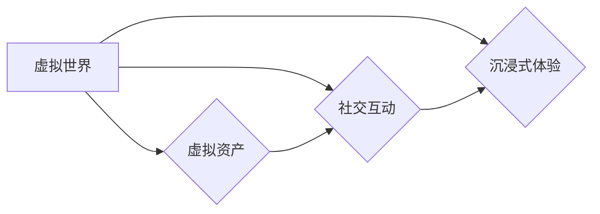

# 元宇宙 (Metaverse)

作者：禅与计算机程序设计艺术 / Zen and the Art of Computer Programming


## 1. 背景介绍
### 1.1 问题的由来

随着互联网的普及和发展，人们对于虚拟世界和现实世界的融合产生了浓厚的兴趣。元宇宙（Metaverse）的概念应运而生，它被视为互联网发展的下一个重要阶段。元宇宙是一个由虚拟世界构成的虚拟社会，它融合了虚拟现实（VR）、增强现实（AR）、区块链、人工智能（AI）等技术，为用户提供了一个全新的沉浸式体验。

### 1.2 研究现状

近年来，元宇宙的概念逐渐从科幻小说走向现实。多家科技公司纷纷布局元宇宙领域，如Facebook（现Meta）、微软、谷歌、腾讯等。目前，元宇宙的发展主要集中在以下几个方面：

- **虚拟现实（VR）和增强现实（AR）技术**：通过VR头盔、AR眼镜等设备，用户可以进入虚拟世界，获得沉浸式体验。
- **区块链技术**：用于构建元宇宙的底层架构，实现虚拟资产的流通和管理。
- **人工智能（AI）技术**：用于实现虚拟世界的智能化和个性化，为用户提供更加丰富的交互体验。
- **游戏产业**：元宇宙的核心应用之一，通过虚拟游戏让用户在虚拟世界中娱乐、社交、创造。

### 1.3 研究意义

元宇宙作为一种全新的虚拟社会，具有以下研究意义：

- **推动互联网技术发展**：元宇宙的构建需要融合多种前沿技术，将推动相关技术的研发和应用。
- **拓展人类社交方式**：元宇宙为用户提供了全新的社交平台，拓展了人类的社交方式。
- **创造新的商业模式**：元宇宙为企业和个人创造了新的商业模式，带动经济增长。
- **促进文化交流**：元宇宙为全球用户提供了文化交流的平台，促进文化交流和融合。

### 1.4 本文结构

本文将围绕元宇宙的核心概念、技术架构、应用场景、发展趋势等方面进行深入探讨。具体结构如下：

- **第2章**：介绍元宇宙的核心概念和联系。
- **第3章**：阐述元宇宙的技术架构和关键组成部分。
- **第4章**：分析元宇宙在不同领域的应用场景。
- **第5章**：探讨元宇宙的未来发展趋势和挑战。
- **第6章**：推荐元宇宙相关的学习资源、开发工具和参考文献。
- **第7章**：总结全文，展望元宇宙的未来。

## 2. 核心概念与联系

元宇宙是由虚拟世界构成的虚拟社会，其核心概念如下：

- **虚拟世界**：由数字技术构建的虚拟空间，用户可以在其中进行交互、娱乐、创造等。
- **虚拟资产**：在虚拟世界中存在的数字资产，如虚拟货币、虚拟物品等。
- **社交互动**：用户在虚拟世界中与他人进行交流、合作、竞争等活动。
- **沉浸式体验**：用户在虚拟世界中获得的沉浸感，仿佛置身于真实世界。

这些概念之间的关系如下：



可以看出，虚拟世界是元宇宙的核心，虚拟资产、社交互动和沉浸式体验是元宇宙的重要组成部分。

## 3. 核心算法原理 & 具体操作步骤

### 3.1 算法原理概述

元宇宙的核心算法包括：

- **虚拟现实（VR）和增强现实（AR）算法**：用于构建虚拟世界，实现用户与虚拟世界的交互。
- **区块链算法**：用于构建元宇宙的底层架构，实现虚拟资产的流通和管理。
- **人工智能（AI）算法**：用于实现虚拟世界的智能化和个性化，为用户提供更加丰富的交互体验。

### 3.2 算法步骤详解

#### 3.2.1 虚拟现实（VR）和增强现实（AR）算法

VR和AR算法主要包括以下几个方面：

1. **场景渲染**：将虚拟世界中的物体、角色等渲染到屏幕上。
2. **交互识别**：识别用户的输入（如手部动作、面部表情等），并将其转换为虚拟世界中的操作。
3. **实时追踪**：实时追踪用户的动作和位置，保持虚拟世界与用户动作的同步。

#### 3.2.2 区块链算法

区块链算法主要包括以下几个方面：

1. **共识算法**：用于确保区块链的可靠性和安全性。
2. **智能合约**：用于自动执行合约条款，实现虚拟资产的流通和管理。
3. **分布式账本**：记录虚拟资产的所有权、交易等信息。

#### 3.2.3 人工智能（AI）算法

AI算法主要包括以下几个方面：

1. **自然语言处理（NLP）**：用于实现虚拟世界的智能对话和问答功能。
2. **计算机视觉**：用于实现虚拟世界中的物体识别、场景理解等功能。
3. **机器学习**：用于实现虚拟世界的个性化推荐、智能决策等功能。

### 3.3 算法优缺点

#### 3.3.1 VR和AR算法

优点：

- 提供沉浸式体验。
- 交互方式丰富。
- 应用场景广泛。

缺点：

- 设备成本较高。
- 画面延迟较大。
- 易产生眩晕感。

#### 3.3.2 区块链算法

优点：

- 可靠性和安全性高。
- 可追溯性强。
- 可编程性强。

缺点：

- 计算效率较低。
- 存储空间较大。
- 技术门槛较高。

#### 3.3.3 AI算法

优点：

- 智能化程度高。
- 个性化程度高。
- 应用场景广泛。

缺点：

- 数据隐私问题。
- 模型可解释性不足。
- 计算资源消耗大。

### 3.4 算法应用领域

VR和AR算法主要应用于游戏、教育、医疗、旅游等领域。区块链算法主要应用于虚拟资产交易、版权保护等领域。AI算法主要应用于智能对话、智能推荐、智能决策等领域。

## 4. 数学模型和公式 & 详细讲解 & 举例说明

### 4.1 数学模型构建

元宇宙的核心数学模型主要包括以下几个方面：

- **三维空间模型**：描述虚拟世界的空间结构。
- **图像处理模型**：用于图像的生成、识别、增强等。
- **机器学习模型**：用于实现智能对话、智能推荐等。

### 4.2 公式推导过程

#### 4.2.1 三维空间模型

三维空间模型通常使用欧几里得空间中的向量来表示。例如，一个三维空间中的点可以用 $(x, y, z)$ 表示。

#### 4.2.2 图像处理模型

图像处理模型常用的公式包括：

- **卷积公式**：用于图像的滤波、特征提取等。
- **梯度公式**：用于图像的边缘检测等。

#### 4.2.3 机器学习模型

机器学习模型常用的公式包括：

- **损失函数**：用于衡量模型预测结果与真实值之间的差异。
- **梯度下降**：用于优化模型参数。

### 4.3 案例分析与讲解

#### 4.3.1 三维空间模型

假设有一个三维空间中的点 $(x, y, z)$，其坐标可以表示为：

$$
(x, y, z) = (x_0 + dx, y_0 + dy, z_0 + dz)
$$

其中 $x_0, y_0, z_0$ 为原始坐标，$dx, dy, dz$ 为坐标的增量。

#### 4.3.2 图像处理模型

假设有一个图像的卷积操作，其卷积核为 $K$，输入图像为 $I$，输出图像为 $O$，则有：

$$
O = I * K
$$

其中 $*$ 表示卷积操作。

#### 4.3.3 机器学习模型

假设有一个二分类问题，其损失函数为交叉熵损失，模型参数为 $\theta$，则有：

$$
\ell(\theta) = -[y\log \hat{y} + (1-y)\log (1-\hat{y})]
$$

其中 $\hat{y}$ 为模型预测的概率。

### 4.4 常见问题解答

**Q1：元宇宙的安全性问题如何解决？**

A：元宇宙的安全性问题主要包括数据安全和隐私保护两个方面。解决方法包括：

- **数据加密**：对用户数据和应用数据进行加密，防止泄露。
- **身份认证**：采用多因素身份认证，防止未经授权的访问。
- **隐私保护**：采用差分隐私、联邦学习等技术，保护用户隐私。

**Q2：元宇宙的算力需求如何解决？**

A：元宇宙的算力需求主要包括渲染、交互、AI计算等方面。解决方法包括：

- **分布式计算**：将计算任务分散到多个节点上，提高计算效率。
- **边缘计算**：将计算任务下沉到边缘设备，降低延迟。
- **云服务**：利用云服务提供强大的计算资源。

## 5. 项目实践：代码实例和详细解释说明

### 5.1 开发环境搭建

以下是使用Python进行元宇宙项目开发的常见环境搭建步骤：

1. 安装Python：从官网下载并安装Python。
2. 安装PyTorch：使用pip安装PyTorch。
3. 安装其他相关库：使用pip安装OpenCV、NumPy、Pandas等库。

### 5.2 源代码详细实现

以下是一个简单的元宇宙项目示例，使用PyTorch实现一个基于虚拟现实的游戏。

```python
import torch
import torch.nn as nn
import torch.optim as optim
from torchvision import datasets, transforms
from torch.utils.data import DataLoader

# 定义神经网络模型
class GameModel(nn.Module):
    def __init__(self):
        super(GameModel, self).__init__()
        self.conv1 = nn.Conv2d(3, 32, kernel_size=3, padding=1)
        self.relu = nn.ReLU()
        self.pool = nn.MaxPool2d(kernel_size=2, stride=2)
        self.fc1 = nn.Linear(32 * 8 * 8, 16)
        self.fc2 = nn.Linear(16, 2)

    def forward(self, x):
        x = self.conv1(x)
        x = self.relu(x)
        x = self.pool(x)
        x = x.view(-1, 32 * 8 * 8)
        x = self.fc1(x)
        x = self.relu(x)
        x = self.fc2(x)
        return x

# 加载数据集
transform = transforms.Compose([transforms.ToTensor()])
train_dataset = datasets.MNIST(root='./data', train=True, download=True, transform=transform)
train_loader = DataLoader(train_dataset, batch_size=64, shuffle=True)

# 初始化模型和优化器
model = GameModel()
optimizer = optim.Adam(model.parameters(), lr=0.001)

# 训练模型
for epoch in range(10):
    for batch_idx, (data, target) in enumerate(train_loader):
        output = model(data)
        loss = nn.CrossEntropyLoss()(output, target)
        optimizer.zero_grad()
        loss.backward()
        optimizer.step()
        if batch_idx % 100 == 0:
            print(f'Train Epoch: {epoch} [{batch_idx * len(data)}/{len(train_loader.dataset)} ({100. * batch_idx / len(train_loader):.0f}%)]\tLoss: {loss.item():.6f}')

# 保存模型
torch.save(model.state_dict(), './game_model.pth')
```

### 5.3 代码解读与分析

以上代码实现了一个简单的基于虚拟现实的游戏，使用PyTorch框架进行深度学习。

- `GameModel` 类定义了神经网络模型，包括卷积层、ReLU激活函数、池化层和全连接层。
- 使用MNIST数据集作为训练数据，该数据集包含手写数字的图像。
- 使用Adam优化器进行模型参数优化。
- 训练10个epoch，并在每个epoch结束后打印训练损失。
- 将训练好的模型保存到本地。

### 5.4 运行结果展示

运行以上代码，模型将在MNIST数据集上训练10个epoch。训练完成后，保存的模型可以用于虚拟现实游戏中的图像识别。

## 6. 实际应用场景
### 6.1 游戏娱乐

游戏是元宇宙中最典型的应用场景之一。玩家可以在虚拟世界中扮演角色、探索、战斗、社交等，获得沉浸式体验。

### 6.2 教育培训

元宇宙可以应用于教育培训领域，为用户提供沉浸式学习环境，提高学习效果。

### 6.3 医疗健康

元宇宙可以应用于医疗健康领域，如远程手术、虚拟康复等。

### 6.4 社交娱乐

元宇宙为用户提供了一个全新的社交平台，用户可以在虚拟世界中与他人互动、娱乐。

### 6.5 商业应用

元宇宙可以应用于商业领域，如虚拟商品交易、虚拟广告等。

### 6.6 政府管理

元宇宙可以应用于政府管理领域，如城市规划、应急指挥等。

## 7. 工具和资源推荐
### 7.1 学习资源推荐

- **《元宇宙：定义、趋势与未来》**：由华为云作者撰写，全面介绍元宇宙的概念、发展趋势和未来应用。
- **《虚拟现实与增强现实》**：由刘铁岩教授主编，深入浅出地介绍了虚拟现实和增强现实技术。
- **《区块链技术指南》**：由李兆丰教授主编，详细讲解了区块链技术的原理和应用。
- **《人工智能：一种现代的方法》**：由Stuart Russell和Peter Norvig合著，全面介绍了人工智能领域的基础知识。

### 7.2 开发工具推荐

- **Unity**：一款强大的游戏开发引擎，支持VR/AR开发。
- **Unreal Engine**：一款功能强大的游戏开发引擎，支持VR/AR开发。
- **Metaverse平台**：如Decentraland、Sandbox等，提供元宇宙平台和开发工具。
- **区块链开发框架**：如Tron、EOS等，提供区块链开发框架。

### 7.3 相关论文推荐

- **《Metaverse: On the Future of Social Media》**：提出元宇宙的概念和未来发展趋势。
- **《Virtual Reality and Augmented Reality: A Comprehensive Survey》**：对虚拟现实和增强现实技术进行全面综述。
- **《Blockchain Technology: A Comprehensive Guide》**：对区块链技术进行全面介绍。
- **《Artificial Intelligence: A Modern Approach》**：对人工智能领域进行全面介绍。

### 7.4 其他资源推荐

- **开源代码库**：如GitHub、GitLab等，可以找到元宇宙相关项目的开源代码。
- **技术社区**：如Stack Overflow、知乎等，可以学习到元宇宙相关的技术知识。

## 8. 总结：未来发展趋势与挑战
### 8.1 研究成果总结

本文对元宇宙的核心概念、技术架构、应用场景、发展趋势等方面进行了深入探讨。通过分析虚拟现实、增强现实、区块链、人工智能等技术的融合，展望了元宇宙的未来发展。

### 8.2 未来发展趋势

- **技术融合**：元宇宙将进一步融合虚拟现实、增强现实、区块链、人工智能等技术，为用户提供更加丰富的体验。
- **应用场景拓展**：元宇宙的应用场景将拓展到更多领域，如教育、医疗、商业等。
- **生态建设**：元宇宙生态将逐步完善，形成完整的产业链。

### 8.3 面临的挑战

- **技术挑战**：虚拟现实、增强现实、区块链、人工智能等技术仍存在一定的技术瓶颈。
- **伦理挑战**：元宇宙的隐私保护、数据安全等问题需要引起重视。
- **监管挑战**：元宇宙的法律法规需要进一步完善。

### 8.4 研究展望

- **技术突破**：通过技术创新，突破虚拟现实、增强现实、区块链、人工智能等技术的瓶颈。
- **伦理规范**：制定元宇宙的伦理规范，确保元宇宙的健康发展。
- **法律法规**：完善元宇宙的法律法规，保障元宇宙的合规运营。

元宇宙作为互联网发展的下一个重要阶段，具有广阔的应用前景。相信通过不断的技术创新和规范建设，元宇宙将为人类社会带来更多福祉。

## 9. 附录：常见问题与解答

**Q1：元宇宙和虚拟现实（VR）有何区别？**

A：元宇宙是一个由虚拟世界构成的虚拟社会，而虚拟现实（VR）只是元宇宙的一种技术手段。元宇宙包含VR，但不仅限于VR。

**Q2：元宇宙和区块链有何关系？**

A：元宇宙的底层架构可以基于区块链技术构建，实现虚拟资产的流通和管理。

**Q3：元宇宙的隐私保护如何保障？**

A：通过数据加密、身份认证、隐私保护技术等手段，保障元宇宙的隐私安全。

**Q4：元宇宙的算力需求如何满足？**

A：通过分布式计算、边缘计算、云服务等手段，满足元宇宙的算力需求。

**Q5：元宇宙的法律法规如何完善？**

A：通过制定元宇宙的法律法规，保障元宇宙的合规运营。