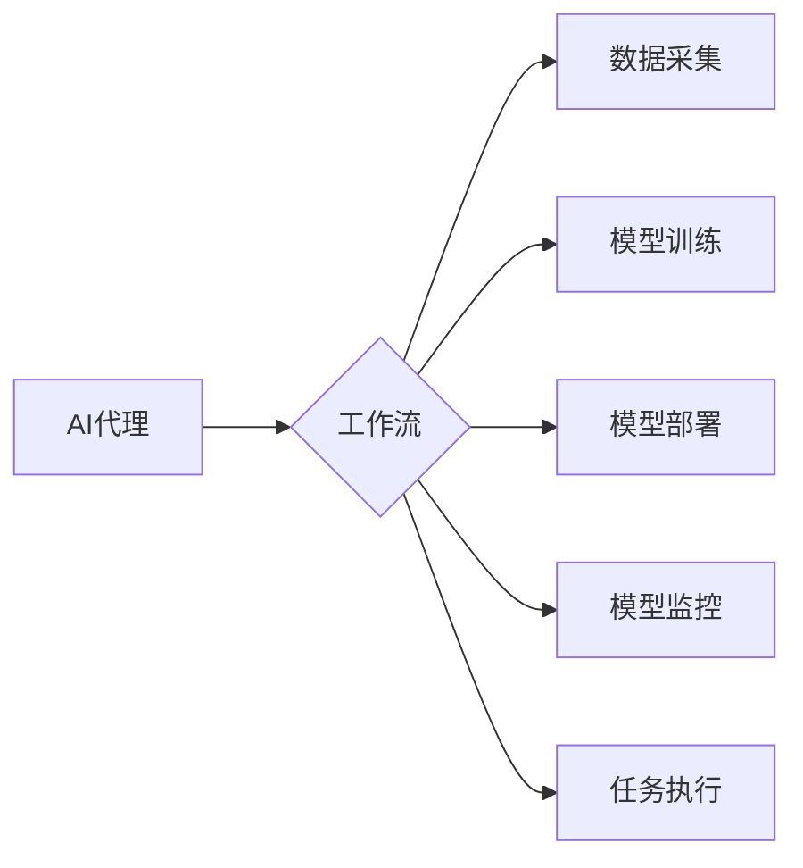

# 在电子商务中部署AI代理工作流的实战指南

作者：禅与计算机程序设计艺术 / Zen and the Art of Computer Programming

## 1. 背景介绍
### 1.1 问题的由来

随着电子商务的蓬勃发展，企业对智能化、个性化的服务需求日益增长。AI代理作为人工智能技术在电商领域的应用之一，能够为用户提供24/7的在线客服、个性化推荐、智能搜索等功能，提高用户体验，提升运营效率。然而，如何高效地部署AI代理工作流，实现其价值最大化，成为了电商企业面临的重要问题。

### 1.2 研究现状

近年来，AI代理技术在电商领域得到了广泛关注和应用。目前，AI代理主要分为两种类型：基于规则和基于机器学习的代理。基于规则的代理依赖于预先定义的规则和逻辑，而基于机器学习的代理则通过学习大量数据进行决策。

### 1.3 研究意义

本指南旨在为电商企业提供一套全面、实用的AI代理工作流部署方案，帮助企业在竞争激烈的电商市场中脱颖而出。

### 1.4 本文结构

本文将围绕AI代理工作流的部署展开，具体内容如下：

- 第2章：介绍AI代理的核心概念与联系。
- 第3章：阐述AI代理工作流的核心算法原理和具体操作步骤。
- 第4章：讲解AI代理的数学模型、公式和常见问题解答。
- 第5章：通过项目实践，展示AI代理工作流的代码实例和详细解释说明。
- 第6章：探讨AI代理在实际电商应用场景中的应用。
- 第7章：推荐AI代理工作流相关的学习资源、开发工具和参考文献。
- 第8章：总结AI代理工作流的未来发展趋势与挑战。
- 第9章：提供AI代理工作流的常见问题与解答。

## 2. 核心概念与联系

### 2.1 AI代理

AI代理（Artificial Intelligence Agent）是指能够自主执行任务、与环境交互的智能实体。在电商领域，AI代理主要指能够为用户提供智能服务的聊天机器人、推荐系统、智能客服等。

### 2.2 工作流

工作流（Workflow）是指一组执行特定任务的步骤序列，用于实现业务流程自动化。在AI代理场景中，工作流包括数据采集、模型训练、模型部署、模型监控等环节。

### 2.3 核心概念联系

AI代理工作流的核心概念联系如下：



## 3. 核心算法原理 & 具体操作步骤
### 3.1 算法原理概述

AI代理工作流的核心算法主要包括：

1. 数据采集：收集电商平台的用户行为数据、商品信息、市场数据等，为模型训练提供基础数据。
2. 模型训练：利用机器学习算法对采集到的数据进行训练，构建智能模型。
3. 模型部署：将训练好的模型部署到服务器或云平台，实现实时服务。
4. 模型监控：监控模型性能，根据实际情况进行优化调整。
5. 任务执行：AI代理根据模型预测结果执行具体任务，如智能推荐、智能客服等。

### 3.2 算法步骤详解

以下是AI代理工作流的详细操作步骤：

**步骤1：数据采集**

1. 收集用户行为数据：包括用户浏览、搜索、购买、评价等行为。
2. 收集商品信息：包括商品描述、价格、库存、评论等。
3. 收集市场数据：包括行业趋势、竞争情报等。

**步骤2：模型训练**

1. 数据预处理：对采集到的数据进行清洗、去噪、特征工程等预处理操作。
2. 选择合适的机器学习算法：如决策树、随机森林、神经网络等。
3. 训练模型：使用预处理后的数据对模型进行训练。
4. 评估模型：使用验证集评估模型性能，调整参数以优化模型。

**步骤3：模型部署**

1. 选择合适的部署平台：如云平台、服务器等。
2. 将训练好的模型部署到平台，实现实时服务。
3. 接入业务系统：将AI代理与电商平台的其他系统进行集成。

**步骤4：模型监控**

1. 定期收集模型预测结果和真实结果，计算指标如准确率、召回率等。
2. 分析模型性能，找出问题和瓶颈。
3. 根据实际情况进行模型优化调整。

**步骤5：任务执行**

1. AI代理根据模型预测结果执行具体任务，如智能推荐、智能客服等。
2. 收集任务执行结果，评估任务效果。

### 3.3 算法优缺点

**优点**：

1. 提高效率：自动化处理大量任务，提高运营效率。
2. 提升用户体验：为用户提供个性化、个性化的服务。
3. 降低成本：减少人力投入，降低运营成本。

**缺点**：

1. 数据依赖：模型性能依赖于高质量的数据。
2. 技术门槛：需要具备一定的机器学习知识和技能。
3. 模型过拟合：模型可能过拟合训练数据，导致泛化能力差。

### 3.4 算法应用领域

AI代理工作流在电商领域的应用主要包括：

1. 智能推荐：根据用户行为和兴趣，推荐个性化的商品。
2. 智能客服：为用户提供24/7的在线客服服务。
3. 智能搜索：提供准确的搜索结果，提高搜索效率。
4. 个性化营销：根据用户画像进行精准营销。
5. 市场预测：预测市场趋势，为企业决策提供依据。

## 4. 数学模型和公式 & 详细讲解 & 举例说明
### 4.1 数学模型构建

AI代理工作流的数学模型主要包括：

1. 用户画像模型：根据用户行为和特征构建用户画像，用于个性化推荐和营销。
2. 商品推荐模型：根据用户画像和商品特征构建推荐模型，用于智能推荐。
3. 客服对话模型：根据对话内容和用户画像构建对话模型，用于智能客服。

### 4.2 公式推导过程

以下是用户画像模型和商品推荐模型的公式推导过程：

**用户画像模型**：

假设用户行为数据为 $X=(x_1, x_2, ..., x_n)$，其中 $x_i$ 表示用户在第 $i$ 个行为上的特征。

用户画像模型的目标是学习一个函数 $f(X)$，将用户行为数据映射到用户画像空间：

$$
f(X) = \phi(X)
$$

其中 $\phi(X)$ 表示用户行为数据到用户画像空间的转换。

**商品推荐模型**：

假设用户画像为 $U=(u_1, u_2, ..., u_m)$，商品特征为 $C=(c_1, c_2, ..., c_n)$。

商品推荐模型的目标是学习一个函数 $g(U, C)$，根据用户画像和商品特征预测用户对商品的感兴趣程度：

$$
g(U, C) = \theta(U, C)
$$

其中 $\theta(U, C)$ 表示用户对商品的感兴趣程度。

### 4.3 案例分析与讲解

以下是一个基于协同过滤的推荐系统案例：

**问题描述**：

给定一个用户-商品评分矩阵 $R$，其中 $R_{ui}$ 表示用户 $u$ 对商品 $i$ 的评分。目标是根据用户 $u$ 的历史评分，预测其对商品 $i$ 的评分。

**解决方案**：

1. 构建用户-商品相似度矩阵 $S$，计算用户 $u$ 与其他用户 $v$ 的相似度 $s_{uv}$。
2. 计算用户 $u$ 对未评分商品 $i$ 的预测评分 $\hat{R}_{ui}$：

$$
\hat{R}_{ui} = \sum_{v \in \mathcal{N}(u)} s_{uv}R_{vi}
$$

其中 $\mathcal{N}(u)$ 表示与用户 $u$ 相似的一组用户集合。

3. 根据预测评分 $\hat{R}_{ui}$ 推荐商品 $i$。

### 4.4 常见问题解答

**Q1：如何提高用户画像的准确性？**

A：提高用户画像的准确性需要从以下几个方面着手：

1. 收集更多用户行为数据，包括浏览、搜索、购买、评价等。
2. 使用多种特征工程方法，提取用户特征。
3. 定期更新用户画像，跟踪用户行为变化。

**Q2：如何选择合适的推荐算法？**

A：选择合适的推荐算法需要根据具体应用场景和数据特点进行选择。常见的推荐算法包括：

- 协同过滤
- 内容推荐
- 混合推荐

**Q3：如何优化模型性能？**

A：优化模型性能可以从以下几个方面入手：

1. 调整模型参数
2. 使用更先进的算法
3. 使用更多的数据
4. 优化特征工程

## 5. 项目实践：代码实例和详细解释说明
### 5.1 开发环境搭建

以下是在Python环境下，使用Scikit-learn进行协同过滤推荐系统开发的步骤：

1. 安装Scikit-learn库：

```bash
pip install scikit-learn
```

2. 导入必要的库：

```python
import numpy as np
from sklearn.metrics.pairwise import cosine_similarity
from sklearn.model_selection import train_test_split
from sklearn.metrics import mean_squared_error
```

3. 加载和预处理数据：

```python
# 加载数据
ratings = np.array([[5, 3, 0, 0],
                    [4, 0, 0, 1],
                    [1, 1, 0, 5],
                    [1, 0, 0, 4],
                    [0, 1, 5, 4],
                    [0, 1, 0, 3],
                    [0, 0, 4, 2],
                    [0, 0, 3, 0]])

# 划分训练集和测试集
train_ratings, test_ratings = train_test_split(ratings, test_size=0.2, random_state=42)
```

### 5.2 源代码详细实现

```python
# 计算用户-商品相似度矩阵
user_similarity = cosine_similarity(train_ratings)

# 预测用户对未评分商品的评分
def predict_rating(ratings, user_similarity, user_id, item_id):
    ratings_sum = np.dot(user_similarity[user_id], ratings)
    rating_count = np.sum(user_similarity[user_id] != 0)
    if rating_count == 0:
        return 0
    else:
        return ratings_sum / rating_count

# 评估模型性能
def evaluate_model(ratings, user_similarity, test_ratings):
    predicted_ratings = np.zeros_like(test_ratings)
    for i in range(len(test_ratings)):
        user_id, item_id = test_ratings[i]
        predicted_ratings[i] = predict_rating(ratings, user_similarity, user_id, item_id)
    mse = mean_squared_error(test_ratings, predicted_ratings)
    return mse

mse = evaluate_model(train_ratings, user_similarity, test_ratings)
print("MSE:", mse)
```

### 5.3 代码解读与分析

1. `cosine_similarity` 函数计算用户-商品相似度矩阵。
2. `predict_rating` 函数根据用户相似度矩阵和用户-商品评分矩阵预测用户对商品的评分。
3. `evaluate_model` 函数计算模型在测试集上的MSE，评估模型性能。

### 5.4 运行结果展示

假设测试集的MSE为1.2，表示模型的预测精度较低。可以通过以下方法优化模型性能：

1. 尝试不同的相似度计算方法。
2. 调整预测函数中的参数。
3. 使用更多的用户-商品评分数据。

## 6. 实际应用场景
### 6.1 智能推荐

智能推荐是AI代理在电商领域的典型应用场景之一。通过分析用户行为和商品特征，为用户提供个性化的商品推荐，提升用户满意度和购买转化率。

### 6.2 智能客服

智能客服能够为用户提供24/7的在线客服服务，解答用户疑问，提高客户满意度。同时，智能客服还可以帮助电商企业降低人力成本。

### 6.3 智能搜索

智能搜索能够为用户提供准确的搜索结果，提高搜索效率。通过学习用户搜索行为和关键词，智能搜索能够更好地满足用户需求。

### 6.4 未来应用展望

随着AI技术的不断发展，AI代理在电商领域的应用将会更加广泛，例如：

1. 智能营销：通过分析用户行为和兴趣，为用户提供个性化的营销策略。
2. 智能仓储：利用AI技术实现智能仓储管理，提高仓储效率。
3. 智能物流：通过AI技术优化物流路径，降低物流成本。
4. 智能风控：利用AI技术进行风险评估，降低交易风险。

## 7. 工具和资源推荐
### 7.1 学习资源推荐

1. 《机器学习实战》
2. 《Scikit-learn与Python机器学习》
3. 《深度学习实战》
4. 《Python编程：从入门到实践》

### 7.2 开发工具推荐

1. Python
2. Scikit-learn
3. TensorFlow
4. PyTorch

### 7.3 相关论文推荐

1. Collaborative Filtering for the 21st Century
2. Deep Learning for Recommender Systems
3. Neural Architectures for Predicting Click-Through Rates

### 7.4 其他资源推荐

1. Hugging Face
2. TensorFlow官网
3. PyTorch官网

## 8. 总结：未来发展趋势与挑战
### 8.1 研究成果总结

本文详细介绍了在电子商务中部署AI代理工作流的实战指南，包括核心概念、算法原理、操作步骤、应用场景等。通过学习本文，读者可以了解AI代理工作流的基本原理和应用方法，为实际项目开发提供参考。

### 8.2 未来发展趋势

随着AI技术的不断发展，AI代理工作流在电商领域的应用将会更加广泛，主要体现在以下几个方面：

1. 模型精度和效率提升
2. 多模态数据融合
3. 智能决策支持
4. 人机协同

### 8.3 面临的挑战

尽管AI代理工作流在电商领域具有广阔的应用前景，但仍然面临着以下挑战：

1. 数据质量：高质量的数据是模型训练的基础。
2. 模型可解释性：提高模型的可解释性，方便用户理解模型的决策过程。
3. 模型泛化能力：提高模型的泛化能力，使其能够适应不同的业务场景。
4. 模型安全性和隐私保护：确保模型的安全性和用户隐私保护。

### 8.4 研究展望

未来，AI代理工作流的研究将重点关注以下几个方面：

1. 基于深度学习的推荐系统
2. 多模态数据融合
3. 智能决策支持系统
4. 人机协同交互

通过不断探索和创新，AI代理工作流将在电商领域发挥更大的作用，为用户提供更加优质、便捷的服务。

## 9. 附录：常见问题与解答

**Q1：AI代理工作流与传统的工作流有什么区别？**

A：AI代理工作流是基于人工智能技术构建的自动化工作流，能够根据数据和规则自动执行任务。而传统的工作流则依赖于人工操作和流程控制，效率较低。

**Q2：如何保证AI代理工作流的性能和稳定性？**

A：保证AI代理工作流的性能和稳定性需要从以下几个方面入手：

1. 选择合适的模型和算法。
2. 确保数据质量。
3. 进行充分的测试和评估。
4. 对模型进行定期维护和更新。

**Q3：AI代理工作流在哪些场景下不适用？**

A：AI代理工作流在以下场景下可能不适用：

1. 需要复杂的人类决策和判断的场景。
2. 对数据要求较高的场景。
3. 需要实时响应的场景。

**Q4：如何评估AI代理工作流的性能？**

A：评估AI代理工作流的性能可以从以下几个方面入手：

1. 评估模型精度和召回率。
2. 评估任务完成效率。
3. 评估用户体验。

通过综合考虑以上因素，可以全面评估AI代理工作流的性能。

---

作者：禅与计算机程序设计艺术 / Zen and the Art of Computer Programming