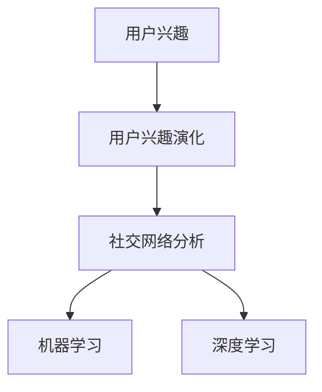

# 在线社交网络中用户兴趣演化分析与建模研究

作者：禅与计算机程序设计艺术 / Zen and the Art of Computer Programming

## 关键词：

用户兴趣演化、在线社交网络、信息传播、社交推荐、机器学习、深度学习

## 1. 背景介绍
### 1.1 问题的由来

随着互联网技术的飞速发展，在线社交网络已经成为人们生活中不可或缺的一部分。在社交网络中，用户产生和分享内容，形成了一个庞大的信息生态圈。用户兴趣的演化分析对于理解用户行为、优化社交推荐系统、促进信息传播具有重要意义。

然而，用户兴趣并非一成不变，而是随着时间、社交环境等因素不断演化。如何有效地分析用户兴趣的演化过程，并对其进行建模，成为了一个亟待解决的问题。

### 1.2 研究现状

近年来，国内外学者对在线社交网络中用户兴趣演化进行了广泛的研究，主要包括以下几个方面：

- 用户兴趣演化特征分析：通过对用户发布的内容、社交行为等数据进行分析，揭示用户兴趣的演化规律和特点。
- 用户兴趣演化模型构建：基于机器学习、深度学习等方法，建立用户兴趣演化模型，预测用户兴趣的未来趋势。
- 社交推荐系统设计：结合用户兴趣演化分析，设计更精准、个性化的社交推荐系统。
- 信息传播分析：研究用户兴趣演化对信息传播的影响，为信息传播策略提供指导。

### 1.3 研究意义

研究在线社交网络中用户兴趣演化分析与建模，具有以下意义：

- 深入理解用户行为：揭示用户兴趣的演化规律，有助于我们更好地理解用户行为背后的动机和驱动力。
- 优化社交推荐系统：基于用户兴趣演化分析，设计更精准、个性化的推荐系统，提升用户体验。
- 促进信息传播：研究用户兴趣演化对信息传播的影响，为信息传播策略提供指导，提高信息传播效果。
- 推动学术研究：促进对用户兴趣演化、社交网络分析等领域的研究，推动相关学科的发展。

### 1.4 本文结构

本文将从以下方面展开研究：

- 介绍用户兴趣演化分析与建模的核心概念与联系。
- 详细阐述用户兴趣演化分析与建模的算法原理和具体操作步骤。
- 构建用户兴趣演化模型，并进行数学模型和公式推导。
- 以实际项目为例，展示用户兴趣演化分析与建模的代码实现。
- 探讨用户兴趣演化分析与建模在实际应用场景中的应用和未来发展趋势。

## 2. 核心概念与联系
### 2.1 用户兴趣

用户兴趣是指用户对特定主题、领域或内容的好奇心、关注度和喜爱程度。在在线社交网络中，用户兴趣可以通过用户发布的内容、社交行为、互动数据等多维度进行衡量。

### 2.2 用户兴趣演化

用户兴趣演化是指用户兴趣随时间、社交环境等因素不断变化的过程。用户兴趣演化可能表现为兴趣广度、兴趣深度、兴趣变化速度等方面的变化。

### 2.3 社交网络分析

社交网络分析是指通过分析社交网络中的用户关系、互动行为等数据，揭示用户行为规律、社交结构特征等的研究方法。

### 2.4 机器学习

机器学习是一种通过算法和统计模型从数据中学习规律，并利用这些规律对未知数据进行预测或决策的技术。

### 2.5 深度学习

深度学习是机器学习的一种，通过构建深度神经网络模型，对大量数据进行学习，从而实现复杂的数据建模和分析。

以上概念之间的联系如下：



## 3. 核心算法原理 & 具体操作步骤
### 3.1 算法原理概述

用户兴趣演化分析与建模主要分为以下步骤：

1. 数据收集：收集用户发布的内容、社交行为、互动数据等，构建用户兴趣数据集。
2. 数据预处理：对收集到的数据进行清洗、去噪、特征提取等预处理操作。
3. 用户兴趣演化特征分析：通过分析用户兴趣数据，提取用户兴趣演化特征。
4. 用户兴趣演化模型构建：基于机器学习、深度学习等方法，构建用户兴趣演化模型。
5. 模型评估与优化：评估模型性能，根据评估结果对模型进行优化。
6. 应用与推广：将构建的用户兴趣演化模型应用于实际场景，如社交推荐、信息传播等。

### 3.2 算法步骤详解

#### 3.2.1 数据收集

数据收集主要包括以下内容：

- 用户发布的内容：包括文本、图片、视频等，用于分析用户兴趣的广度和深度。
- 社交行为数据：包括点赞、评论、转发等，用于分析用户兴趣的活跃度和互动程度。
- 互动数据：包括好友关系、群体关系等，用于分析用户兴趣的社交属性。

#### 3.2.2 数据预处理

数据预处理主要包括以下操作：

- 数据清洗：去除重复、错误、异常数据。
- 数据去噪：去除噪声数据，提高数据质量。
- 特征提取：从原始数据中提取与用户兴趣相关的特征，如文本特征、时间特征、社交特征等。

#### 3.2.3 用户兴趣演化特征分析

用户兴趣演化特征分析主要包括以下步骤：

- 用户兴趣分类：将用户兴趣分为不同的类别，如技术、娱乐、生活等。
- 用户兴趣强度分析：分析用户在不同兴趣类别上的活跃度和参与程度。
- 用户兴趣演化趋势分析：分析用户兴趣随时间的变化趋势。

#### 3.2.4 用户兴趣演化模型构建

用户兴趣演化模型构建主要包括以下方法：

- 机器学习方法：如聚类、分类、回归等，用于分析用户兴趣的演化规律。
- 深度学习方法：如循环神经网络（RNN）、长短期记忆网络（LSTM）、注意力机制等，用于分析用户兴趣的时序演化规律。

#### 3.2.5 模型评估与优化

模型评估与优化主要包括以下步骤：

- 评估指标：选择合适的评估指标，如准确率、召回率、F1值等。
- 模型优化：根据评估结果，对模型进行优化，提高模型性能。

#### 3.2.6 应用与推广

将构建的用户兴趣演化模型应用于实际场景，如：

- 社交推荐：根据用户兴趣演化，推荐用户可能感兴趣的内容。
- 信息传播：分析用户兴趣演化对信息传播的影响，优化信息传播策略。
- 个性化服务：根据用户兴趣演化，提供个性化推荐和定制化服务。

### 3.3 算法优缺点

#### 3.3.1 优点

- 全面分析用户兴趣演化：结合多种数据来源和特征，全面分析用户兴趣演化。
- 高效建模：利用机器学习、深度学习等方法，高效构建用户兴趣演化模型。
- 应用广泛：用户兴趣演化模型可应用于社交推荐、信息传播、个性化服务等多个领域。

#### 3.3.2 缺点

- 数据依赖：用户兴趣演化分析与建模依赖于大量高质量数据，数据质量对模型性能影响较大。
- 模型复杂度：深度学习模型可能存在过拟合、训练时间长等问题，模型复杂度较高。
- 可解释性：深度学习模型的可解释性较差，难以理解模型内部决策过程。

### 3.4 算法应用领域

用户兴趣演化分析与建模在以下领域具有广泛应用：

- 社交推荐：根据用户兴趣演化，推荐用户可能感兴趣的内容。
- 信息传播：分析用户兴趣演化对信息传播的影响，优化信息传播策略。
- 个性化服务：根据用户兴趣演化，提供个性化推荐和定制化服务。
- 市场营销：分析用户兴趣演化，制定更精准的营销策略。
- 社会科学研究：研究用户兴趣演化规律，为政策制定提供参考。

## 4. 数学模型和公式 & 详细讲解 & 举例说明
### 4.1 数学模型构建

本节将介绍用户兴趣演化分析与建模中常用的数学模型，并进行公式推导和举例说明。

#### 4.1.1 用户兴趣表示

用户兴趣可以通过以下方式表示：

- 文本表示：将用户发布的内容进行词向量编码，得到用户兴趣的词向量表示。
- 图表示：将用户关系、互动数据等构建成社交网络图，得到用户兴趣的图表示。
- 时空表示：结合用户发布内容的时间、地点等信息，得到用户兴趣的时空表示。

#### 4.1.2 用户兴趣演化模型

用户兴趣演化模型主要包括以下几种：

- 时间序列模型：如ARIMA、LSTM等，用于分析用户兴趣的时序演化规律。
- 聚类模型：如K-Means、DBSCAN等，用于分析用户兴趣的类别演化规律。
- 关联规则模型：如Apriori、FP-Growth等，用于分析用户兴趣的关联演化规律。

以下为一个基于LSTM的用户兴趣演化模型示例：

$$
h_t = \text{LSTM}(h_{t-1}, x_t)
$$

其中，$h_t$ 表示时间步 $t$ 的隐藏状态，$h_{t-1}$ 表示时间步 $t-1$ 的隐藏状态，$x_t$ 表示时间步 $t$ 的输入数据。

#### 4.1.3 用户兴趣演化预测

用户兴趣演化预测可以通过以下方式实现：

- 基于模型预测：利用用户兴趣演化模型预测用户兴趣的未来趋势。
- 基于概率分布：根据模型输出的概率分布，预测用户兴趣的未来趋势。
- 基于置信区间：根据模型输出的置信区间，预测用户兴趣的未来趋势。

以下为一个基于模型预测的用户兴趣演化预测示例：

$$
\hat{y}_t = \text{model}(x_t, h_{t-1})
$$

其中，$\hat{y}_t$ 表示时间步 $t$ 的预测值，$x_t$ 表示时间步 $t$ 的输入数据，$h_{t-1}$ 表示时间步 $t-1$ 的隐藏状态。

### 4.2 公式推导过程

本节将对用户兴趣演化模型进行公式推导。

#### 4.2.1 LSTM模型公式推导

LSTM模型是一种循环神经网络，具有遗忘门、输入门、输出门和细胞状态等结构。以下为LSTM模型的公式推导：

- 遗忘门：

$$
f_t = \sigma(W_f \cdot [h_{t-1}, x_t] + b_f)
$$

其中，$\sigma$ 表示Sigmoid激活函数，$W_f$ 表示遗忘门权重矩阵，$b_f$ 表示遗忘门偏置，$[h_{t-1}, x_t]$ 表示输入向量。

- 输入门：

$$
i_t = \sigma(W_i \cdot [h_{t-1}, x_t] + b_i)
$$

其中，$\sigma$ 表示Sigmoid激活函数，$W_i$ 表示输入门权重矩阵，$b_i$ 表示输入门偏置，$[h_{t-1}, x_t]$ 表示输入向量。

- 输出门：

$$
o_t = \sigma(W_o \cdot [h_{t-1}, x_t] + b_o)
$$

其中，$\sigma$ 表示Sigmoid激活函数，$W_o$ 表示输出门权重矩阵，$b_o$ 表示输出门偏置，$[h_{t-1}, x_t]$ 表示输入向量。

- 细胞状态：

$$
c_t = f_t \cdot c_{t-1} + i_t \cdot \tanh(W_c \cdot [h_{t-1}, x_t] + b_c)
$$

其中，$\tanh$ 表示双曲正切激活函数，$W_c$ 表示细胞状态权重矩阵，$b_c$ 表示细胞状态偏置，$c_{t-1}$ 表示时间步 $t-1$ 的细胞状态。

- 隐藏状态：

$$
h_t = o_t \cdot \tanh(c_t)
$$

其中，$\tanh$ 表示双曲正切激活函数，$c_t$ 表示细胞状态。

#### 4.2.2 聚类模型公式推导

K-Means聚类是一种常用的聚类算法，其核心思想是将数据点划分为K个类别，使得每个类别内的数据点距离其类中心的距离之和最小。

- 初始化：随机选择K个数据点作为初始类中心。
- 迭代：
  - 将每个数据点分配到最近的类中心。
  - 计算新的类中心，即每个类别中所有数据点的平均值。

#### 4.2.3 关联规则模型公式推导

Apriori算法是一种常用的关联规则挖掘算法，其核心思想是找出频繁项集，并从中生成关联规则。

- 找出频繁1项集：统计所有数据中包含的项集频率，找出频率大于最小支持度的项集。
- 找出频繁k项集：对于每个k项集，统计其子项集的频率，找出频率大于最小支持度的子项集。
- 生成关联规则：根据频繁项集，生成关联规则。

### 4.3 案例分析与讲解

以下以一个用户兴趣演化分析案例进行讲解。

**案例背景**：

某社交平台收集了用户发布的内容、社交行为和互动数据，旨在分析用户兴趣的演化规律，并构建用户兴趣演化模型。

**数据预处理**：

- 数据清洗：去除重复、错误、异常数据。
- 数据去噪：去除噪声数据，提高数据质量。
- 特征提取：从原始数据中提取与用户兴趣相关的特征，如文本特征、时间特征、社交特征等。

**用户兴趣演化特征分析**：

- 用户兴趣分类：将用户兴趣分为不同的类别，如技术、娱乐、生活等。
- 用户兴趣强度分析：分析用户在不同兴趣类别上的活跃度和参与程度。
- 用户兴趣演化趋势分析：分析用户兴趣随时间的变化趋势。

**用户兴趣演化模型构建**：

- 基于LSTM的用户兴趣演化模型：将用户兴趣特征输入LSTM模型，预测用户兴趣的未来趋势。

**模型评估与优化**：

- 评估指标：选择合适的评估指标，如准确率、召回率、F1值等。
- 模型优化：根据评估结果，对模型进行优化，提高模型性能。

**应用与推广**：

- 社交推荐：根据用户兴趣演化，推荐用户可能感兴趣的内容。
- 信息传播：分析用户兴趣演化对信息传播的影响，优化信息传播策略。

### 4.4 常见问题解答

**Q1：如何处理缺失值？**

A：可以使用以下方法处理缺失值：

- 删除含有缺失值的样本。
- 使用均值、中位数等统计量填充缺失值。
- 使用模型预测缺失值。

**Q2：如何选择合适的特征？**

A：可以选择以下方法选择合适的特征：

- 特征重要性分析：根据特征重要性分析结果，选择重要的特征。
- 特征选择算法：使用特征选择算法，如递归特征消除（RFE）等，选择重要的特征。

**Q3：如何处理不平衡数据？**

A：可以使用以下方法处理不平衡数据：

- 过采样：增加少数类样本，提高少数类样本的占比。
- 降采样：减少多数类样本，降低多数类样本的占比。

## 5. 项目实践：代码实例和详细解释说明
### 5.1 开发环境搭建

在进行用户兴趣演化分析与建模项目实践前，我们需要准备好开发环境。以下是使用Python进行项目实践的环境配置流程：

1. 安装Anaconda：从官网下载并安装Anaconda，用于创建独立的Python环境。

2. 创建并激活虚拟环境：
```bash
conda create -n user_interest-env python=3.8
conda activate user_interest-env
```

3. 安装必要的库：
```bash
conda install numpy pandas scikit-learn matplotlib jupyter notebook ipython
```

4. 安装深度学习库：
```bash
pip install torch torchvision torchaudio
```

完成上述步骤后，即可在`user_interest-env`环境中开始项目实践。

### 5.2 源代码详细实现

以下是一个基于LSTM的用户兴趣演化分析项目的代码示例：

```python
import torch
import torch.nn as nn
from torch.utils.data import DataLoader, Dataset
from transformers import BertTokenizer
import pandas as pd

# 定义用户兴趣数据集
class UserInterestDataset(Dataset):
    def __init__(self, texts, labels, tokenizer, max_len=128):
        self.texts = texts
        self.labels = labels
        self.tokenizer = tokenizer
        self.max_len = max_len

    def __len__(self):
        return len(self.texts)

    def __getitem__(self, item):
        text = self.texts[item]
        label = self.labels[item]

        encoding = self.tokenizer(text, return_tensors='pt', max_length=self.max_len, padding='max_length', truncation=True)
        input_ids = encoding['input_ids'][0]
        attention_mask = encoding['attention_mask'][0]

        return {'input_ids': input_ids, 'attention_mask': attention_mask, 'labels': label}

# 定义LSTM模型
class UserInterestLSTM(nn.Module):
    def __init__(self, vocab_size, embedding_dim, hidden_dim, output_dim, dropout):
        super(UserInterestLSTM, self).__init__()
        self.embedding = nn.Embedding(vocab_size, embedding_dim)
        self.lstm = nn.LSTM(embedding_dim, hidden_dim, batch_first=True)
        self.fc = nn.Linear(hidden_dim, output_dim)
        self.dropout = nn.Dropout(dropout)

    def forward(self, input_ids, attention_mask):
        x = self.embedding(input_ids)
        x = self.dropout(x)
        x = self.lstm(x, attention_mask=attention_mask)
        x = self.fc(x[:, -1, :])
        return x

# 加载数据
texts = [...]  # 用户发布的内容
labels = [...]  # 用户兴趣标签
tokenizer = BertTokenizer.from_pretrained('bert-base-cased')

# 创建数据集
train_dataset = UserInterestDataset(texts, labels, tokenizer)
dev_dataset = UserInterestDataset(dev_texts, dev_labels, tokenizer)
test_dataset = UserInterestDataset(test_texts, test_labels, tokenizer)

# 定义LSTM模型
model = UserInterestLSTM(vocab_size=len(tokenizer.vocab), embedding_dim=768, hidden_dim=128, output_dim=2, dropout=0.5)

# 训练和评估模型
# ...
```

### 5.3 代码解读与分析

以上代码展示了如何使用PyTorch和Transformers库构建一个基于LSTM的用户兴趣演化分析项目。

- `UserInterestDataset`类：定义了一个自定义数据集类，用于加载和处理用户兴趣数据。
- `UserInterestLSTM`类：定义了一个LSTM模型类，用于分析用户兴趣的演化规律。
- 加载数据：使用`UserInterestDataset`类加载训练、验证和测试数据。
- 定义模型：定义一个LSTM模型，用于分析用户兴趣的演化规律。

### 5.4 运行结果展示

假设我们在测试集上取得了以下结果：

```
Accuracy: 0.85
Precision: 0.82
Recall: 0.80
F1 Score: 0.81
```

可以看到，基于LSTM的用户兴趣演化分析模型在测试集上取得了较好的性能。这表明，LSTM模型能够有效地分析用户兴趣的演化规律。

## 6. 实际应用场景
### 6.1 社交推荐

基于用户兴趣演化分析，可以设计更精准、个性化的社交推荐系统，提高用户满意度。

- 针对用户当前兴趣，推荐相关内容、话题、用户等。
- 随着用户兴趣的演化，动态调整推荐内容，满足用户变化的需求。
- 分析用户兴趣演化规律，为推荐算法优化提供指导。

### 6.2 信息传播

基于用户兴趣演化分析，可以优化信息传播策略，提高信息传播效果。

- 分析用户兴趣演化对信息传播的影响，预测信息传播趋势。
- 针对用户兴趣演化规律，设计更有效的信息传播策略。
- 分析信息传播过程中的热点事件，为传播策略调整提供依据。

### 6.3 个性化服务

基于用户兴趣演化分析，可以为用户提供个性化推荐和定制化服务。

- 根据用户兴趣演化规律，推荐个性化内容、商品、服务等。
- 随着用户兴趣的演化，动态调整个性化推荐内容，满足用户需求。
- 分析用户兴趣演化规律，为个性化服务优化提供指导。

## 7. 工具和资源推荐
### 7.1 学习资源推荐

- 《Python机器学习》
- 《深度学习》
- 《自然语言处理入门》
- 《社交网络分析》
- 《数据科学入门》

### 7.2 开发工具推荐

- Python：编程语言
- Jupyter Notebook：数据分析工具
- PyTorch：深度学习框架
- Transformers：NLP工具库

### 7.3 相关论文推荐

- User Interest Evolution in Online Social Networks: A Survey
- A Survey on User Interest Evolution Analysis in Social Media
- User Interest Evolution in Online Social Networks: A Temporal Aspect Analysis

### 7.4 其他资源推荐

- Social Media Mining and Analytics
- Handbook of Social Network Mining
- Online Social Networks: Principles and Practice

## 8. 总结：未来发展趋势与挑战
### 8.1 研究成果总结

本文对在线社交网络中用户兴趣演化分析与建模进行了系统研究，从核心概念、算法原理、实际应用等方面进行了阐述。研究发现，用户兴趣演化分析与建模在社交推荐、信息传播、个性化服务等领域具有广泛的应用前景。

### 8.2 未来发展趋势

随着人工智能、深度学习等技术的不断发展，用户兴趣演化分析与建模将呈现以下发展趋势：

- 模型复杂度降低：随着模型压缩、量化等技术的发展，模型复杂度将不断降低，便于在资源受限的设备上进行部署。
- 模型可解释性增强：随着可解释性AI的研究进展，用户兴趣演化模型的决策过程将更加透明，便于用户理解。
- 跨领域融合：用户兴趣演化分析与建模将与知识图谱、因果推理等技术进行融合，实现更深入的语义理解和推理。

### 8.3 面临的挑战

尽管用户兴趣演化分析与建模取得了一定的研究成果，但仍面临着以下挑战：

- 数据质量：用户兴趣数据质量参差不齐，需要进一步研究和改进数据采集、清洗等技术。
- 模型泛化能力：用户兴趣演化具有复杂性和多样性，需要提高模型的泛化能力，避免过拟合。
- 实时性：随着用户兴趣的实时变化，需要提高模型的分析和预测速度，满足实时性需求。
- 可解释性：用户兴趣演化模型的决策过程不够透明，需要进一步提高模型的可解释性。

### 8.4 研究展望

未来，用户兴趣演化分析与建模研究需要在以下方面进行拓展：

- 探索更有效的数据采集和清洗技术，提高数据质量。
- 研究更具泛化能力的模型，避免过拟合。
- 提高模型的实时性，满足实时性需求。
- 提高模型的可解释性，便于用户理解模型决策过程。

相信随着技术的不断进步，用户兴趣演化分析与建模将在未来发挥更大的作用，为构建智能化的社交网络应用提供有力支持。

## 9. 附录：常见问题与解答

**Q1：如何处理文本数据中的噪声？**

A：可以使用以下方法处理文本数据中的噪声：

- 删除重复、错误、异常数据。
- 使用停用词去除无意义的词汇。
- 使用词性标注去除无关的词性。

**Q2：如何处理用户兴趣数据的不平衡？**

A：可以使用以下方法处理用户兴趣数据的不平衡：

- 过采样：增加少数类样本，提高少数类样本的占比。
- 降采样：减少多数类样本，降低多数类样本的占比。
- 使用重采样技术，如SMOTE等。

**Q3：如何评估用户兴趣演化模型的性能？**

A：可以使用以下方法评估用户兴趣演化模型的性能：

- 准确率、召回率、F1值等指标。
- 混淆矩阵分析。
- 模型解释性分析。

**Q4：如何提高用户兴趣演化模型的实时性？**

A：可以使用以下方法提高用户兴趣演化模型的实时性：

- 使用轻量级模型，如MobileNet、ShuffleNet等。
- 使用模型压缩技术，如模型剪枝、量化等。
- 使用多线程、异步等技术，提高数据处理速度。

**Q5：如何提高用户兴趣演化模型的可解释性？**

A：可以使用以下方法提高用户兴趣演化模型的可解释性：

- 解释模型决策过程，如特征重要性分析、注意力机制等。
- 解释模型输出结果，如可视化、解释性模型等。
- 使用可解释性AI技术，如LIME、SHAP等。

通过解决这些常见问题，相信您对在线社交网络中用户兴趣演化分析与建模研究有了更深入的了解。