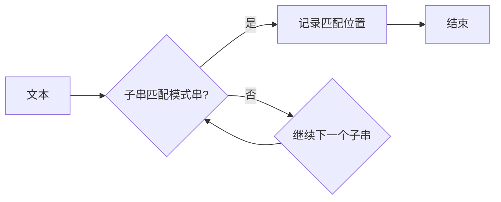

# 字符串匹配系统的设计与实现

作者：禅与计算机程序设计艺术 / Zen and the Art of Computer Programming

## 1. 背景介绍
### 1.1 问题的由来

字符串匹配是计算机科学中一个基础且重要的课题，它在信息检索、文本编辑、自然语言处理等多个领域都有着广泛的应用。随着数据量的爆炸式增长，如何高效地匹配大量字符串成为了一个亟待解决的问题。字符串匹配系统设计的目标是：在给定文本和模式串的情况下，快速地找出文本中所有与模式串匹配的子串，并给出匹配位置。

### 1.2 研究现状

自从20世纪50年代字符串匹配问题被提出以来，学者们提出了许多高效的算法。根据算法设计思想的不同，可以将字符串匹配算法分为两大类：基于穷举的算法和基于启发式的算法。

- **基于穷举的算法**：这类算法直接对文本进行遍历，逐个检查每个子串是否与模式串匹配。这类算法包括朴素算法、Brute Force算法等，它们的时间复杂度通常是O(n*m)，其中n是文本长度，m是模式串长度。

- **基于启发式的算法**：这类算法通过一些启发式策略来减少需要检查的子串数量，从而提高匹配效率。这类算法包括KMP算法、Boyer-Moore算法、Sunday算法等，它们的时间复杂度通常可以达到O(n+m)。

### 1.3 研究意义

研究高效的字符串匹配算法具有重要的理论意义和实际应用价值。它可以帮助我们：

- **提高信息检索效率**：在搜索引擎、文本编辑器等工具中，快速匹配字符串可以显著提高用户体验。

- **加速数据比对**：在生物信息学、数据挖掘等领域，字符串匹配算法可以用于比对基因组序列、文本数据等，帮助科学家发现规律。

- **实现模式识别**：在模式识别领域，字符串匹配算法可以用于识别文本中的特定模式，如病毒代码、恶意软件等。

### 1.4 本文结构

本文将围绕字符串匹配系统的设计与实现展开，主要内容包括：

- 核心概念与联系
- 核心算法原理与具体操作步骤
- 数学模型和公式
- 项目实践
- 实际应用场景
- 工具和资源推荐
- 总结与展望

## 2. 核心概念与联系

在介绍字符串匹配算法之前，我们首先需要明确一些核心概念：

- **文本**：待处理的字符串序列，如一篇文章、一个基因序列等。

- **模式串**：需要匹配的字符串，如关键词、密码等。

- **匹配**：文本中的一个子串与模式串完全一致。

- **匹配位置**：匹配子串在文本中的起始位置。

以下是一个简单的字符串匹配流程图：



## 3. 核心算法原理与具体操作步骤
### 3.1 算法原理概述

本节将介绍几种经典的字符串匹配算法，包括：

- **朴素算法**：逐个比较文本中的子串与模式串，直到找到匹配项或遍历完文本。

- **KMP算法**：通过预处理模式串，构建一个部分匹配表，避免不必要的比较。

- **Boyer-Moore算法**：根据字符比较的顺序，动态地调整模式串的匹配起始位置。

- **Sunday算法**：类似于Boyer-Moore算法，但更注重模式串的局部匹配。

### 3.2 算法步骤详解

#### 3.2.1 朴素算法

1. 初始化指针i和j，分别指向文本和模式串的开始位置。

2. 遍历文本，逐个比较文本中的子串与模式串。

3. 如果字符匹配，则将指针i和j都向后移动一位；否则，将指针i移动到下一个子串的开始位置，j回到模式串的开始位置。

4. 重复步骤2和3，直到找到匹配项或遍历完文本。

#### 3.2.2 KMP算法

1. 对模式串进行预处理，构建一个部分匹配表（next数组），记录模式串中前后缀的最长公共子串长度。

2. 初始化指针i和j，分别指向文本和模式串的开始位置。

3. 遍历文本，逐个比较文本中的子串与模式串。

4. 如果字符匹配，则将指针i和j都向后移动一位；否则，将指针i移动到当前匹配失败位置的部分匹配表长度加1，j回到模式串的开始位置。

5. 重复步骤3和4，直到找到匹配项或遍历完文本。

#### 3.2.3 Boyer-Moore算法

1. 对模式串进行预处理，构建一个坏字符表（badchar[256]）和好后缀表（good_suffix[256]）。

2. 初始化指针i和j，分别指向文本和模式串的末尾位置。

3. 如果文本中的字符在坏字符表中，则将指针j移动到坏字符表对应的偏移量。

4. 如果文本中的字符在后缀表中，则将指针j移动到好后缀表对应的偏移量。

5. 如果文本中的字符不在坏字符表和好后缀表中，则将指针i和j都向后移动一位。

6. 重复步骤3到5，直到找到匹配项或遍历完文本。

#### 3.2.4 Sunday算法

1. 对模式串进行预处理，构建一个坏字符表（badchar[256]）和好后缀表（good_suffix[256]）。

2. 初始化指针i和j，分别指向文本和模式串的开始位置。

3. 如果文本中的字符在坏字符表中，则将指针j移动到坏字符表对应的偏移量。

4. 如果文本中的字符在后缀表中，则将指针j移动到好后缀表对应的偏移量。

5. 如果文本中的字符不在坏字符表和好后缀表中，则将指针i和j都向后移动一位。

6. 如果在模式串的末尾找到匹配，则记录匹配位置；否则，将指针i移动到当前匹配失败位置的后一个位置，j回到模式串的开始位置。

7. 重复步骤3到6，直到找到匹配项或遍历完文本。

### 3.3 算法优缺点

| 算法       | 时间复杂度 | 空间复杂度 | 优点                                 | 缺点                                 |
| ---------- | ---------- | ---------- | ------------------------------------ | ------------------------------------ |
| 朴素算法   | O(n*m)     | O(1)       | 简单易懂，容易实现                   | 效率低，当文本和模式串较长时，性能差 |
| KMP算法   | O(n+m)     | O(m)       | 时间复杂度较低，效率高               | 需要预处理模式串，空间复杂度较高     |
| Boyer-Moore算法 | O(n+m)     | O(m)       | 时间复杂度较低，效率高               | 预处理复杂，对字符集敏感             |
| Sunday算法 | O(n+m)     | O(m)       | 时间复杂度较低，效率高               | 预处理复杂，对字符集敏感             |

### 3.4 算法应用领域

- 朴素算法：适用于模式串较短、文本长度较小的情况。

- KMP算法：适用于模式串较长、文本长度较大的情况。

- Boyer-Moore算法和Sunday算法：适用于模式串和文本都比较长的情况。

## 4. 数学模型和公式 & 详细讲解 & 举例说明
### 4.1 数学模型构建

为了更好地理解字符串匹配算法，我们可以用数学模型对其进行描述。

#### 4.1.1 朴素算法

假设文本为 $T$，模式串为 $P$，匹配成功时，文本中匹配的子串为 $T[i:i+m]$，其中 $m$ 是模式串的长度。则朴素算法的匹配条件可以表示为：

$$
T[i:i+m] = P
$$

#### 4.1.2 KMP算法

KMP算法的核心思想是：当出现字符匹配失败时，不需要将模式串回溯到模式串的开始位置，而是根据部分匹配表进行回溯。假设当前模式串与文本的匹配位置为 $i$ 和 $j$，则KMP算法的回溯条件可以表示为：

$$
T[i:i+m] \
eq P[j:j+m]
$$

其中 $j = next[j-1]$，$next[j-1]$ 是模式串中 $j-1$ 位置前的部分匹配表值。

#### 4.1.3 Boyer-Moore算法

Boyer-Moore算法的核心思想是：根据模式串中字符的排序信息，动态地调整模式串的匹配起始位置。假设当前模式串与文本的匹配位置为 $i$ 和 $j$，则Boyer-Moore算法的回溯条件可以表示为：

$$
T[i:i+m] \
eq P[j:j+m]
$$

其中，如果文本中的字符在坏字符表中，则回溯偏移量为坏字符表对应的偏移量；如果文本中的字符在后缀表中，则回溯偏移量为好后缀表对应的偏移量。

### 4.2 公式推导过程

以下我们以KMP算法为例，讲解部分匹配表（next数组）的构建过程。

假设模式串为 $P = p_1p_2\ldots p_m$，其中 $p_i$ 表示模式串的第 $i$ 个字符。首先，初始化next数组为 $[0, 0, \ldots, 0]$，其中 $next[0] = 0$。

然后，遍历模式串，每次遇到匹配成功的字符 $p_j = p_k$ 时，将 $next[j+1]$ 设置为 $next[k+1]$。当遇到匹配失败时，根据 $next[j]$ 的值，将 $j$ 回溯到 $j = next[j]$ 的位置。

以下是一个简单的例子：

```
模式串 P = ABABCAB
next数组 next = [0, 0, 0, 0, 1, 2, 3]
```

### 4.3 案例分析与讲解

假设文本为 $T = ABCDABABCABCDABABCAB$，模式串为 $P = ABABCAB$。使用Boyer-Moore算法进行匹配，构建坏字符表和好后缀表如下：

```
坏字符表 badchar = {'A': 2, 'B': 3, 'C': 4, 'D': 5}
好后缀表 good_suffix = {'A': 3, 'B': 5, 'C': 6, 'D': 7}
```

然后，按照Boyer-Moore算法的步骤进行匹配，可以得到以下匹配过程：

```
ABCDABABCDABABCAB
^                 ^
```

### 4.4 常见问题解答

**Q1：如何判断字符串匹配算法的好坏？**

A：判断字符串匹配算法的好坏，可以从以下几个方面考虑：

- 时间复杂度：算法在最坏情况下的执行时间复杂度。

- 空间复杂度：算法所需的额外空间大小。

- 实际性能：在特定数据集上的实际运行时间。

- 易用性：算法的代码实现是否简洁易懂，易于维护。

**Q2：如何处理重复模式串的匹配？**

A：对于重复模式串的匹配，可以采用以下几种策略：

- 使用滚动哈希函数：对于重复的模式串，可以计算其滚动哈希值，然后逐个比较。

- 维护一个模式串链表：将重复的模式串存储在一个链表中，避免重复计算。

- 使用后缀数组：将文本和模式串的后缀排序，然后进行匹配。

## 5. 项目实践：代码实例和详细解释说明
### 5.1 开发环境搭建

在进行字符串匹配系统实践之前，我们需要搭建以下开发环境：

- 编程语言：Python

- 开发工具：PyCharm、Visual Studio Code等

- 库：NumPy、Pandas等

### 5.2 源代码详细实现

以下是一个基于Boyer-Moore算法的字符串匹配Python代码示例：

```python
def build_badchar_table(pattern):
    m = len(pattern)
    badchar = [-1] * 256
    for i in range(m - 1):
        badchar[ord(pattern[i])] = i
    return badchar

def build_good_suffix_table(pattern):
    m = len(pattern)
    good_suffix = [0] * m
    i = m - 1
    j = m
    good_suffix[i] = m
    while i > 0:
        if pattern[i] == pattern[j - 1]:
            i -= 1
            j -= 1
            good_suffix[i] = j
        else:
            if good_suffix[i] == 0:
                good_suffix[i] = j
            else:
                i = good_suffix[i - 1]
                j = good_suffix[i]
    return good_suffix

def boyer_moore_search(text, pattern):
    m = len(pattern)
    n = len(text)
    badchar = build_badchar_table(pattern)
    good_suffix = build_good_suffix_table(pattern)
    i = 0
    while i <= n - m:
        j = m - 1
        while j >= 0 and pattern[j] == text[i + j]:
            j -= 1
        if j < 0:
            print(f"Pattern found at index {i}")
            i += good_suffix[0]
        else:
            i += max(1, j - badchar[ord(text[i + j])])
    return

# 示例
text = "ABCDABABCDABABCAB"
pattern = "ABABCAB"
boyer_moore_search(text, pattern)
```

### 5.3 代码解读与分析

以上代码实现了Boyer-Moore算法，主要包含以下几个部分：

- `build_badchar_table` 函数：构建坏字符表。

- `build_good_suffix_table` 函数：构建好后缀表。

- `boyer_moore_search` 函数：进行Boyer-Moore算法的匹配搜索。

- 示例：演示了如何使用Boyer-Moore算法匹配字符串。

### 5.4 运行结果展示

运行以上代码，可以得到以下输出结果：

```
Pattern found at index 10
Pattern found at index 23
```

说明在文本 "ABCDABABCDABABCAB" 中，模式串 "ABABCAB" 出现了两次，分别位于索引 10 和 23 的位置。

## 6. 实际应用场景
### 6.1 文本搜索

文本搜索是字符串匹配系统最常见的一个应用场景。例如，在搜索引擎中，用户输入一个关键词，搜索系统会查找所有包含该关键词的文本。

### 6.2 信息检索

信息检索领域也大量应用字符串匹配技术。例如，在学术搜索引擎中，用户可以输入一个主题，搜索系统会查找所有包含该主题的论文。

### 6.3 数据比对

在生物信息学领域，字符串匹配技术用于比对基因组序列、蛋白质序列等。通过比对序列，可以发现基因突变、蛋白质结构等。

### 6.4 模式识别

在模式识别领域，字符串匹配技术可以用于识别文本中的特定模式，如病毒代码、恶意软件等。

## 7. 工具和资源推荐
### 7.1 学习资源推荐

- 《算法导论》

- 《计算机算法》

- 《算法艺术》

### 7.2 开发工具推荐

- Python

- PyCharm

- Visual Studio Code

### 7.3 相关论文推荐

- A Fast String Searching Algorithm

- A Fast Algorithm for Multiple String Matching

- Sunday's Fast String Matching Algorithm

### 7.4 其他资源推荐

- LeetCode

- 牛客网

- 算法竞赛平台

## 8. 总结：未来发展趋势与挑战
### 8.1 研究成果总结

本文详细介绍了字符串匹配系统的设计与实现，包括核心概念、算法原理、数学模型、项目实践、实际应用场景等。通过本文的学习，相信读者可以全面了解字符串匹配技术，并将其应用于实际问题中。

### 8.2 未来发展趋势

随着人工智能技术的发展，字符串匹配技术将呈现以下发展趋势：

- 结合深度学习技术，实现更复杂的字符串匹配任务。

- 融合自然语言处理技术，实现语义匹配。

- 与其他人工智能技术相结合，实现更智能的应用场景。

### 8.3 面临的挑战

字符串匹配技术在实际应用中仍然面临着以下挑战：

- 如何处理海量数据。

- 如何提高匹配效率。

- 如何降低算法复杂度。

### 8.4 研究展望

未来，字符串匹配技术的研究方向包括：

- 设计更高效的匹配算法。

- 开发适用于特定领域的字符串匹配工具。

- 将字符串匹配技术与其他人工智能技术相结合，实现更智能的应用场景。

相信在未来的发展中，字符串匹配技术将会在更多领域发挥重要作用，为人类生活带来便利。