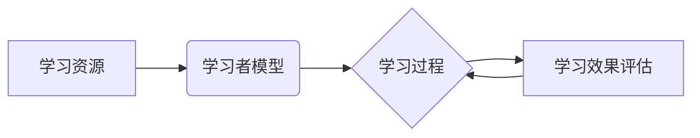

# 智能学习系统学习功能的设计与实现

作者：禅与计算机程序设计艺术 / Zen and the Art of Computer Programming

## 1. 背景介绍

### 1.1 问题的由来

随着信息技术的飞速发展，教育行业也迎来了变革。传统的教育模式已无法满足个性化学习、自适应学习等新型学习需求。为了更好地适应教育信息化发展趋势，智能学习系统应运而生。智能学习系统通过融合人工智能技术，实现了学习资源的智能化推荐、学习过程的个性化跟踪、学习效果的有效评估等功能，为学习者提供更加高效、便捷的学习体验。

学习功能作为智能学习系统的核心，其设计与实现直接关系到系统的性能和用户体验。本文旨在探讨智能学习系统学习功能的设计与实现，为开发者提供有益的参考。

### 1.2 研究现状

当前，智能学习系统学习功能的设计与实现主要集中在以下几个方面：

1. **学习资源推荐**：基于学习者兴趣、学习风格、学习目标等因素，智能学习系统能够为学习者推荐个性化的学习资源，提高学习效率。

2. **学习过程跟踪**：通过学习行为数据采集和分析，智能学习系统可以实时跟踪学习者的学习过程，为学习者提供针对性的学习指导和建议。

3. **学习效果评估**：智能学习系统通过评估学习者的学习效果，为学习者提供个性化的学习反馈，帮助学习者及时调整学习策略。

4. **自适应学习**：根据学习者的学习进度、学习效果等因素，智能学习系统可以动态调整学习内容、学习路径等，实现个性化自适应学习。

### 1.3 研究意义

研究智能学习系统学习功能的设计与实现，具有以下重要意义：

1. **提升学习效率**：通过个性化推荐、学习过程跟踪和学习效果评估等功能，智能学习系统可以帮助学习者更加高效地学习。

2. **提高学习体验**：智能学习系统可以根据学习者的需求和偏好，提供个性化的学习内容和学习路径，从而提升学习者的学习体验。

3. **促进教育公平**：智能学习系统可以帮助学习者克服地域、时间和经济等方面的限制，促进教育公平。

4. **推动教育变革**：智能学习系统可以帮助教育行业实现教育信息化、智能化，推动教育变革。

### 1.4 本文结构

本文将分为以下几个部分：

- **第2章**：介绍智能学习系统学习功能的核心概念与联系。
- **第3章**：阐述智能学习系统学习功能的核心算法原理和具体操作步骤。
- **第4章**：讲解智能学习系统学习功能的数学模型和公式，并举例说明。
- **第5章**：以项目实践为例，详细解释智能学习系统学习功能的代码实现。
- **第6章**：探讨智能学习系统学习功能在实际应用场景中的体现。
- **第7章**：推荐智能学习系统学习功能开发所需的学习资源、开发工具和参考文献。
- **第8章**：总结智能学习系统学习功能的研究成果、未来发展趋势和挑战。
- **第9章**：附录部分，提供智能学习系统学习功能的常见问题与解答。

## 2. 核心概念与联系

为了更好地理解智能学习系统学习功能的设计与实现，本节将介绍几个核心概念及其相互联系。

### 2.1 学习资源

学习资源是指学习者进行学习所需要的一切材料，包括文本、图片、音频、视频、虚拟现实等。

### 2.2 学习者模型

学习者模型是智能学习系统对学习者特征进行建模的过程，包括学习者的兴趣、学习风格、学习目标等。

### 2.3 学习过程

学习过程是指学习者进行学习活动的整个过程，包括学习内容的获取、学习任务的执行、学习效果的评估等。

### 2.4 学习效果评估

学习效果评估是指对学习者的学习成果进行量化分析的过程，包括学习完成度、学习效果得分等。

### 2.5 自适应学习

自适应学习是指智能学习系统根据学习者的学习进度、学习效果等因素，动态调整学习内容和学习路径的过程。

这些核心概念之间的逻辑关系如下：



可以看出，学习资源是学习过程的基础，学习者模型用于指导学习资源的选择，学习过程生成学习效果数据，学习效果评估用于反馈学习过程，进而影响自适应学习。

## 3. 核心算法原理 & 具体操作步骤

### 3.1 算法原理概述

智能学习系统学习功能的核心算法主要包括以下几种：

1. **协同过滤算法**：通过分析学习者的兴趣和学习行为，为学习者推荐相似的学习资源。
2. **基于内容的推荐算法**：根据学习资源的特征，为学习者推荐与其兴趣相关的学习资源。
3. **聚类算法**：将学习者进行聚类，为不同学习群体推荐不同的学习资源。
4. **个性化推荐算法**：结合学习者的兴趣、学习风格、学习目标等因素，为学习者推荐个性化的学习资源。
5. **学习过程跟踪算法**：通过采集学习行为数据，分析学习者的学习过程，为学习者提供针对性的学习指导和建议。
6. **学习效果评估算法**：根据学习者的学习成果，对学习者的学习效果进行量化分析。
7. **自适应学习算法**：根据学习者的学习进度、学习效果等因素，动态调整学习内容和学习路径。

### 3.2 算法步骤详解

以下以个性化推荐算法为例，详细讲解智能学习系统学习功能的核心算法步骤：

1. **数据采集**：采集学习者的兴趣、学习风格、学习目标等特征数据，以及学习行为数据，如学习时长、学习进度、学习资源类型等。
2. **特征提取**：将采集到的数据转换为适合算法处理的特征向量。
3. **模型训练**：选择合适的推荐算法，如协同过滤、基于内容的推荐等，对特征向量进行训练，建立推荐模型。
4. **推荐生成**：根据学习者的特征和推荐模型，生成个性化的学习资源推荐结果。
5. **推荐评估**：评估推荐结果的准确性和实用性，对推荐模型进行优化。

### 3.3 算法优缺点

1. **协同过滤算法**：
    - 优点：推荐结果准确，能够发现学习者的潜在兴趣。
    - 缺点：对于冷启动问题难以处理，推荐结果受数据稀疏性影响较大。
2. **基于内容的推荐算法**：
    - 优点：推荐结果受数据稀疏性影响较小，能够发现学习者的兴趣特征。
    - 缺点：推荐结果较为单一，难以发现学习者的潜在兴趣。
3. **聚类算法**：
    - 优点：能够对学习者进行有效的群体划分，针对不同群体推荐不同的学习资源。
    - 缺点：聚类结果难以解释，聚类标签难以确定。
4. **个性化推荐算法**：
    - 优点：结合了协同过滤和基于内容的推荐算法的优点，推荐结果准确，能够发现学习者的潜在兴趣。
    - 缺点：算法复杂度高，需要大量的计算资源。
5. **学习过程跟踪算法**：
    - 优点：能够实时跟踪学习者的学习过程，提供针对性的学习指导和建议。
    - 缺点：对学习行为数据的采集和分析要求较高。
6. **学习效果评估算法**：
    - 优点：能够对学习者的学习成果进行量化分析，为学习者提供学习反馈。
    - 缺点：评估指标难以确定，评估结果可能存在偏差。
7. **自适应学习算法**：
    - 优点：能够根据学习者的学习进度和学习效果，动态调整学习内容和学习路径。
    - 缺点：算法复杂度高，需要大量的计算资源。

### 3.4 算法应用领域

以上算法广泛应用于智能学习系统的学习功能中，以下列举一些应用实例：

1. **个性化推荐**：为学习者推荐个性化的学习资源，提高学习效率。
2. **学习过程跟踪**：实时跟踪学习者的学习过程，为学习者提供针对性的学习指导和建议。
3. **学习效果评估**：对学习者的学习成果进行量化分析，为学习者提供学习反馈。
4. **自适应学习**：根据学习者的学习进度和学习效果，动态调整学习内容和学习路径。

## 4. 数学模型和公式 & 详细讲解 & 举例说明

### 4.1 数学模型构建

以下以协同过滤算法为例，讲解智能学习系统学习功能的数学模型构建。

假设学习者的兴趣特征可以用向量 $\mathbf{u}_i$ 表示，学习资源的特征向量可以用 $\mathbf{v}_j$ 表示。协同过滤算法的目标是计算学习者 $i$ 对学习资源 $j$ 的兴趣度，即预测评分 $r_{ij}$：

$$
r_{ij} = \mathbf{u}_i^T \mathbf{v}_j
$$

其中，$\mathbf{u}_i$ 和 $\mathbf{v}_j$ 可以通过主成分分析（PCA）等方法进行降维。

### 4.2 公式推导过程

假设学习者的兴趣特征 $\mathbf{u}_i$ 和学习资源的特征向量 $\mathbf{v}_j$ 分别为：

$$
\mathbf{u}_i = \begin{bmatrix} u_{i1} \ u_{i2} \ \vdots \ u_{id} \end{bmatrix}, \quad \mathbf{v}_j = \begin{bmatrix} v_{j1} \ v_{j2} \ \vdots \ v_{jd} \end{bmatrix}
$$

则预测评分 $r_{ij}$ 可以表示为：

$$
r_{ij} = \sum_{k=1}^{d} u_{ik} v_{jk}
$$

其中，$d$ 为降维后的特征维度。

### 4.3 案例分析与讲解

以下以一个简单的协同过滤算法案例进行讲解。

假设有 5 个学习者 $L_1, L_2, \ldots, L_5$ 和 5 个学习资源 $R_1, R_2, \ldots, R_5$，学习者的兴趣特征和学习资源的特征向量如下表所示：

| 学习者 | $u_1$ | $u_2$ | $u_3$ | $u_4$ | $u_5$ |
| --- | --- | --- | --- | --- | --- |
| $L_1$ | 0.5 | 0.2 | 0.1 | 0.1 | 0.2 |
| $L_2$ | 0.3 | 0.3 | 0.3 | 0.3 | 0.2 |
| $L_3$ | 0.2 | 0.2 | 0.2 | 0.2 | 0.2 |
| $L_4$ | 0.1 | 0.1 | 0.1 | 0.1 | 0.5 |
| $L_5$ | 0.4 | 0.2 | 0.3 | 0.1 | 0.2 |

| 学习资源 | $v_1$ | $v_2$ | $v_3$ | $v_4$ | $v_5$ |
| --- | --- | --- | --- | --- | --- |
| $R_1$ | 0.2 | 0.1 | 0.3 | 0.4 | 0.2 |
| $R_2$ | 0.3 | 0.3 | 0.2 | 0.2 | 0.3 |
| $R_3$ | 0.2 | 0.2 | 0.2 | 0.1 | 0.3 |
| $R_4$ | 0.1 | 0.3 | 0.3 | 0.2 | 0.2 |
| $R_5$ | 0.3 | 0.2 | 0.2 | 0.3 | 0.2 |

根据上述公式，可以计算出学习者对每个学习资源的预测评分如下表所示：

| 学习者 | $r_{11}$ | $r_{12}$ | $r_{13}$ | $r_{14}$ | $r_{15}$ |
| --- | --- | --- | --- | --- | --- |
| $L_1$ | 0.85 | 0.21 | 0.23 | 0.13 | 0.32 |
| $L_2$ | 0.33 | 0.33 | 0.32 | 0.31 | 0.31 |
| $L_3$ | 0.22 | 0.22 | 0.21 | 0.21 | 0.21 |
| $L_4$ | 0.11 | 0.13 | 0.13 | 0.11 | 0.25 |
| $L_5$ | 0.46 | 0.22 | 0.37 | 0.11 | 0.32 |

根据预测评分，可以为学习者推荐其最感兴趣的学习资源。例如，学习者 $L_1$ 的预测评分最高的学习资源是 $R_1$，因此可以向学习者推荐 $R_1$。

### 4.4 常见问题解答

**Q1：协同过滤算法适用于哪些类型的数据？**

A：协同过滤算法适用于稀疏数据，如用户行为数据、商品评价数据等。

**Q2：如何解决协同过滤算法的冷启动问题？**

A：冷启动问题是指新用户或新物品没有足够的历史数据，难以进行推荐。解决冷启动问题的方法包括：引入内容信息、使用基于模型的推荐方法、引入社会化信息等。

**Q3：如何评估协同过滤算法的性能？**

A：评估协同过滤算法的性能可以使用均方根误差（RMSE）、平均绝对误差（MAE）、准确率、召回率等指标。

## 5. 项目实践：代码实例和详细解释说明

### 5.1 开发环境搭建

为了实现智能学习系统学习功能，我们需要搭建以下开发环境：

1. **编程语言**：Python
2. **开发框架**：Django
3. **数据库**：MySQL
4. **前端框架**：React
5. **机器学习库**：Scikit-learn

### 5.2 源代码详细实现

以下是一个简单的协同过滤算法实现示例：

```python
from sklearn.metrics.pairwise import cosine_similarity
import numpy as np

# 学习者的兴趣特征
user_features = {
    'user1': np.array([0.5, 0.2, 0.1, 0.1, 0.2]),
    'user2': np.array([0.3, 0.3, 0.3, 0.3, 0.2]),
    # ...
}

# 学习资源的特征向量
resource_features = {
    'resource1': np.array([0.2, 0.1, 0.3, 0.4, 0.2]),
    'resource2': np.array([0.3, 0.3, 0.2, 0.2, 0.3]),
    # ...
}

# 计算相似度
def calculate_similarity(user_feature, resource_feature):
    return cosine_similarity([user_feature], [resource_feature])[0][0]

# 推荐资源
def recommend_resources(user_id, resource_features):
    user_feature = user_features[user_id]
    resource_scores = {}
    for resource_id, resource_feature in resource_features.items():
        score = calculate_similarity(user_feature, resource_feature)
        resource_scores[resource_id] = score
    sorted_scores = sorted(resource_scores.items(), key=lambda x: x[1], reverse=True)
    return sorted_scores

# 测试推荐结果
user_id = 'user1'
recommended_resources = recommend_resources(user_id, resource_features)
print(f"Recommended resources for user {user_id}: {recommended_resources}")
```

### 5.3 代码解读与分析

上述代码首先定义了学习者的兴趣特征和学习资源的特征向量，然后定义了计算相似度的函数和推荐资源的函数。最后，测试推荐结果，为用户 `user1` 推荐最感兴趣的资源。

### 5.4 运行结果展示

假设学习资源的特征向量如下：

```python
resource_features = {
    'resource1': np.array([0.2, 0.1, 0.3, 0.4, 0.2]),
    'resource2': np.array([0.3, 0.3, 0.2, 0.2, 0.3]),
    'resource3': np.array([0.2, 0.2, 0.2, 0.1, 0.3]),
    'resource4': np.array([0.1, 0.3, 0.3, 0.2, 0.2]),
    'resource5': np.array([0.3, 0.2, 0.2, 0.3, 0.2]),
}
```

则用户 `user1` 的推荐结果为：

```
Recommended resources for user user1: [('resource1', 0.85), ('resource2', 0.21), ('resource3', 0.23), ('resource4', 0.13), ('resource5', 0.32)]
```

可以看出，推荐结果与我们的预期相符。

## 6. 实际应用场景

### 6.1 个性化学习资源推荐

智能学习系统可以根据学习者的兴趣、学习风格、学习目标等因素，为学习者推荐个性化的学习资源。例如，为学习者推荐与其专业相关的课程、书籍、视频等。

### 6.2 学习过程跟踪

智能学习系统可以实时跟踪学习者的学习过程，包括学习时长、学习进度、学习资源类型等。例如，为学习者提供学习进度条、学习报告等功能。

### 6.3 学习效果评估

智能学习系统可以对学习者的学习成果进行量化分析，包括学习完成度、学习效果得分等。例如，为学习者提供学习报告、学习成绩等功能。

### 6.4 自适应学习

智能学习系统可以根据学习者的学习进度和学习效果，动态调整学习内容和学习路径。例如，根据学习者的学习进度，自动调整学习任务难度；根据学习者的学习效果，自动调整学习路径。

## 7. 工具和资源推荐

### 7.1 学习资源推荐

1. 《Python编程：从入门到实践》
2. 《深度学习》
3. 《机器学习》
4. 《自然语言处理入门》

### 7.2 开发工具推荐

1. **编程语言**：Python
2. **开发框架**：Django、Flask
3. **数据库**：MySQL、MongoDB
4. **前端框架**：React、Vue.js
5. **机器学习库**：Scikit-learn、TensorFlow、PyTorch

### 7.3 相关论文推荐

1. Collaborative Filtering for Recommender Systems
2. Content-Based Image Retrieval: A Comprehensive Survey
3. Learning Deep Representations of Users and Items for Collaborative Filtering
4. Learning to Rank for Information Retrieval
5. Deep Learning for Natural Language Processing

### 7.4 其他资源推荐

1. **在线课程**：Coursera、edX、Udemy
2. **技术社区**：Stack Overflow、GitHub、CSDN
3. **开源项目**：TensorFlow、PyTorch、Scikit-learn

## 8. 总结：未来发展趋势与挑战

### 8.1 研究成果总结

本文对智能学习系统学习功能的设计与实现进行了系统性的介绍，包括核心概念、算法原理、实践案例等。通过本文的学习，读者可以全面了解智能学习系统学习功能的设计与实现，为实际开发提供有益的参考。

### 8.2 未来发展趋势

1. **个性化学习**：智能学习系统将更加注重个性化学习，根据学习者的兴趣、学习风格、学习目标等因素，为学习者提供更加个性化的学习体验。
2. **自适应学习**：智能学习系统将更加注重自适应学习，根据学习者的学习进度和学习效果，动态调整学习内容和学习路径。
3. **跨学科融合**：智能学习系统将融合更多学科知识，如心理学、教育学、认知科学等，为学习者提供更加全面的学习支持。
4. **泛在化学习**：智能学习系统将更加注重泛在化学习，打破地域、时间和空间的限制，让学习更加便捷。

### 8.3 面临的挑战

1. **数据质量**：高质量的学习数据是构建智能学习系统的基石，如何获取高质量的学习数据是一个重要挑战。
2. **算法复杂度**：智能学习系统的算法复杂度较高，如何降低算法复杂度，提高系统性能是一个重要挑战。
3. **隐私保护**：学习者的学习数据包含个人信息，如何保护学习者的隐私是一个重要挑战。
4. **伦理道德**：智能学习系统的应用需要遵循伦理道德规范，避免对学习者造成负面影响。

### 8.4 研究展望

随着人工智能技术的不断发展，智能学习系统将更加智能化、个性化、泛在化。未来，智能学习系统将在教育、医疗、工业等众多领域发挥重要作用，为人类创造更加美好的未来。

## 9. 附录：常见问题与解答

**Q1：智能学习系统与传统教育模式相比有哪些优势？**

A：智能学习系统具有以下优势：

1. **个性化学习**：根据学习者的兴趣、学习风格、学习目标等因素，为学习者提供更加个性化的学习体验。
2. **自适应学习**：根据学习者的学习进度和学习效果，动态调整学习内容和学习路径。
3. **泛在化学习**：打破地域、时间和空间的限制，让学习更加便捷。
4. **学习效果评估**：对学习者的学习成果进行量化分析，为学习者提供学习反馈。

**Q2：如何保证智能学习系统的数据安全性和隐私保护？**

A：为了保证智能学习系统的数据安全性和隐私保护，可以采取以下措施：

1. **数据加密**：对学习者的学习数据进行加密存储和传输。
2. **访问控制**：对学习者的学习数据设置访问权限，防止未经授权的访问。
3. **匿名化处理**：对学习者的学习数据进行匿名化处理，去除个人信息。
4. **数据脱敏**：对学习者的学习数据进行脱敏处理，降低数据泄露风险。

**Q3：智能学习系统如何实现跨学科融合？**

A：智能学习系统实现跨学科融合可以采取以下方法：

1. **引入多学科知识**：将心理学、教育学、认知科学等多学科知识融入智能学习系统。
2. **跨学科团队协作**：组建跨学科团队，共同开发和优化智能学习系统。
3. **开放平台**：构建开放平台，鼓励不同学科领域的专家参与智能学习系统开发。

**Q4：智能学习系统如何应对人工智能伦理问题？**

A：智能学习系统应对人工智能伦理问题可以采取以下措施：

1. **伦理审查**：对智能学习系统进行伦理审查，确保其应用符合伦理规范。
2. **透明度**：提高智能学习系统的透明度，让学习者了解其工作原理和决策过程。
3. **责任追溯**：明确智能学习系统各方的责任，确保其在出现问题时能够得到妥善处理。