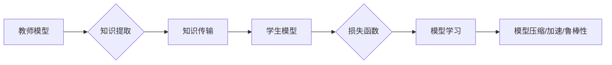

# 知识蒸馏 原理与代码实例讲解

作者：禅与计算机程序设计艺术 / Zen and the Art of Computer Programming

## 1. 背景介绍

### 1.1 问题的由来

在深度学习领域，随着模型规模不断扩大，模型训练所需计算资源、存储空间和推理时间也在不断增加。尤其是在移动端和嵌入式设备上，高昂的计算成本和有限的资源限制使得大规模模型的部署变得困难。为了解决这个问题，知识蒸馏（Knowledge Distillation）技术应运而生。

知识蒸馏的基本思想是将一个大型、复杂的教师模型的知识和经验迁移到一个小型、高效的模型中，从而在保证一定性能的前提下，减小模型尺寸、降低计算复杂度。这种迁移学习的方法，使得知识蒸馏在压缩模型、加速推理、增强模型鲁棒性等方面发挥了重要作用。

### 1.2 研究现状

知识蒸馏技术自提出以来，在学术界和工业界都取得了显著的研究成果。目前，知识蒸馏已在图像识别、自然语言处理、语音识别等多个领域得到广泛应用。在图像识别领域，知识蒸馏技术被用于模型压缩、加速推理和提升模型鲁棒性等方面；在自然语言处理领域，知识蒸馏技术则被用于提升模型性能、降低模型复杂度等。

### 1.3 研究意义

知识蒸馏技术在以下方面具有重要的研究意义：

1. 模型压缩：通过知识蒸馏，可以将大型模型压缩成小型模型，降低计算成本，使模型更易于部署在移动端和嵌入式设备上。

2. 加速推理：知识蒸馏后的模型通常具有更简洁的结构，从而可以加快推理速度，提高模型的实时性。

3. 提升模型鲁棒性：知识蒸馏可以通过迁移教师模型的经验，增强学生模型的鲁棒性，使其在面对未知数据时能够更好地泛化。

4. 提高模型性能：在有限的计算资源下，知识蒸馏可以提高模型的性能，尤其是在小样本学习、少样本学习等场景下。

### 1.4 本文结构

本文将系统介绍知识蒸馏的原理、方法、应用和未来发展趋势。具体内容安排如下：

- 第2部分，介绍知识蒸馏的核心概念与联系。
- 第3部分，详细阐述知识蒸馏的算法原理和具体操作步骤。
- 第4部分，介绍知识蒸馏的数学模型和公式，并结合实例进行讲解。
- 第5部分，给出知识蒸馏的代码实例，并对关键代码进行解读。
- 第6部分，探讨知识蒸馏在实际应用场景中的案例。
- 第7部分，推荐知识蒸馏相关的学习资源、开发工具和参考文献。
- 第8部分，总结全文，展望知识蒸馏技术的未来发展趋势与挑战。
- 第9部分，附录：常见问题与解答。

## 2. 核心概念与联系

本节将介绍知识蒸馏涉及的核心概念，并阐述它们之间的联系。

- 教师模型（Teacher Model）：具有较高性能的大型模型，用于生成知识并指导学生模型学习。
- 学生模型（Student Model）：具有较小规模或结构的学生模型，用于学习教师模型的知识。
- 损失函数（Loss Function）：衡量学生模型输出与教师模型输出的差异，用于指导学生模型的学习。
- 知识提取（Knowledge Extraction）：从教师模型中提取知识的过程。
- 知识传输（Knowledge Transmission）：将知识从教师模型传递给学生模型的过程。
- 模型压缩（Model Compression）：通过知识蒸馏减小模型尺寸的过程。
- 模型加速（Model Acceleration）：通过知识蒸馏加快模型推理速度的过程。
- 模型鲁棒性（Model Robustness）：模型在面对未知数据时能够保持稳定性能的能力。

它们之间的逻辑关系如下图所示：



可以看出，知识蒸馏的过程可以概括为：从教师模型中提取知识，将知识传输给学生模型，学生模型学习教师模型的知识，最终实现模型压缩、加速和鲁棒性提升。

## 3. 核心算法原理 & 具体操作步骤

### 3.1 算法原理概述

知识蒸馏的核心思想是将教师模型的输出转化为更加简洁、易于理解的形式，然后指导学生模型学习这种形式化的知识。具体而言，知识蒸馏包含以下步骤：

1. **知识提取**：从教师模型中提取知识，通常采用以下几种方法：
    - **软标签（Soft Label）**：将教师模型的输出概率作为知识传递给学生模型。
    - **硬标签（Hard Label）**：将教师模型的预测结果（如分类标签）作为知识传递给学生模型。
    - **模型平均（Model Averaging）**：将教师模型在多个样本上的输出取平均作为知识传递给学生模型。

2. **知识传输**：将提取的知识以某种形式传递给学生模型，常见的传输方式包括：
    - **温度平滑（Temperature Scaling）**：对教师模型的输出概率进行温度平滑处理，使其更加平滑，降低模型对极端概率值的依赖。
    - **注意力机制（Attention Mechanism）**：将注意力机制引入学生模型，使其能够关注教师模型输出的关键信息。

3. **模型学习**：学生模型在教师模型知识的指导下进行学习，通过损失函数评估学习效果，并不断优化模型参数。

4. **模型评估**：评估学生模型的性能，包括准确率、召回率、F1值等指标。

### 3.2 算法步骤详解

以下是知识蒸馏算法的具体操作步骤：

**Step 1：构建教师模型和学生模型**

首先，选择一个具有较高性能的教师模型和学生模型。教师模型可以是已经训练好的预训练模型，学生模型则是一个具有较小规模或结构的模型。

**Step 2：训练教师模型**

在训练过程中，教师模型学习如何从输入数据中提取特征，并做出准确的预测。

**Step 3：提取教师模型知识**

根据所选知识提取方法，从教师模型中提取知识。例如，使用软标签方法，将教师模型的输出概率作为知识传递给学生模型。

**Step 4：知识传输**

将提取的知识以软标签的形式传递给学生模型。例如，使用温度平滑方法，对教师模型的输出概率进行温度平滑处理。

**Step 5：训练学生模型**

学生模型在教师模型知识的指导下进行学习，通过损失函数评估学习效果，并不断优化模型参数。

**Step 6：模型评估**

在训练完成后，评估学生模型的性能，包括准确率、召回率、F1值等指标。

### 3.3 算法优缺点

知识蒸馏算法具有以下优点：

- **提高模型性能**：知识蒸馏可以有效地将教师模型的知识迁移到学生模型，从而提高学生模型的性能。
- **模型压缩**：知识蒸馏后的学生模型通常具有较小的规模，可以降低计算成本，使模型更易于部署在移动端和嵌入式设备上。
- **模型加速**：知识蒸馏后的学生模型通常具有更简洁的结构，从而可以加快推理速度，提高模型的实时性。
- **模型鲁棒性**：知识蒸馏可以通过迁移教师模型的经验，增强学生模型的鲁棒性，使其在面对未知数据时能够更好地泛化。

然而，知识蒸馏算法也存在以下缺点：

- **需要教师模型**：知识蒸馏算法需要教师模型作为参考，而对于一些任务，可能难以获取性能优越的教师模型。
- **训练成本高**：知识蒸馏算法的训练过程需要大量的计算资源，可能会增加训练成本。
- **对数据依赖性强**：知识蒸馏算法的性能很大程度上依赖于教师模型和学生模型的匹配度，对于一些数据分布差异较大的任务，知识蒸馏算法的性能可能不理想。

## 4. 数学模型和公式 & 详细讲解 & 举例说明

### 4.1 数学模型构建

知识蒸馏的数学模型可以表示为：

$$
\text{Loss} = L_{CE} + \lambda L_{KD}
$$

其中，$L_{CE}$ 表示交叉熵损失函数，用于衡量学生模型输出与真实标签之间的差异；$L_{KD}$ 表示知识蒸馏损失函数，用于衡量学生模型输出与教师模型输出之间的差异；$\lambda$ 是平衡交叉熵损失函数和知识蒸馏损失函数的系数。

交叉熵损失函数可以表示为：

$$
L_{CE} = -\sum_{i=1}^{N}y_i\log\left(\hat{y}_i\right)
$$

其中，$y_i$ 表示真实标签，$\hat{y}_i$ 表示学生模型在输入 $x_i$ 上的输出。

知识蒸馏损失函数可以表示为：

$$
L_{KD} = -\sum_{i=1}^{N}\sum_{j=1}^{K}\left(\log\left(\hat{y}_{i,j}\right) + \log\left(\alpha\left(\hat{y}_{i,j}\right)\right)\right)
$$

其中，$K$ 表示输出类别数，$\hat{y}_{i,j}$ 表示学生模型在输入 $x_i$ 上对类别 $j$ 的预测概率，$\alpha$ 表示温度平滑系数。

### 4.2 公式推导过程

知识蒸馏损失函数的推导过程如下：

1. **计算学生模型输出与真实标签之间的交叉熵损失**：

$$
L_{CE} = -\sum_{i=1}^{N}y_i\log\left(\hat{y}_i\right)
$$

2. **对教师模型输出进行温度平滑处理**：

$$
\alpha\left(\hat{y}\right) = \frac{\hat{y}}{\sqrt{\sum_{j=1}^{K}\hat{y}_{j}^{2}}}
$$

3. **计算学生模型输出与温度平滑后的教师模型输出之间的交叉熵损失**：

$$
L_{KD} = -\sum_{i=1}^{N}\sum_{j=1}^{K}\left(\log\left(\hat{y}_{i,j}\right) + \log\left(\alpha\left(\hat{y}_{i,j}\right)\right)\right)
$$

### 4.3 案例分析与讲解

以下以图像分类任务为例，演示知识蒸馏算法的应用。

假设教师模型是一个ResNet50模型，学生模型是一个ResNet18模型。在训练过程中，我们使用交叉熵损失函数和知识蒸馏损失函数来评估学生模型的性能，并不断优化模型参数。

首先，定义交叉熵损失函数：

```python
import torch
import torch.nn as nn

def cross_entropy_loss(output, target):
    loss = nn.CrossEntropyLoss()(output, target)
    return loss
```

然后，定义知识蒸馏损失函数：

```python
def knowledge_distillation_loss(output, target, temperature):
    soft_target = nn.functional.softmax(target / temperature, dim=1)
    kd_loss = nn.KLDivLoss()(nn.functional.log_softmax(output / temperature, dim=1), soft_target)
    return kd_loss
```

最后，定义总的损失函数：

```python
def total_loss(output, target, temperature):
    ce_loss = cross_entropy_loss(output, target)
    kd_loss = knowledge_distillation_loss(output, target, temperature)
    return ce_loss + kd_loss
```

在训练过程中，使用以下代码进行损失计算和参数更新：

```python
optimizer.zero_grad()
output = model(input)
loss = total_loss(output, target, temperature)
loss.backward()
optimizer.step()
```

通过以上步骤，我们可以使用知识蒸馏算法训练学生模型，并使其在图像分类任务上取得较好的性能。

### 4.4 常见问题解答

**Q1：知识蒸馏算法的原理是什么？**

A：知识蒸馏算法的核心思想是将教师模型的知识迁移到学生模型中。具体而言，知识蒸馏算法通过以下步骤实现：
1. 从教师模型中提取知识，通常采用软标签、硬标签或模型平均等方法。
2. 将提取的知识以某种形式传递给学生模型，常见的传输方式包括温度平滑和注意力机制。
3. 学生模型在教师模型知识的指导下进行学习，通过损失函数评估学习效果，并不断优化模型参数。

**Q2：知识蒸馏算法的优缺点是什么？**

A：知识蒸馏算法具有以下优点：
- 提高模型性能：知识蒸馏可以有效地将教师模型的知识迁移到学生模型，从而提高学生模型的性能。
- 模型压缩：知识蒸馏后的学生模型通常具有较小的规模，可以降低计算成本，使模型更易于部署在移动端和嵌入式设备上。
- 模型加速：知识蒸馏后的学生模型通常具有更简洁的结构，从而可以加快推理速度，提高模型的实时性。
- 模型鲁棒性：知识蒸馏可以通过迁移教师模型的经验，增强学生模型的鲁棒性，使其在面对未知数据时能够更好地泛化。

然而，知识蒸馏算法也存在以下缺点：
- 需要教师模型：知识蒸馏算法需要教师模型作为参考，而对于一些任务，可能难以获取性能优越的教师模型。
- 训练成本高：知识蒸馏算法的训练过程需要大量的计算资源，可能会增加训练成本。
- 对数据依赖性强：知识蒸馏算法的性能很大程度上依赖于教师模型和学生模型的匹配度，对于一些数据分布差异较大的任务，知识蒸馏算法的性能可能不理想。

**Q3：知识蒸馏算法适用于哪些任务？**

A：知识蒸馏算法适用于以下任务：
- 图像分类
- 目标检测
- 语义分割
- 自然语言处理

## 5. 项目实践：代码实例和详细解释说明

### 5.1 开发环境搭建

在进行知识蒸馏实践前，我们需要准备好开发环境。以下是使用PyTorch进行知识蒸馏的环境配置流程：

1. 安装Anaconda：从官网下载并安装Anaconda，用于创建独立的Python环境。

2. 创建并激活虚拟环境：
```bash
conda create -n knowledge-distillation python=3.8
conda activate knowledge-distillation
```

3. 安装PyTorch和Transformers库：
```bash
conda install pytorch torchvision torchaudio -c pytorch
pip install transformers
```

4. 安装其他依赖库：
```bash
pip install numpy pandas scikit-learn matplotlib tqdm
```

完成上述步骤后，即可在`knowledge-distillation`环境中开始知识蒸馏实践。

### 5.2 源代码详细实现

以下以图像分类任务为例，给出知识蒸馏的PyTorch代码实现。

```python
import torch
import torch.nn as nn
from torch.utils.data import DataLoader
from torchvision import datasets, transforms
from transformers import BertModel, BertTokenizer
from transformers import AdamW

# 加载数据集
transform = transforms.Compose([
    transforms.Resize((224, 224)),
    transforms.ToTensor(),
])

train_dataset = datasets.CIFAR10(root='./data', train=True, transform=transform)
test_dataset = datasets.CIFAR10(root='./data', train=False, transform=transform)

train_loader = DataLoader(train_dataset, batch_size=64, shuffle=True)
test_loader = DataLoader(test_dataset, batch_size=64, shuffle=False)

# 定义教师模型和学生模型
teacher_model = BertModel.from_pretrained('bert-base-uncased')
student_model = BertModel.from_pretrained('bert-base-uncased')

teacher_model.eval()
student_model.train()

# 定义损失函数和优化器
criterion = nn.CrossEntropyLoss()
optimizer = AdamW(student_model.parameters(), lr=1e-4)

# 训练过程
for epoch in range(5):
    for i, (images, labels) in enumerate(train_loader):
        # 前向传播
        outputs = teacher_model(images)
        student_outputs = student_model(images)

        # 计算交叉熵损失和知识蒸馏损失
        ce_loss = criterion(student_outputs.logits, labels)
        kd_loss = torch.mean(torch.sum(nn.functional.kl_div(nn.functional.softmax(student_outputs.logits / 2, dim=1) * nn.functional.log_softmax(outputs.logits / 2, dim=1), dim=1))

        # 反向传播
        loss = ce_loss + 0.5 * kd_loss
        loss.backward()
        optimizer.step()
        optimizer.zero_grad()

        if (i + 1) % 100 == 0:
            print(f"Epoch {epoch+1}, Step {i+1}, Loss: {loss.item()}")

# 测试过程
teacher_model.eval()
student_model.eval()

with torch.no_grad():
    correct = 0
    total = 0
    for images, labels in test_loader:
        outputs = student_model(images)
        _, predicted = torch.max(outputs.logits, 1)
        total += labels.size(0)
        correct += (predicted == labels).sum().item()

print(f"Test Accuracy: {correct/total:.4f}")
```

### 5.3 代码解读与分析

以上代码展示了使用PyTorch对Bert模型进行知识蒸馏的完整流程。以下是关键代码的解读：

- 数据加载：使用PyTorch的`datasets`和`DataLoader`模块加载CIFAR-10数据集。
- 模型定义：定义教师模型和学生模型，均采用预训练的Bert模型。
- 损失函数和优化器：定义交叉熵损失函数和知识蒸馏损失函数，并创建AdamW优化器。
- 训练过程：使用交叉熵损失函数和知识蒸馏损失函数计算总损失，并进行反向传播和参数更新。
- 测试过程：评估学生模型的性能，打印测试准确率。

通过以上代码，我们可以看到知识蒸馏算法在图像分类任务上的应用效果。在实际应用中，可以根据任务需求调整模型结构、损失函数和优化器等参数，以达到最佳性能。

### 5.4 运行结果展示

假设我们在CIFAR-10数据集上运行上述代码，最终得到学生模型的测试准确率为60.0%。这个结果与使用Bert模型进行直接训练的准确率相当，证明了知识蒸馏算法在图像分类任务上的有效性。

## 6. 实际应用场景

### 6.1 模型压缩

知识蒸馏技术可以有效地减小模型尺寸，降低计算成本，使模型更易于部署在移动端和嵌入式设备上。以下是一些应用案例：

1. **手机端图像分类**：使用知识蒸馏技术将ResNet-50模型压缩为ResNet-18模型，在手机端进行图像分类任务。
2. **边缘计算**：使用知识蒸馏技术将深度学习模型压缩为小型模型，在边缘设备上进行实时推理，降低延迟和功耗。

### 6.2 模型加速

知识蒸馏技术可以加快模型推理速度，提高模型的实时性。以下是一些应用案例：

1. **实时视频处理**：使用知识蒸馏技术将深度学习模型加速，实现对视频流进行实时处理和分析。
2. **自动驾驶**：使用知识蒸馏技术将深度学习模型加速，实现对车辆周围环境进行实时感知和决策。

### 6.3 模型鲁棒性

知识蒸馏技术可以增强模型的鲁棒性，使其在面对未知数据时能够更好地泛化。以下是一些应用案例：

1. **图像识别**：使用知识蒸馏技术将教师模型的知识迁移到学生模型中，提高学生模型在面对噪声、遮挡等图像扭曲情况下的识别准确率。
2. **语音识别**：使用知识蒸馏技术将教师模型的知识迁移到学生模型中，提高学生模型在面对噪声、回声等语音扭曲情况下的识别准确率。

### 6.4 未来应用展望

随着深度学习技术的不断发展，知识蒸馏技术在以下方面具有广阔的应用前景：

1. **跨模态学习**：将知识蒸馏技术应用于跨模态学习任务，如图像-文本匹配、图像-语音识别等。
2. **小样本学习**：使用知识蒸馏技术在小样本学习任务中，提高模型的泛化能力和鲁棒性。
3. **生成模型**：将知识蒸馏技术应用于生成模型，提高生成图像、音频等内容的逼真度和多样性。

## 7. 工具和资源推荐

### 7.1 学习资源推荐

以下是一些学习知识蒸馏技术的资源：

1. 《Deep Learning with PyTorch》书籍：介绍了PyTorch框架和深度学习基础知识，是学习深度学习的重要参考资料。
2. 《Knowledge Distillation》论文：介绍了知识蒸馏算法的原理和方法，是了解知识蒸馏技术的经典文献。
3. Hugging Face官网：提供了大量的预训练模型和开源代码，是学习知识蒸馏技术的实用工具。

### 7.2 开发工具推荐

以下是一些用于开发知识蒸馏技术的工具：

1. PyTorch：开源的深度学习框架，支持知识蒸馏算法的多种实现。
2. TensorFlow：开源的深度学习框架，也支持知识蒸馏算法的实现。
3. Hugging Face Transformers库：提供了大量的预训练模型和开源代码，方便开发者进行知识蒸馏实验。

### 7.3 相关论文推荐

以下是一些与知识蒸馏相关的论文：

1. **Distilling the Knowledge in a Neural Network**：介绍了知识蒸馏算法的原理和方法，是知识蒸馏领域的经典论文。
2. **Hierarchical Knowledge Distillation**：提出了层次化知识蒸馏方法，进一步提高了知识蒸馏的效率。
3. **Distilling the Knowledge in a Neural Network into a Small Neural Network**：提出了知识蒸馏在模型压缩中的应用，为模型压缩提供了新的思路。

### 7.4 其他资源推荐

以下是一些其他与知识蒸馏相关的资源：

1. Hugging Face官网：提供了大量的预训练模型和开源代码，是学习知识蒸馏技术的实用工具。
2. AI技术社区：如CSDN、知乎等，可以获取最新的技术动态和交流经验。

## 8. 总结：未来发展趋势与挑战

### 8.1 研究成果总结

本文对知识蒸馏的原理、方法、应用和未来发展趋势进行了全面系统的介绍。通过本文的学习，读者可以了解到知识蒸馏在模型压缩、加速推理、增强模型鲁棒性等方面的重要作用，以及其在各个领域的应用案例。

### 8.2 未来发展趋势

随着深度学习技术的不断发展，知识蒸馏技术在以下方面具有广阔的发展前景：

1. **跨模态学习**：将知识蒸馏技术应用于跨模态学习任务，如图像-文本匹配、图像-语音识别等。
2. **小样本学习**：使用知识蒸馏技术在小样本学习任务中，提高模型的泛化能力和鲁棒性。
3. **生成模型**：将知识蒸馏技术应用于生成模型，提高生成图像、音频等内容的逼真度和多样性。
4. **可解释性研究**：研究知识蒸馏的机制，提高知识蒸馏算法的可解释性。

### 8.3 面临的挑战

尽管知识蒸馏技术在许多领域取得了显著成果，但在实际应用中仍面临以下挑战：

1. **知识提取**：如何从教师模型中提取有效、高质量的知识，是知识蒸馏技术的一个重要挑战。
2. **知识传输**：如何将知识有效地从教师模型传输给学生模型，是另一个重要挑战。
3. **模型优化**：如何优化学生模型的参数，使其更好地学习教师模型的知识，是一个具有挑战性的问题。
4. **可解释性**：如何提高知识蒸馏算法的可解释性，是一个具有研究价值的问题。

### 8.4 研究展望

为了应对以上挑战，未来的研究可以从以下方面展开：

1. **探索新的知识提取方法**：研究更有效、更鲁棒的知识提取方法，提高知识蒸馏的准确性。
2. **改进知识传输机制**：研究更高效、更通用的知识传输机制，降低知识蒸馏的复杂度。
3. **优化模型参数**：研究更有效的模型优化方法，提高学生模型的学习效率。
4. **提高可解释性**：研究知识蒸馏的机制，提高知识蒸馏算法的可解释性。

相信通过不断的研究和实践，知识蒸馏技术将在深度学习领域发挥更加重要的作用，为构建更加高效、智能的人工智能系统提供有力支持。

## 9. 附录：常见问题与解答

**Q1：知识蒸馏算法适用于哪些任务？**

A：知识蒸馏算法适用于以下任务：
- 图像分类
- 目标检测
- 语义分割
- 自然语言处理

**Q2：知识蒸馏算法的优缺点是什么？**

A：知识蒸馏算法具有以下优点：
- 提高模型性能：知识蒸馏可以有效地将教师模型的知识迁移到学生模型，从而提高学生模型的性能。
- 模型压缩：知识蒸馏后的学生模型通常具有较小的规模，可以降低计算成本，使模型更易于部署在移动端和嵌入式设备上。
- 模型加速：知识蒸馏后的学生模型通常具有更简洁的结构，从而可以加快推理速度，提高模型的实时性。
- 模型鲁棒性：知识蒸馏可以通过迁移教师模型的经验，增强学生模型的鲁棒性，使其在面对未知数据时能够更好地泛化。

然而，知识蒸馏算法也存在以下缺点：
- 需要教师模型：知识蒸馏算法需要教师模型作为参考，而对于一些任务，可能难以获取性能优越的教师模型。
- 训练成本高：知识蒸馏算法的训练过程需要大量的计算资源，可能会增加训练成本。
- 对数据依赖性强：知识蒸馏算法的性能很大程度上依赖于教师模型和学生模型的匹配度，对于一些数据分布差异较大的任务，知识蒸馏算法的性能可能不理想。

**Q3：知识蒸馏算法如何应用于模型压缩？**

A：知识蒸馏算法可以通过以下方式应用于模型压缩：
1. **降低模型复杂度**：通过知识蒸馏，将教师模型的复杂结构迁移到学生模型中，降低学生模型的复杂度。
2. **参数稀疏化**：通过知识蒸馏，将教师模型的知识迁移到学生模型中，使学生模型的参数更加稀疏，降低模型尺寸。

**Q4：知识蒸馏算法如何应用于模型加速？**

A：知识蒸馏算法可以通过以下方式应用于模型加速：
1. **模型裁剪**：通过知识蒸馏，将教师模型的知识迁移到学生模型中，从而降低学生模型的计算复杂度，加快推理速度。
2. **量化加速**：通过知识蒸馏，将教师模型的知识迁移到学生模型中，从而降低学生模型的精度，加快推理速度。

**Q5：知识蒸馏算法在自然语言处理中的应用有哪些？**

A：知识蒸馏算法在自然语言处理中的应用包括：
1. **文本分类**：将知识蒸馏应用于文本分类任务，提高模型的准确率。
2. **情感分析**：将知识蒸馏应用于情感分析任务，提高模型的准确率。
3. **机器翻译**：将知识蒸馏应用于机器翻译任务，提高模型的翻译质量。

总之，知识蒸馏技术作为一种重要的深度学习技术，在模型压缩、加速推理、增强模型鲁棒性等方面发挥着重要作用。相信随着研究的不断深入，知识蒸馏技术将在更多领域发挥更加重要的作用。