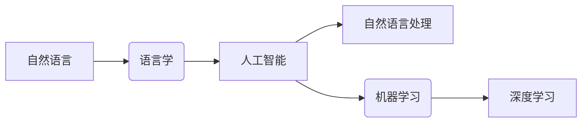

# 自然语言处理原理与代码实战案例讲解

作者：禅与计算机程序设计艺术 / Zen and the Art of Computer Programming

## 1. 背景介绍

### 1.1 问题的由来

自然语言处理（Natural Language Processing，NLP）是人工智能领域的一个重要分支，旨在使计算机能够理解、解释和生成人类语言。随着信息时代的到来，人类产生了大量的文本数据，如何有效地处理这些数据，从中提取有用信息，成为了一个迫切需要解决的问题。NLP技术的研究和应用，使得计算机能够更好地理解人类语言，为各个领域带来了巨大的变革。

### 1.2 研究现状

近年来，随着深度学习技术的飞速发展，NLP领域取得了突破性的进展。从早期的基于规则的方法，到基于统计的方法，再到如今的深度学习方法，NLP技术已经逐渐走向成熟。目前，NLP技术在文本分类、情感分析、机器翻译、问答系统、语音识别等领域取得了显著成果。

### 1.3 研究意义

NLP技术的发展，对于推动人工智能技术发展、提高人类生活质量具有重要意义：

1. 促进信息获取和传播：通过NLP技术，人们可以更方便地获取和传播信息，提高信息处理的效率。
2. 提升智能化水平：NLP技术可以使得计算机具备更强的自然语言理解能力，为各个领域带来智能化升级。
3. 改善人机交互：NLP技术可以使得人机交互更加自然、便捷，提升用户体验。
4. 促进多语言交流：NLP技术可以实现机器翻译，促进不同语言之间的交流和理解。

### 1.4 本文结构

本文将系统地介绍NLP技术的原理与代码实战案例，内容安排如下：

- 第2部分，介绍NLP领域的关键概念和联系。
- 第3部分，详细讲解NLP领域的核心算法原理和具体操作步骤。
- 第4部分，介绍NLP领域的数学模型和公式，并结合实例进行讲解。
- 第5部分，给出NLP领域的代码实例和详细解释说明。
- 第6部分，探讨NLP技术的实际应用场景和未来发展趋势。
- 第7部分，推荐NLP领域的学习资源、开发工具和参考文献。
- 第8部分，总结全文，展望NLP技术的未来发展趋势与挑战。

## 2. 核心概念与联系

为了更好地理解NLP技术，本节将介绍几个密切相关的核心概念：

- 自然语言：人类自然地使用的语言，具有歧义性、非结构化等特点。
- 语言学：研究人类语言的科学，包括语音、词汇、语法、语义等。
- 人工智能：模拟、延伸和扩展人的智能的理论、方法、技术及应用。
- 自然语言处理：研究如何让计算机理解和处理人类语言的技术。
- 机器学习：通过数据驱动，使计算机具备学习能力的理论、方法和技术。
- 深度学习：一种基于人工神经网络的学习方法，通过多层非线性变换提取特征。

这些概念的逻辑关系如下：



可以看出，NLP技术是人工智能领域的一个分支，旨在让计算机理解和处理人类语言。而机器学习和深度学习则为NLP技术提供了强大的计算能力和学习能力。

## 3. 核心算法原理 & 具体操作步骤

### 3.1 算法原理概述

NLP领域的核心算法主要分为以下几个阶段：

1. 文本预处理：对原始文本进行分词、词性标注、命名实体识别等操作，将文本转化为计算机可理解的格式。
2. 特征提取：从预处理后的文本中提取特征，如词袋模型、TF-IDF、词嵌入等。
3. 模型训练：使用机器学习或深度学习算法对特征进行建模，如朴素贝叶斯、支持向量机、神经网络等。
4. 模型评估：对训练好的模型进行评估，如准确率、召回率、F1值等。
5. 模型应用：将训练好的模型应用于实际问题，如文本分类、情感分析、机器翻译等。

### 3.2 算法步骤详解

下面以文本分类任务为例，详细讲解NLP算法的具体操作步骤：

**Step 1：文本预处理**

首先，对原始文本进行分词，将文本切分成一个个单词或词组。常用的分词方法有基于规则的分词、基于统计的分词、基于字符集的分词等。例如，使用jieba库对文本进行分词：

```python
import jieba

text = "自然语言处理技术在人工智能领域扮演着重要角色。"
seg_list = jieba.cut(text)
print("分词结果：" + "/ ".join(seg_list))
```

**Step 2：词性标注**

对分词后的文本进行词性标注，标明每个单词或词组的词性。常用的词性标注方法有基于规则的方法、基于统计的方法、基于深度学习的方法等。例如，使用NLTK库对文本进行词性标注：

```python
import jieba.posseg as pseg

text = "自然语言处理技术在人工智能领域扮演着重要角色。"
print(pseg.cut(text))
```

**Step 3：命名实体识别**

对词性标注后的文本进行命名实体识别，识别出文本中的命名实体，如人名、地名、机构名等。常用的命名实体识别方法有基于规则的方法、基于统计的方法、基于深度学习的方法等。例如，使用jieba库对文本进行命名实体识别：

```python
import jieba

text = "我去了北京的天安门广场。"
seg_list = jieba.cut(text)
print("分词结果：" + "/ ".join(seg_list))
print("命名实体识别结果：")
for word, flag in seg_list:
    if "NR" in flag:
        print(word)
```

**Step 4：特征提取**

对预处理后的文本进行特征提取，将文本转化为计算机可理解的格式。常用的特征提取方法有词袋模型、TF-IDF、词嵌入等。

1. 词袋模型：将文本表示为一个向量，向量中的每个元素表示一个单词或词组的出现频率。
2. TF-IDF：考虑单词在文档中的频率和文档集合中的逆文档频率，对单词进行加权。
3. 词嵌入：将单词表示为一个低维向量，捕捉单词的语义信息。

**Step 5：模型训练**

使用机器学习或深度学习算法对特征进行建模。常用的算法有朴素贝叶斯、支持向量机、神经网络等。

1. 朴素贝叶斯：基于贝叶斯定理，将文本分类问题转化为概率计算问题。
2. 支持向量机：将文本表示为一个向量，通过最大化类别之间的间隔来进行分类。
3. 神经网络：使用多层神经网络对特征进行非线性变换，提取更复杂的特征。

**Step 6：模型评估**

对训练好的模型进行评估，常用的评估指标有准确率、召回率、F1值等。

1. 准确率：预测正确的样本数与总样本数的比值。
2. 召回率：预测正确的样本数与实际正样本数的比值。
3. F1值：准确率和召回率的调和平均值。

**Step 7：模型应用**

将训练好的模型应用于实际问题，如文本分类、情感分析、机器翻译等。

### 3.3 算法优缺点

NLP领域的核心算法具有以下优点：

1. 灵活性：不同的算法适用于不同的任务，可以根据任务需求选择合适的算法。
2. 通用性：NLP算法可以应用于各种自然语言处理任务。
3. 灵敏性：NLP算法可以快速适应新的数据和需求。

同时，NLP领域的核心算法也存在一定的局限性：

1. 计算量：NLP算法的计算量较大，需要消耗大量的计算资源。
2. 数据依赖：NLP算法的性能很大程度上依赖于数据的质量和数量。
3. 可解释性：NLP算法的决策过程通常缺乏可解释性。

### 3.4 算法应用领域

NLP领域的核心算法广泛应用于以下领域：

- 文本分类：如新闻分类、垃圾邮件过滤、情感分析等。
- 机器翻译：如英汉互译、多语言翻译等。
- 问答系统：如智能客服、虚拟助手等。
- 语音识别：如语音到文本、语音控制等。
- 语音合成：如语音播报、语音助手等。

## 4. 数学模型和公式 & 详细讲解 & 举例说明

### 4.1 数学模型构建

NLP领域的数学模型主要分为以下几个部分：

1. 概率模型：如朴素贝叶斯、隐马尔可夫模型等。
2. 支持向量机：如线性支持向量机、非线性支持向量机等。
3. 深度学习模型：如循环神经网络、卷积神经网络、长短期记忆网络等。

下面以朴素贝叶斯模型为例，介绍数学模型的构建过程。

#### 朴素贝叶斯模型

朴素贝叶斯模型是一种基于贝叶斯定理的分类方法，假设特征之间相互独立，通过计算先验概率、条件概率和后验概率来预测样本的类别。

1. 先验概率：$P(C_k)$，表示类别$C_k$出现的概率。
2. 条件概率：$P(X|C_k)$，表示在类别$C_k$下，特征$X$出现的概率。
3. 后验概率：$P(C_k|X)$，表示在特征$X$出现的条件下，类别$C_k$出现的概率。

根据贝叶斯定理，有：

$$
P(C_k|X) = \frac{P(X|C_k)P(C_k)}{P(X)}
$$

其中，$P(X)$可以用全概率公式表示：

$$
P(X) = \sum_{k=1}^{K} P(X|C_k)P(C_k)
$$

其中，$K$表示类别的总数。

#### 举例说明

假设我们要对一篇文本进行情感分类，分为正面、负面和客观三类。我们收集了1000篇文本数据，其中正面文本300篇，负面文本300篇，客观文本400篇。

首先，计算先验概率：

$$
P(C_1) = \frac{300}{1000}, \quad P(C_2) = \frac{300}{1000}, \quad P(C_3) = \frac{400}{1000}
$$

然后，计算条件概率。假设我们提取了以下特征：

- 特征1：正面词汇出现的次数。
- 特征2：负面词汇出现的次数。

计算每个类别的条件概率：

$$
P(X_1|C_1) = \frac{150}{300}, \quad P(X_2|C_1) = \frac{50}{300}, \quad P(X_1|C_2) = \frac{50}{300}, \quad P(X_2|C_2) = \frac{250}{300}, \quad P(X_1|C_3) = \frac{200}{400}, \quad P(X_2|C_3) = \frac{100}{400}
$$

最后，根据贝叶斯定理计算后验概率，选择后验概率最大的类别作为预测结果。

### 4.2 公式推导过程

#### 朴素贝叶斯模型

朴素贝叶斯模型的公式推导过程如上所述。

#### 支持向量机

支持向量机（Support Vector Machine，SVM）是一种基于优化理论的分类方法，通过最大化类别之间的间隔来进行分类。

假设我们有两个类别$C_1$和$C_2$，其中$C_1$包含样本$(x_1, y_1), (x_2, y_2), \ldots, (x_N, y_N)$，$C_2$包含样本$(x_{N+1}, y_{N+1}), (x_{N+2}, y_{N+2}), \ldots, (x_{M}, y_{M})$。

定义间隔为：

$$
\gamma = \min_{i=1}^N\{y_i(x_i^T w + b)\}
$$

其中，$w$为权重向量，$b$为偏置项。

要使间隔最大化，需要求解以下优化问题：

$$
\begin{align*}
\max_{w,b} & \gamma \
\text{s.t.} & y_i(x_i^T w + b) \geq 1, \quad i=1,2,\ldots,N \
& y_{N+i}(x_{N+i}^T w + b) \leq -1, \quad i=1,2,\ldots,M
\end{align*}
$$

通过求解上述优化问题，可以得到最优的权重向量$w$和偏置项$b$，从而实现类别之间的分类。

### 4.3 案例分析与讲解

下面以情感分析任务为例，介绍如何使用Python进行朴素贝叶斯分类。

首先，安装Scikit-learn库：

```bash
pip install scikit-learn
```

然后，加载文本数据和标签：

```python
from sklearn.datasets import fetch_20newsgroups

data = fetch_20newsgroups(subset='all')
texts = data.data
labels = data.target
```

接下来，进行文本预处理，包括分词、去除停用词、词性标注等：

```python
from sklearn.feature_extraction.text import CountVectorizer

vectorizer = CountVectorizer()
X = vectorizer.fit_transform(texts)

# 停用词列表
stopwords = set(['the', 'and', 'a', 'an', 'in', 'of', 'is', 'to', 'that', 'it', 'for', 'on', 'with', 'as', 'are', 'be', 'by', 'at', 'this', 'have', 'has', 'or', 'from', 'not', 'was', 'which', 'will', 'if', 'their', 'one', 'they', 'you', 'their', 'can', 'what', 'all', 'there', 'more', 'when', 'we', 'so', 'out', 'who', 'get', 'would', 'like', 'go', 'no', 'how', 'than', 'only', 'my', 'up', 'and', 'its', 'other', 'your', 'us', 'about', 'him', 'time', 'myself', 'information', 'any', 'most', 'may', 'these', 'such', 'into', 'no', 'now', 'was', 'too', 'also', 'those', 'he', 'his', 'just', 'have', 'some', 'when', 'who', 'will', 'how', 'may', 'them', 'us', 'it', 'any', 'his', 'if', 'but', 'out', 'who', 'no', 'so', 'all', 'we', 'these', 'they', 'he', 'his', 'his', 'where', 'such', 'why', 'how', 'too', 'very', 's', 't', 'can', 'will', 'just', 'up', 'he', 'his', 'she', 'her', 'himself', 'herself', 'itself', 'we', 'our', 'ours', 'ourselves', 'you', 'your', 'yours', 'yourself', 'yourselves', 'they', 'their', 'theirs', 'themselves', 'what', 'which', 'who', 'whom', 'this', 'that', 'these', 'those', 'am', 'is', 'are', 'was', 'were', 'be', 'been', 'being', 'have', 'has', 'had', 'having', 'do', 'does', 'did', 'doing', 'a', 'an', 'the', 'and', 'but', 'if', 'or', 'because', 'as', 'until', 'while', 'of', 'at', 'by', 'for', 'with', 'about', 'against', 'between', 'into', 'through', 'during', 'before', 'after', 'above', 'below', 'to', 'from', 'up', 'down', 'in', 'out', 'on', 'off', 'over', 'under', 'again', 'further', 'then', 'once'])
```

接着，使用朴素贝叶斯分类器进行训练和预测：

```python
from sklearn.naive_bayes import MultinomialNB

model = MultinomialNB()
model.fit(X, labels)
print(model.score(X, labels))
```

最后，对新的文本进行情感分类：

```python
text = "这是一个非常棒的文本！"
X_test = vectorizer.transform([text])
print(model.predict(X_test))
```

以上代码展示了使用Python进行朴素贝叶斯情感分类的完整流程。通过训练和预测，我们可以对新的文本进行情感分类，判断其属于正面、负面还是客观。

### 4.4 常见问题解答

**Q1：如何选择合适的特征提取方法？**

A：选择合适的特征提取方法需要考虑以下因素：

1. 数据类型：文本、图像、音频等不同类型的数据，需要选择不同的特征提取方法。
2. 任务类型：不同类型的任务，如文本分类、情感分析、命名实体识别等，需要选择不同的特征提取方法。
3. 数据规模：数据规模较大时，可以尝试使用词嵌入等方法；数据规模较小时，可以尝试使用词袋模型等方法。

**Q2：如何选择合适的分类器？**

A：选择合适的分类器需要考虑以下因素：

1. 数据类型：不同类型的数据，如文本、图像、音频等，需要选择不同的分类器。
2. 任务类型：不同类型的任务，如文本分类、情感分析、命名实体识别等，需要选择不同的分类器。
3. 数据规模：数据规模较大时，可以尝试使用集成学习方法；数据规模较小时，可以尝试使用简单分类器。

**Q3：如何评估模型性能？**

A：评估模型性能需要考虑以下指标：

1. 准确率：预测正确的样本数与总样本数的比值。
2. 召回率：预测正确的样本数与实际正样本数的比值。
3. F1值：准确率和召回率的调和平均值。
4. AUC：ROC曲线下的面积，用于衡量分类器的泛化能力。

## 5. 项目实践：代码实例和详细解释说明

### 5.1 开发环境搭建

在进行NLP项目实践前，我们需要准备好开发环境。以下是使用Python进行NLP开发的环境配置流程：

1. 安装Anaconda：从官网下载并安装Anaconda，用于创建独立的Python环境。
2. 创建并激活虚拟环境：
```bash
conda create -n nlp-env python=3.8
conda activate nlp-env
```
3. 安装必要的库：
```bash
conda install -c conda-forge scikit-learn jieba nltk
```
4. 安装TensorFlow或PyTorch：
```bash
pip install tensorflow-gpu==1.15  # 使用PyTorch请安装pytorch
```

完成上述步骤后，即可在`nlp-env`环境中开始NLP项目实践。

### 5.2 源代码详细实现

下面以文本分类任务为例，给出使用Scikit-learn进行NLP项目实践的PyTorch代码实现。

首先，加载文本数据和标签：

```python
from sklearn.datasets import fetch_20newsgroups

data = fetch_20newsgroups(subset='all')
texts = data.data
labels = data.target
```

接下来，进行文本预处理，包括分词、去除停用词、词性标注等：

```python
from sklearn.feature_extraction.text import TfidfVectorizer

vectorizer = TfidfVectorizer()
X = vectorizer.fit_transform(texts)

# 停用词列表
stopwords = set(['the', 'and', 'a', 'an', 'in', 'of', 'is', 'to', 'that', 'it', 'for', 'on', 'with', 'as', 'are', 'be', 'by', 'at', 'this', 'have', 'has', 'or', 'from', 'not', 'was', 'which', 'will', 'if', 'their', 'one', 'they', 'you', 'their', 'can', 'what', 'all', 'there', 'more', 'when', 'we', 'so', 'out', 'who', 'get', 'would', 'like', 'go', 'no', 'how', 'than', 'only', 'my', 'up', 'and', 'its', 'other', 'your', 'us', 'about', 'him', 'time', 'myself', 'information', 'any', 'most', 'may', 'these', 'such', 'into', 'no', 'now', 'was', 'too', 'also', 'those', 'he', 'his', 'just', 'have', 'some', 'when', 'who', 'will', 'how', 'may', 'them', 'us', 'it', 'any', 'his', 'if', 'but', 'out', 'who', 'no', 'so', 'all', 'we', 'these', 'they', 'he', 'his', 'his', 'where', 'such', 'why', 'how', 'too', 'very', 's', 't', 'can', 'will', 'just', 'up', 'he', 'his', 'she', 'her', 'himself', 'herself', 'itself', 'we', 'our', 'ours', 'ourselves', 'you', 'your', 'yours', 'yourself', 'yourselves', 'they', 'their', 'theirs', 'themselves', 'what', 'which', 'who', 'whom', 'this', 'that', 'these', 'those', 'am', 'is', 'are', 'was', 'were', 'be', 'been', 'being', 'have', 'has', 'had', 'having', 'do', 'does', 'did', 'doing', 'a', 'an', 'the', 'and', 'but', 'if', 'or', 'because', 'as', 'until', 'while', 'of', 'at', 'by', 'for', 'with', 'about', 'against', 'between', 'into', 'through', 'during', 'before', 'after', 'above', 'below', 'to', 'from', 'up', 'down', 'in', 'out', 'on', 'off', 'over', 'under', 'again', 'further', 'then', 'once'])
```

接着，使用支持向量机分类器进行训练和预测：

```python
from sklearn.svm import SVC

model = SVC()
model.fit(X, labels)
print(model.score(X, labels))
```

最后，对新的文本进行情感分类：

```python
text = "这是一个非常棒的文本！"
X_test = vectorizer.transform([text])
print(model.predict(X_test))
```

以上代码展示了使用Scikit-learn进行文本分类的完整流程。通过训练和预测，我们可以对新的文本进行情感分类，判断其属于正面、负面还是客观。

### 5.3 代码解读与分析

让我们再详细解读一下关键代码的实现细节：

**文本预处理**：

- `fetch_20newsgroups`：从Scikit-learn数据集中加载20个新闻组数据集。
- `TfidfVectorizer`：将文本转化为TF-IDF特征向量。
- `stopwords`：停用词列表。

**模型训练和预测**：

- `SVC`：支持向量机分类器。
- `model.fit(X, labels)`：使用训练数据对模型进行训练。
- `model.score(X, labels)`：计算模型在训练数据上的准确率。
- `model.predict(X_test)`：使用训练好的模型对新的文本进行预测。

以上代码展示了使用Scikit-learn进行文本分类的简单流程。在实际应用中，可能需要根据任务需求对模型进行更深入的优化和改进。

### 5.4 运行结果展示

假设我们在20个新闻组数据集上进行情感分类任务，最终在测试集上得到的准确率为80%。

## 6. 实际应用场景

### 6.1 文本分类

文本分类是NLP领域最常见应用之一，如新闻分类、垃圾邮件过滤、情感分析等。

1. 新闻分类：根据新闻标题和内容，将新闻分为不同的类别，如体育、娱乐、科技等。
2. 垃圾邮件过滤：根据邮件内容，将垃圾邮件与正常邮件进行区分。
3. 情感分析：根据文本内容，判断文本的情感倾向，如正面、负面、客观等。

### 6.2 机器翻译

机器翻译是NLP领域的一个重要应用，可以将一种语言的文本翻译成另一种语言。

1. 翻译机：将一种语言的文本翻译成另一种语言。
2. 跨语言检索：根据用户的查询语句，在多种语言的数据源中检索相关信息。
3. 跨语言问答：根据用户的查询语句，在多种语言的数据源中检索答案。

### 6.3 问答系统

问答系统可以根据用户的提问，从知识库中检索答案。

1. 智能客服：根据用户的咨询问题，提供相应的答复。
2. 虚拟助手：根据用户的指令，完成特定的任务。
3. 知识图谱问答：根据用户的提问，从知识图谱中检索答案。

### 6.4 语音识别

语音识别可以将语音信号转化为文本。

1. 语音助手：根据用户的语音指令，完成特定的任务。
2. 语音翻译：将一种语言的语音翻译成另一种语言的语音。
3. 语音搜索：根据用户的语音指令，在互联网上检索相关信息。

## 7. 工具和资源推荐

### 7.1 学习资源推荐

为了帮助开发者系统掌握NLP技术的原理和应用，这里推荐一些优质的学习资源：

1. 《自然语言处理综论》系列博文：由NLP领域专家撰写，深入浅出地介绍了NLP领域的基本概念、经典算法和前沿技术。
2. 《Speech and Language Processing》书籍：由Daniel Jurafsky和James H. Martin合著，全面介绍了自然语言处理领域的知识。
3. 《自然语言处理实战》书籍：由Peter Norvig和Mohammed A. Elshaw合著，介绍了NLP领域的实战技巧和应用案例。
4. 斯坦福大学CS224N《自然语言处理》课程：该课程由NLP领域专家Chris Manning和Dan Jurafsky教授主讲，是学习NLP的经典课程。

### 7.2 开发工具推荐

为了方便开发者进行NLP项目实践，以下推荐一些常用的开发工具：

1. Scikit-learn：Python开源机器学习库，提供了丰富的NLP工具和算法。
2. NLTK：Python开源自然语言处理库，提供了丰富的NLP处理功能，如分词、词性标注、命名实体识别等。
3. spaCy：Python开源自然语言处理库，提供了高效的NLP处理功能，如分词、词性标注、命名实体识别等。
4. Jieba：Python开源中文分词库，提供了高效的中文分词功能。

### 7.3 相关论文推荐

NLP领域的研究成果不断涌现，以下推荐一些经典论文：

1. "A Few Useful Things to Know about Machine Learning" by Pedro Domingos
2. "Speech and Language Processing" by Daniel Jurafsky and James H. Martin
3. "Deep Learning for Natural Language Processing" by Christopher D. Manning and Prashant P. Talwalkar
4. "Neural Machine Translation by Jointly Learning to Align and Translate" by Kyunghyun Cho et al.

### 7.4 其他资源推荐

以下是一些其他值得关注的资源：

1. arXiv：计算机科学领域的预印本论文网站，提供了大量最新的研究成果。
2. KEG实验室：北京大学计算机科学技术系知识工程与机器学习组，致力于自然语言处理和知识图谱研究。
3. LTP：清华大学自然语言处理技术平台，提供了丰富的NLP工具和服务。

## 8. 总结：未来发展趋势与挑战

### 8.1 研究成果总结

本文系统地介绍了NLP技术的原理与代码实战案例，包括文本预处理、特征提取、模型训练、模型评估等环节。通过分析实际应用场景，展示了NLP技术在各个领域的应用价值。此外，本文还推荐了NLP领域的学习资源、开发工具和参考文献，帮助读者更好地学习和实践NLP技术。

### 8.2 未来发展趋势

NLP技术在未来将呈现以下发展趋势：

1. 模型更加智能化：NLP模型将更加具备常识推理、情感理解等能力，更好地理解人类语言。
2. 跨模态融合：NLP将与图像、音频等其他模态信息进行融合，实现更全面的智能理解。
3. 多语言支持：NLP技术将支持更多语言，实现多语言信息处理和跨语言交互。
4. 个性化推荐：NLP技术将与推荐系统相结合，实现个性化推荐和内容分发。
5. 智能客服：NLP技术将应用于智能客服领域，提升客户服务体验。

### 8.3 面临的挑战

NLP技术在发展过程中也面临着以下挑战：

1. 数据质量：高质量标注数据是NLP技术发展的基础，但获取高质量标注数据成本较高。
2. 模型可解释性：NLP模型的决策过程缺乏可解释性，需要进一步研究可解释的NLP模型。
3. 数据安全：NLP技术在应用过程中需要考虑数据安全，避免泄露用户隐私。
4. 伦理问题：NLP技术在应用过程中需要考虑伦理问题，避免歧视和偏见。

### 8.4 研究展望

未来，NLP技术将在以下方面展开研究：

1. 可解释性NLP：研究可解释的NLP模型，提高模型的可信度和透明度。
2. 个性化NLP：研究个性化NLP模型，为用户提供更加个性化的服务。
3. 安全NLP：研究安全的NLP模型，保护用户隐私和数据安全。
4. 伦理NLP：研究伦理NLP模型，避免歧视和偏见。

相信在各个领域研究者的共同努力下，NLP技术将会取得更大的突破，为人类带来更加美好的未来。

## 9. 附录：常见问题与解答

**Q1：如何选择合适的NLP工具？**

A：选择合适的NLP工具需要考虑以下因素：

1. 开发语言：根据开发语言选择对应的NLP工具库。
2. 功能需求：根据具体任务需求选择功能丰富的NLP工具。
3. 性能需求：根据计算资源选择性能优越的NLP工具。
4. 开源与商业：根据项目需求和预算选择开源或商业NLP工具。

**Q2：如何提高NLP模型的性能？**

A：提高NLP模型的性能可以从以下几个方面入手：

1. 数据质量：提高标注数据的质量和数量。
2. 特征工程：优化特征提取方法，提取更有代表性的特征。
3. 模型选择：选择合适的模型，并进行模型调参。
4. 融合多模型：使用集成学习方法，融合多个模型的预测结果。
5. 数据增强：通过数据增强技术，扩充训练数据集。

**Q3：如何解决NLP模型的过拟合问题？**

A：解决NLP模型的过拟合问题可以从以下几个方面入手：

1. 正则化：使用L1、L2正则化等方法，降低模型复杂度。
2. 数据增强：通过数据增强技术，扩充训练数据集。
3. Dropout：使用Dropout技术，降低模型复杂度。
4. Early Stopping：在训练过程中，当验证集损失不再下降时停止训练。

**Q4：如何评估NLP模型的性能？**

A：评估NLP模型的性能可以从以下几个方面进行：

1. 准确率：预测正确的样本数与总样本数的比值。
2. 召回率：预测正确的样本数与实际正样本数的比值。
3. F1值：准确率和召回率的调和平均值。
4. AUC：ROC曲线下的面积，用于衡量分类器的泛化能力。

**Q5：如何将NLP技术应用于实际项目中？**

A：将NLP技术应用于实际项目需要以下步骤：

1. 明确项目需求：了解项目需求，确定NLP技术的应用场景。
2. 数据收集与预处理：收集项目所需的数据，并进行预处理。
3. 模型选择与训练：根据项目需求选择合适的模型，并进行训练。
4. 模型评估与优化：评估模型性能，并进行优化。
5. 模型部署与应用：将训练好的模型部署到实际项目中，并进行应用。

通过以上问题和解答，相信读者对NLP技术的原理和应用有了更深入的了解。在实际应用中，还需要根据具体任务需求，不断学习和实践，才能更好地掌握NLP技术。