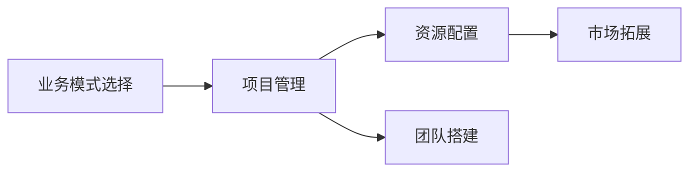

                 

# 技术外包：从接单到建立工作室

技术外包服务在全球IT行业中占据着重要地位，从小型企业到大型企业，都在寻求外包服务来提高效率，降低成本。本文将详细探讨从接单到建立工作室的全过程，包括选择合适的业务模式、搭建团队、项目管理、资源配置和市场拓展等核心环节。通过系统化的分析，帮助读者了解如何高效地开展技术外包业务，并建立自己的技术工作室。

## 1. 背景介绍

### 1.1 背景概述
技术外包服务在20世纪90年代中后期开始兴起，并随着互联网技术的飞速发展而日益受到重视。技术外包服务可以涵盖软件开发、网络安全、数据分析、测试等多个领域，为各类企业提供定制化的解决方案，提高其业务效率和市场竞争力。

### 1.2 业务模式选择
技术外包服务主要分为三种业务模式：

1. **项目外包**：企业将项目整体外包给第三方，由外包公司承担整个项目的开发和维护工作。
2. **部分外包**：企业仅将项目的部分工作，如测试、UI/UX设计等外包出去。
3. **人才外包**：企业对外包人才进行长期雇佣，用于长期项目开发、技术支持等。

选择合适的业务模式，应考虑企业的规模、项目的复杂度、外包成本、项目周期等因素。

## 2. 核心概念与联系

### 2.1 核心概念概述

为更好地理解技术外包的全过程，本节将介绍几个关键概念及其相互联系：

- **技术外包**：指企业将技术相关的业务或项目，通过合同形式委托给第三方服务提供商，以提高自身核心竞争力。
- **业务模式**：包括项目外包、部分外包和人才外包三种，企业根据项目需求选择合适的模式。
- **项目管理**：指规划、执行、监控和控制项目活动，以确保项目按时、按质、按预算完成的过程。
- **资源配置**：包括人力、物力、技术、资金等资源的合理分配和优化利用。
- **市场拓展**：指通过营销、公关、广告等手段，提高外包服务的知名度和吸引力，扩大市场份额。
- **团队搭建**：指根据项目需求，选择合适的技术人才，组建专业的开发团队。

这些概念之间的逻辑关系可以通过以下Mermaid流程图来展示：



### 2.2 核心概念原理和架构的 Mermaid 流程图


此流程图展示了从项目需求分析到售后服务的全过程，并强调了项目规划与设计、资源配置、人才招聘与培训等关键环节。

## 3. 核心算法原理 & 具体操作步骤

### 3.1 算法原理概述

技术外包服务的核心算法原理包括需求分析、业务模式选择、项目规划与设计、资源配置、团队组建、项目管理、质量控制、交付验收等。每个环节都需要运用科学的方法和工具，以确保外包服务的顺利进行。

### 3.2 算法步骤详解

**步骤一：需求分析**

1. **需求收集**：与客户进行深度沟通，了解其业务需求、技术要求、项目周期、预算等信息。
2. **需求确认**：整理需求信息，形成详细的需求文档。

**步骤二：业务模式选择**

1. **项目类型评估**：评估项目的技术复杂度、风险大小、重要性等，确定合适的业务模式。
2. **成本效益分析**：考虑项目外包的预期成本与收益，选择最适合的业务模式。

**步骤三：项目规划与设计**

1. **项目分解**：将大项目分解为小任务，便于管理和执行。
2. **任务分配**：根据团队成员的技能和经验，合理分配任务。
3. **进度计划**：制定详细的项目进度计划，明确任务完成的里程碑和时间节点。

**步骤四：资源配置**

1. **人力资源配置**：根据项目需求，招聘合适的技术人才，并进行必要的培训。
2. **硬件资源配置**：根据项目需求，配置所需的服务器、网络设备等硬件资源。
3. **软件资源配置**：根据项目需求，配置所需的开发工具、测试工具等软件资源。

**步骤五：团队组建**

1. **人才招聘**：根据项目需求，招聘合适的技术人才。
2. **人才培训**：对新招聘的人才进行必要的技能培训，确保其能够胜任工作。
3. **团队建设**：建立有效的团队沟通机制，提高团队协作效率。

**步骤六：项目管理**

1. **进度跟踪**：实时跟踪项目进度，确保任务按时完成。
2. **质量控制**：对项目的关键节点进行质量检查，确保输出质量符合客户要求。
3. **风险管理**：及时识别和应对项目中的风险，确保项目顺利进行。

**步骤七：交付验收**

1. **成果交付**：将项目成果交付给客户，并进行文档交付和培训。
2. **客户验收**：与客户共同验收项目成果，确保交付质量符合要求。

**步骤八：售后服务与维护**

1. **问题反馈**：建立问题反馈机制，及时解决客户提出的问题。
2. **持续支持**：提供必要的技术支持，确保客户能够顺利使用项目成果。

### 3.3 算法优缺点

技术外包服务的主要优点包括：

1. **成本降低**：通过外包，企业可以避免在人才招聘、培训、设备购置等方面的高成本投入。
2. **效率提升**：外包团队通常具有较高的专业性，能够快速响应项目需求，提升项目执行效率。
3. **质量保证**：外包服务提供商通常有较为完善的流程和技术标准，能够保证项目的质量。

主要缺点包括：

1. **信息不对称**：外包团队与企业之间可能存在信息不对称问题，导致项目沟通不畅。
2. **质量控制难度大**：外包服务的质量控制相对较难，容易出现质量问题。
3. **依赖性强**：外包服务的稳定性依赖于外包团队的专业水平和技术能力，一旦外包团队出现问题，将直接影响项目进展。

### 3.4 算法应用领域

技术外包服务广泛应用于软件开发、网络安全、数据分析、测试、云计算等多个领域，具体包括：

1. **软件开发**：包括软件定制开发、产品化开发、系统集成等。
2. **网络安全**：包括渗透测试、安全评估、安全运维等。
3. **数据分析**：包括数据清洗、数据挖掘、数据可视化等。
4. **测试**：包括单元测试、集成测试、性能测试等。
5. **云计算**：包括云平台搭建、云应用开发、云服务运维等。

## 4. 数学模型和公式 & 详细讲解 & 举例说明

### 4.1 数学模型构建

技术外包服务的数学模型主要涉及项目管理的甘特图、资源配置的线性规划模型、人才招聘的统计学模型等。以下以甘特图为例，构建数学模型。

设一个软件开发项目分为四个阶段：需求分析、设计开发、测试验收、维护升级。每个阶段所需工作量为W_i，i=1,2,3,4。项目进度为P_i，i=1,2,3,4。

项目进度P_i与工作量W_i之间的关系为：

$$
P_i = W_i / S_i
$$

其中S_i为第i阶段的日工作量。

项目总进度P为四个阶段进度的总和：

$$
P = \sum_{i=1}^{4} P_i
$$

项目总工作量W为四个阶段工作量的总和：

$$
W = \sum_{i=1}^{4} W_i
$$

### 4.2 公式推导过程

根据甘特图，可以列出以下方程组：

$$
\begin{cases}
P_1 = W_1 / S_1 \\
P_2 = W_2 / S_2 \\
P_3 = W_3 / S_3 \\
P_4 = W_4 / S_4 \\
P = P_1 + P_2 + P_3 + P_4
\end{cases}
$$

将公式代入甘特图，可以绘制出项目的进度图，直观展示项目每个阶段的进展情况。

### 4.3 案例分析与讲解

以软件开发项目为例，假设项目分为需求分析、设计开发、测试验收、维护升级四个阶段，每个阶段所需工作量分别为W1=80，W2=120，W3=60，W4=40。假设每天工作量为S=10。

根据公式，计算每个阶段的进度：

$$
P_1 = 80 / 10 = 8
$$
$$
P_2 = 120 / 10 = 12
$$
$$
P_3 = 60 / 10 = 6
$$
$$
P_4 = 40 / 10 = 4
$$

总进度P为：

$$
P = P_1 + P_2 + P_3 + P_4 = 8 + 12 + 6 + 4 = 30
$$

总工作量W为：

$$
W = W_1 + W_2 + W_3 + W_4 = 80 + 120 + 60 + 40 = 300
$$

通过甘特图，可以直观展示项目进度与工作量之间的关系，便于项目管理人员进行实时监控和调整。

## 5. 项目实践：代码实例和详细解释说明

### 5.1 开发环境搭建

技术外包服务的开发环境搭建主要包括硬件设备和软件开发工具的配置。

1. **硬件设备**：选择高性能的服务器、工作站和网络设备，以确保项目开发的顺利进行。
2. **软件开发工具**：选择主流的软件开发工具，如Visual Studio、Eclipse、Git等，确保开发效率和协作能力。
3. **项目管理工具**：选择如JIRA、Trello、Asana等项目管理工具，提高项目管理的效率和透明度。
4. **版本控制工具**：选择如Git、SVN等版本控制工具，确保代码的协同开发和版本管理。

### 5.2 源代码详细实现

以下是一个简单的软件开发项目需求分析的代码示例：

```python
# 需求分析类
class RequirementsAnalysis:
    def __init__(self, tasks):
        self.tasks = tasks

    def analyze(self):
        for task in self.tasks:
            print(f"需求分析：{task}")

# 项目任务列表
tasks = ["用户登录模块", "数据存储模块", "支付模块"]

# 创建需求分析对象
ra = RequirementsAnalysis(tasks)

# 进行需求分析
ra.analyze()
```

### 5.3 代码解读与分析

以上代码实现了简单的需求分析功能。

- `RequirementsAnalysis`类：用于封装需求分析的逻辑。
- `__init__`方法：初始化需求分析的输入任务列表。
- `analyze`方法：遍历任务列表，输出每个任务的需求分析信息。

该示例代码可以帮助读者理解需求分析的实现逻辑，实际项目中需根据具体需求，完善需求分析模块的功能。

### 5.4 运行结果展示

运行上述代码，输出如下：

```
需求分析：用户登录模块
需求分析：数据存储模块
需求分析：支付模块
```

该结果展示了项目任务的需求分析过程，直观展示了每个任务的需求。

## 6. 实际应用场景

### 6.1 软件开发外包

软件开发外包是技术外包服务的主要形式之一。企业可以选择将软件开发任务整体外包给专业的软件开发公司，或将部分任务（如UI/UX设计、测试等）外包给专业团队。例如，某电子商务公司需要开发一个在线支付系统，可以将其整体外包给软件开发公司，或将其支付模块外包给专业团队。

### 6.2 网络安全外包

网络安全外包服务包括渗透测试、安全评估、安全运维等。例如，某金融机构需要对其网络安全系统进行安全评估，可以将其外包给专业的网络安全公司。

### 6.3 数据分析外包

数据分析外包服务包括数据清洗、数据挖掘、数据可视化等。例如，某大数据公司需要分析海量用户数据，可以将其外包给专业的数据分析公司。

### 6.4 测试外包

测试外包服务包括单元测试、集成测试、性能测试等。例如，某软件公司需要测试其开发的新产品，可以将其测试任务外包给专业的测试公司。

### 6.5 云计算外包

云计算外包服务包括云平台搭建、云应用开发、云服务运维等。例如，某企业需要搭建自己的云计算平台，可以将其外包给专业的云计算公司。

## 7. 工具和资源推荐

### 7.1 学习资源推荐

以下是推荐的用于技术外包服务的资源：

1. **Coursera《软件工程与项目管理》课程**：详细讲解软件开发与项目管理的基本概念和工具，适合入门级学习者。
2. **Udemy《全栈软件开发》课程**：涵盖前端、后端、数据库等多个方面，适合软件开发人员。
3. **PMI《项目管理知识体系指南（PMBOK）》**：系统介绍项目管理的基本理论和实践方法。
4. **Scrum Alliance《Scrum指南》**：详细讲解Scrum项目管理方法，适合敏捷开发团队。

### 7.2 开发工具推荐

以下是推荐的用于技术外包服务的工具：

1. **Visual Studio**：适用于软件开发，支持C#、C++、Java等多种语言。
2. **Eclipse**：适用于Java开发，支持Java EE、Spring等框架。
3. **Git**：版本控制工具，支持分布式版本管理。
4. **JIRA**：项目管理工具，支持敏捷开发、看板管理、问题跟踪等功能。
5. **Trello**：看板管理工具，适合敏捷开发团队协作。

### 7.3 相关论文推荐

以下是推荐的用于技术外包服务的论文：

1. **《软件外包质量保证与风险管理研究》**：探讨软件外包中的质量保证和风险管理问题。
2. **《企业外包与项目成本控制研究》**：研究企业在外包过程中的成本控制方法。
3. **《软件开发外包对企业技术创新影响研究》**：探讨软件开发外包对企业技术创新的影响。

## 8. 总结：未来发展趋势与挑战

### 8.1 研究成果总结

技术外包服务在提高企业效率、降低成本方面具有显著优势。通过科学的项目管理、合理的人力资源配置、高效的项目执行等措施，可以有效提升技术外包服务的质量和效果。

### 8.2 未来发展趋势

技术外包服务未来将呈现以下几个趋势：

1. **服务细分化**：随着市场竞争加剧，技术外包服务将向更加细分和专业化的方向发展。
2. **智能化应用**：结合人工智能、大数据等技术，实现智能化的项目管理、资源配置和质量控制。
3. **全球化拓展**：随着全球化的加速，技术外包服务将拓展到更多国家和地区，获取更广阔的市场。
4. **合规性要求提高**：技术外包服务将面临更严格的合规性要求，确保数据的隐私和安全。
5. **生态系统构建**：技术外包服务将构建更完善的生态系统，促进技术与业务的深度融合。

### 8.3 面临的挑战

技术外包服务面临的挑战包括：

1. **信息不对称**：外包团队与企业之间存在信息不对称问题，导致沟通不畅。
2. **质量控制难度大**：外包服务的质量控制相对较难，容易出现质量问题。
3. **依赖性强**：外包服务的稳定性依赖于外包团队的专业水平和技术能力。

### 8.4 研究展望

未来的研究需要在以下几个方面进行深入探索：

1. **提高信息透明度**：通过信息化手段，提高外包团队与企业之间的信息透明度，确保项目沟通顺畅。
2. **加强质量管理**：结合人工智能和大数据技术，加强对外包服务的质量控制，提高输出质量。
3. **提升团队能力**：加强对技术外包团队的能力建设，提高其专业水平和技术能力。

通过不断优化技术外包服务的各个环节，使其更加高效、透明、可靠，才能在未来的竞争中立于不败之地。

## 9. 附录：常见问题与解答

**Q1：如何选择合适的外包团队？**

A: 选择合适的外包团队需要考虑以下因素：
1. **技术能力**：考察外包团队的技术水平和项目经验，确保其能够胜任项目需求。
2. **项目管理能力**：考察外包团队的项目管理能力和流程规范，确保项目能够按时、按质、按预算完成。
3. **服务质量**：考察外包团队的服务质量和客户满意度，确保其提供的成果符合预期。

**Q2：如何管理外包项目？**

A: 管理外包项目需要遵循以下步骤：
1. **需求明确**：与外包团队明确项目需求，确保双方对项目目标和要求达成共识。
2. **进度跟踪**：实时跟踪项目进度，及时发现和解决项目中的问题。
3. **质量控制**：对外包团队的工作质量进行严格检查，确保输出符合预期。
4. **风险管理**：识别和应对项目中的风险，确保项目顺利进行。

**Q3：外包服务的成本如何控制？**

A: 控制外包服务成本需要遵循以下原则：
1. **明确需求**：在项目开始前，明确项目需求和目标，避免后期修改导致的成本增加。
2. **选择合适的团队**：选择专业水平高、经验丰富、报价合理的外包团队。
3. **合理规划项目**：合理规划项目进度和资源配置，避免资源浪费和成本超支。

**Q4：如何确保外包服务的质量？**

A: 确保外包服务质量需要采取以下措施：
1. **明确质量标准**：与外包团队明确项目质量标准，确保其符合预期。
2. **定期检查**：定期检查外包团队的工作成果，发现问题及时解决。
3. **使用测试工具**：使用自动化测试工具，确保项目的质量符合要求。
4. **持续改进**：对外包服务进行持续改进，不断提升其质量和效率。

**Q5：如何应对外包团队的变化？**

A: 应对外包团队的变化需要采取以下措施：
1. **建立备用团队**：选择多个外包团队，形成备用，以应对团队变更。
2. **合同条款明确**：在合同中明确团队变更的条件和流程，确保变更过程顺利进行。
3. **项目管理团队稳定**：确保项目管理团队稳定，避免因团队变动导致项目中断。

总之，技术外包服务是一种高效、灵活、经济的解决方案，能够帮助企业提升效率、降低成本。通过科学的项目管理和质量控制，能够确保项目顺利完成，并在未来实现更大的发展。

---

作者：禅与计算机程序设计艺术 / Zen and the Art of Computer Programming

