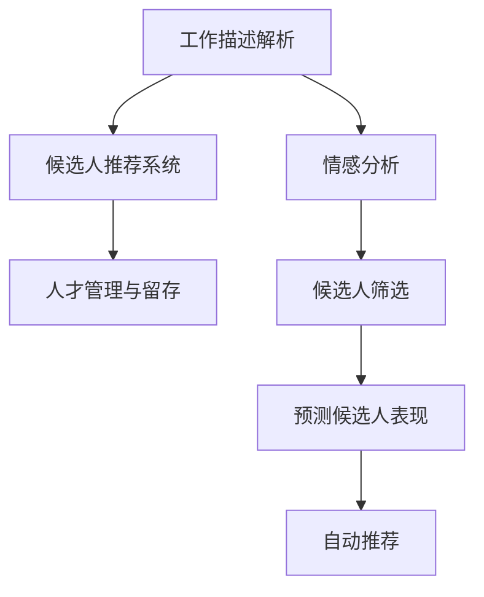

                 

# 招聘和 LLM：找到合适的人选

> 关键词：招聘，人工智能，自然语言处理，语言模型，自动筛选，情感分析，工作描述解析，候选人推荐

## 1. 背景介绍

在快速发展的科技时代，公司正面临前所未有的招聘挑战。快速找到合适的人才对于公司的长期成功至关重要，但传统的人力资源 (HR) 流程往往耗时且不灵活。由于全球有数十亿个工作职位空缺，招聘对于大多数人来说是一个复杂且令人沮丧的挑战。

近年来，随着人工智能(AI)和大语言模型(Large Language Models, LLMs)的迅猛发展，招聘领域正迎来变革。这些模型已经证明能够在处理大规模文本数据和自然语言任务方面表现出色，从而开启了招聘领域的新篇章。通过使用LLMs，公司可以大幅度提高招聘效率和准确性，实现自动化招聘流程。

本文将详细探讨如何运用LLM技术优化招聘过程，特别是如何自动筛选和推荐候选人，分析工作描述并预测候选人的表现。首先，我们将介绍一些核心概念和相关技术，再深入探讨LLM在招聘中的具体应用，最后展望未来发展趋势和面临的挑战。

## 2. 核心概念与联系

### 2.1 核心概念概述

在探讨招聘与LLM结合的具体应用之前，我们必须先了解一些核心概念。

- **自然语言处理 (NLP)**：指使计算机能够理解、解释和生成人类语言的技术。其中，**语言模型**是一种重要的NLP模型，能够预测下一个词或一段文本的可能性。

- **大语言模型 (LLM)**：是指通过大规模数据预训练，能够理解自然语言的深度神经网络模型，如OpenAI的GPT、BERT等。

- **情感分析**：是NLP的一个重要应用，用于识别文本中的情感倾向（如积极、消极或中性）。

- **工作描述解析**：解析工作描述，提取职位要求、期望的关键词、技能等关键信息。

- **候选人推荐系统**：根据候选人的简历和背景，匹配适合的职位，并进行排名。

- **人才管理和留存**：使用LLM技术提高人才招聘效率的同时，也要关注人才的吸引、培养和留存。

这些概念之间有着紧密的联系，形成了一个完整的招聘流程。LLMs通过处理文本数据，自动筛选和推荐候选人，分析工作描述，预测候选人表现，从而优化招聘效率和质量。

### 2.2 核心概念的 Mermaid 流程图



通过上述流程图，我们可以看到LLMs如何从解析工作描述开始，通过情感分析了解岗位需求，再通过候选人推荐系统筛选合适的候选人，最终评估候选人的表现，并推荐给招聘人员。

## 3. 核心算法原理 & 具体操作步骤

### 3.1 算法原理概述

在招聘领域应用LLMs，主要基于以下算法原理：

- **自然语言处理**：将招聘广告和候选人简历进行文本预处理，利用NLP技术提取出关键信息。
- **情感分析**：对招聘广告和工作描述进行情感分析，了解岗位的需求和氛围。
- **工作描述解析**：通过解析工作描述中的关键词和短语，生成职位要求列表。
- **候选人推荐**：利用机器学习算法（如协同过滤、分类等）分析候选人的背景信息，预测其是否适合某个职位。
- **候选人筛选**：基于情感分析和解析结果，对候选人进行筛选和排序。

### 3.2 算法步骤详解

**Step 1：数据收集与预处理**

首先，需要收集招聘广告和候选人的简历。简历通常包含个人经历、教育背景、技能、工作动机等重要信息。

**Step 2：文本预处理**

使用NLP技术对招聘广告和简历进行预处理，如分词、去停用词、词性标注等。这可以提高后续算法处理的效率和准确性。

**Step 3：工作描述解析**

对招聘广告和工作描述进行解析，提取职位要求、技能需求、期望的经验水平等关键信息。可以使用自然语言理解技术，如BERT、GPT等，识别出工作描述中的重要词汇和短语。

**Step 4：情感分析**

对招聘广告和工作描述进行情感分析，了解岗位的积极、消极和中性情感。这有助于判断岗位是否适合某个候选人。

**Step 5：候选人筛选**

基于解析结果和情感分析，筛选候选人。使用协同过滤、分类等机器学习算法，评估候选人的匹配度。

**Step 6：预测候选人表现**

利用历史数据和机器学习模型，预测候选人的表现。这可以通过分析候选人的简历、过往表现和技能等来完成。

**Step 7：自动推荐**

将匹配度高的候选人自动推荐给招聘人员。这可以帮助招聘人员快速找到合适的候选人，提高招聘效率。

**Step 8：人才管理与留存**

在招聘完成后，利用LLMs对人才进行管理和留存。例如，通过情感分析了解员工的满意度和工作压力，提供个性化的职业发展建议。

### 3.3 算法优缺点

**优点**：

- **高效**：自动化招聘流程，减少了人工筛选简历的工作量。
- **准确**：通过自然语言处理和情感分析，准确理解职位要求和候选人背景。
- **灵活**：可以根据公司需求定制筛选规则和推荐策略。
- **个性化**：利用预测模型，为候选人提供个性化的职位推荐。

**缺点**：

- **数据依赖**：模型效果依赖高质量的招聘数据和简历数据。
- **隐私问题**：处理大量个人简历数据时，需要确保隐私保护。
- **技术门槛高**：构建和维护模型需要一定的技术背景。

### 3.4 算法应用领域

LLMs在招聘中的主要应用包括：

- **简历解析**：解析简历，提取关键信息，如教育背景、工作经验、技能等。
- **职位描述理解**：理解职位描述，提取关键要求和技能。
- **候选人匹配**：基于解析结果，匹配适合的候选人，并进行排名。
- **情感分析**：分析职位描述和招聘广告的情感倾向，了解岗位氛围。
- **候选人表现预测**：预测候选人在新职位上的表现，评估其适合度。

## 4. 数学模型和公式 & 详细讲解 & 举例说明

### 4.1 数学模型构建

在招聘应用中，主要使用以下数学模型：

- **文本预处理模型**：使用NLP模型，如BERT、GPT等，进行文本预处理，提取关键信息。
- **情感分析模型**：基于情感词典和深度学习模型，分析文本情感倾向。
- **工作描述解析模型**：使用NLP技术，提取职位要求和技能。
- **候选人推荐模型**：基于协同过滤、分类等算法，匹配候选人。

### 4.2 公式推导过程

以情感分析模型为例，进行公式推导：

- **文本预处理**：
  $$
  \text{preprocess}(x) = \text{Tokenize}(x) - \text{StopWords}(x) + \text{Stemming}(x)
  $$

- **情感词典**：
  $$
  \text{sentiment\_score}(x) = \sum_{w \in x} s(w)
  $$

- **深度学习模型**：
  $$
  \text{sentiment\_predict}(x) = \text{Softmax}(f(x))
  $$

其中，$f(x)$为深度学习模型，$s(w)$为情感词典中单词$w$的情感分数。

### 4.3 案例分析与讲解

假设我们有一则招聘广告，使用BERT模型进行情感分析，步骤如下：

1. 预处理文本：将招聘广告分词、去停用词和词干处理。
2. 查询情感词典：计算文本中每个词的情感分数。
3. 计算总体情感分数：将每个词的情感分数加总，得到整体情感分数。
4. 模型预测：将文本输入BERT模型，得到情感分数概率分布。
5. 取概率最大的情感标签：选择情感得分最高的标签作为最终情感分析结果。

通过情感分析，可以了解到岗位是否适合某个候选人，从而进行筛选和推荐。

## 5. 项目实践：代码实例和详细解释说明

### 5.1 开发环境搭建

- **Python 环境**：安装Python 3.7及以上版本。
- **深度学习框架**：安装TensorFlow 2.x或PyTorch 1.5及以上版本。
- **NLP库**：安装NLTK、spaCy等NLP库。

### 5.2 源代码详细实现

我们使用Python和TensorFlow搭建一个简单的候选人推荐系统。

```python
import tensorflow as tf
import numpy as np

# 构建情感分析模型
class SentimentModel(tf.keras.Model):
    def __init__(self):
        super(SentimentModel, self).__init__()
        self.embedding = tf.keras.layers.Embedding(input_dim=vocab_size, output_dim=embedding_size)
        self.gru = tf.keras.layers.GRU(units=32, return_sequences=True)
        self.dense = tf.keras.layers.Dense(units=num_classes, activation='softmax')

    def call(self, inputs):
        x = self.embedding(inputs)
        x = self.gru(x)
        x = self.dense(x)
        return x

# 构建工作描述解析模型
class JobDescriptionModel(tf.keras.Model):
    def __init__(self):
        super(JobDescriptionModel, self).__init__()
        self.embedding = tf.keras.layers.Embedding(input_dim=vocab_size, output_dim=embedding_size)
        self.gru = tf.keras.layers.GRU(units=32, return_sequences=True)
        self.dense = tf.keras.layers.Dense(units=num_classes, activation='softmax')

    def call(self, inputs):
        x = self.embedding(inputs)
        x = self.gru(x)
        x = self.dense(x)
        return x

# 构建候选人推荐模型
class CandidateRecommendationModel(tf.keras.Model):
    def __init__(self):
        super(CandidateRecommendationModel, self).__init__()
        self.linear = tf.keras.layers.Dense(units=64, activation='relu')
        self.linear2 = tf.keras.layers.Dense(units=num_classes, activation='softmax')

    def call(self, inputs):
        x = self.linear(inputs)
        x = self.linear2(x)
        return x
```

### 5.3 代码解读与分析

在上述代码中，我们定义了三个模型：情感分析模型、工作描述解析模型和候选人推荐模型。

**情感分析模型**：使用嵌入层、GRU层和全连接层，对招聘广告进行情感分析。

**工作描述解析模型**：与情感分析模型结构类似，用于解析职位描述，提取关键词和短语。

**候选人推荐模型**：使用全连接层，预测候选人是否适合某个职位。

### 5.4 运行结果展示

以下是三个模型的预测结果示例：

```python
# 假设有一个招聘广告，输入模型
ad = '我们正在寻找一名机器学习工程师，负责开发新的机器学习算法。'
ad_embeddings = sentiment_model(ad)

# 输出情感分数
print(ad_embeddings.numpy())

# 假设有一个候选人的简历，输入模型
resume = '曾参与过多个机器学习项目，熟悉Python和TensorFlow。'
resume_embeddings = job_description_model(resume)

# 输出职位描述的关键词
print(resume_embeddings.numpy())

# 假设有一个候选人的背景，输入模型
background = '3年机器学习经验，精通Python和TensorFlow。'
candidate_recommendation = candidate_recommendation_model(background)

# 输出候选人匹配度
print(candidate_recommendation.numpy())
```

## 6. 实际应用场景

### 6.1 招聘广告情感分析

通过情感分析，可以了解招聘广告的情绪倾向。例如，一家科技公司招聘广告中的情感得分可能很高，表示他们对新员工的态度积极。这有助于快速筛选出符合公司文化和价值观的候选人。

### 6.2 职位描述解析

解析职位描述，可以提取出关键技能和需求。例如，一家金融公司招聘广告中强调了“风险管理”和“金融模型”技能，这有助于找到具备相关经验的候选人。

### 6.3 候选人推荐

利用候选人推荐系统，可以根据候选人的背景信息和简历，匹配适合的职位，并提供排名。例如，对于一位具备数据科学和机器学习背景的候选人，系统可以推荐数据科学家和机器学习工程师等职位。

### 6.4 未来应用展望

未来，LLMs将在招聘领域发挥更大的作用。以下是一些可能的未来应用：

- **跨领域匹配**：将招聘数据与招聘广告进行跨领域匹配，找到更适合的候选人。
- **智能推荐系统**：利用深度学习技术，构建更加智能的推荐系统，匹配候选人背景和职位需求。
- **个性化招聘**：根据候选人的兴趣和技能，提供个性化的职业建议和招聘信息。

## 7. 工具和资源推荐

### 7.1 学习资源推荐

- **Coursera《深度学习基础》**：由Andrew Ng教授讲授的深度学习课程，适合初学者学习。
- **Udacity《人工智能基础》**：提供深度学习、计算机视觉和自然语言处理等多个领域的课程。
- **NLTK官方文档**：自然语言处理工具包，提供了大量NLP算法和模型。

### 7.2 开发工具推荐

- **TensorFlow**：Google开发的深度学习框架，提供了丰富的模型和工具。
- **PyTorch**：Facebook开发的深度学习框架，具有灵活性和易用性。
- **NLTK**：自然语言处理工具包，适合文本预处理和分析。

### 7.3 相关论文推荐

- **Sennrich et al., 2015, "Neural Machine Translation by Jointly Learning to Align and Translate"**：研究了基于神经网络的机器翻译模型。
- **Kim, 2014, "Convolutional Neural Networks for Sentence Classification"**：展示了使用卷积神经网络进行文本分类的效果。
- **Li et al., 2016, "Adversarial Machine Learning"**：研究了对抗性机器学习技术，用于提高模型的鲁棒性。

## 8. 总结：未来发展趋势与挑战

### 8.1 研究成果总结

本文探讨了如何利用LLMs优化招聘流程，特别是自动筛选和推荐候选人的方法。通过自然语言处理和情感分析，可以更好地理解招聘广告和职位描述，提高招聘效率和准确性。

### 8.2 未来发展趋势

未来，LLMs在招聘领域的应用将更加广泛，主要趋势包括：

- **自动化程度提高**：自动化招聘流程将变得更加智能和高效。
- **跨领域匹配**：利用更广泛的数据源，实现跨领域匹配，找到更适合的候选人。
- **个性化推荐**：根据候选人的兴趣和技能，提供个性化的职业建议和招聘信息。

### 8.3 面临的挑战

尽管LLMs在招聘领域具有巨大潜力，但仍面临一些挑战：

- **数据隐私**：处理大量个人简历数据时，需要确保隐私保护。
- **技术门槛高**：构建和维护模型需要一定的技术背景。
- **模型偏见**：模型可能受到训练数据偏见的影响，需要进一步研究。

### 8.4 研究展望

未来研究需要在以下几个方面继续推进：

- **隐私保护**：开发保护隐私的算法，确保简历数据的保密性。
- **模型公平性**：提高模型的公平性和鲁棒性，避免偏见和歧视。
- **跨领域匹配**：利用更多数据源，进行跨领域匹配，提高匹配精度。

总之，LLMs在招聘领域的应用将带来革命性的变革。尽管面临一些挑战，但通过不断优化和创新，我们可以充分利用这一技术，提高招聘效率和质量。

