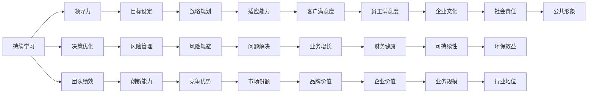

                 

# 持续学习：管理者的成功秘诀

> 关键词：持续学习,管理者,成功秘诀,个人成长,领导力

## 1. 背景介绍

在今天这个快速变化的时代，管理者面临着前所未有的挑战。科技的进步、市场的竞争、客户的期待，以及不断变化的社会环境，都要求管理者不断学习、适应并引领变革。持续学习不仅是一种技能，更是一种态度和习惯。本文将深入探讨持续学习的重要性和实现途径，帮助管理者在不断变化的商业环境中取得成功。

## 2. 核心概念与联系

### 2.1 核心概念概述

持续学习（Continuous Learning）指的是个体或组织不断获取新知识、技能和信息，并将其应用于实践中的过程。对于管理者而言，持续学习是提升领导力、优化决策过程、增强团队绩效的关键。

**核心概念关系图**：



这个图表展示了持续学习如何通过提升领导力、优化决策、增强团队绩效等多个维度，最终影响企业的财务健康、品牌价值、市场份额等关键指标。

## 3. 核心算法原理 & 具体操作步骤

### 3.1 算法原理概述

持续学习的核心在于通过不断的知识获取和技能提升，推动个人和组织的发展。其算法原理可以概括为以下几个步骤：

1. **目标设定**：明确学习的目标和方向，确保学习活动与组织目标一致。
2. **知识获取**：通过阅读、培训、交流等方式获取新知识。
3. **技能应用**：将新知识转化为实际技能，应用于工作实践中。
4. **反馈与优化**：通过反馈机制不断调整学习策略，提升学习效果。

### 3.2 算法步骤详解

**Step 1: 目标设定**

设定学习目标时，应考虑以下几个方面：
- **个人发展**：提升特定技能或知识领域。
- **组织目标**：与组织的战略目标相结合，如提高效率、创新能力等。
- **市场需求**：关注行业趋势，确保学习内容具有前瞻性。

**Step 2: 知识获取**

获取知识的方法多种多样，包括：
- **阅读**：书籍、文章、报告等。
- **培训**：在线课程、研讨会、工作坊等。
- **交流**：团队讨论、行业会议、导师指导等。

**Step 3: 技能应用**

将新知识转化为技能的步骤包括：
- **实践**：将新知识应用于实际工作，解决具体问题。
- **反馈**：收集实践中的反馈，调整和优化技能应用。
- **分享**：通过团队分享，提升整个团队的素质和能力。

**Step 4: 反馈与优化**

持续学习的关键在于不断迭代和优化。反馈机制可以：
- **自我评估**：通过反思和总结，识别学习中的不足。
- **外部反馈**：通过同事、上司、客户等的反馈，了解学习效果。
- **调整策略**：根据反馈结果，调整学习计划和方法。

### 3.3 算法优缺点

**优点**：
- **动态适应**：持续学习使管理者能够不断适应环境变化，提升竞争力。
- **提高效率**：通过持续优化，管理者能够更高效地解决问题，提升工作绩效。
- **增强团队**：通过知识分享和技能提升，增强团队的整体素质和凝聚力。

**缺点**：
- **资源投入**：持续学习需要大量的时间、金钱和精力投入。
- **学习难度**：新知识的获取和技能的应用可能需要一定的时间和努力。
- **挑战变革**：在某些情况下，持续学习可能需要面对现有流程和文化的改变。

### 3.4 算法应用领域

持续学习的理念广泛应用于各个行业，尤其是以下领域：

- **技术领域**：如软件开发、网络安全、数据分析等，要求持续掌握最新技术和工具。
- **金融领域**：如风险管理、投资分析、市场预测等，需要不断更新知识和技能以应对市场变化。
- **医疗领域**：如新药研发、诊断技术、患者护理等，需要不断学习和应用新知识以提高服务质量。
- **教育领域**：如课程设计、教学方法、学生评估等，需要持续改进教学内容和方法。
- **管理领域**：如战略规划、团队建设、组织变革等，需要不断提升领导力和决策能力。

## 4. 数学模型和公式 & 详细讲解 & 举例说明

### 4.1 数学模型构建

持续学习的效果可以通过以下数学模型来描述：

设 $L(t)$ 为时间 $t$ 时的学习效果，$K(t)$ 为时间 $t$ 时的知识水平，$S(t)$ 为时间 $t$ 时的技能水平，$A(t)$ 为时间 $t$ 时的反馈效果，则有：

$$
L(t) = f(K(t), S(t), A(t))
$$

其中 $f$ 为学习效果函数，可以表示为：

$$
L(t) = K(t) + S(t) + A(t)
$$

即学习效果等于知识水平、技能水平和反馈效果的总和。

### 4.2 公式推导过程

通过上述模型，我们可以推导出持续学习的优化策略：
1. **知识优化**：提高知识水平 $K(t)$，可以通过阅读、培训等方式实现。
2. **技能优化**：提高技能水平 $S(t)$，通过实践和反馈实现。
3. **反馈优化**：提高反馈效果 $A(t)$，通过有效的评估和调整实现。

### 4.3 案例分析与讲解

假设某公司 CEO 希望通过持续学习提升公司的市场份额。根据上述模型，他可以采取以下步骤：
1. **目标设定**：提升市场分析能力，以更好地制定市场策略。
2. **知识获取**：阅读市场营销的最新研究，参加相关的培训课程。
3. **技能应用**：将学到的知识应用于实际市场分析中，优化市场策略。
4. **反馈与优化**：通过市场反应和客户反馈，不断调整和优化市场策略。

## 5. 项目实践：代码实例和详细解释说明

### 5.1 开发环境搭建

要进行持续学习的实践，首先需要搭建一个开发环境。这里以Python为例：

1. **安装Python**：从官网下载并安装最新版本的Python。
2. **安装Pip**：在终端中运行 `python -m pip install pip`。
3. **安装相关库**：使用 `pip install` 安装如NumPy、Pandas、Scikit-Learn等库。
4. **配置开发环境**：使用 `pip install virtualenv` 创建虚拟环境，并激活。

### 5.2 源代码详细实现

以下是一个简单的持续学习算法实现，用于跟踪学习效果和优化策略：

```python
import numpy as np

class ContinuousLearning:
    def __init__(self, K, S, A):
        self.K = K
        self.S = S
        self.A = A
        self.L = self.calculate_learning_effect()
    
    def update_K(self, new_knowledge):
        self.K += new_knowledge
    
    def update_S(self, new_skill):
        self.S += new_skill
    
    def update_A(self, new_feedback):
        self.A += new_feedback
    
    def calculate_learning_effect(self):
        return self.K + self.S + self.A
    
    def print_learning_effect(self):
        print(f"Learning Effect: {self.L}")
    
# 示例
learning_system = ContinuousLearning(K=5, S=10, A=15)
learning_system.update_K(2)
learning_system.update_S(3)
learning_system.update_A(-1)
learning_system.print_learning_effect()
```

### 5.3 代码解读与分析

上述代码中，我们定义了一个 `ContinuousLearning` 类，用于计算和更新学习效果。

**类定义**：
- `__init__` 方法：初始化知识水平 $K$、技能水平 $S$、反馈效果 $A$，并计算学习效果 $L$。
- `update_K` 方法：更新知识水平。
- `update_S` 方法：更新技能水平。
- `update_A` 方法：更新反馈效果。
- `calculate_learning_effect` 方法：计算学习效果。
- `print_learning_effect` 方法：打印学习效果。

**示例**：
- 创建一个 `ContinuousLearning` 对象 `learning_system`，初始知识水平 $K=5$，技能水平 $S=10$，反馈效果 $A=15$。
- 通过 `update_K`、`update_S`、`update_A` 方法更新学习效果。
- 调用 `print_learning_effect` 方法，打印学习效果。

## 6. 实际应用场景

### 6.1 教育领域

在教育领域，持续学习对教师和学生都至关重要。教师需要不断更新教学内容和方法，以适应不断变化的教育需求。学生则需要不断学习新知识，以应对未来职业市场的挑战。

### 6.2 医疗领域

医疗领域的技术和知识更新速度快，持续学习使医生能够掌握最新的治疗方法和医疗知识，提高诊断和治疗的准确性。

### 6.3 技术领域

技术领域的发展日新月异，持续学习使技术人员能够掌握最新技术，提升开发效率和产品质量。

### 6.4 未来应用展望

随着人工智能和大数据技术的发展，持续学习的工具和平台将更加丰富和智能化。未来，学习者可以通过智能推荐系统，获取个性化的学习内容和资源，实现更加高效的学习效果。

## 7. 工具和资源推荐

### 7.1 学习资源推荐

- **Coursera**：提供来自全球顶尖大学的在线课程，涵盖多个学科领域。
- **Udacity**：提供实用的技能培训课程，如编程、数据分析等。
- **edX**：提供开放课程和认证课程，覆盖广泛的学术和职业发展领域。
- **Khan Academy**：提供免费的教育资源，涵盖数学、科学、计算机科学等多个领域。
- **TED Talks**：观看演讲视频，获取各种领域的创新思路和观点。

### 7.2 开发工具推荐

- **Anki**：一款优秀的记忆工具，通过间隔重复法帮助用户高效记忆。
- **Duolingo**：一款语言学习应用，通过游戏化学习方式提升语言学习效果。
- **Moodle**：一款开源的学习管理系统，支持课程管理和学生互动。
- **Lynda**：提供在线视频教程，涵盖各种职业发展和技术技能。
- **Khan Academy**：提供免费的教育资源，涵盖数学、科学、计算机科学等多个领域。

### 7.3 相关论文推荐

- **Lifelong Learning with Neural Networks: A Review**：综述了神经网络在持续学习中的应用。
- **A Survey on Continuous Learning**：总结了持续学习的最新研究进展和应用案例。
- **On the Importance of Continuous Learning**：讨论了持续学习在组织管理中的应用。
- **Learning How to Learn**：介绍了一种基于自我评估的持续学习策略。

## 8. 总结：未来发展趋势与挑战

### 8.1 研究成果总结

持续学习已经成为推动个人和组织发展的关键因素。通过不断学习新知识、提升新技能，管理者能够在不断变化的环境中保持竞争力和创新力。

### 8.2 未来发展趋势

1. **智能化学习平台**：未来的学习平台将更加智能化，通过大数据和机器学习技术，提供个性化的学习建议和资源。
2. **多模态学习**：通过结合多种学习方式（如在线学习、线下培训、实践操作等），提升学习效果。
3. **虚拟现实和增强现实**：利用VR和AR技术，提供沉浸式学习体验，提升学习效率。
4. **跨界融合**：不同领域的学习内容将更加紧密结合，促进知识的跨界应用和创新。

### 8.3 面临的挑战

尽管持续学习带来了诸多好处，但也面临以下挑战：
1. **学习资源获取**：高质量的学习资源获取成本高，且更新速度慢。
2. **时间管理**：学习需要大量时间，平衡工作和学习的时间管理是一个挑战。
3. **效果评估**：如何有效评估学习效果，确保学习目标的达成。
4. **文化变革**：改变组织文化，鼓励持续学习，需要领导者的支持和推动。

### 8.4 研究展望

未来的研究应在以下几个方面寻求突破：
1. **自动化学习**：利用人工智能技术，实现自动化学习和知识获取。
2. **数据驱动学习**：通过数据分析，优化学习策略，提升学习效果。
3. **跨领域学习**：结合不同领域的学习内容，提升跨界创新能力。
4. **混合学习模式**：结合在线和线下学习方式，提升学习灵活性和实效性。

## 9. 附录：常见问题与解答

**Q1: 什么是持续学习？**

A: 持续学习指的是个体或组织不断获取新知识、技能和信息，并将其应用于实践中的过程。

**Q2: 持续学习对管理者有何益处？**

A: 持续学习使管理者能够不断适应环境变化，提升领导力和决策能力，增强团队绩效，提升组织竞争力。

**Q3: 如何实现持续学习？**

A: 设定明确的学习目标，通过阅读、培训、交流等方式获取新知识，将新知识转化为技能，通过反馈机制不断优化学习策略。

**Q4: 持续学习是否适用于所有行业？**

A: 持续学习适用于大多数行业，尤其是在技术、金融、医疗、教育等领域，具有较高的实际应用价值。

**Q5: 持续学习需要投入大量资源，值得吗？**

A: 持续学习虽然需要投入资源，但能够显著提升个人和组织的竞争力和创新能力，长期来看是值得的。

---

作者：禅与计算机程序设计艺术 / Zen and the Art of Computer Programming

