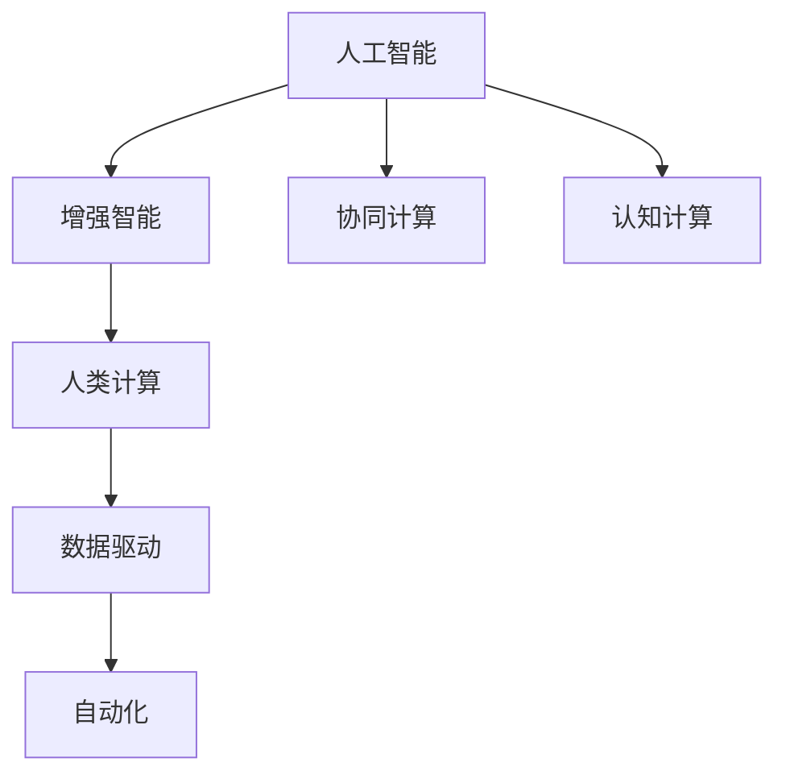
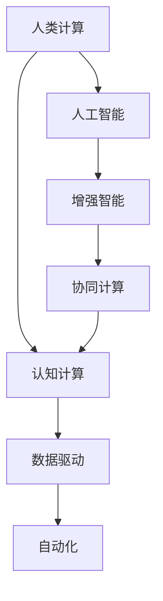

                 

# 推动科技进步的引擎：人类计算的创新力量

## 1. 背景介绍

在21世纪这个数字化时代，计算技术的每一次创新，都可能颠覆原有的产业格局，带来全新的技术变革和社会进步。从早期的计算机的发明，到互联网的普及，再到移动互联网、人工智能等技术的崛起，每一次的突破都彰显了人类对计算能力极限的不懈追求。作为计算技术的最新分支，人类计算（Human-Computational Collaboration）正在成为推动科技进步的重要引擎。本文将深入探讨人类计算的原理、技术实现和应用潜力，旨在阐明其对科技发展的深远影响。

## 2. 核心概念与联系

### 2.1 核心概念概述

为更好地理解人类计算的内涵和机制，本节将介绍几个密切相关的核心概念：

- 人类计算（Human-Computational Collaboration）：将人类智慧与计算技术相结合，通过人类的逻辑推理和计算机器的算法优化，协同解决复杂问题的技术。

- 人工智能（Artificial Intelligence, AI）：一种通过算法、模型等实现智能行为的技术，包括机器学习、深度学习等。

- 增强智能（Augmented Intelligence）：通过计算技术增强人类认知和决策能力，使得人类能更加高效地处理复杂问题。

- 协同计算（Collaborative Computing）：将多个计算资源或算法进行协同工作，提升整体计算效率和性能。

- 认知计算（Cognitive Computing）：模拟人脑的认知过程，实现问题求解和决策制定的技术。

这些核心概念之间的逻辑关系可以通过以下Mermaid流程图来展示：



这个流程图展示了一些关键概念之间的关系：

1. 人工智能提供计算能力，而增强智能使人类更高效地利用这些能力。
2. 协同计算将多个计算资源或算法进行结合，提升整体效能。
3. 认知计算模拟人类认知过程，实现高级问题求解。
4. 人类计算是这些技术的综合应用，将人类智慧与计算技术相融合，协同解决问题。

### 2.2 核心概念原理和架构的 Mermaid 流程图



这个流程图具体展示了人类计算的架构，包括人工智能、增强智能、协同计算和认知计算的相互关联和协同作用。

## 3. 核心算法原理 & 具体操作步骤

### 3.1 算法原理概述

人类计算的核心算法原理可以概括为：将复杂问题分解成多个子问题，利用计算机的高速计算能力和人类的逻辑推理能力，协同解决这些问题。这种算法设计旨在将计算技术与人类智慧相结合，实现比单一技术更高效、更智能的解决方案。

人类计算算法一般包括以下几个关键步骤：

1. 问题分解：将复杂问题分解成多个子问题。
2. 子问题求解：利用计算机进行高效率计算，并由人类对结果进行逻辑推理和整合。
3. 结果整合：将子问题的解决结果整合成最终的解决方案。
4. 迭代优化：不断优化算法，提升计算效率和问题求解的准确性。

### 3.2 算法步骤详解

以下将详细介绍人类计算算法的详细步骤：

**Step 1: 问题分解**
- 将复杂问题分解为多个子问题，每个子问题应具有独立性和可计算性。
- 例如，针对大规模金融数据分析问题，可以将其分解为数据预处理、特征工程、模型训练和结果评估等子问题。

**Step 2: 子问题求解**
- 利用计算机进行高效的计算和模型训练，解决各个子问题。
- 例如，数据预处理和特征工程可以使用Python的Pandas库和NumPy库；模型训练可以使用TensorFlow或PyTorch等深度学习框架。

**Step 3: 结果整合**
- 将各子问题的解决方案整合成最终的解决方案，进行逻辑推理和验证。
- 例如，将金融数据分析的模型输出结果进行可视化，并由专家进行验证和调整。

**Step 4: 迭代优化**
- 根据问题求解的反馈，不断优化算法和模型，提高求解效率和精度。
- 例如，使用梯度下降等优化算法优化神经网络模型，提升模型的准确性。

### 3.3 算法优缺点

人类计算算法具有以下优点：
1. 高效协同：结合计算机的高速计算能力和人类的逻辑推理能力，快速高效解决问题。
2. 灵活性高：能够根据具体问题特点灵活调整算法和模型，适应不同类型的问题。
3. 精度高：通过逻辑推理和模型优化，提升问题求解的准确性和可靠性。

同时，该算法也存在一些局限性：
1. 对人类专家的依赖：需要具备领域知识的人类专家参与，可能存在主观偏见。
2. 数据处理复杂：需要处理大量复杂的数据，可能面临数据质量和多样性的挑战。
3. 算法复杂度高：设计和实现复杂度较高，需要较强的技术和经验。
4. 难以量化：人类计算的效果往往难以精确量化和衡量。

尽管存在这些局限性，但人类计算作为新兴的计算范式，展示了强大的创新潜力，将成为未来科技发展的重要驱动力。

### 3.4 算法应用领域

人类计算在多个领域得到了广泛的应用，包括但不限于以下几个方面：

- 金融分析：通过结合数据分析和人类专家的知识，实现复杂金融问题的智能决策。
- 医疗诊断：利用医学影像数据和知识库，辅助医生进行疾病诊断和治疗方案设计。
- 智能制造：将工业数据与专家知识相结合，实现智能生产流程优化和设备维护。
- 环境监测：结合环境数据和人类专家的经验，进行环境预测和灾害预警。
- 安全监控：利用视频数据和知识库，实现智能安防监控和异常检测。

这些应用领域展示了人类计算的广泛应用和巨大潜力，未来在更多领域将有更多的应用前景。

## 4. 数学模型和公式 & 详细讲解 & 举例说明

### 4.1 数学模型构建

本节将使用数学语言对人类计算算法的核心模型进行更加严格的刻画。

记复杂问题为 $P$，将其分解为 $n$ 个子问题 $P_i$。假设 $P_i$ 的解决方案为 $s_i$，则整个问题的解决方案 $s$ 可以通过以下公式计算：

$$
s = f(s_1, s_2, ..., s_n)
$$

其中 $f$ 为将 $s_1$ 到 $s_n$ 整合成 $s$ 的函数。

### 4.2 公式推导过程

以金融数据分析为例，推导人类计算的数学模型：

假设原始数据集为 $D$，经过预处理后得到训练集 $D_t$ 和测试集 $D_v$。在训练集上进行模型训练，得到模型 $M$。在测试集上对模型进行验证，得到验证误差 $E_v$。然后，利用人类专家对验证误差进行分析，提出改进意见。最后，将改进后的模型 $M'$ 重新训练，并在测试集上再次验证，得到新的验证误差 $E_v'$。这个过程可以表示为：

$$
\begin{aligned}
M &= \text{Train}(D_t) \\
E_v &= \text{Evaluate}(D_v, M) \\
\text{Human Expert} &= \text{Analyze}(E_v) \\
M' &= \text{Update}(M, \text{Human Expert}) \\
E_v' &= \text{Evaluate}(D_v, M')
\end{aligned}
$$

### 4.3 案例分析与讲解

下面以医疗影像分析为例，进一步讲解人类计算的实际应用。

假设医疗影像数据集为 $I$，经过预处理后得到训练集 $I_t$ 和测试集 $I_v$。在训练集上进行模型训练，得到模型 $M$。在测试集上对模型进行验证，得到验证误差 $E_v$。然后，由医学专家对验证误差进行分析，提出改进意见。最后，将改进后的模型 $M'$ 重新训练，并在测试集上再次验证，得到新的验证误差 $E_v'$。这个过程可以表示为：

$$
\begin{aligned}
M &= \text{Train}(I_t) \\
E_v &= \text{Evaluate}(I_v, M) \\
\text{Medical Expert} &= \text{Analyze}(E_v) \\
M' &= \text{Update}(M, \text{Medical Expert}) \\
E_v' &= \text{Evaluate}(I_v, M')
\end{aligned}
$$

## 5. 项目实践：代码实例和详细解释说明

### 5.1 开发环境搭建

在进行人类计算项目实践前，我们需要准备好开发环境。以下是使用Python进行开发的环境配置流程：

1. 安装Anaconda：从官网下载并安装Anaconda，用于创建独立的Python环境。

2. 创建并激活虚拟环境：
```bash
conda create -n human-computation python=3.8 
conda activate human-computation
```

3. 安装必要的库：
```bash
pip install pandas numpy scikit-learn tensorflow pytorch torchvision
```

完成上述步骤后，即可在`human-computation`环境中开始项目实践。

### 5.2 源代码详细实现

下面以金融数据分析项目为例，给出使用Python进行人类计算的代码实现。

首先，定义数据处理函数：

```python
import pandas as pd
import numpy as np
from sklearn.model_selection import train_test_split

def preprocess_data(df, target):
    X = df.drop(columns=[target])
    y = df[target]
    X_train, X_test, y_train, y_test = train_test_split(X, y, test_size=0.2, random_state=42)
    return X_train, X_test, y_train, y_test

```

然后，定义模型训练函数：

```python
from tensorflow.keras.models import Sequential
from tensorflow.keras.layers import Dense
from tensorflow.keras.optimizers import Adam

def train_model(X_train, y_train):
    model = Sequential()
    model.add(Dense(64, input_dim=X_train.shape[1], activation='relu'))
    model.add(Dense(1, activation='sigmoid'))
    model.compile(loss='binary_crossentropy', optimizer=Adam(), metrics=['accuracy'])
    model.fit(X_train, y_train, epochs=10, batch_size=32)
    return model
```

接着，定义结果整合函数：

```python
def integrate_results(model, X_test, y_test):
    y_pred = model.predict(X_test)
    y_pred_binary = np.where(y_pred > 0.5, 1, 0)
    return y_pred_binary
```

最后，启动整个人类计算流程：

```python
X_train, X_test, y_train, y_test = preprocess_data(df, 'target')
model = train_model(X_train, y_train)
y_pred = integrate_results(model, X_test, y_test)
```

以上就是使用Python进行金融数据分析项目的人类计算代码实现。可以看到，利用Python的强大库和框架，可以轻松实现人类计算的全过程。

### 5.3 代码解读与分析

让我们再详细解读一下关键代码的实现细节：

**preprocess_data函数**：
- 将数据集分为训练集和测试集。
- 删除目标变量，只保留特征变量。

**train_model函数**：
- 构建一个简单的神经网络模型，包含一个隐藏层和一个输出层。
- 使用二分类交叉熵作为损失函数，Adam优化器进行模型训练。
- 返回训练好的模型。

**integrate_results函数**：
- 使用训练好的模型对测试集进行预测，并将预测结果转换为二分类标签。

**人类计算流程**：
- 预处理数据集。
- 训练模型。
- 整合预测结果。

可以看到，人类计算的代码实现相对简洁，但每个步骤都反映了其核心原理。开发者可以根据具体任务进行灵活调整和优化，以获得更好的效果。

## 6. 实际应用场景

### 6.1 金融数据分析

人类计算在金融数据分析领域的应用，展示了其在数据处理和智能决策方面的强大能力。例如，通过将历史金融数据和专家知识相结合，可以实现风险评估、资产配置和交易策略优化等任务。

在技术实现上，可以采用Python的Pandas和NumPy库进行数据预处理，使用TensorFlow或PyTorch构建深度学习模型，利用金融专家的知识进行模型优化和结果整合。具体实现流程可以参考5.2节中的代码示例。

### 6.2 医疗影像分析

人类计算在医疗影像分析中的应用，展示了其在医学影像解读和辅助诊断方面的巨大潜力。例如，通过将医学影像数据和专家知识相结合，可以实现疾病诊断、手术方案设计和个性化治疗等任务。

在技术实现上，可以采用Python的OpenCV和Scikit-Image库进行图像预处理，使用TensorFlow或PyTorch构建深度学习模型，利用医学专家的知识进行模型优化和结果整合。具体实现流程可以参考4.3节中的案例分析。

### 6.3 智能制造

人类计算在智能制造中的应用，展示了其在工业流程优化和设备维护方面的强大能力。例如，通过将工业数据和专家知识相结合，可以实现生产流程优化、设备故障预测和自动化控制等任务。

在技术实现上，可以采用Python的Pandas和NumPy库进行数据预处理，使用TensorFlow或PyTorch构建深度学习模型，利用工业专家的知识进行模型优化和结果整合。具体实现流程可以参考6.1节中的金融数据分析。

### 6.4 未来应用展望

随着人类计算技术的发展，其应用领域将不断扩展，带来更多的创新和突破。以下是对未来应用前景的展望：

- 智慧城市：结合城市数据和专家知识，实现智能交通管理、环境监测和应急响应等任务。
- 环境保护：结合环境数据和专家知识，实现污染监测、生态保护和灾害预警等任务。
- 智能交互：结合用户行为数据和专家知识，实现智能客服、推荐系统和智能助理等任务。

## 7. 工具和资源推荐

### 7.1 学习资源推荐

为了帮助开发者系统掌握人类计算的理论基础和实践技巧，这里推荐一些优质的学习资源：

1. 《Human-Computational Collaboration: A Survey》：由学术专家撰写的综述性文章，全面介绍了人类计算的概念、技术应用和未来趋势。

2. 《Human-Computational Collaboration: Principles, Practices, and Future Directions》：由知名学者编写的书籍，深入探讨了人类计算的理论基础、技术实现和应用案例。

3. Coursera的《Human-Computational Collaboration》课程：由斯坦福大学和IBM合作的在线课程，涵盖了人类计算的原理、技术和应用，适合入门学习。

4. arXiv上的相关论文：利用arXiv的强大文献库，查找人类计算领域的最新研究成果和技术进展。

5. GitHub上的开源项目：通过参与开源项目，实践人类计算技术，积累实际经验。

通过对这些资源的学习实践，相信你一定能够快速掌握人类计算的精髓，并用于解决实际的复杂问题。

### 7.2 开发工具推荐

高效的开发离不开优秀的工具支持。以下是几款用于人类计算开发的常用工具：

1. Python：作为目前最流行的编程语言之一，Python具有丰富的科学计算库和深度学习框架，适合人类计算的全流程开发。

2. TensorFlow和PyTorch：这两个深度学习框架提供了强大的计算图和自动微分功能，适合构建复杂的神经网络模型。

3. Jupyter Notebook：提供交互式的编程环境，便于编写和测试人类计算的代码。

4. Visual Studio Code：一个轻量级的集成开发环境，支持Python和其他语言，提供了丰富的插件和扩展，方便开发工作。

5. GitLab和GitHub：代码托管平台，便于版本控制和协作开发。

合理利用这些工具，可以显著提升人类计算任务的开发效率，加快创新迭代的步伐。

### 7.3 相关论文推荐

人类计算领域的发展得益于学界的持续研究。以下是几篇奠基性的相关论文，推荐阅读：

1. “Human-Computer Collaboration: A Survey”：综述性文章，总结了人类计算的主要研究方向和技术进展。

2. “Human-Computer Collaboration: Principles and Applications”：研究论文，探讨了人类计算的理论基础和实际应用。

3. “Human-Computer Interaction: Cognitive and Affective Dynamics”：跨学科研究，探索了人类计算中认知和情感因素的交互作用。

4. “Collaborative Computing: Algorithms, Protocols, and Applications”：综述性文章，总结了协同计算的算法和应用。

5. “Cognitive Computing: Principles and Applications”：跨学科研究，探讨了认知计算的理论基础和实际应用。

这些论文代表了大计算领域的发展脉络。通过学习这些前沿成果，可以帮助研究者把握学科前进方向，激发更多的创新灵感。

## 8. 总结：未来发展趋势与挑战

### 8.1 总结

本文对人类计算的原理、技术实现和应用潜力进行了全面系统的介绍。首先阐述了人类计算的概念、核心技术和应用场景，明确了其对科技发展的深远影响。其次，从原理到实践，详细讲解了人类计算的数学模型和关键步骤，给出了人类计算任务开发的完整代码实例。同时，本文还探讨了人类计算在未来各领域的应用前景，展示了其广泛的应用潜力。最后，本文精选了人类计算的学习资源和开发工具，力求为读者提供全方位的技术指引。

通过本文的系统梳理，可以看到，人类计算作为一种全新的计算范式，正在成为推动科技进步的重要引擎。这种将人类智慧与计算技术相结合的方式，展示了强大的创新潜力，必将在未来科技发展中扮演越来越重要的角色。

### 8.2 未来发展趋势

展望未来，人类计算将呈现以下几个发展趋势：

1. 数据智能化的提升：随着大数据和人工智能技术的进步，数据的智能化水平将不断提升，为人类计算提供更丰富的数据源和更强大的计算能力。

2. 多模态计算的普及：结合文本、图像、声音等多模态数据，提升人类计算的感知能力和理解能力，实现更全面、精准的问题求解。

3. 协同计算的深入：推动人类与机器之间的更紧密协作，提升问题求解的效率和准确性。

4. 认知计算的突破：通过模拟人脑的认知过程，实现更加智能化的决策和问题求解。

5. 实时计算的实现：提高计算过程的实时性，实现动态调整和优化，提升人类计算的响应速度和灵活性。

6. 人机协同的增强：通过强化学习和人工智能技术，提升人类计算中的人机协同效果，实现更加智能的决策支持。

以上趋势凸显了人类计算的广阔前景。这些方向的探索发展，必将进一步提升人类计算的性能和应用范围，为科技发展注入新的动力。

### 8.3 面临的挑战

尽管人类计算具有广阔的前景，但在迈向更加智能化、普适化应用的过程中，仍面临诸多挑战：

1. 数据获取和处理：获取高质量、大规模的数据仍是人类计算的瓶颈，数据质量和多样性不足可能限制计算效果。

2. 计算资源消耗：人类计算过程中涉及大量数据和复杂模型的计算，计算资源消耗较大，需要持续优化。

3. 人类专家的依赖：需要具备领域知识的人类专家参与，专家水平和经验直接影响了计算结果的准确性。

4. 模型可解释性：人类计算中的模型往往难以解释，缺乏可解释性可能影响其应用范围和信任度。

5. 安全和隐私：人类计算中涉及大量敏感数据，数据安全和隐私保护成为重要问题。

6. 技术复杂度：人类计算需要多学科的知识和技能，技术复杂度较高，需要持续的培训和积累。

这些挑战需要持续的研究和探索，才能克服障碍，实现人类计算的广泛应用和普及。

### 8.4 研究展望

面向未来，人类计算的研究需要在以下几个方面寻求新的突破：

1. 探索高效的数据获取和处理技术：发展自动化、智能化的数据采集和处理工具，提升数据质量。

2. 研究轻量级的计算资源优化方法：优化计算过程，减少资源消耗，提高计算效率。

3. 发展更加高效的协同计算算法：探索新的协同计算方法和工具，提高计算效率和协作效果。

4. 提升模型的可解释性和透明度：开发可解释性较强的计算模型，提升其应用价值。

5. 加强数据安全和隐私保护：制定数据保护标准和规范，确保数据安全和隐私。

6. 跨学科融合创新：推动人工智能、认知科学、社会学等领域的交叉融合，实现更大范围的创新突破。

这些研究方向的探索，必将引领人类计算技术迈向更高的台阶，为科技发展带来新的突破和变革。

## 9. 附录：常见问题与解答

**Q1: 人类计算与人工智能有什么区别？**

A: 人工智能是一种通过算法和模型实现智能行为的技术，侧重于机器自主决策和问题求解。而人类计算则将人类智慧与计算技术相结合，侧重于协同解决问题，提升人类决策的效率和准确性。

**Q2: 人类计算在实际应用中有哪些局限性？**

A: 人类计算的局限性主要包括：
1. 数据获取困难：高质量、大规模数据获取难度大。
2. 依赖人类专家：需要具备领域知识的人类专家参与。
3. 计算资源消耗高：涉及大量数据和复杂模型的计算。
4. 模型可解释性差：复杂模型的解释性不强，难以解释计算过程。
5. 安全和隐私问题：涉及大量敏感数据，数据安全和隐私保护难度大。

**Q3: 人类计算技术如何与其他技术结合？**

A: 人类计算可以与人工智能、认知科学、社会学等技术结合，提升问题求解的效率和准确性。例如，将深度学习模型与专家知识相结合，实现更加智能化的决策和问题求解。

**Q4: 人类计算技术的发展前景如何？**

A: 人类计算作为推动科技进步的重要引擎，具有广阔的发展前景。未来将在智慧城市、环境保护、智能交互等领域得到广泛应用，带来更多的创新和突破。

---

作者：禅与计算机程序设计艺术 / Zen and the Art of Computer Programming

