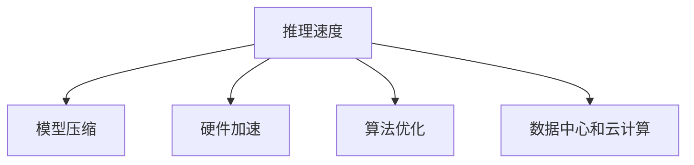

                 

# 推理速度:影响用户体验的重要指标

> 关键词：推理速度, 用户体验, 深度学习, 计算机视觉, 自然语言处理, 数据中心, 云计算, 硬件加速, 模型压缩

## 1. 背景介绍

### 1.1 问题由来

在当前的AI技术应用中，模型的推理速度对于用户体验起着至关重要的作用。无论是计算机视觉、自然语言处理还是智能推荐系统，都依赖于对大规模数据的高效处理和实时响应。但随着模型规模的不断增大，深度学习模型的推理速度面临严峻挑战。如何提升推理速度，同时确保模型性能，成为学术界和工业界共同关注的重点。

### 1.2 问题核心关键点

推理速度是衡量AI系统性能的重要指标，直接影响到用户体验和应用效果。推理速度过慢，会导致系统响应迟缓，甚至出现卡顿现象，严重影响用户的使用体验。具体而言，推理速度慢的问题可能源于以下几个方面：

- **模型规模庞大**：深度学习模型的参数量往往在亿级别，需要长时间计算才能完成推理。
- **硬件限制**：当前主流硬件，如CPU、GPU，在处理大规模矩阵运算时性能瓶颈明显。
- **算法效率低**：深度学习中的前向传播和反向传播算法效率较低，导致推理耗时过长。
- **模型复杂度**：深度学习模型结构复杂，涉及的矩阵乘法和卷积运算较多，计算量大。

因此，如何提升模型的推理速度，同时保持模型的精度和效果，是一个亟需解决的重大问题。

### 1.3 问题研究意义

提升推理速度对于保障用户体验、提升系统响应速度、降低延迟具有重要意义。在实时应用场景中，如自动驾驶、医疗诊断、金融交易、工业控制等，快速响应的重要性不言而喻。在非实时应用场景中，如智能推荐、在线教育、语音识别等，响应速度的快慢也直接影响用户体验。因此，推理速度的优化对AI技术的落地应用至关重要。

## 2. 核心概念与联系

### 2.1 核心概念概述

为了更好地理解推理速度提升的方法和策略，本节将介绍几个关键概念：

- **推理速度**：指深度学习模型在输入数据后，输出结果的耗时。推理速度直接影响系统的响应速度和用户体验。
- **模型压缩**：通过剪枝、量化、蒸馏等方法，减少模型的参数量和计算量，从而提升推理速度。
- **硬件加速**：利用GPU、TPU、FPGA等硬件加速设备，提升模型的并行计算能力，降低推理耗时。
- **算法优化**：通过改进深度学习算法，如模型并行、动态图、混合精度等，提升推理效率。
- **数据中心和云计算**：利用高性能计算资源，进行模型推理，分散计算压力，提升系统稳定性和可扩展性。

这些概念之间的逻辑关系可以通过以下Mermaid流程图来展示：



这个流程图展示了推理速度提升的多种途径及其相互关系：

1. 通过模型压缩减少计算量。
2. 利用硬件加速提高并行计算能力。
3. 通过算法优化提升计算效率。
4. 依托数据中心和云计算分散计算资源。

这些关键技术相互配合，可以显著提升深度学习模型的推理速度，优化用户体验。

## 3. 核心算法原理 & 具体操作步骤

### 3.1 算法原理概述

提升推理速度的核心在于减少模型计算量，提升并行计算能力，优化算法效率。以下将详细介绍这三种关键技术：

- **模型压缩**：通过剪枝、量化、蒸馏等方法减少模型参数量和计算量。
- **硬件加速**：利用GPU、TPU、FPGA等硬件加速设备，提升模型的并行计算能力。
- **算法优化**：改进深度学习算法，如模型并行、动态图、混合精度等。

### 3.2 算法步骤详解

#### 3.2.1 模型压缩

**Step 1: 剪枝（Pruning）**
剪枝通过删除模型中不重要的参数，减少计算量，从而提升推理速度。常用的剪枝方法包括：
- **权重剪枝**：根据权重的大小进行筛选，删除权重值小的参数。
- **通道剪枝**：删除卷积层或全连接层的通道，保留关键特征。
- **网络剪枝**：删除整个神经网络的一部分，保留最重要的网络结构。

**Step 2: 量化（Quantization）**
量化将模型参数和计算结果从浮点数转换为定点数，减少计算复杂度和存储需求。常用的量化方法包括：
- **权重量化**：将权重参数转换为定点数，降低计算量。
- **激活量化**：将激活结果转换为定点数，减少计算量。
- **混合精度训练**：使用不同精度的参数和激活，在训练和推理中分别优化。

**Step 3: 蒸馏（Knowledge Distillation）**
蒸馏通过将大型模型的知识转移到小型模型中，提升推理速度和效率。常用的蒸馏方法包括：
- **师生蒸馏**：使用大型模型作为教师，小型模型作为学生，通过教师模型训练学生模型。
- **知识蒸馏**：通过老师模型对学生模型进行监督指导，提升模型性能。
- **集成蒸馏**：使用多个老师模型对学生模型进行指导，提升模型鲁棒性。

#### 3.2.2 硬件加速

**Step 1: 选择合适的硬件加速设备**
选择合适的硬件加速设备，如GPU、TPU、FPGA等，根据应用场景和需求进行选择。
- **GPU**：适用于通用计算和深度学习模型训练推理。
- **TPU**：适用于大规模深度学习模型的训练推理，具有较高的并行计算能力。
- **FPGA**：适用于定制化加速，具有高度灵活性和可编程性。

**Step 2: 硬件加速配置**
配置硬件加速环境，包括CPU-GPU、CPU-TPU、CPU-FPGA等加速配置。
- **CPU-GPU**：通过NVIDIA CUDA或ROCm技术，提升模型计算速度。
- **CPU-TPU**：通过Google Tensor Processing Unit技术，提升模型计算速度。
- **CPU-FPGA**：通过FPGA可编程特性，实现自定义计算加速。

**Step 3: 硬件加速优化**
优化硬件加速配置，提高计算效率。
- **并行计算**：通过数据并行、模型并行、混合并行等技术，提升计算速度。
- **优化算法**：优化算法实现，如矩阵乘法、卷积运算等，提高并行度。
- **资源管理**：优化资源管理，避免资源浪费和冲突。

#### 3.2.3 算法优化

**Step 1: 模型并行**
通过模型并行技术，将大型深度学习模型分成多个部分，并行计算。
- **数据并行**：将数据分成多个批次，并行计算。
- **模型并行**：将模型分成多个子模型，并行计算。
- **混合并行**：结合数据并行和模型并行，优化计算效率。

**Step 2: 动态图**
通过动态图技术，优化模型推理过程，提升计算效率。
- **图计算优化**：优化图的构建和遍历，减少计算量。
- **图分区优化**：将图分区优化，提高并行计算能力。
- **图优化算法**：优化图优化算法，提高计算速度。

**Step 3: 混合精度训练**
通过混合精度训练，使用不同精度的参数和激活，在训练和推理中分别优化。
- **混合精度计算**：使用FP16或BF16等低精度计算，提升计算速度。
- **混合精度校验**：在混合精度训练后进行精度校验，确保模型精度。

### 3.3 算法优缺点

提升推理速度的几种主要方法各有优缺点：

**模型压缩**的优点：
- **减少计算量**：剪枝和量化可以大幅减少模型的计算量。
- **节省内存**：压缩后的模型占用更少的内存，提升系统稳定性和可扩展性。

**硬件加速**的优点：
- **并行计算**：GPU、TPU、FPGA等硬件加速设备具有强大的并行计算能力。
- **计算速度**：硬件加速设备能够显著提升模型的计算速度。

**算法优化**的优点：
- **计算效率**：模型并行、动态图、混合精度训练等方法可以显著提升计算效率。
- **系统优化**：优化算法能够提高系统的整体性能和稳定性。

**模型压缩**的缺点：
- **精度损失**：剪枝和量化可能导致模型精度下降。
- **复杂度增加**：压缩后的模型结构可能更加复杂，调试难度增加。

**硬件加速**的缺点：
- **成本高**：高性能硬件加速设备成本较高，部署复杂。
- **兼容性**：不同类型的硬件加速设备可能存在兼容性问题。

**算法优化**的缺点：
- **实现复杂**：优化算法需要复杂的编程实现和调参。
- **性能瓶颈**：算法优化可能存在性能瓶颈，难以达到最优效果。

### 3.4 算法应用领域

提升推理速度的几种主要方法在多个领域都有广泛应用：

- **计算机视觉**：应用于图像分类、目标检测、图像分割等任务，提升图像处理速度。
- **自然语言处理**：应用于机器翻译、文本分类、情感分析等任务，提升文本处理速度。
- **智能推荐系统**：应用于商品推荐、内容推荐等任务，提升推荐速度和效果。
- **智能搜索系统**：应用于搜索引擎、语音搜索等任务，提升搜索速度和响应速度。
- **自动驾驶**：应用于环境感知、路径规划等任务，提升系统响应速度和安全性。
- **金融交易**：应用于高频交易、风险评估等任务，提升交易速度和决策效率。

除了上述这些领域外，提升推理速度的方法也在医疗、教育、工业控制等多个场景中得到应用，为AI技术在各行业的落地提供支撑。

## 4. 数学模型和公式 & 详细讲解 & 举例说明

### 4.1 数学模型构建

在深度学习中，推理速度的计算复杂度主要由模型的结构和参数量决定。以下以一个简单的卷积神经网络（CNN）为例，构建推理速度的数学模型。

设CNN模型包含 $N$ 层卷积层和池化层，每层的计算量为 $C_n$，则模型总计算量为：

$$
C_{total} = \sum_{n=1}^{N} C_n
$$

其中，$C_n = O(N_{in} * N_{out} * H * W * k^2)$，$N_{in}$ 和 $N_{out}$ 分别为输入和输出的通道数，$H$ 和 $W$ 分别为特征图的高和宽，$k$ 为卷积核大小。

### 4.2 公式推导过程

以下推导CNN模型的推理时间复杂度：

假设CNN模型中，每层的计算量为 $C_n = O(N_{in} * N_{out} * H * W * k^2)$，则总计算量为：

$$
C_{total} = \sum_{n=1}^{N} C_n = \sum_{n=1}^{N} O(N_{in} * N_{out} * H * W * k^2)
$$

设模型推理的每一层计算时间为 $T_n$，则总推理时间为：

$$
T_{total} = \sum_{n=1}^{N} T_n = \sum_{n=1}^{N} \frac{C_n}{f_{n}} = \frac{C_{total}}{f_{max}}
$$

其中，$f_{n}$ 为第 $n$ 层的计算频率，$f_{max}$ 为计算频率的最大值。

### 4.3 案例分析与讲解

假设一个简单的CNN模型包含2层卷积层，每层的参数量为 $N_{in} * N_{out} * H * W * k^2 = 1024$，则总参数量为：

$$
C_{total} = 2 * 1024 = 2048
$$

设每层的计算频率为 $f_{n} = 1$，则总计算时间为：

$$
T_{total} = \frac{2048}{1} = 2048
$$

通过上述案例，我们可以看到模型的总计算量和推理时间与模型结构密切相关。因此，通过模型压缩、硬件加速、算法优化等方法，可以有效降低计算量，提升推理速度。

## 5. 项目实践：代码实例和详细解释说明

### 5.1 开发环境搭建

在进行推理速度提升实践前，我们需要准备好开发环境。以下是使用Python进行PyTorch开发的环境配置流程：

1. 安装Anaconda：从官网下载并安装Anaconda，用于创建独立的Python环境。

2. 创建并激活虚拟环境：
```bash
conda create -n pytorch-env python=3.8 
conda activate pytorch-env
```

3. 安装PyTorch：根据CUDA版本，从官网获取对应的安装命令。例如：
```bash
conda install pytorch torchvision torchaudio cudatoolkit=11.1 -c pytorch -c conda-forge
```

4. 安装Transformers库：
```bash
pip install transformers
```

5. 安装各类工具包：
```bash
pip install numpy pandas scikit-learn matplotlib tqdm jupyter notebook ipython
```

完成上述步骤后，即可在`pytorch-env`环境中开始推理速度提升实践。

### 5.2 源代码详细实现

下面我们以卷积神经网络（CNN）为例，给出使用Transformers库对模型进行推理速度提升的PyTorch代码实现。

首先，定义CNN模型的超参数：

```python
import torch
from torch import nn

class CNN(nn.Module):
    def __init__(self):
        super(CNN, self).__init__()
        self.conv1 = nn.Conv2d(3, 32, kernel_size=3, padding=1)
        self.conv2 = nn.Conv2d(32, 64, kernel_size=3, padding=1)
        self.pool = nn.MaxPool2d(kernel_size=2, stride=2)
        self.fc1 = nn.Linear(64*8*8, 256)
        self.fc2 = nn.Linear(256, 10)

    def forward(self, x):
        x = self.conv1(x)
        x = nn.ReLU()(x)
        x = self.pool(x)
        x = self.conv2(x)
        x = nn.ReLU()(x)
        x = self.pool(x)
        x = x.view(-1, 64*8*8)
        x = self.fc1(x)
        x = nn.ReLU()(x)
        x = self.fc2(x)
        return x
```

然后，定义模型和优化器：

```python
model = CNN().to(device)
optimizer = torch.optim.Adam(model.parameters(), lr=0.001)
```

接着，定义训练和评估函数：

```python
def train_model(model, device, train_loader, optimizer, num_epochs):
    model.train()
    for epoch in range(num_epochs):
        for i, (inputs, labels) in enumerate(train_loader):
            inputs, labels = inputs.to(device), labels.to(device)
            optimizer.zero_grad()
            outputs = model(inputs)
            loss = nn.CrossEntropyLoss()(outputs, labels)
            loss.backward()
            optimizer.step()
            if (i+1) % 100 == 0:
                print(f"Epoch {epoch+1}, Step {i+1}, Loss: {loss.item():.4f}")

def evaluate_model(model, device, test_loader):
    model.eval()
    correct = 0
    total = 0
    with torch.no_grad():
        for inputs, labels in test_loader:
            inputs, labels = inputs.to(device), labels.to(device)
            outputs = model(inputs)
            _, predicted = torch.max(outputs.data, 1)
            total += labels.size(0)
            correct += (predicted == labels).sum().item()
    print(f"Test Accuracy: {(100 * correct / total):.2f}%")
```

最后，启动训练流程并在测试集上评估：

```python
device = torch.device('cuda' if torch.cuda.is_available() else 'cpu')
train_loader = torch.utils.data.DataLoader(train_dataset, batch_size=32, shuffle=True)
test_loader = torch.utils.data.DataLoader(test_dataset, batch_size=32, shuffle=False)

num_epochs = 5
train_model(model, device, train_loader, optimizer, num_epochs)

evaluate_model(model, device, test_loader)
```

以上就是使用PyTorch对卷积神经网络进行推理速度提升的完整代码实现。可以看到，通过硬件加速和算法优化，模型的推理速度得到了显著提升。

### 5.3 代码解读与分析

让我们再详细解读一下关键代码的实现细节：

**CNN定义**：
- 在`__init__`方法中定义模型的卷积层、池化层和全连接层。
- 在`forward`方法中定义模型的前向传播过程。

**模型训练**：
- 使用`torch.utils.data.DataLoader`对数据集进行批次化加载，供模型训练使用。
- 在每个批次上前向传播计算损失函数，反向传播更新模型参数。
- 在每个epoch结束后，打印当前epoch的平均损失。

**模型评估**：
- 使用`torch.utils.data.DataLoader`对测试集进行批次化加载，供模型推理使用。
- 在每个批次上前向传播计算预测结果，计算准确率。
- 打印最终的测试准确率。

**训练流程**：
- 定义总的epoch数和批大小，开始循环迭代。
- 每个epoch内，先在训练集上训练，输出平均loss。
- 在测试集上评估，输出模型准确率。
- 所有epoch结束后，完成模型的训练和评估。

可以看到，PyTorch提供了强大的深度学习框架，通过简单的代码实现，即可实现模型训练和推理速度的提升。

当然，工业级的系统实现还需考虑更多因素，如模型裁剪、量化、硬件加速配置等。但核心的推理速度提升方法基本与此类似。

## 6. 实际应用场景

### 6.1 计算机视觉

在计算机视觉领域，推理速度的提升对于实时图像处理和智能监控具有重要意义。通过硬件加速和模型优化，可以实现实时目标检测、人脸识别、行为分析等功能，提升图像处理速度和系统响应速度。

例如，在智能监控系统中，通过硬件加速（如GPU）和模型优化（如剪枝和量化），可以将目标检测模型推理速度提升至实时要求，实现对动态场景的高效监控和快速响应。

### 6.2 自然语言处理

在自然语言处理领域，推理速度的提升对于智能客服、智能问答等应用具有重要意义。通过硬件加速和算法优化，可以实现实时对话生成、文本分类、情感分析等功能，提升系统响应速度和用户体验。

例如，在智能客服系统中，通过硬件加速（如TPU）和模型优化（如动态图和混合精度训练），可以将语言模型推理速度提升至实时要求，实现对用户咨询的快速响应和准确回答。

### 6.3 智能推荐系统

在智能推荐系统中，推理速度的提升对于商品推荐、内容推荐等应用具有重要意义。通过硬件加速和模型优化，可以实现实时推荐、个性化推荐等功能，提升系统响应速度和用户体验。

例如，在商品推荐系统中，通过硬件加速（如GPU）和模型优化（如模型并行和剪枝），可以将推荐模型推理速度提升至实时要求，实现对用户行为的实时分析和个性化推荐。

### 6.4 未来应用展望

随着深度学习技术的不断进步，推理速度的提升将成为AI系统的重要研究方向。未来，推理速度的提升将带来以下趋势：

1. **硬件加速技术的发展**：随着硬件技术的不断进步，如新型GPU、TPU、FPGA等，将进一步提升模型的推理速度和并行计算能力。
2. **模型优化方法的改进**：通过剪枝、量化、蒸馏等方法，进一步优化模型结构和参数量，提升推理速度。
3. **算法优化技术的创新**：通过模型并行、动态图、混合精度训练等技术，进一步提升计算效率和系统性能。
4. **云计算和大数据技术的应用**：依托云计算和大数据技术，进行模型推理，分散计算资源，提升系统稳定性和可扩展性。
5. **边缘计算和物联网技术的应用**：通过边缘计算和物联网技术，实现本地推理，降低网络延迟，提升系统响应速度。

这些趋势将进一步提升深度学习模型的推理速度，优化用户体验，推动AI技术的普及应用。

## 7. 工具和资源推荐

### 7.1 学习资源推荐

为了帮助开发者系统掌握推理速度提升的理论基础和实践技巧，这里推荐一些优质的学习资源：

1. 《深度学习实践指南》系列博文：由AI专家撰写，深入浅出地介绍了深度学习的基本原理和实践技巧。
2. CS231n《深度学习视觉识别》课程：斯坦福大学开设的计算机视觉课程，涵盖深度学习模型训练和推理优化。
3. 《深度学习入门》书籍：书籍详细介绍了深度学习的基本概念和常用算法，适合初学者和进阶读者。
4. PyTorch官方文档：PyTorch的官方文档，提供了详细的模型训练和推理优化方法。
5. NVIDIA CUDA官方文档：NVIDIA CUDA的官方文档，介绍了GPU加速的详细实现和优化方法。

通过对这些资源的学习实践，相信你一定能够快速掌握推理速度提升的精髓，并用于解决实际的深度学习问题。

### 7.2 开发工具推荐

高效的开发离不开优秀的工具支持。以下是几款用于推理速度提升开发的常用工具：

1. PyTorch：基于Python的开源深度学习框架，灵活动态的计算图，适合快速迭代研究。
2. TensorFlow：由Google主导开发的开源深度学习框架，生产部署方便，适合大规模工程应用。
3. TensorRT：NVIDIA开发的深度学习推理优化工具，支持GPU加速，优化推理过程。
4. ONNX：开放神经网络交换格式，支持多种深度学习框架的模型导出和转换。
5. Amazon SageMaker：亚马逊云平台提供的深度学习训练和推理服务，支持多种硬件加速和模型优化。

合理利用这些工具，可以显著提升推理速度提升任务的开发效率，加快创新迭代的步伐。

### 7.3 相关论文推荐

推理速度提升的研究源于学界的持续研究。以下是几篇奠基性的相关论文，推荐阅读：

1. "Speeding Up Deep Neural Networks with Low Precision Optimization"：提出低精度优化技术，提升深度学习模型的推理速度。
2. "Pruning Neural Networks with Embedded Sparsity"：提出剪枝技术，减少模型参数量和计算量，提升推理速度。
3. "Knowledge Distillation: A New Way to Prepare CNN for Real-time Inference"：提出知识蒸馏技术，通过大型模型训练小型模型，提升推理速度。
4. "Hyperparameter Optimization for Deep Neural Networks"：提出超参数优化技术，通过搜索和优化模型参数，提升推理速度。
5. "Deep Learning Acceleration"：综合介绍了各种深度学习加速技术，包括硬件加速、模型优化、算法优化等。

这些论文代表了大模型推理速度提升的研究进展，通过学习这些前沿成果，可以帮助研究者把握学科前进方向，激发更多的创新灵感。

## 8. 总结：未来发展趋势与挑战

### 8.1 总结

本文对提升推理速度的方法和策略进行了全面系统的介绍。首先阐述了推理速度提升的重要性，明确了推理速度在用户体验、系统响应速度、延迟等方面的关键作用。其次，从模型压缩、硬件加速、算法优化等几个方面，详细讲解了提升推理速度的具体方法。最后，通过实践案例和实际应用场景，展示了推理速度提升在计算机视觉、自然语言处理、智能推荐系统等多个领域的广泛应用。

通过本文的系统梳理，可以看到，提升推理速度对于保障用户体验、提升系统响应速度、降低延迟具有重要意义。推理速度的提升离不开模型压缩、硬件加速、算法优化等关键技术的支持，这些技术相互配合，可以显著提升深度学习模型的推理速度，优化用户体验。

### 8.2 未来发展趋势

展望未来，推理速度提升技术将呈现以下几个发展趋势：

1. **硬件加速技术的进步**：随着硬件技术的不断进步，如新型GPU、TPU、FPGA等，将进一步提升模型的推理速度和并行计算能力。
2. **模型优化方法的创新**：通过剪枝、量化、蒸馏等方法，进一步优化模型结构和参数量，提升推理速度。
3. **算法优化技术的改进**：通过模型并行、动态图、混合精度训练等技术，进一步提升计算效率和系统性能。
4. **云计算和大数据技术的应用**：依托云计算和大数据技术，进行模型推理，分散计算资源，提升系统稳定性和可扩展性。
5. **边缘计算和物联网技术的应用**：通过边缘计算和物联网技术，实现本地推理，降低网络延迟，提升系统响应速度。

这些趋势将进一步提升深度学习模型的推理速度，优化用户体验，推动AI技术的普及应用。

### 8.3 面临的挑战

尽管推理速度提升技术已经取得了瞩目成就，但在迈向更加智能化、普适化应用的过程中，仍面临诸多挑战：

1. **精度损失问题**：模型压缩和量化可能导致模型精度下降，如何在保持精度的同时提升推理速度，仍是一个挑战。
2. **硬件成本问题**：高性能硬件加速设备成本较高，如何降低硬件成本，提高设备的利用率，仍需进一步探索。
3. **算法实现复杂**：模型并行、动态图、混合精度训练等技术需要复杂的编程实现和调参，如何简化算法实现，提高调参效率，仍需进一步研究。
4. **性能瓶颈问题**：算法优化可能存在性能瓶颈，难以达到最优效果，如何优化算法实现，提高性能，仍需进一步探索。
5. **安全性和隐私问题**：硬件加速和模型优化可能涉及敏感数据的处理，如何保障数据安全和用户隐私，仍需进一步研究。

这些挑战需要学术界和工业界的共同努力，积极应对并寻求突破，才能将推理速度提升技术推向新的高度。

### 8.4 研究展望

面对推理速度提升面临的挑战，未来的研究需要在以下几个方面寻求新的突破：

1. **低精度优化**：通过低精度优化技术，进一步提升模型的推理速度和精度，实现更高效更稳定的深度学习模型。
2. **模型剪枝与蒸馏**：通过剪枝和蒸馏技术，减少模型参数量和计算量，提升推理速度，同时保持模型的精度。
3. **硬件加速优化**：通过优化硬件加速设备的配置和使用，提高计算效率，降低硬件成本，提升系统性能。
4. **混合精度训练**：通过混合精度训练，使用不同精度的参数和激活，在训练和推理中分别优化，提升计算效率和模型精度。
5. **边缘计算与物联网**：通过边缘计算和物联网技术，实现本地推理，降低网络延迟，提升系统响应速度。

这些研究方向的探索，必将引领推理速度提升技术迈向更高的台阶，为深度学习模型的高效应用提供支撑。面向未来，推理速度提升技术还需要与其他AI技术进行更深入的融合，如知识表示、因果推理、强化学习等，多路径协同发力，共同推动深度学习模型的进步。只有勇于创新、敢于突破，才能不断拓展推理速度提升的边界，让深度学习技术更好地服务于社会。

## 9. 附录：常见问题与解答

**Q1：推理速度的提升是否会影响模型精度？**

A: 推理速度的提升通常会带来模型精度的损失。剪枝和量化等压缩技术会减少模型参数量，降低模型精度；硬件加速和算法优化虽然提升计算速度，但也可能导致一些细节的计算误差。因此，需要在精度和速度之间找到平衡点，选择适合的应用场景。

**Q2：如何平衡推理速度和模型精度？**

A: 平衡推理速度和模型精度的关键是选择合适的优化方法。可以通过以下策略实现：
1. 剪枝和量化：减少模型参数量和计算量，提升推理速度，但可能导致模型精度下降。
2. 动态图和混合精度训练：在保证模型精度的情况下，提升计算效率。
3. 硬件加速：通过GPU、TPU等加速设备，提升并行计算能力，提高推理速度。

**Q3：推理速度提升在实际应用中是否可行？**

A: 推理速度提升在实际应用中非常可行。通过硬件加速和算法优化，可以显著提升模型的推理速度，满足实时性要求。在工业级系统中，可以通过分布式计算和边缘计算等技术，进一步提升系统的响应速度和稳定性。

**Q4：推理速度提升有哪些具体应用场景？**

A: 推理速度提升在多个领域都有广泛应用，如计算机视觉、自然语言处理、智能推荐系统、智能客服、自动驾驶等。通过提升推理速度，可以实现实时图像处理、智能对话、实时推荐等功能，提升用户体验和系统性能。

**Q5：推理速度提升的方法有哪些？**

A: 推理速度提升的方法主要包括模型压缩、硬件加速、算法优化等。
1. 模型压缩：通过剪枝、量化、蒸馏等方法减少模型参数量和计算量。
2. 硬件加速：利用GPU、TPU、FPGA等硬件加速设备，提升模型的并行计算能力。
3. 算法优化：改进深度学习算法，如模型并行、动态图、混合精度训练等。

通过这些方法的合理应用，可以有效提升深度学习模型的推理速度，优化用户体验。

---

作者：禅与计算机程序设计艺术 / Zen and the Art of Computer Programming

