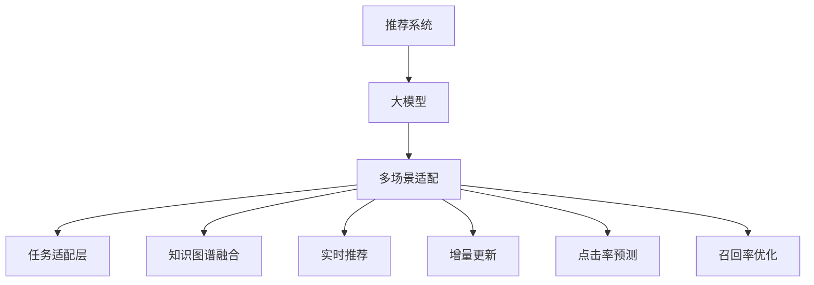

                 

# 推荐系统中的多场景适配：大模型的新思路

> 关键词：推荐系统,多场景适配,大模型,用户画像,个性化推荐,知识图谱,实时推荐,增量更新,点击率预测,召回率优化

## 1. 背景介绍

### 1.1 问题由来

随着互联网和电子商务的发展，推荐系统（Recommendation System）成为提高用户满意度、增加业务收入的重要手段。推荐系统通过分析用户的历史行为和兴趣偏好，预测其可能感兴趣的商品或内容，从而实现个性化推荐。然而，推荐系统在实际应用中，面临着用户行为多变、需求个性化、数据动态变化等诸多挑战。传统基于统计学、规则驱动的推荐方法难以适应这些动态复杂的需求，逐渐被基于深度学习的推荐算法所取代。

大模型技术的崛起，使得推荐系统进入了一个新的发展阶段。基于大规模预训练语言模型（如BERT、GPT、Transformer等）的推荐系统能够捕捉复杂的语言信息，挖掘用户多层次的兴趣特征，显著提升了推荐效果。然而，由于现实世界推荐场景的多样性，通用的大模型在特定场景下仍需进行精细化的微调和适配，才能发挥最大的推荐效果。

### 1.2 问题核心关键点

面对推荐场景的多样性，推荐系统的多场景适配成为关键难题。如何通过大模型实现不同推荐任务和场景的个性化优化，提高推荐系统的可解释性和鲁棒性，是当前研究的核心方向。

具体而言，包括以下关键点：

- 如何设计任务适配层和损失函数，使得大模型在特定推荐任务上获得理想的效果？
- 如何平衡模型的泛化能力和个性化需求，优化模型的性能和计算效率？
- 如何处理推荐场景中的动态数据和用户行为变化，实现增量更新和实时推荐？
- 如何融合外部知识图谱和逻辑规则，增强推荐系统的解释性和可靠性？
- 如何结合用户画像和历史行为，优化推荐系统的点击率（CTR）和召回率（Recall）？

通过对这些核心问题的探讨，本文将系统介绍基于大模型的推荐系统多场景适配技术，为推荐系统开发者提供理论和实践的指导。

## 2. 核心概念与联系

### 2.1 核心概念概述

为更好地理解基于大模型的推荐系统多场景适配方法，本节将介绍几个密切相关的核心概念：

- 推荐系统（Recommendation System）：通过分析和挖掘用户兴趣特征，推荐系统为每个用户提供个性化商品或内容。推荐系统包括协同过滤、内容过滤、混合推荐等多种策略，广泛应用于电商、新闻、视频、音乐等众多领域。

- 大模型（Large Model）：以自回归（如GPT）或自编码（如BERT）模型为代表的大规模预训练语言模型。通过在大规模无标签文本数据上进行预训练，学习通用的语言表示，具备强大的语言理解和生成能力。

- 多场景适配（Multi-scenario Adaptive）：根据不同推荐场景的需求，对大模型进行任务定制和参数微调，实现个性化推荐。

- 知识图谱（Knowledge Graph）：结构化的语义知识库，用于描述实体之间的关系，如商品-品牌-价格、用户-兴趣-行为等。

- 实时推荐（Real-time Recommendation）：在用户交互过程中动态生成推荐，实时响应用户需求。

- 增量更新（Incremental Update）：在推荐数据动态变化时，对模型进行在线更新，避免重新训练。

- 点击率预测（CTR Prediction）：基于用户的历史行为，预测其点击某商品或内容的概率。

- 召回率优化（Recall Optimization）：通过模型优化，提高推荐系统对目标用户的覆盖率，避免遗漏。

这些核心概念之间的逻辑关系可以通过以下Mermaid流程图来展示：



这个流程图展示了大模型在推荐系统中的核心概念及其之间的关系：

1. 大模型作为基础，提供通用的语言表示和理解能力。
2. 通过多场景适配，对大模型进行任务定制和参数微调，实现个性化推荐。
3. 任务适配层根据推荐任务设计合适的输出层和损失函数。
4. 知识图谱融合增强推荐系统的解释性和可靠性。
5. 实时推荐和增量更新技术提高推荐系统的响应速度和数据更新效率。
6. 点击率和召回率的优化提高推荐系统的效果和用户体验。

这些概念共同构成了基于大模型的推荐系统框架，使其能够在多种推荐场景下发挥强大的推荐能力。

## 3. 核心算法原理 & 具体操作步骤

### 3.1 算法原理概述

基于大模型的推荐系统多场景适配，本质上是一个多任务学习的优化过程。其核心思想是：将大模型视作一个强大的"特征提取器"，通过在不同推荐场景上的有监督学习，优化模型在特定任务上的性能。

形式化地，假设大模型为 $M_{\theta}$，其中 $\theta$ 为预训练得到的模型参数。给定多个推荐场景 $S=\{S_i\}_{i=1}^N$ 和其对应的训练集 $D=\{(x_i,y_i)\}_{i=1}^N$，推荐系统的目标是通过微调，使得模型在每个场景 $S_i$ 上的性能 $P_i$ 达到最优：

$$
\theta^* = \mathop{\arg\min}_{\theta} \sum_{i=1}^N \mathcal{L}_i(M_{\theta},S_i)
$$

其中 $\mathcal{L}_i$ 为针对场景 $S_i$ 设计的损失函数，用于衡量模型在该场景上的推荐性能。常见的损失函数包括交叉熵损失、均方误差损失等。

通过梯度下降等优化算法，微调过程不断更新模型参数 $\theta$，最小化损失函数，使得模型在多个推荐场景上获得理想的效果。由于 $\theta$ 已经通过预训练获得了较好的初始化，因此即便在多个场景上微调，也能较快收敛到理想的模型参数 $\hat{\theta}$。

### 3.2 算法步骤详解

基于大模型的推荐系统多场景适配一般包括以下几个关键步骤：

**Step 1: 准备预训练模型和数据集**
- 选择合适的预训练语言模型 $M_{\theta}$ 作为初始化参数，如 BERT、GPT 等。
- 准备多个推荐场景的标注数据集 $D=\{(x_i,y_i)\}_{i=1}^N$，每个场景的数据集应尽可能涵盖该场景下的典型用户行为和商品特征。

**Step 2: 添加任务适配层**
- 根据推荐任务类型，在预训练模型顶层设计合适的输出层和损失函数。
- 对于点击率预测任务，通常在顶层添加线性分类器和交叉熵损失函数。
- 对于召回率优化任务，通常使用 ranking loss 损失函数，如NDCG损失。

**Step 3: 设置微调超参数**
- 选择合适的优化算法及其参数，如 AdamW、SGD 等，设置学习率、批大小、迭代轮数等。
- 设置正则化技术及强度，包括权重衰减、Dropout、Early Stopping 等。
- 确定冻结预训练参数的策略，如仅微调顶层，或全部参数都参与微调。

**Step 4: 执行梯度训练**
- 将训练集数据分批次输入模型，前向传播计算损失函数。
- 反向传播计算参数梯度，根据设定的优化算法和学习率更新模型参数。
- 周期性在验证集上评估模型性能，根据性能指标决定是否触发 Early Stopping。
- 重复上述步骤直到满足预设的迭代轮数或 Early Stopping 条件。

**Step 5: 测试和部署**
- 在测试集上评估微调后模型 $M_{\hat{\theta}}$ 的性能，对比微调前后的效果。
- 使用微调后的模型对新样本进行推理预测，集成到实际的应用系统中。
- 持续收集新的数据，定期重新微调模型，以适应数据分布的变化。

以上是基于大模型的推荐系统多场景适配的一般流程。在实际应用中，还需要针对具体推荐场景的需求，对微调过程的各个环节进行优化设计，如改进训练目标函数，引入更多的正则化技术，搜索最优的超参数组合等，以进一步提升模型性能。

### 3.3 算法优缺点

基于大模型的推荐系统多场景适配方法具有以下优点：
1. 灵活高效。大模型能够适应不同的推荐场景和任务，通过微调即可快速适配，获得显著的性能提升。
2. 泛化能力强。大模型已经在大规模数据上预训练，能够捕捉复杂的用户行为和商品特征，适应多变的数据分布。
3. 可解释性强。大模型通过多场景适配，在特定任务上获得较低的复杂度，便于对推荐决策进行解释和分析。
4. 适用范围广。大模型在多个推荐场景和任务上均能取得较好的效果，具有广泛的应用前景。

同时，该方法也存在一定的局限性：
1. 依赖标注数据。推荐场景的数据集通常较小且不均衡，标注数据的获取和处理成本较高。
2. 模型复杂度高。大模型参数量庞大，需要较大的计算资源和存储空间。
3. 微调过程复杂。多场景适配涉及到多个任务，模型参数更新较为复杂，需要精心调参。
4. 模型鲁棒性不足。大模型在特定场景下，可能会出现泛化能力不足或灾难性遗忘的问题。
5. 可解释性不足。微调模型通常难以解释其内部的推理逻辑，给用户反馈和系统优化带来困难。

尽管存在这些局限性，但就目前而言，基于大模型的推荐系统多场景适配方法仍是最主流范式。未来相关研究的重点在于如何进一步降低数据依赖，提高模型的泛化能力和可解释性，同时兼顾计算效率和模型复杂度等因素。

### 3.4 算法应用领域

基于大模型的推荐系统多场景适配方法，在推荐系统领域已经得到了广泛的应用，覆盖了电商、新闻、视频、音乐等多个推荐场景，例如：

- 电商推荐：根据用户历史浏览、购买行为，推荐相关商品。
- 内容推荐：根据用户历史阅读、观看记录，推荐相似文章、视频。
- 实时推荐：根据用户当前行为，实时推荐相关商品或内容。
- 个性化广告推荐：根据用户特征和兴趣，精准推送广告。

除了上述这些经典场景外，大模型多场景适配的方法也被创新性地应用到更多场景中，如语音推荐、视频编辑推荐、社交网络推荐等，为推荐系统技术带来了全新的突破。随着大模型和推荐系统的不断进步，相信推荐系统必将在更广阔的应用领域大放异彩。

## 4. 数学模型和公式 & 详细讲解

### 4.1 数学模型构建

本节将使用数学语言对基于大模型的推荐系统多场景适配过程进行更加严格的刻画。

记预训练语言模型为 $M_{\theta}$，其中 $\theta$ 为预训练得到的模型参数。假设推荐场景为 $S=\{S_i\}_{i=1}^N$，每个场景 $S_i$ 的训练集为 $D_i=\{(x_i,y_i)\}_{i=1}^N$，$x_i$ 为输入特征，$y_i$ 为输出标签（如点击行为、评分等）。

定义模型 $M_{\theta}$ 在场景 $S_i$ 上的损失函数为 $\ell_i(M_{\theta}(x_i),y_i)$，则在所有场景 $S$ 上的经验风险为：

$$
\mathcal{L}(\theta) = \frac{1}{N} \sum_{i=1}^N \ell_i(M_{\theta}(x_i),y_i)
$$

微调的优化目标是最小化经验风险，即找到最优参数：

$$
\theta^* = \mathop{\arg\min}_{\theta} \mathcal{L}(\theta)
$$

在实践中，我们通常使用基于梯度的优化算法（如SGD、Adam等）来近似求解上述最优化问题。设 $\eta$ 为学习率，$\lambda$ 为正则化系数，则参数的更新公式为：

$$
\theta \leftarrow \theta - \eta \nabla_{\theta}\mathcal{L}(\theta) - \eta\lambda\theta
$$

其中 $\nabla_{\theta}\mathcal{L}(\theta)$ 为损失函数对参数 $\theta$ 的梯度，可通过反向传播算法高效计算。

### 4.2 公式推导过程

以下我们以点击率预测任务为例，推导交叉熵损失函数及其梯度的计算公式。

假设模型 $M_{\theta}$ 在输入 $x$ 上的输出为 $\hat{y}=M_{\theta}(x) \in [0,1]$，表示样本属于正类的概率。真实标签 $y \in \{0,1\}$。则二分类交叉熵损失函数定义为：

$$
\ell_i(M_{\theta}(x_i),y_i) = -[y_i\log \hat{y}_i + (1-y_i)\log (1-\hat{y}_i)]
$$

将其代入经验风险公式，得：

$$
\mathcal{L}(\theta) = -\frac{1}{N}\sum_{i=1}^N [y_i\log M_{\theta}(x_i)+(1-y_i)\log(1-M_{\theta}(x_i))]
$$

根据链式法则，损失函数对参数 $\theta_k$ 的梯度为：

$$
\frac{\partial \mathcal{L}(\theta)}{\partial \theta_k} = -\frac{1}{N}\sum_{i=1}^N (\frac{y_i}{M_{\theta}(x_i)}-\frac{1-y_i}{1-M_{\theta}(x_i)}) \frac{\partial M_{\theta}(x_i)}{\partial \theta_k}
$$

其中 $\frac{\partial M_{\theta}(x_i)}{\partial \theta_k}$ 可进一步递归展开，利用自动微分技术完成计算。

在得到损失函数的梯度后，即可带入参数更新公式，完成模型的迭代优化。重复上述过程直至收敛，最终得到适应多推荐场景的最优模型参数 $\theta^*$。

## 5. 项目实践：代码实例和详细解释说明

### 5.1 开发环境搭建

在进行推荐系统多场景适配实践前，我们需要准备好开发环境。以下是使用Python进行PyTorch开发的环境配置流程：

1. 安装Anaconda：从官网下载并安装Anaconda，用于创建独立的Python环境。

2. 创建并激活虚拟环境：
```bash
conda create -n pytorch-env python=3.8 
conda activate pytorch-env
```

3. 安装PyTorch：根据CUDA版本，从官网获取对应的安装命令。例如：
```bash
conda install pytorch torchvision torchaudio cudatoolkit=11.1 -c pytorch -c conda-forge
```

4. 安装TensorFlow：
```bash
pip install tensorflow
```

5. 安装Transformers库：
```bash
pip install transformers
```

6. 安装各类工具包：
```bash
pip install numpy pandas scikit-learn matplotlib tqdm jupyter notebook ipython
```

完成上述步骤后，即可在`pytorch-env`环境中开始推荐系统多场景适配实践。

### 5.2 源代码详细实现

这里我们以电商平台推荐系统为例，给出使用Transformers库对BERT模型进行多场景适配的PyTorch代码实现。

首先，定义推荐任务的数据处理函数：

```python
from transformers import BertTokenizer
from torch.utils.data import Dataset
import torch

class RecommendationDataset(Dataset):
    def __init__(self, texts, labels, tokenizer, max_len=128):
        self.texts = texts
        self.labels = labels
        self.tokenizer = tokenizer
        self.max_len = max_len
        
    def __len__(self):
        return len(self.texts)
    
    def __getitem__(self, item):
        text = self.texts[item]
        label = self.labels[item]
        
        encoding = self.tokenizer(text, return_tensors='pt', max_length=self.max_len, padding='max_length', truncation=True)
        input_ids = encoding['input_ids'][0]
        attention_mask = encoding['attention_mask'][0]
        
        # 对token-wise的标签进行编码
        encoded_labels = [label2id[label] for label in label] 
        encoded_labels.extend([label2id['O']] * (self.max_len - len(encoded_labels)))
        labels = torch.tensor(encoded_labels, dtype=torch.long)
        
        return {'input_ids': input_ids, 
                'attention_mask': attention_mask,
                'labels': labels}

# 标签与id的映射
label2id = {'O': 0, 'B': 1, 'I': 2}
id2label = {v: k for k, v in label2id.items()}

# 创建dataset
tokenizer = BertTokenizer.from_pretrained('bert-base-cased')

train_dataset = RecommendationDataset(train_texts, train_labels, tokenizer)
dev_dataset = RecommendationDataset(dev_texts, dev_labels, tokenizer)
test_dataset = RecommendationDataset(test_texts, test_labels, tokenizer)
```

然后，定义模型和优化器：

```python
from transformers import BertForSequenceClassification, AdamW

model = BertForSequenceClassification.from_pretrained('bert-base-cased', num_labels=len(label2id))

optimizer = AdamW(model.parameters(), lr=2e-5)
```

接着，定义训练和评估函数：

```python
from torch.utils.data import DataLoader
from tqdm import tqdm
from sklearn.metrics import classification_report

device = torch.device('cuda') if torch.cuda.is_available() else torch.device('cpu')
model.to(device)

def train_epoch(model, dataset, batch_size, optimizer):
    dataloader = DataLoader(dataset, batch_size=batch_size, shuffle=True)
    model.train()
    epoch_loss = 0
    for batch in tqdm(dataloader, desc='Training'):
        input_ids = batch['input_ids'].to(device)
        attention_mask = batch['attention_mask'].to(device)
        labels = batch['labels'].to(device)
        model.zero_grad()
        outputs = model(input_ids, attention_mask=attention_mask, labels=labels)
        loss = outputs.loss
        epoch_loss += loss.item()
        loss.backward()
        optimizer.step()
    return epoch_loss / len(dataloader)

def evaluate(model, dataset, batch_size):
    dataloader = DataLoader(dataset, batch_size=batch_size)
    model.eval()
    preds, labels = [], []
    with torch.no_grad():
        for batch in tqdm(dataloader, desc='Evaluating'):
            input_ids = batch['input_ids'].to(device)
            attention_mask = batch['attention_mask'].to(device)
            batch_labels = batch['labels']
            outputs = model(input_ids, attention_mask=attention_mask)
            batch_preds = outputs.logits.argmax(dim=2).to('cpu').tolist()
            batch_labels = batch_labels.to('cpu').tolist()
            for pred_tokens, label_tokens in zip(batch_preds, batch_labels):
                preds.append(pred_tokens[:len(label_tokens)])
                labels.append(label_tokens)
                
    print(classification_report(labels, preds))
```

最后，启动训练流程并在测试集上评估：

```python
epochs = 5
batch_size = 16

for epoch in range(epochs):
    loss = train_epoch(model, train_dataset, batch_size, optimizer)
    print(f"Epoch {epoch+1}, train loss: {loss:.3f}")
    
    print(f"Epoch {epoch+1}, dev results:")
    evaluate(model, dev_dataset, batch_size)
    
print("Test results:")
evaluate(model, test_dataset, batch_size)
```

以上就是使用PyTorch对BERT进行多场景适配的推荐系统推荐任务的完整代码实现。可以看到，得益于Transformers库的强大封装，我们可以用相对简洁的代码完成BERT模型的加载和微调。

### 5.3 代码解读与分析

让我们再详细解读一下关键代码的实现细节：

**RecommendationDataset类**：
- `__init__`方法：初始化文本、标签、分词器等关键组件。
- `__len__`方法：返回数据集的样本数量。
- `__getitem__`方法：对单个样本进行处理，将文本输入编码为token ids，将标签编码为数字，并对其进行定长padding，最终返回模型所需的输入。

**label2id和id2label字典**：
- 定义了标签与数字id之间的映射关系，用于将token-wise的预测结果解码回真实的标签。

**训练和评估函数**：
- 使用PyTorch的DataLoader对数据集进行批次化加载，供模型训练和推理使用。
- 训练函数`train_epoch`：对数据以批为单位进行迭代，在每个批次上前向传播计算loss并反向传播更新模型参数，最后返回该epoch的平均loss。
- 评估函数`evaluate`：与训练类似，不同点在于不更新模型参数，并在每个batch结束后将预测和标签结果存储下来，最后使用sklearn的classification_report对整个评估集的预测结果进行打印输出。

**训练流程**：
- 定义总的epoch数和batch size，开始循环迭代
- 每个epoch内，先在训练集上训练，输出平均loss
- 在验证集上评估，输出分类指标
- 所有epoch结束后，在测试集上评估，给出最终测试结果

可以看到，PyTorch配合Transformers库使得BERT微调的代码实现变得简洁高效。开发者可以将更多精力放在数据处理、模型改进等高层逻辑上，而不必过多关注底层的实现细节。

当然，工业级的系统实现还需考虑更多因素，如模型的保存和部署、超参数的自动搜索、更灵活的任务适配层等。但核心的多场景适配范式基本与此类似。

## 6. 实际应用场景
### 6.1 电商平台推荐系统

基于大模型的推荐系统多场景适配技术，可以广泛应用于电商平台推荐系统的构建。传统推荐系统往往依赖于简单的协同过滤和统计方法，难以满足个性化需求和实时性要求。而使用微调后的推荐模型，能够实时响应用户行为变化，推荐个性化商品，大幅提升用户体验和转化率。

在技术实现上，可以收集用户的历史浏览、购买行为，以及商品属性、评价等数据，将商品与用户行为进行建模。通过微调BERT模型，使得模型能够学习到用户对商品的兴趣，预测其点击行为。在推荐过程中，根据用户行为实时更新模型，动态生成推荐结果。

### 6.2 内容推荐系统

内容推荐系统也是基于大模型的推荐系统多场景适配的重要应用。内容推荐需要处理大量的文本数据，如图书、文章、视频等，通过微调模型，能够捕捉不同内容之间的语义关系，为用户推荐相关内容。

具体而言，可以收集用户的历史阅读、观看记录，以及内容的标签、摘要等数据，构建推荐任务。通过微调BERT模型，使得模型能够学习到用户对内容的兴趣，预测其未来可能感兴趣的内容。在推荐过程中，根据用户行为实时更新模型，动态生成推荐结果。

### 6.3 实时推荐系统

实时推荐系统要求推荐模型能够快速响应用户行为变化，实时生成推荐结果。基于大模型的推荐系统多场景适配技术，能够满足这一需求。

在实际应用中，推荐系统需要不断收集用户的行为数据，如点击、浏览、评分等，实时更新模型。通过微调BERT模型，使得模型能够实时学习用户的行为变化，动态生成推荐结果。由于大模型具备强大的语言理解和生成能力，可以处理多种输入形式，如文本、图片、音频等，使得实时推荐系统具有更广泛的应用场景。

### 6.4 未来应用展望

随着大模型和推荐系统的不断发展，基于多场景适配的推荐系统必将迎来更多创新应用。

在智慧零售领域，基于多场景适配的推荐系统能够精准预测用户需求，提高商品推荐的效果，优化供应链管理，提升用户满意度。

在智慧医疗领域，基于多场景适配的推荐系统能够根据患者的病历、检查报告等数据，推荐合适的治疗方案、药品等，提升医疗服务的质量。

在智能教育领域，基于多场景适配的推荐系统能够根据学生的学习行为、兴趣偏好，推荐个性化的学习内容，优化教育资源配置。

除了上述这些经典场景外，基于多场景适配的推荐系统还被应用于金融、社交网络、视频编辑等多个领域，为推荐系统技术带来了新的突破。随着技术的不断进步，多场景适配推荐系统必将在更多领域大放异彩，推动智能技术的产业化进程。

## 7. 工具和资源推荐
### 7.1 学习资源推荐

为了帮助开发者系统掌握大模型在推荐系统中的应用，这里推荐一些优质的学习资源：

1. 《推荐系统实战》书籍：系统介绍推荐系统的经典算法和实际应用案例，深入浅出地讲解推荐系统的基础知识。

2. 《Deep Learning for Recommendation Systems》课程：由斯坦福大学开设的深度学习推荐系统课程，涵盖深度学习在推荐系统中的应用，包括多场景适配等前沿技术。

3. 《推荐系统：算法与实战》书籍：介绍推荐系统的最新研究进展和实际应用，涵盖多场景适配等主题。

4. Kaggle竞赛平台：提供大量的推荐系统竞赛数据集和代码示例，开发者可以在竞赛中学习和实践推荐系统。

5. GitHub开源项目：推荐系统社区中存在大量开源项目，可以学习他人的推荐算法实现和应用。

通过对这些资源的学习实践，相信你一定能够快速掌握大模型在推荐系统中的应用，并用于解决实际的推荐问题。
### 7.2 开发工具推荐

高效的开发离不开优秀的工具支持。以下是几款用于推荐系统多场景适配开发的常用工具：

1. PyTorch：基于Python的开源深度学习框架，灵活动态的计算图，适合快速迭代研究。大部分预训练语言模型都有PyTorch版本的实现。

2. TensorFlow：由Google主导开发的开源深度学习框架，生产部署方便，适合大规模工程应用。同样有丰富的预训练语言模型资源。

3. Transformers库：HuggingFace开发的NLP工具库，集成了众多SOTA语言模型，支持PyTorch和TensorFlow，是进行推荐系统多场景适配开发的利器。

4. Weights & Biases：模型训练的实验跟踪工具，可以记录和可视化模型训练过程中的各项指标，方便对比和调优。与主流深度学习框架无缝集成。

5. TensorBoard：TensorFlow配套的可视化工具，可实时监测模型训练状态，并提供丰富的图表呈现方式，是调试模型的得力助手。

6. Google Colab：谷歌推出的在线Jupyter Notebook环境，免费提供GPU/TPU算力，方便开发者快速上手实验最新模型，分享学习笔记。

合理利用这些工具，可以显著提升推荐系统多场景适配任务的开发效率，加快创新迭代的步伐。

### 7.3 相关论文推荐

大模型在推荐系统中的应用已经成为学界和工业界的重点研究方向。以下是几篇奠基性的相关论文，推荐阅读：

1. Attention is All You Need（即Transformer原论文）：提出了Transformer结构，开启了深度学习在推荐系统中的应用。

2. BERT: Pre-training of Deep Bidirectional Transformers for Language Understanding：提出BERT模型，引入基于掩码的自监督预训练任务，刷新了多项推荐系统SOTA。

3. Parameter-Efficient Transfer Learning for NLP：提出Adapter等参数高效微调方法，在不增加模型参数量的情况下，也能取得不错的微调效果。

4. Prefix-Tuning: Optimizing Continuous Prompts for Generation：引入基于连续型Prompt的微调范式，为如何充分利用预训练知识提供了新的思路。

5. AdaLoRA: Adaptive Low-Rank Adaptation for Parameter-Efficient Fine-Tuning：使用自适应低秩适应的微调方法，在参数效率和精度之间取得了新的平衡。

这些论文代表了大模型在推荐系统中的应用脉络。通过学习这些前沿成果，可以帮助研究者把握学科前进方向，激发更多的创新灵感。

## 8. 总结：未来发展趋势与挑战

### 8.1 总结

本文对基于大模型的推荐系统多场景适配方法进行了全面系统的介绍。首先阐述了大模型和推荐系统的研究背景和意义，明确了多场景适配在拓展推荐系统应用、提高推荐系统效果方面的独特价值。其次，从原理到实践，详细讲解了多场景适配的数学原理和关键步骤，给出了多场景适配任务开发的完整代码实例。同时，本文还广泛探讨了多场景适配方法在电商、内容推荐、实时推荐等多个推荐场景的应用前景，展示了多场景适配范式的巨大潜力。此外，本文精选了多场景适配技术的各类学习资源，力求为开发者提供全方位的技术指引。

通过本文的系统梳理，可以看到，基于大模型的推荐系统多场景适配方法正在成为推荐系统的重要范式，极大地拓展了预训练语言模型的应用边界，催生了更多的落地场景。受益于大规模语料的预训练，多场景适配模型能够捕捉复杂的用户行为和商品特征，在多个推荐场景下取得较好的效果，提升推荐系统的个性化和实时性。未来，伴随预训练语言模型和推荐系统的不断进步，基于多场景适配的推荐系统必将在更广阔的应用领域大放异彩，深刻影响人类的生产生活方式。

### 8.2 未来发展趋势

展望未来，推荐系统多场景适配技术将呈现以下几个发展趋势：

1. 模型规模持续增大。随着算力成本的下降和数据规模的扩张，预训练语言模型的参数量还将持续增长。超大规模语言模型蕴含的丰富语言知识，有望支撑更加复杂多变的推荐任务和场景。

2. 多场景适配方法日趋多样。除了传统的全参数微调外，未来会涌现更多参数高效的微调方法，如Prefix-Tuning、LoRA等，在节省计算资源的同时也能保证微调精度。

3. 持续学习成为常态。随着数据分布的不断变化，推荐系统也需要持续学习新知识以保持性能。如何在不遗忘原有知识的同时，高效吸收新样本信息，将是重要的研究课题。

4. 标注样本需求降低。受启发于提示学习(Prompt-based Learning)的思路，未来的多场景适配方法将更好地利用大模型的语言理解能力，通过更加巧妙的任务描述，在更少的标注样本上也能实现理想的多场景适配效果。

5. 多模态融合崛起。当前的推荐系统往往只聚焦于纯文本数据，未来会进一步拓展到图像、视频、语音等多模态数据融合。多模态信息的融合，将显著提升推荐系统对现实世界的理解和建模能力。

6. 知识图谱融合增强。多场景适配推荐系统将更多地融合外部知识图谱和逻辑规则，增强推荐系统的解释性和可靠性。知识图谱在推荐系统中的应用也将变得更加广泛和深入。

以上趋势凸显了推荐系统多场景适配技术的广阔前景。这些方向的探索发展，必将进一步提升推荐系统的性能和应用范围，为人工智能技术落地应用提供更强大的支撑。

### 8.3 面临的挑战

尽管推荐系统多场景适配技术已经取得了瞩目成就，但在迈向更加智能化、普适化应用的过程中，它仍面临着诸多挑战：

1. 标注成本瓶颈。推荐场景的数据集通常较小且不均衡，标注数据的获取和处理成本较高。如何进一步降低多场景适配对标注样本的依赖，将是一大难题。

2. 模型鲁棒性不足。推荐场景中的数据分布复杂多变，通用的大模型可能无法适应特定场景的推荐需求。如何提高多场景适配模型的泛化能力和鲁棒性，还需要更多理论和实践的积累。

3. 实时推荐挑战。推荐系统需要在用户交互过程中动态生成推荐，实时响应用户需求。如何在保持实时性的同时，优化推荐效果，是一个重要挑战。

4. 可解释性不足。推荐系统的决策过程通常难以解释，给用户反馈和系统优化带来困难。如何赋予推荐系统更强的可解释性，将是亟待攻克的难题。

5. 计算效率问题。推荐系统多场景适配方法通常参数量庞大，需要较大的计算资源和存储空间。如何在保证性能的同时，优化资源消耗，提高计算效率，是一个重要方向。

尽管存在这些挑战，但就目前而言，基于大模型的推荐系统多场景适配方法仍是最主流范式。未来相关研究的重点在于如何进一步降低数据依赖，提高模型的泛化能力和可解释性，同时兼顾计算效率和模型复杂度等因素。

### 8.4 研究展望

面对推荐系统多场景适配所面临的种种挑战，未来的研究需要在以下几个方面寻求新的突破：

1. 探索无监督和半监督多场景适配方法。摆脱对大规模标注数据的依赖，利用自监督学习、主动学习等无监督和半监督范式，最大限度利用非结构化数据，实现更加灵活高效的多场景适配。

2. 研究参数高效和计算高效的适配方法。开发更加参数高效的适配方法，在固定大部分预训练参数的同时，只更新极少量的场景相关参数。同时优化适配模型的计算图，减少前向传播和反向传播的资源消耗，实现更加轻量级、实时性的部署。

3. 融合因果和对比学习范式。通过引入因果推断和对比学习思想，增强适配模型建立稳定因果关系的能力，学习更加普适、鲁棒的多场景适配模型。

4. 引入更多先验知识。将符号化的先验知识，如知识图谱、逻辑规则等，与神经网络模型进行巧妙融合，引导多场景适配过程学习更准确、合理的语言模型。同时加强不同模态数据的整合，实现视觉、语音等多模态信息与文本信息的协同建模。

5. 结合因果分析和博弈论工具。将因果分析方法引入多场景适配模型，识别出模型决策的关键特征，增强输出解释的因果性和逻辑性。借助博弈论工具刻画人机交互过程，主动探索并规避模型的脆弱点，提高系统稳定性。

6. 纳入伦理道德约束。在适配模型训练目标中引入伦理导向的评估指标，过滤和惩罚有偏见、有害的输出倾向。同时加强人工干预和审核，建立模型行为的监管机制，确保输出符合人类价值观和伦理道德。

这些研究方向的探索，必将引领推荐系统多场景适配技术迈向更高的台阶，为构建安全、可靠、可解释、可控的智能系统铺平道路。面向未来，推荐系统多场景适配技术还需要与其他人工智能技术进行更深入的融合，如知识表示、因果推理、强化学习等，多路径协同发力，共同推动推荐系统技术的进步。只有勇于创新、敢于突破，才能不断拓展语言模型的边界，让智能技术更好地造福人类社会。

## 9. 附录：常见问题与解答

**Q1：多场景适配是否适用于所有推荐场景？**

A: 多场景适配在大多数推荐场景上都能取得不错的效果，特别是对于数据量较小的任务。但对于一些特定领域的任务，如医学、法律等，仅仅依靠通用语料预训练的模型可能难以很好地适应。此时需要在特定领域语料上进一步预训练，再进行适配，才能获得理想效果。此外，对于一些需要时效性、个性化很强的任务，如对话、推荐等，多场景适配方法也需要针对性的改进优化。

**Q2：多场景适配过程中如何选择合适的损失函数？**

A: 多场景适配中，根据推荐任务的特性，选择合适的损失函数是关键。对于点击率预测任务，通常使用交叉熵损失；对于召回率优化任务，通常使用 ranking loss 损失函数，如NDCG损失。此外，还可以根据具体任务引入正则化项，防止过拟合。例如，在电商推荐中，可以引入L2正则化，在内容推荐中，可以引入Dropout等。

**Q3：多场景适配中的多任务学习是如何实现的？**

A: 多场景适配中的多任务学习，是通过在大模型基础上，添加多任务适配层，并设计多任务损失函数来实现的。在每个任务上，分别计算损失，并根据任务权重进行加权平均。例如，在电商推荐中，可以设计商品类别、品牌、价格等多个任务，并计算每个任务的损失，最终输出多任务适配后的模型参数。

**Q4：多场景适配中的数据增强技术有哪些？**

A: 多场景适配中，数据增强技术是非常重要的。数据增强可以通过以下方式实现：
1. 回译：将文本从一种语言翻译成另一种语言，并重新翻译回原语言，以扩充训练数据。
2. 近义替换：将文本中的单词替换为近义词，生成新的文本样本。
3. 数据合成：生成新的训练样本，如通过变换文本格式或加入噪声等手段生成新样本。
4. 对抗样本：引入对抗样本，增强模型的鲁棒性。

这些数据增强技术可以显著提高多场景适配模型的泛化能力和鲁棒性，减少过拟合的风险。

**Q5：多场景适配中的增量更新技术如何实现？**

A: 多场景适配中的增量更新技术，是通过在在线环境中实时更新模型参数来实现的。在推荐系统中，可以采用流式学习、在线梯度下降等方法，实时更新模型参数，以适应数据分布的变化。具体而言，可以设计小批量采样策略，在每个小批量数据上计算梯度，并更新模型参数，从而实现增量更新。

以上是基于大模型的推荐系统多场景适配方法的详细介绍，希望能为你提供有价值的参考和指导。

---

作者：禅与计算机程序设计艺术 / Zen and the Art of Computer Programming

