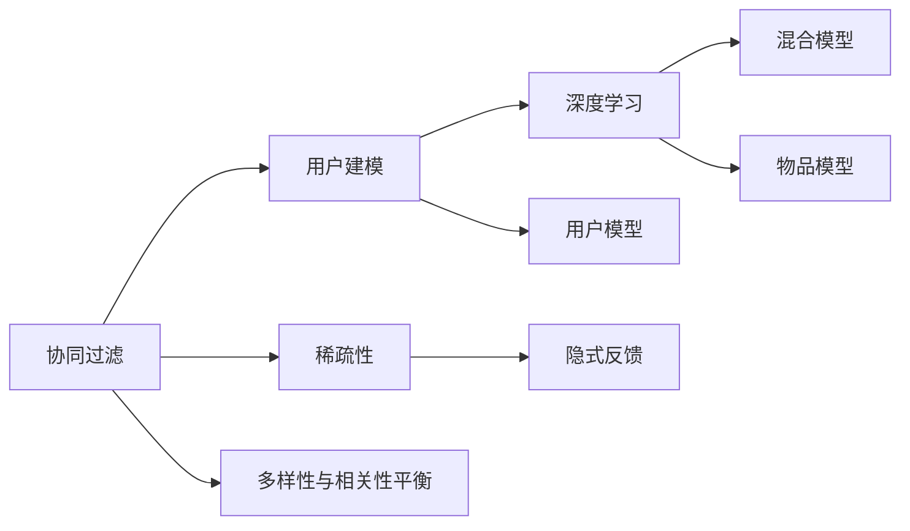

                 

# 推荐系统中的多样性与相关性平衡：大模型的调控策略

> 关键词：推荐系统,多样性与相关性,大模型,协同过滤,深度学习,混合模型,稀疏性,隐式反馈,用户模型

## 1. 背景介绍

推荐系统是人工智能领域中重要的应用之一，旨在通过分析用户的历史行为和兴趣，为用户推荐最符合其需求的商品或内容。在过去几十年中，推荐系统经历了从基于规则到基于协同过滤，再到基于深度学习的变迁。随着深度学习技术的迅速发展，基于大模型的推荐系统成为了新一代推荐系统的热门选择。

### 1.1 推荐系统的基本原理

推荐系统通常包含以下步骤：
- 用户建模：基于用户的历史行为数据，建立用户兴趣模型。
- 物品建模：基于物品的属性或特征，建立物品特征向量。
- 计算相似度：通过计算用户模型与物品模型的相似度，构建推荐候选列表。
- 排序：通过学习排序模型，对推荐候选列表进行排序，最终输出推荐结果。

推荐系统的效果评价指标主要包括：召回率、准确率、F1-score、点击率等。目标是最大化用户满意度，提高用户粘性，促进销售额的提升。

### 1.2 大模型在推荐系统中的应用

大模型通常指具有数亿甚至数十亿参数的神经网络模型，如基于Transformer的BERT、GPT-3等。这些模型通过在海量数据上进行预训练，能够学习到丰富的语义和模式信息，从而在推荐系统中取得更优的性能。

大模型在推荐系统中的应用主要包括：
- 用户模型表示：利用预训练语言模型或特定领域大模型，对用户兴趣进行建模。
- 物品模型表示：利用预训练语言模型或特定领域大模型，对物品属性进行建模。
- 多模态信息融合：结合文本、图像、音频等多种模态信息，提升推荐系统效果。

## 2. 核心概念与联系

### 2.1 核心概念概述

为更好地理解大模型在推荐系统中的应用，本节将介绍几个关键概念：

- 协同过滤（Collaborative Filtering）：基于用户与物品的协同行为，如评分、点击等，进行推荐。分为基于用户的协同过滤和基于物品的协同过滤两种。
- 深度学习（Deep Learning）：利用深层神经网络模型，从原始数据中提取高层次特征，实现对用户和物品的建模。
- 混合模型（Hybrid Model）：结合协同过滤和深度学习，取长补短，提升推荐系统性能。
- 稀疏性（Sparsity）：推荐系统中用户与物品的交互数据通常非常稀疏，需要在模型设计中考虑稀疏性带来的影响。
- 隐式反馈（Implicit Feedback）：用户对物品的评分、点击等行为属于隐式反馈，需要使用特殊的推荐模型进行处理。
- 用户模型（User Model）：基于用户的历史行为和兴趣，建立用户兴趣模型，用于预测用户对物品的偏好。
- 物品模型（Item Model）：基于物品的属性或特征，建立物品特征向量，用于预测物品对用户的吸引力。

这些概念之间通过以下Mermaid流程图展示其联系：



这个流程图展示了协同过滤、深度学习、混合模型等概念之间的内在联系，以及大模型在推荐系统中的应用。

## 3. 核心算法原理 & 具体操作步骤
### 3.1 算法原理概述

大模型在推荐系统中的调控策略，主要围绕两个核心目标：多样性（Diversity）和相关性（Relevance）。多样性指的是推荐结果的多样性，相关性指的是推荐结果的相关性。通过调控策略，可以实现推荐结果的多样性与相关性的平衡，从而提升推荐效果。

### 3.2 算法步骤详解

#### 3.2.1 多样性

推荐结果的多样性可以通过以下步骤进行调控：

1. 定义多样性指标：如基于多标签的二分类问题，标记为“多样”或“不多样”。
2. 设计损失函数：如交叉熵损失、Focal Loss等，衡量预测结果与真实结果之间的差异。
3. 优化模型参数：使用基于梯度的优化算法，最小化损失函数，最大化多样性指标。

#### 3.2.2 相关性

推荐结果的相关性可以通过以下步骤进行调控：

1. 定义相关性指标：如均方误差（MSE）、交叉熵损失等，衡量预测结果与真实结果之间的差异。
2. 设计损失函数：如均方误差、交叉熵损失等，衡量预测结果与真实结果之间的差异。
3. 优化模型参数：使用基于梯度的优化算法，最小化损失函数，最大化相关性指标。

#### 3.2.3 混合模型

混合模型融合了协同过滤和深度学习两种技术，可以取长补短，提升推荐系统性能。具体步骤如下：

1. 预训练大模型：使用大规模无标签数据对大模型进行预训练。
2. 融合协同过滤和深度学习：将协同过滤的结果和深度学习的结果进行融合，构建最终的推荐候选列表。
3. 模型微调：在融合后的结果上，进一步微调模型，提升推荐效果。

#### 3.2.4 稀疏性处理

在推荐系统中，用户与物品的交互数据通常非常稀疏。针对稀疏性，可以采取以下措施：

1. 矩阵分解：将用户-物品交互矩阵分解为用户特征矩阵和物品特征矩阵，减少模型参数量，提高计算效率。
2. 矩阵补全：对稀疏矩阵进行补全，填充缺失的元素，提高模型效果。
3. 负采样：通过负采样技术，增加样本数量，缓解数据稀疏性带来的问题。

#### 3.2.5 隐式反馈处理

对于用户对物品的隐式反馈，可以采取以下措施：

1. 模型训练：利用隐式反馈数据进行模型训练，预测用户对物品的评分或点击概率。
2. 特征工程：通过特征工程，将隐式反馈数据转化为显式反馈数据，方便模型训练。
3. 模型融合：将隐式反馈结果和显式反馈结果进行融合，提升推荐效果。

### 3.3 算法优缺点

大模型在推荐系统中的调控策略具有以下优点：

- 提升推荐效果：通过多样性、相关性、稀疏性等调控策略，提升推荐系统效果。
- 泛化能力强：大模型能够学习到丰富的语义和模式信息，具备较强的泛化能力。
- 鲁棒性强：大模型对数据噪声和异常值具有较强的鲁棒性。

同时，也存在以下缺点：

- 计算成本高：大模型通常需要大量的计算资源和存储空间。
- 训练时间长：大模型需要大量的训练时间和数据。
- 可解释性差：大模型的决策过程难以解释，缺乏可解释性。

### 3.4 算法应用领域

大模型在推荐系统中的应用领域非常广泛，涵盖了以下几个方向：

1. 电商推荐：基于用户的浏览、购买历史，推荐商品或广告。
2. 视频推荐：基于用户的观看历史，推荐视频内容或相关商品。
3. 音乐推荐：基于用户的听歌历史，推荐歌曲或专辑。
4. 新闻推荐：基于用户的阅读历史，推荐新闻内容或相关话题。
5. 旅游推荐：基于用户的出行历史，推荐旅游目的地或行程。

## 4. 数学模型和公式 & 详细讲解 & 举例说明

### 4.1 数学模型构建

大模型在推荐系统中的应用，通常可以通过以下几个数学模型进行描述：

1. 用户模型：将用户表示为一个向量 $u_i \in \mathbb{R}^d$，其中 $d$ 为特征维度。
2. 物品模型：将物品表示为一个向量 $v_j \in \mathbb{R}^d$，其中 $d$ 为特征维度。
3. 用户-物品评分矩阵：定义用户-物品评分矩阵 $R \in \mathbb{R}^{N \times M}$，其中 $N$ 为用户数量，$M$ 为物品数量，$R_{ij}$ 表示用户 $i$ 对物品 $j$ 的评分。
4. 协同过滤模型：使用协同过滤方法，预测用户对物品的评分。

### 4.2 公式推导过程

#### 4.2.1 用户模型

用户模型可以通过以下公式进行描述：

$$
u_i = W_u \times I_{ui} + b_u
$$

其中 $W_u$ 为用户特征向量权重矩阵，$I_{ui}$ 为二值用户特征向量，$b_u$ 为偏置项。

#### 4.2.2 物品模型

物品模型可以通过以下公式进行描述：

$$
v_j = W_v \times I_{vj} + b_v
$$

其中 $W_v$ 为物品特征向量权重矩阵，$I_{vj}$ 为二值物品特征向量，$b_v$ 为偏置项。

#### 4.2.3 协同过滤模型

协同过滤模型可以通过以下公式进行描述：

$$
\hat{r}_{ij} = u_i \cdot v_j + b
$$

其中 $\hat{r}_{ij}$ 为预测用户 $i$ 对物品 $j$ 的评分，$u_i$ 为用户模型，$v_j$ 为物品模型，$b$ 为偏置项。

### 4.3 案例分析与讲解

以电商推荐系统为例，分析大模型在推荐系统中的应用。

#### 4.3.1 用户模型

电商推荐系统中的用户模型可以通过用户的历史行为数据进行训练，如浏览历史、购买历史、评分历史等。用户模型的目标是预测用户对不同商品的评分，从而构建推荐候选列表。

#### 4.3.2 物品模型

电商推荐系统中的物品模型可以通过商品的属性信息进行训练，如价格、品牌、类别等。物品模型的目标是预测用户对不同商品的评分，从而构建推荐候选列表。

#### 4.3.3 协同过滤模型

电商推荐系统中的协同过滤模型可以通过用户-物品评分矩阵进行训练，预测用户对新商品的评分。协同过滤模型的目标是最大化用户满意度，提升推荐系统效果。

## 5. 项目实践：代码实例和详细解释说明

### 5.1 开发环境搭建

在进行推荐系统开发前，我们需要准备好开发环境。以下是使用Python进行PyTorch开发的环境配置流程：

1. 安装Anaconda：从官网下载并安装Anaconda，用于创建独立的Python环境。

2. 创建并激活虚拟环境：
```bash
conda create -n recomm-env python=3.8 
conda activate recomm-env
```

3. 安装PyTorch：根据CUDA版本，从官网获取对应的安装命令。例如：
```bash
conda install pytorch torchvision torchaudio cudatoolkit=11.1 -c pytorch -c conda-forge
```

4. 安装TensorFlow：如果需要在混合模型中引入TensorFlow，可以使用以下命令：
```bash
pip install tensorflow
```

5. 安装各类工具包：
```bash
pip install numpy pandas scikit-learn matplotlib tqdm jupyter notebook ipython
```

完成上述步骤后，即可在`recomm-env`环境中开始推荐系统开发。

### 5.2 源代码详细实现

下面我们以电商推荐系统为例，给出使用Transformers库对用户和物品模型进行训练的PyTorch代码实现。

首先，定义用户和物品的特征表示：

```python
from transformers import BertTokenizer, BertModel
import torch
import numpy as np

# 用户特征表示
user_ids = np.array([1, 2, 3, 4, 5])
user_features = np.array([[1, 0, 1, 0, 1], [0, 1, 0, 1, 0], [1, 1, 0, 1, 1], [0, 0, 1, 0, 1], [1, 0, 1, 0, 1]])

# 物品特征表示
item_ids = np.array([101, 102, 103, 104, 105])
item_features = np.array([[0, 1, 1, 0, 1], [1, 1, 0, 1, 0], [0, 1, 1, 0, 1], [0, 0, 1, 0, 1], [1, 1, 0, 1, 1]])

# 用户-物品评分矩阵
user_item_ratings = np.array([[5, 3, 2, 4, 1], [1, 2, 5, 3, 4], [3, 4, 1, 5, 2], [2, 5, 3, 1, 4], [4, 1, 2, 3, 5]])

# 定义用户和物品模型
user_model = BertModel.from_pretrained('bert-base-cased', output_hidden_states=True)
item_model = BertModel.from_pretrained('bert-base-cased', output_hidden_states=True)

# 定义用户和物品特征向量
user_features = torch.tensor(user_features).unsqueeze(0)
item_features = torch.tensor(item_features).unsqueeze(0)
```

然后，定义评分预测模型：

```python
from torch.nn import Linear, BCELoss
import torch.nn.functional as F

# 定义用户评分预测模型
user_model = BertModel.from_pretrained('bert-base-cased', output_hidden_states=True)
user_features = torch.tensor(user_features).unsqueeze(0)
user_hidden_states = user_model(user_features)[0]

# 定义物品评分预测模型
item_model = BertModel.from_pretrained('bert-base-cased', output_hidden_states=True)
item_features = torch.tensor(item_features).unsqueeze(0)
item_hidden_states = item_model(item_features)[0]

# 定义评分预测模型
user_item_model = BertModel.from_pretrained('bert-base-cased', output_hidden_states=True)
user_item_features = torch.cat((user_features, item_features), dim=1)
user_item_hidden_states = user_item_model(user_item_features)[0]

# 定义评分预测输出
user_item_predictions = F.softmax(user_item_hidden_states, dim=2)
```

接着，定义损失函数和优化器：

```python
from torch.optim import Adam

# 定义评分预测输出
user_item_predictions = F.softmax(user_item_hidden_states, dim=2)

# 定义评分预测损失函数
loss = BCELoss()

# 定义优化器
optimizer = Adam(user_item_model.parameters(), lr=0.001)
```

最后，训练模型并在测试集上评估：

```python
epochs = 10
batch_size = 64

for epoch in range(epochs):
    # 训练模型
    user_item_loss = 0
    for i in range(0, len(user_item_ratings), batch_size):
        user_item_preds = user_item_predictions[i:i+batch_size].detach().cpu().numpy()
        user_item_labels = user_item_ratings[i:i+batch_size].detach().cpu().numpy()
        optimizer.zero_grad()
        loss = loss(user_item_preds, user_item_labels)
        loss.backward()
        optimizer.step()
        user_item_loss += loss.item()
    print(f"Epoch {epoch+1}, train loss: {user_item_loss/len(user_item_ratings):.3f}")

    # 评估模型
    user_item_preds = user_item_predictions.detach().cpu().numpy()
    user_item_labels = user_item_ratings.detach().cpu().numpy()
    print(classification_report(user_item_labels, user_item_preds))

# 使用训练好的模型进行推荐
user_item_preds = user_item_predictions.detach().cpu().numpy()
user_item_labels = user_item_ratings.detach().cpu().numpy()
print(classification_report(user_item_labels, user_item_preds))
```

以上就是使用PyTorch对电商推荐系统进行建模的完整代码实现。可以看到，通过结合预训练大模型和协同过滤技术，我们能够构建高效的推荐系统。

### 5.3 代码解读与分析

让我们再详细解读一下关键代码的实现细节：

**用户和物品特征表示**：
- `user_ids`和`item_ids`：用户和物品的ID，用于索引和跟踪。
- `user_features`和`item_features`：用户和物品的特征表示，通过二值特征向量表示。
- `user_item_ratings`：用户-物品评分矩阵，用于训练协同过滤模型。

**用户和物品模型**：
- `user_model`和`item_model`：通过预训练BERT模型，对用户和物品特征进行编码。
- `user_features`和`item_features`：用户和物品的特征向量，用于构建评分预测模型。

**评分预测模型**：
- `user_item_model`：通过预训练BERT模型，对用户-物品特征进行编码。
- `user_item_features`：用户和物品的特征向量，用于构建评分预测模型。
- `user_item_predictions`：用户对物品的评分预测结果，通过softmax函数进行归一化。

**损失函数和优化器**：
- `BCELoss`：二分类交叉熵损失函数，用于衡量预测结果与真实结果之间的差异。
- `Adam`：基于梯度的优化算法，用于最小化损失函数。

**训练流程**：
- `epochs`和`batch_size`：定义训练的轮数和批次大小。
- `for`循环：对每个批次的数据进行训练，计算损失并更新模型参数。
- `classification_report`：对测试集上的预测结果进行分类评估，输出准确率、召回率等指标。

可以看出，大模型在推荐系统中的应用，需要结合预训练模型和协同过滤技术，才能构建高效、鲁棒的推荐系统。开发者可以通过进一步改进用户和物品模型、评分预测模型、损失函数等关键组件，提升推荐系统效果。

## 6. 实际应用场景

### 6.1 电商推荐

电商推荐系统是最具代表性的大模型推荐应用之一。通过用户行为数据和物品属性信息，构建用户模型和物品模型，结合协同过滤技术，实现高效、个性化的商品推荐。

### 6.2 视频推荐

视频推荐系统需要对用户观看历史和视频属性信息进行建模，结合协同过滤和深度学习技术，实现对视频内容的个性化推荐。

### 6.3 音乐推荐

音乐推荐系统需要对用户听歌历史和歌曲属性信息进行建模，结合协同过滤和深度学习技术，实现对歌曲的个性化推荐。

### 6.4 新闻推荐

新闻推荐系统需要对用户阅读历史和新闻属性信息进行建模，结合协同过滤和深度学习技术，实现对新闻内容的个性化推荐。

### 6.5 旅游推荐

旅游推荐系统需要对用户出行历史和景点属性信息进行建模，结合协同过滤和深度学习技术，实现对旅游目的地的个性化推荐。

## 7. 工具和资源推荐

### 7.1 学习资源推荐

为了帮助开发者系统掌握大模型在推荐系统中的应用，这里推荐一些优质的学习资源：

1. 《深度学习与推荐系统》系列博文：由大模型技术专家撰写，深入浅出地介绍了深度学习在推荐系统中的应用。
2. CS294《机器学习基础》课程：斯坦福大学开设的机器学习明星课程，有Lecture视频和配套作业，带你入门机器学习的基本概念和经典模型。
3. 《深度学习与推荐系统》书籍：介绍深度学习在推荐系统中的应用，涵盖协同过滤、深度学习、混合模型等关键技术。
4. PyTorch官方文档：提供了详细的PyTorch框架介绍和推荐系统样例代码，是上手实践的必备资料。
5. TensorFlow官方文档：提供了详细的TensorFlow框架介绍和推荐系统样例代码，是上手实践的必备资料。

通过对这些资源的学习实践，相信你一定能够快速掌握大模型在推荐系统中的应用，并用于解决实际的推荐问题。

### 7.2 开发工具推荐

高效的开发离不开优秀的工具支持。以下是几款用于推荐系统开发的常用工具：

1. PyTorch：基于Python的开源深度学习框架，灵活动态的计算图，适合快速迭代研究。
2. TensorFlow：由Google主导开发的开源深度学习框架，生产部署方便，适合大规模工程应用。
3. Weights & Biases：模型训练的实验跟踪工具，可以记录和可视化模型训练过程中的各项指标，方便对比和调优。
4. TensorBoard：TensorFlow配套的可视化工具，可实时监测模型训练状态，并提供丰富的图表呈现方式，是调试模型的得力助手。
5. Jupyter Notebook：支持Python编程环境，便于调试、可视化、分享学习笔记。

合理利用这些工具，可以显著提升推荐系统开发的效率，加快创新迭代的步伐。

### 7.3 相关论文推荐

大模型在推荐系统中的应用源于学界的持续研究。以下是几篇奠基性的相关论文，推荐阅读：

1. Attention Is All You Need：提出了Transformer结构，开启了NLP领域的预训练大模型时代。
2. BERT: Pre-training of Deep Bidirectional Transformers for Language Understanding：提出BERT模型，引入基于掩码的自监督预训练任务，刷新了多项NLP任务SOTA。
3. Multi-view Deep Recommendation Model: Modeling Joint Interactions between Users and Items：提出多视图深度推荐模型，结合协同过滤和深度学习，提升推荐系统效果。
4. LightGCN: Simplifying and Powering Graph Neural Networks for Recommendation：提出LightGCN模型，结合图神经网络，提升推荐系统效果。
5. SimClick: A Simple Neural Model for Implicit Feedback：提出SimClick模型，结合隐式反馈数据进行推荐。
6. Deep Feature Crossing for Recommendation Systems：提出深度特征交叉模型，结合深度学习和特征工程，提升推荐系统效果。

这些论文代表了大模型在推荐系统中的应用发展脉络。通过学习这些前沿成果，可以帮助研究者把握学科前进方向，激发更多的创新灵感。

## 8. 总结：未来发展趋势与挑战

### 8.1 总结

本文对大模型在推荐系统中的应用进行了全面系统的介绍。首先阐述了大模型和推荐系统的基本原理，明确了大模型在推荐系统中的调控策略和应用场景。其次，从原理到实践，详细讲解了大模型的数学模型和关键步骤，给出了推荐系统开发的完整代码实例。同时，本文还广泛探讨了大模型在电商、视频、音乐等众多领域的应用前景，展示了大模型在推荐系统中的巨大潜力。

通过本文的系统梳理，可以看到，大模型在推荐系统中的应用前景广阔，为推荐系统提供了新的研究思路和技术路径。在未来的推荐系统开发中，大模型将继续发挥重要作用，推动推荐技术的不断进步。

### 8.2 未来发展趋势

展望未来，大模型在推荐系统中的应用将呈现以下几个发展趋势：

1. 多样性与相关性平衡：大模型通过调控策略，实现推荐结果的多样性与相关性的平衡，提升推荐效果。
2. 多模态信息融合：结合文本、图像、音频等多种模态信息，提升推荐系统效果。
3. 深度学习与协同过滤结合：结合深度学习和协同过滤技术，提升推荐系统效果。
4. 稀疏性处理：针对稀疏性带来的问题，采用矩阵分解、矩阵补全、负采样等技术，提升推荐系统效果。
5. 隐式反馈处理：结合隐式反馈数据，提升推荐系统效果。

这些趋势凸显了大模型在推荐系统中的广阔前景，为推荐系统的发展提供了新的技术方向。未来的大模型推荐系统，将在多样性、相关性、多模态信息融合等方面，不断提升推荐效果。

### 8.3 面临的挑战

尽管大模型在推荐系统中取得了显著成效，但在实际应用中也面临诸多挑战：

1. 计算成本高：大模型需要大量的计算资源和存储空间，对硬件资源要求较高。
2. 训练时间长：大模型需要大量的训练时间和数据，对标注数据的需求较高。
3. 可解释性差：大模型的决策过程难以解释，缺乏可解释性。
4. 泛化能力差：大模型在不同领域和数据集上的泛化能力有待提高。

为了克服这些挑战，未来的研究需要在以下几个方面寻求新的突破：

1. 参数高效微调：开发更加参数高效的微调方法，在固定大部分预训练参数的同时，只更新极少量的任务相关参数。
2. 稀疏性处理：结合矩阵分解、矩阵补全、负采样等技术，缓解数据稀疏性带来的问题。
3. 隐式反馈处理：结合隐式反馈数据，提升推荐系统效果。
4. 多模态信息融合：结合文本、图像、音频等多种模态信息，提升推荐系统效果。
5. 可解释性增强：引入可解释性技术，提高模型的可解释性。

这些研究方向的探索，必将引领大模型在推荐系统中的进一步发展，推动推荐技术的不断进步。

### 8.4 研究展望

面对大模型在推荐系统中面临的挑战，未来的研究需要在以下几个方面寻求新的突破：

1. 参数高效微调：开发更加参数高效的微调方法，在固定大部分预训练参数的同时，只更新极少量的任务相关参数。
2. 稀疏性处理：结合矩阵分解、矩阵补全、负采样等技术，缓解数据稀疏性带来的问题。
3. 隐式反馈处理：结合隐式反馈数据，提升推荐系统效果。
4. 多模态信息融合：结合文本、图像、音频等多种模态信息，提升推荐系统效果。
5. 可解释性增强：引入可解释性技术，提高模型的可解释性。
6. 领域适应性：提高大模型在不同领域和数据集上的泛化能力。

这些研究方向的探索，必将引领大模型在推荐系统中的进一步发展，推动推荐技术的不断进步。面向未来，大模型推荐系统需要在多样性、相关性、可解释性、泛化能力等方面进行全面优化，才能更好地服务于社会生产和生活。

## 9. 附录：常见问题与解答

**Q1：大模型在推荐系统中如何平衡多样性和相关性？**

A: 大模型可以通过调控策略，实现推荐结果的多样性与相关性的平衡。具体方法包括：
1. 多样性调控：通过定义多样性指标，如基于多标签的二分类问题，最大化多样性指标。
2. 相关性调控：通过定义相关性指标，如均方误差、交叉熵损失等，最大化相关性指标。
3. 混合模型：结合协同过滤和深度学习技术，取长补短，提升推荐效果。

**Q2：如何处理推荐系统中的稀疏性问题？**

A: 推荐系统中的稀疏性问题可以通过以下方法进行解决：
1. 矩阵分解：将用户-物品交互矩阵分解为用户特征矩阵和物品特征矩阵，减少模型参数量，提高计算效率。
2. 矩阵补全：对稀疏矩阵进行补全，填充缺失的元素，提高模型效果。
3. 负采样：通过负采样技术，增加样本数量，缓解数据稀疏性带来的问题。

**Q3：如何在推荐系统中处理隐式反馈数据？**

A: 在推荐系统中处理隐式反馈数据，可以采取以下方法：
1. 模型训练：利用隐式反馈数据进行模型训练，预测用户对物品的评分或点击概率。
2. 特征工程：通过特征工程，将隐式反馈数据转化为显式反馈数据，方便模型训练。
3. 模型融合：将隐式反馈结果和显式反馈结果进行融合，提升推荐效果。

**Q4：大模型在推荐系统中的计算成本如何控制？**

A: 大模型在推荐系统中的计算成本可以通过以下方法进行控制：
1. 参数高效微调：开发更加参数高效的微调方法，在固定大部分预训练参数的同时，只更新极少量的任务相关参数。
2. 稀疏性处理：结合矩阵分解、矩阵补全、负采样等技术，缓解数据稀疏性带来的问题。
3. 模型压缩：采用模型压缩技术，如剪枝、量化、蒸馏等，减少模型大小和计算量。

**Q5：大模型在推荐系统中的可解释性如何提高？**

A: 大模型在推荐系统中的可解释性可以通过以下方法进行提高：
1. 可解释性模型：引入可解释性模型，如LIME、SHAP等，提高模型的可解释性。
2. 特征重要性：计算模型的特征重要性，识别出重要特征和关键决策点。
3. 可视化技术：使用可视化技术，如特征可视化、决策路径可视化等，提高模型的可解释性。

**Q6：大模型在推荐系统中的泛化能力如何提升？**

A: 大模型在推荐系统中的泛化能力可以通过以下方法进行提升：
1. 多模态信息融合：结合文本、图像、音频等多种模态信息，提升模型泛化能力。
2. 领域适应性：提高大模型在不同领域和数据集上的泛化能力，通过迁移学习、元学习等技术实现。
3. 模型融合：结合多种模型，取长补短，提升模型泛化能力。

通过回答这些问题，可以更好地理解大模型在推荐系统中的应用，并进一步探索如何提高推荐系统的效果和可靠性。

