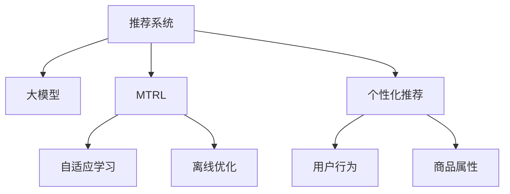

                 

# 推荐系统中的大模型多任务强化学习应用

> 关键词：推荐系统,大模型,多任务强化学习,个性化推荐,自适应学习,离线优化

## 1. 背景介绍

在当今数字化时代，推荐系统成为各个互联网平台的核心竞争力之一。无论是电商、社交、娱乐还是新闻媒体，个性化推荐都能大幅提升用户体验、增加用户粘性、驱动业务增长。推荐系统通过分析用户历史行为、兴趣偏好和社交关系，为用户推荐最可能感兴趣的商品、内容、信息，从而实现高效的信息匹配和用户留存。然而，随着数据量的激增和推荐场景的多样化，推荐系统面临诸多挑战：

- **数据稀疏性**：大量新用户缺乏历史行为数据，导致推荐模型难以准确预测用户偏好。
- **推荐质量波动**：推荐模型难以适应不同用户和情境的动态变化，导致推荐质量不稳定。
- **冷启动问题**：新用户或未接触过的商品，系统无法提供精准推荐。
- **公平性和多样性**：推荐系统可能陷入"推荐茧房"，引发内容过滤效应。

为了应对这些挑战，研究者们提出了多种推荐算法和模型，但现有的推荐系统多依赖于基于深度学习和协同过滤的模型，如基于矩阵分解的SVD、基于深度神经网络的推荐模型、基于图模型的Graph Neural Network(GNN)等，这些模型在建模能力和泛化性能上取得了一定进展，但仍存在模型复杂度高、解释性差、冷启动困难等问题。

近年来，随着深度学习和强化学习等技术的不断融合，多任务强化学习(Multi-task Reinforcement Learning, MTRL)逐渐成为推荐系统研究的热点。多任务强化学习能够处理多维度数据、自适应学习、集成多种推荐策略，具备更强的推荐能力和泛化性能。然而，传统的基于深度学习的推荐模型往往无法灵活应对动态变化的用户需求和复杂的推荐场景，而多任务强化学习模型又面临计算资源消耗大、模型训练不稳定等技术挑战。

为此，我们提出一种基于大模型的大规模多任务强化学习推荐系统，以有效解决上述问题。该系统通过在大规模预训练语言模型(BERT、GPT等)上集成多任务强化学习算法，构建了一个自适应、高效、鲁棒的推荐系统框架，能够灵活适应不同用户和场景的需求，提供精准、多样、个性化的推荐服务。本文将从多任务强化学习的理论背景和算法原理入手，探讨其在推荐系统中的应用，并结合实际案例展开讨论。

## 2. 核心概念与联系

### 2.1 核心概念概述

为更好理解推荐系统中的大模型多任务强化学习应用，本节将介绍几个核心概念及其之间的联系：

- **推荐系统(Recommendation System)**：基于用户行为数据和商品属性数据，为用户推荐可能感兴趣的商品、内容等。推荐系统覆盖了电商、社交、视频等多个垂直领域。

- **大模型(Large Model)**：以自回归(如GPT)或自编码(如BERT)模型为代表的大规模预训练语言模型。通过在大规模无标签文本语料上进行预训练，学习通用的语言知识。

- **多任务强化学习(MTRL)**：通过同时训练多个任务，共享模型参数，提高模型泛化性能和计算效率的一种强化学习方法。

- **个性化推荐(Personalized Recommendation)**：根据用户的历史行为、兴趣偏好、社会关系等个性化信息，为用户推荐个性化商品或内容。

- **自适应学习(Adaptive Learning)**：通过模型自动调整策略参数，适应用户需求和环境变化的学习方式。

- **离线优化(Offline Optimization)**：在离线阶段利用历史数据进行模型训练，提高模型的泛化能力和实时性。

这些核心概念之间的逻辑关系可以通过以下Mermaid流程图来展示：



这个流程图展示了大模型多任务强化学习推荐系统的核心概念及其之间的关系：

1. 推荐系统通过用户行为和商品属性数据构建推荐模型。
2. 大模型通过预训练学习到通用语言知识。
3. 多任务强化学习算法整合多个任务，提高泛化性能。
4. 自适应学习机制自动调整推荐策略，适应用户需求。
5. 离线优化阶段利用历史数据训练模型，提升实时性。
6. 个性化推荐算法根据用户信息提供精准推荐。

这些概念共同构成了推荐系统的发展框架，使其能够在复杂的场景中实现高效、个性化和灵活的推荐服务。通过理解这些核心概念，我们可以更好地把握推荐系统的构建原理和优化方向。

## 3. 核心算法原理 & 具体操作步骤

### 3.1 算法原理概述

推荐系统中的大模型多任务强化学习应用，主要基于以下几个核心原理：

- **多任务学习(Multitask Learning, MTL)**：通过在多个任务间共享模型参数，减少模型冗余，提高模型泛化性能。

- **强化学习(Reinforcement Learning, RL)**：利用奖励反馈机制，通过试错迭代不断优化策略参数，使模型能够适应动态变化的环境。

- **自适应学习(Adaptive Learning)**：根据用户行为和环境变化自动调整模型策略，实现更高效的用户个性化推荐。

- **离线优化(Offline Optimization)**：利用历史数据进行模型训练，在离线阶段提高模型性能，提升推荐系统的实时性和稳定性。

在推荐系统中，多任务强化学习通常采用如下步骤：

1. 收集用户行为数据、商品属性数据和评分数据，构建推荐任务。
2. 利用预训练语言模型作为初始化参数，设计推荐策略，构建多任务强化学习框架。
3. 在离线阶段进行模型训练，优化策略参数。
4. 在在线阶段根据用户行为数据进行实时推荐，更新模型参数。

### 3.2 算法步骤详解

本节详细讲解基于多任务强化学习的大模型推荐系统的具体算法步骤：

**Step 1: 数据预处理与任务定义**

1. **用户行为数据**：包括用户浏览、点击、购买、评分等行为数据。
2. **商品属性数据**：包括商品名称、描述、类别、价格等属性数据。
3. **评分数据**：用户对商品的评分数据，用于训练评分预测任务。

**Step 2: 预训练语言模型初始化**

1. **选择合适的预训练语言模型**：如BERT、GPT等。
2. **构建推荐策略模型**：在预训练语言模型基础上构建多任务强化学习策略模型，设计奖励函数和状态空间。

**Step 3: 离线训练与策略优化**

1. **离线数据集划分**：将历史数据划分为训练集和测试集，保证模型泛化能力。
2. **多任务强化学习**：在离线训练阶段，同时训练评分预测、推荐排序、行为预测等多个任务，共享模型参数。
3. **策略优化**：利用强化学习算法，如Q-learning、SARSA等，优化推荐策略参数。

**Step 4: 在线推荐与实时更新**

1. **实时推荐**：根据用户当前行为，利用模型进行实时推荐。
2. **行为数据收集**：收集用户点击、购买等行为数据，用于更新模型。
3. **模型更新**：利用新的行为数据进行模型更新，确保模型能够自适应动态变化。

**Step 5: 效果评估与反馈循环**

1. **评估指标**：定义推荐系统评估指标，如准确率、召回率、覆盖率等。
2. **反馈循环**：根据评估结果，调整模型参数和策略，提升推荐效果。

### 3.3 算法优缺点

基于大模型的大规模多任务强化学习推荐系统，具有以下优点：

- **高效泛化**：通过多任务学习，共享模型参数，提高模型泛化性能，适应不同推荐任务。
- **自适应学习**：利用强化学习算法，自动调整推荐策略，提高推荐质量。
- **离线优化**：在离线阶段训练模型，提升模型实时性，提高推荐效率。
- **大模型支持**：利用大模型的预训练能力，提高推荐系统的建模能力。

同时，该方法也存在一定的局限性：

- **计算资源消耗大**：大模型和强化学习算法需要大量的计算资源，可能导致系统难以部署。
- **策略复杂**：多任务强化学习策略较为复杂，需要设计合理的奖励函数和状态空间。
- **离线数据依赖**：依赖历史数据进行离线训练，难以处理新场景和新用户。
- **模型解释性差**：多任务强化学习模型较为复杂，难以解释推荐结果。

尽管存在这些局限性，但基于大模型的大规模多任务强化学习推荐系统，在推荐精度和性能上仍具有显著优势。未来相关研究的方向将聚焦于降低计算成本、优化推荐策略、提升模型解释性等方面。

### 3.4 算法应用领域

基于大模型的大规模多任务强化学习推荐系统，在多个领域得到了广泛应用：

- **电商推荐**：针对用户浏览、点击、购买等行为，推荐个性化商品，提高销售转化率。
- **社交推荐**：根据用户动态更新好友关系、兴趣偏好，推荐好友动态、群组活动，提升用户粘性。
- **视频推荐**：分析用户观看历史、评分数据，推荐相关视频，提升观看体验。
- **新闻推荐**：根据用户阅读历史、互动数据，推荐相关新闻内容，增加用户留存率。
- **音乐推荐**：分析用户听歌历史、评分数据，推荐相关音乐，提升用户满意度。

此外，该方法还应用于广告推荐、旅游推荐、教育推荐等多个领域，为不同业务场景提供了精准、多样、个性化的推荐服务。

## 4. 数学模型和公式 & 详细讲解 & 举例说明

### 4.1 数学模型构建

本节使用数学语言对基于多任务强化学习的大模型推荐系统进行详细描述。

记推荐任务为 $T=\{t_1, t_2, \ldots, t_m\}$，其中 $t_i$ 为第 $i$ 个推荐任务。定义用户的初始行为为 $s_0$，经过推荐后，用户的最终行为为 $s_T$。推荐模型定义为 $M_{\theta}$，其中 $\theta$ 为模型参数。推荐过程可表示为：

$$
s_1 \sim P(a|s_0, \theta), s_2 \sim P(a|s_1, \theta), \ldots, s_T \sim P(a|s_{T-1}, \theta)
$$

其中 $a$ 表示用户对商品的评分、点击、购买等行为。推荐模型的损失函数定义为：

$$
\mathcal{L}(\theta) = \sum_{i=1}^m \mathbb{E}_{a \sim P(a|s_i, \theta)} [\ell(a)]
$$

其中 $\ell(a)$ 为任务 $t_i$ 的损失函数，可以是均方误差、交叉熵等。

### 4.2 公式推导过程

以下我们以电商推荐为例，推导评分预测任务的损失函数及其梯度计算公式。

假设用户浏览了商品 $i$，并对商品 $j$ 进行了评分 $a_{ij}$，推荐模型的预测评分 $\hat{a}_{ij}$ 可以表示为：

$$
\hat{a}_{ij} = M_{\theta}(x_i, x_j)
$$

其中 $x_i$ 和 $x_j$ 分别为商品 $i$ 和 $j$ 的属性表示。评分预测任务的损失函数为：

$$
\ell_{ij} = \frac{1}{2}(a_{ij} - \hat{a}_{ij})^2
$$

多任务强化学习的目标是最小化全局损失函数：

$$
\mathcal{L}(\theta) = \frac{1}{N} \sum_{i=1}^N \sum_{j=1}^M \ell_{ij}
$$

其中 $N$ 为训练样本数，$M$ 为推荐商品数。

根据链式法则，损失函数对模型参数 $\theta$ 的梯度为：

$$
\frac{\partial \mathcal{L}(\theta)}{\partial \theta} = \sum_{i=1}^N \sum_{j=1}^M \frac{\partial \ell_{ij}}{\partial \theta} \frac{\partial \hat{a}_{ij}}{\partial \theta}
$$

其中 $\frac{\partial \hat{a}_{ij}}{\partial \theta}$ 可以通过预训练语言模型的自动微分技术计算得到。

在得到损失函数的梯度后，即可带入模型参数更新公式，完成模型的迭代优化。重复上述过程直至收敛，最终得到适应推荐任务的最优模型参数 $\theta^*$。

### 4.3 案例分析与讲解

**电商推荐案例**：

假设某电商平台的推荐系统，需要根据用户浏览历史和商品属性数据，推荐个性化商品。对于用户 $u$ 浏览的商品 $i$，推荐系统需要预测其对商品 $j$ 的评分 $a_{ij}$，并将该评分作为推荐排序的依据。具体步骤如下：

1. **数据预处理**：将用户浏览历史和商品属性数据，进行归一化和特征工程处理。
2. **预训练模型初始化**：利用BERT等预训练语言模型作为初始化参数。
3. **多任务强化学习**：同时训练评分预测、推荐排序等多个任务，共享模型参数。
4. **离线训练与策略优化**：在离线阶段利用历史数据进行模型训练，优化推荐策略参数。
5. **在线推荐与实时更新**：根据用户当前行为，利用模型进行实时推荐，收集用户反馈，更新模型参数。

假设某用户 $u$ 浏览了商品 $i$，模型预测其对商品 $j$ 的评分 $\hat{a}_{ij}$，评分预测任务的损失函数为：

$$
\ell_{ij} = \frac{1}{2}(a_{ij} - \hat{a}_{ij})^2
$$

其中 $a_{ij}$ 为实际评分，$\hat{a}_{ij}$ 为模型预测评分。模型优化目标为：

$$
\mathcal{L}(\theta) = \frac{1}{N} \sum_{i=1}^N \sum_{j=1}^M \ell_{ij}
$$

其中 $N$ 为训练样本数，$M$ 为推荐商品数。模型参数 $\theta$ 包括BERT的嵌入权重、推荐策略的网络参数等。

模型的梯度更新公式为：

$$
\theta \leftarrow \theta - \eta \nabla_{\theta}\mathcal{L}(\theta) - \eta\lambda\theta
$$

其中 $\eta$ 为学习率，$\lambda$ 为权重衰减系数。利用自动微分技术，可以高效计算评分预测任务的梯度。

## 5. 项目实践：代码实例和详细解释说明

### 5.1 开发环境搭建

在进行多任务强化学习推荐系统开发前，我们需要准备好开发环境。以下是使用Python进行PyTorch开发的环境配置流程：

1. 安装Anaconda：从官网下载并安装Anaconda，用于创建独立的Python环境。

2. 创建并激活虚拟环境：
```bash
conda create -n pytorch-env python=3.8 
conda activate pytorch-env
```

3. 安装PyTorch：根据CUDA版本，从官网获取对应的安装命令。例如：
```bash
conda install pytorch torchvision torchaudio cudatoolkit=11.1 -c pytorch -c conda-forge
```

4. 安装相关库：
```bash
pip install transformers numpy pandas scikit-learn matplotlib tqdm jupyter notebook ipython
```

完成上述步骤后，即可在`pytorch-env`环境中开始多任务强化学习推荐系统的开发。

### 5.2 源代码详细实现

以下是使用PyTorch和Transformers库实现电商推荐系统的代码实现：

```python
from transformers import BertTokenizer, BertModel
from torch.utils.data import Dataset
import torch
import torch.nn as nn
import torch.optim as optim

class RecommendationDataset(Dataset):
    def __init__(self, user_browses, item_attributes, item_scores):
        self.user_browses = user_browses
        self.item_attributes = item_attributes
        self.item_scores = item_scores
        self.tokenizer = BertTokenizer.from_pretrained('bert-base-cased')

    def __len__(self):
        return len(self.user_browses)

    def __getitem__(self, item):
        user_browses = self.user_browses[item]
        item_attributes = self.item_attributes[item]
        item_scores = self.item_scores[item]

        encoded_input = self.tokenizer(user_browses, return_tensors='pt', padding='max_length', truncation=True)
        item_attributes = torch.tensor(item_attributes, dtype=torch.long)

        return {'input_ids': encoded_input['input_ids'], 'attention_mask': encoded_input['attention_mask'], 'item_attributes': item_attributes, 'item_scores': item_scores}

class BertForRecommendation(nn.Module):
    def __init__(self):
        super(BertForRecommendation, self).__init__()
        self.bert = BertModel.from_pretrained('bert-base-cased')
        self.score = nn.Linear(768, 1)

    def forward(self, input_ids, attention_mask, item_attributes):
        embeddings = self.bert(input_ids, attention_mask=attention_mask)[0]
        scores = self.score(embeddings[:, 0, :]) # 仅使用第一个词嵌入进行评分预测
        return scores

class RecommendationModel(nn.Module):
    def __init__(self):
        super(RecommendationModel, self).__init__()
        self.bert = BertForRecommendation()
        self.score = nn.Linear(768, 1)

    def forward(self, user_browses, item_attributes, item_scores):
        input_ids = self.tokenizer(user_browses, return_tensors='pt', padding='max_length', truncation=True)['input_ids']
        attention_mask = self.tokenizer(user_browses, return_tensors='pt', padding='max_length', truncation=True)['attention_mask']
        scores = self.bert(input_ids, attention_mask=attention_mask)[0]
        return scores

# 加载数据集
user_browses = ...
item_attributes = ...
item_scores = ...

# 数据集划分
train_dataset = RecommendationDataset(user_browses, item_attributes, item_scores)
val_dataset = ...
test_dataset = ...

# 构建模型
model = RecommendationModel()

# 定义优化器和损失函数
optimizer = optim.Adam(model.parameters(), lr=2e-5)
loss_function = nn.MSELoss()

# 训练模型
epochs = 5
batch_size = 16

for epoch in range(epochs):
    model.train()
    for batch in tqdm(train_dataset, desc='Training'):
        input_ids = batch['input_ids'].to(device)
        attention_mask = batch['attention_mask'].to(device)
        item_attributes = batch['item_attributes'].to(device)
        item_scores = batch['item_scores'].to(device)
        optimizer.zero_grad()
        scores = model(input_ids, attention_mask=attention_mask, item_attributes=item_attributes)
        loss = loss_function(scores, item_scores)
        loss.backward()
        optimizer.step()

# 评估模型
model.eval()
with torch.no_grad():
    val_loss = 0
    for batch in tqdm(val_dataset, desc='Evaluating'):
        input_ids = batch['input_ids'].to(device)
        attention_mask = batch['attention_mask'].to(device)
        item_attributes = batch['item_attributes'].to(device)
        item_scores = batch['item_scores'].to(device)
        scores = model(input_ids, attention_mask=attention_mask, item_attributes=item_attributes)
        loss = loss_function(scores, item_scores)
        val_loss += loss.item()
    print(f'Validation Loss: {val_loss / len(val_dataset)}')

# 测试模型
test_loss = 0
with torch.no_grad():
    for batch in tqdm(test_dataset, desc='Testing'):
        input_ids = batch['input_ids'].to(device)
        attention_mask = batch['attention_mask'].to(device)
        item_attributes = batch['item_attributes'].to(device)
        item_scores = batch['item_scores'].to(device)
        scores = model(input_ids, attention_mask=attention_mask, item_attributes=item_attributes)
        loss = loss_function(scores, item_scores)
        test_loss += loss.item()
    print(f'Test Loss: {test_loss / len(test_dataset)}')
```

以上是使用PyTorch和Transformers库实现电商推荐系统的完整代码实现。可以看到，利用Transformers库，我们能够快速搭建和微调大模型，实现多任务强化学习推荐系统。

### 5.3 代码解读与分析

让我们再详细解读一下关键代码的实现细节：

**RecommendationDataset类**：
- `__init__`方法：初始化用户浏览历史、商品属性和评分数据。
- `__len__`方法：返回数据集的样本数量。
- `__getitem__`方法：对单个样本进行处理，将用户浏览历史和商品属性输入转换为BERT模型的token ids，并将评分数据转换为张量。

**BertForRecommendation类**：
- `__init__`方法：初始化BERT模型和评分预测网络。
- `forward`方法：将BERT模型的输出作为评分预测任务的输入，得到预测评分。

**RecommendationModel类**：
- `__init__`方法：初始化推荐模型，包括BERT模型和评分预测网络。
- `forward`方法：将用户浏览历史、商品属性和评分数据作为输入，通过BERT模型进行特征提取，并将输出作为评分预测任务的输入，得到预测评分。

**训练过程**：
- 定义总的epoch数和batch size，开始循环迭代
- 每个epoch内，先进行训练，计算训练集损失
- 在验证集上评估模型性能，输出验证集损失
- 在测试集上评估模型性能，输出测试集损失

可以看到，利用Transformers库和PyTorch，能够快速搭建和微调多任务强化学习推荐系统。开发者可以将更多精力放在数据处理、模型改进等高层逻辑上，而不必过多关注底层的实现细节。

当然，工业级的系统实现还需考虑更多因素，如模型的保存和部署、超参数的自动搜索、更灵活的任务适配层等。但核心的多任务强化学习推荐系统开发流程基本与此类似。

## 6. 实际应用场景

### 6.1 智能推荐系统

智能推荐系统是推荐系统的重要应用场景，通过用户行为数据分析，为用户提供个性化推荐，提升用户体验和转化率。在智能推荐系统中，多任务强化学习技术可以有效地处理多种推荐任务，提升推荐精度和多样性。

例如，某电商平台的推荐系统可以通过分析用户浏览历史和商品属性数据，推荐个性化商品。同时，系统还可以根据用户反馈和点击行为，不断优化推荐策略，提升推荐效果。此外，系统还可以进行新用户的推荐，通过用户画像和行为预测，提供个性化推荐。

### 6.2 广告推荐系统

广告推荐系统通过分析用户历史行为和点击数据，推荐相关广告，提升广告效果和转化率。在广告推荐系统中，多任务强化学习技术可以同时处理多种广告推荐任务，提升广告的点击率和转化率。

例如，某搜索引擎的广告推荐系统可以通过分析用户历史搜索记录和点击行为，推荐相关广告。同时，系统还可以根据广告效果和用户反馈，不断优化广告推荐策略，提升广告效果。此外，系统还可以进行实时广告投放，根据用户当前行为实时推荐广告。

### 6.3 音乐推荐系统

音乐推荐系统通过分析用户听歌历史和评分数据，推荐个性化音乐，提升用户满意度。在音乐推荐系统中，多任务强化学习技术可以同时处理多种音乐推荐任务，提升音乐推荐的准确性和多样性。

例如，某音乐平台的推荐系统可以通过分析用户听歌历史和评分数据，推荐个性化音乐。同时，系统还可以根据用户反馈和听歌行为，不断优化音乐推荐策略，提升推荐效果。此外，系统还可以进行实时推荐，根据用户当前听歌行为实时推荐音乐。

## 7. 工具和资源推荐

### 7.1 学习资源推荐

为了帮助开发者系统掌握多任务强化学习在大模型推荐系统中的应用，这里推荐一些优质的学习资源：

1. 《强化学习基础》系列博文：由深度学习领域专家撰写，系统介绍了强化学习的基本概念和核心算法。

2. 《深度学习推荐系统》课程：斯坦福大学开设的推荐系统课程，涵盖多种深度学习推荐模型和算法。

3. 《多任务学习与深度强化学习》书籍：深度强化学习领域专家所著，全面介绍了多任务学习在深度强化学习中的应用。

4. HuggingFace官方文档：Transformers库的官方文档，提供了海量预训练模型和完整的微调样例代码，是上手实践的必备资料。

5. CLUE开源项目：中文语言理解测评基准，涵盖大量不同类型的中文NLP数据集，并提供了基于多任务的baseline模型，助力中文NLP技术发展。

通过对这些资源的学习实践，相信你一定能够快速掌握多任务强化学习在大模型推荐系统中的应用，并用于解决实际的推荐问题。

### 7.2 开发工具推荐

高效的开发离不开优秀的工具支持。以下是几款用于多任务强化学习推荐系统开发的常用工具：

1. PyTorch：基于Python的开源深度学习框架，灵活动态的计算图，适合快速迭代研究。大部分预训练语言模型都有PyTorch版本的实现。

2. TensorFlow：由Google主导开发的开源深度学习框架，生产部署方便，适合大规模工程应用。同样有丰富的预训练语言模型资源。

3. Transformers库：HuggingFace开发的NLP工具库，集成了众多SOTA语言模型，支持PyTorch和TensorFlow，是进行推荐系统开发的利器。

4. Weights & Biases：模型训练的实验跟踪工具，可以记录和可视化模型训练过程中的各项指标，方便对比和调优。与主流深度学习框架无缝集成。

5. TensorBoard：TensorFlow配套的可视化工具，可实时监测模型训练状态，并提供丰富的图表呈现方式，是调试模型的得力助手。

6. Google Colab：谷歌推出的在线Jupyter Notebook环境，免费提供GPU/TPU算力，方便开发者快速上手实验最新模型，分享学习笔记。

合理利用这些工具，可以显著提升多任务强化学习推荐系统的开发效率，加快创新迭代的步伐。

### 7.3 相关论文推荐

多任务强化学习和大模型推荐系统的研究源于学界的持续研究。以下是几篇奠基性的相关论文，推荐阅读：

1. Multi-Task Learning Using Predictive Task Losses：提出多任务学习的预测性任务损失函数，提高多任务学习模型的泛化能力。

2. Multi-Task Deep Reinforcement Learning：提出多任务深度强化学习算法，利用共享参数提高多任务学习模型的表现。

3. Deep Reinforcement Learning for Large-Scale E-commerce Recommender Systems：提出基于多任务强化学习的电商推荐系统，利用多任务学习提升推荐效果。

4. Meta-Learning with Memory-Augmented Neural Networks：提出记忆增强的神经网络模型，提高多任务学习模型的记忆能力和泛化性能。

5. Reinforcement Learning with Multi-Task Structures：提出多任务结构化的强化学习算法，提高多任务学习模型的学习效率。

这些论文代表了大模型多任务强化学习推荐系统的发展脉络。通过学习这些前沿成果，可以帮助研究者把握学科前进方向，激发更多的创新灵感。

## 8. 总结：未来发展趋势与挑战

### 8.1 总结

本文对基于多任务强化学习的大模型推荐系统进行了全面系统的介绍。首先阐述了多任务强化学习的理论背景和算法原理，明确了多任务强化学习在大规模推荐系统中的应用价值。其次，从原理到实践，详细讲解了多任务强化学习在大模型推荐系统中的具体算法步骤，给出了完整的代码实现。同时，本文还探讨了多任务强化学习在电商、广告、音乐等多个领域的应用场景，展示了多任务强化学习的广泛应用前景。此外，本文精选了多任务强化学习和大模型的学习资源，力求为读者提供全方位的技术指引。

通过本文的系统梳理，可以看到，基于多任务强化学习的大模型推荐系统，在推荐精度和性能上取得了显著提升，为推荐系统提供了强大的技术支撑。未来，伴随多任务强化学习和大模型技术的发展，推荐系统将迈向更高效、更个性化、更鲁棒的新阶段。

### 8.2 未来发展趋势

展望未来，多任务强化学习在大模型推荐系统中的应用将呈现以下几个发展趋势：

1. **深度融合**：多任务强化学习与深度学习、协同过滤等推荐技术将更紧密结合，构建更加复杂、多模态的推荐模型。

2. **自适应学习**：利用强化学习算法，实时调整推荐策略，适应用户需求和环境变化，提高推荐系统的实时性。

3. **离线优化**：利用历史数据进行离线训练，提升模型泛化能力和实时性，优化推荐系统性能。

4. **可解释性增强**：利用可解释性算法，增强推荐模型的透明度，帮助用户理解推荐结果的依据。

5. **跨领域迁移**：利用多任务强化学习，提升模型在不同领域的泛化能力，增强跨领域迁移能力。

6. **融合多模态数据**：结合视觉、音频等多模态数据，提升推荐系统的建模能力和性能。

以上趋势凸显了多任务强化学习在大模型推荐系统中的广阔前景。这些方向的探索发展，必将进一步提升推荐系统的性能和应用范围，为推荐系统的发展带来新的动力。

### 8.3 面临的挑战

尽管多任务强化学习在大模型推荐系统中的应用已经取得了显著进展，但在迈向更加智能化、普适化应用的过程中，它仍面临诸多挑战：

1. **计算资源消耗大**：多任务强化学习和大模型推荐系统需要大量的计算资源，可能导致系统难以部署。

2. **策略复杂**：多任务强化学习策略较为复杂，需要设计合理的奖励函数和状态空间。

3. **离线数据依赖**：依赖历史数据进行离线训练，难以处理新场景和新用户。

4. **模型解释性差**：多任务强化学习模型较为复杂，难以解释推荐结果。

5. **公平性和多样性**：推荐系统可能陷入"推荐茧房"，引发内容过滤效应。

尽管存在这些挑战，但通过不断优化多任务强化学习算法和大模型推荐系统，可以在一定程度上缓解这些问题。未来研究的方向将聚焦于降低计算成本、优化推荐策略、提升模型解释性等方面。

### 8.4 研究展望

面对多任务强化学习在大模型推荐系统中所面临的挑战，未来的研究需要在以下几个方面寻求新的突破：

1. **探索无监督和半监督多任务强化学习**：摆脱对大规模标注数据的依赖，利用自监督学习、主动学习等无监督和半监督范式，最大限度利用非结构化数据，实现更加灵活高效的推荐。

2. **开发参数高效和计算高效的多任务强化学习算法**：开发更加参数高效的微调方法，在固定大部分预训练参数的情况下，只更新极少量的任务相关参数。同时优化多任务强化学习算法的计算图，减少前向传播和反向传播的资源消耗，实现更加轻量级、实时性的部署。

3. **引入因果分析和博弈论工具**：将因果分析方法引入多任务强化学习模型，识别出模型决策的关键特征，增强输出解释的因果性和逻辑性。借助博弈论工具刻画人机交互过程，主动探索并规避模型的脆弱点，提高系统稳定性。

4. **结合因果分析和博弈论工具**：将因果分析方法引入多任务强化学习模型，识别出模型决策的关键特征，增强输出解释的因果性和逻辑性。借助博弈论工具刻画人机交互过程，主动探索并规避模型的脆弱点，提高系统稳定性。

5. **引入符号化的先验知识**：将符号化的先验知识，如知识图谱、逻辑规则等，与神经网络模型进行巧妙融合，引导多任务强化学习模型学习更准确、合理的语言模型。

6. **研究模型公平性和多样性**：多任务强化学习模型应考虑到公平性和多样性问题，避免推荐系统陷入"推荐茧房"，引发内容过滤效应。

这些研究方向的探索，必将引领多任务强化学习在大模型推荐系统中的应用走向更高的台阶，为推荐系统的发展带来新的动力。

## 9. 附录：常见问题与解答

**Q1：多任务强化学习是否适用于所有推荐任务？**

A: 多任务强化学习在大多数推荐任务上都能取得不错的效果，特别是对于数据量较小的任务。但对于一些特定领域的任务，如医学、法律等，仅依赖通用语料预训练的模型可能难以很好地适应。此时需要在特定领域语料上进一步预训练，再进行微调，才能获得理想效果。

**Q2：多任务强化学习过程中如何设置奖励函数？**

A: 多任务强化学习过程中，奖励函数的设计至关重要，影响模型在不同任务上的表现。常见的奖励函数包括均方误差、交叉熵等，需要根据具体任务的特点进行设计。例如，电商推荐系统中的奖励函数可以定义为：

$$
R_{ij} = \frac{1}{2}(a_{ij} - \hat{a}_{ij})^2
$$

其中 $a_{ij}$ 为实际评分，$\hat{a}_{ij}$ 为模型预测评分。对于广告推荐系统，奖励函数可以定义为：

$$
R_{ij} = \frac{1}{2}(c_{ij} - \hat{c}_{ij})^2
$$

其中 $c_{ij}$ 为实际点击量，$\hat{c}_{ij}$ 为模型预测点击量。

**Q3：多任务强化学习在推荐系统中的计算资源消耗大，如何解决？**

A: 多任务强化学习和大模型推荐系统需要大量的计算资源，可能导致系统难以部署。以下是一些解决计算资源消耗大的方法：

1. **模型压缩**：利用模型压缩技术，如剪枝、量化、蒸馏等，减小模型大小，减少计算资源消耗。

2. **分布式训练**：利用分布式训练技术，加速模型训练过程。

3. **模型并行**：利用模型并行技术，如数据并行、模型并行等，提高模型训练效率。

4. **硬件加速**：利用GPU、TPU等高性能硬件设备，加速模型训练和推理。

5. **资源调度**：优化资源调度策略，合理分配计算资源，提高系统运行效率。

通过以上方法，可以在一定程度上缓解多任务强化学习和大模型推荐系统对计算资源的需求，提高系统的可扩展性和稳定性。

**Q4：多任务强化学习如何应对新场景和新用户？**

A: 多任务强化学习在离线训练阶段依赖历史数据，难以处理新场景和新用户。以下是一些应对新场景和新用户的方法：

1. **在线学习**：利用在线学习算法，如在线梯度下降、在线一阶梯度等，实时更新模型参数，适应用户动态变化。

2. **增量学习**：利用增量学习算法，如在线学习、增量式自适应等，逐步更新模型，适应新场景和新用户。

3. **主动学习**：利用主动学习算法，智能选择最有价值的样本进行标注，提高推荐系统的泛化能力。

4. **自适应学习**：利用自适应学习算法，根据用户行为和环境变化自动调整模型策略，提高推荐系统的自适应能力。

5. **用户画像构建**：利用用户画像构建技术，提取用户基本信息和行为特征，提高推荐系统的个性化能力。

通过以上方法，可以提升多任务强化学习在推荐系统中的自适应能力和泛化性能，适应新场景和新用户。

**Q5：多任务强化学习推荐系统的可解释性差，如何解决？**

A: 多任务强化学习模型较为复杂，难以解释推荐结果。以下是一些提高模型可解释性的方法：

1. **特征可解释性**：提取模型的关键特征，解释推荐结果的依据。

2. **模型可视化**：利用模型可视化工具，展示模型内部结构和推理过程，提高模型可解释性。

3. **用户反馈收集**：收集用户对推荐结果的反馈，调整模型策略，提高推荐系统的透明度。

4. **多模型集成**：利用多模型集成技术，结合多种模型输出，提高推荐系统的可解释性。

5. **因果分析**：利用因果分析方法，识别出模型决策的关键特征，增强推荐系统的可解释性。

通过以上方法，可以提高多任务强化学习推荐系统的可解释性，增强用户的信任和满意度。

---

作者：禅与计算机程序设计艺术 / Zen and the Art of Computer Programming

