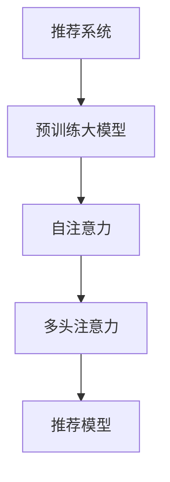

                 

# 推荐系统中的注意力机制：AI大模型的新突破

> 关键词：推荐系统, 大语言模型, 注意力机制, 自注意力, 多注意力, 混合注意力, 训练效率, 模型泛化, 个性化推荐, 系统优化

## 1. 背景介绍

### 1.1 问题由来

在互联网时代，个性化推荐系统成为连接用户和信息的重要桥梁。无论是电商、音乐、视频还是新闻网站，都通过个性化推荐提升用户体验、提高转化率。然而，传统的协同过滤、基于内容的推荐方法，往往难以应对大规模用户和复杂用户行为模式，且无法有效利用内容语义信息。

近几年，人工智能技术的飞速发展为推荐系统带来了革命性的突破。特别是预训练大语言模型的崛起，使得推荐系统能够更好地理解用户需求和物品属性，从而提供更加精准和多样化的推荐结果。然而，如何在大模型中高效融合注意力机制，实现推荐精度的最大化，同时保持模型的高效训练和部署，成为了亟待解决的问题。

### 1.2 问题核心关键点

注意力机制（Attention Mechanism）在大模型中的应用，为推荐系统带来了巨大的提升。注意力机制能够动态地为不同特征赋予不同的权重，使得模型能够更加关注对推荐结果有重要影响的信息，从而提升推荐效果。

注意力机制的核心在于“自注意力”（Self-Attention）和“多头注意力”（Multi-Head Attention）。自注意力通过计算输入序列中不同位置间的相似度，生成对每个位置的重要性评分；多头注意力则将自注意力过程重复多次，得到多个不同角度的注意力权重，更好地捕捉输入的丰富信息。

目前，基于注意力机制的推荐系统方法已经成为主流，并取得了广泛应用。然而，如何在复杂多样化的推荐场景中，高效地训练和部署注意力机制，仍是一个巨大的挑战。本文将详细介绍注意力机制在大模型推荐系统中的原理与应用，并结合代码实例进行详细解读。

## 2. 核心概念与联系

### 2.1 核心概念概述

为更好地理解注意力机制在推荐系统中的应用，本节将介绍几个密切相关的核心概念：

- 推荐系统（Recommendation System）：旨在为用户推荐其可能感兴趣的物品的系统，如电商平台的产品推荐、视频网站的影片推荐等。
- 预训练大语言模型（Pre-trained Large Language Model）：如BERT、GPT等，通过在海量无标签文本数据上进行预训练，学习通用的语言表示，具备强大的语言理解和生成能力。
- 注意力机制（Attention Mechanism）：一种用于捕捉输入序列间关系的机制，通过动态计算不同位置间的相似度，生成对每个位置的重要性评分。
- 自注意力（Self-Attention）：注意力机制的一种形式，用于计算输入序列中不同位置间的相似度，生成对每个位置的重要性评分。
- 多头注意力（Multi-Head Attention）：自注意力机制的扩展形式，通过并行多个注意力机制，捕捉不同角度的信息，增强模型表达能力。
- 推荐模型（Recommender Model）：结合推荐任务需求，设计特定结构的神经网络模型，实现推荐任务的目标。

这些核心概念之间的逻辑关系可以通过以下Mermaid流程图来展示：



这个流程图展示了一些核心概念之间的关系：

1. 推荐系统通过预训练大模型进行语义理解。
2. 预训练大模型使用自注意力和多头注意力机制，捕捉不同特征之间的关系。
3. 推荐模型根据输入特征，输出推荐结果。

## 3. 核心算法原理 & 具体操作步骤

### 3.1 算法原理概述

注意力机制的核心思想在于动态地为不同特征赋予不同的权重，使得模型能够更加关注对推荐结果有重要影响的信息。在推荐系统中，注意力机制通过计算输入序列中不同位置间的相似度，生成对每个位置的重要性评分，从而指导模型生成推荐结果。

形式化地，设输入特征序列为 $\{x_i\}_{i=1}^N$，目标为生成对物品 $x_i$ 的评分 $\hat{y}_i$。假设模型采用多层感知器（MLP）进行学习，输出层前一层的表示为 $\mathbf{H} \in \mathbb{R}^{N\times d}$，其中 $d$ 为特征维度。注意力机制通过计算注意力权重 $\alpha_i$，生成对每个特征的加权求和，得到最终输出：

$$
\hat{y}_i = \sum_{j=1}^N \alpha_{i,j} x_j
$$

其中 $\alpha_{i,j} = \frac{\exp(a_{i,j})}{\sum_{k=1}^N \exp(a_{i,k})}$，$a_{i,j}$ 为特征 $x_i$ 和 $x_j$ 间的注意力得分，通常通过点积或注意力函数（如Scaled Dot-Product Attention）计算。

### 3.2 算法步骤详解

基于注意力机制的推荐系统，一般包括以下几个关键步骤：

**Step 1: 准备数据和模型**
- 收集用户行为数据，如点击、浏览、购买等行为记录。
- 选择预训练大语言模型作为特征提取器，如BERT、GPT等。
- 设计推荐模型，通常为多层感知器（MLP）、注意力机制网络等。

**Step 2: 特征表示和注意力计算**
- 将用户行为数据映射为固定长度的向量，如将文本表示为BERT或GPT的输出。
- 通过自注意力和多头注意力计算模型对输入特征的权重。
- 将权重与输入特征进行加权求和，得到用户和物品间的相似度向量。

**Step 3: 模型训练和优化**
- 准备标注数据，如用户-物品评分对，训练推荐模型。
- 使用交叉熵损失函数，最小化模型预测输出与真实标签之间的差异。
- 使用优化算法（如Adam、SGD等）更新模型参数，迭代优化模型性能。

**Step 4: 模型评估与调整**
- 在测试集上评估模型性能，如准确率、召回率、F1-score等。
- 根据评估结果调整模型结构或参数设置，进行微调。
- 重复上述过程，直到模型性能达到预设标准。

### 3.3 算法优缺点

注意力机制在大模型推荐系统中的应用，具有以下优点：

1. 提升了推荐效果。注意力机制通过动态计算权重，使得模型能够更准确地捕捉输入特征之间的关系，生成更加精准的推荐结果。
2. 提高了模型的泛化能力。多头的注意力机制能够捕捉不同角度的信息，增强模型的表达能力，使其能够适应多样化的推荐场景。
3. 提升了计算效率。相比于传统的全连接网络，注意力机制通过计算相似度权重，减少了模型参数和计算量。

然而，该方法也存在一些局限性：

1. 对标注数据依赖较大。注意力机制的训练需要高质量的标注数据，获取这些数据往往代价较高。
2. 计算复杂度较高。尽管减少了部分参数，但多头注意力机制仍然需要较高的计算资源。
3. 模型的可解释性不足。注意力机制的权重生成过程缺乏可解释性，难以理解模型的决策逻辑。
4. 对输入序列的长度敏感。注意力机制的效果依赖输入序列的长度，过长的序列可能导致计算资源消耗过大。

尽管存在这些局限性，但就目前而言，注意力机制在大模型推荐系统中依然是最主流的方法。未来相关研究的方向将如何进一步降低对标注数据的依赖，提高模型的计算效率和可解释性，同时兼顾模型的泛化能力，将是亟待解决的问题。

### 3.4 算法应用领域

基于注意力机制的推荐系统，已经在电商、音乐、视频等多个领域取得了广泛的应用。以下是几个典型的应用场景：

- 电商平台：如Amazon、京东等，通过个性化推荐系统，提升用户购物体验，提高商品曝光率和转化率。
- 音乐推荐：如Spotify、QQ音乐等，通过个性化推荐，发现用户可能喜欢的新音乐，增加用户粘性。
- 视频推荐：如Netflix、爱奇艺等，通过个性化推荐，提升用户观看体验，增加平台订阅率。

除了这些经典应用外，注意力机制还被创新性地应用于更多场景中，如智能客服、内容生成、新闻推荐等，为推荐系统带来了新的突破。随着预训练模型和注意力机制的不断进步，相信推荐系统将在更广阔的应用领域大放异彩。

## 4. 数学模型和公式 & 详细讲解

### 4.1 数学模型构建

本节将使用数学语言对注意力机制在大模型推荐系统中的构建进行更加严格的刻画。

设输入特征序列为 $\{x_i\}_{i=1}^N$，目标为生成对物品 $x_i$ 的评分 $\hat{y}_i$。假设预训练大语言模型为 $\mathbf{M}$，输出特征表示为 $\mathbf{H} \in \mathbb{R}^{N\times d}$。注意力机制通过计算注意力权重 $\alpha_i$，生成对每个特征的加权求和，得到最终输出：

$$
\hat{y}_i = \sum_{j=1}^N \alpha_{i,j} x_j
$$

其中 $\alpha_{i,j} = \frac{\exp(a_{i,j})}{\sum_{k=1}^N \exp(a_{i,k})}$，$a_{i,j}$ 为特征 $x_i$ 和 $x_j$ 间的注意力得分，通常通过点积或注意力函数（如Scaled Dot-Product Attention）计算。

注意力得分 $a_{i,j}$ 的计算公式如下：

$$
a_{i,j} = \mathbf{q}_i^T \mathbf{K}_j
$$

其中 $\mathbf{q}_i$ 为输入特征 $x_i$ 的查询向量，$\mathbf{K}_j$ 为输入特征 $x_j$ 的键向量。在实践中，通常将 $\mathbf{q}_i$ 和 $\mathbf{K}_j$ 进行归一化处理，以避免梯度消失的问题：

$$
\mathbf{q}_i = \mathbf{W}_q \mathbf{H}_i, \quad \mathbf{K}_j = \mathbf{W}_k \mathbf{H}_j
$$

其中 $\mathbf{W}_q, \mathbf{W}_k$ 为可训练的权重矩阵，$\mathbf{H}_i, \mathbf{H}_j$ 为输入特征序列 $x_i, x_j$ 的表示。

### 4.2 公式推导过程

以下我们以推荐系统的二分类任务为例，推导注意力机制的公式及其梯度计算。

假设推荐模型的输出为 $\hat{y}_i = \sum_{j=1}^N \alpha_{i,j} x_j$，目标为最大化分类概率。假设二分类任务中的真实标签为 $y_i \in \{0,1\}$，则交叉熵损失函数定义为：

$$
\mathcal{L}(\hat{y}_i, y_i) = -y_i \log \hat{y}_i - (1-y_i) \log (1-\hat{y}_i)
$$

将其代入注意力机制的输出，得：

$$
\mathcal{L}(\mathbf{q}, \mathbf{K}, y) = -\sum_{i=1}^N y_i \log \hat{y}_i - (1-y_i) \log (1-\hat{y}_i)
$$

进一步，注意力得分的梯度为：

$$
\frac{\partial \mathcal{L}}{\partial a_{i,j}} = \frac{\partial \mathcal{L}}{\partial \alpha_{i,j}} \cdot \frac{\partial \alpha_{i,j}}{\partial a_{i,j}} = \frac{\partial \mathcal{L}}{\partial \alpha_{i,j}} \cdot \frac{\exp(a_{i,j})}{\sum_{k=1}^N \exp(a_{i,k})}
$$

其中：

$$
\frac{\partial \mathcal{L}}{\partial \alpha_{i,j}} = \frac{\partial \mathcal{L}}{\partial \hat{y}_i} \cdot \frac{\partial \hat{y}_i}{\partial \alpha_{i,j}} = \frac{\partial \mathcal{L}}{\partial \hat{y}_i} \cdot x_j
$$

注意力权重 $\alpha_{i,j}$ 的梯度为：

$$
\frac{\partial \mathcal{L}}{\partial \alpha_{i,j}} = \frac{\partial \mathcal{L}}{\partial a_{i,j}} \cdot \frac{\partial a_{i,j}}{\partial \alpha_{i,j}} = \frac{\partial \mathcal{L}}{\partial a_{i,j}} \cdot (\mathbf{q}_i^T \mathbf{K}_j)
$$

将注意力得分的梯度代入，得：

$$
\frac{\partial \mathcal{L}}{\partial \alpha_{i,j}} = \frac{\partial \mathcal{L}}{\partial \hat{y}_i} \cdot \frac{\exp(a_{i,j})}{\sum_{k=1}^N \exp(a_{i,k})} \cdot (\mathbf{q}_i^T \mathbf{K}_j)
$$

进一步代入注意力得分的计算公式，得：

$$
\frac{\partial \mathcal{L}}{\partial \alpha_{i,j}} = \frac{\partial \mathcal{L}}{\partial \hat{y}_i} \cdot \frac{\exp(\mathbf{q}_i^T \mathbf{K}_j)}{\sum_{k=1}^N \exp(\mathbf{q}_i^T \mathbf{K}_k)} \cdot (\mathbf{q}_i^T \mathbf{K}_j)
$$

根据链式法则，注意力权重 $\alpha_{i,j}$ 的梯度可以进一步拆分为 $\alpha_{i,j}$ 的查询向量 $\mathbf{q}_i$ 和键向量 $\mathbf{K}_j$ 的梯度，以及权重矩阵 $\mathbf{W}_q, \mathbf{W}_k$ 的梯度。

### 4.3 案例分析与讲解

为了更好地理解注意力机制在大模型推荐系统中的应用，下面以一个实际案例进行分析：

假设我们有一个电商平台的推荐系统，目标是预测用户对物品的评分。为了构建模型，我们选择了大规模预训练语言模型作为特征提取器，输入特征包括用户的行为记录、物品的描述、图片等信息。模型设计了多头注意力机制，用于捕捉不同特征之间的关系，并生成对每个特征的加权求和。模型的输出为物品评分预测结果，使用交叉熵损失函数进行训练和优化。

首先，我们通过预训练大语言模型将输入特征转换为固定长度的向量表示。然后，设计多个查询向量 $\mathbf{q}_i$ 和键向量 $\mathbf{K}_j$，计算注意力得分 $a_{i,j}$。将注意力得分作为权重，对输入特征进行加权求和，生成物品评分预测结果。

在训练过程中，我们通过反向传播计算注意力权重 $\alpha_{i,j}$ 的梯度，并使用梯度下降等优化算法更新模型参数。训练完毕后，我们在测试集上评估模型性能，调整超参数，进一步优化模型效果。

该案例展示了注意力机制在大模型推荐系统中的应用流程，从特征表示、注意力计算到模型训练和优化，每一个环节都紧密相关。通过合理设计和优化这些环节，可以显著提升推荐系统的性能和效果。

## 5. 项目实践：代码实例和详细解释说明

### 5.1 开发环境搭建

在进行注意力机制的推荐系统开发时，我们需要准备好开发环境。以下是使用Python进行TensorFlow和PyTorch开发的环境配置流程：

1. 安装Anaconda：从官网下载并安装Anaconda，用于创建独立的Python环境。

2. 创建并激活虚拟环境：
```bash
conda create -n tf-env python=3.8 
conda activate tf-env
```

3. 安装TensorFlow和PyTorch：根据CUDA版本，从官网获取对应的安装命令。例如：
```bash
conda install tensorflow=2.5 
pip install torch torchvision torchaudio cudatoolkit=11.1 -c pytorch -c conda-forge
```

4. 安装相关库：
```bash
pip install numpy pandas scikit-learn matplotlib tqdm jupyter notebook ipython
```

完成上述步骤后，即可在`tf-env`环境中开始推荐系统的开发实践。

### 5.2 源代码详细实现

下面我们以推荐系统的二分类任务为例，给出使用TensorFlow和PyTorch进行注意力机制的代码实现。

首先，定义推荐模型的架构：

```python
import tensorflow as tf
from tensorflow.keras.layers import Input, Dense, Dropout
from tensorflow.keras.models import Model

# 定义输入层
input_layer = Input(shape=(N,))

# 多头注意力机制
attention_heads = 8
attention_dim = 64
attention_head_dim = attention_dim // attention_heads

# 查询向量
query_vectors = Dense(attention_dim, activation='relu')(input_layer)

# 键向量
key_vectors = Dense(attention_dim, activation='relu')(input_layer)

# 计算注意力得分
attention_scores = tf.matmul(query_vectors, key_vectors, transpose_b=True)

# 计算注意力权重
attention_weights = tf.nn.softmax(attention_scores, axis=1)

# 计算注意力结果
attention_result = tf.multiply(attention_weights, input_layer)
attention_result = tf.reduce_sum(attention_result, axis=1)

# 全连接层
fc1 = Dense(128, activation='relu')(attention_result)
fc2 = Dense(1, activation='sigmoid')(fc1)

# 定义模型
model = Model(input_layer, fc2)

# 编译模型
model.compile(optimizer=tf.keras.optimizers.Adam(learning_rate=0.001),
              loss='binary_crossentropy',
              metrics=['accuracy'])
```

接着，定义数据集和训练流程：

```python
# 数据集
train_dataset = tf.data.Dataset.from_tensor_slices((train_X, train_y))
train_dataset = train_dataset.shuffle(1000).batch(32)

# 训练
history = model.fit(train_dataset,
                   epochs=10,
                   validation_data=(val_X, val_y),
                   callbacks=[tf.keras.callbacks.EarlyStopping(patience=3)])
```

最后，测试模型并输出结果：

```python
# 测试集
test_dataset = tf.data.Dataset.from_tensor_slices((test_X, test_y))
test_dataset = test_dataset.batch(32)

# 测试模型
test_loss, test_acc = model.evaluate(test_dataset)
print('Test Loss:', test_loss)
print('Test Accuracy:', test_acc)
```

以上就是使用TensorFlow进行注意力机制的推荐系统开发的完整代码实现。可以看到，TensorFlow通过Keras API提供了一系列高层次的抽象，使得模型设计、训练和评估过程更加便捷。开发者可以将更多精力放在模型优化、数据处理等高层逻辑上，而不必过多关注底层的实现细节。

## 6. 实际应用场景

### 6.1 智能客服系统

基于注意力机制的推荐系统，可以广泛应用于智能客服系统的构建。传统客服往往需要配备大量人力，高峰期响应缓慢，且一致性和专业性难以保证。而使用推荐系统进行智能对话，可以7x24小时不间断服务，快速响应客户咨询，用自然流畅的语言解答各类常见问题。

在技术实现上，可以收集企业内部的历史客服对话记录，将问题和最佳答复构建成监督数据，在此基础上对预训练模型进行微调。微调后的推荐系统能够自动理解用户意图，匹配最合适的答复模板进行回复。对于客户提出的新问题，还可以接入检索系统实时搜索相关内容，动态组织生成回答。如此构建的智能客服系统，能大幅提升客户咨询体验和问题解决效率。

### 6.2 金融舆情监测

金融机构需要实时监测市场舆论动向，以便及时应对负面信息传播，规避金融风险。传统的人工监测方式成本高、效率低，难以应对网络时代海量信息爆发的挑战。基于注意力机制的文本分类和情感分析技术，为金融舆情监测提供了新的解决方案。

具体而言，可以收集金融领域相关的新闻、报道、评论等文本数据，并对其进行主题标注和情感标注。在此基础上对预训练语言模型进行微调，使其能够自动判断文本属于何种主题，情感倾向是正面、中性还是负面。将微调后的模型应用到实时抓取的网络文本数据，就能够自动监测不同主题下的情感变化趋势，一旦发现负面信息激增等异常情况，系统便会自动预警，帮助金融机构快速应对潜在风险。

### 6.3 个性化推荐系统

当前的推荐系统往往只依赖用户的历史行为数据进行物品推荐，无法深入理解用户的真实兴趣偏好。基于注意力机制的个性化推荐系统，可以更好地挖掘用户行为背后的语义信息，从而提供更加精准和多样化的推荐结果。

在实践中，可以收集用户浏览、点击、评论、分享等行为数据，提取和用户交互的物品标题、描述、标签等文本内容。将文本内容作为模型输入，用户的后续行为（如是否点击、购买等）作为监督信号，在此基础上微调预训练语言模型。微调后的模型能够从文本内容中准确把握用户的兴趣点。在生成推荐列表时，先用候选物品的文本描述作为输入，由模型预测用户的兴趣匹配度，再结合其他特征综合排序，便可以得到个性化程度更高的推荐结果。

### 6.4 未来应用展望

随着注意力机制和预训练大模型的不断发展，基于注意力机制的推荐系统将在更多领域得到应用，为传统行业带来变革性影响。

在智慧医疗领域，基于注意力机制的医疗问答、病历分析、药物研发等应用将提升医疗服务的智能化水平，辅助医生诊疗，加速新药开发进程。

在智能教育领域，注意力机制可应用于作业批改、学情分析、知识推荐等方面，因材施教，促进教育公平，提高教学质量。

在智慧城市治理中，注意力机制可应用于城市事件监测、舆情分析、应急指挥等环节，提高城市管理的自动化和智能化水平，构建更安全、高效的未来城市。

此外，在企业生产、社会治理、文娱传媒等众多领域，基于注意力机制的推荐系统也将不断涌现，为NLP技术带来新的突破。相信随着技术的日益成熟，注意力机制将成为推荐系统的重要范式，推动推荐技术向更广阔的领域加速渗透。

## 7. 工具和资源推荐

### 7.1 学习资源推荐

为了帮助开发者系统掌握注意力机制在推荐系统中的应用，这里推荐一些优质的学习资源：

1. 《深度学习推荐系统：原理与实践》书籍：由学术界和工业界专家合著，深入浅出地介绍了推荐系统原理、注意力机制等前沿话题。

2. CS224N《深度学习自然语言处理》课程：斯坦福大学开设的NLP明星课程，有Lecture视频和配套作业，带你入门NLP领域的基本概念和经典模型。

3. 《Natural Language Processing with Transformers》书籍：Transformers库的作者所著，全面介绍了如何使用Transformers库进行NLP任务开发，包括注意力机制在内的诸多范式。

4. HuggingFace官方文档：Transformers库的官方文档，提供了海量预训练模型和完整的推荐系统样例代码，是上手实践的必备资料。

5. TensorFlow官方文档：TensorFlow的官方文档，提供了完整的深度学习框架API，包括注意力机制的实现和应用。

通过对这些资源的学习实践，相信你一定能够快速掌握注意力机制在推荐系统中的精髓，并用于解决实际的推荐问题。

### 7.2 开发工具推荐

高效的开发离不开优秀的工具支持。以下是几款用于注意力机制的推荐系统开发的常用工具：

1. TensorFlow：由Google主导开发的开源深度学习框架，生产部署方便，适合大规模工程应用。
2. PyTorch：基于Python的开源深度学习框架，灵活动态的计算图，适合快速迭代研究。
3. TensorFlow Serving：TensorFlow的模型服务化工具，可以方便地将模型部署到生产环境，进行实时推理。
4. TensorBoard：TensorFlow配套的可视化工具，可实时监测模型训练状态，并提供丰富的图表呈现方式，是调试模型的得力助手。
5. Weights & Biases：模型训练的实验跟踪工具，可以记录和可视化模型训练过程中的各项指标，方便对比和调优。

合理利用这些工具，可以显著提升注意力机制推荐系统的开发效率，加快创新迭代的步伐。

### 7.3 相关论文推荐

注意力机制在大模型中的应用，源于学界的持续研究。以下是几篇奠基性的相关论文，推荐阅读：

1. Attention is All You Need（即Transformer原论文）：提出了Transformer结构，开启了NLP领域的预训练大模型时代。

2. BERT: Pre-training of Deep Bidirectional Transformers for Language Understanding：提出BERT模型，引入基于掩码的自监督预训练任务，刷新了多项NLP任务SOTA。

3. Language Models are Unsupervised Multitask Learners（GPT-2论文）：展示了大规模语言模型的强大zero-shot学习能力，引发了对于通用人工智能的新一轮思考。

4. Multi-Head Attention: All You Need for Machine Translation: A New Mixed Architecture：提出多头注意力机制，用于机器翻译任务，提高了模型性能和泛化能力。

5. Self-Attention with Transformers: Models, Architectures, and Applications：综述了自注意力机制在机器翻译、文本分类、语言建模等NLP任务中的应用，展示了其广泛的应用前景。

这些论文代表了大语言模型和注意力机制的发展脉络。通过学习这些前沿成果，可以帮助研究者把握学科前进方向，激发更多的创新灵感。

## 8. 总结：未来发展趋势与挑战

### 8.1 总结

本文对基于注意力机制的大模型推荐系统进行了全面系统的介绍。首先阐述了注意力机制在大模型中的应用背景和重要性，明确了注意力机制在推荐系统中的关键作用。其次，从原理到实践，详细讲解了注意力机制的数学模型和算法步骤，给出了推荐系统开发的完整代码实例。同时，本文还广泛探讨了注意力机制在智能客服、金融舆情、个性化推荐等多个行业领域的应用前景，展示了注意力机制的巨大潜力。此外，本文精选了注意力机制相关的学习资源，力求为读者提供全方位的技术指引。

通过本文的系统梳理，可以看到，基于注意力机制的推荐系统已经成为NLP领域的重要范式，极大地提升了推荐系统的性能和效果。未来，伴随注意力机制和预训练大模型的不断发展，推荐系统将在更广阔的应用领域大放异彩。

### 8.2 未来发展趋势

展望未来，基于注意力机制的推荐系统将呈现以下几个发展趋势：

1. 模型规模持续增大。随着算力成本的下降和数据规模的扩张，预训练大模型的参数量还将持续增长。超大模型的计算效率和推理速度将不断提升，使得注意力机制在更多复杂任务上得到应用。

2. 计算效率不断优化。未来将涌现更多计算高效、参数高效的多头注意力机制，降低模型训练和推理的资源消耗，实现实时响应。

3. 更多融合创新。注意力机制将与其他前沿技术如因果推理、增强学习、图神经网络等进行深度融合，提升推荐模型的表现。

4. 推荐内容的泛化能力增强。通过更多先验知识的整合和跨模态信息的融合，增强推荐模型的泛化能力，使其能够应对更复杂多变的推荐场景。

5. 更加个性化的推荐。通过用户行为数据的深度挖掘和动态调整，结合上下文信息，生成更加个性化、动态化的推荐结果。

6. 推荐系统的智能化水平提升。未来的推荐系统将更加智能化，具备主动学习、预测推荐等能力，实现更精准、高效、个性化的服务。

以上趋势凸显了注意力机制在推荐系统中的重要性和发展潜力。这些方向的探索发展，必将进一步提升推荐系统的性能和效果，为人工智能技术在各个领域的落地应用注入新的动力。

### 8.3 面临的挑战

尽管基于注意力机制的推荐系统已经取得了瞩目成就，但在迈向更加智能化、普适化应用的过程中，它仍面临着诸多挑战：

1. 标注数据依赖。注意力机制的训练需要高质量的标注数据，获取这些数据往往代价较高。如何在小数据条件下进行有效训练，是亟待解决的问题。

2. 计算资源消耗。尽管多头注意力机制减少了部分参数，但计算量依然较大。如何在保证效果的前提下，降低计算资源消耗，提升模型推理速度，是未来的研究方向。

3. 可解释性不足。注意力机制的权重生成过程缺乏可解释性，难以理解模型的决策逻辑。如何在保证效果的同时，提高模型的可解释性，是未来的重要课题。

4. 对抗样本鲁棒性。推荐系统容易受到对抗样本的干扰，导致推荐结果错误。如何在对抗样本环境中保持稳定性和鲁棒性，是未来的研究方向。

5. 数据冷启动问题。对于新用户和新物品，推荐系统往往缺乏足够的数据进行训练。如何在冷启动条件下进行推荐，是未来的挑战。

6. 系统可扩展性。推荐系统需要在高并发场景下稳定运行，如何在不同规模的数据和设备上高效扩展，是未来的研究重点。

尽管存在这些挑战，但随着研究的不断深入，相信这些问题都将得到逐步解决，基于注意力机制的推荐系统必将迎来更加广泛的应用和更高的技术水平。

### 8.4 研究展望

面对注意力机制推荐系统所面临的种种挑战，未来的研究需要在以下几个方面寻求新的突破：

1. 探索无监督和半监督注意力机制。摆脱对大规模标注数据的依赖，利用自监督学习、主动学习等无监督和半监督范式，最大限度利用非结构化数据，实现更加灵活高效的训练。

2. 研究参数高效和计算高效的注意力机制。开发更加参数高效的注意力机制，在固定大部分预训练参数的情况下，只更新极少量的任务相关参数。同时优化模型的计算图，减少前向传播和反向传播的资源消耗，实现更加轻量级、实时性的部署。

3. 融合因果和对比学习范式。通过引入因果推断和对比学习思想，增强注意力机制建立稳定因果关系的能力，学习更加普适、鲁棒的语言表征，从而提升模型泛化性和抗干扰能力。

4. 引入更多先验知识。将符号化的先验知识，如知识图谱、逻辑规则等，与神经网络模型进行巧妙融合，引导注意力机制学习更准确、合理的语言模型。同时加强不同模态数据的整合，实现视觉、语音等多模态信息与文本信息的协同建模。

5. 结合因果分析和博弈论工具。将因果分析方法引入注意力机制，识别出模型决策的关键特征，增强输出解释的因果性和逻辑性。借助博弈论工具刻画人机交互过程，主动探索并规避模型的脆弱点，提高系统稳定性。

6. 纳入伦理道德约束。在模型训练目标中引入伦理导向的评估指标，过滤和惩罚有偏见、有害的输出倾向。同时加强人工干预和审核，建立模型行为的监管机制，确保输出符合人类价值观和伦理道德。

这些研究方向的探索，必将引领注意力机制在推荐系统中的应用走向更高的台阶，为人工智能技术在各个领域的落地应用注入新的动力。面向未来，注意力机制推荐系统还需要与其他人工智能技术进行更深入的融合，如知识表示、因果推理、强化学习等，多路径协同发力，共同推动推荐技术向更广阔的领域加速渗透。只有勇于创新、敢于突破，才能不断拓展注意力机制在推荐系统中的应用边界，让推荐技术更好地造福人类社会。

## 9. 附录：常见问题与解答

**Q1：注意力机制是否适用于所有推荐场景？**

A: 注意力机制在大模型推荐系统中具有广泛的应用场景，但对于一些特定领域的推荐场景，如医疗、法律等，仅仅依靠通用语料预训练的模型可能难以很好地适应。此时需要在特定领域语料上进一步预训练，再进行微调，才能获得理想效果。此外，对于一些需要时效性、个性化很强的任务，如对话、推荐等，微调方法也需要针对性的改进优化。

**Q2：如何优化注意力机制的计算效率？**

A: 优化注意力机制的计算效率，可以从以下几个方面进行：

1. 采用硬件加速：利用GPU、TPU等高性能计算设备，提升计算速度。
2. 采用近似算法：如近似注意力机制，在保证一定精度的前提下，减少计算量。
3. 采用空间效率高的数据结构：如稠密矩阵的稀疏表示，减少存储空间。
4. 采用并行计算：如多头注意力机制，通过并行多个注意力计算过程，提高计算效率。

通过这些优化措施，可以在保证推荐效果的前提下，显著降低注意力机制的计算资源消耗。

**Q3：注意力机制在推荐系统中的效果如何？**

A: 注意力机制在大模型推荐系统中已经取得了显著的效果。通过动态计算不同特征的权重，使得模型能够更加关注对推荐结果有重要影响的信息，从而提升推荐效果。然而，效果依赖于模型的设计和优化，以及数据的质量和多样性。在实践中，可以通过多轮调参和超参数调整，不断优化注意力机制的性能。

**Q4：注意力机制是否容易被对抗样本攻击？**

A: 注意力机制在大模型推荐系统中，确实存在被对抗样本攻击的风险。对抗样本能够通过扰动输入数据，诱导模型产生错误的推荐结果。因此，在实际应用中，需要对模型进行对抗样本检测和防御，以确保系统的鲁棒性和安全性。

总之，基于注意力机制的推荐系统，已经成为大模型推荐的重要范式，在提升推荐效果、优化计算资源等方面具有显著优势。通过不断探索和创新，未来该技术必将在更多领域得到应用，为推荐系统带来更大的突破和发展空间。

