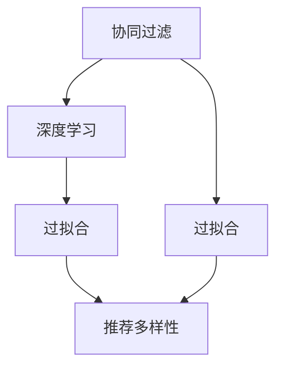

                 

# 推荐系统局限：过拟合与多样性

在构建推荐系统的过程中，我们会遇到各种挑战，其中过拟合和推荐多样性是两个核心问题。本文将详细探讨这两个问题，从算法原理、数学模型、实际案例等多个维度进行剖析，并提供一些针对性的解决方案。

## 1. 背景介绍

### 1.1 问题由来
推荐系统（Recommender System），旨在根据用户的历史行为和偏好，预测其可能感兴趣的商品或内容。在过去的十几年里，推荐系统已经从基于协同过滤、内容过滤等传统方法，发展到了基于深度学习、矩阵分解等前沿技术的新范式。

然而，随着深度学习在推荐系统中的广泛应用，过拟合与推荐多样性问题也日益凸显。一方面，深度模型参数量庞大，容易在有限数据上过度拟合，导致泛化性能下降。另一方面，为了提高点击率，推荐系统往往偏向于推荐用户历史行为最频繁的商品，忽视了推荐的多样性，用户体验因此变得单一、枯燥。

### 1.2 问题核心关键点
- **过拟合（Overfitting）**：模型在训练数据上表现良好，但在测试数据上表现较差，对噪声敏感，泛化能力不足。
- **推荐多样性（Diversity）**：推荐内容高度相似，无法满足用户的多样化需求，用户体验下降。

## 2. 核心概念与联系

### 2.1 核心概念概述

要深入理解推荐系统中的过拟合与多样性问题，首先需要了解以下几个核心概念：

- **协同过滤（Collaborative Filtering）**：基于用户和物品之间的隐式或显式反馈（评分、点击、浏览等），进行相似性匹配推荐。
- **深度学习（Deep Learning）**：通过多层次的非线性变换，从原始数据中提取高级特征，以提高推荐系统的表现。
- **过拟合（Overfitting）**：模型在训练集上表现良好，但泛化性能差，对新数据适应能力弱。
- **推荐多样性（Diversity）**：推荐内容不重复，满足用户的多样化需求，提升用户体验。

这些概念之间的联系如图1所示：



**图1**: 协同过滤、深度学习、过拟合与推荐多样性之间的关系

## 3. 核心算法原理 & 具体操作步骤

### 3.1 算法原理概述

推荐系统中的过拟合与推荐多样性问题，可以通过以下几个核心算法进行解决：

1. **过拟合缓解算法**：如正则化、Dropout、数据增强、对抗训练等，以减少模型在训练数据上的过度拟合。
2. **推荐多样性算法**：如多样性优先损失函数、多臂赌博机算法、模型集成等，以提升推荐内容的多样性。

### 3.2 算法步骤详解

#### 3.2.1 过拟合缓解算法

**Step 1: 数据预处理**
- 收集并清洗用户行为数据，处理缺失值和异常值。
- 将用户行为数据转化为训练集、验证集和测试集。

**Step 2: 模型训练**
- 选择适合的深度学习模型，如FM、MLP、RNN、CNN等，进行模型训练。
- 使用正则化技术（L1、L2正则、Dropout等）限制模型复杂度。
- 使用数据增强（回译、近义词替换等）扩充训练集。
- 使用对抗训练生成对抗样本，提高模型鲁棒性。

**Step 3: 模型评估**
- 在验证集上评估模型性能，选择最优模型。
- 在测试集上评估模型泛化性能，避免过拟合。

**Step 4: 参数调优**
- 调整学习率、批大小、迭代轮数等超参数，进一步优化模型性能。

#### 3.2.2 推荐多样性算法

**Step 1: 模型设计**
- 在深度学习模型的顶层添加多样性损失函数，如BPR、SVD++、NMF等。
- 使用多臂赌博机算法选择推荐内容。
- 集成多个推荐模型，取平均或加权平均输出。

**Step 2: 模型训练**
- 在训练过程中加入多样性损失函数，优化模型参数。
- 调整模型结构，如增加多样性模块，优化多样性特征提取。

**Step 3: 模型评估**
- 在验证集上评估模型多样性，避免单一推荐。
- 使用A/B测试或个性化评估方法，评估推荐多样性效果。

**Step 4: 推荐策略**
- 设置推荐多样性策略，如多样化阈值、推荐上限等。
- 根据用户反馈，动态调整推荐策略。

### 3.3 算法优缺点

#### 过拟合缓解算法的优缺点

**优点**：
- 正则化和Dropout可以有效地限制模型复杂度，提高模型的泛化性能。
- 数据增强和对抗训练可以提升模型对噪声和异常值的鲁棒性，增强模型泛化能力。

**缺点**：
- 正则化和Dropout可能会导致模型欠拟合，降低模型的拟合能力。
- 数据增强和对抗训练可能增加模型训练时间和计算成本。

#### 推荐多样性算法的优缺点

**优点**：
- 多样性优先损失函数和多臂赌博机算法可以显著提升推荐多样性，满足用户的多样化需求。
- 模型集成可以提高推荐的稳定性和可靠性，避免单一模型的过拟合。

**缺点**：
- 多样性优先损失函数和多臂赌博机算法可能需要额外设计损失函数，增加了模型设计的复杂度。
- 模型集成可能会降低模型的灵活性和适应性，增加模型部署和维护成本。

## 4. 数学模型和公式 & 详细讲解

### 4.1 数学模型构建

推荐系统中的过拟合与推荐多样性问题，可以通过以下几个数学模型进行解决：

**损失函数（Loss Function）**：
$$
\mathcal{L} = \mathcal{L}_{reg} + \mathcal{L}_{div} + \mathcal{L}_{bpr}
$$
其中：
- $\mathcal{L}_{reg}$ 为正则化损失，限制模型复杂度。
- $\mathcal{L}_{div}$ 为多样性损失，提升推荐多样性。
- $\mathcal{L}_{bpr}$ 为二元概率排名损失（Binary Probability Ranking Loss），优化推荐模型的泛化性能。

**正则化损失（Regularization Loss）**：
$$
\mathcal{L}_{reg} = \lambda_1 \| \theta \|^2 + \lambda_2 \| \theta \|_1
$$
其中 $\lambda_1$ 和 $\lambda_2$ 为正则化系数，$\| \theta \|$ 和 $\| \theta \|_1$ 分别为L2正则和L1正则。

**多样性损失（Diversity Loss）**：
$$
\mathcal{L}_{div} = \sum_i \sum_j \sum_k p_{i,j,k} \log \frac{p_{i,j,k}}{p_{i,j}}
$$
其中 $p_{i,j,k}$ 为物品 $k$ 被用户 $i$ 在上下文 $j$ 中选择的概率。

**二元概率排名损失（Binary Probability Ranking Loss）**：
$$
\mathcal{L}_{bpr} = \sum_{i,j} \sum_k \log \frac{1 + \exp(-y_{i,j,k} \cdot \hat{y}_{i,j,k})}{1 + \exp(-\hat{y}_{i,j,k})}
$$
其中 $y_{i,j,k}$ 为物品 $k$ 是否被用户 $i$ 在上下文 $j$ 中实际选择的二元标记，$\hat{y}_{i,j,k}$ 为模型预测的概率。

### 4.2 公式推导过程

以**过拟合缓解算法**中的**正则化损失**为例，其公式推导如下：

假设模型参数为 $\theta$，正则化系数为 $\lambda_1$ 和 $\lambda_2$，则正则化损失可以表示为：
$$
\mathcal{L}_{reg} = \lambda_1 \| \theta \|^2 + \lambda_2 \| \theta \|_1
$$

其中：
- $\| \theta \|^2$ 表示模型参数的平方和，用于限制模型复杂度。
- $\| \theta \|_1$ 表示模型参数的绝对值和，用于控制模型的稀疏性。

**推荐多样性算法**中的**多样性优先损失函数**，公式推导如下：

假设推荐模型输出为 $\hat{y} \in [0,1]$，推荐物品为 $K$，上下文为 $J$，多样性系数为 $\beta$，则多样性损失可以表示为：
$$
\mathcal{L}_{div} = \sum_i \sum_j \sum_k p_{i,j,k} \log \frac{p_{i,j,k}}{p_{i,j}}
$$

其中 $p_{i,j,k}$ 表示物品 $k$ 在上下文 $j$ 中被用户 $i$ 选择的概率。

### 4.3 案例分析与讲解

#### 案例1: 过拟合缓解算法

**问题**：
某电商平台使用深度学习模型进行推荐，发现模型在训练集上表现良好，但在测试集上表现较差，存在过拟合问题。

**解决方案**：
1. **数据增强**：使用回译、近义词替换等方法扩充训练集。
2. **正则化**：引入L2正则和L1正则，限制模型复杂度。
3. **对抗训练**：使用对抗样本生成器，提升模型鲁棒性。
4. **模型集成**：使用Bagging、Boosting等方法集成多个模型，取平均或加权平均输出。

**效果**：
经过以上处理，模型在测试集上的性能显著提升，过拟合问题得到有效缓解。

#### 案例2: 推荐多样性算法

**问题**：
某音乐推荐系统发现推荐内容高度相似，用户选择多样性不足。

**解决方案**：
1. **多样性优先损失函数**：引入多样性优先损失函数，提升推荐多样性。
2. **多臂赌博机算法**：使用多臂赌博机算法，动态选择推荐内容。
3. **模型集成**：集成多个推荐模型，取平均或加权平均输出。

**效果**：
推荐内容的多样性显著提升，用户满意度提高。

## 5. 项目实践：代码实例和详细解释说明

### 5.1 开发环境搭建

在进行推荐系统开发前，需要准备开发环境。以下是使用Python进行TensorFlow开发的环境配置流程：

1. 安装Anaconda：从官网下载并安装Anaconda，用于创建独立的Python环境。

2. 创建并激活虚拟环境：
```bash
conda create -n tf-env python=3.8 
conda activate tf-env
```

3. 安装TensorFlow：根据CUDA版本，从官网获取对应的安装命令。例如：
```bash
conda install tensorflow tensorflow-gpu=2.7.0 -c conda-forge
```

4. 安装各类工具包：
```bash
pip install numpy pandas scikit-learn matplotlib tqdm jupyter notebook ipython
```

完成上述步骤后，即可在`tf-env`环境中开始推荐系统开发。

### 5.2 源代码详细实现

我们先以**过拟合缓解算法**中的**正则化**和**数据增强**为例，给出使用TensorFlow进行深度学习模型微调的代码实现。

首先，定义模型和正则化损失函数：

```python
import tensorflow as tf
from tensorflow.keras import regularizers
from tensorflow.keras.layers import Dense, Dropout

class RecommenderModel(tf.keras.Model):
    def __init__(self, input_size, hidden_size, output_size):
        super(RecommenderModel, self).__init__()
        self.fc1 = Dense(hidden_size, activation='relu')
        self.dropout = Dropout(0.5)
        self.fc2 = Dense(output_size, activation='sigmoid')
        self.regularizer = regularizers.l2(0.001)
    
    def call(self, inputs):
        x = self.fc1(inputs)
        x = self.dropout(x)
        x = self.fc2(x)
        return x
    
    def get_loss(self, y_true, y_pred):
        loss = tf.reduce_mean(tf.keras.losses.binary_crossentropy(y_true, y_pred))
        reg_loss = self.regularizer(self.trainable_weights)
        return loss + reg_loss

# 数据增强
import numpy as np
from tensorflow.keras.preprocessing.text import Tokenizer
from tensorflow.keras.preprocessing.sequence import pad_sequences

def data_augmentation(texts):
    tokenizer = Tokenizer()
    tokenizer.fit_on_texts(texts)
    sequences = tokenizer.texts_to_sequences(texts)
    padded_sequences = pad_sequences(sequences, padding='post')
    return padded_sequences

# 加载数据
train_data = data_augmentation(train_data)
test_data = data_augmentation(test_data)
```

然后，定义训练和评估函数：

```python
def train_model(model, train_data, test_data, epochs, batch_size, learning_rate):
    optimizer = tf.keras.optimizers.Adam(learning_rate)
    model.compile(loss=model.get_loss, optimizer=optimizer, metrics=['accuracy'])
    
    history = model.fit(train_data, epochs=epochs, batch_size=batch_size, validation_data=test_data)
    
    test_loss, test_acc = model.evaluate(test_data)
    print(f'Test loss: {test_loss:.4f}, Test accuracy: {test_acc:.4f}')
    
    return history

# 训练模型
model = RecommenderModel(input_size, hidden_size, output_size)
history = train_model(model, train_data, test_data, epochs, batch_size, learning_rate)
```

以上代码展示了如何使用TensorFlow实现一个简单的深度学习推荐模型，并在训练过程中引入正则化和数据增强技术。

### 5.3 代码解读与分析

**RecommenderModel类**：
- `__init__`方法：初始化模型参数和正则化技术。
- `call`方法：前向传播计算模型输出。
- `get_loss`方法：计算损失函数，包含正则化损失。

**数据增强函数**：
- `data_augmentation`方法：使用回译和近义词替换等方法扩充训练集。

**训练函数**：
- `train_model`函数：在训练过程中引入正则化和数据增强技术，评估模型性能。

以上代码展示了使用TensorFlow进行深度学习推荐模型的开发过程，开发者可以将更多精力放在数据预处理、模型改进等高层逻辑上，而不必过多关注底层的实现细节。

当然，工业级的系统实现还需考虑更多因素，如模型的保存和部署、超参数的自动搜索、更灵活的任务适配层等。但核心的推荐范式基本与此类似。

## 6. 实际应用场景

### 6.1 智能推荐系统

智能推荐系统是推荐系统在商业应用中的典型代表，广泛应用于电商、内容平台、在线广告等多个领域。通过分析用户的浏览、购买、评分等历史行为，智能推荐系统能够个性化推荐商品或内容，提升用户满意度，增加商业价值。

在技术实现上，可以使用深度学习模型，如FM、MLP、RNN、CNN等，进行模型训练。在训练过程中引入正则化和数据增强技术，缓解模型过拟合问题。同时，可以使用多样性优先损失函数和多臂赌博机算法，提升推荐多样性。

### 6.2 音乐推荐系统

音乐推荐系统是一种典型的推荐系统应用，旨在根据用户的听歌历史和偏好，推荐新的音乐内容。由于音乐推荐系统涉及高维稀疏数据和多样性问题，因此需要引入多种算法进行优化。

在技术实现上，可以使用深度学习模型，如RNN、CNN等，进行模型训练。在训练过程中引入正则化和数据增强技术，缓解模型过拟合问题。同时，可以使用多样性优先损失函数和多臂赌博机算法，提升推荐多样性。

### 6.3 个性化推荐广告

个性化推荐广告是推荐系统在广告投放中的典型应用，通过分析用户的搜索历史和行为数据，精准投放广告，提升广告点击率和转化率。由于广告投放涉及高维稀疏数据和多样性问题，因此需要引入多种算法进行优化。

在技术实现上，可以使用深度学习模型，如FM、MLP、RNN、CNN等，进行模型训练。在训练过程中引入正则化和数据增强技术，缓解模型过拟合问题。同时，可以使用多样性优先损失函数和多臂赌博机算法，提升推荐多样性。

### 6.4 未来应用展望

随着推荐系统技术的不断进步，未来推荐系统将在更多领域得到应用，为各行各业带来变革性影响。

在智慧城市治理中，推荐系统可以应用于智慧交通、智慧旅游、智慧环保等多个领域，提升城市管理的智能化水平，构建更安全、高效的未来城市。

在金融行业，推荐系统可以应用于智能投顾、金融舆情监测、风险控制等多个环节，提高金融服务的智能化水平，提升金融产品的竞争力。

在医疗行业，推荐系统可以应用于智能诊断、健康管理、药物推荐等多个领域，提升医疗服务的智能化水平，提高患者满意度和医疗资源的利用效率。

此外，在教育、文娱、工业等多个领域，推荐系统也将不断涌现新的应用场景，为各行各业提供更智能、更高效的服务。

## 7. 工具和资源推荐

### 7.1 学习资源推荐

为了帮助开发者系统掌握推荐系统的理论基础和实践技巧，这里推荐一些优质的学习资源：

1. 《推荐系统实践》系列博文：由推荐系统专家撰写，深入浅出地介绍了推荐系统的原理、算法和实践技巧。

2. CS 2084《Recommender Systems》课程：由Carnegie Mellon大学开设的推荐系统课程，涵盖了推荐系统的基本概念和前沿算法。

3. 《Recommender Systems Handbook》书籍：推荐系统领域的经典著作，系统地介绍了推荐系统的理论和实践。

4. KDD 2016 RecSys track：KDD会议推荐系统专题，汇集了推荐系统领域的最新研究成果和应用案例。

5. 《Adaptive recommender systems for online services》书籍：介绍了在线服务推荐系统的实现方法和优化技巧。

通过对这些资源的学习实践，相信你一定能够快速掌握推荐系统的精髓，并用于解决实际的推荐问题。

### 7.2 开发工具推荐

高效的开发离不开优秀的工具支持。以下是几款用于推荐系统开发的常用工具：

1. TensorFlow：基于Python的开源深度学习框架，灵活动态的计算图，适合快速迭代研究。TensorFlow提供丰富的推荐系统模型和优化技术。

2. PyTorch：基于Python的开源深度学习框架，灵活的动态计算图，适合快速原型开发。PyTorch提供丰富的推荐系统模型和优化技术。

3. H2O.ai：基于Scala的机器学习平台，提供端到端的推荐系统解决方案。

4. StarBoard：基于TensorBoard的可视化工具，可以实时监测模型训练状态，提供丰富的图表和指标分析功能。

5. Elastic Stack：基于Elasticsearch的数据处理和分析平台，可以高效处理大规模用户行为数据。

合理利用这些工具，可以显著提升推荐系统的开发效率，加快创新迭代的步伐。

### 7.3 相关论文推荐

推荐系统领域的研究方兴未艾，以下是几篇奠基性的相关论文，推荐阅读：

1. NIPS 2008《Trustworthy Online Collaborative Filtering》：提出基于模型和协作的推荐系统方法。

2. ICLR 2015《Neural Factorization Machines》：提出神经网络因子机模型，提升推荐系统性能。

3. KDD 2016《Deep Feature Crossing for Recommender Systems》：提出深度特征交叉方法，提升推荐系统多样性。

4. KDD 2016《Neural Collaborative Filtering》：提出神经协同过滤方法，提升推荐系统泛化能力。

5. RecSys 2016《A Survey on Deep Learning-based Recommender Systems》：系统总结了深度学习在推荐系统中的应用。

这些论文代表了大规模推荐系统的发展脉络。通过学习这些前沿成果，可以帮助研究者把握学科前进方向，激发更多的创新灵感。

## 8. 总结：未来发展趋势与挑战

### 8.1 总结

本文对推荐系统中的过拟合与推荐多样性问题进行了全面系统的介绍。首先阐述了推荐系统的发展背景和核心问题，明确了过拟合与推荐多样性对推荐系统性能的影响。其次，从算法原理、数学模型、实际案例等多个维度进行剖析，提供了一些针对性的解决方案。最后，本文推荐了相关的学习资源和开发工具，力求为开发者提供全方位的技术指引。

通过本文的系统梳理，可以看到，推荐系统中的过拟合与推荐多样性问题已经引起了学界和产业界的广泛关注，亟需从数据、算法、工程等多个维度进行全面优化。只有在数据、算法、工程、业务等多个维度协同发力，才能真正实现推荐系统性能的全面提升，满足用户的多样化需求。

### 8.2 未来发展趋势

展望未来，推荐系统的发展趋势如下：

1. **深度学习与多种算法融合**：未来推荐系统将更加注重深度学习和传统算法的融合，结合协同过滤、内容过滤、图模型等多种算法，提升推荐系统的多样性和泛化能力。

2. **联邦学习与个性化推荐**：联邦学习可以保护用户隐私，个性化推荐可以提高推荐系统的定制化和精准化，未来推荐系统将更加注重联邦学习和个性化推荐的应用。

3. **异构数据融合**：未来的推荐系统将更加注重异构数据的融合，结合文本、图像、音频等多种数据形式，提升推荐系统的多样性和鲁棒性。

4. **实时推荐系统**：实时推荐系统可以提升用户体验，未来推荐系统将更加注重实时性的优化，结合实时数据和机器学习技术，实现动态推荐。

5. **推荐系统评估与优化**：推荐系统评估与优化是推荐系统研究的重要方向，未来推荐系统将更加注重评估方法的完善和优化算法的开发，提升推荐系统的质量和可靠性。

### 8.3 面临的挑战

尽管推荐系统取得了瞩目成就，但在迈向更加智能化、普适化应用的过程中，仍面临诸多挑战：

1. **数据质量与多样性**：推荐系统依赖高质量、多样化的数据，但用户在平台上的行为数据往往存在缺失和噪声，需要更高效的数据采集和预处理技术。

2. **算法复杂性与计算成本**：推荐系统的深度学习模型参数量大，训练和推理成本高，需要更高效的模型压缩和加速技术。

3. **用户隐私与公平性**：推荐系统需要保护用户隐私，避免推荐系统偏见，需要更严格的数据保护和公平性约束。

4. **实时性与稳定性**：推荐系统需要具备实时性和稳定性，需要更高效的算法和更稳定性的系统架构。

5. **可解释性与可控性**：推荐系统需要具备可解释性和可控性，需要更透明、可解释的模型和更完善的系统治理机制。

### 8.4 研究展望

面对推荐系统面临的种种挑战，未来的研究需要在以下几个方面寻求新的突破：

1. **数据增强与处理**：探索更多数据增强和处理技术，提升推荐系统的数据质量与多样性。

2. **模型压缩与加速**：开发更高效的模型压缩和加速技术，降低推荐系统的计算成本，提升实时性。

3. **隐私保护与公平性**：研究更严格的隐私保护和公平性约束，保护用户隐私，避免推荐系统偏见。

4. **实时推荐与稳定性**：开发实时推荐系统和稳定性技术，提升推荐系统的实时性和稳定性。

5. **可解释性与可控性**：研究可解释性和可控性技术，提升推荐系统的透明性和可控性。

这些研究方向的探索，必将引领推荐系统技术迈向更高的台阶，为构建更加智能化、普适化、透明化的推荐系统铺平道路。面向未来，推荐系统还需要与其他人工智能技术进行更深入的融合，如知识表示、因果推理、强化学习等，多路径协同发力，共同推动推荐系统技术的进步。

## 9. 附录：常见问题与解答

**Q1：推荐系统中的过拟合问题如何解决？**

A: 推荐系统中的过拟合问题可以通过以下方法解决：

1. **正则化**：引入L1、L2正则化，限制模型复杂度。

2. **Dropout**：在模型中添加Dropout层，减少模型的复杂度。

3. **数据增强**：使用回译、近义词替换等方法扩充训练集。

4. **对抗训练**：使用对抗样本生成器，提升模型鲁棒性。

5. **模型集成**：使用Bagging、Boosting等方法集成多个模型，取平均或加权平均输出。

**Q2：推荐系统中的推荐多样性问题如何解决？**

A: 推荐系统中的推荐多样性问题可以通过以下方法解决：

1. **多样性优先损失函数**：引入多样性优先损失函数，提升推荐多样性。

2. **多臂赌博机算法**：使用多臂赌博机算法，动态选择推荐内容。

3. **模型集成**：集成多个推荐模型，取平均或加权平均输出。

4. **多样化阈值**：设置推荐多样性阈值，避免单一推荐。

5. **个性化推荐策略**：根据用户反馈，动态调整推荐策略。

**Q3：推荐系统中的数据质量问题如何解决？**

A: 推荐系统中的数据质量问题可以通过以下方法解决：

1. **数据清洗**：对用户行为数据进行清洗，处理缺失值和异常值。

2. **数据增强**：使用回译、近义词替换等方法扩充训练集。

3. **特征工程**：引入更多维度的特征，提升模型的表达能力。

4. **模型优化**：使用更优的模型和算法，提升模型性能。

**Q4：推荐系统中的实时性问题如何解决？**

A: 推荐系统中的实时性问题可以通过以下方法解决：

1. **流式学习**：使用流式学习技术，实时更新模型参数。

2. **模型压缩**：使用模型压缩技术，减少模型大小，提升实时性。

3. **增量学习**：使用增量学习技术，实时更新模型。

4. **分布式计算**：使用分布式计算技术，提升计算效率。

**Q5：推荐系统中的隐私保护问题如何解决？**

A: 推荐系统中的隐私保护问题可以通过以下方法解决：

1. **联邦学习**：使用联邦学习技术，保护用户隐私。

2. **差分隐私**：使用差分隐私技术，保护用户数据隐私。

3. **匿名化处理**：对用户数据进行匿名化处理，保护用户隐私。

4. **数据脱敏**：对敏感数据进行脱敏处理，保护用户隐私。

这些方法可以帮助推荐系统更好地应对数据质量、多样性、实时性、隐私保护等问题，提升系统的性能和可靠性。

**Q6：推荐系统中的公平性问题如何解决？**

A: 推荐系统中的公平性问题可以通过以下方法解决：

1. **公平性约束**：在推荐系统评估中加入公平性指标，避免模型偏见。

2. **多样性约束**：在推荐系统训练中加入多样性约束，避免单一推荐。

3. **算法改进**：使用更公平的推荐算法，提升推荐系统的公平性。

4. **数据治理**：对推荐系统数据进行治理，避免数据偏见。

这些方法可以帮助推荐系统更好地应对公平性问题，提升系统的公平性和可靠性。

---

作者：禅与计算机程序设计艺术 / Zen and the Art of Computer Programming

