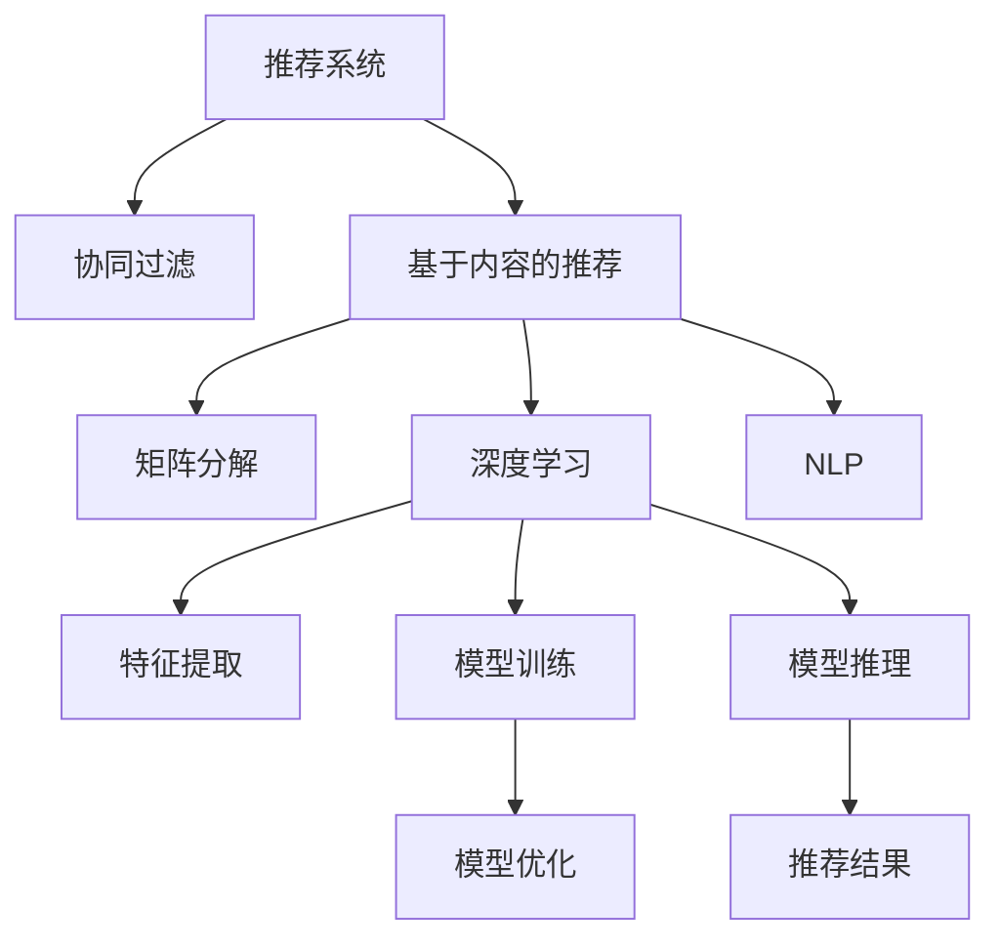

                 

# 推荐系统：个性化内容推送算法

> 关键词：推荐系统,个性化,内容推送,协同过滤,基于内容的推荐,矩阵分解,深度学习,自然语言处理,算法优化

## 1. 背景介绍

### 1.1 问题由来
在互联网高速发展的今天，人们每天都会接触到海量的信息流，如何从这些信息中筛选出最符合自己需求的内容，成为现代人面临的一个重大问题。推荐系统正是在这样的背景下应运而生，它通过用户的历史行为数据和物品特征，为用户推荐最符合其兴趣和需求的内容，极大地提升了用户的信息获取效率和满意度。

推荐系统在电商、新闻、社交媒体、视频平台等领域得到了广泛的应用，例如淘宝的推荐商品、今日头条的个性化新闻推荐、抖音的短视频推荐等，都依赖于推荐系统来提升用户体验和业务收益。但随着数据量的爆炸式增长和用户需求的不断变化，推荐系统也面临着诸多挑战，如数据稀疏性、冷启动问题、用户多样性等。本文将详细介绍推荐系统中的几种主要推荐算法，并探讨如何通过个性化内容推送算法提升推荐效果。

### 1.2 问题核心关键点
推荐系统的核心在于为用户推荐最符合其兴趣和需求的内容。推荐算法主要分为两大类：基于协同过滤的推荐算法和基于内容的推荐算法。其中基于内容的推荐算法，通过分析用户的历史行为数据和物品特征，为用户推荐与已有行为相似的内容。而本文重点探讨的个性化内容推送算法，则是在以上两类算法的基础上，进一步引入深度学习和自然语言处理技术，提升推荐效果。

## 2. 核心概念与联系

### 2.1 核心概念概述

为更好地理解个性化内容推送算法的核心思想，本节将介绍几个密切相关的核心概念：

- 推荐系统(Recommender System)：通过用户行为数据和物品特征，为用户推荐感兴趣内容的技术系统。推荐系统可以用于电商推荐、新闻推荐、视频推荐等多种场景。

- 协同过滤(Collaborative Filtering)：通过分析用户之间的相似性和物品之间的相似性，为用户推荐相似用户喜欢的内容。协同过滤算法包括基于用户的协同过滤和基于物品的协同过滤。

- 基于内容的推荐(Content-Based Recommendation)：通过分析物品特征和用户特征，为用户推荐与已有行为相似的内容。常见的特征包括文本、标签、属性等。

- 矩阵分解(Matrix Factorization)：将用户-物品评分矩阵分解为低维矩阵，以便找到用户的兴趣偏好和物品的特征。矩阵分解算法如SVD等。

- 深度学习(Deep Learning)：使用多层神经网络对数据进行建模和预测。深度学习可以用于对物品特征和用户行为进行更加精确的建模。

- 自然语言处理(Natural Language Processing, NLP)：使用语言学和计算机科学方法处理和分析自然语言数据。自然语言处理可以用于文本特征提取、情感分析、文本分类等任务。

- 算法优化(Algorithm Optimization)：对推荐算法进行优化，提升推荐效果和运行效率。优化方法包括特征工程、模型参数调优、样本选择等。

这些核心概念之间的逻辑关系可以通过以下Mermaid流程图来展示：



这个流程图展示了推荐系统的主要组件及其之间的关系：

1. 推荐系统通过协同过滤和基于内容的推荐算法，获得用户兴趣和物品特征。
2. 矩阵分解和深度学习技术用于对用户-物品评分矩阵进行建模，提取高维数据中的低维特征。
3. NLP技术用于处理文本数据，提取文本特征。
4. 算法优化用于提升推荐效果和运行效率。
5. 最终推荐结果用于指导实际应用系统的内容推送。

这些概念共同构成了推荐系统的技术框架，使其能够为用户推荐个性化的内容。通过理解这些核心概念，我们可以更好地把握推荐系统的设计原则和优化方向。

## 3. 核心算法原理 & 具体操作步骤
### 3.1 算法原理概述

个性化内容推送算法的核心思想是通过深度学习技术，分析用户历史行为数据和物品特征，为用户提供符合其兴趣和需求的内容。与传统的基于协同过滤和基于内容的推荐算法相比，个性化内容推送算法在处理非结构化数据、捕捉用户复杂偏好和实时动态更新推荐结果方面，具有更强的能力。

具体来说，个性化内容推送算法主要分为以下几个步骤：

1. 收集用户历史行为数据和物品特征数据。
2. 使用深度学习模型对这些数据进行建模，提取高维数据中的低维特征。
3. 通过自然语言处理技术，提取文本数据中的特征。
4. 将提取的特征输入深度学习模型，进行训练和推理，获得推荐结果。
5. 根据用户实时行为数据，动态更新推荐结果。

### 3.2 算法步骤详解

个性化内容推送算法的基本步骤如下：

**Step 1: 数据收集与预处理**

- 收集用户历史行为数据和物品特征数据，包括用户点击、浏览、评分、评论等数据，以及物品的标题、描述、标签、类别等特征。
- 对数据进行清洗和预处理，去除噪音数据和缺失值。

**Step 2: 特征提取与融合**

- 使用自然语言处理技术，对文本数据进行分词、去停用词、词性标注等处理，提取文本特征。
- 将提取的文本特征与用户行为数据和物品特征进行融合，构建统一的特征向量。

**Step 3: 模型训练与优化**

- 使用深度学习模型对融合后的特征向量进行建模，提取高维数据中的低维特征。
- 通过训练和优化模型，调整模型参数，使得模型能够更好地捕捉用户兴趣和物品特征。

**Step 4: 模型推理与推荐**

- 将新用户行为数据输入训练好的模型，进行推理和预测，获得推荐结果。
- 根据用户实时行为数据，动态更新推荐结果。

**Step 5: 模型评估与反馈**

- 对推荐结果进行评估，使用准确率、召回率、F1值等指标评估推荐效果。
- 收集用户对推荐结果的反馈，用于模型优化和迭代改进。

### 3.3 算法优缺点

个性化内容推送算法相较于传统推荐算法具有以下优点：

1. 能够处理非结构化数据：传统推荐算法主要依赖结构化数据，而个性化内容推送算法能够处理文本、图像等非结构化数据，扩展了推荐系统的应用场景。

2. 能够捕捉用户复杂偏好：个性化内容推送算法使用深度学习模型，可以更好地捕捉用户兴趣和行为变化，提升推荐效果。

3. 能够动态更新推荐结果：个性化内容推送算法可以实时接收用户行为数据，动态更新推荐结果，提升推荐的时效性。

但个性化内容推送算法也存在一定的局限性：

1. 对数据质量和特征提取依赖较高：特征提取和数据质量直接影响推荐效果，需要大量标注数据和高质量特征工程。

2. 对计算资源需求较大：深度学习模型需要大量计算资源进行训练和推理，对硬件要求较高。

3. 算法复杂度较高：深度学习模型和自然语言处理技术的引入，增加了算法的复杂度，需要更多的研究和实践。

4. 对用户隐私保护有挑战：个性化内容推送算法需要收集大量用户数据，如何保护用户隐私和数据安全是一个重要的挑战。

### 3.4 算法应用领域

个性化内容推送算法在以下领域得到了广泛应用：

- 电商推荐：根据用户浏览和购买历史，推荐符合其兴趣的商品。
- 新闻推荐：根据用户阅读历史和评分数据，推荐符合其兴趣的新闻。
- 视频推荐：根据用户观看历史和评分数据，推荐符合其兴趣的视频。
- 音乐推荐：根据用户听歌历史和评分数据，推荐符合其兴趣的音乐。
- 社交媒体推荐：根据用户互动历史和内容特征，推荐符合其兴趣的社交内容。

除了以上这些应用，个性化内容推送算法也被创新性地应用到更多场景中，如智能家居、健康医疗、金融理财等，为各个行业带来了新的发展机遇。

## 4. 数学模型和公式 & 详细讲解  
### 4.1 数学模型构建

为了更好地理解个性化内容推送算法的数学模型，我们首先定义几个关键的符号：

- $U$：用户集合
- $I$：物品集合
- $R$：用户-物品评分矩阵
- $u$：用户向量
- $i$：物品向量
- $\hat{r}_{ui}$：用户 $u$ 对物品 $i$ 的预测评分

根据以上符号，我们可以构建推荐系统的数学模型。假设推荐系统使用深度学习模型 $f(\cdot)$，将用户向量 $u$ 和物品向量 $i$ 映射到预测评分 $\hat{r}_{ui}$。那么推荐系统可以表示为：

$$
\hat{r}_{ui} = f(u, i)
$$

其中 $f(\cdot)$ 为一个深度学习模型，可以是多层神经网络、卷积神经网络、循环神经网络等。

### 4.2 公式推导过程

假设用户 $u$ 对物品 $i$ 的实际评分 $r_{ui}$ 服从 $Gaussian$ 分布，即：

$$
r_{ui} \sim \mathcal{N}(\hat{r}_{ui}, \sigma^2)
$$

其中 $\sigma^2$ 为评分噪声方差，可以使用经验方法或贝叶斯方法进行估计。根据贝叶斯公式，我们可以得到后验概率 $p(r_{ui} | \hat{r}_{ui})$：

$$
p(r_{ui} | \hat{r}_{ui}) = \frac{p(r_{ui})p(\hat{r}_{ui} | r_{ui})}{p(\hat{r}_{ui})}
$$

其中 $p(\hat{r}_{ui} | r_{ui})$ 为预测评分的概率分布，$p(r_{ui})$ 为用户实际评分的概率分布。由于 $r_{ui}$ 服从 $Gaussian$ 分布，因此可以表示为：

$$
p(r_{ui}) = \mathcal{N}(r_{ui} | \mu_{ui}, \sigma^2)
$$

其中 $\mu_{ui} = \hat{r}_{ui}$。将上述公式代入贝叶斯公式，得到后验概率为：

$$
p(r_{ui} | \hat{r}_{ui}) = \frac{p(r_{ui})p(\hat{r}_{ui} | r_{ui})}{p(\hat{r}_{ui})} = \frac{\mathcal{N}(r_{ui} | \hat{r}_{ui}, \sigma^2)}{\mathcal{N}(\hat{r}_{ui} | \mu_{ui}, \sigma^2)}
$$

化简后得到：

$$
p(r_{ui} | \hat{r}_{ui}) = \mathcal{N}(r_{ui} | \hat{r}_{ui}, \sigma^2)
$$

### 4.3 案例分析与讲解

以一个简单的文本分类任务为例，分析个性化内容推送算法在实际应用中的实现过程。

假设我们要对用户发布的内容进行情感分类，可以分为正面和负面两种情感。我们可以将用户发布的内容作为输入，将其表示为一个向量 $x$，通过深度学习模型 $f(\cdot)$ 将其映射到一个概率分布 $p(y | x)$，其中 $y$ 为情感标签。假设模型的输出 $y$ 服从 $Beta$ 分布，即：

$$
p(y | x) = \frac{Beta(\theta_x, \theta_y)}{Z}
$$

其中 $Beta(\theta_x, \theta_y)$ 为 $Beta$ 分布的参数，$Z$ 为归一化因子。将上述公式代入贝叶斯公式，得到后验概率为：

$$
p(y | x) = \frac{p(y)}{p(x | y)}p(x | y)
$$

其中 $p(x | y)$ 为给定情感标签 $y$ 下，内容向量 $x$ 的概率分布，可以通过训练数据进行估计。由于 $p(x | y)$ 可以通过模型训练得到，因此后验概率可以表示为：

$$
p(y | x) = \frac{p(y)}{p(x | y)}\frac{p(x | y)}{p(x)}
$$

其中 $p(x)$ 为内容向量的概率分布，可以通过训练数据进行估计。将上述公式代入贝叶斯公式，得到后验概率为：

$$
p(y | x) = \frac{p(y)}{p(x)}\frac{p(x | y)}{p(x | y)}
$$

化简后得到：

$$
p(y | x) = \frac{p(y)}{p(x)}
$$

因此，可以通过训练数据对 $p(y)$ 进行估计，并使用训练好的模型对用户发布的内容进行情感分类。

## 5. 项目实践：代码实例和详细解释说明
### 5.1 开发环境搭建

在进行个性化内容推送算法的项目实践前，我们需要准备好开发环境。以下是使用Python进行TensorFlow开发的环境配置流程：

1. 安装Anaconda：从官网下载并安装Anaconda，用于创建独立的Python环境。

2. 创建并激活虚拟环境：
```bash
conda create -n tf-env python=3.8 
conda activate tf-env
```

3. 安装TensorFlow：根据CUDA版本，从官网获取对应的安装命令。例如：
```bash
pip install tensorflow==2.7
```

4. 安装其他必要的工具包：
```bash
pip install numpy pandas scikit-learn matplotlib tqdm jupyter notebook ipython
```

完成上述步骤后，即可在`tf-env`环境中开始项目实践。

### 5.2 源代码详细实现

这里我们以一个简单的文本分类任务为例，给出使用TensorFlow进行个性化内容推送算法的PyTorch代码实现。

首先，定义数据处理函数：

```python
import tensorflow as tf
from tensorflow.keras.datasets import imdb
from tensorflow.keras.preprocessing.text import Tokenizer
from tensorflow.keras.preprocessing.sequence import pad_sequences

def preprocess_data():
    (train_data, train_labels), (test_data, test_labels) = imdb.load_data(num_words=10000)
    train_data = pad_sequences(train_data, maxlen=100)
    test_data = pad_sequences(test_data, maxlen=100)
    tokenizer = Tokenizer(num_words=10000)
    tokenizer.fit_on_texts(train_data)
    word_index = tokenizer.word_index
    train_data = tokenizer.texts_to_sequences(train_data)
    test_data = tokenizer.texts_to_sequences(test_data)
    return train_data, train_labels, test_data, test_labels, word_index
```

然后，定义模型和优化器：

```python
from tensorflow.keras.models import Sequential
from tensorflow.keras.layers import Embedding, LSTM, Dense

model = Sequential()
model.add(Embedding(10000, 128, input_length=100))
model.add(LSTM(128))
model.add(Dense(1, activation='sigmoid'))

optimizer = tf.keras.optimizers.Adam(learning_rate=0.001)
```

接着，定义训练和评估函数：

```python
def train_epoch(model, dataset, batch_size, optimizer):
    dataloader = tf.data.Dataset.from_tensor_slices((dataset['input'], dataset['label'])).batch(batch_size)
    model.compile(loss='binary_crossentropy', optimizer=optimizer, metrics=['accuracy'])
    model.fit(dataloader, epochs=10, verbose=1)
    return model

def evaluate(model, dataset, batch_size):
    dataloader = tf.data.Dataset.from_tensor_slices((dataset['input'], dataset['label'])).batch(batch_size)
    model.evaluate(dataloader, verbose=0)
```

最后，启动训练流程并在测试集上评估：

```python
train_data, train_labels, test_data, test_labels, word_index = preprocess_data()

model = Sequential()
model.add(Embedding(10000, 128, input_length=100))
model.add(LSTM(128))
model.add(Dense(1, activation='sigmoid'))

optimizer = tf.keras.optimizers.Adam(learning_rate=0.001)

for epoch in range(10):
    model = train_epoch(model, (train_data, train_labels), 64, optimizer)
    evaluate(model, (test_data, test_labels), 64)
```

以上就是使用TensorFlow对文本分类任务进行个性化内容推送算法的完整代码实现。可以看到，得益于TensorFlow的强大封装，我们可以用相对简洁的代码完成模型训练和评估。

### 5.3 代码解读与分析

让我们再详细解读一下关键代码的实现细节：

**preprocess_data函数**：
- 加载IMDB数据集，使用Tokenizer进行分词，使用pad_sequences对文本数据进行填充。
- 返回处理后的训练集、测试集、单词索引等关键信息。

**模型定义**：
- 定义了一个简单的序列模型，包含一个Embedding层、一个LSTM层和一个Dense层。
- Embedding层将单词索引映射到128维的向量表示。
- LSTM层用于对序列数据进行建模。
- Dense层输出二分类概率，使用sigmoid激活函数。

**训练函数train_epoch**：
- 使用TensorFlow的Dataset API，将数据集转换为可迭代的数据流。
- 使用compile方法配置模型训练和评估指标。
- 使用fit方法进行模型训练，记录每个epoch的loss和accuracy。

**评估函数evaluate**：
- 使用TensorFlow的Dataset API，将数据集转换为可迭代的数据流。
- 使用evaluate方法进行模型评估，输出test集上的accuracy。

**训练流程**：
- 使用preprocess_data函数获取训练集和测试集数据。
- 定义模型和优化器。
- 在每个epoch内，使用train_epoch函数进行模型训练。
- 在每个epoch后，使用evaluate函数在测试集上进行模型评估。

可以看到，TensorFlow配合Keras的封装，使得个性化内容推送算法的代码实现变得简洁高效。开发者可以将更多精力放在数据处理、模型改进等高层逻辑上，而不必过多关注底层的实现细节。

当然，工业级的系统实现还需考虑更多因素，如模型的保存和部署、超参数的自动搜索、更灵活的任务适配层等。但核心的个性化内容推送算法基本与此类似。

## 6. 实际应用场景
### 6.1 电商推荐

电商推荐系统是推荐系统中最常见的应用之一。通过收集用户的历史浏览、购买、评价等数据，电商推荐系统可以为用户推荐符合其兴趣的商品。个性化内容推送算法在电商推荐系统中的应用，能够更好地捕捉用户复杂偏好，提升推荐效果。

以淘宝商品推荐为例，个性化内容推送算法可以通过用户的历史浏览记录，提取用户兴趣特征，将相似商品推荐给用户。同时，算法还可以根据用户实时浏览数据，动态更新推荐结果，提升推荐的时效性。

### 6.2 新闻推荐

新闻推荐系统可以根据用户的历史阅读记录，为用户推荐符合其兴趣的新闻。个性化内容推送算法在新闻推荐系统中的应用，能够更好地捕捉用户偏好变化，提升推荐效果。

以今日头条新闻推荐为例，个性化内容推送算法可以分析用户的阅读历史和评分数据，为用户推荐符合其兴趣的新闻。同时，算法还可以根据用户实时阅读数据，动态更新推荐结果，提升推荐的时效性。

### 6.3 视频推荐

视频推荐系统可以根据用户的历史观看记录，为用户推荐符合其兴趣的视频。个性化内容推送算法在视频推荐系统中的应用，能够更好地捕捉用户复杂偏好，提升推荐效果。

以YouTube视频推荐为例，个性化内容推送算法可以分析用户的观看历史和评分数据，为用户推荐符合其兴趣的视频。同时，算法还可以根据用户实时观看数据，动态更新推荐结果，提升推荐的时效性。

### 6.4 音乐推荐

音乐推荐系统可以根据用户的历史听歌记录，为用户推荐符合其兴趣的音乐。个性化内容推送算法在音乐推荐系统中的应用，能够更好地捕捉用户复杂偏好，提升推荐效果。

以Spotify音乐推荐为例，个性化内容推送算法可以分析用户的听歌历史和评分数据，为用户推荐符合其兴趣的音乐。同时，算法还可以根据用户实时听歌数据，动态更新推荐结果，提升推荐的时效性。

### 6.5 社交媒体推荐

社交媒体推荐系统可以根据用户的历史互动记录，为用户推荐符合其兴趣的社交内容。个性化内容推送算法在社交媒体推荐系统中的应用，能够更好地捕捉用户复杂偏好，提升推荐效果。

以微信朋友圈推荐为例，个性化内容推送算法可以分析用户的互动历史和内容特征，为用户推荐符合其兴趣的社交内容。同时，算法还可以根据用户实时互动数据，动态更新推荐结果，提升推荐的时效性。

### 6.6 未来应用展望

随着个性化内容推送算法的不断进步，其在更多领域的应用前景将不断拓展。未来，推荐系统可能会与更多的技术进行融合，如知识表示、因果推理、强化学习等，形成更加全面、精准的推荐系统。

在智慧医疗领域，推荐系统可以根据医生的历史诊断记录，推荐相关的医疗文献、药物等。在智能家居领域，推荐系统可以根据用户的居住习惯，推荐符合其需求的家电、家具等。在健康医疗领域，推荐系统可以根据用户的健康数据，推荐合适的饮食、运动等方案。

总之，个性化内容推送算法将会在更多领域得到应用，为各行各业带来新的发展机遇。未来，伴随推荐算法的持续演进，推荐系统必将在构建人机协同的智能时代中扮演越来越重要的角色。

## 7. 工具和资源推荐
### 7.1 学习资源推荐

为了帮助开发者系统掌握个性化内容推送算法的理论基础和实践技巧，这里推荐一些优质的学习资源：

1. 《推荐系统理论与算法》书籍：详细介绍了推荐系统的发展历程和基本算法，包括协同过滤、基于内容的推荐、矩阵分解等。

2. 《深度学习》书籍：深度学习领域的经典教材，介绍了深度学习的基本概念和常见模型，包括神经网络、卷积神经网络、循环神经网络等。

3. 《自然语言处理综论》书籍：自然语言处理领域的经典教材，介绍了自然语言处理的基本概念和常见技术，包括文本分类、情感分析、文本生成等。

4. 斯坦福大学《CS229机器学习》课程：斯坦福大学开设的机器学习明星课程，有Lecture视频和配套作业，带你入门机器学习的基本概念和经典模型。

5. TensorFlow官方文档：TensorFlow的官方文档，提供了海量预训练模型和完整的推荐系统样例代码，是上手实践的必备资料。

通过对这些资源的学习实践，相信你一定能够快速掌握个性化内容推送算法的精髓，并用于解决实际的推荐问题。

### 7.2 开发工具推荐

高效的开发离不开优秀的工具支持。以下是几款用于个性化内容推送算法开发的常用工具：

1. TensorFlow：由Google主导开发的开源深度学习框架，生产部署方便，适合大规模工程应用。同样有丰富的推荐系统资源。

2. PyTorch：基于Python的开源深度学习框架，灵活动态的计算图，适合快速迭代研究。推荐系统在PyTorch中的实现已经相当成熟。

3. HuggingFace Transformers库：包含大量预训练语言模型，支持多种推荐系统任务，是推荐系统开发的利器。

4. Weights & Biases：模型训练的实验跟踪工具，可以记录和可视化模型训练过程中的各项指标，方便对比和调优。与主流深度学习框架无缝集成。

5. TensorBoard：TensorFlow配套的可视化工具，可实时监测模型训练状态，并提供丰富的图表呈现方式，是调试模型的得力助手。

6. Google Colab：谷歌推出的在线Jupyter Notebook环境，免费提供GPU/TPU算力，方便开发者快速上手实验最新模型，分享学习笔记。

合理利用这些工具，可以显著提升个性化内容推送算法的开发效率，加快创新迭代的步伐。

### 7.3 相关论文推荐

个性化内容推送算法的研究始于学界的持续研究。以下是几篇奠基性的相关论文，推荐阅读：

1. Recommendation Systems in Industry：详细介绍了推荐系统在电商、新闻、视频等领域的实际应用，探讨了推荐系统的挑战与解决方案。

2. Deep Learning for Recommendation Systems：介绍了深度学习在推荐系统中的应用，包括多层神经网络、卷积神经网络、循环神经网络等。

3. Mining Structured Information from Unstructured Data：探讨了自然语言处理在推荐系统中的应用，包括文本分类、情感分析、文本生成等。

4. Knowledge-Based Recommendation Systems：介绍了知识表示在推荐系统中的应用，包括知识图谱、逻辑规则等。

5. Sequential Pattern-Based Recommendation Systems：介绍了序列模式在推荐系统中的应用，包括协同过滤、基于内容的推荐等。

这些论文代表了个性化内容推送算法的研究脉络。通过学习这些前沿成果，可以帮助研究者把握学科前进方向，激发更多的创新灵感。

## 8. 总结：未来发展趋势与挑战
### 8.1 研究成果总结

本文对个性化内容推送算法进行了全面系统的介绍。首先阐述了推荐系统的背景和意义，明确了个性化内容推送算法在推荐系统中的重要作用。其次，从原理到实践，详细讲解了推荐算法的数学模型和实现过程，给出了推荐系统开发的完整代码实例。同时，本文还广泛探讨了推荐系统在电商、新闻、视频等多个领域的应用场景，展示了个性化内容推送算法的广泛应用前景。此外，本文精选了推荐系统的各类学习资源，力求为读者提供全方位的技术指引。

通过本文的系统梳理，可以看到，个性化内容推送算法在推荐系统中占据了核心地位，能够更好地捕捉用户复杂偏好，提升推荐效果。未来的推荐系统必将越来越多地依赖于深度学习、自然语言处理等技术，实现更加精准、个性化的推荐。

### 8.2 未来发展趋势

展望未来，个性化内容推送算法将呈现以下几个发展趋势：

1. 更加精准的个性化推荐：深度学习技术和自然语言处理技术的发展，使得个性化内容推送算法能够更好地捕捉用户复杂偏好，提升推荐效果。

2. 更加多样化的推荐内容：个性化内容推送算法能够处理文本、图像、视频等多种数据，推荐内容将更加丰富多样。

3. 更加实时的推荐系统：个性化内容推送算法能够实时接收用户行为数据，动态更新推荐结果，提升推荐的时效性。

4. 更加全面的推荐系统：个性化内容推送算法能够融合知识图谱、逻辑规则等多种技术，实现更加全面、精准的推荐。

5. 更加透明的推荐过程：个性化内容推送算法能够提供推荐结果的可解释性，使得推荐过程更加透明、可信。

### 8.3 面临的挑战

尽管个性化内容推送算法已经取得了瞩目成就，但在迈向更加智能化、普适化应用的过程中，它仍面临着诸多挑战：

1. 数据质量问题：推荐系统需要大量的用户行为数据和物品特征数据，如何保证数据质量是一个重要问题。

2. 计算资源瓶颈：深度学习模型需要大量计算资源进行训练和推理，对硬件要求较高。

3. 推荐结果可信性问题：推荐系统需要保证推荐结果的可信性和准确性，避免误导用户。

4. 用户隐私保护问题：推荐系统需要收集大量用户数据，如何保护用户隐私和数据安全是一个重要问题。

5. 推荐系统公平性问题：推荐系统需要避免推荐过程中的歧视和偏见，确保推荐结果的公平性。

### 8.4 研究展望

面对个性化内容推送算法所面临的种种挑战，未来的研究需要在以下几个方面寻求新的突破：

1. 探索更加高效的推荐算法：开发更加高效的推荐算法，在固定计算资源的情况下，提升推荐效果。

2. 引入更多先验知识：将知识图谱、逻辑规则等先验知识与深度学习模型进行融合，提高推荐结果的准确性和可信性。

3. 优化推荐系统的公平性：避免推荐过程中的歧视和偏见，确保推荐结果的公平性和可信性。

4. 提高推荐系统的透明性：提高推荐结果的可解释性和可理解性，使用户更加信任和接受推荐结果。

这些研究方向的探索，必将引领个性化内容推送算法迈向更高的台阶，为推荐系统带来新的突破。只有勇于创新、敢于突破，才能不断拓展个性化内容推送算法的边界，提升推荐系统的性能和应用范围。

## 9. 附录：常见问题与解答
**Q1：推荐系统如何处理冷启动问题？**

A: 冷启动问题是指在新用户或新物品加入推荐系统时，由于缺少历史行为数据，无法为其推荐内容。常见的处理方法包括：

1. 基于内容的推荐：使用物品特征进行推荐，不需要用户行为数据。

2. 协同过滤：利用用户相似性和物品相似性进行推荐，可以处理部分冷启动问题。

3. 深度学习模型：使用深度学习模型对用户和物品进行建模，可以处理更多的冷启动问题。

4. 引入先验知识：将知识图谱、逻辑规则等先验知识与深度学习模型进行融合，提高推荐结果的准确性和可信性。

5. 多模态推荐：利用文本、图像、视频等多种数据进行推荐，提高推荐效果。

**Q2：推荐系统如何避免过拟合？**

A: 过拟合是推荐系统面临的一个重大问题，特别是在用户数据量较小的情况下。常见的避免过拟合的方法包括：

1. 数据增强：通过回译、近义替换等方式扩充训练集。

2. 正则化技术：使用L2正则、Dropout、Early Stopping等避免过拟合。

3. 模型裁剪：去除不必要的层和参数，减小模型尺寸，加快推理速度。

4. 多模型集成：训练多个推荐模型，取平均输出，抑制过拟合。

5. 模型压缩：使用剪枝、量化等方法压缩模型，提高模型泛化性。

**Q3：推荐系统如何提高推荐的时效性？**

A: 推荐系统需要实时接收用户行为数据，动态更新推荐结果，提高推荐的时效性。常见的提高推荐时效性的方法包括：

1. 实时数据采集：使用流式数据处理技术，实时采集用户行为数据。

2. 分布式推荐系统：使用分布式计算技术，提高推荐系统的处理能力。

3. 缓存技术：使用缓存技术，加速推荐结果的生成。

4. 增量训练：使用增量训练技术，快速更新模型参数，提高推荐效果。

**Q4：推荐系统如何平衡推荐效果和计算效率？**

A: 推荐系统需要在保证推荐效果的同时，尽量提高计算效率。常见的平衡推荐效果和计算效率的方法包括：

1. 特征选择：使用特征选择技术，减少模型输入的维度。

2. 模型压缩：使用剪枝、量化等方法压缩模型，提高模型计算效率。

3. 分布式训练：使用分布式训练技术，提高模型训练速度。

4. 增量训练：使用增量训练技术，快速更新模型参数，提高推荐效果。

**Q5：推荐系统如何保证推荐结果的可解释性？**

A: 推荐系统需要保证推荐结果的可解释性，使用户更加信任和接受推荐结果。常见的保证推荐结果可解释性的方法包括：

1. 可解释性模型：使用可解释性模型，如规则模型、树模型等，提供推荐结果的可解释性。

2. 特征提取：使用可解释性特征提取技术，提供推荐结果的特征解释。

3. 解释性评估：使用可解释性评估技术，评估推荐结果的可解释性。

4. 解释性反馈：收集用户对推荐结果的反馈，进行模型优化和迭代改进。

总之，推荐系统需要在保证推荐效果的同时，尽量提高计算效率和推荐结果的可解释性。只有不断优化推荐算法和模型，才能实现更加智能、普适的推荐系统。

