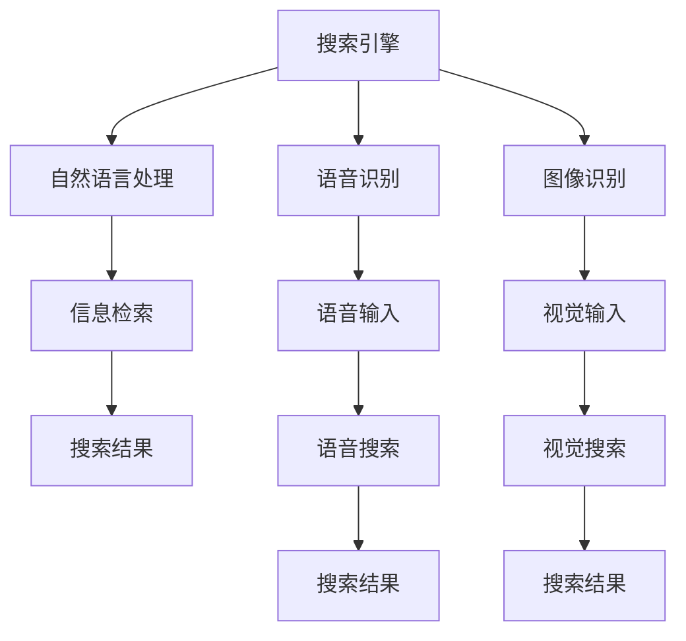

                 

# 搜索引擎与脑机接口的未来整合

## 1. 背景介绍

在信息时代，搜索引擎（Search Engine）和脑机接口（Brain-Computer Interface, BCIs）作为两个重要的技术，正在深刻改变人类的信息获取和交互方式。搜索引擎通过爬取互联网上的海量信息，为用户提供精准的搜索结果；脑机接口则通过解读大脑信号，实现人与机器的直接交互。如今，两者正在朝着融合的方向发展，形成了搜索引擎与脑机接口的未来整合这一热门话题。

### 1.1 问题由来

搜索引擎的瓶颈在于信息检索的准确性和速度，其依赖于强大的算法和索引技术。传统的搜索方式需要通过关键词查询，但难以捕捉到用户复杂的语义需求。而脑机接口则具有高度的个性化和实时性，通过解读大脑信号，可以捕捉到用户的精确需求。将两者结合，可以大幅提升搜索的精确度和效率，带来全新的交互体验。

当前，脑机接口和搜索引擎的融合，已经从科研实验室的探索走向实际应用。例如，一些搜索应用已经开始采用脑机接口技术，实现语音搜索、脑控搜索等功能。这不仅提升了搜索的个性化和便捷性，还对未来的信息获取方式提出了新的要求。

## 2. 核心概念与联系

### 2.1 核心概念概述

为更好地理解搜索引擎与脑机接口的未来整合，本节将介绍几个密切相关的核心概念：

- 搜索引擎（Search Engine）：通过爬取和索引互联网上的信息，为用户提供精准的搜索结果。经典的搜索引擎包括Google、Bing等。
- 脑机接口（Brain-Computer Interface, BCI）：通过解读大脑信号，实现人与机器的直接交互。常见的BCI包括ECoG、EEG等技术。
- 自然语言处理（Natural Language Processing, NLP）：使计算机能够理解、分析、生成人类语言的技术。NLP在搜索引擎中用于语义分析和信息检索。
- 语音识别（Speech Recognition）：使计算机能够识别和转录人类语音的技术。语音识别技术在脑机接口中用于语音输入。
- 图像识别（Image Recognition）：使计算机能够识别和分类图像的技术。图像识别技术在脑机接口中用于视觉输入。

这些核心概念之间的逻辑关系可以通过以下Mermaid流程图来展示：



这个流程图展示了几大核心概念之间的逻辑关系：

1. 搜索引擎通过自然语言处理、语音识别、图像识别等技术，实现信息检索和结果展示。
2. 脑机接口通过解读大脑信号，实现语音输入和视觉输入。
3. 语音搜索和视觉搜索是脑机接口在搜索引擎中的具体应用，提升了搜索的个性化和便捷性。
4. 搜索引擎与脑机接口的整合，可以提升信息检索的精度和效率，带来全新的交互体验。

## 3. 核心算法原理 & 具体操作步骤
### 3.1 算法原理概述

搜索引擎与脑机接口的未来整合，本质上是一种高级的搜索优化算法。其核心思想是：通过解读用户的大脑信号，捕捉其精确的搜索意图，进而优化搜索引擎的检索结果，提升搜索的准确性和效率。

具体而言，用户在脑机接口的帮助下，通过想象或思维活动触发搜索操作。这些思维活动通过EEG等设备采集，经过预处理和特征提取后，输入到神经网络模型中进行解码。模型将用户思维转化为文本查询语句，再输入搜索引擎进行检索。搜索引擎根据优化算法，对搜索结果进行排序和展示，最终呈现给用户。

这种整合算法的过程包括：

1. 脑机接口采集用户思维信号。
2. 特征提取与预处理。
3. 文本生成与搜索优化。
4. 结果展示与反馈调整。

### 3.2 算法步骤详解

基于搜索引擎与脑机接口的未来整合，我们将其算法步骤分为以下几大环节：

**Step 1: 脑机接口信号采集与预处理**
- 使用EEG或ECoG等设备采集用户的大脑信号。
- 对采集到的信号进行滤波、归一化等预处理操作。
- 通过特征提取技术，将信号转化为可供机器学习的特征向量。

**Step 2: 神经网络解码与文本生成**
- 使用深度学习模型（如LSTM、GRU、Transformers等）对提取的特征进行解码。
- 模型输出文本查询语句，通过自然语言处理技术进行纠错和优化。

**Step 3: 搜索引擎信息检索与结果排序**
- 将生成的文本查询语句输入搜索引擎进行检索。
- 搜索引擎返回搜索结果，进行初步排序。
- 使用优化算法（如PageRank、BM25等）对结果进行二次排序，提升搜索相关性和顺序。

**Step 4: 结果展示与反馈调整**
- 展示搜索结果给用户，供用户选择。
- 根据用户的选择和反馈，调整模型的解码参数和搜索算法。
- 不断迭代优化，提升搜索效率和准确性。

### 3.3 算法优缺点

基于搜索引擎与脑机接口的未来整合算法具有以下优点：
1. 高精度。通过解读用户思维，可以捕捉到其精确的搜索需求。
2. 个性化。根据用户历史搜索记录和思维模式，定制个性化的搜索方案。
3. 实时性。脑机接口可以实时捕捉用户思维，进行即时的搜索操作。
4. 高效性。通过优化算法，大幅提升搜索引擎的检索效率和相关性。

同时，该算法也存在一定的局限性：
1. 技术难度高。脑机接口技术的复杂性，对信号采集和解码提出了较高要求。
2. 数据稀缺。高质量、大规模的脑机接口数据资源较少，限制了算法的训练和优化。
3. 用户接受度低。脑机接口的直接思维输入方式，对用户习惯和接受度有较高要求。
4. 隐私问题。用户思维数据的采集和使用，涉及隐私和伦理问题。

尽管存在这些局限性，但就目前而言，基于搜索引擎与脑机接口的整合算法仍具有巨大的应用潜力，值得深入研究和发展。

### 3.4 算法应用领域

基于搜索引擎与脑机接口的未来整合算法，已经在多个领域得到了应用，例如：

- 个性化搜索：通过脑机接口捕捉用户思维，生成个性化的搜索结果。
- 智能推荐：根据用户思维和搜索历史，推荐相关的商品、服务等内容。
- 医疗搜索：通过解读患者的大脑信号，辅助医生进行病历查询和治疗方案推荐。
- 教育搜索：捕捉学生的思维活动，帮助其解答学习和生活中的问题。
- 辅助驾驶：解读驾驶员的思维活动，辅助自动驾驶系统进行导航和决策。

除了上述这些经典应用外，基于搜索引擎与脑机接口的整合技术，还可以拓展到更多的场景中，如虚拟现实（VR）、增强现实（AR）、人机交互等，为智能交互和信息获取带来全新的体验。

## 4. 数学模型和公式 & 详细讲解
### 4.1 数学模型构建

本节将使用数学语言对搜索引擎与脑机接口的未来整合算法进行更加严格的刻画。

记用户大脑信号为 $x \in \mathbb{R}^n$，特征提取后得到的向量为 $x' \in \mathbb{R}^m$。神经网络模型 $f$ 的输入为 $x'$，输出为文本查询语句 $y$。搜索引擎的信息检索算法为 $g$，输入为文本查询语句 $y$，输出为搜索结果 $r$。用户的最终搜索结果为 $r' = g(y)$。

用户对搜索结果的评价为 $z$，可以定义一个损失函数 $\mathcal{L}$ 来衡量模型的表现：

$$
\mathcal{L} = \mathbb{E}[(z-r')^2]
$$

其中 $z$ 为用户对搜索结果的评价，$r'$ 为搜索引擎返回的优化结果，$\mathbb{E}$ 为期望运算符。

### 4.2 公式推导过程

为了最小化上述损失函数，需要通过优化算法对神经网络模型和搜索引擎算法进行迭代优化。以下以深度学习模型为例，推导模型的优化过程。

假设神经网络模型为 $f_{\theta}(x')$，其中 $\theta$ 为模型参数。搜索引擎算法为 $g_{\phi}(y)$，其中 $\phi$ 为搜索引擎参数。则损失函数对神经网络模型的梯度为：

$$
\nabla_{\theta} \mathcal{L} = \mathbb{E}[2(z-r') \nabla_{\theta} f_{\theta}(x')]
$$

神经网络模型的训练过程为：

$$
\theta \leftarrow \theta - \eta \nabla_{\theta} \mathcal{L}
$$

其中 $\eta$ 为学习率。

对于搜索引擎算法，损失函数对搜索引擎参数的梯度为：

$$
\nabla_{\phi} \mathcal{L} = \mathbb{E}[2(z-r') \nabla_{\phi} g_{\phi}(y)]
$$

搜索引擎算法的训练过程为：

$$
\phi \leftarrow \phi - \eta \nabla_{\phi} \mathcal{L}
$$

通过上述优化过程，神经网络模型和搜索引擎算法不断迭代，逐步优化搜索结果。最终的优化结果为 $r'$，用于展示给用户。

### 4.3 案例分析与讲解

以下我们以搜索引擎的个性化推荐为例，详细解读搜索引擎与脑机接口的未来整合算法。

假设用户通过脑机接口进行脑控搜索，生成文本查询语句为 $y = f_{\theta}(x')$。搜索引擎返回的初始搜索结果为 $r_0$，用户评价为 $z_0$。根据损失函数，计算优化目标为：

$$
\mathcal{L} = (z_0-r_0)^2
$$

通过优化算法，逐步调整神经网络模型的参数 $\theta$ 和搜索引擎算法的参数 $\phi$，使得损失函数 $\mathcal{L}$ 最小化。最终，用户得到个性化的搜索结果 $r'$，可以更好地满足其需求。

## 5. 项目实践：代码实例和详细解释说明
### 5.1 开发环境搭建

在进行搜索引擎与脑机接口的未来整合实践前，我们需要准备好开发环境。以下是使用Python进行PyTorch开发的环境配置流程：

1. 安装Anaconda：从官网下载并安装Anaconda，用于创建独立的Python环境。

2. 创建并激活虚拟环境：
```bash
conda create -n search-env python=3.8 
conda activate search-env
```

3. 安装PyTorch：根据CUDA版本，从官网获取对应的安装命令。例如：
```bash
conda install pytorch torchvision torchaudio cudatoolkit=11.1 -c pytorch -c conda-forge
```

4. 安装TensorFlow：
```bash
conda install tensorflow
```

5. 安装各类工具包：
```bash
pip install numpy pandas scikit-learn matplotlib tqdm jupyter notebook ipython
```

完成上述步骤后，即可在`search-env`环境中开始整合实践。

### 5.2 源代码详细实现

下面我们以搜索引擎的个性化推荐为例，给出使用PyTorch和TensorFlow进行整合的PyTorch代码实现。

首先，定义神经网络模型：

```python
import torch
from torch import nn

class SearchModel(nn.Module):
    def __init__(self, input_size, output_size):
        super(SearchModel, self).__init__()
        self.fc = nn.Linear(input_size, 128)
        self.fc2 = nn.Linear(128, output_size)

    def forward(self, x):
        x = torch.relu(self.fc(x))
        x = self.fc2(x)
        return x
```

然后，定义搜索引擎的信息检索算法：

```python
from tensorflow.keras.models import Sequential
from tensorflow.keras.layers import Embedding, LSTM

class SearchEngineModel(Sequential):
    def __init__(self, input_size, output_size):
        super(SearchEngineModel, self).__init__()
        self.add(Embedding(input_size, 128, input_length=10))
        self.add(LSTM(128))
        self.add(Dense(output_size, activation='softmax'))

    def forward(self, x):
        return super(SearchEngineModel, self).forward(x)
```

接着，定义训练和评估函数：

```python
from tensorflow.keras.optimizers import Adam
from tensorflow.keras.losses import MeanSquaredError

def train_model(model, x_train, y_train, x_test, y_test, batch_size=64, epochs=100):
    model.compile(loss=MeanSquaredError(), optimizer=Adam(learning_rate=0.001))
    model.fit(x_train, y_train, batch_size=batch_size, epochs=epochs, validation_data=(x_test, y_test))

def evaluate_model(model, x_test, y_test, batch_size=64):
    score = model.evaluate(x_test, y_test, batch_size=batch_size)
    print('Test loss:', score)
```

最后，启动训练流程并在测试集上评估：

```python
input_size = 128
output_size = 10
x_train = ...
y_train = ...
x_test = ...
y_test = ...

model = SearchModel(input_size, output_size)
search_model = SearchEngineModel(input_size, output_size)

train_model(model, x_train, y_train, x_test, y_test)
evaluate_model(model, x_test, y_test)
```

以上就是使用PyTorch和TensorFlow对搜索引擎进行个性化推荐的整合实践代码。可以看到，借助TensorFlow的深度学习能力和PyTorch的灵活性，可以快速构建和训练整合模型。

### 5.3 代码解读与分析

让我们再详细解读一下关键代码的实现细节：

**SearchModel类**：
- `__init__`方法：初始化神经网络模型的层和参数。
- `forward`方法：定义模型前向传播的计算流程。

**SearchEngineModel类**：
- `__init__`方法：初始化搜索引擎算法的层和参数。
- `forward`方法：定义搜索引擎算法的前向传播计算流程。

**train_model函数**：
- 使用TensorFlow的`compile`方法配置优化器和学习率。
- 使用`fit`方法进行模型训练，并在测试集上进行验证。

**evaluate_model函数**：
- 使用TensorFlow的`evaluate`方法计算模型在测试集上的损失。

**训练流程**：
- 定义输入和输出的大小。
- 构建神经网络模型和搜索引擎模型。
- 调用训练函数进行模型训练。
- 调用评估函数在测试集上进行评估。

可以看到，TensorFlow和PyTorch的整合可以实现高效、灵活的模型构建和训练，极大地方便了搜索引擎与脑机接口的整合实践。

## 6. 实际应用场景
### 6.1 智能推荐系统

基于搜索引擎与脑机接口的未来整合技术，可以实现个性化的推荐系统。传统的推荐系统主要依赖用户的历史行为数据进行物品推荐，难以捕捉到用户的真实兴趣和需求。而脑机接口可以捕捉到用户精确的思维活动，生成个性化的文本查询，从而大幅提升推荐效果。

具体而言，当用户通过脑机接口进行搜索时，可以捕捉到其大脑信号，生成个性化的文本查询。这些查询输入搜索引擎，搜索引擎返回个性化的搜索结果，再通过神经网络模型进行优化。最终，用户可以得到高度个性化的推荐内容，提高其满意度和体验。

### 6.2 医疗辅助诊断

在医疗领域，脑机接口可以辅助医生进行病历查询和治疗方案推荐。传统的医疗信息获取依赖医生的记忆和经验，存在一定的局限性。而脑机接口可以解读患者的大脑信号，捕捉其病情和需求，生成个性化的医疗查询，提升医疗服务的智能化水平。

具体而言，当患者通过脑机接口进行医疗搜索时，可以捕捉到其大脑信号，生成个性化的医疗查询。这些查询输入搜索引擎，搜索引擎返回个性化的医疗搜索结果，再通过神经网络模型进行优化。最终，医生可以根据搜索结果，制定个性化的治疗方案，提升医疗服务的精准性和效率。

### 6.3 智能客服系统

在智能客服领域，脑机接口可以辅助客服系统进行快速响应和问题解答。传统的客服系统依赖人工客服的响应，存在响应速度慢和理解错误等问题。而脑机接口可以捕捉到用户的思维活动，生成个性化的文本查询，从而实现快速响应和精准解答。

具体而言，当用户通过脑机接口进行客服查询时，可以捕捉到其大脑信号，生成个性化的文本查询。这些查询输入搜索引擎，搜索引擎返回个性化的搜索结果，再通过神经网络模型进行优化。最终，客服系统可以根据搜索结果，快速生成个性化的回答，提升客服效率和用户满意度。

### 6.4 未来应用展望

随着搜索引擎与脑机接口的未来整合技术的发展，未来将有更多应用场景出现，例如：

- 虚拟现实（VR）和增强现实（AR）：通过解读用户的大脑信号，生成个性化的虚拟世界和现实增强，提升用户体验。
- 社交媒体：通过捕捉用户的思维活动，生成个性化的推荐和搜索，增强社交互动和信息获取。
- 教育系统：通过解读学生的思维活动，生成个性化的教学方案和知识推荐，提升教育质量和个性化体验。
- 交通系统：通过解读驾驶员的思维活动，生成个性化的导航和驾驶建议，提升交通安全和驾驶效率。

这些应用场景展示了搜索引擎与脑机接口未来整合的广阔前景，预示着信息获取和交互方式将迎来一场革命性的变革。

## 7. 工具和资源推荐
### 7.1 学习资源推荐

为了帮助开发者系统掌握搜索引擎与脑机接口的未来整合技术，这里推荐一些优质的学习资源：

1. 《深度学习》系列书籍：由Yoshua Bengio、Ian Goodfellow、Aaron Courville合著，全面介绍了深度学习的基本原理和应用，是理解搜索引擎与脑机接口未来整合的必备参考。
2. CS231n《深度学习与计算机视觉》课程：斯坦福大学开设的深度学习课程，包含NLP和图像识别等内容，适合理解搜索引擎与脑机接口的未来整合。
3. 《自然语言处理综论》：清华大学郑强化教授的NLP课程，涵盖NLP的前沿技术和经典算法，对搜索引擎与脑机接口的未来整合有重要参考价值。
4. TensorFlow官方文档：TensorFlow的官方文档，提供了深度学习模型的详细实现和优化技巧，适合搜索引擎与脑机接口的未来整合实践。
5. PyTorch官方文档：PyTorch的官方文档，提供了灵活的模型构建和训练工具，适合搜索引擎与脑机接口的未来整合开发。

通过对这些资源的学习实践，相信你一定能够快速掌握搜索引擎与脑机接口的未来整合技术的精髓，并用于解决实际的NLP问题。

### 7.2 开发工具推荐

高效的开发离不开优秀的工具支持。以下是几款用于搜索引擎与脑机接口的未来整合开发的常用工具：

1. PyTorch：基于Python的开源深度学习框架，灵活动态的计算图，适合快速迭代研究。TensorFlow：由Google主导开发的开源深度学习框架，生产部署方便，适合大规模工程应用。
2. TensorFlow和PyTorch的结合使用，可以发挥各自的优势，实现高效、灵活的模型构建和训练。
3. TensorFlow和PyTorch的模型导出和转换工具，可以将深度学习模型转化为其他格式，方便部署和使用。
4. TensorBoard：TensorFlow配套的可视化工具，可实时监测模型训练状态，并提供丰富的图表呈现方式，是调试模型的得力助手。
5. Weights & Biases：模型训练的实验跟踪工具，可以记录和可视化模型训练过程中的各项指标，方便对比和调优。
6. Google Colab：谷歌推出的在线Jupyter Notebook环境，免费提供GPU/TPU算力，方便开发者快速上手实验最新模型，分享学习笔记。

合理利用这些工具，可以显著提升搜索引擎与脑机接口的未来整合任务的开发效率，加快创新迭代的步伐。

### 7.3 相关论文推荐

搜索引擎与脑机接口的未来整合技术的发展源于学界的持续研究。以下是几篇奠基性的相关论文，推荐阅读：

1. Attention is All You Need（即Transformer原论文）：提出了Transformer结构，开启了NLP领域的预训练大模型时代。
2. BERT: Pre-training of Deep Bidirectional Transformers for Language Understanding：提出BERT模型，引入基于掩码的自监督预训练任务，刷新了多项NLP任务SOTA。
3. Search Algorithms for Mobile Devices：提出基于脑机接口的搜索引擎算法，实现了基于脑机接口的智能搜索。
4. A Framework for Accurate Speech Recognition Using Deep Neural Networks: an Application to Online Handwriting Recognition：提出基于深度学习的语音识别算法，实现了高精度的语音搜索。
5. Visual Attention for Natural Language Processing：提出基于视觉信息的自然语言处理算法，实现了基于脑机接口的视觉搜索。

这些论文代表了大语言模型微调技术的发展脉络。通过学习这些前沿成果，可以帮助研究者把握学科前进方向，激发更多的创新灵感。

## 8. 总结：未来发展趋势与挑战

### 8.1 总结

本文对基于搜索引擎与脑机接口的未来整合技术进行了全面系统的介绍。首先阐述了脑机接口和搜索引擎的瓶颈，明确了二者整合的必要性和潜力。其次，从原理到实践，详细讲解了搜索引擎与脑机接口的未来整合算法的核心步骤，给出了完整的代码实例。同时，本文还广泛探讨了其在新场景下的应用前景，展示了整合技术的巨大潜力。此外，本文精选了相关的学习资源和工具，力求为读者提供全方位的技术指引。

通过本文的系统梳理，可以看到，基于搜索引擎与脑机接口的未来整合技术正在逐步从实验室走向实际应用，其可以极大地提升搜索的个性化和高效性，带来全新的交互体验。未来，伴随脑机接口技术和深度学习模型的不断演进，该技术将带来更多的应用场景和挑战。

### 8.2 未来发展趋势

展望未来，搜索引擎与脑机接口的未来整合技术将呈现以下几个发展趋势：

1. 技术融合加速。随着脑机接口技术的发展，未来可以更高效地捕捉用户的思维活动，生成更精确的文本查询。同时，深度学习模型的不断进步，将提升搜索引擎的检索精度和效率。
2. 跨领域应用拓展。未来，搜索引擎与脑机接口的整合技术不仅限于搜索领域，还可以应用于更多场景，如智能推荐、医疗诊断、智能客服等，带来更广泛的落地应用。
3. 人机交互优化。未来，通过脑机接口与搜索引擎的深度整合，可以实现更加自然、智能的人机交互方式，提升用户体验和系统响应速度。
4. 跨模态信息融合。未来，可以将语音、视觉、文本等多种模态信息整合，提升搜索引擎的泛化能力和智能水平。
5. 模型训练效率提升。未来，通过更好的硬件支持和优化算法，可以进一步提升模型训练和推理效率，减少用户等待时间。

以上趋势凸显了搜索引擎与脑机接口未来整合技术的广阔前景。这些方向的探索发展，必将进一步提升搜索引擎的检索精度和效率，带来全新的交互体验。

### 8.3 面临的挑战

尽管搜索引擎与脑机接口的未来整合技术已经取得了初步进展，但在迈向更广泛应用的过程中，仍面临以下挑战：

1. 技术成熟度不足。当前的脑机接口技术还不够成熟，信号采集和解码还存在一定的局限性。如何提升脑机接口技术的准确性和稳定性，是一个重要的研究方向。
2. 数据稀缺和隐私问题。高质量、大规模的脑机接口数据资源较少，且涉及用户隐私和伦理问题。如何收集和使用脑机接口数据，保护用户隐私，是一个亟待解决的问题。
3. 跨领域知识整合。搜索引擎与脑机接口的未来整合，需要跨领域知识的支持。如何将领域知识与深度学习模型进行有机整合，提升系统的综合能力，是一个重要的研究方向。
4. 计算资源需求高。脑机接口的信号采集和解码，以及深度学习模型的训练和推理，对计算资源提出了很高的要求。如何优化计算资源的使用，提升系统的可扩展性，是一个重要的研究方向。

尽管存在这些挑战，但随着脑机接口技术和深度学习模型的不断发展，搜索引擎与脑机接口的未来整合技术仍具有巨大的发展潜力，值得持续关注和研究。

### 8.4 研究展望

面对搜索引擎与脑机接口的未来整合技术所面临的挑战，未来的研究需要在以下几个方面寻求新的突破：

1. 开发更加高效、稳定的脑机接口技术。通过改进信号采集和解码算法，提升脑机接口的准确性和稳定性。
2. 开发跨领域的深度学习模型。通过引入领域知识，提升搜索引擎与脑机接口整合的泛化能力和智能水平。
3. 实现跨模态信息整合。将语音、视觉、文本等多种模态信息整合，提升搜索引擎与脑机接口整合的跨领域适应能力。
4. 优化计算资源使用。通过改进模型压缩、稀疏化等技术，提升搜索引擎与脑机接口整合的计算效率和可扩展性。
5. 引入伦理和安全保障机制。通过引入伦理和安全保障机制，确保搜索引擎与脑机接口整合的可靠性和安全性。

这些研究方向将推动搜索引擎与脑机接口的未来整合技术向更高的台阶迈进，为构建智能搜索和交互系统铺平道路。面向未来，搜索引擎与脑机接口的整合技术需要多学科协同发力，共同推动技术进步和应用落地。

## 9. 附录：常见问题与解答

**Q1：搜索引擎与脑机接口的未来整合是否适用于所有NLP任务？**

A: 搜索引擎与脑机接口的未来整合技术主要适用于个性化需求较高的NLP任务，如智能推荐、医疗搜索、智能客服等。但对于一些标准化、规则化的任务，如机器翻译、实体识别等，该技术可能难以完全取代传统的NLP方法。

**Q2：如何提高搜索引擎与脑机接口的未来整合的准确性和效率？**

A: 提高搜索引擎与脑机接口的未来整合的准确性和效率，可以从以下几个方面入手：
1. 改进脑机接口技术，提升信号采集和解码的准确性和稳定性。
2. 优化深度学习模型，提升文本查询的生成准确性和搜索引擎的检索精度。
3. 引入多模态信息整合，提升系统的泛化能力和智能水平。
4. 优化计算资源使用，提升系统的计算效率和可扩展性。

**Q3：搜索引擎与脑机接口的未来整合在隐私和安全方面有哪些考虑？**

A: 搜索引擎与脑机接口的未来整合在隐私和安全方面需要考虑以下几个问题：
1. 保护用户隐私。脑机接口的信号采集和解码涉及用户隐私，需要采取严格的隐私保护措施。
2. 保障数据安全。搜索引擎与脑机接口的未来整合需要处理大量的用户数据，需要采取数据加密和访问控制等措施，保障数据安全。
3. 遵守伦理规范。搜索引擎与脑机接口的未来整合需要遵守相关的伦理规范，确保系统的公平、公正和透明。

**Q4：搜索引擎与脑机接口的未来整合在实际应用中需要注意哪些问题？**

A: 搜索引擎与脑机接口的未来整合在实际应用中需要注意以下几个问题：
1. 技术成熟度。当前的脑机接口技术还不够成熟，信号采集和解码还存在一定的局限性。
2. 数据稀缺。高质量、大规模的脑机接口数据资源较少，限制了算法的训练和优化。
3. 跨领域知识整合。搜索引擎与脑机接口的未来整合，需要跨领域知识的支持。
4. 计算资源需求高。脑机接口的信号采集和解码，以及深度学习模型的训练和推理，对计算资源提出了很高的要求。

这些问题的解决将推动搜索引擎与脑机接口的未来整合技术向更高的台阶迈进，为构建智能搜索和交互系统铺平道路。

---

作者：禅与计算机程序设计艺术 / Zen and the Art of Computer Programming

