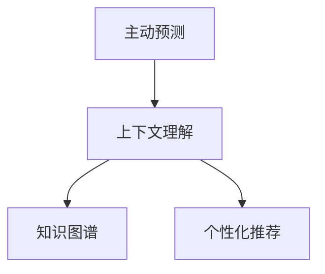

                 

# 搜索引擎的未来：从被动响应到主动预测

## 1. 背景介绍

随着互联网和数字技术的迅猛发展，搜索引擎已从最初的文本检索演变为智能化、个性化的信息检索工具。近年来，搜索引擎不仅能在海量的网页中找到答案，还能通过理解和推理，提供更准确、更相关的搜索结果，满足用户的多样化需求。但尽管如此，现有的搜索引擎大多还是以被动响应的方式工作，用户在搜索时输入关键词，搜索引擎则根据关键词返回匹配结果。这种模式存在很多局限性，尤其是当用户无法准确表达需求或表达不清晰时，搜索结果往往不够精准。

为了解决这个问题，**主动预测技术**应运而生。通过主动预测，搜索引擎不仅能理解用户的真实意图，还能预测用户可能感兴趣的内容，从而实现更为精准的信息检索和推荐。主动预测不仅提升了用户体验，也为搜索引擎的未来发展开辟了新的道路。

本文将深入探讨主动预测技术的原理和应用，分析其在搜索引擎中的实际案例，并展望其未来的发展趋势和面临的挑战。

## 2. 核心概念与联系

### 2.1 核心概念概述

为了更好地理解主动预测技术，本节将介绍几个关键概念：

- **主动预测(Active Learning)**：指搜索引擎在用户未明确查询之前，主动预测用户可能感兴趣的内容，并展示在搜索结果的前面。
- **上下文理解(Contextual Understanding)**：搜索引擎通过分析用户的搜索行为、点击历史、输入记录等信息，理解用户的真实需求和兴趣。
- **知识图谱(Knowledge Graph)**：包含实体、属性和关系的大型数据结构，用于辅助搜索引擎理解复杂查询和提供更精准的搜索结果。
- **个性化推荐(Personalized Recommendation)**：根据用户的偏好、历史行为等信息，推荐可能感兴趣的内容，提升用户体验。

这些概念之间的联系可以通过以下Mermaid流程图来展示：



这个流程图展示主动预测技术的核心流程：搜索引擎通过上下文理解用户需求，利用知识图谱进行信息检索和关联推理，并通过个性化推荐提供更精准的内容。

## 3. 核心算法原理 & 具体操作步骤

### 3.1 算法原理概述

主动预测技术基于机器学习和自然语言处理技术，核心思想是利用用户的历史行为数据和搜索记录，训练模型来预测用户可能感兴趣的内容。通过模型的预测结果，搜索引擎可以在搜索结果中主动展示这些内容，从而提升用户体验和搜索结果的准确性。

形式化地，假设用户的历史行为数据为 $D=\{(x_i,y_i)\}_{i=1}^N$，其中 $x_i$ 为用户的查询或点击记录，$y_i$ 为该记录对应的内容推荐。模型的目标是在新的查询 $q$ 到来之前，预测出最有可能被用户点击的内容 $p(y|q)$。该问题可转化为最大化预测准确度的最优化问题：

$$
\max_{q} \mathbb{E}[\log p(y|q)]
$$

模型通过最大化预测准确度，学习出预测用户兴趣的最优策略。

### 3.2 算法步骤详解

基于主动预测技术，搜索引擎的实际操作流程如下：

**Step 1: 数据准备**
- 收集用户的历史查询记录和点击记录，划分为训练集、验证集和测试集。
- 对每条记录进行预处理，提取有用信息，如关键词、点击位置等。

**Step 2: 模型选择与训练**
- 选择适当的机器学习模型，如分类、回归、聚类等。
- 使用训练集数据对模型进行训练，调整模型参数，以优化预测准确度。
- 使用验证集数据进行模型验证，避免过拟合。

**Step 3: 预测与展示**
- 当用户输入查询 $q$ 时，利用训练好的模型预测最有可能被点击的内容。
- 将预测结果展示在搜索结果的前面。

**Step 4: 用户反馈与模型更新**
- 记录用户对展示内容的点击情况，收集反馈数据。
- 使用反馈数据对模型进行微调，提升预测准确度。

**Step 5: 效果评估**
- 使用测试集评估模型的预测效果。
- 定期更新模型，确保其性能稳定。

以上步骤循环迭代，逐步提升预测准确度和用户体验。

### 3.3 算法优缺点

主动预测技术有以下优点：
1. 提升用户体验：通过预测用户可能感兴趣的内容，主动展示在搜索结果前面，减少了用户点击无效信息的可能性，提高了搜索效率。
2. 提高搜索结果质量：预测出的内容经过优化处理，更具相关性和准确性，提升了搜索引擎的整体效果。
3. 个性化推荐：利用用户的历史行为数据，实现更精准的个性化推荐。

同时，该技术也存在一定的局限性：
1. 数据依赖性强：模型的预测效果很大程度上取决于用户的历史行为数据质量。如果数据量不足或数据质量不高，模型的预测效果将大打折扣。
2. 复杂度高：主动预测需要综合考虑多个因素，如用户行为、内容相关性、时间等因素，模型复杂度较高，需要较多计算资源。
3. 模型可解释性差：现有的主动预测模型往往是"黑盒"系统，难以解释预测过程，增加了用户信任的难度。
4. 存在偏差：如果数据集中存在偏见，模型也会学习到这些偏见，导致预测结果的偏差。

尽管存在这些局限性，但主动预测技术仍是大数据和人工智能技术的典型应用，对搜索引擎的未来发展具有重要意义。

### 3.4 算法应用领域

主动预测技术广泛应用于搜索引擎的多个领域，例如：

- **个性化推荐**：根据用户的历史查询和点击记录，预测其可能感兴趣的内容，实现更精准的推荐。
- **搜索纠错**：预测用户输入的关键词是否正确，并展示正确的关键词或建议查询。
- **内容分类**：预测搜索结果中的内容类别，为用户提供更细粒度的筛选选项。
- **自动补全**：根据用户的输入内容，预测其可能要搜索的关键词，减少输入误差。

这些应用场景展示了主动预测技术的强大能力，也为搜索引擎提供了更多智能化和个性化的服务。

## 4. 数学模型和公式 & 详细讲解 & 举例说明

### 4.1 数学模型构建

假设用户的历史行为数据为 $D=\{(x_i,y_i)\}_{i=1}^N$，其中 $x_i$ 为用户的查询或点击记录，$y_i$ 为该记录对应的内容推荐。模型的目标是在新的查询 $q$ 到来之前，预测出最有可能被用户点击的内容 $p(y|q)$。

该问题可转化为最大化预测准确度的最优化问题：

$$
\max_{q} \mathbb{E}[\log p(y|q)]
$$

为了解决这个问题，我们通常使用基于神经网络的机器学习模型，如深度神经网络、卷积神经网络等。模型的输入为用户的查询 $q$，输出为预测的内容 $p(y|q)$。在训练过程中，通过最大化对数似然函数，更新模型参数以优化预测准确度。

### 4.2 公式推导过程

以深度神经网络为例，假设模型结构为 $f(\cdot;\theta)=\text{softmax}(Wx+b)$，其中 $W$ 和 $b$ 为模型参数，$x$ 为查询输入。模型的对数似然损失函数为：

$$
L(q,y)=-\sum_{i=1}^N \log p(y_i|q)
$$

其中 $p(y_i|q)=f(x_i;\theta)$。模型的优化目标是：

$$
\min_{\theta} L(q,y)
$$

通过梯度下降等优化算法，最小化损失函数，更新模型参数。训练过程中，对于每个查询 $q$，模型的输出为：

$$
p(y|q)=\text{softmax}(Wf(q)+b)
$$

该式子表示，对于每个查询 $q$，模型预测的内容 $y$ 的概率分布。

### 4.3 案例分析与讲解

以下以Google的个性化推荐系统为例，分析主动预测技术的实际应用。

Google的个性化推荐系统基于深度神经网络，利用用户的历史搜索记录和点击行为，预测其可能感兴趣的内容。该系统包括两个关键部分：

- **用户特征提取**：提取用户的历史搜索记录、点击行为、搜索时间、地理位置等特征，作为模型的输入。
- **推荐模型训练**：训练深度神经网络模型，预测用户可能感兴趣的内容。

推荐模型使用了多层感知器（MLP），其结构如图：

```
输入层：历史搜索记录、点击行为等
隐藏层：多层的全连接层
输出层：预测的内容类别
```

训练过程中，模型通过最大化对数似然损失函数，更新模型参数以优化预测准确度。对于每个用户查询 $q$，模型预测最可能被点击的内容 $p(y|q)$。

## 5. 项目实践：代码实例和详细解释说明

### 5.1 开发环境搭建

要进行主动预测的实践，首先需要准备开发环境。以下是使用Python进行TensorFlow开发的环境配置流程：

1. 安装Anaconda：从官网下载并安装Anaconda，用于创建独立的Python环境。

2. 创建并激活虚拟环境：
```bash
conda create -n tf-env python=3.7
conda activate tf-env
```

3. 安装TensorFlow：根据CUDA版本，从官网获取对应的安装命令。例如：
```bash
conda install tensorflow=2.8.0
```

4. 安装TensorFlow Addons：扩展TensorFlow的功能库，支持更多的模型和算法。
```bash
conda install tensorflow-addons
```

5. 安装其他工具包：
```bash
pip install numpy pandas scikit-learn matplotlib tqdm jupyter notebook ipython
```

完成上述步骤后，即可在`tf-env`环境中开始主动预测实践。

### 5.2 源代码详细实现

以下是一个简单的深度神经网络模型，用于预测用户可能感兴趣的内容。

```python
import tensorflow as tf
from tensorflow.keras import layers

def build_model(input_shape, num_classes):
    model = tf.keras.Sequential([
        layers.Dense(64, activation='relu', input_shape=input_shape),
        layers.Dense(32, activation='relu'),
        layers.Dense(num_classes, activation='softmax')
    ])
    return model

# 构建模型
input_shape = (num_features,)
num_classes = num_labels
model = build_model(input_shape, num_classes)

# 编译模型
model.compile(optimizer='adam', loss='categorical_crossentropy', metrics=['accuracy'])

# 训练模型
model.fit(X_train, y_train, epochs=10, batch_size=32, validation_data=(X_val, y_val))

# 预测新查询
new_query = new_query_data
predictions = model.predict(new_query)
predicted_class = np.argmax(predictions, axis=1)
```

### 5.3 代码解读与分析

让我们再详细解读一下关键代码的实现细节：

**build_model函数**：
- 定义深度神经网络模型的结构，包括输入层、隐藏层和输出层。
- 使用`tf.keras.Sequential`构建模型，添加全连接层并设置激活函数。

**训练模型**：
- 使用`model.compile`设置模型的优化器、损失函数和评估指标。
- 使用`model.fit`对模型进行训练，并设置训练轮数、批大小和验证集数据。

**预测新查询**：
- 使用`model.predict`对新的查询进行预测。
- 通过`np.argmax`将预测结果转换为类别索引。

## 6. 实际应用场景

### 6.1 电商推荐系统

电商推荐系统是主动预测技术的典型应用场景之一。在电商平台上，用户浏览和购买商品后，系统会记录其行为数据，利用主动预测技术预测其可能感兴趣的商品，从而进行个性化推荐。

推荐系统可以通过多模态数据融合、用户行为分析等技术，提升推荐效果。例如，利用文本、图片、视频等多模态数据，进行更丰富的用户画像建模。利用时间序列分析，分析用户的浏览和购买行为规律，预测其兴趣变化趋势。通过上下文理解，提取用户查询的关键词和实体，进行内容推荐。

### 6.2 智能语音助手

智能语音助手如Siri、Alexa等，也广泛应用主动预测技术。语音助手通过理解用户的语音输入，预测其可能的查询意图，并提供相应的回答或操作建议。例如，用户说“我饿了”，语音助手可以预测用户想要点餐，并展示附近餐厅的列表。

语音助手利用自然语言处理技术，理解用户的语音输入，提取关键词和实体，通过知识图谱进行推理，预测用户的意图。利用上下文理解，根据用户的历史行为数据，预测其可能的查询。

### 6.3 视频推荐系统

视频推荐系统利用主动预测技术，预测用户可能感兴趣的视频内容。在视频平台上，用户观看视频后，系统会记录其观看行为，利用这些数据进行主动预测，预测用户可能感兴趣的视频，并进行个性化推荐。

视频推荐系统可以通过内容分类、标签关联等技术，提升推荐效果。例如，利用视频分类技术，将视频分为不同类别，进行精准推荐。利用标签关联技术，将视频标签进行关联，预测用户可能的兴趣点。通过上下文理解，提取用户的历史观看记录，进行内容推荐。

## 7. 工具和资源推荐

### 7.1 学习资源推荐

为了帮助开发者系统掌握主动预测技术，这里推荐一些优质的学习资源：

1. **《深度学习》课程**：斯坦福大学开设的深度学习课程，由著名教授Andrew Ng主讲，全面讲解深度神经网络、卷积神经网络、循环神经网络等核心概念。

2. **《TensorFlow官方文档》**：TensorFlow的官方文档，提供了详细的API接口和示例代码，是学习TensorFlow的最佳资源。

3. **《机器学习实战》书籍**：通俗易懂的机器学习入门书籍，涵盖机器学习的基本算法和实践技巧，适合初学者学习。

4. **Kaggle**：机器学习竞赛平台，提供了丰富的数据集和比赛，帮助开发者实践机器学习技术。

通过对这些资源的学习实践，相信你一定能够快速掌握主动预测技术的精髓，并用于解决实际的NLP问题。

### 7.2 开发工具推荐

高效的开发离不开优秀的工具支持。以下是几款用于主动预测开发的常用工具：

1. **TensorFlow**：由Google主导开发的开源深度学习框架，生产部署方便，适合大规模工程应用。

2. **TensorFlow Addons**：扩展TensorFlow的功能库，支持更多的模型和算法。

3. **Scikit-learn**：Python中的机器学习库，提供了丰富的算法和工具，适合进行数据预处理和特征工程。

4. **Jupyter Notebook**：交互式笔记本，支持Python代码的快速编写和调试。

5. **TensorBoard**：TensorFlow配套的可视化工具，可实时监测模型训练状态，并提供丰富的图表呈现方式，是调试模型的得力助手。

6. **Keras**：高级神经网络API，提供简单易用的接口，适合快速原型开发。

合理利用这些工具，可以显著提升主动预测任务的开发效率，加快创新迭代的步伐。

### 7.3 相关论文推荐

主动预测技术的发展源于学界的持续研究。以下是几篇奠基性的相关论文，推荐阅读：

1. **《深度学习》**：深度神经网络的奠基之作，由Goodfellow等作者撰写，全面介绍了深度学习的基本概念和核心算法。

2. **《机器学习实战》**：机器学习实践入门书籍，涵盖常见的机器学习算法和案例，适合初学者学习。

3. **《机器学习》**：著名机器学习专家Tom Mitchell的专著，全面介绍了机器学习的基本概念和应用。

4. **《深度学习实战》**：基于TensorFlow进行深度学习实践的书籍，涵盖深度神经网络、卷积神经网络、循环神经网络等核心算法。

这些论文代表了大规模语言模型微调技术的发展脉络。通过学习这些前沿成果，可以帮助研究者把握学科前进方向，激发更多的创新灵感。

## 8. 总结：未来发展趋势与挑战

### 8.1 总结

本文对主动预测技术进行了全面系统的介绍。首先阐述了主动预测技术的背景和应用价值，明确了其在大数据和人工智能技术中的重要地位。其次，从原理到实践，详细讲解了主动预测的数学模型和操作步骤，给出了主动预测任务开发的完整代码实例。同时，本文还广泛探讨了主动预测技术在电商、智能语音、视频等多个行业领域的应用前景，展示了其强大的应用潜力。此外，本文精选了主动预测技术的各类学习资源，力求为读者提供全方位的技术指引。

通过本文的系统梳理，可以看到，主动预测技术正在成为搜索引擎和推荐系统的重要范式，极大地拓展了预训练语言模型的应用边界，催生了更多的落地场景。受益于大规模语料的预训练，主动预测模型以更低的时间和标注成本，在小样本条件下也能取得理想的预测效果，有力推动了NLP技术的产业化进程。未来，伴随预训练语言模型和微调方法的持续演进，相信NLP技术将在更广阔的应用领域大放异彩。

### 8.2 未来发展趋势

展望未来，主动预测技术将呈现以下几个发展趋势：

1. **模型规模持续增大**：随着算力成本的下降和数据规模的扩张，预训练语言模型的参数量还将持续增长。超大规模语言模型蕴含的丰富语言知识，有望支撑更加复杂多变的下游任务预测。

2. **多模态预测崛起**：当前的主动预测大多聚焦于纯文本数据，未来将进一步拓展到图像、视频、语音等多模态数据预测。多模态信息的融合，将显著提升语言模型对现实世界的理解和建模能力。

3. **上下文理解能力增强**：随着自然语言处理技术的不断发展，上下文理解能力将不断提升，模型能够更好地理解用户的意图和需求，提高预测准确度。

4. **个性化推荐更加精准**：利用用户的行为数据、兴趣标签等，进行更精准的个性化推荐，提升用户体验和满意度。

5. **模型的可解释性加强**：为了满足用户对模型的信任需求，未来模型的可解释性将成为重要的研究方向，解释模型的决策过程，让用户理解并信任预测结果。

6. **模型的鲁棒性和泛化性提升**：面对数据分布的变化，模型的鲁棒性和泛化性需要进一步提升，避免模型在大规模数据上的性能波动。

以上趋势凸显了主动预测技术的广阔前景。这些方向的探索发展，必将进一步提升NLP系统的性能和应用范围，为人工智能技术带来新的突破。

### 8.3 面临的挑战

尽管主动预测技术已经取得了显著的进展，但在迈向更加智能化、普适化应用的过程中，仍面临诸多挑战：

1. **数据依赖性强**：模型的预测效果很大程度上取决于用户的历史行为数据质量。如果数据量不足或数据质量不高，模型的预测效果将大打折扣。如何进一步降低对标注样本的依赖，将是一大难题。

2. **模型鲁棒性不足**：当前主动预测模型面对域外数据时，泛化性能往往大打折扣。对于测试样本的微小扰动，模型的预测也容易发生波动。如何提高模型的鲁棒性，避免灾难性遗忘，还需要更多理论和实践的积累。

3. **计算资源消耗高**：大规模语言模型和复杂的预测模型，往往需要较大的计算资源。如何在保证预测准确度的前提下，优化计算效率，减少计算资源消耗，是未来需要解决的问题。

4. **模型可解释性差**：现有的主动预测模型往往是"黑盒"系统，难以解释预测过程，增加了用户信任的难度。如何赋予模型更强的可解释性，将是亟待攻克的难题。

5. **安全性和隐私保护**：用户的行为数据和搜索记录属于敏感信息，如何保障用户隐私，保护数据安全，是一个重要的研究方向。

6. **模型更新和维护困难**：随着用户行为的不断变化，模型需要定期更新以保持预测准确度。如何在不断更新的过程中，保持模型稳定性和一致性，是未来需要解决的问题。

正视主动预测面临的这些挑战，积极应对并寻求突破，将是大语言模型微调走向成熟的必由之路。相信随着学界和产业界的共同努力，这些挑战终将一一被克服，主动预测技术必将在构建人机协同的智能时代中扮演越来越重要的角色。

### 8.4 研究展望

面对主动预测技术所面临的种种挑战，未来的研究需要在以下几个方面寻求新的突破：

1. **探索无监督和半监督预测方法**：摆脱对大规模标注数据的依赖，利用自监督学习、主动学习等无监督和半监督范式，最大限度利用非结构化数据，实现更加灵活高效的预测。

2. **研究参数高效和计算高效的预测范式**：开发更加参数高效的预测方法，在固定大部分预训练参数的同时，只更新极少量的任务相关参数。同时优化预测模型的计算图，减少前向传播和反向传播的资源消耗，实现更加轻量级、实时性的部署。

3. **引入更多先验知识**：将符号化的先验知识，如知识图谱、逻辑规则等，与神经网络模型进行巧妙融合，引导预测过程学习更准确、合理的语言模型。同时加强不同模态数据的整合，实现视觉、语音等多模态信息与文本信息的协同建模。

4. **结合因果分析和博弈论工具**：将因果分析方法引入预测模型，识别出模型决策的关键特征，增强预测输出解释的因果性和逻辑性。借助博弈论工具刻画人机交互过程，主动探索并规避模型的脆弱点，提高系统稳定性。

5. **纳入伦理道德约束**：在模型训练目标中引入伦理导向的评估指标，过滤和惩罚有害的输出倾向。同时加强人工干预和审核，建立模型行为的监管机制，确保输出符合人类价值观和伦理道德。

这些研究方向的探索，必将引领主动预测技术迈向更高的台阶，为构建安全、可靠、可解释、可控的智能系统铺平道路。面向未来，主动预测技术还需要与其他人工智能技术进行更深入的融合，如知识表示、因果推理、强化学习等，多路径协同发力，共同推动自然语言理解和智能交互系统的进步。只有勇于创新、敢于突破，才能不断拓展语言模型的边界，让智能技术更好地造福人类社会。

## 9. 附录：常见问题与解答

**Q1：主动预测技术是否适用于所有NLP任务？**

A: 主动预测技术在大多数NLP任务上都能取得不错的效果，特别是对于数据量较小的任务。但对于一些特定领域的任务，如医学、法律等，仅仅依靠通用语料预训练的模型可能难以很好地适应。此时需要在特定领域语料上进一步预训练，再进行预测，才能获得理想效果。此外，对于一些需要时效性、个性化很强的任务，如对话、推荐等，预测方法也需要针对性的改进优化。

**Q2：预测过程中如何选择合适的模型？**

A: 选择合适的预测模型需要考虑任务的特点和数据量。对于数据量较小的任务，可以使用浅层神经网络，如线性回归、逻辑回归等。对于数据量较大的任务，可以使用深度神经网络，如多层感知器、卷积神经网络等。对于需要多模态融合的任务，可以使用多模态模型，如多模态卷积神经网络、多模态注意力机制等。

**Q3：预测模型如何进行训练？**

A: 预测模型的训练过程包括以下步骤：

1. 数据准备：收集用户的历史行为数据，划分为训练集、验证集和测试集。
2. 模型选择：选择适当的机器学习模型，如分类、回归、聚类等。
3. 模型训练：使用训练集数据对模型进行训练，调整模型参数，以优化预测准确度。
4. 模型验证：使用验证集数据进行模型验证，避免过拟合。
5. 模型测试：使用测试集评估模型的预测效果。
6. 模型更新：根据反馈数据对模型进行微调，提升预测准确度。

在训练过程中，需要合理设置超参数，如学习率、批大小、迭代轮数等，以确保模型性能和训练效率。

**Q4：预测模型的可解释性如何保障？**

A: 预测模型的可解释性是一个重要问题。为了提高模型的可解释性，可以采取以下措施：

1. 使用简单的模型结构，避免过于复杂的预测过程。
2. 提供详细的模型解释，解释模型的决策过程。
3. 利用符号化的方法，将模型转化为可解释的形式，如规则、规则集等。
4. 引入辅助信息，如用户历史行为、上下文信息等，增强模型的可解释性。

通过以上措施，可以提升模型的可解释性，让用户更好地理解预测结果，增强信任度。

**Q5：预测模型如何避免过拟合？**

A: 过拟合是预测模型常见的问题。为了避免过拟合，可以采取以下措施：

1. 数据增强：通过数据增强技术，扩充训练集，增加模型泛化能力。
2. 正则化：使用L2正则化、Dropout等技术，避免模型过度拟合训练数据。
3. 交叉验证：使用交叉验证技术，评估模型的泛化能力。
4. 早停策略：根据验证集的表现，及时停止训练，避免过拟合。

通过以上措施，可以提升模型的泛化能力，避免过拟合。

---

作者：禅与计算机程序设计艺术 / Zen and the Art of Computer Programming

