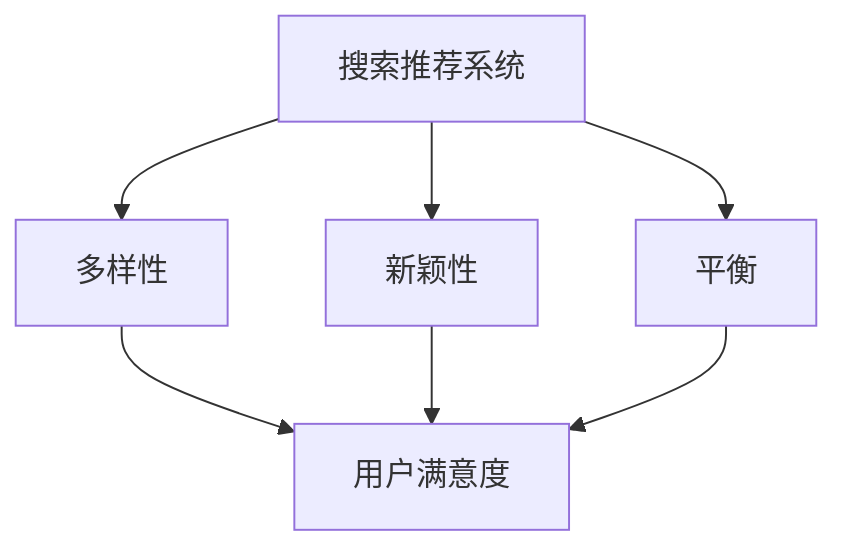
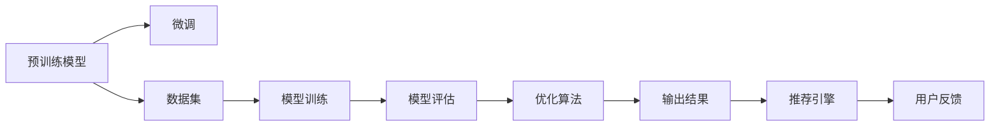

                 

## 1. 背景介绍

在当前信息爆炸的时代，如何为用户推荐内容是互联网公司面临的重要挑战之一。优秀的推荐系统不仅能提升用户体验，还能带来巨大的商业价值。然而，在推荐过程中，推荐结果的多样性和新颖性是用户满意度的关键。多样性使得用户能够接触到更多样化的内容，新颖性则让用户不断有新鲜感，从而提升用户的长期留存率。但在实际推荐中，这两个目标往往难以平衡。

为了解决这个问题，近年来，研究者们提出了多种多样性与新颖性平衡的方法。这些方法主要可以分为两类：基于启发式策略和基于学习的方法。基于启发式策略的方法主要依赖领域经验，通过调整推荐算法的参数或者引入特定的推荐规则，来实现多样性与新颖性的平衡。基于学习的方法则通过训练优化模型，学习到平衡两者关系的最佳策略。

本文将详细介绍基于学习的方法，特别是利用深度学习模型进行多样性与新颖性平衡的策略。首先，我们将介绍搜索推荐系统的核心概念与联系，然后深入探讨基于学习的多样性与新颖性平衡策略的原理与操作步骤，并通过数学模型和代码实例，对策略进行详细讲解与分析。最后，我们将通过实际应用场景，展示该策略的效用，并对未来发展趋势与挑战进行展望。

## 2. 核心概念与联系

### 2.1 核心概念概述

为了更好地理解搜索推荐系统中的多样性与新颖性平衡策略，本节将介绍几个密切相关的核心概念：

- **搜索推荐系统(Recommender System)**：通过算法为用户推荐信息或产品，提升用户满意度和公司收益。常见的推荐算法包括基于协同过滤、基于内容的推荐、基于深度学习的推荐等。

- **多样性(Diversity)**：推荐结果的差异性和覆盖面。高多样性的推荐系统能提供多种不同的推荐结果，满足用户的个性化需求。

- **新颖性(Novelty)**：推荐结果的新颖程度和新鲜感。高新颖性的推荐系统能够不断为用户带来新鲜内容，避免推荐陈旧或重复的信息。

- **平衡(Balancing)**：在多样性和新颖性之间找到最佳平衡点，使用户既能接触到多样化的内容，又能感受到新鲜感，提升用户满意度和长期留存率。

这些概念之间的关系可以用以下Mermaid流程图来展示：

这个流程图展示了搜索推荐系统中多样性与新颖性平衡的核心逻辑：

1. 搜索推荐系统通过多样性策略和新颖性策略，生成推荐结果。
2. 多样性策略能提供多种推荐结果，新颖性策略能不断引入新鲜内容。
3. 平衡策略在多样性和新颖性之间找到最佳点，提升用户满意度。

### 2.2 核心概念原理和架构的 Mermaid 流程图

这个流程图展示了基于学习的多样性与新颖性平衡策略的核心架构：

1. 使用预训练模型作为初始化参数。
2. 在标注数据集上进行微调，学习到多样性与新颖性的平衡策略。
3. 通过模型训练和评估，优化平衡策略。
4. 输出结果通过推荐引擎，推送给用户。
5. 收集用户反馈，不断优化模型。

## 3. 核心算法原理 & 具体操作步骤

### 3.1 算法原理概述

基于学习的多样性与新颖性平衡策略，本质上是通过训练优化模型，学习到如何在推荐结果中平衡多样性和新颖性。该策略主要包括以下几个步骤：

1. 收集推荐系统的历史数据，包括用户的点击行为、评分数据等。
2. 设计目标函数，如多样性-新颖性损失函数，来衡量推荐结果的多样性和新颖性。
3. 通过微调模型，最小化目标函数，优化推荐结果。

形式化地，设推荐系统中有$n$个用户，每个用户有$m$个推荐项$x_i$。推荐结果$y_i$为0或1，表示用户是否点击了推荐项。目标函数$\mathcal{L}$定义为多样性损失和新颖性损失之和：

$$
\mathcal{L} = \lambda_1 \mathcal{L}_{div} + \lambda_2 \mathcal{L}_{nov}
$$

其中$\lambda_1$和$\lambda_2$为正则化系数，$\mathcal{L}_{div}$和$\mathcal{L}_{nov}$分别为多样性和新颖性的损失函数。

### 3.2 算法步骤详解

基于学习的多样性与新颖性平衡策略主要包括以下几个关键步骤：

**Step 1: 准备数据集**

- 收集推荐系统的历史数据，如用户行为数据、物品评分数据等。
- 将数据集划分为训练集、验证集和测试集。
- 对数据集进行预处理，包括数据清洗、特征工程等。

**Step 2: 设计目标函数**

- 设计多样性损失函数，如Shannon熵、Gini不纯度等。
- 设计新颖性损失函数，如Item novelty、User novelty等。
- 综合两个损失函数，设计多样性与新颖性平衡的目标函数。

**Step 3: 设置模型参数**

- 选择合适的预训练模型，如RNN、LSTM、Transformer等。
- 设置模型的超参数，如学习率、批大小、迭代轮数等。
- 确定正则化技术，如Dropout、L2正则化等。

**Step 4: 执行模型训练**

- 将训练集数据分批次输入模型，前向传播计算损失函数。
- 反向传播计算参数梯度，根据设定的优化算法更新模型参数。
- 周期性在验证集上评估模型性能，根据性能指标决定是否触发Early Stopping。
- 重复上述步骤直到满足预设的迭代轮数或Early Stopping条件。

**Step 5: 测试与部署**

- 在测试集上评估微调后模型的多样性和新颖性。
- 使用微调后的模型对新样本进行推荐，集成到实际的应用系统中。
- 持续收集用户反馈，定期重新微调模型，以适应数据分布的变化。

### 3.3 算法优缺点

基于学习的多样性与新颖性平衡策略有以下优点：

1. 可解释性。通过训练优化模型，可以理解和解释模型是如何平衡多样性和新颖性的。
2. 灵活性。可以根据具体任务和数据特点，灵活调整目标函数和超参数。
3. 自适应性。在推荐过程中，可以动态调整多样性和新颖性的权重，适应不同用户和场景。

但该方法也存在一些局限性：

1. 对数据依赖度高。需要足够的标注数据和历史数据进行训练。
2. 计算成本高。在大规模数据集上训练模型，需要大量的计算资源。
3. 模型复杂度高。需要设计复杂的目标函数和优化算法。
4. 模型鲁棒性不足。在面对异常数据或噪声时，可能影响模型性能。

尽管存在这些局限性，但就目前而言，基于学习的方法仍是在搜索推荐系统中实现多样性与新颖性平衡的主流范式。未来相关研究的重点在于如何进一步降低计算成本，提高模型鲁棒性，同时兼顾可解释性和自适应性等因素。

### 3.4 算法应用领域

基于学习的多样性与新颖性平衡策略已经在多个领域得到应用，例如：

- 电商推荐：为用户推荐个性化商品，提升用户满意度和转化率。
- 视频推荐：为用户推荐视频内容，提升用户的观看体验和留存率。
- 新闻推荐：为用户推荐新闻内容，提升用户的信息获取效率和粘性。
- 音乐推荐：为用户推荐音乐作品，提升用户的音乐聆听体验和发现能力。

除了上述这些经典应用外，多样性与新颖性平衡策略也被创新性地应用到更多场景中，如多模态推荐、实时推荐、跨领域推荐等，为推荐系统带来了新的突破。随着算法的不断进步和数据量的增长，相信推荐系统必将在更广阔的应用领域大放异彩。

## 4. 数学模型和公式 & 详细讲解 & 举例说明

### 4.1 数学模型构建

本节将使用数学语言对基于学习的多样性与新颖性平衡策略进行更加严格的刻画。

设推荐系统中有$n$个用户，每个用户有$m$个推荐项$x_i$。推荐结果$y_i$为0或1，表示用户是否点击了推荐项。定义目标函数$\mathcal{L}$为多样性损失和新颖性损失之和：

$$
\mathcal{L} = \lambda_1 \mathcal{L}_{div} + \lambda_2 \mathcal{L}_{nov}
$$

其中$\lambda_1$和$\lambda_2$为正则化系数，$\mathcal{L}_{div}$和$\mathcal{L}_{nov}$分别为多样性和新颖性的损失函数。

### 4.2 公式推导过程

以下我们以Shannon熵作为多样性损失函数，Item novelty作为新颖性损失函数，推导目标函数及其梯度的计算公式。

1. **多样性损失函数**：

   Shannon熵用于衡量推荐结果的多样性，定义为：

   $$
   \mathcal{L}_{div} = - \frac{1}{n} \sum_{i=1}^{n} \sum_{j=1}^{m} y_{ij} \log y_{ij}
   $$

   其中$y_{ij}$表示用户$i$对推荐项$j$的评分。

2. **新颖性损失函数**：

   Item novelty用于衡量推荐结果的新颖性，定义为：

   $$
   \mathcal{L}_{nov} = \frac{1}{n} \sum_{i=1}^{n} \sum_{j=1}^{m} y_{ij} \log(1 - y_{ij})
   $$

   其中$y_{ij}$表示用户$i$对推荐项$j$的评分。

将两个损失函数代入目标函数，得：

$$
\mathcal{L} = \lambda_1 \left(- \frac{1}{n} \sum_{i=1}^{n} \sum_{j=1}^{m} y_{ij} \log y_{ij}\right) + \lambda_2 \left(\frac{1}{n} \sum_{i=1}^{n} \sum_{j=1}^{m} y_{ij} \log(1 - y_{ij})\right)
$$

根据链式法则，目标函数对模型参数$\theta$的梯度为：

$$
\nabla_{\theta} \mathcal{L} = \nabla_{\theta} \mathcal{L}_{div} + \nabla_{\theta} \mathcal{L}_{nov}
$$

其中$\nabla_{\theta} \mathcal{L}_{div}$和$\nabla_{\theta} \mathcal{L}_{nov}$分别为多样性和新颖性损失函数的梯度。

### 4.3 案例分析与讲解

假设我们已经构建了一个基于深度学习的推荐系统，使用了一个简单的神经网络模型。现在，我们希望在推荐结果中平衡多样性和新颖性。以下是具体的实现步骤：

1. **数据准备**：
   - 收集历史数据，包括用户的点击行为、评分数据等。
   - 将数据集划分为训练集、验证集和测试集。
   - 对数据集进行预处理，包括数据清洗、特征工程等。

2. **模型定义**：
   - 定义一个简单的神经网络模型，包含输入层、隐藏层和输出层。
   - 设置模型的超参数，如学习率、批大小、迭代轮数等。
   - 设计多样性和新颖性损失函数，如Shannon熵、Item novelty等。

3. **模型训练**：
   - 将训练集数据分批次输入模型，前向传播计算损失函数。
   - 反向传播计算参数梯度，根据设定的优化算法更新模型参数。
   - 周期性在验证集上评估模型性能，根据性能指标决定是否触发Early Stopping。
   - 重复上述步骤直到满足预设的迭代轮数或Early Stopping条件。

4. **模型测试**：
   - 在测试集上评估微调后模型的多样性和新颖性。
   - 使用微调后的模型对新样本进行推荐，集成到实际的应用系统中。
   - 持续收集用户反馈，定期重新微调模型，以适应数据分布的变化。

## 5. 项目实践：代码实例和详细解释说明

### 5.1 开发环境搭建

在进行多样性与新颖性平衡策略的实践前，我们需要准备好开发环境。以下是使用Python进行TensorFlow开发的环

