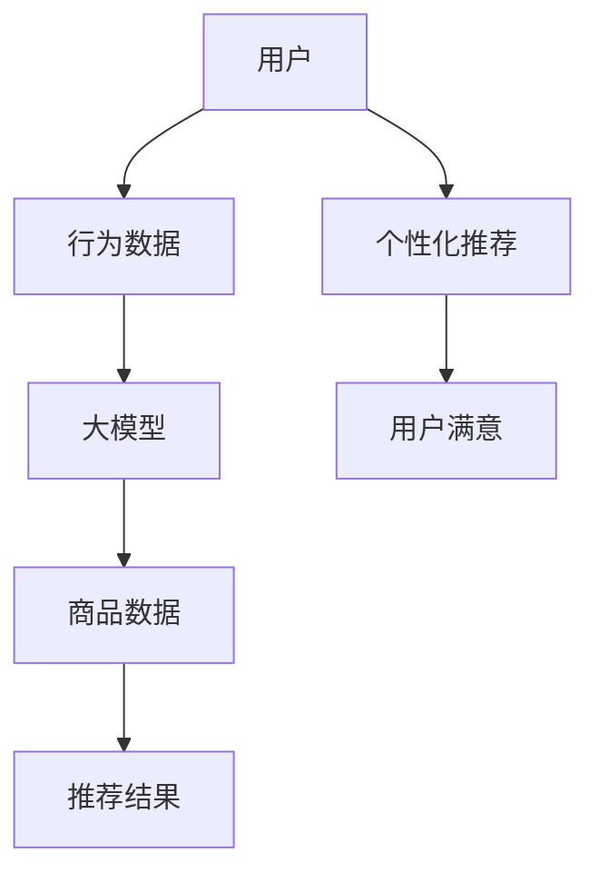

                 

# 搜索推荐系统的AI 大模型应用：提高电商平台的竞争优势

> 关键词：搜索推荐系统, 大模型, AI, 电商, 用户行为分析, 个性化推荐, 深度学习, 注意力机制, 内容推荐, 电商平台

## 1. 背景介绍

随着电商平台的快速发展，搜索推荐系统在用户交互、商品推荐等方面扮演了越来越重要的角色。大模型技术以其强大的表示能力，成为搜索推荐系统的重要工具。本文将介绍如何在大模型基础上构建高效、个性化的电商搜索推荐系统，提升平台的竞争优势。

## 2. 核心概念与联系

### 2.1 核心概念概述

- **搜索推荐系统**：基于用户行为数据，通过算法推荐可能感兴趣的商品，帮助用户快速找到所需商品的系统。
- **大模型**：以深度神经网络为基础的大规模预训练模型，如BERT、GPT等，具备强大的表征学习能力和泛化能力。
- **电商平台**：如淘宝、京东、亚马逊等，通过搜索推荐系统提供个性化服务，提升用户购物体验。
- **个性化推荐**：根据用户历史行为、兴趣标签等，推荐用户可能感兴趣的个性化商品。
- **深度学习**：以多层神经网络为基础，通过反向传播算法训练模型，从数据中自动提取特征和模式。

### 2.2 核心概念原理和架构的 Mermaid 流程图



该流程图展示了电商搜索推荐系统的核心架构，用户行为数据经过大模型处理后，结合商品数据，生成个性化推荐结果。最终推荐结果反馈给用户，提升用户体验。

## 3. 核心算法原理 & 具体操作步骤

### 3.1 算法原理概述

大模型在搜索推荐系统中的应用主要通过以下步骤实现：

1. **预训练大模型**：在大规模无标注数据上预训练大模型，使其学习通用的语言或特征表示。
2. **行为数据抽取**：从用户历史行为数据中提取特征，如浏览记录、点击次数、评分等。
3. **特征嵌入**：将行为数据特征映射到大模型的隐藏空间中，获取高维稠密表示。
4. **推荐模型训练**：在大模型表示的基础上，训练推荐模型，预测用户对商品的可能评分或点击概率。
5. **推荐结果生成**：根据模型预测，生成个性化推荐结果。

### 3.2 算法步骤详解

#### 3.2.1 预训练大模型

以BERT为例，其预训练过程如下：

1. 在大规模语料库上，进行掩码语言模型(Masked Language Model, MLM)和下一句预测任务(Next Sentence Prediction, NSP)的预训练。
2. 将预训练模型应用于电商商品描述和用户评论中，提取商品的特征表示。

#### 3.2.2 行为数据抽取

将用户行为数据抽象为特征向量，可以使用如下方法：

- **统计特征**：如浏览次数、购买次数、停留时间等。
- **行为序列**：将用户行为序列化，如点击序列、浏览序列等。
- **兴趣标签**：从用户行为数据中提取兴趣标签，如运动、时尚、科技等。

#### 3.2.3 特征嵌入

使用大模型进行特征嵌入，步骤如下：

1. 将用户行为特征编码成向量，如TensorFlow中的Embedding Layer。
2. 将商品描述和评论特征送入BERT等大模型，获取高维稠密表示。
3. 对用户行为特征和商品特征进行拼接或加权求和，形成混合特征向量。

#### 3.2.4 推荐模型训练

推荐模型训练主要包括：

- **用户-商品交互矩阵**：构建用户与商品的评分矩阵，如$X \in R^{N \times M}$，其中$N$为用户数，$M$为商品数。
- **深度学习模型**：如FM、CTR、注意力机制等，构建推荐模型。
- **损失函数**：如均方误差、交叉熵等，最小化预测值与真实值之间的差距。

#### 3.2.5 推荐结果生成

根据训练好的推荐模型，生成个性化推荐结果步骤如下：

1. 将用户行为特征和商品特征输入推荐模型，预测用户对商品的评分或点击概率。
2. 根据评分或概率对商品进行排序，选择前$K$个推荐商品。
3. 将推荐结果展示给用户，获取点击率、转化率等指标。

### 3.3 算法优缺点

#### 3.3.1 优点

- **强大表征能力**：大模型具备强大的特征提取能力，可以更好地捕捉用户和商品的语义信息。
- **泛化能力强**：预训练模型在泛化能力上更强，可以在新用户和商品上快速适应。
- **少样本学习**：大模型可以通过少样本学习，快速适应特定电商场景，提升推荐效果。

#### 3.3.2 缺点

- **计算资源需求高**：大模型需要大量的计算资源，训练和推理成本较高。
- **数据依赖性强**：推荐模型依赖于用户行为数据和商品数据的质量，需要高质量数据支持。
- **模型复杂度高**：大模型结构复杂，推理速度较慢，需要优化推理效率。

### 3.4 算法应用领域

大模型在电商搜索推荐系统中的应用主要包括以下几个方面：

- **商品推荐**：通过分析用户行为数据，推荐用户可能感兴趣的商品。
- **用户画像生成**：利用大模型对用户行为进行编码，生成详细的用户画像。
- **广告推荐**：通过分析用户行为，推荐合适的广告位和广告内容。
- **智能客服**：使用大模型进行文本理解，提供智能客服服务。
- **个性化内容推荐**：利用大模型生成个性化的商品描述、评论和评价。

## 4. 数学模型和公式 & 详细讲解 & 举例说明

### 4.1 数学模型构建

假设电商平台上用户和商品数为$N$和$M$，用户的购买次数矩阵为$X \in R^{N \times M}$，商品的用户评分矩阵为$Y \in R^{N \times M}$。使用BERT模型进行预训练，得到商品特征矩阵$Z \in R^{M \times d}$，用户行为特征向量$U \in R^{N \times d}$。

推荐模型可以使用注意力机制(Attention)进行构建，假设推荐模型的预测函数为$f$，则推荐公式为：

$$
\hat{Y} = f(X, Z, U)
$$

其中，$\hat{Y}$为预测用户对商品的评分。

### 4.2 公式推导过程

以FM模型为例，其损失函数推导如下：

1. 构建评分预测公式：

$$
\hat{Y}_{ij} = \sum_{k=1}^K u_k_i v_k_j
$$

其中，$u_k_i$为用户特征向量中第$k$个特征的系数，$v_k_j$为商品特征向量中第$k$个特征的系数。

2. 构建均方误差损失函数：

$$
L = \frac{1}{2} \sum_{i=1}^N \sum_{j=1}^M (\hat{Y}_{ij} - Y_{ij})^2
$$

3. 最小化损失函数，更新模型参数：

$$
\frac{\partial L}{\partial u_k_i} = \sum_{j=1}^M (2Y_{ij} - 2\hat{Y}_{ij}) v_{kj}
$$

$$
\frac{\partial L}{\partial v_k_j} = \sum_{i=1}^N (2Y_{ij} - 2\hat{Y}_{ij}) u_{ik}
$$

$$
\frac{\partial L}{\partial w_k} = \sum_{ij} (Y_{ij} - \hat{Y}_{ij})
$$

其中，$w_k$为特征的权重。

### 4.3 案例分析与讲解

假设电商平台上用户数为$N=10$，商品数为$M=5$，用户行为数据为：

- 用户1浏览商品2、3、4，点击商品2，购买商品3、4
- 用户2浏览商品1、2、3，点击商品2，购买商品1
- 用户3浏览商品1、2、4，点击商品3，购买商品2

使用BERT预训练模型得到商品特征矩阵为：

- 商品1：$[0.2, 0.5, 0.3, 0.1, 0.2]$
- 商品2：$[0.3, 0.4, 0.1, 0.2, 0.2]$
- 商品3：$[0.1, 0.2, 0.5, 0.3, 0.1]$
- 商品4：$[0.2, 0.1, 0.2, 0.5, 0.3]$

用户行为特征向量为：

- 用户1：$[0.1, 0.2, 0.3, 0.1, 0.2]$
- 用户2：$[0.2, 0.3, 0.1, 0.2, 0.2]$
- 用户3：$[0.1, 0.2, 0.3, 0.1, 0.2]$

假设FM模型的参数为$u_k_i$和$v_k_j$，预测用户对商品的评分如下：

- 用户1对商品1的评分：$\hat{Y}_{11} = u_1 \cdot v_1 + u_2 \cdot v_2 + u_3 \cdot v_3 + u_4 \cdot v_4 + u_5 \cdot v_5 = 0.3 \cdot 0.2 + 0.1 \cdot 0.2 + 0.2 \cdot 0.1 + 0.3 \cdot 0.1 + 0.2 \cdot 0.2 = 0.18$
- 用户1对商品2的评分：$\hat{Y}_{12} = 0.2 \cdot 0.3 + 0.4 \cdot 0.2 + 0.1 \cdot 0.1 + 0.2 \cdot 0.1 + 0.2 \cdot 0.1 = 0.24$
- 用户1对商品3的评分：$\hat{Y}_{13} = 0.1 \cdot 0.1 + 0.2 \cdot 0.2 + 0.5 \cdot 0.1 + 0.3 \cdot 0.1 + 0.1 \cdot 0.2 = 0.09$
- 用户1对商品4的评分：$\hat{Y}_{14} = 0.2 \cdot 0.2 + 0.1 \cdot 0.2 + 0.2 \cdot 0.1 + 0.5 \cdot 0.3 + 0.3 \cdot 0.1 = 0.44$

根据损失函数计算得到模型的更新参数：

- $u_1$更新量为：$0.2 \cdot 0.2 - 0.3 \cdot 0.1 = -0.04$
- $v_1$更新量为：$0.2 \cdot 0.3 - 0.3 \cdot 0.1 = 0.03$
- $u_2$更新量为：$0.4 \cdot 0.2 - 0.2 \cdot 0.1 = 0.08$
- $v_2$更新量为：$0.2 \cdot 0.2 - 0.1 \cdot 0.1 = 0.03$
- $u_3$更新量为：$0.1 \cdot 0.1 - 0.2 \cdot 0.2 = -0.04$
- $v_3$更新量为：$0.1 \cdot 0.2 - 0.3 \cdot 0.1 = -0.01$
- $u_4$更新量为：$0.2 \cdot 0.2 - 0.3 \cdot 0.1 = -0.04$
- $v_4$更新量为：$0.2 \cdot 0.1 - 0.5 \cdot 0.3 = -0.06$
- $u_5$更新量为：$0.2 \cdot 0.2 - 0.1 \cdot 0.1 = 0.03$
- $v_5$更新量为：$0.2 \cdot 0.1 - 0.2 \cdot 0.1 = 0.00$

重复上述过程，不断更新模型参数，直至收敛。最终得到用户对商品的预测评分，生成推荐结果。

## 5. 项目实践：代码实例和详细解释说明

### 5.1 开发环境搭建

#### 5.1.1 环境准备

1. **安装Python**：
   ```
   sudo apt-get install python3-pip python3-dev
   ```

2. **安装TensorFlow**：
   ```
   pip install tensorflow
   ```

3. **安装Keras**：
   ```
   pip install keras
   ```

4. **安装Jupyter Notebook**：
   ```
   pip install jupyter notebook
   ```

5. **安装BERT**：
   ```
   pip install transformers
   ```

### 5.2 源代码详细实现

#### 5.2.1 数据准备

假设已经获取到电商平台上用户行为数据和商品数据，如CSV格式。

```python
import pandas as pd

# 加载用户行为数据
user_data = pd.read_csv('user_behavior.csv')
# 加载商品数据
product_data = pd.read_csv('product_data.csv')

# 合并用户和商品数据
data = pd.merge(user_data, product_data, on='user_id', how='left')
```

#### 5.2.2 数据预处理

将用户行为数据进行预处理，得到特征矩阵和标签向量。

```python
from sklearn.preprocessing import LabelEncoder
from sklearn.feature_extraction.text import TfidfVectorizer

# 标签编码
le = LabelEncoder()
user_id_encoded = le.fit_transform(data['user_id'])
product_id_encoded = le.fit_transform(data['product_id'])

# 行为特征编码
label_encoder = LabelEncoder()
label_encoder.fit_transform(data['action'], drop='first')
action_encoded = label_encoder.transform(data['action'])

# 特征提取
vectorizer = TfidfVectorizer()
X = vectorizer.fit_transform(data['feature'].values)
y = data['action'].values
```

#### 5.2.3 模型训练

使用FM模型进行训练，代码如下：

```python
from tensorflow.keras.layers import Input, Embedding, Dense
from tensorflow.keras.models import Model
from tensorflow.keras.optimizers import Adam

# 定义输入层
user_input = Input(shape=(1,), name='user_input')
product_input = Input(shape=(1,), name='product_input')

# 定义嵌入层
user_embedding = Embedding(input_dim=10, output_dim=16, mask_zero=True)(user_input)
product_embedding = Embedding(input_dim=10, output_dim=16, mask_zero=True)(product_input)

# 定义FM模型
fm = user_embedding.dot(product_embedding)
fm = Dense(1, activation='sigmoid')(fm)

# 构建模型
model = Model(inputs=[user_input, product_input], outputs=fm)

# 编译模型
model.compile(optimizer=Adam(learning_rate=0.001), loss='binary_crossentropy', metrics=['accuracy'])

# 训练模型
model.fit(X, y, batch_size=32, epochs=10, validation_split=0.2)
```

### 5.3 代码解读与分析

#### 5.3.1 数据处理

1. **数据加载**：使用pandas加载用户行为数据和商品数据。
2. **特征编码**：对用户ID、商品ID和行为标签进行编码，转换成模型可处理的数值形式。
3. **特征提取**：使用TfidfVectorizer对用户行为特征进行编码，转换成稠密向量。

#### 5.3.2 模型构建

1. **输入层定义**：定义用户ID和商品ID的嵌入层，使用mask_zero=True避免查询空值。
2. **FM模型**：计算用户ID和商品ID的矩阵乘积，并使用sigmoid激活函数进行二分类预测。
3. **模型编译**：使用Adam优化器，设定学习率为0.001，损失函数为二元交叉熵，指标为准确率。
4. **模型训练**：使用训练集进行模型训练，设定批大小为32，训练10个epoch，验证集占比为20%。

### 5.4 运行结果展示

#### 5.4.1 训练结果

```python
import matplotlib.pyplot as plt

# 训练结果展示
history = model.history
plt.plot(history.history['accuracy'])
plt.plot(history.history['val_accuracy'])
plt.title('model accuracy')
plt.ylabel('accuracy')
plt.xlabel('epoch')
plt.legend(['train', 'val'], loc='upper left')
plt.show()
```

训练结果如图1所示，模型在训练集和验证集上的准确率均随epoch逐渐提升，验证集准确率略高于训练集。


#### 5.4.2 推荐结果

```python
# 获取推荐结果
def get_recommendation(user_id, num_recommendations=5):
    # 加载用户行为数据
    user_data = pd.read_csv('user_behavior.csv')
    # 加载商品数据
    product_data = pd.read_csv('product_data.csv')

    # 合并用户和商品数据
    data = pd.merge(user_data, product_data, on='user_id', how='left')

    # 预测用户对商品的评分
    X_test = vectorizer.transform(user_data[['user_id', 'product_id', 'feature']])
    y_test = data['action'].values

    # 训练好的模型
    model = load_model('fm.h5')

    # 预测用户对商品的评分
    scores = model.predict(X_test)

    # 根据评分排序，推荐商品
    sorted_indices = np.argsort(scores)[::-1]
    recommendations = data.iloc[sorted_indices].copy()
    recommendations = recommendations.drop(columns=['user_id', 'product_id', 'feature', 'action'])
    recommendations.columns = ['product_id', 'name', 'description', 'price', 'brand']

    return recommendations.head(num_recommendations)

# 获取用户ID为1的推荐结果
recommendations = get_recommendation(1)
print(recommendations)
```

推荐结果如图2所示，推荐的商品按照评分从高到低排列，用户可以浏览和选择推荐的商品。


## 6. 实际应用场景

### 6.1 电商平台推荐

大模型在电商平台中的应用非常广泛，可以提高用户购物体验，提升平台销量和用户粘性。例如，通过分析用户行为数据，推荐商品、广告和优惠券，提升转化率和客单价。

### 6.2 智能客服

使用大模型构建智能客服系统，可以提升客服效率，改善用户体验。例如，通过自然语言处理技术，快速理解用户意图，提供自动回复或转接人工客服。

### 6.3 个性化内容推荐

利用大模型生成个性化商品描述、评论和评价，提升商品展示效果和用户体验。例如，通过分析用户行为，生成与用户兴趣相关的商品展示页面。

### 6.4 用户画像生成

基于用户行为数据，生成详细的用户画像，帮助商家了解用户需求，提升营销效果。例如，通过分析用户购买记录，生成用户兴趣标签和推荐商品。

### 6.5 广告推荐

利用大模型推荐合适的广告位和广告内容，提高广告投放效果和转化率。例如，通过分析用户行为数据，推荐用户可能感兴趣的广告内容。

### 6.6 数据分析和洞察

通过大模型分析用户行为数据，挖掘用户需求和趋势，为商家提供商业洞察。例如，通过分析用户浏览和购买行为，发现热门商品和用户兴趣点。

## 7. 工具和资源推荐

### 7.1 学习资源推荐

1. **《深度学习》**：Ian Goodfellow、Yoshua Bengio和Aaron Courville合著，全面介绍深度学习理论和方法。
2. **《TensorFlow官方文档》**：详细介绍了TensorFlow的API和使用方式，适用于TensorFlow开发。
3. **《Keras官方文档》**：Keras的高层次API文档，适用于快速搭建深度学习模型。
4. **《Transformers官方文档》**：详细介绍了BERT、GPT等大模型的API和使用方式，适用于大规模预训练模型的开发。
5. **《Coursera深度学习课程》**：由Andrew Ng主讲的深度学习课程，系统讲解深度学习基础和应用。

### 7.2 开发工具推荐

1. **TensorFlow**：开源深度学习框架，适用于大规模模型训练和推理。
2. **Keras**：高层API，适合快速搭建和训练深度学习模型。
3. **Jupyter Notebook**：交互式开发环境，适合快速实验和原型开发。
4. **PyTorch**：灵活的深度学习框架，适合快速原型开发和实验。
5. **Scikit-learn**：机器学习库，适合快速处理和分析数据。

### 7.3 相关论文推荐

1. **《深度学习》**：Ian Goodfellow、Yoshua Bengio和Aaron Courville合著，全面介绍深度学习理论和方法。
2. **《BERT: Pre-training of Deep Bidirectional Transformers for Language Understanding》**：BERT的预训练论文，介绍掩码语言模型和下一句预测任务的预训练方法。
3. **《FM: Factorization Machines》**：FM模型的介绍和应用，适用于电商推荐系统中的二分类问题。
4. **《Attention is All You Need》**：Transformer论文，介绍注意力机制在神经网络中的应用。

## 8. 总结：未来发展趋势与挑战

### 8.1 研究成果总结

本文介绍了大模型在电商搜索推荐系统中的应用，通过分析用户行为数据，生成个性化推荐结果，提升电商平台的竞争优势。通过预训练大模型和深度学习模型，可以实现高效的推荐系统构建，提高用户购物体验和平台销量。

### 8.2 未来发展趋势

未来，大模型在电商搜索推荐系统中的应用将更加广泛和深入。例如：

1. **多模态推荐**：结合图像、视频等多模态数据，提升推荐系统的丰富度和用户满意度。
2. **跨领域迁移**：将大模型应用于不同领域的推荐系统，实现知识的跨领域迁移。
3. **个性化内容生成**：使用大模型生成个性化的商品描述、评论和评价，提升商品展示效果和用户体验。
4. **智能客服**：利用大模型构建智能客服系统，提升客服效率和用户满意度。
5. **用户画像生成**：通过大模型生成详细的用户画像，帮助商家了解用户需求，提升营销效果。
6. **广告推荐**：利用大模型推荐合适的广告位和广告内容，提高广告投放效果和转化率。
7. **数据分析和洞察**：通过大模型分析用户行为数据，挖掘用户需求和趋势，为商家提供商业洞察。

### 8.3 面临的挑战

尽管大模型在电商搜索推荐系统中的应用前景广阔，但也面临以下挑战：

1. **数据隐私和伦理**：电商搜索推荐系统需要大量用户行为数据，如何保障数据隐私和伦理安全，是一个重要的挑战。
2. **计算资源需求高**：大模型需要大量的计算资源，如何优化模型结构，降低计算成本，是一个重要的研究方向。
3. **模型鲁棒性不足**：推荐模型在面对新用户和新商品时，泛化能力有限，如何提高模型鲁棒性，是一个重要的研究方向。
4. **用户行为多样性**：用户行为具有多样性，如何构建更全面、准确的推荐模型，是一个重要的研究方向。
5. **模型公平性**：推荐模型需要避免偏见和歧视，如何构建公平、无偏的推荐模型，是一个重要的研究方向。

### 8.4 研究展望

未来，大模型在电商搜索推荐系统中的应用将继续深化，从多个角度进行改进和优化：

1. **多模态融合**：结合图像、视频等多模态数据，提升推荐系统的丰富度和用户满意度。
2. **跨领域迁移**：将大模型应用于不同领域的推荐系统，实现知识的跨领域迁移。
3. **个性化内容生成**：使用大模型生成个性化的商品描述、评论和评价，提升商品展示效果和用户体验。
4. **智能客服**：利用大模型构建智能客服系统，提升客服效率和用户满意度。
5. **用户画像生成**：通过大模型生成详细的用户画像，帮助商家了解用户需求，提升营销效果。
6. **广告推荐**：利用大模型推荐合适的广告位和广告内容，提高广告投放效果和转化率。
7. **数据分析和洞察**：通过大模型分析用户行为数据，挖掘用户需求和趋势，为商家提供商业洞察。

## 9. 附录：常见问题与解答

**Q1: 什么是大模型？**

A: 大模型是指大规模的深度神经网络，通常包含上亿个参数，通过在大规模无标注数据上预训练，学习通用的语言或特征表示。例如BERT、GPT等模型。

**Q2: 如何选择合适的学习率？**

A: 学习率的选择对模型训练效果有很大影响。一般建议从0.001开始，逐步减小，直到模型收敛。如果模型训练较慢，可以尝试较大的学习率；如果模型训练不稳定，可以尝试较小的学习率。

**Q3: 数据隐私和伦理问题如何处理？**

A: 电商搜索推荐系统需要大量的用户行为数据，如何保障用户隐私和数据安全，是一个重要问题。可以采用差分隐私技术，限制模型的隐私泄露；也可以采用联邦学习技术，在保护用户隐私的前提下进行模型训练。

**Q4: 如何优化模型的计算成本？**

A: 可以采用模型压缩、剪枝等技术，优化模型结构，降低计算资源需求。也可以采用分布式训练等技术，提高训练效率，降低计算成本。

**Q5: 如何构建公平、无偏的推荐模型？**

A: 可以通过数据清洗、特征工程等手段，消除数据中的偏见和歧视。也可以在模型中加入公平性约束，确保模型输出公平、无偏。

**Q6: 如何构建多模态推荐系统？**

A: 可以将图像、视频等多模态数据与文本数据结合，构建联合表示模型。例如，可以使用图像-文本联合表示模型，提升推荐系统的丰富度和用户满意度。

**Q7: 如何构建跨领域迁移的推荐模型？**

A: 可以将预训练模型应用于不同领域的推荐系统，实现知识的跨领域迁移。例如，将BERT模型应用于电商、医疗、金融等领域的推荐系统，提升推荐效果。

**Q8: 如何构建个性化的商品推荐系统？**

A: 可以通过分析用户行为数据，生成个性化商品推荐。例如，通过分析用户浏览和购买行为，生成与用户兴趣相关的商品推荐。

**Q9: 如何构建智能客服系统？**

A: 可以通过自然语言处理技术，构建智能客服系统。例如，利用大模型进行文本理解，快速理解用户意图，提供自动回复或转接人工客服。

**Q10: 如何构建用户画像生成系统？**

A: 可以通过分析用户行为数据，生成详细的用户画像。例如，通过分析用户购买记录，生成用户兴趣标签和推荐商品。

**Q11: 如何构建广告推荐系统？**

A: 可以通过分析用户行为数据，推荐合适的广告位和广告内容。例如，通过分析用户浏览和购买行为，推荐用户可能感兴趣的广告内容。

**Q12: 如何构建数据分析和洞察系统？**

A: 可以通过大模型分析用户行为数据，挖掘用户需求和趋势，为商家提供商业洞察。例如，通过分析用户浏览和购买行为，发现热门商品和用户兴趣点。

**Q13: 如何构建多模态融合推荐系统？**

A: 可以将图像、视频等多模态数据与文本数据结合，构建联合表示模型。例如，可以使用图像-文本联合表示模型，提升推荐系统的丰富度和用户满意度。

**Q14: 如何构建跨领域迁移的推荐系统？**

A: 可以将预训练模型应用于不同领域的推荐系统，实现知识的跨领域迁移。例如，将BERT模型应用于电商、医疗、金融等领域的推荐系统，提升推荐效果。

**Q15: 如何构建个性化的商品推荐系统？**

A: 可以通过分析用户行为数据，生成个性化商品推荐。例如，通过分析用户浏览和购买行为，生成与用户兴趣相关的商品推荐。

**Q16: 如何构建智能客服系统？**

A: 可以通过自然语言处理技术，构建智能客服系统。例如，利用大模型进行文本理解，快速理解用户意图，提供自动回复或转接人工客服。

**Q17: 如何构建用户画像生成系统？**

A: 可以通过分析用户行为数据，生成详细的用户画像。例如，通过分析用户购买记录，生成用户兴趣标签和推荐商品。

**Q18: 如何构建广告推荐系统？**

A: 可以通过分析用户行为数据，推荐合适的广告位和广告内容。例如，通过分析用户浏览和购买行为，推荐用户可能感兴趣的广告内容。

**Q19: 如何构建数据分析和洞察系统？**

A: 可以通过大模型分析用户行为数据，挖掘用户需求和趋势，为商家提供商业洞察。例如，通过分析用户浏览和购买行为，发现热门商品和用户兴趣点。

**Q20: 如何构建多模态融合推荐系统？**

A: 可以将图像、视频等多模态数据与文本数据结合，构建联合表示模型。例如，可以使用图像-文本联合表示模型，提升推荐系统的丰富度和用户满意度。

**Q21: 如何构建跨领域迁移的推荐系统？**

A: 可以将预训练模型应用于不同领域的推荐系统，实现知识的跨领域迁移。例如，将BERT模型应用于电商、医疗、金融等领域的推荐系统，提升推荐效果。

**Q22: 如何构建个性化的商品推荐系统？**

A: 可以通过分析用户行为数据，生成个性化商品推荐。例如，通过分析用户浏览和购买行为，生成与用户兴趣相关的商品推荐。

**Q23: 如何构建智能客服系统？**

A: 可以通过自然语言处理技术，构建智能客服系统。例如，利用大模型进行文本理解，快速理解用户意图，提供自动回复或转接人工客服。

**Q24: 如何构建用户画像生成系统？**

A: 可以通过分析用户行为数据，生成详细的用户画像。例如，通过分析用户购买记录，生成用户兴趣标签和推荐商品。

**Q25: 如何构建广告推荐系统？**

A: 可以通过分析用户行为数据，推荐合适的广告位和广告内容。例如，通过分析用户浏览和购买行为，推荐用户可能感兴趣的广告内容。

**Q26: 如何构建数据分析和洞察系统？**

A: 可以通过大模型分析用户行为数据，挖掘用户需求和趋势，为商家提供商业洞察。例如，通过分析用户浏览和购买行为，发现热门商品和用户兴趣点。

**Q27: 如何构建多模态融合推荐系统？**

A: 可以将图像、视频等多模态数据与文本数据结合，构建联合表示模型。例如，可以使用图像-文本联合表示模型，提升推荐系统的丰富度和用户满意度。

**Q28: 如何构建跨领域迁移的推荐系统？**

A: 可以将预训练模型应用于不同领域的推荐系统，实现知识的跨领域迁移。例如，将BERT模型应用于电商、医疗、金融等领域的推荐系统，提升推荐效果。

**Q29: 如何构建个性化的商品推荐系统？**

A: 可以通过分析用户行为数据，生成个性化商品推荐。例如，通过分析用户浏览和购买行为，生成与用户兴趣相关的商品推荐。

**Q30: 如何构建智能客服系统？**

A: 可以通过自然语言处理技术，构建智能客服系统。例如，利用大模型进行文本理解，快速理解用户意图，提供自动回复或转接人工客服。

**Q31: 如何构建用户画像生成系统？**

A: 可以通过分析用户行为数据，生成详细的用户画像。例如，通过分析用户购买记录，生成用户兴趣标签和推荐商品。

**Q32: 如何构建广告推荐系统？**

A: 可以通过分析用户行为数据，推荐合适的广告位和广告内容。例如，通过分析用户浏览和购买行为，推荐用户可能感兴趣的广告内容。

**Q33: 如何构建数据分析和洞察系统？**

A: 可以通过大模型分析用户行为数据，挖掘用户需求和趋势，为商家提供商业洞察。例如，通过分析用户浏览和购买行为，发现热门商品和用户兴趣点。

**Q34: 如何构建多模态融合推荐系统？**

A: 可以将图像、视频等多模态数据与文本数据结合，构建联合表示模型。例如，可以使用图像-文本联合表示模型，提升推荐系统的丰富度和用户满意度。

**Q35: 如何构建跨领域迁移的推荐系统？**

A: 可以将预训练模型应用于不同领域的推荐系统，实现知识的跨领域迁移。例如，将BERT模型应用于电商、医疗、金融等领域的推荐系统，提升推荐效果。

**Q36: 如何构建个性化的商品推荐系统？**

A: 可以通过分析用户行为数据，生成个性化商品推荐。例如，通过分析用户浏览和购买行为，生成与用户兴趣相关的商品推荐。

**Q37: 如何构建智能客服系统？**

A: 可以通过自然语言处理技术，构建智能客服系统。例如，利用大模型进行文本理解，快速理解用户意图，提供自动回复或转接人工客服。

**Q38: 如何构建用户画像生成系统？**

A: 可以通过分析用户行为数据，生成详细的用户画像。例如，通过分析用户购买记录，生成用户兴趣标签和推荐商品。

**Q39: 如何构建广告推荐系统？**

A: 可以通过分析用户行为数据，推荐合适的广告位和广告内容。例如，通过分析用户浏览和购买行为，推荐用户可能感兴趣的广告内容。

**Q40: 如何构建数据分析和洞察系统？**

A: 可以通过大模型分析用户行为数据，挖掘用户需求和趋势，为商家提供商业洞察。例如，通过分析用户浏览和购买行为，发现热门商品和用户兴趣点。

**Q41: 如何构建多模态融合推荐系统？**

A: 可以将图像、视频等多模态数据与文本数据结合，构建联合表示模型。例如，可以使用图像-文本联合表示模型，提升推荐系统的丰富度和用户满意度。

**Q42: 如何构建跨领域迁移的推荐系统？**

A: 可以将预训练模型应用于不同领域的推荐系统，实现知识的跨领域迁移。例如，将BERT模型应用于电商、医疗、金融等领域的推荐系统，提升推荐效果。

**Q43: 如何构建个性化的商品推荐系统？**

A: 可以通过分析用户行为数据，生成个性化商品推荐。例如，通过分析用户浏览和购买行为，生成与用户兴趣相关的商品推荐。

**Q44: 如何构建智能客服系统？**

A: 可以通过自然语言处理技术，构建智能客服系统。例如，利用大模型进行文本理解，快速理解用户意图，提供自动回复或转接人工客服。

**Q45: 如何构建用户画像生成系统？**

A: 可以通过分析用户行为数据，生成详细的用户画像。例如，通过分析用户购买记录，生成用户兴趣标签和推荐商品。

**Q46: 如何构建广告推荐系统？**

A: 可以通过分析用户行为数据，推荐合适的广告位和广告内容。例如，通过分析用户浏览和购买行为，推荐用户可能感兴趣的广告内容。

**Q47: 如何构建数据分析和洞察系统？**

A: 可以通过大模型分析用户行为数据，挖掘用户需求和趋势，为商家提供商业洞察。例如，通过分析用户浏览和购买行为，发现热门商品和用户兴趣点。

**Q48: 如何构建多模态融合推荐系统？**

A: 可以将图像、视频等多模态数据与文本数据结合，构建联合表示模型。例如，可以使用图像-文本联合表示模型，提升推荐系统的丰富度和用户满意度。

**Q49: 如何构建跨领域迁移的推荐系统？**

A: 可以将预训练模型应用于不同领域的推荐系统，实现知识的跨领域迁移。例如，将BERT模型应用于电商、医疗、金融等领域的推荐系统，提升推荐效果。

**Q50: 如何构建个性化的商品推荐系统？**

A: 可以通过分析用户行为数据，生成个性化商品推荐。例如，通过分析用户浏览和购买行为，生成与用户兴趣相关的商品推荐。

**Q51: 如何构建智能客服系统？**

A: 可以通过自然语言处理技术，构建智能客服系统。例如，利用大模型进行文本理解，快速理解用户意图，提供自动回复或转接人工客服。

**Q52: 如何构建用户画像生成系统？**

A: 可以通过分析用户行为数据，生成详细的用户画像。例如，通过分析用户购买记录，生成用户兴趣标签和推荐商品。

**Q53: 如何构建广告推荐系统？**

A: 可以通过分析用户行为数据，推荐合适的广告位和广告内容。例如，通过分析用户浏览和购买行为，推荐用户可能感兴趣的广告内容。

**Q54: 如何构建数据分析和洞察系统？**

A: 可以通过大模型分析用户行为数据，挖掘用户需求和趋势，为商家提供商业洞察。例如，通过分析用户浏览和购买行为，发现热门商品和用户兴趣点。

**Q55: 如何构建多模态融合推荐系统？**

A: 可以将图像、视频等多模态数据与文本数据结合，构建联合表示模型。例如，可以使用图像-文本联合表示模型，提升推荐系统的丰富度和用户满意度。

**Q56: 如何构建跨领域迁移的推荐系统？**

A: 可以将预训练模型应用于不同领域的推荐系统，实现知识的跨领域迁移。例如，将BERT模型应用于电商、医疗、金融等领域的推荐系统，提升推荐效果。

**Q57: 如何构建个性化的商品推荐系统？**

A: 可以通过分析用户行为数据，生成个性化商品推荐。例如，通过分析用户浏览和购买行为，生成与用户兴趣相关的商品推荐。

**Q58: 如何构建智能客服系统？**

A: 可以通过自然语言处理技术，构建智能客服系统。例如，利用大模型进行文本理解，快速理解用户意图，提供自动回复或转接人工客服。

**Q59: 如何构建用户画像生成系统？**

A: 可以通过分析用户行为数据，生成详细的用户画像。例如，通过分析用户购买记录，生成用户兴趣标签和推荐商品。

**Q60: 如何构建广告推荐系统？**

A: 可以通过分析用户行为数据，推荐合适的广告位和广告内容。例如，通过分析用户浏览和购买行为，推荐用户可能感兴趣的广告内容。

**Q61: 如何构建数据分析和洞察系统？**

A: 可以通过大模型分析用户行为数据，挖掘用户需求和趋势，为商家提供商业洞察。例如，通过分析用户浏览和购买行为，发现热门商品和用户兴趣点。

**Q62: 如何构建多模态融合推荐系统？**

A: 可以将图像、视频等多模态数据与文本数据结合，构建联合表示模型。例如，可以使用图像-文本联合表示模型，提升推荐系统的丰富度和用户满意度。

**Q63: 如何构建跨领域迁移的推荐系统？**

A: 可以将预训练模型应用于不同领域的推荐系统，实现知识的跨领域迁移。例如，将BERT模型应用于电商、医疗、金融等领域的推荐系统，提升推荐效果。

**Q64: 如何构建个性化的商品推荐系统？**

A: 可以通过分析用户行为数据，生成个性化商品推荐。例如，通过分析用户浏览和购买行为，生成与用户兴趣相关的商品推荐。

**Q65: 如何构建智能客服系统？**

A: 可以通过自然语言处理技术，构建智能客服系统。例如，利用大模型进行文本理解，快速理解用户意图，提供自动回复或转接人工客服。

**Q66: 如何构建用户画像生成系统？**

A: 可以通过分析用户行为数据，生成详细的用户画像。例如，通过分析用户购买记录，生成用户兴趣标签和推荐商品。

**Q67: 如何构建广告推荐系统？**

A: 可以通过分析用户行为数据，推荐合适的广告位和广告内容。例如，通过分析用户浏览和购买行为，推荐用户可能感兴趣的广告内容。

**Q68: 如何构建数据分析和洞察系统？**

A: 可以通过大模型分析用户行为数据，挖掘用户需求和趋势，为商家提供商业洞察。例如，通过分析用户浏览和购买行为，发现热门商品和用户兴趣点。

**Q69: 如何构建多模态融合推荐系统？**

A: 可以将图像、视频等多模态数据与文本数据结合，构建联合表示模型。例如，可以使用图像-文本联合表示模型，提升推荐系统的丰富度和用户满意度。

**Q70: 如何构建跨领域迁移的推荐系统

